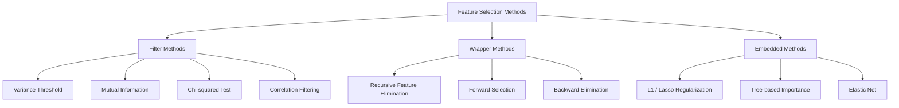
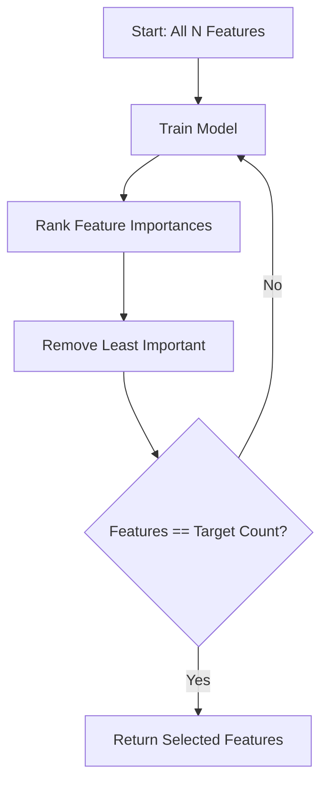
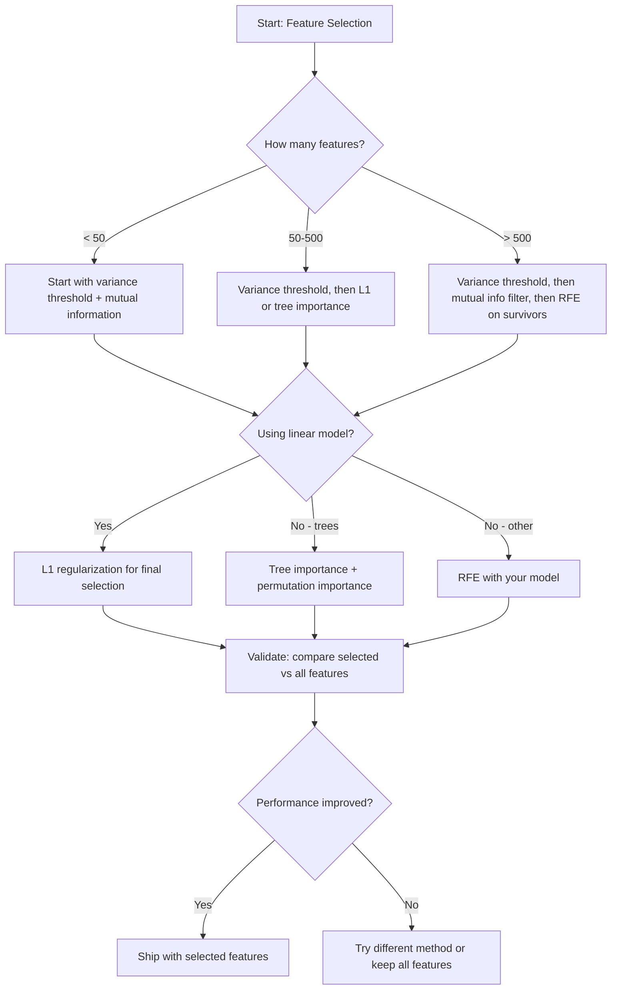

# Feature Selection
# 特征选择


> More features is not better. The right features is better.

> 特征不是越多越好。对的才好。

**Type:** Build | **类型：** 构建
**Language:** Python | **语言：** Python
**Prerequisites:** Phase 2, Lessons 01-09, 08 (feature engineering) | **前置知识：** Phase 2 第 1-9 课、第 8 课（特征工程）
**Time:** ~75 minutes | **时间：** 约 75 分钟

## Learning Objectives | 学习目标

- Implement filter methods (variance threshold, mutual information, chi-squared) and wrapper methods (RFE, forward selection) from scratch
  从零实现过滤法（方差阈值、互信息、卡方检验）和包装法（RFE、前向选择）
- Explain why mutual information captures nonlinear feature-target relationships that correlation misses
  解释为什么互信息能捕获相关性错过的非线性特征-目标关系
- Compare L1 regularization (embedded selection) with RFE (wrapper selection) and evaluate their computational tradeoffs
  比较 L1 正则化（嵌入选择）与 RFE（包装选择），评估它们的计算权衡
- Build a feature selection pipeline that combines multiple methods and demonstrate improved generalization on held-out data
  构建结合多种方法的特征选择管线，展示在留出数据上的泛化改进


> **【中文解读】**
> 特征选择从众多特征中挑出最有用的子集。过滤法（相关性）、包装法（递归特征消除）、嵌入法（L1 正则化）是三大类方法。sklearn 中的 SelectKBest/RFE。减少特征数能提升模型速度和泛化能力。

> **【拓展：特征选择在工业界的重要性】**
> 在金融风控模型中，监管要求模型可解释——必须能解释每个特征为什么被选用。L1 正则化（Lasso）自动将不重要特征的权重压缩为零，同时实现特征选择和模型训练。在基因表达分析中，从 2 万个基因中选出 50 个关键基因不仅提升模型性能，还为疾病机制研究提供线索。Netflix Prize 获胜方案中，特征选择将数万候选特征缩减到数百个。

## The Problem | 问题引入

You have 500 features. Your model trains slowly, overfits constantly, and nobody can explain what it learned. You add more features hoping to improve performance. It gets worse.

> 你有 500 个特征。模型训练慢、持续过拟合，没人能解释它学到了什么。你添加更多特征希望改善性能。结果更差。

This is the curse of dimensionality in action. As the number of features grows, the volume of the feature space explodes. Data points become sparse. Distances between points converge. The model needs exponentially more data to find real patterns. Noise features drown out signal features. Overfitting becomes the default.

> 这就是维度诅咒的实际运作。随着特征数量增长，特征空间的体积爆炸。数据点变得稀疏。点之间的距离趋同。模型需要指数级更多的数据来找到真实模式。噪声特征淹没了信号特征。过拟合成为默认。

Feature selection is the antidote. Strip away the noise. Remove the redundancy. Keep the features that carry actual information about the target. The result: faster training, better generalization, and models you can actually explain.

> 特征选择是解药。去掉噪声。去除冗余。保留真正携带目标信息的特征。结果是：更快的训练、更好的泛化，以及你能真正解释的模型。

The goal is not to use all available information. It is to use the right information.

> 目标不是使用所有可用信息。而是使用正确的信息。

> **【中文解读】**
> 特征选择三大类方法各有优劣：过滤法（方差阈值、互信息、卡方检验）最快但忽略特征间的交互；包装法（递归特征消除 RFE、前向选择）考虑了特征组合但计算成本高；嵌入法（L1 正则化、树模型特征重要性）在训练过程中自动选择特征，是效率与效果的最佳平衡。互信息能捕获非线性关系，比相关系数更全面。

## The Concept | 核心概念

### Three Categories of Feature Selection

Every feature selection method falls into one of three categories:

> 每种特征选择方法都属于以下三类之一：



**Filter methods** score each feature independently using a statistical measure. They do not use a model. Fast, but they miss feature interactions.

> **过滤法**使用统计度量独立地对每个特征评分。不使用模型。快速，但遗漏特征交互。

**Wrapper methods** train a model to evaluate feature subsets. They use model performance as the score. Better results, but expensive because they retrain the model many times.

> **包装法**训练模型来评估特征子集。使用模型性能作为分数。结果更好，但代价高，因为需要多次重新训练模型。

**Embedded methods** select features as part of model training. L1 regularization drives weights to zero. Decision trees split on the most useful features. Selection happens during fitting, not as a separate step.

> **嵌入法**在模型训练过程中选择特征。L1 正则化将权重驱动为零。决策树在最有用的特征上分裂。选择在拟合过程中发生，而不是作为单独的步骤。

### Variance Threshold

The simplest filter. If a feature barely varies across samples, it carries almost no information.

> 最简单的过滤器。如果一个特征在样本间几乎不变，它几乎不携带信息。

Consider a feature that is 0.0 for 999 out of 1000 samples. Its variance is near zero. No model can use it to distinguish between classes. Remove it.

> 考虑一个 1000 个样本中有 999 个值为 0.0 的特征。它的方差接近零。没有模型能用它来区分类别。移除它。

```
variance(x) = mean((x - mean(x))^2)
```

Set a threshold (e.g., 0.01). Drop every feature with variance below it. This removes constant or near-constant features without looking at the target variable at all.

> 设置一个阈值（如 0.01）。删除方差低于该值的每个特征。这完全不需要看目标变量就能移除常量或近似常量的特征。

When to use it: as a preprocessing step before other methods. It catches obviously useless features at near-zero cost.

> 何时使用：作为其他方法之前的预处理步骤。以接近零的成本捕获明显无用的特征。

Limitation: a feature can have high variance and still be pure noise. Variance threshold is necessary but not sufficient.

> 局限性：一个特征可能有高方差但仍然是纯噪声。方差阈值是必要但不充分的。

### Mutual Information

Mutual information measures how much knowing the value of feature X reduces uncertainty about target Y.

> 互信息衡量知道特征 X 的值能在多大程度上减少对目标 Y 的不确定性。

```
I(X; Y) = sum_x sum_y p(x, y) * log(p(x, y) / (p(x) * p(y)))
```

If X and Y are independent, p(x, y) = p(x) * p(y), so the log term is zero and I(X; Y) = 0. The more X tells you about Y, the higher the mutual information.

> 如果 X 和 Y 独立，p(x, y) = p(x) * p(y)，因此对数项为零，I(X; Y) = 0。X 告诉你关于 Y 的信息越多，互信息越高。

Key advantage over correlation: mutual information captures nonlinear relationships. A feature might have zero correlation with the target but high mutual information because the relationship is quadratic or periodic.

> 相对于相关性的关键优势：互信息捕获非线性关系。一个特征可能与目标的相关性为零，但由于关系是二次的或周期的，互信息很高。

For continuous features, discretize into bins first (histogram-based estimation). The number of bins affects the estimate -- too few bins lose information, too many bins add noise. A common choice: sqrt(n) bins or Sturges' rule (1 + log2(n)).

> 对于连续特征，先离散化为分箱（基于直方图的估计）。分箱数影响估计——太少分箱丢失信息，太多分箱增加噪声。常见选择：sqrt(n) 个分箱或 Sturges 规则 (1 + log2(n))。


### Recursive Feature Elimination (RFE)

RFE is a wrapper method. It uses a model's own feature importance to iteratively prune:

> RFE 是一种包装法。它使用模型自身的特征重要性来迭代剪枝：

1. Train the model with all features
   用所有特征训练模型
2. Rank features by importance (coefficients for linear models, impurity reduction for trees)
   按重要性排列特征（线性模型用系数，树模型用不纯度减少）
3. Remove the least important feature(s)
   移除最不重要的特征
4. Repeat until the desired number of features remains
   重复直到剩余所需的特征数量



RFE considers feature interactions because the model sees all remaining features together. Removing one feature changes the importance of others. This makes it more thorough than filter methods.

> RFE 考虑特征交互，因为模型看到所有剩余特征在一起。移除一个特征会改变其他特征的重要性。这使它比过滤法更彻底。

The cost: you train the model N - target times. With 500 features and a target of 10, that is 490 training runs. For expensive models, this is slow. You can speed it up by removing multiple features per step (e.g., remove the bottom 10% each round).

> 代价：你需要训练模型 N - 目标 次数。500 个特征和目标 10 个，就是 490 次训练。对于昂贵的模型，这很慢。你可以通过每步移除多个特征来加速（如每轮移除底部 10%）。

### L1 (Lasso) Regularization

L1 regularization adds the absolute value of weights to the loss function:

```
loss = prediction_error + alpha * sum(|w_i|)
```

The alpha parameter controls how aggressively features are pruned. Higher alpha means more weights go to exactly zero.

> alpha 参数控制特征被剪枝的激进程度。更高的 alpha 意味着更多权重变为精确的零。

Why exactly zero? The L1 penalty creates a diamond-shaped constraint region in weight space. The optimal solution tends to land at a corner of this diamond, where one or more weights are zero. L2 regularization (ridge) creates a circular constraint where weights shrink but rarely hit zero.

> 为什么精确为零？L1 惩罚在权重空间中创建菱形约束区域。最优解倾向于落在菱形的角上，那里一个或多个权重为零。L2 正则化（Ridge）创建圆形约束，权重缩小但很少变为零。

This is embedded feature selection: the model learns during training which features to ignore. Features with zero weight are effectively removed.

> 这是嵌入特征选择：模型在训练过程中学习忽略哪些特征。权重为零的特征实际上被移除了。

Advantages: single training run, handles correlated features (picks one and zeros the others), built into most linear model implementations.

> 优势：单次训练运行，处理相关特征（选择一个并将其他置零），内置于大多数线性模型实现中。

Limitation: only works for linear models. Cannot capture nonlinear feature importance.

> 局限性：仅适用于线性模型。无法捕获非线性特征重要性。

### Tree-Based Feature Importance

Decision trees and their ensembles (random forests, gradient boosting) naturally rank features. Every split reduces impurity (Gini or entropy for classification, variance for regression). Features that produce larger impurity reductions are more important.

> 决策树及其集成（随机森林、梯度提升）自然地对特征排名。每次分裂减少不纯度（分类用 Gini 或熵，回归用方差）。产生更大不纯度减少的特征更重要。

For a random forest with T trees:

```
importance(feature_j) = (1/T) * sum over all trees of
    sum over all nodes splitting on feature_j of
        (n_samples * impurity_decrease)
```

This gives a normalized importance score for each feature. It handles nonlinear relationships and feature interactions automatically.

> 这给出每个特征的归一化重要性分数。它自动处理非线性关系和特征交互。

Caution: tree-based importance is biased toward features with many unique values (high cardinality). A random ID column will appear important because it perfectly splits every sample. Use permutation importance as a sanity check.

> 注意：树模型的重要性偏向具有许多唯一值的特征（高基数）。一个随机 ID 列会显得重要，因为它完美地分割每个样本。使用置换重要性作为合理性检查。

### Permutation Importance

A model-agnostic method:

> 一种与模型无关的方法：

1. Train the model and record baseline performance on validation data
   训练模型并记录验证数据上的基线性能
2. For each feature: shuffle its values randomly, measure the drop in performance
   对每个特征：随机打乱其值，测量性能下降
3. The bigger the drop, the more important the feature
   下降越大，特征越重要

If shuffling a feature does not hurt performance, the model does not depend on it. If performance collapses, that feature is critical.

> 如果打乱一个特征不影响性能，模型不依赖它。如果性能崩溃，该特征是关键的。

Permutation importance avoids the cardinality bias of tree-based importance. But it is slow: one full evaluation per feature, repeated multiple times for stability.

> 置换重要性避免了树模型重要性的基数偏差。但它很慢：每个特征一次完整评估，为稳定性需重复多次。

### Comparison Table

| Method | Type | Speed | Nonlinear | Feature Interactions |
|--------|------|-------|-----------|---------------------|
| Variance threshold | Filter | Very fast | No | No |
| Mutual information | Filter | Fast | Yes | No |
| Correlation filter | Filter | Fast | No | No |
| RFE | Wrapper | Slow | Depends on model | Yes |
| L1 / Lasso | Embedded | Fast | No (linear) | No |
| Tree importance | Embedded | Medium | Yes | Yes |
| Permutation importance | Model-agnostic | Slow | Yes | Yes |

### Decision Flowchart



## Build It | 动手实现

> **【中文解读】**
> 从零实现三类特征选择方法：过滤法（方差阈值、互信息、卡方检验——独立评估每个特征）、包装法（递归特征消除 RFE——反复训练模型去掉最不重要的特征）、嵌入法（L1 正则化 Lasso——训练时自动将不重要特征权重压缩为零）。通过合成数据（已知哪些特征有用）验证各方法的效果。

> **【拓展：特征选择在 LLM 时代的新意义】**
> 虽然深度学习号称"自动学习特征"，但特征选择在以下场景仍然关键：(1) 表格数据——特征选择可提升 XGBoost/LightGBM 的性能和训练速度；(2) 可解释性要求——医疗和金融领域需要解释哪些特征被使用；(3) 嵌入空间——即使是 Transformer，也需要在 embedding 维度上做"特征选择"（注意力机制本质上是一种动态特征选择）。OpenAI 的 GPT-4 技术报告提到，训练时使用了基于重要性的数据选择策略。

### Step 1: Generate synthetic data with known feature structure

```python
import numpy as np


def make_feature_selection_data(n_samples=500, seed=42):
    rng = np.random.RandomState(seed)

    x1 = rng.randn(n_samples)
    x2 = rng.randn(n_samples)
    x3 = rng.randn(n_samples)
    x4 = x1 + 0.1 * rng.randn(n_samples)
    x5 = x2 + 0.1 * rng.randn(n_samples)

    informative = np.column_stack([x1, x2, x3, x4, x5])

    correlated = np.column_stack([
        x1 * 0.9 + 0.1 * rng.randn(n_samples),
        x2 * 0.8 + 0.2 * rng.randn(n_samples),
        x3 * 0.7 + 0.3 * rng.randn(n_samples),
        x1 * 0.5 + x2 * 0.5 + 0.1 * rng.randn(n_samples),
        x2 * 0.6 + x3 * 0.4 + 0.1 * rng.randn(n_samples),
    ])

    noise = rng.randn(n_samples, 10) * 0.5

    X = np.hstack([informative, correlated, noise])
    y = (2 * x1 - 1.5 * x2 + x3 + 0.5 * rng.randn(n_samples) > 0).astype(int)

    feature_names = (
        [f"info_{i}" for i in range(5)]
        + [f"corr_{i}" for i in range(5)]
        + [f"noise_{i}" for i in range(10)]
    )

    return X, y, feature_names
```

We know the ground truth: features 0-4 are informative (plus 3 and 4 are correlated copies of 0 and 1), features 5-9 are correlated with informative features, features 10-19 are pure noise. A good selection method should rank 0-4 highest and 10-19 lowest.

> 我们知道真实情况：特征 0-4 是有信息的（加上 3 和 4 是 0 和 1 的相关副本），特征 5-9 与有信息特征相关，特征 10-19 是纯噪声。好的选择方法应该将 0-4 排最高，10-19 排最低。

### Step 2: Variance threshold

```python
def variance_threshold(X, threshold=0.01):
    variances = np.var(X, axis=0)
    mask = variances > threshold
    return mask, variances
```

### Step 3: Mutual information (discrete)

```python
def discretize(x, n_bins=10):
    min_val, max_val = x.min(), x.max()
    if max_val == min_val:
        return np.zeros_like(x, dtype=int)
    bin_edges = np.linspace(min_val, max_val, n_bins + 1)
    binned = np.digitize(x, bin_edges[1:-1])
    return binned


def mutual_information(X, y, n_bins=10):
    n_samples, n_features = X.shape
    mi_scores = np.zeros(n_features)

    y_vals, y_counts = np.unique(y, return_counts=True)
    p_y = y_counts / n_samples

    for f in range(n_features):
        x_binned = discretize(X[:, f], n_bins)
        x_vals, x_counts = np.unique(x_binned, return_counts=True)
        p_x = dict(zip(x_vals, x_counts / n_samples))

        mi = 0.0
        for xv in x_vals:
            for yi, yv in enumerate(y_vals):
                joint_mask = (x_binned == xv) & (y == yv)
                p_xy = np.sum(joint_mask) / n_samples
                if p_xy > 0:
                    mi += p_xy * np.log(p_xy / (p_x[xv] * p_y[yi]))
        mi_scores[f] = mi

    return mi_scores
```

### Step 4: Recursive Feature Elimination

```python
def simple_logistic_importance(X, y, lr=0.1, epochs=100):
    n_samples, n_features = X.shape
    w = np.zeros(n_features)
    b = 0.0

    for _ in range(epochs):
        z = X @ w + b
        pred = 1.0 / (1.0 + np.exp(-np.clip(z, -500, 500)))
        error = pred - y
        w -= lr * (X.T @ error) / n_samples
        b -= lr * np.mean(error)

    return w, b


def rfe(X, y, n_features_to_select=5, lr=0.1, epochs=100):
    n_total = X.shape[1]
    remaining = list(range(n_total))
    rankings = np.ones(n_total, dtype=int)
    rank = n_total

    while len(remaining) > n_features_to_select:
        X_subset = X[:, remaining]
        w, _ = simple_logistic_importance(X_subset, y, lr, epochs)
        importances = np.abs(w)

        least_idx = np.argmin(importances)
        original_idx = remaining[least_idx]
        rankings[original_idx] = rank
        rank -= 1
        remaining.pop(least_idx)

    for idx in remaining:
        rankings[idx] = 1

    selected_mask = rankings == 1
    return selected_mask, rankings
```

### Step 5: L1 feature selection

```python
def soft_threshold(w, alpha):
    return np.sign(w) * np.maximum(np.abs(w) - alpha, 0)


def l1_feature_selection(X, y, alpha=0.1, lr=0.01, epochs=500):
    n_samples, n_features = X.shape
    w = np.zeros(n_features)
    b = 0.0

    for _ in range(epochs):
        z = X @ w + b
        pred = 1.0 / (1.0 + np.exp(-np.clip(z, -500, 500)))
        error = pred - y

        gradient_w = (X.T @ error) / n_samples
        gradient_b = np.mean(error)

        w -= lr * gradient_w
        w = soft_threshold(w, lr * alpha)
        b -= lr * gradient_b

    selected_mask = np.abs(w) > 1e-6
    return selected_mask, w
```

### Step 6: Tree-based importance (simple decision tree)

```python
def gini_impurity(y):
    if len(y) == 0:
        return 0.0
    classes, counts = np.unique(y, return_counts=True)
    probs = counts / len(y)
    return 1.0 - np.sum(probs ** 2)


def best_split(X, y, feature_idx):
    values = np.unique(X[:, feature_idx])
    if len(values) <= 1:
        return None, -1.0

    best_threshold = None
    best_gain = -1.0
    parent_gini = gini_impurity(y)
    n = len(y)

    for i in range(len(values) - 1):
        threshold = (values[i] + values[i + 1]) / 2.0
        left_mask = X[:, feature_idx] <= threshold
        right_mask = ~left_mask

        n_left = np.sum(left_mask)
        n_right = np.sum(right_mask)

        if n_left == 0 or n_right == 0:
            continue

        gain = parent_gini - (n_left / n) * gini_impurity(y[left_mask]) - (n_right / n) * gini_impurity(y[right_mask])

        if gain > best_gain:
            best_gain = gain
            best_threshold = threshold

    return best_threshold, best_gain


def tree_importance(X, y, n_trees=50, max_depth=5, seed=42):
    rng = np.random.RandomState(seed)
    n_samples, n_features = X.shape
    importances = np.zeros(n_features)

    for _ in range(n_trees):
        sample_idx = rng.choice(n_samples, size=n_samples, replace=True)
        feature_subset = rng.choice(n_features, size=max(1, int(np.sqrt(n_features))), replace=False)

        X_boot = X[sample_idx]
        y_boot = y[sample_idx]

        tree_imp = _build_tree_importance(X_boot, y_boot, feature_subset, max_depth)
        importances += tree_imp

    total = importances.sum()
    if total > 0:
        importances /= total

    return importances


def _build_tree_importance(X, y, feature_subset, max_depth, depth=0):
    n_features = X.shape[1]
    importances = np.zeros(n_features)

    if depth >= max_depth or len(np.unique(y)) <= 1 or len(y) < 4:
        return importances

    best_feature = None
    best_threshold = None
    best_gain = -1.0

    for f in feature_subset:
        threshold, gain = best_split(X, y, f)
        if gain > best_gain:
            best_gain = gain
            best_feature = f
            best_threshold = threshold

    if best_feature is None or best_gain <= 0:
        return importances

    importances[best_feature] += best_gain * len(y)

    left_mask = X[:, best_feature] <= best_threshold
    right_mask = ~left_mask

    importances += _build_tree_importance(X[left_mask], y[left_mask], feature_subset, max_depth, depth + 1)
    importances += _build_tree_importance(X[right_mask], y[right_mask], feature_subset, max_depth, depth + 1)

    return importances
```

### Step 7: Run all methods and compare

The code file runs all five methods on the same synthetic dataset and prints a comparison table showing which features each method selects.

> 代码文件在同一个合成数据集上运行所有五种方法，并打印比较表显示每种方法选择了哪些特征。

## Use It | 用框架实现

With scikit-learn, feature selection is built into the pipeline:

> 使用 scikit-learn，特征选择内置于管线中：

```python
from sklearn.feature_selection import (
    VarianceThreshold,
    mutual_info_classif,
    RFE,
    SelectFromModel,
)
from sklearn.linear_model import Lasso, LogisticRegression
from sklearn.ensemble import RandomForestClassifier

vt = VarianceThreshold(threshold=0.01)
X_filtered = vt.fit_transform(X)

mi_scores = mutual_info_classif(X, y)
top_k = np.argsort(mi_scores)[-10:]

rfe_selector = RFE(LogisticRegression(), n_features_to_select=10)
rfe_selector.fit(X, y)
X_rfe = rfe_selector.transform(X)

lasso_selector = SelectFromModel(Lasso(alpha=0.01))
lasso_selector.fit(X, y)
X_lasso = lasso_selector.transform(X)

rf = RandomForestClassifier(n_estimators=100)
rf.fit(X, y)
importances = rf.feature_importances_
```

The from-scratch implementations show exactly what happens inside each method. Variance threshold is just computing `var(X, axis=0)` and applying a mask. Mutual information is counting joint and marginal frequencies in a contingency table. RFE is a loop that trains, ranks, and prunes. L1 is gradient descent with a soft-thresholding step. Tree importance accumulates impurity reductions across splits. No magic -- just statistics and loops.

> 从零实现准确展示了每种方法内部发生了什么。方差阈值就是计算 `var(X, axis=0)` 并应用掩码。互信息是计算列联表中的联合频率和边际频率。RFE 是一个训练、排序、剪枝的循环。L1 是带软阈值步骤的梯度下降。树重要性累积分裂间的不纯度减少。没有魔法——只有统计和循环。

The sklearn versions add robustness (e.g., mutual_info_classif uses k-NN density estimation instead of binning), speed (C implementations), and pipeline integration.

> sklearn 版本增加了鲁棒性（如 mutual_info_classif 使用 k-NN 密度估计而非分箱）、速度（C 实现）和管线集成。

## Ship It | 产出物

This lesson produces:
- `outputs/skill-feature-selector.md` -- a quick reference decision tree for choosing the right feature selection method

## Exercises | 练习题

1. **Forward selection**: implement the opposite of RFE. Start with zero features. At each step, add the feature that improves model performance the most. Stop when adding features no longer helps. Compare the selected features against RFE results. Which is faster? Which gives better results?
   1. 生成 100 个特征的数据集（其中 10 个与目标相关，90 个是噪声）。比较方差阈值、互信息和 L1 正则化在识别正确特征方面的效果。

2. **Stability selection**: run L1 feature selection 50 times, each time on a random 80% subsample of the data, with slightly different alpha values. Count how often each feature is selected. Features selected in > 80% of runs are "stable." Compare stable features against single-run L1 selection. Which is more reliable?
   2. 实现后向消除（从所有特征开始，逐个移除）。与前向选择比较效率和结果。

3. **Multicollinearity detection**: compute the correlation matrix for all features. Implement a function that, given a correlation threshold (e.g., 0.9), removes one feature from each highly-correlated pair (keeping the one with higher mutual information with the target). Test on the synthetic dataset and verify it removes the redundant correlated features.
   3. 在同一个数据集上比较 L1 正则化和 RFE 的选择结果。它们选出相同的特征吗？何时会不同？

4. **Feature selection pipeline**: chain variance threshold, mutual information filter, and RFE into a single pipeline. First remove near-zero-variance features, then keep the top 50% by mutual information, then run RFE on the survivors. Compare this pipeline against running RFE alone on all features. Is the pipeline faster? Is it equally accurate?
   4. 构建完整的特征选择管线：方差阈值 -> 相关性过滤 -> 互信息 -> L1。展示每步移除多少特征以及模型性能的变化。

5. **Permutation importance from scratch**: implement permutation importance. For each feature, shuffle its values 10 times, measure the average drop in F1 score. Compare the ranking against tree-based importance. Find cases where they disagree and explain why (hint: correlated features).

> **【中文解读】**
> 特征选择的实战策略：(1) 先用方差阈值去掉常数特征（方差接近零意味着没有信息）；(2) 用互信息筛选出与目标相关的特征（互信息能捕获非线性关系，比相关系数更全面）；(3) 用 RFE 或 L1 正则化精细选择（考虑特征间的交互）。多方法组合比单一方法更稳健。关键原则：特征选择必须在交叉验证循环内进行，否则会过拟合特征选择本身。

> **【拓展：递归特征消除（RFE）的工业应用】**
> RFE 在基因组学中被广泛使用——从 2 万个基因表达中选出最具预测力的 50-100 个基因，不仅提升模型性能，还为疾病标志物发现提供候选。在金融风控中，RFE 帮助从数百个候选特征中筛选出最终的入模特征。sklearn 的 RFE + RFECV（带交叉验证的 RFE）能自动确定最优特征数量，是实践中最常用的特征选择工具之一。

## Key Terms | 术语速查表

| Term | What people say | What it actually means |
|------|----------------|----------------------|
| Filter method | "Score features independently" | A feature selection approach that ranks features using a statistical measure without training a model, evaluating each feature in isolation |
| Wrapper method | "Use the model to pick features" | A feature selection approach that evaluates feature subsets by training a model and using its performance as the selection criterion |
| Embedded method | "The model selects features during training" | Feature selection that happens as part of model fitting, such as L1 regularization driving weights to zero |
| Mutual information | "How much one variable tells you about another" | A measure of the reduction in uncertainty about Y given knowledge of X, capturing both linear and nonlinear dependencies |
| Recursive Feature Elimination | "Train, rank, prune, repeat" | An iterative wrapper method that trains a model, removes the least important feature(s), and repeats until a target count is reached |
| L1 / Lasso regularization | "Penalty that kills features" | Adding the sum of absolute weight values to the loss function, which drives unimportant feature weights to exactly zero |
| Variance threshold | "Remove constant features" | Dropping features whose variance across samples falls below a specified threshold, filtering out features that carry no information |
| Feature importance | "Which features matter most" | A score indicating how much each feature contributes to model predictions, computed from split gains (trees) or coefficient magnitudes (linear) |
| Permutation importance | "Shuffle and measure the damage" | Evaluating feature importance by randomly shuffling each feature's values and measuring the resulting drop in model performance |
| Curse of dimensionality | "Too many features, not enough data" | The phenomenon where adding features increases the volume of the feature space exponentially, making data sparse and distances meaningless |

## Further Reading | 延伸阅读

- [An Introduction to Variable and Feature Selection (Guyon & Elisseeff, 2003)](https://jmlr.org/papers/v3/guyon03a.html) -- the foundational survey on feature selection methods, still widely referenced
  [Guyon & Elisseeff: An Introduction to Variable and Feature Selection (2003)](https://jmlr.org/papers/v3/guyon03a.html) - 特征选择综述
- [scikit-learn Feature Selection Guide](https://scikit-learn.org/stable/modules/feature_selection.html) -- practical reference for filter, wrapper, and embedded methods with code examples
  [scikit-learn 特征选择文档](https://scikit-learn.org/stable/modules/feature_selection.html)
- [Stability Selection (Meinshausen & Buhlmann, 2010)](https://arxiv.org/abs/0809.2932) -- combines subsampling with feature selection for robust, reproducible results
  [Feature Engineering and Selection](http://www.feat.engineering/) - 免费在线书籍
- [Beware Default Random Forest Importances (Strobl et al., 2007)](https://bmcbioinformatics.biomedcentral.com/articles/10.1186/1471-2105-8-25) -- demonstrates the cardinality bias in tree-based importance and proposes conditional importance as an alternative
