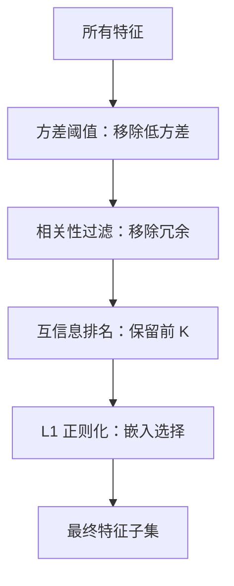

# 特征选择

> 特征不是越多越好。对的才好。

**类型：** 构建
**语言：** Python
**前置知识：** Phase 2 第 1-9 课、第 8 课（特征工程）
**时长：** 约 75 分钟

## 学习目标

- 从零实现过滤法（方差阈值、互信息、卡方检验）和包装法（RFE、前向选择）
- 解释为什么互信息能捕获相关性错过的非线性特征-目标关系
- 比较 L1 正则化（嵌入选择）与 RFE（包装选择），评估它们的计算权衡
- 构建结合多种方法的特征选择管线，展示在留出数据上的泛化改进

## 问题引入

你有 500 个特征。模型训练慢、不断过拟合、没人能解释它学到了什么。你加更多特征希望改善性能。结果更差了。

这是维度灾难在行动。随着特征数增加，特征空间的体积爆炸。数据点变稀疏。点之间的距离趋同。模型需要指数级更多的数据来发现真实模式。噪声特征淹没信号特征。过拟合成为默认。

特征选择是解药。剥离噪声。移除冗余。保留携带目标实际信息的特征。结果：更快的训练、更好的泛化、你能真正解释的模型。

目标不是使用所有可用信息。而是使用正确的信息。

## 核心概念

### 特征选择三大类别

每个特征选择方法属于三类之一：

**过滤法 (Filter Methods)：** 在建模前评估每个特征。快速，忽略特征交互。
- 方差阈值：移除几乎不变的特征
- 互信息：衡量特征和目标之间的信息共享
- 卡方检验：检验类别特征和目标之间的独立性
- 相关性：移除与目标高度不相关或与其他特征高度冗余的特征

**包装法 (Wrapper Methods)：** 使用模型评估特征子集。更准确但计算成本高。
- 递归特征消除 (RFE)：反复训练模型，移除最不重要的特征
- 前向选择：从零特征开始，逐个添加最改善性能的特征
- 后向消除：从所有特征开始，逐个移除最不影响性能的特征

**嵌入法 (Embedded Methods)：** 在训练过程中自动选择特征。效率与效果的平衡。
- L1 正则化 (Lasso)：将不重要特征的权重驱动到零
- 树模型特征重要性：树分裂自然提供特征排名
- Elastic Net：L1 和 L2 的混合

### 互信息 vs 相关性

相关性只捕获线性关系。互信息捕获任意关系（线性和非线性）。

```
# 线性关系：相关性和互信息都高
y = 3 * x + noise

# 非线性关系：相关性低但互信息高
y = x^2 + noise
y = sin(x) + noise
```

这就是为什么互信息通常是过滤法的更好选择。

### 递归特征消除 (RFE)

RFE 的工作方式：

1. 用所有特征训练模型
2. 排名特征重要性
3. 移除最不重要的特征
4. 重复直到达到目标特征数

每步需要一次完整训练。对于 500 个特征降到 50，需要训练 450 次。慢但有效。

### L1 正则化（Lasso）

L1 惩罚将某些权重精确推到零：

```
Loss = MSE + lambda * sum(|w_i|)
```

lambda 越大，越多权重为零。留下的权重对应的特征就是被选中的。L1 自然执行特征选择。

### 特征选择管线



实用工作流：
1. 方差阈值移除无信息特征（快）
2. 相关性过滤移除冗余特征（快）
3. 互信息排名候选特征（中等）
4. L1 正则化或 RFE 做最终选择（慢但准确）

## 动手实现

### 步骤 1：方差阈值

```python
def variance_threshold(X, threshold=0.01):
    n_features = len(X[0])
    n_samples = len(X)
    selected = []
    for j in range(n_features):
        col = [X[i][j] for i in range(n_samples)]
        mean = sum(col) / n_samples
        var = sum((v - mean) ** 2 for v in col) / n_samples
        if var >= threshold:
            selected.append(j)
    return selected
```

### 步骤 2：互信息

```python
def mutual_information(feature, target, n_bins=10):
    feat_min = min(feature)
    feat_max = max(feature)
    bin_width = (feat_max - feat_min) / n_bins if feat_max != feat_min else 1.0
    feat_binned = [min(int((f - feat_min) / bin_width), n_bins - 1) for f in feature]

    n = len(feature)
    target_classes = sorted(set(target))

    feat_bins = sorted(set(feat_binned))
    p_feat = {b: feat_binned.count(b) / n for b in feat_bins}
    p_target = {t: target.count(t) / n for t in target_classes}

    mi = 0.0
    for b in feat_bins:
        for t in target_classes:
            joint_count = sum(1 for fb, tv in zip(feat_binned, target) if fb == b and tv == t)
            p_joint = joint_count / n
            if p_joint > 0:
                mi += p_joint * math.log(p_joint / (p_feat[b] * p_target[t]))

    return mi
```

### 步骤 3：前向选择

```python
def forward_selection(X, y, model_fn, metric_fn, max_features=None):
    n_features = len(X[0])
    if max_features is None:
        max_features = n_features

    selected = []
    best_score = -float('inf')

    for _ in range(max_features):
        best_candidate = None
        current_best = best_score

        for j in range(n_features):
            if j in selected:
                continue
            trial = selected + [j]
            X_sub = [[X[i][f] for f in trial] for i in range(len(X))]
            model = model_fn()
            model.fit(X_sub, y)
            score = metric_fn(y, model.predict(X_sub))

            if score > current_best:
                current_best = score
                best_candidate = j

        if best_candidate is None:
            break
        selected.append(best_candidate)
        best_score = current_best

    return selected
```

完整实现见 `code/feature_selection.py`。

## 用框架实现

```python
from sklearn.feature_selection import SelectKBest, mutual_info_classif, RFE
from sklearn.linear_model import Lasso, LogisticRegression

# 过滤法：选择互信息最高的 K 个特征
selector = SelectKBest(mutual_info_classif, k=10)
X_selected = selector.fit_transform(X, y)

# 包装法：递归特征消除
rfe = RFE(LogisticRegression(), n_features_to_select=10)
X_selected = rfe.fit_transform(X, y)

# 嵌入法：L1 正则化
model = LogisticRegression(penalty='l1', solver='saga', C=0.1)
model.fit(X, y)
selected = [i for i, w in enumerate(model.coef_[0]) if w != 0]
```

## 产出物

本课产出 `code/feature_selection.py`。

## 练习题

1. 生成 100 个特征的数据集（其中 10 个与目标相关，90 个是噪声）。比较方差阈值、互信息和 L1 正则化在识别正确特征方面的效果。

2. 实现后向消除（从所有特征开始，逐个移除）。与前向选择比较效率和结果。

3. 在同一个数据集上比较 L1 正则化和 RFE 的选择结果。它们选出相同的特征吗？何时会不同？

4. 构建完整的特征选择管线：方差阈值 -> 相关性过滤 -> 互信息 -> L1。展示每步移除多少特征以及模型性能的变化。

## 术语速查表

| 术语 | 实际含义 |
|------|---------|
| 过滤法 (Filter Method) | 建模前基于统计检验评估每个特征 |
| 包装法 (Wrapper Method) | 使用模型评估特征子集的效果 |
| 嵌入法 (Embedded Method) | 训练过程中自动选择特征 |
| 互信息 (Mutual Information) | 衡量两个变量之间共享的信息量，能捕获非线性关系 |
| RFE | 递归特征消除，反复训练并移除最不重要的特征 |
| L1 正则化 (Lasso) | 通过惩罚权重的绝对值将不重要特征权重驱动到零 |
| 方差阈值 | 移除方差低于阈值的特征（几乎不变的特征） |
| 前向选择 | 从零特征开始，逐个添加最改善性能的特征 |

## 延伸阅读

- [Guyon & Elisseeff: An Introduction to Variable and Feature Selection (2003)](https://jmlr.org/papers/v3/guyon03a.html) - 特征选择综述
- [scikit-learn 特征选择文档](https://scikit-learn.org/stable/modules/feature_selection.html)
- [Feature Engineering and Selection](http://www.feat.engineering/) - 免费在线书籍
