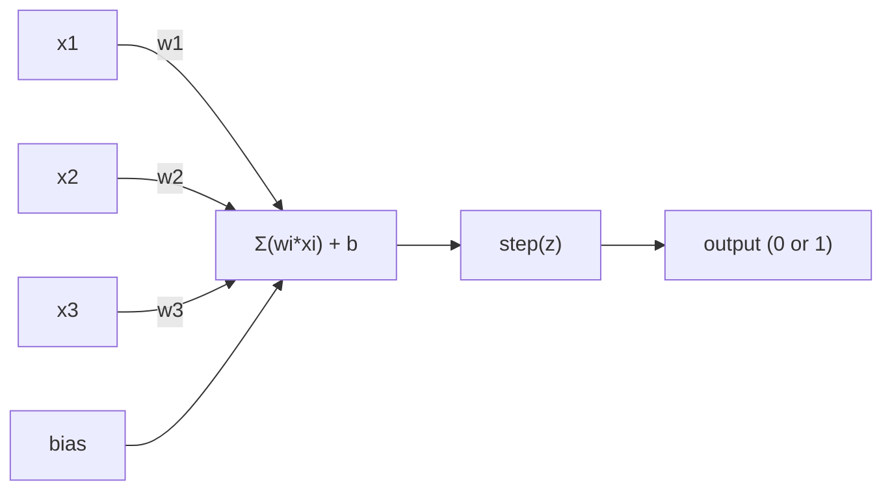
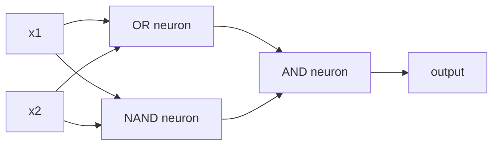

# The Perceptron | 感知机

> The perceptron is the atom of neural networks. Split it open and you find weights, a bias, and a decision.

> 感知机是神经网络的"原子"——拆开来看，里面就是权重、偏置和一个决策。

> **【中文解读】** 感知机是神经网络的"原子"——最小的学习单元。它做的事情极其简单：把输入乘上权重，加上偏置，然后做一个二选一的决策。理解感知机，就是理解"学习"在代码中到底意味着什么：不断调整数字，直到输出和现实吻合。

**Type:** Build
**Languages:** Python
**Prerequisites:** Phase 1 (Linear Algebra Intuition)
**Time:** ~60 minutes

## Learning Objectives | 学习目标

- Implement a perceptron from scratch in Python, including the weight update rule and step activation function
  从零用 Python 实现感知机，包括权重更新规则和阶跃激活函数
- Explain why a single perceptron can only solve linearly separable problems and demonstrate the XOR failure case
  解释为什么单个感知机只能解决线性可分问题，并演示 XOR 失败案例
- Construct a multi-layer perceptron by composing OR, NAND, and AND gates to solve XOR
  通过组合 OR、NAND 和 AND 门来构建多层感知机以解决 XOR
- Train a two-layer network with sigmoid activation and backpropagation to learn XOR automatically
  用 sigmoid 激活和反向传播训练两层网络自动学习 XOR

> **【中文解读】** 本章目标：从零实现感知机，理解为什么单个感知机只能解决线性可分问题（XOR 就是一个反例），然后通过组合多个感知机来突破这个限制，最终用反向传播自动学习权重。

## The Problem | 问题引入

You know vectors and dot products. You know that a matrix transforms inputs into outputs. But how does a machine *learn* which transformation to use?

> 你已经知道向量和点积。你知道矩阵可以将输入转换为输出。但机器如何*学会*使用哪种变换呢？

The perceptron answers this. It's the simplest possible learning machine: take some inputs, multiply by weights, add a bias, and make a binary decision. Then adjust. That's it. Every neural network ever built is layers of this idea stacked together.

> 感知机回答了这个问题。它是最简单的学习机器：接收输入，乘以权重，加上偏置，做出二分类决策，然后调整。就是这样。有史以来构建的每一个神经网络都是这个想法的层层堆叠。

Understanding the perceptron means understanding what "learning" actually means in code: adjusting numbers until the output matches reality.

> 理解感知机意味着理解代码中"学习"的真正含义：不断调整数字，直到输出与现实吻合。

> **【中文解读】** 你已经知道矩阵可以把输入变成输出。但机器怎么"学会"该用哪个变换？感知机给出了答案：输入乘权重、加偏置、做二分类决策、然后根据错误调整参数。所有神经网络——不管多复杂——都是这个简单想法的堆叠。

## The Concept | 核心概念

### One Neuron, One Decision | 一个神经元，一个决策

A perceptron takes n inputs, multiplies each by a weight, sums them up, adds a bias, and passes the result through an activation function.

> 感知机接收 n 个输入，将每个输入乘以权重，求和，加上偏置，然后通过激活函数输出结果。



The step function is brutal: if the weighted sum plus bias is >= 0, output 1. Otherwise, output 0.

> 阶跃函数很简单粗暴：如果加权和加偏置大于等于 0，输出 1；否则输出 0。

```
step(z) = 1  if z >= 0
           0  if z < 0
```

This is a linear classifier. The weights and bias define a line (or hyperplane in higher dimensions) that splits the input space into two regions.

> 这是一个线性分类器。权重和偏置定义了一条线（或高维空间中的超平面），将输入空间分成两个区域。

> **【中文解读】** 感知机的计算流程：输入 x 乘以权重 w，求和后加上偏置 b，最后通过阶跃函数输出 0 或 1。本质上就是一个线性分类器——权重和偏置在空间中画一条线（或超平面），把输入空间分成两个区域。

### The Decision Boundary | 决策边界

For two inputs, the perceptron draws a line through 2D space:

> 对于两个输入，感知机在二维空间中画一条直线：

```
  x2
  ┤
  │  Class 1        /
  │    (0)          /
  │                /
  │               / w1·x1 + w2·x2 + b = 0
  │              /
  │             /     Class 2
  │            /        (1)
  ┼───────────/──────────── x1
```

Everything on one side of the line outputs 0. Everything on the other side outputs 1. Training moves this line until it correctly separates the classes.

> 线的一侧全部输出 0，另一侧全部输出 1。训练的过程就是移动这条线，直到它正确地将不同类别分开。

> **【中文解读】** 决策边界就是 w·x + b = 0 这条线。训练的过程就是不断移动这条线，直到它把不同类别的数据正确分开。在深度学习中，每一层都在创建新的特征空间和新的决策边界。

### The Learning Rule | 学习规则

The perceptron learning rule is simple:

> 感知机的学习规则非常简单：

```
For each training example (x, y_true):     # 对每个训练样本
    y_pred = predict(x)                    # 预测输出
    error = y_true - y_pred                # 计算误差

    For each weight:                       # 对每个权重
        w_i = w_i + learning_rate * error * x_i   # 更新权重
    bias = bias + learning_rate * error    # 更新偏置
```

If the prediction is correct, error = 0, nothing changes. If it predicts 0 but should be 1, weights increase. If it predicts 1 but should be 0, weights decrease. The learning rate controls how big each adjustment is.

> 如果预测正确，误差为 0，不做任何调整。如果预测为 0 但应该是 1，权重增大。如果预测为 1 但应该是 0，权重减小。学习率控制每次调整的幅度。

> **【中文解读】** 感知机的学习规则非常直觉：预测对了就不动，预测错了就根据误差方向调整权重。这个规则是所有梯度下降算法的鼻祖——PyTorch 里的 `optimizer.step()` 做的事情本质上是一样的，只是计算更复杂。

> **【拓展：梯度下降的起源】** 感知机学习规则是最简单的梯度下降。现代深度学习中的 SGD（随机梯度下降）、Adam 优化器都是这个思想的延伸。区别在于：感知机用固定的学习率和手动计算梯度，而 Adam 会自适应调整学习率。

### The XOR Problem | XOR 问题

Here's where it breaks. Look at these logic gates:

> 这就是感知机失效的地方。看看这些逻辑门：

```
AND gate:           OR gate:            XOR gate:
x1  x2  out         x1  x2  out         x1  x2  out
0   0   0           0   0   0           0   0   0
0   1   0           0   1   1           0   1   1
1   0   0           1   0   1           1   0   1
1   1   1           1   1   1           1   1   0
```

AND and OR are linearly separable: you can draw a single line to separate the 0s from the 1s. XOR is not. No single line can separate [0,1] and [1,0] from [0,0] and [1,1].

> AND 和 OR 是线性可分的：你可以画一条直线将 0 和 1 分开。XOR 不是。没有一条直线能将 [0,1] 和 [1,0] 与 [0,0] 和 [1,1] 分开。

```
AND (separable):        XOR (not separable):

  x2                      x2
  1 ┤  0     1            1 ┤  1     0
    │     /                 │
  0 ┤  0 / 0              0 ┤  0     1
    ┼──/──────── x1         ┼──────────── x1
       line works!          no single line works!
```

This is a fundamental limit. A single perceptron can only solve linearly separable problems. Minsky and Papert proved this in 1969 and it nearly killed neural network research for a decade.

> 这是一个根本性的限制。单个感知机只能解决线性可分问题。Minsky 和 Papert 在 1969 年证明了这一点，这几乎让神经网络研究停滞了十年。

The fix: stack perceptrons into layers. A multi-layer perceptron can solve XOR by combining two linear decisions into a nonlinear one.

> 解决方案：将感知机堆叠成层。多层感知机可以通过将两个线性决策组合成一个非线性决策来解决 XOR。

> **【中文解读】** XOR 问题是感知机的"阿喀琉斯之踵"：无论你怎么画直线，都无法把 XOR 的两类输出分开。1969 年 Minsky 和 Papert 证明了这一点，直接导致了神经网络研究的"第一个寒冬"。但解法也很优雅：把多个感知机叠成多层，用两条直线组合出非线性的决策边界。这就是多层感知机（MLP）的起源。

> **【拓展：为什么深度学习需要"深"】** 单层感知机只能画直线，两层可以画折线，三层可以画任意形状。层数越多，能表达的函数越复杂。这就是为什么 GPT-4 有近 100 层 Transformer——每多一层，模型就能表达更复杂的模式。从感知机到 GPT，核心思想一脉相承。

## Build It | 动手构建

### Step 1: The Perceptron class

```python
class Perceptron:
    def __init__(self, n_inputs, learning_rate=0.1):
        self.weights = [0.0] * n_inputs   # 权重初始化为 0
        self.bias = 0.0                    # 偏置初始化为 0
        self.lr = learning_rate            # 学习率控制每次调整的幅度

    def predict(self, inputs):
        total = sum(w * x for w, x in zip(self.weights, inputs))  # 加权求和：w·x
        total += self.bias                                         # 加偏置：w·x + b
        return 1 if total >= 0 else 0       # 阶跃函数：>=0 输出 1，否则输出 0

    def train(self, training_data, epochs=100):
        for epoch in range(epochs):
            errors = 0
            for inputs, target in training_data:
                prediction = self.predict(inputs)   # 前向预测
                error = target - prediction          # 计算误差
                if error != 0:
                    errors += 1
                    for i in range(len(self.weights)):
                        self.weights[i] += self.lr * error * inputs[i]  # 权重更新
                    self.bias += self.lr * error      # 偏置更新
            if errors == 0:
                print(f"Converged at epoch {epoch + 1}")  # 全部正确，收敛
                return
        print(f"Did not converge after {epochs} epochs")
```

### Step 2: Train on logic gates | 在逻辑门上训练

```python
and_data = [          # AND 逻辑门数据：两个输入都为 1 时输出 1
    ([0, 0], 0),
    ([0, 1], 0),
    ([1, 0], 0),
    ([1, 1], 1),
]

or_data = [           # OR 逻辑门数据：任一输入为 1 时输出 1
    ([0, 0], 0),
    ([0, 1], 1),
    ([1, 0], 1),
    ([1, 1], 1),
]

not_data = [          # NOT 逻辑门数据：取反
    ([0], 1),
    ([1], 0),
]

print("=== AND Gate ===")
p_and = Perceptron(2)
p_and.train(and_data)
for inputs, _ in and_data:
    print(f"  {inputs} -> {p_and.predict(inputs)}")

print("\n=== OR Gate ===")
p_or = Perceptron(2)
p_or.train(or_data)
for inputs, _ in or_data:
    print(f"  {inputs} -> {p_or.predict(inputs)}")

print("\n=== NOT Gate ===")
p_not = Perceptron(1)
p_not.train(not_data)
for inputs, _ in not_data:
    print(f"  {inputs} -> {p_not.predict(inputs)}")
```

### Step 3: Watch XOR fail | 观察 XOR 的失败

```python
xor_data = [         # XOR 逻辑门数据：两个输入不同时输出 1
    ([0, 0], 0),
    ([0, 1], 1),
    ([1, 0], 1),
    ([1, 1], 0),
]

print("\n=== XOR Gate (single perceptron) ===")
p_xor = Perceptron(2)
p_xor.train(xor_data, epochs=1000)   # 即使训练 1000 轮也无法收敛
for inputs, expected in xor_data:
    result = p_xor.predict(inputs)
    status = "OK" if result == expected else "WRONG"
    print(f"  {inputs} -> {result} (expected {expected}) {status}")
```

It will never converge. This is the hard proof that a single perceptron cannot learn XOR.

> 它永远不会收敛。这就是单个感知机无法学习 XOR 的铁证。

> **【中文解读】** 单个感知机训练 XOR 永远不会收敛——不管训练多少轮。这是数学上的硬限制：一条直线无法把 XOR 的四个点正确分成两类。

### Step 4: Solve XOR with two layers | 用两层网络解决 XOR

The trick: XOR = (x1 OR x2) AND NOT (x1 AND x2). Combine three perceptrons:

> 技巧：XOR = (x1 OR x2) AND NOT (x1 AND x2)。组合三个感知机：



```python
def xor_network(x1, x2):
    or_neuron = Perceptron(2)
    or_neuron.weights = [1.0, 1.0]     # OR 门的权重
    or_neuron.bias = -0.5              # OR 门的偏置

    nand_neuron = Perceptron(2)
    nand_neuron.weights = [-1.0, -1.0]  # NAND 门（AND 的取反）的权重
    nand_neuron.bias = 1.5              # NAND 门的偏置

    and_neuron = Perceptron(2)
    and_neuron.weights = [1.0, 1.0]     # AND 门的权重
    and_neuron.bias = -1.5              # AND 门的偏置

    hidden1 = or_neuron.predict([x1, x2])    # 隐藏层第 1 个神经元：OR
    hidden2 = nand_neuron.predict([x1, x2])  # 隐藏层第 2 个神经元：NAND
    output = and_neuron.predict([hidden1, hidden2])  # 输出层：AND
    return output


print("\n=== XOR Gate (multi-layer network) ===")
for inputs, expected in xor_data:
    result = xor_network(inputs[0], inputs[1])
    print(f"  {inputs} -> {result} (expected {expected})")
```

All four cases correct. Stacking perceptrons into layers creates decision boundaries that no single perceptron can produce.

> 四个案例全部正确。将感知机堆叠成层可以创建单个感知机无法产生的决策边界。

> **【中文解读】** 关键洞察：XOR = (x1 OR x2) AND NOT(x1 AND x2)。第一层用两个感知机分别做 OR 和 NAND（两条直线），第二层用 AND 把两个结果组合起来。这就用两条直线拼出了非线性的决策边界。这也是现代神经网络的基本原理——每一层都在做特征的组合变换。

### Step 5: Train a Two-Layer Network | 训练一个两层网络

Step 4 hand-wired the weights. That works for XOR, but not for real problems where you don't know the right weights in advance. The fix: replace the step function with sigmoid and learn the weights automatically through backpropagation.

> Step 4 手动设置了权重。这对 XOR 有效，但无法用于不知道正确权重的实际问题。解决方案：用 sigmoid 替换阶跃函数，通过反向传播自动学习权重。

```python
class TwoLayerNetwork:
    def __init__(self, learning_rate=0.5):
        import random
        random.seed(0)
        self.w_hidden = [[random.uniform(-1, 1), random.uniform(-1, 1)] for _ in range(2)]  # 隐藏层权重（2个神经元，各2个输入）
        self.b_hidden = [random.uniform(-1, 1), random.uniform(-1, 1)]   # 隐藏层偏置
        self.w_output = [random.uniform(-1, 1), random.uniform(-1, 1)]   # 输出层权重
        self.b_output = random.uniform(-1, 1)   # 输出层偏置
        self.lr = learning_rate

    def sigmoid(self, x):
        import math
        x = max(-500, min(500, x))   # 裁剪防止溢出
        return 1.0 / (1.0 + math.exp(-x))  # sigmoid 函数：σ(x) = 1/(1+e^(-x))

    def forward(self, inputs):
        self.inputs = inputs
        self.hidden_outputs = []
        for i in range(2):
            z = sum(w * x for w, x in zip(self.w_hidden[i], inputs)) + self.b_hidden[i]  # 隐藏层线性变换
            self.hidden_outputs.append(self.sigmoid(z))  # 隐藏层激活
        z_out = sum(w * h for w, h in zip(self.w_output, self.hidden_outputs)) + self.b_output  # 输出层线性变换
        self.output = self.sigmoid(z_out)   # 输出层激活
        return self.output

    def train(self, training_data, epochs=10000):
        for epoch in range(epochs):
            total_error = 0
            for inputs, target in training_data:
                output = self.forward(inputs)       # 前向传播
                error = target - output              # 误差 = 目标 - 预测
                total_error += error ** 2            # 累计平方误差

                d_output = error * output * (1 - output)   # 输出层梯度（链式法则）

                saved_w_output = self.w_output[:]
                hidden_deltas = []
                for i in range(2):
                    h = self.hidden_outputs[i]
                    hd = d_output * saved_w_output[i] * h * (1 - h)  # 隐藏层梯度（反向传播）
                    hidden_deltas.append(hd)

                # 更新输出层权重
                for i in range(2):
                    self.w_output[i] += self.lr * d_output * self.hidden_outputs[i]
                self.b_output += self.lr * d_output

                # 更新隐藏层权重
                for i in range(2):
                    for j in range(len(inputs)):
                        self.w_hidden[i][j] += self.lr * hidden_deltas[i] * inputs[j]
                    self.b_hidden[i] += self.lr * hidden_deltas[i]
```

```python
net = TwoLayerNetwork(learning_rate=2.0)
net.train(xor_data, epochs=10000)
for inputs, expected in xor_data:
    result = net.forward(inputs)
    predicted = 1 if result >= 0.5 else 0   # 以 0.5 为阈值做二分类
    print(f"  {inputs} -> {result:.4f} (rounded: {predicted}, expected {expected})")
```

Two key differences from Step 4. First, sigmoid replaces the step function -- it's smooth, so gradients exist. Second, the `train` method propagates error backward from output to hidden layer, adjusting every weight proportionally to its contribution to the error. That's backpropagation in 20 lines.

> 与 Step 4 有两个关键区别。首先，sigmoid 替换了阶跃函数——它是平滑的，所以梯度存在。其次，`train` 方法将误差从输出层向隐藏层反向传播，按每个权重对误差的贡献比例进行调整。这就是 20 行代码实现的反向传播。

This is the bridge to Lesson 03. The math behind `d_output` and `hidden_deltas` is the chain rule applied to the network graph. We'll derive it properly there.

> 这就是通向第 03 课的桥梁。`d_output` 和 `hidden_deltas` 背后的数学是链式法则在网络图上的应用。我们将在那里正式推导它。

> **【中文解读】** Step 4 是手动设定权重，但真实问题中我们不知道正确的权重。这里的突破是：用 sigmoid 替代阶跃函数（因为它可导），然后用反向传播（backpropagation）自动学习权重。`d_output` 和 `hidden_deltas` 就是链式法则的应用——从输出层往回算梯度，逐层调整。这就是 PyTorch 的 `loss.backward()` 在做的事情。

> **【拓展：PyTorch autograd 的原理】** PyTorch 的自动微分（autograd）本质上就是自动执行这里的反向传播过程。它在前向传播时记录计算图，然后调用 `backward()` 时沿着图反向传播梯度。手动写反向传播（像这里一样）是理解 autograd 的最好方式。

## Use It | 实际应用

Everything you just built from scratch exists in one import:

> 你刚才从零构建的所有功能都可以通过一个导入来实现：

```python
from sklearn.linear_model import Perceptron as SkPerceptron   # sklearn 内置的感知机
import numpy as np

X = np.array([[0,0],[0,1],[1,0],[1,1]])  # 输入数据
y = np.array([0, 0, 0, 1])               # AND 门的标签

clf = SkPerceptron(max_iter=100, tol=1e-3)  # 最多迭代 100 次，容差 0.001
clf.fit(X, y)                                # 训练
print([clf.predict([x])[0] for x in X])     # 预测所有样本
```

Five lines. Your 30-line `Perceptron` class does the same thing. The sklearn version adds convergence checks, multiple loss functions, and sparse input support -- but the core loop is identical: weighted sum, step function, weight update on error.

> 五行代码。你 30 行的 `Perceptron` 类做的是同样的事情。sklearn 版本增加了收敛检查、多种损失函数和稀疏输入支持——但核心循环完全相同：加权和、阶跃函数、按误差更新权重。

The real gap shows up at scale. What changes in production networks:

> 真正的差距体现在规模上。生产环境中的网络有以下变化：

- The step function becomes sigmoid, ReLU, or other smooth activations
  阶跃函数变成 sigmoid、ReLU 或其他平滑激活函数
- Weights are learned automatically via backpropagation (Lesson 03)
  权重通过反向传播自动学习（第 03 课）
- Layers get deeper: 3, 10, 100+ layers
  层数变得更深：3 层、10 层、100+ 层
- The same principle holds: each layer creates new features from the previous layer's outputs
  基本原理不变：每一层从前一层的输出中创建新特征

A single perceptron can only draw straight lines. Stack them, and you can draw any shape.

> 单个感知机只能画直线。把它们堆叠起来，你就能画出任何形状。

> **【中文解读】** sklearn 里的 Perceptron 五行代码就搞定了我们 30 行做的事情。核心逻辑完全相同：加权求和、阶跃函数、按误差更新权重。真正的差距在规模：现代网络用可导的激活函数（如 ReLU）、用反向传播自动学习、有几十到上百层。但基本原理永远是：每一层从上一层的输出中创建新特征。

## Ship It | 输出物

This lesson produces:
- `outputs/skill-perceptron.md` - a skill covering when single-layer vs multi-layer architectures are needed

> 本课产出：`outputs/skill-perceptron.md` - 一个关于何时使用单层与多层架构的技能文档

## Exercises | 练习题

1. Train a perceptron on a NAND gate (the universal gate - any logic circuit can be built from NAND). Verify its weights and bias form a valid decision boundary.
   > **练习 1：** 用感知机训练 NAND 门（通用逻辑门——任何逻辑电路都可以用 NAND 搭建）。验证学到的权重和偏置是否形成有效的决策边界。

2. Modify the Perceptron class to track the decision boundary (w1\*x1 + w2\*x2 + b = 0) at each epoch. Print how the line shifts during training on the AND gate.
   > **练习 2：** 修改 Perceptron 类，在每个 epoch 记录决策边界 (w1\*x1 + w2\*x2 + b = 0)。打印在训练 AND 门时这条线是如何移动的。

3. Build a 3-input perceptron that outputs 1 only when at least 2 of the 3 inputs are 1 (a majority vote function). Is this linearly separable? Why?
   > **练习 3：** 构建一个 3 输入感知机，当至少 2 个输入为 1 时输出 1（多数投票函数）。这个函数是线性可分的吗？为什么？

## Key Terms | 关键术语

| Term | What people say | What it actually means |
|------|----------------|----------------------|
| Perceptron | "A fake neuron" | A linear classifier: dot product of inputs and weights, plus bias, through a step function |
| Weight | "How important an input is" | A multiplier that scales each input's contribution to the decision |
| Bias | "The threshold" | A constant that shifts the decision boundary, letting the perceptron fire even with zero inputs |
| Activation function | "The thing that squishes values" | A function applied after the weighted sum - step function for perceptrons, sigmoid/ReLU for modern networks |
| Linearly separable | "You can draw a line between them" | A dataset where a single hyperplane can perfectly separate the classes |
| XOR problem | "The thing perceptrons can't do" | Proof that single-layer networks cannot learn non-linearly-separable functions |
| Decision boundary | "Where the classifier switches" | The hyperplane w\*x + b = 0 that divides input space into two classes |
| Multi-layer perceptron | "A real neural network" | Perceptrons stacked in layers, where each layer's output feeds the next layer's input |

| 术语 | 通俗说法 | 实际含义 |
|------|---------|---------|
| 感知机 (Perceptron) | "假神经元" | 线性分类器：输入与权重的点积加偏置，过阶跃函数 |
| 权重 (Weight) | "输入的重要性" | 缩放每个输入对决策贡献的乘数 |
| 偏置 (Bias) | "阈值" | 偏移决策边界的常数，让感知机在全零输入时也能激活 |
| 激活函数 (Activation function) | "压扁数值的东西" | 加权求和后施加的函数——感知机用阶跃函数，现代网络用 sigmoid/ReLU |
| 线性可分 (Linearly separable) | "能画线分开" | 数据集可以用一个超平面完美分成两类 |
| XOR 问题 | "感知机做不到的事" | 证明单层网络无法学习非线性可分函数 |
| 决策边界 (Decision boundary) | "分类器切换的地方" | w\*x + b = 0 这个超平面，把输入空间分成两类区域 |
| 多层感知机 (MLP) | "真正的神经网络" | 感知机按层堆叠，每层的输出是下一层的输入 |

## Further Reading | 延伸阅读

- Frank Rosenblatt, "The Perceptron: A Probabilistic Model for Information Storage and Organization in the Brain" (1958) -- the original paper that started it all
  Frank Rosenblatt，《感知机：大脑信息存储和组织的概率模型》(1958)——开创这一切的原始论文
- Minsky & Papert, "Perceptrons" (1969) -- the book that proved XOR was unsolvable by single-layer networks and killed perceptron research for a decade
  Minsky 和 Papert，《感知机》(1969)——证明单层网络无法解决 XOR 并使感知机研究停滞十年的著作
- Michael Nielsen, "Neural Networks and Deep Learning", Chapter 1 (http://neuralnetworksanddeeplearning.com/) -- free online, best visual explanation of how perceptrons compose into networks
  Michael Nielsen，《神经网络与深度学习》第 1 章——免费在线，关于感知机如何组合成网络的最佳可视化解释
