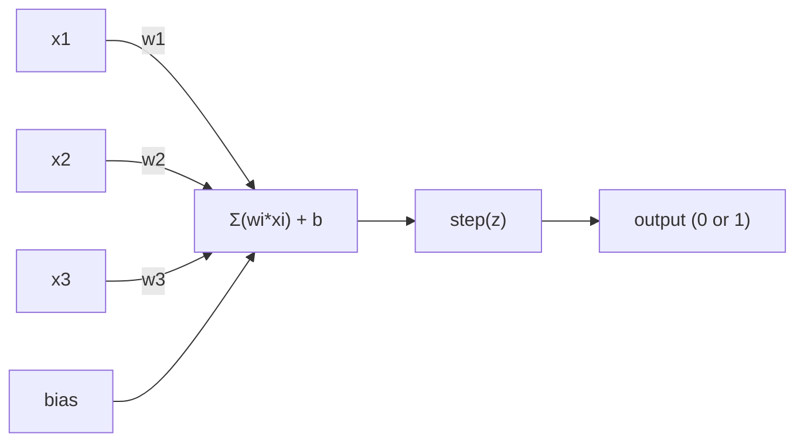
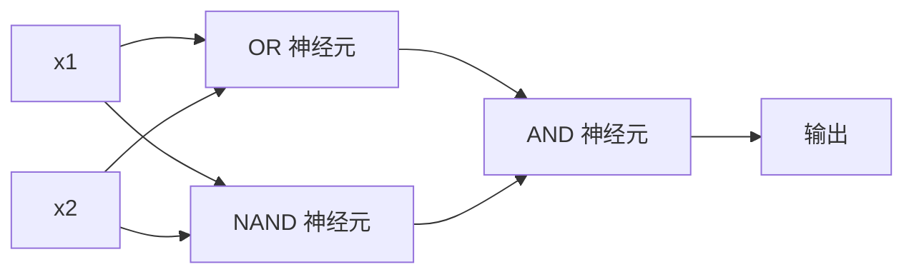

# 感知机

> 感知机是神经网络的"原子"——拆开它，你会发现权重、偏置和一个决策。

**类型：** 构建
**语言：** Python
**前置知识：** Phase 1（线性代数直觉）
**预计时间：** ~60 分钟

## 学习目标

- 从零用 Python 实现感知机，包括权重更新规则和阶跃激活函数
- 解释为什么单个感知机只能解决线性可分问题，并演示 XOR 失败案例
- 通过组合 OR、NAND 和 AND 门来构建多层感知机以解决 XOR
- 用 sigmoid 激活和反向传播训练一个两层网络来自动学习 XOR

## 问题引入

你已经知道向量和点积。你知道矩阵将输入变换为输出。但机器怎么*学会*该用哪个变换？

感知机回答了这个问题。它是最简单的学习机器：接收一些输入，乘以权重，加偏置，做出二分类决策。然后调整。仅此而已。所有神经网络都是这个想法的层叠。

理解感知机就是理解"学习"在代码中到底意味着什么：不断调整数字，直到输出和现实吻合。

## 核心概念

### 一个神经元，一个决策

感知机接收 n 个输入，每个乘以权重，求和后加偏置，通过激活函数输出结果。



阶跃函数非常粗暴：如果加权和加偏置 >= 0，输出 1。否则输出 0。

```
step(z) = 1  if z >= 0
           0  if z < 0
```

这是一个线性分类器。权重和偏置定义了一条线（或在更高维度中的超平面），将输入空间分成两个区域。

### 决策边界

对于两个输入，感知机在二维空间中画一条线：

```
  x2
  ┤
  │  类别 1        /
  │    (0)          /
  │                /
  │               / w1·x1 + w2·x2 + b = 0
  │              /
  │             /     类别 2
  │            /        (1)
  ┼───────────/──────────── x1
```

线的这一侧所有点输出 0，另一侧输出 1。训练的过程就是移动这条线，直到它正确分开不同类别。

### 学习规则

感知机的学习规则很简单：

```
对于每个训练样本 (x, y_true):
    y_pred = predict(x)                    # 预测输出
    error = y_true - y_pred                # 计算误差

    对于每个权重:
        w_i = w_i + learning_rate * error * x_i   # 更新权重
    bias = bias + learning_rate * error    # 更新偏置
```

如果预测正确，error = 0，不做任何改变。如果预测 0 但应该是 1，权重增加。如果预测 1 但应该是 0，权重减少。学习率控制每次调整的幅度。

这个学习规则是所有梯度下降算法的鼻祖——PyTorch 里的 `optimizer.step()` 做的事情本质上是一样的，只是计算更复杂。

### XOR 问题

这里就是感知机的局限所在。看看这些逻辑门：

```
AND 门:           OR 门:            XOR 门:
x1  x2  out         x1  x2  out         x1  x2  out
0   0   0           0   0   0           0   0   0
0   1   0           0   1   1           0   1   1
1   0   0           1   0   1           1   0   1
1   1   1           1   1   1           1   1   0
```

AND 和 OR 是线性可分的：你可以画一条直线把 0 和 1 分开。XOR 不是线性可分的。没有任何一条直线可以把 [0,1] 和 [1,0] 与 [0,0] 和 [1,1] 分开。

```
AND（可分离）:          XOR（不可分离）:

  x2                      x2
  1 ┤  0     1            1 ┤  1     0
    │     /                 │
  0 ┤  0 / 0              0 ┤  0     1
    ┼──/──────── x1         ┼──────────── x1
       直线可以！            没有任何直线可以！
```

这是根本性的限制。单个感知机只能解决线性可分的问题。Minsky 和 Papert 在 1969 年证明了这一点，几乎让神经网络研究停滞了十年。

解决方案：把感知机叠成层。多层感知机可以通过组合两个线性决策来创建非线性决策边界，从而解决 XOR。

这就是多层感知机（MLP）的起源。层数越多，能表达的函数越复杂。从感知机到 GPT，核心思想一脉相承。

## 动手实现

### 第一步：Perceptron 类

```python
class Perceptron:
    def __init__(self, n_inputs, learning_rate=0.1):
        self.weights = [0.0] * n_inputs   # 权重初始化为 0
        self.bias = 0.0                    # 偏置初始化为 0
        self.lr = learning_rate            # 学习率控制每次调整的幅度

    def predict(self, inputs):
        total = sum(w * x for w, x in zip(self.weights, inputs))  # 加权求和：w·x
        total += self.bias                                         # 加偏置：w·x + b
        return 1 if total >= 0 else 0       # 阶跃函数：>=0 输出 1，否则输出 0

    def train(self, training_data, epochs=100):
        for epoch in range(epochs):
            errors = 0
            for inputs, target in training_data:
                prediction = self.predict(inputs)   # 前向预测
                error = target - prediction          # 计算误差
                if error != 0:
                    errors += 1
                    for i in range(len(self.weights)):
                        self.weights[i] += self.lr * error * inputs[i]  # 权重更新
                    self.bias += self.lr * error      # 偏置更新
            if errors == 0:
                print(f"在第 {epoch + 1} 轮收敛")
                return
        print(f"训练 {epochs} 轮后未收敛")
```

### 第二步：在逻辑门上训练

```python
and_data = [          # AND 逻辑门数据：两个输入都为 1 时输出 1
    ([0, 0], 0),
    ([0, 1], 0),
    ([1, 0], 0),
    ([1, 1], 1),
]

or_data = [           # OR 逻辑门数据：任一输入为 1 时输出 1
    ([0, 0], 0),
    ([0, 1], 1),
    ([1, 0], 1),
    ([1, 1], 1),
]

not_data = [          # NOT 逻辑门数据：取反
    ([0], 1),
    ([1], 0),
]

print("=== AND 门 ===")
p_and = Perceptron(2)
p_and.train(and_data)
for inputs, _ in and_data:
    print(f"  {inputs} -> {p_and.predict(inputs)}")

print("\n=== OR 门 ===")
p_or = Perceptron(2)
p_or.train(or_data)
for inputs, _ in or_data:
    print(f"  {inputs} -> {p_or.predict(inputs)}")

print("\n=== NOT 门 ===")
p_not = Perceptron(1)
p_not.train(not_data)
for inputs, _ in not_data:
    print(f"  {inputs} -> {p_not.predict(inputs)}")
```

### 第三步：观察 XOR 的失败

```python
xor_data = [         # XOR 逻辑门数据：两个输入不同时输出 1
    ([0, 0], 0),
    ([0, 1], 1),
    ([1, 0], 1),
    ([1, 1], 0),
]

print("\n=== XOR 门（单个感知机）===")
p_xor = Perceptron(2)
p_xor.train(xor_data, epochs=1000)   # 即使训练 1000 轮也无法收敛
for inputs, expected in xor_data:
    result = p_xor.predict(inputs)
    status = "正确" if result == expected else "错误"
    print(f"  {inputs} -> {result}（期望 {expected}）{status}")
```

它永远不会收敛。这就是单个感知机无法学习 XOR 的硬证明。

### 第四步：用两层网络解决 XOR

诀窍是：XOR = (x1 OR x2) AND NOT (x1 AND x2)。组合三个感知机：



```python
def xor_network(x1, x2):
    or_neuron = Perceptron(2)
    or_neuron.weights = [1.0, 1.0]     # OR 门的权重
    or_neuron.bias = -0.5              # OR 门的偏置

    nand_neuron = Perceptron(2)
    nand_neuron.weights = [-1.0, -1.0]  # NAND 门（AND 的取反）的权重
    nand_neuron.bias = 1.5              # NAND 门的偏置

    and_neuron = Perceptron(2)
    and_neuron.weights = [1.0, 1.0]     # AND 门的权重
    and_neuron.bias = -1.5              # AND 门的偏置

    hidden1 = or_neuron.predict([x1, x2])    # 隐藏层第 1 个神经元：OR
    hidden2 = nand_neuron.predict([x1, x2])  # 隐藏层第 2 个神经元：NAND
    output = and_neuron.predict([hidden1, hidden2])  # 输出层：AND
    return output


print("\n=== XOR 门（多层网络）===")
for inputs, expected in xor_data:
    result = xor_network(inputs[0], inputs[1])
    print(f"  {inputs} -> {result}（期望 {expected}）")
```

四个案例全部正确。把感知机叠成层可以创建单个感知机无法产生的决策边界。

关键洞察：XOR = (x1 OR x2) AND NOT(x1 AND x2)。第一层用两个感知机分别做 OR 和 NAND（两条直线），第二层用 AND 把两个结果组合起来。这就用两条直线拼出了非线性的决策边界。这也是现代神经网络的基本原理——每一层都在做特征的组合变换。

### 第五步：训练一个两层网络

第四步是手动设定权重。这对 XOR 管用，但在实际问题中你不知道正确的权重。解决方案：用 sigmoid 替代阶跃函数，通过反向传播自动学习权重。

```python
class TwoLayerNetwork:
    def __init__(self, learning_rate=0.5):
        import random
        random.seed(0)
        self.w_hidden = [[random.uniform(-1, 1), random.uniform(-1, 1)] for _ in range(2)]  # 隐藏层权重（2个神经元，各2个输入）
        self.b_hidden = [random.uniform(-1, 1), random.uniform(-1, 1)]   # 隐藏层偏置
        self.w_output = [random.uniform(-1, 1), random.uniform(-1, 1)]   # 输出层权重
        self.b_output = random.uniform(-1, 1)   # 输出层偏置
        self.lr = learning_rate

    def sigmoid(self, x):
        import math
        x = max(-500, min(500, x))   # 裁剪防止溢出
        return 1.0 / (1.0 + math.exp(-x))  # sigmoid 函数：σ(x) = 1/(1+e^(-x))

    def forward(self, inputs):
        self.inputs = inputs
        self.hidden_outputs = []
        for i in range(2):
            z = sum(w * x for w, x in zip(self.w_hidden[i], inputs)) + self.b_hidden[i]  # 隐藏层线性变换
            self.hidden_outputs.append(self.sigmoid(z))  # 隐藏层激活
        z_out = sum(w * h for w, h in zip(self.w_output, self.hidden_outputs)) + self.b_output  # 输出层线性变换
        self.output = self.sigmoid(z_out)   # 输出层激活
        return self.output

    def train(self, training_data, epochs=10000):
        for epoch in range(epochs):
            total_error = 0
            for inputs, target in training_data:
                output = self.forward(inputs)       # 前向传播
                error = target - output              # 误差 = 目标 - 预测
                total_error += error ** 2            # 累计平方误差

                d_output = error * output * (1 - output)   # 输出层梯度（链式法则）

                saved_w_output = self.w_output[:]
                hidden_deltas = []
                for i in range(2):
                    h = self.hidden_outputs[i]
                    hd = d_output * saved_w_output[i] * h * (1 - h)  # 隐藏层梯度（反向传播）
                    hidden_deltas.append(hd)

                # 更新输出层权重
                for i in range(2):
                    self.w_output[i] += self.lr * d_output * self.hidden_outputs[i]
                self.b_output += self.lr * d_output

                # 更新隐藏层权重
                for i in range(2):
                    for j in range(len(inputs)):
                        self.w_hidden[i][j] += self.lr * hidden_deltas[i] * inputs[j]
                    self.b_hidden[i] += self.lr * hidden_deltas[i]
```

```python
net = TwoLayerNetwork(learning_rate=2.0)
net.train(xor_data, epochs=10000)
for inputs, expected in xor_data:
    result = net.forward(inputs)
    predicted = 1 if result >= 0.5 else 0   # 以 0.5 为阈值做二分类
    print(f"  {inputs} -> {result:.4f}（取整: {predicted}，期望 {expected}）")
```

与第四步的两个关键区别。首先，sigmoid 替代了阶跃函数——它是平滑的，所以梯度存在。其次，`train` 方法将误差从输出层反向传播到隐藏层，按每个权重对误差的贡献比例进行调整。这就是 20 行代码的反向传播。

这是通往第 03 课的桥梁。`d_output` 和 `hidden_deltas` 背后的数学是链式法则在计算图上的应用。我们会在那里正式推导它。

## 用框架实现

你刚才从零构建的一切，一个 import 就能搞定：

```python
from sklearn.linear_model import Perceptron as SkPerceptron   # sklearn 内置的感知机
import numpy as np

X = np.array([[0,0],[0,1],[1,0],[1,1]])  # 输入数据
y = np.array([0, 0, 0, 1])               # AND 门的标签

clf = SkPerceptron(max_iter=100, tol=1e-3)  # 最多迭代 100 次，容差 0.001
clf.fit(X, y)                                # 训练
print([clf.predict([x])[0] for x in X])     # 预测所有样本
```

五行代码。你的 30 行 `Perceptron` 类做了同样的事情。sklearn 版本增加了收敛检查、多种损失函数和稀疏输入支持——但核心循环完全一致：加权求和、阶跃函数、按误差更新权重。

真正的差距在规模。生产环境中网络的变化：
- 阶跃函数变成 sigmoid、ReLU 或其他平滑激活函数
- 权重通过反向传播自动学习（第 03 课）
- 层数变深：3 层、10 层、100+ 层
- 原理不变：每一层从上一层的输出中创建新特征

单个感知机只能画直线。把它们叠起来，你可以画出任何形状。

## 产出物

本课产出：
- `outputs/skill-perceptron.md` - 一个关于何时需要单层 vs 多层架构的技能文档

## 练习题

1. 在 NAND 门上训练感知机（通用逻辑门——任何逻辑电路都可以用 NAND 搭建）。验证学到的权重和偏置是否形成有效的决策边界。

2. 修改 Perceptron 类，在每个 epoch 记录决策边界 (w1\*x1 + w2\*x2 + b = 0)。打印在训练 AND 门时这条线是如何移动的。

3. 构建一个 3 输入感知机，当至少 2 个输入为 1 时输出 1（多数投票函数）。这个函数是线性可分的吗？为什么？

## 术语速查表

| 术语 | 通俗说法 | 实际含义 |
|------|---------|---------|
| 感知机 (Perceptron) | "假神经元" | 线性分类器：输入与权重的点积加偏置，过阶跃函数 |
| 权重 (Weight) | "输入的重要性" | 缩放每个输入对决策贡献的乘数 |
| 偏置 (Bias) | "阈值" | 偏移决策边界的常数，让感知机在全零输入时也能激活 |
| 激活函数 (Activation function) | "压扁数值的东西" | 加权求和后施加的函数——感知机用阶跃函数，现代网络用 sigmoid/ReLU |
| 线性可分 (Linearly separable) | "能画线分开" | 数据集可以用一个超平面完美分成两类 |
| XOR 问题 | "感知机做不到的事" | 证明单层网络无法学习非线性可分函数 |
| 决策边界 (Decision boundary) | "分类器切换的地方" | w\*x + b = 0 这个超平面，把输入空间分成两类区域 |
| 多层感知机 (MLP) | "真正的神经网络" | 感知机按层堆叠，每层的输出是下一层的输入 |

## 延伸阅读

- Frank Rosenblatt, "The Perceptron: A Probabilistic Model for Information Storage and Organization in the Brain" (1958) —— 开山之作
- Minsky & Papert, "Perceptrons" (1969) —— 证明单层网络无法解决 XOR，导致感知机研究停滞十年
- Michael Nielsen, "Neural Networks and Deep Learning", Chapter 1 (http://neuralnetworksanddeeplearning.com/) —— 免费在线，感知机如何组合成网络的最佳可视化解释
