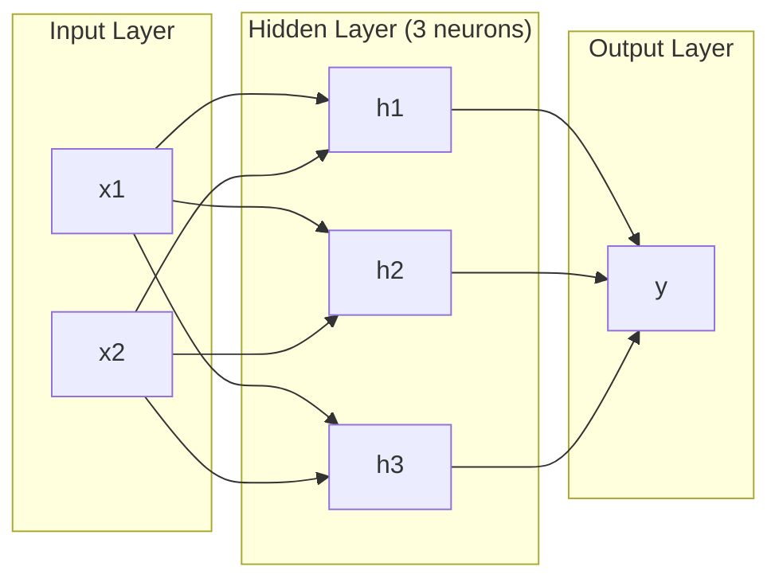
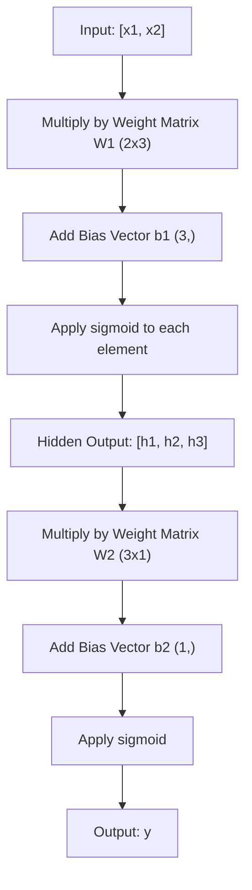
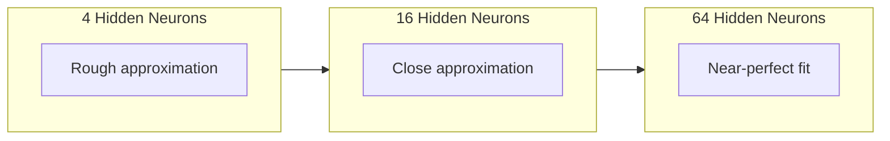

# Multi-Layer Networks and Forward Pass | 多层网络与前向传播

> One neuron draws a line. Stack them, and you can draw anything.

> **【中文解读】** 一个神经元只能画一条直线，但把多个神经元叠成多层，就能拟合任意形状的曲线。这就是多层网络的核心价值——用层的堆叠突破单层感知机的线性限制。

**Type:** Build
**Languages:** Python
**Prerequisites:** Phase 01 (Math Foundations), Lesson 03.01 (The Perceptron)
**Time:** ~90 minutes

## Learning Objectives | 学习目标

- Build a multi-layer network from scratch with Layer and Network classes that perform a complete forward pass
- Trace matrix dimensions through each layer of a network and identify shape mismatches
- Explain how stacking nonlinear activations enables a network to learn curved decision boundaries
- Solve the XOR problem using a 2-2-1 architecture with hand-tuned sigmoid weights

> **【中文解读】** 本章目标：从零构建 Layer 和 Network 类，理解前向传播中矩阵维度的变化，搞清楚为什么非线性激活函数让网络能学习弯曲的决策边界。

## The Problem | 问题引入

A single neuron is a line drawer. That's it. One straight line through your data. Every real problem in AI -- image recognition, language understanding, playing Go -- requires curves. Stacking neurons into layers is how you get curves.

In 1969, Minsky and Papert proved this limitation was fatal: a single-layer network cannot learn XOR. Not "struggles to learn" -- mathematically cannot. The XOR truth table places [0,1] and [1,0] on one side, [0,0] and [1,1] on the other. No single line separates them.

This killed neural network funding for over a decade. The fix was obvious in hindsight: stop using one layer. Stack neurons into layers. Let the first layer carve the input space into new features, and let the second layer combine those features into decisions no single line could make.

That stack is the multi-layer network. It is the foundation of every deep learning model in production today. The forward pass -- data flowing from input through hidden layers to output -- is the first thing you need to build before anything else works.

> **【中文解读】** 单个神经元只能画直线，但图像识别、语言理解、围棋这些真实 AI 任务都需要曲线。1969 年 Minsky 和 Papert 证明了单层网络无法学习 XOR（数学上不可能，不是"学不好"）。解法就是叠层：第一层把输入空间切成新特征，第二层把这些特征组合成更复杂的决策。这就是所有深度学习模型的基础。

## The Concept | 核心概念

### Layers: Input, Hidden, Output | 层：输入层、隐藏层、输出层

A multi-layer network has three types of layers:

**Input layer** -- not really a layer. It holds your raw data. Two features means two input nodes. No computation happens here.

**Hidden layers** -- where the work happens. Each neuron takes every output from the previous layer, applies weights and a bias, then passes the result through an activation function. "Hidden" because you never see these values directly in the training data.

**Output layer** -- the final answer. For binary classification, one neuron with sigmoid. For multi-class, one neuron per class.



This is a 2-3-1 network. Two inputs, three hidden neurons, one output. Every connection carries a weight. Every neuron (except input) carries a bias.

Each layer produces a vector of numbers called a hidden state. For text, hidden states increase dimensionality -- encoding a word as 768 numbers to capture semantic meaning. For images, they reduce dimensionality -- compressing millions of pixels into a manageable representation. The hidden state is where the learning lives.

> **【中文解读】** 三种层：输入层（只是数据入口，不计算）、隐藏层（做特征变换，"隐藏"是因为训练数据里看不到这些值）、输出层（最终答案）。每一层产出一个向量叫"隐藏状态"——文本任务中它增加维度（把词变成 768 维向量来捕捉语义），图像任务中它降低维度（压缩百万像素为紧凑表示）。学习就发生在这些隐藏状态中。

> **【拓展：Transformer 中的隐藏状态】** 在 GPT/BERT 中，每一层 Transformer 的输出也是一个隐藏状态（shape: [batch, seq_len, d_model]）。这些隐藏状态逐层"理解"输入的语义——低层捕捉语法，高层捕捉语义。这也是为什么可以通过 `model(x).hidden_states[-1]` 提取特征用于下游任务。

### Neurons and Activations | 神经元与激活函数

Each neuron does three things:

1. Multiply every input by its corresponding weight
2. Sum all the products and add a bias
3. Pass the sum through an activation function

For now, the activation is sigmoid:

```
sigmoid(z) = 1 / (1 + e^(-z))
```

Sigmoid squashes any number into the range (0, 1). Large positive inputs push toward 1. Large negative inputs push toward 0. Zero maps to 0.5. This smooth curve is what makes learning possible -- unlike the perceptron's hard step, sigmoid has a gradient everywhere.

> **【中文解读】** 每个神经元做三件事：输入乘权重、求和加偏置、过激活函数。Sigmoid 把任意数字压缩到 (0, 1) 区间。关键是它处处可导——这让梯度下降成为可能。感知机的阶跃函数在 0 处不可导，所以无法用梯度下降训练。

### Forward Pass: How Data Flows | 前向传播：数据如何流动

The forward pass pushes input data through the network, layer by layer, until it reaches the output. No learning happens during the forward pass. It is pure computation: multiply, add, activate, repeat.



At each layer, three operations happen in sequence:

```
z = W * input + b       (linear transformation)    # 线性变换
a = sigmoid(z)           (activation)                # 激活
```

The output of one layer becomes the input to the next. That is the entire forward pass.

> **【中文解读】** 前向传播就是数据从输入流到输出的过程——没有任何学习，纯粹的计算。每一层做两件事：线性变换（Wx + b）+ 非线性激活（sigmoid）。上一层的输出就是下一层的输入。这就是 PyTorch 里 `model(x)` 在做的事情。

### Matrix Dimensions | 矩阵维度

Tracking dimensions is the single most important debugging skill in deep learning. Here is the 2-3-1 network:

| Step | Operation | Dimensions | Result Shape |
|------|-----------|------------|-------------|
| Input | x | -- | (2,) |
| Hidden linear | W1 * x + b1 | W1: (3, 2), b1: (3,) | (3,) |
| Hidden activation | sigmoid(z1) | -- | (3,) |
| Output linear | W2 * h + b2 | W2: (1, 3), b2: (1,) | (1,) |
| Output activation | sigmoid(z2) | -- | (1,) |

| 步骤 | 操作 | 维度 | 结果形状 |
|------|------|------|---------|
| 输入 | x | -- | (2,) |
| 隐藏层线性变换 | W1 * x + b1 | W1: (3, 2), b1: (3,) | (3,) |
| 隐藏层激活 | sigmoid(z1) | -- | (3,) |
| 输出层线性变换 | W2 * h + b2 | W2: (1, 3), b2: (1,) | (1,) |
| 输出层激活 | sigmoid(z2) | -- | (1,) |

The rule: weight matrix W at layer k has shape (neurons_in_layer_k, neurons_in_layer_k_minus_1). Rows match the current layer. Columns match the previous layer. If the shapes do not line up, you have a bug.

> **【中文解读】** 追踪矩阵维度是深度学习中最重要的调试技能。规则很简单：第 k 层的权重矩阵 W 形状是 (第 k 层神经元数, 第 k-1 层神经元数)。行对应当前层，列对应上一层。维度不匹配就是 bug。

> **【拓展：维度不匹配是深度学习最常见的 bug】** 在 PyTorch 中，你经常看到 `RuntimeError: mat1 and mat2 shapes cannot be multiplied`。这就是维度不匹配。学会手动追踪维度，就能快速定位这类错误。现代工具如 `torchsummary` 或 `torchinfo` 可以帮你自动检查。

### Universal Approximation Theorem | 万能逼近定理

In 1989, George Cybenko proved something remarkable: a neural network with a single hidden layer and enough neurons can approximate any continuous function to any desired accuracy.

This does not mean one hidden layer is always best. It means the architecture is theoretically capable. In practice, deeper networks (more layers, fewer neurons per layer) learn the same functions with far fewer total parameters than shallow-wide networks. That is why deep learning works.

The intuition: each neuron in the hidden layer learns one "bump" or feature. Enough bumps placed in the right locations can approximate any smooth curve. More neurons, more bumps, better approximation.



> **【中文解读】** 万能逼近定理（1989）：一个隐藏层 + 足够多的神经元可以逼近任何连续函数。但这不代表一层就够了——实践中，"深而窄"的网络比"浅而宽"的更高效。直觉上，每个隐藏神经元学一个"凸起"或特征，足够多的凸起就能拼出任何曲线。

> **【拓展：为什么"深"比"宽"好】** 理论上一层 2^n 个神经元等价于 n 层每层 2 个神经元，但前者参数量是指数级的，后者是线性的。Transformer 的深度（GPT-3 有 96 层）就是利用了这一点——用层数换参数效率。

### Composability | 可组合性

Neural networks are composable. You can stack them, chain them, run them in parallel. A Whisper model uses an encoder network to process audio and a separate decoder network to generate text. Modern LLMs are decoder-only. BERT is encoder-only. T5 is encoder-decoder. The architecture choice defines what the model can do.

> **【中文解读】** 神经网络是可组合的：Whisper 用编码器处理音频 + 解码器生成文本；GPT 是纯解码器；BERT 是纯编码器；T5 是编码器-解码器。架构选择决定了模型的能力。

## Build It | 动手构建

Pure Python. No numpy. Every matrix operation written from scratch.

### Step 1: Sigmoid Activation

```python
import math

def sigmoid(x):
    x = max(-500.0, min(500.0, x))  # 裁剪到 [-500, 500] 防止指数溢出
    return 1.0 / (1.0 + math.exp(-x))  # σ(x) = 1/(1+e^(-x))
```

The clamp to [-500, 500] prevents overflow. `math.exp(500)` is large but finite. `math.exp(1000)` is infinity.

### Step 2: Layer Class | Layer 类

The most important operation in all of deep learning is matrix multiplication. Every layer, every attention head, every forward pass -- it's matmuls all the way down. A linear layer takes an input vector, multiplies it by a weight matrix, and adds a bias vector: y = Wx + b. That single equation is 90% of the compute in a neural network.

A layer holds a weight matrix and a bias vector. Its forward method takes an input vector and returns the activated output.

```python
class Layer:
    def __init__(self, n_inputs, n_neurons, weights=None, biases=None):
        if weights is not None:
            self.weights = weights                       # 使用指定的权重（如手动设置 XOR 的权重）
        else:
            import random
            self.weights = [
                [random.uniform(-1, 1) for _ in range(n_inputs)]  # 随机初始化权重
                for _ in range(n_neurons)
            ]                                           # 形状：(n_neurons, n_inputs)
        if biases is not None:
            self.biases = biases                         # 使用指定的偏置
        else:
            self.biases = [0.0] * n_neurons              # 偏置初始化为 0

    def forward(self, inputs):
        self.last_input = inputs                         # 保存输入（反向传播时需要）
        self.last_output = []
        for neuron_idx in range(len(self.weights)):
            z = sum(
                w * x for w, x in zip(self.weights[neuron_idx], inputs)  # 加权求和
            )
            z += self.biases[neuron_idx]                 # 加偏置
            self.last_output.append(sigmoid(z))          # sigmoid 激活
        return self.last_output
```

The weight matrix has shape (n_neurons, n_inputs). Each row is one neuron's weights across all inputs. The forward method loops through neurons, computes the weighted sum plus bias, applies sigmoid, and collects the results.

> **【拓展：PyTorch 的 nn.Linear】** 这里的 Layer 类就是 PyTorch `nn.Linear` 的简化版。`nn.Linear(in_features, out_features)` 内部也是维护一个 `(out_features, in_features)` 的权重矩阵和一个 `(out_features,)` 的偏置向量。理解了这个，就理解了深度学习 90% 的计算。

### Step 3: Network Class | Network 类

A network is a list of layers. The forward pass chains them: output of layer k feeds into layer k+1.

```python
class Network:
    def __init__(self, layers):
        self.layers = layers   # 按顺序存储所有层

    def forward(self, inputs):
        current = inputs               # 当前层的输入
        for layer in self.layers:
            current = layer.forward(current)  # 逐层前向传播
        return current
```

That is the entire forward pass. Four lines of logic. Data goes in, flows through every layer, comes out the other side.

> **【中文解读】** Network 类就是 PyTorch `nn.Sequential` 的简化版。四行代码：数据进去，逐层流过，出来。这就是所有深度学习模型前向传播的本质。

### Step 4: XOR with Hand-Tuned Weights | 用手动设定的权重解决 XOR

In Lesson 01, we solved XOR by combining OR, NAND, and AND perceptrons. Now do the same thing with our Layer and Network classes. The 2-2-1 architecture: two inputs, two hidden neurons, one output.

```python
hidden = Layer(
    n_inputs=2,
    n_neurons=2,
    weights=[[20.0, 20.0], [-20.0, -20.0]],  # 大权重让 sigmoid 接近阶跃函数
    biases=[-10.0, 30.0],                      # 第一个神经元 ≈ OR，第二个 ≈ NAND
)

output = Layer(
    n_inputs=2,
    n_neurons=1,
    weights=[[20.0, 20.0]],                    # 输出层 ≈ AND
    biases=[-30.0],
)

xor_net = Network([hidden, output])

xor_data = [
    ([0, 0], 0),
    ([0, 1], 1),
    ([1, 0], 1),
    ([1, 1], 0),
]

for inputs, expected in xor_data:
    result = xor_net.forward(inputs)
    predicted = 1 if result[0] >= 0.5 else 0
    print(f"  {inputs} -> {result[0]:.6f} (rounded: {predicted}, expected: {expected})")
```

The large weights (20, -20) make sigmoid act like a step function. The first hidden neuron approximates OR. The second approximates NAND. The output neuron combines them into AND, which is XOR.

### Step 5: Circle Classification | 圆形分类

A harder problem: classify 2D points as inside or outside a circle of radius 0.5 centered at the origin. This requires a curved decision boundary -- impossible for a single perceptron.

```python
import random
import math

random.seed(42)

data = []
for _ in range(200):
    x = random.uniform(-1, 1)
    y = random.uniform(-1, 1)
    label = 1 if (x * x + y * y) < 0.25 else 0   # 距原点距离 < 0.5 则为"内部"
    data.append(([x, y], label))

circle_net = Network([
    Layer(n_inputs=2, n_neurons=8),   # 隐藏层：8 个神经元
    Layer(n_inputs=8, n_neurons=1),   # 输出层：1 个神经元
])
```

With random weights, the network will not classify well. But the forward pass still runs. This is the point -- the forward pass is just computation. Learning the right weights is backpropagation, coming in Lesson 03.

```python
correct = 0
for inputs, expected in data:
    result = circle_net.forward(inputs)
    predicted = 1 if result[0] >= 0.5 else 0
    if predicted == expected:
        correct += 1

print(f"Accuracy with random weights: {correct}/{len(data)} ({100*correct/len(data):.1f}%)")
```

Random weights give poor accuracy -- often worse than guessing the majority class. After training (Lesson 03), this same architecture with 8 hidden neurons will draw a curved boundary that separates inside from outside.

> **【中文解读】** 随机权重的网络分类效果很差——这很正常，因为还没训练。前向传播只是计算，不涉及学习。训练（下一课的反向传播）才会调整权重。8 个隐藏神经元足以画出圆形的决策边界。

## Use It | 实际应用

PyTorch does everything above in four lines:

```python
import torch
import torch.nn as nn

model = nn.Sequential(       # 对应我们的 Network 类
    nn.Linear(2, 8),         # 对应 Layer(2, 8)：权重形状 (8, 2)
    nn.Sigmoid(),             # 对应 sigmoid 激活
    nn.Linear(8, 1),         # 对应 Layer(8, 1)：权重形状 (1, 8)
    nn.Sigmoid(),             # 输出层 sigmoid
)

x = torch.tensor([[0.0, 0.0], [0.0, 1.0], [1.0, 0.0], [1.0, 1.0]])  # XOR 输入
output = model(x)             # 前向传播
print(output)
```

`nn.Linear(2, 8)` is your Layer class: weight matrix of shape (8, 2), bias vector of shape (8,). `nn.Sigmoid()` is your sigmoid function applied element-wise. `nn.Sequential` is your Network class: chain layers in order.

The difference is speed and scale. PyTorch runs on GPUs, handles batches of millions of samples, and automatically computes gradients for backpropagation. But the forward pass logic is identical to what you just built from scratch.

> **【中文解读】** PyTorch 四行代码就实现了我们手动构建的全部逻辑。`nn.Linear` = 我们的 Layer，`nn.Sequential` = 我们的 Network，`nn.Sigmoid()` = 我们的 sigmoid。区别在于 PyTorch 支持 GPU 加速、批量处理和自动求导，但前向传播的核心逻辑完全相同。

## Ship It | 输出物

This lesson produces a reusable prompt for designing network architectures:

- `outputs/prompt-network-architect.md`

Use it when you need to decide how many layers, how many neurons per layer, and which activation functions to use for a given problem.

## Exercises | 练习题

1. Build a 2-4-2-1 network (two hidden layers) and run the forward pass on XOR data with random weights. Print the intermediate hidden layer outputs to see how the representation transforms at each layer.
   > **练习 1：** 构建 2-4-2-1 网络（两个隐藏层），用随机权重跑 XOR 数据的前向传播。打印中间隐藏层输出，观察每层如何变换数据的表示。

2. Change the hidden layer size in the circle classifier from 8 to 2, then to 32. Run the forward pass with random weights each time. Does the number of hidden neurons change the output range or distribution? Why?
   > **练习 2：** 把圆形分类器的隐藏层从 8 改成 2，再改成 32，分别用随机权重跑前向传播。隐藏神经元数量会改变输出的范围或分布吗？为什么？

3. Implement a `count_parameters` method on the Network class that returns the total number of trainable weights and biases. Test it on a 784-256-128-10 network (the classic MNIST architecture). How many parameters does it have?
   > **练习 3：** 在 Network 类中实现 `count_parameters` 方法，返回所有可训练的权重和偏置总数。用 784-256-128-10 网络（经典 MNIST 架构）测试，它有多少参数？

4. Build a forward pass for a 3-4-4-2 network. Feed it RGB color values (normalized to 0-1) and observe the two outputs. This is the architecture for a simple color classifier with two classes.
   > **练习 4：** 为 3-4-4-2 网络构建前向传播。输入 RGB 颜色值（归一化到 0-1），观察两个输出。这是一个简单的双色分类器的架构。

5. Replace sigmoid with a "leaky step" function: return 0.01 * z if z < 0, else 1.0. Run the forward pass on XOR with the same hand-tuned weights from Step 4. Does it still work? Why is the smooth sigmoid preferred over hard cutoffs?
   > **练习 5：** 用"漏斗阶跃"函数替代 sigmoid：z < 0 时返回 0.01\*z，否则返回 1.0。用 Step 4 的手动权重跑 XOR。还能正常工作吗？为什么平滑的 sigmoid 比硬截断更好？

## Key Terms | 关键术语

| Term | What people say | What it actually means |
|------|----------------|----------------------|
| Forward pass | "Running the model" | Pushing input through every layer -- multiply by weights, add bias, activate -- to produce an output |
| Hidden layer | "The middle part" | Any layer between input and output whose values are not directly observed in the data |
| Multi-layer network | "A deep neural network" | Layers of neurons stacked sequentially, where each layer's output feeds the next layer's input |
| Activation function | "The nonlinearity" | A function applied after the linear transformation that introduces curves into the decision boundary |
| Sigmoid | "The S-curve" | sigma(z) = 1/(1+e^(-z)), squashes any real number to (0,1), smooth and differentiable everywhere |
| Weight matrix | "The parameters" | A matrix W of shape (current_layer_neurons, previous_layer_neurons) containing learnable connection strengths |
| Bias vector | "The offset" | A vector added after the matrix multiply that lets neurons activate even when all inputs are zero |
| Universal approximation | "Neural nets can learn anything" | A single hidden layer with enough neurons can approximate any continuous function -- but "enough" can mean billions |
| Linear transformation | "The matrix multiply step" | z = W * x + b, the computation before activation, which maps inputs to a new space |
| Decision boundary | "Where the classifier switches" | The surface in input space where the network output crosses the classification threshold |

| 术语 | 通俗说法 | 实际含义 |
|------|---------|---------|
| 前向传播 (Forward pass) | "跑模型" | 把输入推过每一层——乘权重、加偏置、激活——得到输出 |
| 隐藏层 (Hidden layer) | "中间那部分" | 输入层和输出层之间的层，其值在训练数据中不可直接观测 |
| 多层网络 (Multi-layer network) | "深度神经网络" | 神经元按层堆叠，每层的输出是下一层的输入 |
| 激活函数 (Activation function) | "非线性" | 线性变换后施加的函数，让决策边界变成曲线 |
| Sigmoid | "S 曲线" | σ(z) = 1/(1+e^(-z))，把任意实数压缩到 (0,1)，处处平滑可导 |
| 权重矩阵 (Weight matrix) | "参数" | 形状为 (当前层神经元, 上一层神经元) 的矩阵，包含可学习的连接强度 |
| 偏置向量 (Bias vector) | "偏移" | 矩阵乘法后加上的向量，让神经元在全零输入时也能激活 |
| 万能逼近 (Universal approximation) | "神经网络什么都能学" | 一个隐藏层 + 足够多神经元可逼近任何连续函数——但"足够"可能意味着数十亿 |
| 线性变换 (Linear transformation) | "矩阵乘法那步" | z = Wx + b，激活前的计算，把输入映射到新空间 |
| 决策边界 (Decision boundary) | "分类器切换的地方" | 输入空间中网络输出跨过分类阈值的曲面 |

## Further Reading | 延伸阅读

- Michael Nielsen, "Neural Networks and Deep Learning", Chapter 1-2 (http://neuralnetworksanddeeplearning.com/) -- the clearest free explanation of forward passes and network structure, with interactive visualizations
- Cybenko, "Approximation by Superpositions of a Sigmoidal Function" (1989) -- the original universal approximation theorem paper, surprisingly readable
- 3Blue1Brown, "But what is a neural network?" (https://www.youtube.com/watch?v=aircAruvnKk) -- 20-minute visual walkthrough of layers, weights, and forward passes that builds the right mental model
- Goodfellow, Bengio, Courville, "Deep Learning", Chapter 6 (https://www.deeplearningbook.org/) -- the standard reference for multi-layer networks, free online
