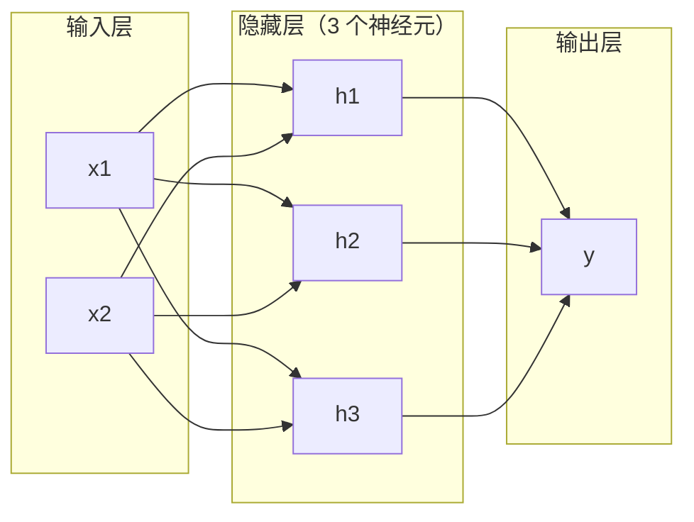
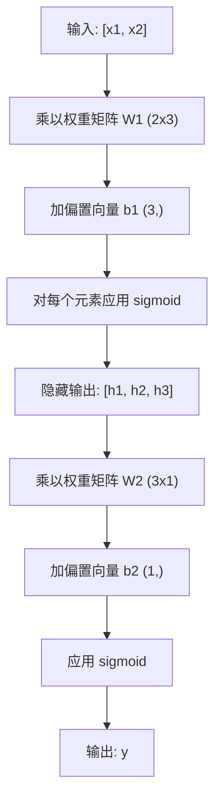

# 多层网络与前向传播

> 一个神经元只能画一条直线。把它们叠起来，就能画出任何形状。

**类型：** 构建
**语言：** Python
**前置知识：** Phase 01（数学基础）、第 03.01 课（感知机）
**预计时间：** ~90 分钟

## 学习目标

- 从零构建带有 Layer 和 Network 类的多层网络，执行完整的前向传播
- 追踪网络每一层的矩阵维度，识别形状不匹配问题
- 解释为什么堆叠非线性激活函数使网络能学习弯曲的决策边界
- 使用手动设定的 sigmoid 权重，通过 2-2-1 架构解决 XOR 问题

## 问题引入

单个神经元只能画直线。仅此而已。一条穿过你数据的直线。AI 中的每个真实问题——图像识别、语言理解、下围棋——都需要曲线。把神经元叠成层，就是得到曲线的方法。

1969 年，Minsky 和 Papert 证明了这个限制是致命的：单层网络无法学习 XOR。不是"学不好"——是数学上不可能。XOR 真值表将 [0,1] 和 [1,0] 放在一边，[0,0] 和 [1,1] 放在另一边。没有任何直线能分开它们。

这让神经网络经费停滞了十多年。现在回头看，解决方案很明显：不要只用一层。把神经元叠成层。让第一层把输入空间切成新特征，让第二层把这些特征组合成单条直线无法做出的决策。

这个堆叠就是多层网络。它是当今所有深度学习模型的基础。前向传播——数据从输入流经隐藏层到输出——是你需要构建的第一件事，其他一切都建立在此基础上。

## 核心概念

### 层：输入层、隐藏层、输出层

多层网络有三种类型的层：

**输入层**——其实不算真正的层。它存储你的原始数据。两个特征意味着两个输入节点。这里不做计算。

**隐藏层**——工作发生的地方。每个神经元接收前一层的所有输出，应用权重和偏置，然后将结果通过激活函数。叫"隐藏"是因为你在训练数据中永远看不到这些值。

**输出层**——最终答案。对于二分类，一个 sigmoid 神经元。对于多分类，每个类别一个神经元。



这是一个 2-3-1 网络。两个输入，三个隐藏神经元，一个输出。每条连接都有一个权重。每个神经元（输入层除外）都有一个偏置。

每一层产生一个称为隐藏状态的数字向量。对于文本，隐藏状态增加维度——将一个词编码为 768 个数字来捕捉语义含义。对于图像，它们降低维度——将数百万像素压缩为紧凑的表示。学习就发生在这些隐藏状态中。

在 GPT/BERT 中，每一层 Transformer 的输出也是一个隐藏状态（形状: [batch, seq_len, d_model]）。这些隐藏状态逐层"理解"输入的语义——低层捕捉语法，高层捕捉语义。这也是为什么可以通过 `model(x).hidden_states[-1]` 提取特征用于下游任务。

### 神经元与激活函数

每个神经元做三件事：

1. 将每个输入乘以对应的权重
2. 将所有乘积求和并加上偏置
3. 将求和结果通过激活函数

现在，激活函数用 sigmoid：

```
sigmoid(z) = 1 / (1 + e^(-z))
```

Sigmoid 把任意数字压缩到 (0, 1) 区间。大正输入推向 1，大负输入推向 0，零映射到 0.5。这条平滑曲线使学习成为可能——与感知机的硬阶跃不同，sigmoid 处处有梯度。

### 前向传播：数据如何流动

前向传播将输入数据逐层推过网络，直到到达输出。前向传播期间没有任何学习。它是纯计算：乘、加、激活，重复。



在每一层，按顺序执行三个操作：

```
z = W * input + b       （线性变换）
a = sigmoid(z)           （激活）
```

上一层的输出成为下一层的输入。这就是整个前向传播。

### 矩阵维度

追踪维度是深度学习中最重要的调试技能。以下是 2-3-1 网络的维度：

| 步骤 | 操作 | 维度 | 结果形状 |
|------|------|------|---------|
| 输入 | x | -- | (2,) |
| 隐藏层线性变换 | W1 * x + b1 | W1: (3, 2), b1: (3,) | (3,) |
| 隐藏层激活 | sigmoid(z1) | -- | (3,) |
| 输出层线性变换 | W2 * h + b2 | W2: (1, 3), b2: (1,) | (1,) |
| 输出层激活 | sigmoid(z2) | -- | (1,) |

规则：第 k 层的权重矩阵 W 形状是 (第 k 层神经元数, 第 k-1 层神经元数)。行对应当前层，列对应上一层。维度不匹配就是 bug。

### 万能逼近定理

1989 年，George Cybenko 证明了一件了不起的事：一个带有单个隐藏层和足够多神经元的神经网络可以以任意精度逼近任何连续函数。

这不意味着一层总是最好的。它意味着架构在理论上是可行的。实践中，更深的网络（更多层，每层更少神经元）用比浅而宽的网络少得多的总参数就能学到相同的函数。这就是深度学习有效的原因。

直觉：隐藏层中的每个神经元学习一个"凸起"或特征。足够多正确放置的凸起可以逼近任何平滑曲线。

### 可组合性

神经网络是可组合的。你可以堆叠它们、串联它们、并行运行它们。Whisper 模型使用编码器网络处理音频，使用单独的解码器网络生成文本。现代 LLM 是纯解码器。BERT 是纯编码器。T5 是编码器-解码器。架构选择定义了模型的能力。

## 动手实现

纯 Python。不使用 numpy。每个矩阵运算都从零手写。

### 第一步：Sigmoid 激活函数

```python
import math

def sigmoid(x):
    x = max(-500.0, min(500.0, x))  # 裁剪到 [-500, 500] 防止指数溢出
    return 1.0 / (1.0 + math.exp(-x))  # σ(x) = 1/(1+e^(-x))
```

裁剪到 [-500, 500] 防止溢出。`math.exp(500)` 很大但有限。`math.exp(1000)` 是无穷大。

### 第二步：Layer 类

深度学习中最重要的运算是矩阵乘法。每一层、每个注意力头、每次前向传播——底层全是矩阵乘法。线性层接收输入向量，乘以权重矩阵，加上偏置向量：y = Wx + b。这一个方程占了神经网络 90% 的计算。

```python
class Layer:
    def __init__(self, n_inputs, n_neurons, weights=None, biases=None):
        if weights is not None:
            self.weights = weights                       # 使用指定的权重
        else:
            import random
            self.weights = [
                [random.uniform(-1, 1) for _ in range(n_inputs)]
                for _ in range(n_neurons)
            ]                                           # 形状：(n_neurons, n_inputs)
        if biases is not None:
            self.biases = biases
        else:
            self.biases = [0.0] * n_neurons

    def forward(self, inputs):
        self.last_input = inputs                         # 保存输入（反向传播时需要）
        self.last_output = []
        for neuron_idx in range(len(self.weights)):
            z = sum(
                w * x for w, x in zip(self.weights[neuron_idx], inputs)
            )
            z += self.biases[neuron_idx]                 # 加偏置
            self.last_output.append(sigmoid(z))          # sigmoid 激活
        return self.last_output
```

权重矩阵形状是 (n_neurons, n_inputs)。每一行是一个神经元对所有输入的权重。forward 方法遍历神经元，计算加权和加偏置，应用 sigmoid，收集结果。

这里的 Layer 类就是 PyTorch `nn.Linear` 的简化版。`nn.Linear(in_features, out_features)` 内部也是维护一个 `(out_features, in_features)` 的权重矩阵和一个 `(out_features,)` 的偏置向量。

### 第三步：Network 类

网络是层的列表。前向传播把它们串联起来：第 k 层的输出送入第 k+1 层。

```python
class Network:
    def __init__(self, layers):
        self.layers = layers   # 按顺序存储所有层

    def forward(self, inputs):
        current = inputs
        for layer in self.layers:
            current = layer.forward(current)  # 逐层前向传播
        return current
```

这就是整个前向传播。四行逻辑。数据进去，流过每一层，从另一端出来。Network 类就是 PyTorch `nn.Sequential` 的简化版。

### 第四步：用手动设定的权重解决 XOR

在第 01 课中，我们通过组合 OR、NAND 和 AND 感知机解决了 XOR。现在用 Layer 和 Network 类做同样的事。2-2-1 架构：两个输入，两个隐藏神经元，一个输出。

```python
hidden = Layer(
    n_inputs=2,
    n_neurons=2,
    weights=[[20.0, 20.0], [-20.0, -20.0]],  # 大权重让 sigmoid 接近阶跃函数
    biases=[-10.0, 30.0],                      # 第一个神经元 ≈ OR，第二个 ≈ NAND
)

output = Layer(
    n_inputs=2,
    n_neurons=1,
    weights=[[20.0, 20.0]],                    # 输出层 ≈ AND
    biases=[-30.0],
)

xor_net = Network([hidden, output])

xor_data = [
    ([0, 0], 0),
    ([0, 1], 1),
    ([1, 0], 1),
    ([1, 1], 0),
]

for inputs, expected in xor_data:
    result = xor_net.forward(inputs)
    predicted = 1 if result[0] >= 0.5 else 0
    print(f"  {inputs} -> {result[0]:.6f}（取整: {predicted}，期望: {expected}）")
```

大权重（20, -20）让 sigmoid 表现得像阶跃函数。第一个隐藏神经元近似 OR，第二个近似 NAND。输出神经元将它们组合成 AND，也就是 XOR。

### 第五步：圆形分类

更难的问题：将二维点分类为在圆内还是圆外，圆心在原点，半径 0.5。这需要弯曲的决策边界——单个感知机不可能做到。

```python
import random
import math

random.seed(42)

data = []
for _ in range(200):
    x = random.uniform(-1, 1)
    y = random.uniform(-1, 1)
    label = 1 if (x * x + y * y) < 0.25 else 0   # 距原点距离 < 0.5 则为"内部"
    data.append(([x, y], label))

circle_net = Network([
    Layer(n_inputs=2, n_neurons=8),   # 隐藏层：8 个神经元
    Layer(n_inputs=8, n_neurons=1),   # 输出层：1 个神经元
])
```

随机权重的网络分类效果很差。但前向传播仍然能运行。这就是重点——前向传播只是计算。学习正确的权重是第 03 课的反向传播。

## 用框架实现

PyTorch 用四行代码就做了上面所有的事：

```python
import torch
import torch.nn as nn

model = nn.Sequential(       # 对应我们的 Network 类
    nn.Linear(2, 8),         # 对应 Layer(2, 8)
    nn.Sigmoid(),             # 对应 sigmoid 激活
    nn.Linear(8, 1),         # 对应 Layer(8, 1)
    nn.Sigmoid(),             # 输出层 sigmoid
)

x = torch.tensor([[0.0, 0.0], [0.0, 1.0], [1.0, 0.0], [1.0, 1.0]])
output = model(x)             # 前向传播
print(output)
```

`nn.Linear(2, 8)` 就是你的 Layer 类：权重矩阵形状 (8, 2)，偏置向量形状 (8,)。`nn.Sigmoid()` 是你的 sigmoid 函数逐元素应用。`nn.Sequential` 是你的 Network 类：按顺序串联层。

区别在于速度和规模。PyTorch 在 GPU 上运行，处理百万级批量样本，自动计算反向传播的梯度。但前向传播逻辑和你从零构建的完全相同。

## 产出物

本课产出：
- `outputs/prompt-network-architect.md` - 用于设计网络架构的可复用提示词

## 练习题

1. 构建 2-4-2-1 网络（两个隐藏层），用随机权重跑 XOR 数据的前向传播。打印中间隐藏层输出，观察每层如何变换数据的表示。

2. 把圆形分类器的隐藏层从 8 改成 2，再改成 32，分别用随机权重跑前向传播。隐藏神经元数量会改变输出的范围或分布吗？为什么？

3. 在 Network 类中实现 `count_parameters` 方法，返回所有可训练的权重和偏置总数。用 784-256-128-10 网络（经典 MNIST 架构）测试，它有多少参数？

4. 为 3-4-4-2 网络构建前向传播。输入 RGB 颜色值（归一化到 0-1），观察两个输出。

5. 用"漏斗阶跃"函数替代 sigmoid：z < 0 时返回 0.01\*z，否则返回 1.0。用第四步的手动权重跑 XOR。还能正常工作吗？为什么平滑的 sigmoid 比硬截断更好？

## 术语速查表

| 术语 | 通俗说法 | 实际含义 |
|------|---------|---------|
| 前向传播 (Forward pass) | "跑模型" | 把输入推过每一层——乘权重、加偏置、激活——得到输出 |
| 隐藏层 (Hidden layer) | "中间那部分" | 输入层和输出层之间的层，其值在训练数据中不可直接观测 |
| 多层网络 (Multi-layer network) | "深度神经网络" | 神经元按层堆叠，每层的输出是下一层的输入 |
| 激活函数 (Activation function) | "非线性" | 线性变换后施加的函数，让决策边界变成曲线 |
| Sigmoid | "S 曲线" | σ(z) = 1/(1+e^(-z))，把任意实数压缩到 (0,1)，处处平滑可导 |
| 权重矩阵 (Weight matrix) | "参数" | 形状为 (当前层神经元, 上一层神经元) 的矩阵，包含可学习的连接强度 |
| 偏置向量 (Bias vector) | "偏移" | 矩阵乘法后加上的向量，让神经元在全零输入时也能激活 |
| 万能逼近 (Universal approximation) | "神经网络什么都能学" | 一个隐藏层 + 足够多神经元可逼近任何连续函数——但"足够"可能意味着数十亿 |
| 线性变换 (Linear transformation) | "矩阵乘法那步" | z = Wx + b，激活前的计算，把输入映射到新空间 |
| 决策边界 (Decision boundary) | "分类器切换的地方" | 输入空间中网络输出跨过分类阈值的曲面 |

## 延伸阅读

- Michael Nielsen, "Neural Networks and Deep Learning", Chapter 1-2 (http://neuralnetworksanddeeplearning.com/) —— 最清晰的免费前向传播和网络结构解释，带交互可视化
- Cybenko, "Approximation by Superpositions of a Sigmoidal Function" (1989) —— 万能逼近定理原始论文，出人意料地易读
- 3Blue1Brown, "But what is a neural network?" (https://www.youtube.com/watch?v=aircAruvnKk) —— 20 分钟可视化讲解层、权重和前向传播
- Goodfellow, Bengio, Courville, "Deep Learning", Chapter 6 (https://www.deeplearningbook.org/) —— 多层网络的标准参考书，免费在线
