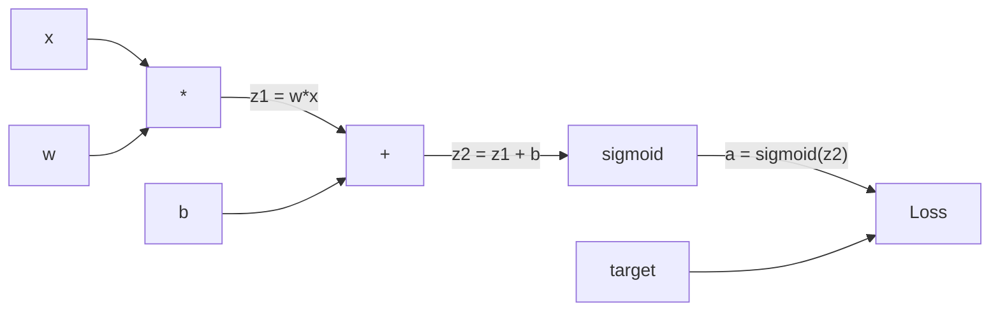
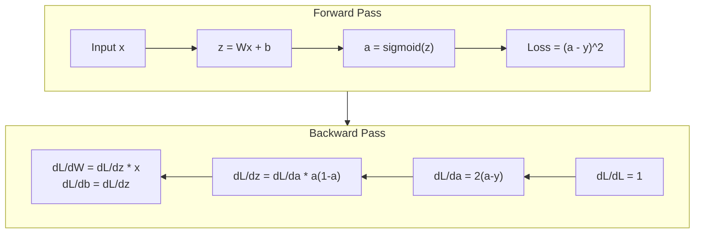
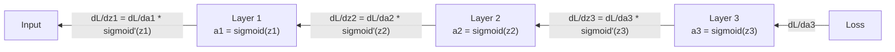

# Backpropagation from Scratch | 从零实现反向传播

> Backpropagation is the algorithm that makes learning possible. Without it, neural networks are just expensive random number generators.

> 反向传播是让学习成为可能的算法。没有它，神经网络只是昂贵的随机数生成器。

> **【中文解读】** 反向传播是让神经网络能够"学习"的核心算法。没有它，神经网络只是一堆随机数的组合。它的本质是用链式法则高效地计算所有参数的梯度——一次前向传播 + 一次反向传播就能得到所有 2.3M 个权重的梯度，而不是逐个尝试 2.3M 次。

**Type:** Build
**Languages:** Python
**Prerequisites:** Lesson 03.02 (Multi-Layer Networks)
**Time:** ~120 minutes

## Learning Objectives | 学习目标

- Implement a Value-based autograd engine that builds a computational graph and computes gradients via topological sort
  实现基于 Value 的自动微分引擎，构建计算图并通过拓扑排序计算梯度
- Derive the backward pass for addition, multiplication, and sigmoid using the chain rule
  用链式法则推导加法、乘法和 sigmoid 的反向传播
- Train a multi-layer network on XOR and circle classification using only your from-scratch backpropagation engine
  仅用你从零构建的反向传播引擎在 XOR 和圆形分类上训练多层网络
- Identify the vanishing gradient problem in deep sigmoid networks and explain why gradients shrink exponentially
  识别深度 sigmoid 网络中的梯度消失问题，解释为什么梯度会指数级缩小

> **【中文解读】** 本章目标：构建一个类似 PyTorch autograd 的自动微分引擎，用链式法则推导加法、乘法、sigmoid 的反向传播，训练 XOR 和圆形分类任务，理解梯度消失问题。

## The Problem | 问题引入

Your network has a single hidden layer with 768 inputs and 3072 outputs. That's 2,359,296 weights. It made a wrong prediction. Which weights caused the error? Testing each weight individually means 2.3 million forward passes. Backpropagation computes all 2.3 million gradients in a single backward pass. That's not an optimization. That's the difference between trainable and impossible.

> 你的网络有一个 768 个输入、3072 个输出的隐藏层。那是 2,359,296 个权重。它做出了错误的预测。哪些权重导致了错误？逐个测试每个权重意味着 230 万次前向传播。反向传播在单次反向传播中计算所有 230 万个梯度。这不是优化。这是可训练和不可能之间的区别。

The naive approach: take one weight, nudge it by a tiny amount, run the forward pass again, measure whether the loss went up or down. That gives you the gradient for that weight. Now do it for every weight in the network. Multiply by thousands of training steps and millions of data points. You'd need geological time to train anything useful.

> 朴素方法：取一个权重，微调一下，再次运行前向传播，测量损失是上升还是下降。这样你得到那个权重的梯度。现在对网络中的每个权重都这样做。乘以数千个训练步骤和数百万个数据点。你需要地质时间才能训练出任何有用的东西。

Backpropagation solves this. One forward pass, one backward pass, all gradients computed. The trick is the chain rule from calculus, applied systematically to a computational graph. This is the algorithm that made deep learning practical. Without it, we'd still be stuck on toy problems.

> 反向传播解决了这个问题。一次前向传播，一次反向传播，所有梯度就计算完了。诀窍是微积分中的链式法则，系统地应用于计算图。这是让深度学习变得实用的算法。没有它，我们仍然会停留在玩具问题上。

> **【中文解读】** 一个有 235 万权重的网络，如果逐个试探来计算梯度，需要 235 万次前向传播。反向传播只需要一次前向 + 一次反向就能算出所有梯度。这不是优化，而是从"不可能"到"可训练"的区别。核心原理就是微积分的链式法则，系统化地应用到计算图上。

## The Concept | 核心概念

### The Chain Rule, Applied to Networks | 链式法则在神经网络中的应用

You saw the chain rule in Phase 01, Lesson 05. Quick recap: if y = f(g(x)), then dy/dx = f'(g(x)) * g'(x). You multiply derivatives along the chain.

> 你在第一阶段第 05 课见过链式法则。快速回顾：如果 y = f(g(x))，则 dy/dx = f'(g(x)) * g'(x)。你沿着链条将导数相乘。

In a neural network, the "chain" is the sequence of operations from input to loss. Each layer applies weights, adds biases, passes through an activation. The loss function compares the final output to the target. Backpropagation traces this chain backward, computing how each operation contributed to the error.

> 在神经网络中，"链"是从输入到损失的操作序列。每一层应用权重、加偏置、通过激活函数。损失函数将最终输出与目标进行比较。反向传播沿这条链倒推，计算每个操作对误差的贡献。

> **【中文解读】** 链式法则：如果 y = f(g(x))，则 dy/dx = f'(g(x)) * g'(x)。在神经网络中，"链"就是从输入到损失的一系列操作。反向传播沿着这条链倒推，计算每个操作对误差的贡献。

> **【拓展：PyTorch autograd 的核心】** PyTorch 的 `loss.backward()` 就是自动执行链式法则。它在 前向传播 时记录计算图（哪些值由哪些操作产生），然后在 backward 时沿图反向传播梯度。理解了本课的手动实现，就理解了 PyTorch autograd 的全部原理。

### Computational Graphs | 计算图

Every forward pass builds a graph. Each node is an operation (multiply, add, sigmoid). Each edge carries a value forward and a gradient backward.

> 每次前向传播都构建一个图。每个节点是一个操作（乘法、加法、sigmoid）。每条边向前传递一个值，向后传递一个梯度。



Forward pass: values flow left to right. x and w produce z1 = w*x. Add b to get z2. Sigmoid gives activation a. Compare a to target y using the loss function.

> 前向传播：值从左向右流动。x 和 w 产生 z1 = w*x。加 b 得到 z2。Sigmoid 给出激活 a。用损失函数将 a 与目标 y 进行比较。

Backward pass: gradients flow right to left. Start with dL/da (how loss changes with the activation). Multiply by da/dz2 (sigmoid derivative). That gives dL/dz2. Split into dL/db (which equals dL/dz2, since z2 = z1 + b) and dL/dz1. Then dL/dw = dL/dz1 * x and dL/dx = dL/dz1 * w.

> 反向传播：梯度从右向左流动。从 dL/da（损失如何随激活变化）开始。乘以 da/dz2（sigmoid 导数）。得到 dL/dz2。拆分为 dL/db（等于 dL/dz2，因为 z2 = z1 + b）和 dL/dz1。然后 dL/dw = dL/dz1 * x，dL/dx = dL/dz1 * w。

Every node in the graph has one job during the backward pass: take the gradient coming from above, multiply by its local derivative, and pass it down.

> 图中每个节点在反向传播中只有一个任务：接收上方传来的梯度，乘以自己的局部导数，传递下去。

> **【中文解读】** 计算图中的每个节点（乘法、加法、sigmoid）在前向传播时传递值，在反向传播时传递梯度。每个节点只需要做一件事：接收上方的梯度，乘以自己的局部导数，传递下去。这就是反向传播的全部逻辑。

### Forward vs Backward | 前向与反向



The forward pass stores every intermediate value: z, a, the inputs to each layer. The backward pass needs these stored values to compute gradients. This is the memory-computation tradeoff at the heart of backprop. You trade memory (storing activations) for speed (one pass instead of millions).

> 前向传播存储所有中间值：z、a、每层的输入。反向传播需要这些存储的值来计算梯度。这就是反向传播核心的内存-计算权衡。你用内存（存储激活值）换取速度（一次传播替代数百万次）。

> **【中文解读】** 前向传播存储所有中间值（z、a、每层输入），反向传播需要这些值来计算梯度。这就是反向传播的核心权衡：用内存（存储激活值）换速度（一次反向传播替代数百万次前向传播）。这也是为什么训练大模型需要大量显存。

### Gradient Flow Through a Network | 梯度在网络中的流动

For a 3-layer network, gradients chain through every layer:

> 对于 3 层网络，梯度通过每一层链接传递：



At each layer, the gradient gets multiplied by the sigmoid derivative. The sigmoid derivative is a * (1 - a), which maxes out at 0.25 (when a = 0.5). Three layers deep, the gradient has been multiplied by at most 0.25^3 = 0.0156. Ten layers deep: 0.25^10 = 0.000001.

> 在每一层，梯度都乘以 sigmoid 的导数。sigmoid 导数是 a * (1 - a)，最大值为 0.25（当 a = 0.5 时）。三层之后，梯度最多乘以 0.25^3 = 0.0156。十层之后：0.25^10 = 0.000001。

### Vanishing Gradients | 梯度消失

This is the vanishing gradient problem. Sigmoid squashes its output between 0 and 1. Its derivative is always less than 0.25. Stack enough sigmoid layers and gradients shrink to nothing. Early layers barely learn because they receive near-zero gradients.

> 这就是梯度消失问题。Sigmoid 将输出压缩到 0 和 1 之间。它的导数始终小于 0.25。堆叠足够多的 sigmoid 层，梯度就会缩小到零。前面的层几乎不学习，因为它们收到的梯度接近于零。

```
sigmoid(z):     Output range [0, 1]              # 输出范围 [0, 1]
sigmoid'(z):    Max value 0.25 (at z = 0)        # 导数最大值 0.25（在 z = 0 时）

After 5 layers:   gradient * 0.25^5 = 0.001x original       # 5 层后梯度缩到 0.001 倍
After 10 layers:  gradient * 0.25^10 = 0.000001x original    # 10 层后梯度几乎为零
```

This is why deep sigmoid networks are nearly impossible to train. The fix -- ReLU and its variants -- is the subject of Lesson 04. For now, understand that backprop works perfectly. The problem is what it's working through.

> 这就是为什么深度 sigmoid 网络几乎不可能训练。解决方案——ReLU 及其变体——是第 04 课的主题。现在，只需要理解反向传播本身工作得很好，问题在于它所穿过的东西。

> **【中文解读】** 梯度消失：sigmoid 的导数最大只有 0.25，每经过一层梯度就乘以最多 0.25。5 层后只剩 0.001，10 层后只剩百万分之一。前面几层几乎收不到梯度，所以无法学习。这就是为什么现代网络用 ReLU（导数恒为 1）替代 sigmoid。

> **【拓展：Transformer 中的梯度流】** Transformer 用残差连接（Residual Connection）解决梯度消失问题：`output = x + sublayer(x)`。这样梯度可以跳过子层直接传播，使得 GPT-3 的 96 层也能训练。ResNet 的"跨层连接"也是同样的原理。

### Deriving Gradients for a 2-Layer Network | 推导两层网络的梯度

Concrete math for a network with input x, hidden layer with sigmoid, output layer with sigmoid, and MSE loss.

> 具体推导一个具有输入 x、sigmoid 隐藏层、sigmoid 输出层和 MSE 损失的网络。

Forward pass:
```
z1 = W1 * x + b1          # 隐藏层线性变换
a1 = sigmoid(z1)           # 隐藏层激活
z2 = W2 * a1 + b2          # 输出层线性变换
a2 = sigmoid(z2)           # 输出层激活
L = (a2 - y)^2             # MSE 损失
```

Backward pass (applying chain rule step by step):
```
dL/da2 = 2(a2 - y)                              # 损失对输出的梯度
da2/dz2 = a2 * (1 - a2)                         # sigmoid 导数
dL/dz2 = dL/da2 * da2/dz2 = 2(a2 - y) * a2 * (1 - a2)  # 链式法则

dL/dW2 = dL/dz2 * a1                            # 输出层权重梯度
dL/db2 = dL/dz2                                  # 输出层偏置梯度

dL/da1 = dL/dz2 * W2                             # 梯度传播到隐藏层
da1/dz1 = a1 * (1 - a1)                          # sigmoid 导数
dL/dz1 = dL/da1 * da1/dz1                        # 链式法则

dL/dW1 = dL/dz1 * x                              # 隐藏层权重梯度
dL/db1 = dL/dz1                                   # 隐藏层偏置梯度
```

Every gradient is a product of local derivatives traced back from the loss. That's all backpropagation is.

> 每个梯度都是从损失回溯的局部导数的乘积。这就是反向传播的全部。

> **【中文解读】** 两层网络的梯度推导：从损失函数开始，用链式法则一步步往回算。每个梯度都是局部导数的连乘积。这就是反向传播的全部——链式法则的系统化应用。

## Build It | 动手构建

### Step 1: The Value Node | Value 节点

Every number in our computation becomes a Value. It stores its data, its gradient, and how it was created (so it knows how to compute gradients backward).

> 我们计算中的每个数字都变成一个 Value。它存储数据、梯度和它是如何创建的（这样它就知道如何反向计算梯度）。

```python
class Value:
    def __init__(self, data, children=(), op=''):
        self.data = data                          # 这个节点的数值
        self.grad = 0.0                           # 损失对这个值的梯度（初始为 0）
        self._backward = lambda: None             # 反向传播函数（初始为空操作）
        self._children = set(children)            # 产生这个值的子节点（用于拓扑排序）
        self._op = op                             # 产生这个值的操作（用于调试可视化）
```

No gradient yet (0.0). No backward function yet (no-op). The `_children` track which Values produced this one, so we can topologically sort the graph later.

> 还没有梯度（0.0）。还没有反向函数（空操作）。`_children` 跟踪哪些 Value 产生了这个值，以便我们稍后进行拓扑排序。

### Step 2: Operations with Backward Functions | 带反向传播的操作

Each operation creates a new Value and defines how gradients flow backward through it.

> 每个操作创建一个新的 Value 并定义梯度如何通过它反向流动。

```python
def __add__(self, other):
    other = other if isinstance(other, Value) else Value(other)
    out = Value(self.data + other.data, (self, other), '+')

    def _backward():
        self.grad += out.grad        # 加法的梯度：d(a+b)/da = 1，直接传递
        other.grad += out.grad       # d(a+b)/db = 1，直接传递

    out._backward = _backward
    return out

def __mul__(self, other):
    other = other if isinstance(other, Value) else Value(other)
    out = Value(self.data * other.data, (self, other), '*')

    def _backward():
        self.grad += other.data * out.grad   # 乘法的梯度：d(a*b)/da = b
        other.grad += self.data * out.grad   # d(a*b)/db = a

    out._backward = _backward
    return out
```

For addition: d(a+b)/da = 1, d(a+b)/db = 1. So both inputs get the output's gradient directly.

> 加法：d(a+b)/da = 1，d(a+b)/db = 1。所以两个输入都直接获得输出的梯度。

For multiplication: d(a*b)/da = b, d(a*b)/db = a. Each input gets the other's value times the output gradient.

> 乘法：d(a*b)/da = b，d(a*b)/db = a。每个输入获得另一个的值乘以输出梯度。

The `+=` is critical. A Value might be used in multiple operations. Its gradient is the sum of gradients from all paths.

> `+=` 是关键。一个 Value 可能在多个操作中使用。它的梯度是来自所有路径的梯度之和。

> **【中文解读】** 加法的梯度直接传递（导数为 1），乘法的梯度乘以另一个操作数（d(a\*b)/da = b）。关键细节：用 `+=` 而不是 `=`，因为一个值可能被多个操作使用，梯度需要从所有路径累加。

### Step 3: Sigmoid and Loss | Sigmoid 和损失函数

```python
import math

def sigmoid(self):
    x = self.data
    x = max(-500, min(500, x))    # 裁剪防止溢出
    s = 1.0 / (1.0 + math.exp(-x))  # 前向：计算 sigmoid
    out = Value(s, (self,), 'sigmoid')

    def _backward():
        self.grad += (s * (1 - s)) * out.grad  # 反向：sigmoid 导数 = σ(x) * (1 - σ(x))

    out._backward = _backward
    return out
```

Sigmoid derivative: sigmoid(x) * (1 - sigmoid(x)). We computed sigmoid(x) = s during the forward pass. Reuse it. No extra work.

> Sigmoid 导数：sigmoid(x) * (1 - sigmoid(x))。我们在前向传播中已经计算了 sigmoid(x) = s。复用它，不需要额外工作。

```python
def mse_loss(predicted, target):
    diff = predicted + Value(-target)  # predicted - target
    return diff * diff                  # (predicted - target)^2
```

MSE for a single output: (predicted - target)^2. We express subtraction as addition with a negated Value.

> 单输出的 MSE：(predicted - target)^2。我们将减法表示为加上取反的 Value。

### Step 4: Backward Pass | 反向传播

Topological sort ensures we process nodes in the right order -- a node's gradient is fully accumulated before we propagate through it.

> 拓扑排序确保我们按正确的顺序处理节点——一个节点的梯度在通过它传播之前已经完全累加。

```python
def backward(self):
    topo = []                         # 拓扑排序结果
    visited = set()

    def build_topo(v):
        if v not in visited:
            visited.add(v)
            for child in v._children:    # 先访问所有子节点
                build_topo(child)
            topo.append(v)               # 子节点都访问完后，再把自己加入列表

    build_topo(self)
    self.grad = 1.0                     # 损失对自己的梯度 = 1（dL/dL = 1）
    for v in reversed(topo):            # 逆序遍历（从输出到输入）
        v._backward()                   # 每个节点执行自己的反向传播函数
```

Start at the loss (gradient = 1.0, since dL/dL = 1). Walk backward through the sorted graph. Each node's `_backward` pushes gradients to its children.

> 从损失开始（梯度 = 1.0，因为 dL/dL = 1）。逆序遍历排序后的计算图。每个节点的 `_backward` 将梯度推送给它的子节点。

> **【中文解读】** 拓扑排序保证：一个节点的梯度完全累加后，才往它的子节点传播。从损失（梯度=1）开始，逆序遍历计算图，每个节点把梯度传递给产生它的子节点。这就是 PyTorch `loss.backward()` 的核心逻辑。

### Step 5: Layer and Network | 层和网络

```python
import random

class Neuron:
    def __init__(self, n_inputs):
        scale = (2.0 / n_inputs) ** 0.5   # He 初始化缩放因子，防止 sigmoid 饱和
        self.weights = [Value(random.uniform(-scale, scale)) for _ in range(n_inputs)]
        self.bias = Value(0.0)

    def __call__(self, x):
        act = sum((wi * xi for wi, xi in zip(self.weights, x)), self.bias)  # 加权求和 + 偏置
        return act.sigmoid()  # sigmoid 激活

    def parameters(self):
        return self.weights + [self.bias]   # 返回所有可训练参数


class Layer:
    def __init__(self, n_inputs, n_outputs):
        self.neurons = [Neuron(n_inputs) for _ in range(n_outputs)]

    def __call__(self, x):
        out = [n(x) for n in self.neurons]
        return out[0] if len(out) == 1 else out  # 单神经元时直接返回值

    def parameters(self):
        params = []
        for n in self.neurons:
            params.extend(n.parameters())
        return params


class Network:
    def __init__(self, sizes):
        self.layers = []
        for i in range(len(sizes) - 1):
            self.layers.append(Layer(sizes[i], sizes[i + 1]))  # 按尺寸列表构建层

    def __call__(self, x):
        for layer in self.layers:
            x = layer(x)                    # 逐层前向传播
            if not isinstance(x, list):
                x = [x]
        return x[0] if len(x) == 1 else x

    def parameters(self):
        params = []
        for layer in self.layers:
            params.extend(layer.parameters())
        return params

    def zero_grad(self):
        for p in self.parameters():
            p.grad = 0.0    # 清零所有梯度（每次反向传播前必须调用）
```

A Neuron takes inputs, computes weighted sum + bias, and applies sigmoid. Weight initialization scales by sqrt(2/n_inputs) to prevent sigmoid saturation in deeper networks. A Layer is a list of Neurons. A Network is a list of Layers. The `parameters()` method collects all learnable Values so we can update them.

> Neuron 接收输入，计算加权和加偏置，然后应用 sigmoid。权重初始化按 sqrt(2/n_inputs) 缩放以防止更深层网络中 sigmoid 饱和。Layer 是 Neuron 的列表。Network 是 Layer 的列表。`parameters()` 方法收集所有可学习的 Value 以便更新。

> **【中文解读】** Neuron = 一个神经元（权重 + 偏置 + sigmoid），Layer = 一组神经元，Network = 一组层。`parameters()` 收集所有可训练参数，`zero_grad()` 清零梯度（每轮训练前必须调用）。这就是 PyTorch 中 `model.parameters()` 和 `optimizer.zero_grad()` 的原型。

### Step 6: Train on XOR | 训练 XOR

```python
random.seed(42)
net = Network([2, 4, 1])  # 2 输入 → 4 隐藏神经元 → 1 输出

xor_data = [
    ([0.0, 0.0], 0.0),
    ([0.0, 1.0], 1.0),
    ([1.0, 0.0], 1.0),
    ([1.0, 1.0], 0.0),
]

learning_rate = 1.0

for epoch in range(1000):
    total_loss = Value(0.0)
    for inputs, target in xor_data:
        x = [Value(i) for i in inputs]
        pred = net(x)                          # 前向传播
        loss = mse_loss(pred, target)          # 计算损失
        total_loss = total_loss + loss         # 累积损失

    net.zero_grad()           # 清零梯度
    total_loss.backward()     # 反向传播：计算所有参数的梯度

    for p in net.parameters():
        p.data -= learning_rate * p.grad      # 梯度下降更新权重

    if epoch % 100 == 0:
        print(f"Epoch {epoch:4d} | Loss: {total_loss.data:.6f}")

print("\nXOR Results:")
for inputs, target in xor_data:
    x = [Value(i) for i in inputs]
    pred = net(x)
    print(f"  {inputs} -> {pred.data:.4f} (expected {target})")
```

Watch the loss decrease. From random predictions to correct XOR outputs, driven entirely by backpropagation computing gradients and nudging weights in the right direction.

> 观察损失下降。从随机预测到正确的 XOR 输出，完全由反向传播计算梯度并将权重推向正确方向来驱动。

> **【中文解读】** 训练循环：前向传播 → 计算损失 → 反向传播 → 更新权重。这四步就是所有深度学习训练的核心。损失从高到低，预测从随机到正确，全部靠反向传播计算梯度来驱动。

### Step 7: Circle Classification | 圆形分类

In Lesson 02, you hand-tuned weights for circle classification. Now let the network learn them.

> 在第 02 课中，你手动调整了圆形分类的权重。现在让网络自己学习它们。

```python
random.seed(7)

def generate_circle_data(n=100):
    data = []
    for _ in range(n):
        x1 = random.uniform(-1.5, 1.5)
        x2 = random.uniform(-1.5, 1.5)
        label = 1.0 if x1 * x1 + x2 * x2 < 1.0 else 0.0   # 距原点 < 1 则为"内部"
        data.append(([x1, x2], label))
    return data

circle_data = generate_circle_data(80)

circle_net = Network([2, 8, 1])  # 2-8-1 网络
learning_rate = 0.5

for epoch in range(2000):
    random.shuffle(circle_data)       # 打乱数据顺序
    total_loss_val = 0.0
    for inputs, target in circle_data:
        x = [Value(i) for i in inputs]
        pred = circle_net(x)
        loss = mse_loss(pred, target)
        circle_net.zero_grad()         # 清零梯度
        loss.backward()                # 反向传播
        for p in circle_net.parameters():
            p.data -= learning_rate * p.grad  # 更新权重
        total_loss_val += loss.data

    if epoch % 200 == 0:
        correct = 0
        for inputs, target in circle_data:
            x = [Value(i) for i in inputs]
            pred = circle_net(x)
            predicted_class = 1.0 if pred.data > 0.5 else 0.0
            if predicted_class == target:
                correct += 1
        accuracy = correct / len(circle_data) * 100
        print(f"Epoch {epoch:4d} | Loss: {total_loss_val:.4f} | Accuracy: {accuracy:.1f}%")
```

We use online SGD here -- update weights after each sample instead of accumulating the full batch. This breaks symmetry faster and avoids sigmoid saturation on the full loss landscape. Shuffling the data each epoch prevents the network from memorizing the order.

> 这里使用在线 SGD——在每个样本后更新权重，而不是累积整个批次。这能更快打破对称性并避免在整个损失曲面上出现 sigmoid 饱和。每个 epoch 打乱数据可防止网络记住顺序。

No hand-tuning. The network discovers the circular decision boundary on its own. That's the power of backpropagation: you define the architecture, the loss function, and the data. The algorithm figures out the weights.

> 无需手动调权重。网络自己学会画圆形决策边界。这就是反向传播的力量：你定义架构、损失函数和数据，算法自己找出正确的权重。

> **【中文解读】** 这里用在线 SGD（逐样本更新）而非批量更新。打乱数据防止网络记住顺序。无需手动调权重——网络自己学会画圆形决策边界。这就是反向传播的力量：你定义架构、损失函数和数据，算法自己找出正确的权重。

## Use It | 实际应用

PyTorch does everything above in a few lines. The core idea is identical -- autograd builds a computational graph during the forward pass and traces it backward to compute gradients.

> PyTorch 用几行代码就完成了上面的所有功能。核心理念完全相同——autograd 在前向传播期间构建计算图，然后反向追踪以计算梯度。

```python
import torch
import torch.nn as nn

model = nn.Sequential(
    nn.Linear(2, 4),       # 对应我们的 Layer(2, 4)
    nn.Sigmoid(),           # 对应 sigmoid 激活
    nn.Linear(4, 1),       # 对应我们的 Layer(4, 1)
    nn.Sigmoid(),
)
optimizer = torch.optim.SGD(model.parameters(), lr=1.0)  # 对应我们的手动梯度下降
criterion = nn.MSELoss()  # 对应我们的 mse_loss

X = torch.tensor([[0,0],[0,1],[1,0],[1,1]], dtype=torch.float32)
y = torch.tensor([[0],[1],[1],[0]], dtype=torch.float32)

for epoch in range(1000):
    pred = model(X)                  # 前向传播
    loss = criterion(pred, y)        # 计算损失
    optimizer.zero_grad()            # 清零梯度（对应 net.zero_grad()）
    loss.backward()                  # 反向传播（对应 total_loss.backward()）
    optimizer.step()                 # 更新权重（对应 p.data -= lr * p.grad）

print("PyTorch XOR Results:")
with torch.no_grad():                # 推理模式，不计算梯度
    for i in range(4):
        pred = model(X[i])
        print(f"  {X[i].tolist()} -> {pred.item():.4f} (expected {y[i].item()})")
```

`loss.backward()` is your `total_loss.backward()`. `optimizer.step()` is your manual `p.data -= lr * p.grad`. `optimizer.zero_grad()` is your `net.zero_grad()`. Same algorithm, industrial-strength implementation. PyTorch handles GPU acceleration, mixed precision, gradient checkpointing, and hundreds of layer types. But the backward pass is the same chain rule applied to the same computational graph.

> `loss.backward()` 就是你的 `total_loss.backward()`。`optimizer.step()` 就是你的手动 `p.data -= lr * p.grad`。`optimizer.zero_grad()` 就是你的 `net.zero_grad()`。同样的算法，工业级实现。PyTorch 处理 GPU 加速、混合精度、梯度检查点和数百种层类型。但反向传播是将相同的链式法则应用于相同的计算图。

Training runs the forward pass, then the backward pass, then updates weights. Inference runs only the forward pass. No gradients, no updates. This distinction matters because inference is what happens in production. When you call an API like Claude or GPT, you're running inference -- your prompt flows forward through the network, and tokens come out the other end. No weights change. Understanding backprop matters because it shaped every weight in that network.

> 训练运行前向传播，然后反向传播，然后更新权重。推理只运行前向传播。没有梯度，没有更新。这个区别很重要，因为推理是生产环境中发生的事情。当你调用 Claude 或 GPT 等 API 时，你运行的是推理——你的提示词前向流过网络，token 从另一端输出。权重不变。理解反向传播很重要，因为它塑造了那个网络中的每一个权重。

> **【中文解读】** PyTorch 的 `loss.backward()` = 我们手写的 `backward()`，`optimizer.step()` = 我们手写的 `p.data -= lr * p.grad`。训练时做前向+反向+更新，推理时只做前向。当你调用 GPT/Claude API 时，就是推理——你的提示词前向流过网络，输出 token，权重不变。理解反向传播很重要，因为它塑造了模型中的每一个权重。

## Ship It | 输出物

This lesson produces:
- `outputs/prompt-gradient-debugger.md` -- a reusable prompt for diagnosing gradient problems (vanishing, exploding, NaN) in any neural network

> 本课产出：`outputs/prompt-gradient-debugger.md` - 一个可复用的诊断任何神经网络中梯度问题（消失、爆炸、NaN）的提示词

## Exercises | 练习题

1. Add a `__sub__` method to the Value class (a - b = a + (-1 * b)). Then implement a `__neg__` method. Verify that the gradients are correct by comparing with manual calculation for a simple expression like (a - b)^2.
   > **练习 1：** 给 Value 类添加减法和取负操作。用手动计算验证 (a - b)^2 的梯度是否正确。

2. Add a `relu` method to Value (output max(0, x), derivative is 1 if x > 0, else 0). Replace sigmoid with relu in the hidden layers and train on XOR again. Compare convergence speed. You should see faster training -- this previews Lesson 04.
   > **练习 2：** 给 Value 添加 ReLU 方法。用 ReLU 替换隐藏层的 sigmoid，训练 XOR 并对比收敛速度。ReLU 应该更快——这是下一课的预览。

3. Implement a `__pow__` method on Value for integer powers. Use it to replace `mse_loss` with a proper `(predicted - target) ** 2` expression. Verify gradients match the original implementation.
   > **练习 3：** 给 Value 添加幂运算方法，用它重写 MSE 损失。验证梯度与原始实现一致。

4. Add gradient clipping to the training loop: after calling `backward()`, clip all gradients to [-1, 1]. Train a deeper network (4+ layers with sigmoid) and compare loss curves with and without clipping. This is your first defense against exploding gradients.
   > **练习 4：** 在训练循环中添加梯度裁剪（裁剪到 [-1, 1]）。训练 4+ 层的 sigmoid 网络，对比有/无裁剪的损失曲线。

5. Build a visualization: after training on XOR, print the gradient of every parameter in the network. Identify which layer has the smallest gradients. This demonstrates the vanishing gradient problem you read about in the Concept section.
   > **练习 5：** 训练 XOR 后，打印每个参数的梯度。找出哪一层梯度最小，直观感受梯度消失问题。

## Key Terms | 关键术语

| Term | What people say | What it actually means |
|------|----------------|----------------------|
| Backpropagation | "The network learns" | An algorithm that computes dL/dw for every weight by applying the chain rule backward through the computational graph |
| Computational graph | "The network structure" | A directed acyclic graph where nodes are operations and edges carry values (forward) and gradients (backward) |
| Chain rule | "Multiply the derivatives" | If y = f(g(x)), then dy/dx = f'(g(x)) * g'(x) -- the mathematical foundation of backpropagation |
| Gradient | "The direction of steepest ascent" | The partial derivative of the loss with respect to a parameter -- tells you how to change that parameter to reduce the loss |
| Vanishing gradient | "Deep networks don't learn" | Gradients shrink exponentially as they propagate through layers with saturating activations like sigmoid |
| Forward pass | "Running the network" | Computing the output from inputs by sequentially applying each layer's operations and storing intermediate values |
| Backward pass | "Computing gradients" | Traversing the computational graph in reverse, accumulating gradients at each node using the chain rule |
| Learning rate | "How fast it learns" | A scalar that controls the step size when updating weights: w_new = w_old - lr * gradient |
| Topological sort | "The right order" | An ordering of graph nodes where each node appears after all nodes it depends on -- ensures gradients are fully accumulated before propagation |
| Autograd | "Automatic differentiation" | A system that builds computational graphs during forward computation and automatically computes gradients -- what PyTorch's engine does |

| 术语 | 通俗说法 | 实际含义 |
|------|---------|---------|
| 反向传播 (Backpropagation) | "网络在学习" | 用链式法则沿计算图反向计算每个权重的 dL/dw 的算法 |
| 计算图 (Computational graph) | "网络结构" | 有向无环图，节点是操作，边传递值（前向）和梯度（反向） |
| 链式法则 (Chain rule) | "把导数乘起来" | y = f(g(x)) → dy/dx = f'(g(x)) * g'(x)——反向传播的数学基础 |
| 梯度 (Gradient) | "最陡上升方向" | 损失对参数的偏导数——告诉你怎么改参数能降低损失 |
| 梯度消失 (Vanishing gradient) | "深层网络学不动" | 梯度经过饱和激活函数（如 sigmoid）逐层指数级缩小 |
| 前向传播 (Forward pass) | "跑网络" | 从输入逐层计算输出，存储中间值 |
| 反向传播过程 (Backward pass) | "算梯度" | 逆序遍历计算图，用链式法则逐节点累加梯度 |
| 学习率 (Learning rate) | "学多快" | 控制权重更新步长的标量：w_new = w_old - lr * gradient |
| 拓扑排序 (Topological sort) | "正确的顺序" | 保证每个节点的梯度完全累加后再往下传播的节点排列 |
| 自动微分 (Autograd) | "自动求导" | 前向时构建计算图，自动计算梯度的系统——PyTorch 引擎的核心 |

## Further Reading | 延伸阅读

- Rumelhart, Hinton & Williams, "Learning representations by back-propagating errors" (1986) -- the paper that made backpropagation mainstream and unlocked multi-layer network training
  Rumelhart、Hinton 和 Williams，《通过反向传播误差学习表示》(1986)——让反向传播成为主流并解锁多层网络训练的论文
- 3Blue1Brown, "Neural Networks" series (https://www.youtube.com/playlist?list=PLZHQObOWTQDNU6R1_67000Dx_ZCJB-3pi) -- the best visual explanation of backpropagation and gradient flow through networks
  3Blue1Brown，《神经网络》系列——关于反向传播和梯度在网络中流动的最佳可视化解释
