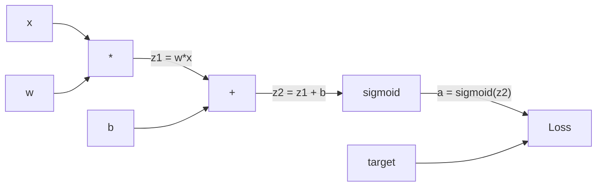
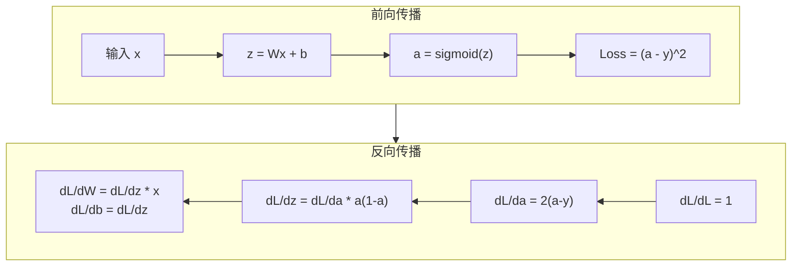
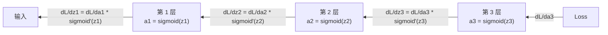

# 从零实现反向传播

> 反向传播是让神经网络能够"学习"的核心算法。没有它，神经网络只是一堆随机数的组合。

**类型：** 构建
**语言：** Python
**前置知识：** 第 03.02 课（多层网络）
**预计时间：** ~120 分钟

## 学习目标

- 实现基于 Value 的自动微分引擎，构建计算图并通过拓扑排序计算梯度
- 用链式法则推导加法、乘法和 sigmoid 的反向传播
- 仅使用从零实现的反向传播引擎训练多层网络，解决 XOR 和圆形分类任务
- 识别深度 sigmoid 网络中的梯度消失问题，解释梯度为何指数级缩小

## 问题引入

你的网络有一个隐藏层，768 个输入，3072 个输出。总共 2,359,296 个权重。它做出了一个错误的预测。哪些权重导致了错误？逐个测试每个权重意味着 230 万次前向传播。反向传播只需一次前向 + 一次反向就能计算所有 230 万个梯度。这不是优化，而是从"不可能"到"可训练"的区别。

朴素的思路：取一个权重，微调一小点，再跑一次前向传播，看损失是上升还是下降。这样得到该权重的梯度。对网络中的每个权重重复这个过程。乘以数千个训练步和数百万个数据点。你需要地质年代级别的时间才能训练出任何有用的东西。

反向传播解决了这个问题。一次前向传播，一次反向传播，所有梯度就计算完了。诀窍就是微积分的链式法则，系统化地应用到计算图上。这就是让深度学习变得可行的算法。

## 核心概念

### 链式法则在神经网络中的应用

链式法则回顾：如果 y = f(g(x))，则 dy/dx = f'(g(x)) * g'(x)。沿链乘导数。

在神经网络中，"链"是从输入到损失的一系列操作。每一层应用权重、加偏置、通过激活函数。损失函数将最终输出与目标比较。反向传播沿着这条链倒推，计算每个操作对误差的贡献。

PyTorch 的 `loss.backward()` 就是自动执行链式法则。它在 前向传播时记录计算图（哪些值由哪些操作产生），然后在 backward 时沿图反向传播梯度。

### 计算图

每次前向传播都构建一个图。每个节点是一个操作（乘、加、sigmoid）。每条边前向传递值，反向传递梯度。



前向传播：值从左到右流动。x 和 w 产生 z1 = w*x。加 b 得到 z2。Sigmoid 给出激活 a。用损失函数比较 a 和目标 y。

反向传播：梯度从右到左流动。从 dL/da（损失对激活的变化率）开始。乘以 da/dz2（sigmoid 导数）。得到 dL/dz2。分解为 dL/db（等于 dL/dz2，因为 z2 = z1 + b）和 dL/dz1。然后 dL/dw = dL/dz1 * x 和 dL/dx = dL/dz1 * w。

图中的每个节点在反向传播中只需做一件事：接收从上方传来的梯度，乘以自己的局部导数，传递下去。

### 前向与反向



前向传播存储每个中间值：z、a、每层的输入。反向传播需要这些存储的值来计算梯度。这就是反向传播核心的内存-计算权衡：用内存（存储激活值）换速度（一次反向传播替代数百万次前向传播）。这也是为什么训练大模型需要大量显存。

### 梯度在网络中的流动

对于 3 层网络，梯度穿过每一层：



在每一层，梯度乘以 sigmoid 导数。sigmoid 导数是 a * (1 - a)，最大值为 0.25（当 a = 0.5 时）。三层深，梯度最多乘以 0.25^3 = 0.0156。十层深：0.25^10 = 0.000001。

### 梯度消失

这就是梯度消失问题。sigmoid 将输出压缩到 0 和 1 之间。它的导数始终小于 0.25。叠加足够多的 sigmoid 层，梯度就会缩到几乎为零。前面的层几乎收不到梯度，所以无法学习。

```
sigmoid(z):     输出范围 [0, 1]
sigmoid'(z):    最大值 0.25（在 z = 0 时）

5 层后:   梯度 * 0.25^5 = 0.001 倍原始值
10 层后:  梯度 * 0.25^10 = 0.000001 倍原始值
```

这就是为什么深度 sigmoid 网络几乎无法训练。解决方案——ReLU 及其变体——是第 04 课的主题。

Transformer 用残差连接（Residual Connection）解决梯度消失问题：`output = x + sublayer(x)`。这样梯度可以跳过子层直接传播，使得 GPT-3 的 96 层也能训练。ResNet 的"跨层连接"也是同样的原理。

### 推导两层网络的梯度

具体数学推导，针对输入 x、sigmoid 隐藏层、sigmoid 输出层和 MSE 损失的网络。

前向传播：
```
z1 = W1 * x + b1          # 隐藏层线性变换
a1 = sigmoid(z1)           # 隐藏层激活
z2 = W2 * a1 + b2          # 输出层线性变换
a2 = sigmoid(z2)           # 输出层激活
L = (a2 - y)^2             # MSE 损失
```

反向传播（逐步应用链式法则）：
```
dL/da2 = 2(a2 - y)                              # 损失对输出的梯度
da2/dz2 = a2 * (1 - a2)                         # sigmoid 导数
dL/dz2 = dL/da2 * da2/dz2 = 2(a2 - y) * a2 * (1 - a2)  # 链式法则

dL/dW2 = dL/dz2 * a1                            # 输出层权重梯度
dL/db2 = dL/dz2                                  # 输出层偏置梯度

dL/da1 = dL/dz2 * W2                             # 梯度传播到隐藏层
da1/dz1 = a1 * (1 - a1)                          # sigmoid 导数
dL/dz1 = dL/da1 * da1/dz1                        # 链式法则

dL/dW1 = dL/dz1 * x                              # 隐藏层权重梯度
dL/db1 = dL/dz1                                   # 隐藏层偏置梯度
```

每个梯度都是从损失沿链追溯的局部导数的乘积。这就是反向传播的全部——链式法则的系统化应用。

## 动手实现

### 第一步：Value 节点

计算中的每个数字都变成一个 Value。它存储数据、梯度和它是如何创建的（以便知道如何反向计算梯度）。

```python
class Value:
    def __init__(self, data, children=(), op=''):
        self.data = data                          # 这个节点的数值
        self.grad = 0.0                           # 损失对这个值的梯度（初始为 0）
        self._backward = lambda: None             # 反向传播函数（初始为空操作）
        self._children = set(children)            # 产生这个值的子节点（用于拓扑排序）
        self._op = op                             # 产生这个值的操作（用于调试可视化）
```

### 第二步：带反向传播的操作

每个操作创建一个新 Value 并定义梯度如何反向流过它。

```python
def __add__(self, other):
    other = other if isinstance(other, Value) else Value(other)
    out = Value(self.data + other.data, (self, other), '+')

    def _backward():
        self.grad += out.grad        # 加法的梯度：d(a+b)/da = 1，直接传递
        other.grad += out.grad       # d(a+b)/db = 1，直接传递

    out._backward = _backward
    return out

def __mul__(self, other):
    other = other if isinstance(other, Value) else Value(other)
    out = Value(self.data * other.data, (self, other), '*')

    def _backward():
        self.grad += other.data * out.grad   # 乘法的梯度：d(a*b)/da = b
        other.grad += self.data * out.grad   # d(a*b)/db = a

    out._backward = _backward
    return out
```

加法：d(a+b)/da = 1, d(a+b)/db = 1。两个输入直接获得输出的梯度。

乘法：d(a*b)/da = b, d(a*b)/db = a。每个输入获得另一个操作数的值乘以输出梯度。

`+=` 是关键。一个 Value 可能在多个操作中使用。它的梯度是所有路径梯度的总和。

### 第三步：Sigmoid 和损失函数

```python
import math

def sigmoid(self):
    x = self.data
    x = max(-500, min(500, x))    # 裁剪防止溢出
    s = 1.0 / (1.0 + math.exp(-x))  # 前向：计算 sigmoid
    out = Value(s, (self,), 'sigmoid')

    def _backward():
        self.grad += (s * (1 - s)) * out.grad  # 反向：sigmoid 导数 = σ(x) * (1 - σ(x))

    out._backward = _backward
    return out
```

```python
def mse_loss(predicted, target):
    diff = predicted + Value(-target)  # predicted - target
    return diff * diff                  # (predicted - target)^2
```

### 第四步：反向传播

拓扑排序确保我们按正确的顺序处理节点——一个节点的梯度完全累加后才传播。

```python
def backward(self):
    topo = []
    visited = set()

    def build_topo(v):
        if v not in visited:
            visited.add(v)
            for child in v._children:
                build_topo(child)
            topo.append(v)

    build_topo(self)
    self.grad = 1.0                     # 损失对自己的梯度 = 1（dL/dL = 1）
    for v in reversed(topo):            # 逆序遍历（从输出到输入）
        v._backward()                   # 每个节点执行自己的反向传播函数
```

从损失开始（梯度 = 1.0，因为 dL/dL = 1）。逆序遍历排序后的图。每个节点的 `_backward` 将梯度推送给子节点。

### 第五步：层和网络

```python
import random

class Neuron:
    def __init__(self, n_inputs):
        scale = (2.0 / n_inputs) ** 0.5   # He 初始化缩放因子
        self.weights = [Value(random.uniform(-scale, scale)) for _ in range(n_inputs)]
        self.bias = Value(0.0)

    def __call__(self, x):
        act = sum((wi * xi for wi, xi in zip(self.weights, x)), self.bias)
        return act.sigmoid()

    def parameters(self):
        return self.weights + [self.bias]


class Layer:
    def __init__(self, n_inputs, n_outputs):
        self.neurons = [Neuron(n_inputs) for _ in range(n_outputs)]

    def __call__(self, x):
        out = [n(x) for n in self.neurons]
        return out[0] if len(out) == 1 else out

    def parameters(self):
        params = []
        for n in self.neurons:
            params.extend(n.parameters())
        return params


class Network:
    def __init__(self, sizes):
        self.layers = []
        for i in range(len(sizes) - 1):
            self.layers.append(Layer(sizes[i], sizes[i + 1]))

    def __call__(self, x):
        for layer in self.layers:
            x = layer(x)
            if not isinstance(x, list):
                x = [x]
        return x[0] if len(x) == 1 else x

    def parameters(self):
        params = []
        for layer in self.layers:
            params.extend(layer.parameters())
        return params

    def zero_grad(self):
        for p in self.parameters():
            p.grad = 0.0    # 清零所有梯度
```

### 第六步：训练 XOR

```python
random.seed(42)
net = Network([2, 4, 1])  # 2 输入 → 4 隐藏神经元 → 1 输出

xor_data = [
    ([0.0, 0.0], 0.0),
    ([0.0, 1.0], 1.0),
    ([1.0, 0.0], 1.0),
    ([1.0, 1.0], 0.0),
]

learning_rate = 1.0

for epoch in range(1000):
    total_loss = Value(0.0)
    for inputs, target in xor_data:
        x = [Value(i) for i in inputs]
        pred = net(x)
        loss = mse_loss(pred, target)
        total_loss = total_loss + loss

    net.zero_grad()
    total_loss.backward()

    for p in net.parameters():
        p.data -= learning_rate * p.grad

    if epoch % 100 == 0:
        print(f"Epoch {epoch:4d} | 损失: {total_loss.data:.6f}")

print("\nXOR 结果:")
for inputs, target in xor_data:
    x = [Value(i) for i in inputs]
    pred = net(x)
    print(f"  {inputs} -> {pred.data:.4f}（期望 {target}）")
```

### 第七步：圆形分类

```python
random.seed(7)

def generate_circle_data(n=100):
    data = []
    for _ in range(n):
        x1 = random.uniform(-1.5, 1.5)
        x2 = random.uniform(-1.5, 1.5)
        label = 1.0 if x1 * x1 + x2 * x2 < 1.0 else 0.0
        data.append(([x1, x2], label))
    return data

circle_data = generate_circle_data(80)
circle_net = Network([2, 8, 1])
learning_rate = 0.5

for epoch in range(2000):
    random.shuffle(circle_data)
    total_loss_val = 0.0
    for inputs, target in circle_data:
        x = [Value(i) for i in inputs]
        pred = circle_net(x)
        loss = mse_loss(pred, target)
        circle_net.zero_grad()
        loss.backward()
        for p in circle_net.parameters():
            p.data -= learning_rate * p.grad
        total_loss_val += loss.data

    if epoch % 200 == 0:
        correct = 0
        for inputs, target in circle_data:
            x = [Value(i) for i in inputs]
            pred = circle_net(x)
            predicted_class = 1.0 if pred.data > 0.5 else 0.0
            if predicted_class == target:
                correct += 1
        accuracy = correct / len(circle_data) * 100
        print(f"Epoch {epoch:4d} | 损失: {total_loss_val:.4f} | 准确率: {accuracy:.1f}%")
```

无需手动调权重——网络自己学会画圆形决策边界。这就是反向传播的力量：你定义架构、损失函数和数据，算法自己找出正确的权重。

## 用框架实现

PyTorch 几行代码就做了上面所有的事。核心思想完全相同——autograd 在前向传播时构建计算图，反向追踪它来计算梯度。

```python
import torch
import torch.nn as nn

model = nn.Sequential(
    nn.Linear(2, 4),
    nn.Sigmoid(),
    nn.Linear(4, 1),
    nn.Sigmoid(),
)
optimizer = torch.optim.SGD(model.parameters(), lr=1.0)
criterion = nn.MSELoss()

X = torch.tensor([[0,0],[0,1],[1,0],[1,1]], dtype=torch.float32)
y = torch.tensor([[0],[1],[1],[0]], dtype=torch.float32)

for epoch in range(1000):
    pred = model(X)
    loss = criterion(pred, y)
    optimizer.zero_grad()
    loss.backward()
    optimizer.step()

print("PyTorch XOR 结果:")
with torch.no_grad():
    for i in range(4):
        pred = model(X[i])
        print(f"  {X[i].tolist()} -> {pred.item():.4f}（期望 {y[i].item()}）")
```

`loss.backward()` 就是你的 `total_loss.backward()`。`optimizer.step()` 就是你手动写的 `p.data -= lr * p.grad`。`optimizer.zero_grad()` 就是你的 `net.zero_grad()`。同一个算法，工业级实现。

训练做前向传播、反向传播、更新权重。推理只做前向传播。没有梯度，没有更新。当你调用 GPT/Claude API 时，就是推理——你的提示词前向流过网络，输出 token，权重不变。

## 产出物

本课产出：
- `outputs/prompt-gradient-debugger.md` —— 用于诊断任何神经网络梯度问题（消失、爆炸、NaN）的可复用提示词

## 练习题

1. 给 Value 类添加 `__sub__` 方法（a - b = a + (-1 * b)）。然后实现 `__neg__` 方法。用简单表达式 (a - b)^2 的手动计算验证梯度是否正确。

2. 给 Value 添加 `relu` 方法（输出 max(0, x)，x > 0 时导数为 1，否则为 0）。用 ReLU 替换隐藏层的 sigmoid，训练 XOR 并对比收敛速度。

3. 给 Value 添加整数幂运算的 `__pow__` 方法。用它重写 MSE 损失为 `(predicted - target) ** 2`。验证梯度与原始实现一致。

4. 在训练循环中添加梯度裁剪：调用 `backward()` 后，将所有梯度裁剪到 [-1, 1]。训练更深的 sigmoid 网络（4+ 层），对比有/无裁剪的损失曲线。

5. 构建可视化：训练 XOR 后，打印网络中每个参数的梯度。找出哪一层梯度最小，直观感受梯度消失问题。

## 术语速查表

| 术语 | 通俗说法 | 实际含义 |
|------|---------|---------|
| 反向传播 (Backpropagation) | "网络在学习" | 用链式法则沿计算图反向计算每个权重的 dL/dw 的算法 |
| 计算图 (Computational graph) | "网络结构" | 有向无环图，节点是操作，边传递值（前向）和梯度（反向） |
| 链式法则 (Chain rule) | "把导数乘起来" | y = f(g(x)) → dy/dx = f'(g(x)) * g'(x)——反向传播的数学基础 |
| 梯度 (Gradient) | "最陡上升方向" | 损失对参数的偏导数——告诉你怎么改参数能降低损失 |
| 梯度消失 (Vanishing gradient) | "深层网络学不动" | 梯度经过饱和激活函数（如 sigmoid）逐层指数级缩小 |
| 前向传播 (Forward pass) | "跑网络" | 从输入逐层计算输出，存储中间值 |
| 反向传播过程 (Backward pass) | "算梯度" | 逆序遍历计算图，用链式法则逐节点累加梯度 |
| 学习率 (Learning rate) | "学多快" | 控制权重更新步长的标量：w_new = w_old - lr * gradient |
| 拓扑排序 (Topological sort) | "正确的顺序" | 保证每个节点的梯度完全累加后再往下传播的节点排列 |
| 自动微分 (Autograd) | "自动求导" | 前向时构建计算图，自动计算梯度的系统——PyTorch 引擎的核心 |

## 延伸阅读

- Rumelhart, Hinton & Williams, "Learning representations by back-propagating errors" (1986) —— 让反向传播成为主流的论文
- 3Blue1Brown, "Neural Networks" 系列 (https://www.youtube.com/playlist?list=PLZHQObOWTQDNU6R1_67000Dx_ZCJB-3pi) —— 反向传播和梯度流动的最佳可视化解释
