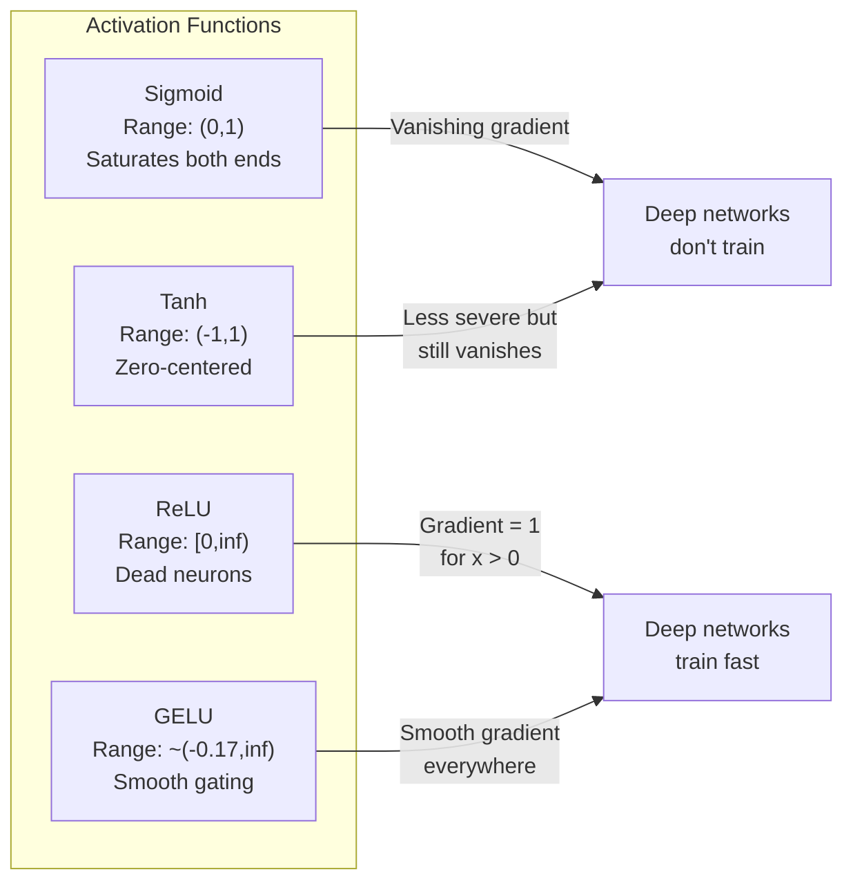
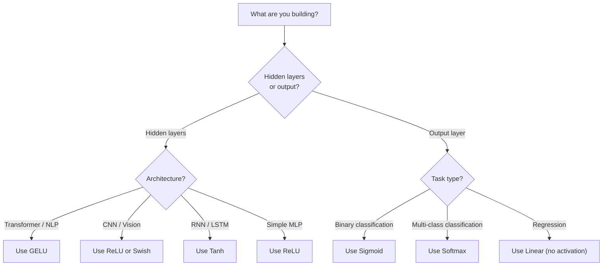

# Activation Functions | 激活函数

> Without nonlinearity, your 100-layer network is a fancy matrix multiply. Activations are the gates that let neural networks think in curves.

> **【中文解读】** 没有非线性激活函数，100 层网络等价于一个矩阵乘法。因为两个线性变换的复合还是线性的：W2(W1x+b1)+b2 = (W2W1)x + (W2b1+b2)。激活函数打破这种线性叠加，让每一层都能为网络增加真正的表达能力。

**Type:** Build
**Languages:** Python
**Prerequisites:** Lesson 03.03 (Backpropagation)
**Time:** ~75 minutes

## Learning Objectives | 学习目标

- Implement sigmoid, tanh, ReLU, Leaky ReLU, GELU, Swish, and softmax with their derivatives from scratch
- Diagnose the vanishing gradient problem by measuring activation magnitudes through 10+ layers with different activations
- Detect dead neurons in a ReLU network and explain why GELU avoids this failure mode
- Select the correct activation function for a given architecture (transformer, CNN, RNN, output layer)

> **【中文解读】** 本章目标：实现 7 种激活函数及其导数，通过实验诊断梯度消失问题，检测 ReLU 中的死亡神经元，学会为不同架构选择合适的激活函数。

## The Problem | 问题引入

Stack two linear transformations: y = W2(W1x + b1) + b2. Expand it: y = W2W1x + W2b1 + b2. That's just y = Ax + c -- a single linear transformation. No matter how many linear layers you stack, the result collapses to one matrix multiply. Your 100-layer network has the same representational power as a single layer.

> 堆叠两层线性变换：y = W2(W1x + b1) + b2。展开后：y = W2W1x + W2b1 + b2。这不过是 y = Ax + c——一个单独的线性变换。无论你堆叠多少线性层，结果都会坍缩为一次矩阵乘法。你的100层网络与单层网络具有相同的表示能力。

This is not a theoretical curiosity. It means a deep linear network literally cannot learn XOR, cannot classify a spiral dataset, cannot recognize a face. Without activation functions, depth is an illusion.

> 这不是理论上的好奇。这意味着深度线性网络实际上无法学习 XOR，无法分类螺旋数据集，无法识别人脸。没有激活函数，深度是一种幻觉。

Activation functions break the linearity. They warp the output of each layer through a nonlinear function, giving the network the ability to bend decision boundaries, approximate arbitrary functions, and actually learn. But pick the wrong activation and your gradients vanish to zero (sigmoid in deep networks), explode to infinity (unbounded activations without careful initialization), or your neurons die permanently (ReLU with large negative biases). The choice of activation function directly determines whether your network learns at all.

> 激活函数打破了线性。它们通过非线性函数扭曲每层的输出，赋予网络弯曲决策边界、逼近任意函数并真正学习的能力。但选错激活函数，梯度会消失为零（深层网络中的 sigmoid）、爆炸到无穷大（没有仔细初始化的无界激活），或神经元永久死亡（具有大负偏置的 ReLU）。激活函数的选择直接决定了你的网络是否能学习。

> **【中文解读】** 堆叠两层线性变换 y = W2(W1x+b1)+b2 展开后就是一个线性变换 y = Ax+c。不管叠多少层，结果都等价于一个矩阵乘法——深度是假的。激活函数打破线性，让网络能弯曲决策边界、逼近任意函数。选错激活函数会导致梯度消失（sigmoid）、梯度爆炸或神经元死亡（ReLU）。

## The Concept | 核心概念

### Why Nonlinearity Is Necessary | 为什么必须要有非线性

Matrix multiplication is composable. Multiplying a vector by matrix A then matrix B is identical to multiplying by AB. This means stacking ten linear layers is mathematically equivalent to one linear layer with one big matrix. All those parameters, all that depth -- wasted. You need something to break the chain. That's what activation functions do.

> 矩阵乘法是可组合的。先用矩阵 A 乘以向量，再用矩阵 B 乘，等同于用 AB 乘。这意味着堆叠十个线性层在数学上等价于一个具有一个大矩阵的线性层。所有那些参数、所有那些深度——都浪费了。你需要一些东西来打破这个链条。那就是激活函数的作用。

Here is the proof. A linear layer computes f(x) = Wx + b. Stack two:

```
Layer 1: h = W1 * x + b1         # 第一层线性变换
Layer 2: y = W2 * h + b2         # 第二层线性变换
```

Substitute:

```
y = W2 * (W1 * x + b1) + b2      # 代入 h
y = (W2 * W1) * x + (W2 * b1 + b2)  # 展开
y = A * x + c                     # 合并为单一矩阵——深度消失了！
```

One layer. Insert a nonlinear activation g() between layers:

```
h = g(W1 * x + b1)               # 加入非线性激活
y = W2 * h + b2
```

Now the substitution breaks. W2 * g(W1 * x + b1) + b2 cannot be reduced to a single linear transformation. The network can represent nonlinear functions. Each additional layer with an activation adds representational capacity.

> 现在代入被打破了。W2 * g(W1 * x + b1) + b2 无法简化为单一线性变换。网络可以表示非线性函数。每个带激活函数的附加层都增加了表示能力。

> **【中文解读】** 数学证明：两个线性变换的复合还是线性的。但插入非线性激活 g() 后，W2 * g(W1x + b1) + b2 无法合并为单一矩阵——每多一个带激活的层，网络的表达能力就真正增加。

### Sigmoid

The original activation function for neural networks.

> 神经网络最初的激活函数。

```
sigmoid(x) = 1 / (1 + e^(-x))
```

Output range: (0, 1). Smooth, differentiable, maps any real number to a probability-like value.

> 输出范围：(0, 1)。平滑、可微，将任何实数映射为类似概率的值。

The derivative:

> 其导数为：

```
sigmoid'(x) = sigmoid(x) * (1 - sigmoid(x))
```

The maximum value of this derivative is 0.25, occurring at x = 0. In backpropagation, gradients multiply through layers. Ten layers of sigmoid means the gradient gets multiplied by at most 0.25 ten times:

> 该导数的最大值为 0.25，出现在 x = 0 时。在反向传播中，梯度在层间相乘。十层 sigmoid 意味着梯度最多乘以 0.25 十次：

```
0.25^10 = 0.000000953674     # 不到原始信号的百万分之一
```

Less than one millionth of the original signal. This is the vanishing gradient problem. Gradients in early layers become so small that weights barely update. The network appears to learn -- loss decreases in later layers -- but the first layers are frozen. Deep sigmoid networks simply do not train.

> 不到原始信号的百万分之一。这就是梯度消失问题。前层的梯度变得如此之小，权重几乎不更新。网络似乎在学习——后面层的损失在下降——但前面的层被冻结了。深度 sigmoid 网络根本无法训练。

Additional problem: sigmoid outputs are always positive (0 to 1), which means gradients on weights are always the same sign. This causes zig-zagging during gradient descent.

> 额外的问题：sigmoid 输出总是正数（0 到 1），这意味着权重的梯度总是同号。这导致梯度下降呈锯齿形路径。

> **【中文解读】** Sigmoid 的导数最大只有 0.25，10 层后梯度只剩百万分之一。前面几层几乎收不到梯度，无法学习。另外 sigmoid 输出总是正数（0到1），导致权重梯度同号，优化路径呈锯齿形。

> **【拓展：Sigmoid 在现代 AI 中的位置】** Sigmoid 虽然不再用于隐藏层，但在二分类输出层仍然常用。Transformer 中的注意力分数也用 softmax（sigmoid 的一般化）。理解 sigmoid 的局限性，是理解为什么 ReLU/GELU 让深度学习成为可能的关键。

### Tanh

The centered version of sigmoid.

> Sigmoid 的零中心版本。

```
tanh(x) = (e^x - e^(-x)) / (e^x + e^(-x))
```

Output range: (-1, 1). Zero-centered, which eliminates the zig-zag problem.

> 输出范围：(-1, 1)。零中心化，消除了锯齿形问题。

The derivative:

> 其导数为：

```
tanh'(x) = 1 - tanh(x)^2
```

Maximum derivative is 1.0 at x = 0 -- four times better than sigmoid. But the vanishing gradient problem still exists. For large positive or negative inputs, the derivative approaches zero. Ten layers still crush the gradient, just less aggressively.

> 最大导数为 1.0（在 x = 0 时）——比 sigmoid 好 4 倍。但梯度消失问题仍然存在。对于大的正或负输入，导数趋近于零。十层仍然会压垮梯度，只是没那么严重。

> **【中文解读】** Tanh 是 sigmoid 的零中心版本，输出范围 (-1, 1)，导数最大值 1.0（比 sigmoid 好 4 倍）。但大输入时导数仍趋近于零，梯度消失问题依然存在，只是没那么严重。

> **【拓展：LSTM 中的 Tanh】** LSTM 网络的隐藏状态和候选记忆用 tanh（把值压缩到 -1 到 1）。虽然 Transformer 已经基本取代了 LSTM，但理解 tanh 对理解 RNN 系列模型很重要。

### ReLU: The Breakthrough | ReLU：深度学习的突破

Rectified Linear Unit. Popularized for deep learning by Nair and Hinton in 2010 (the function itself dates to Fukushima's 1969 work), it changed everything.

> 修正线性单元。由 Nair 和 Hinton 在 2010 年推广用于深度学习（该函数本身可追溯到 Fukushima 1969 年的工作），它改变了一切。

```
relu(x) = max(0, x)
```

Output range: [0, infinity). The derivative is trivially simple:

```
relu'(x) = 1  if x > 0
           0  if x <= 0
```

No vanishing gradient for positive inputs. The gradient is exactly 1, passed straight through. This is why deep networks became trainable -- ReLU preserves gradient magnitude across layers.

> 正输入没有梯度消失问题。梯度正好是 1，直接传递。这就是深度网络变得可训练的原因——ReLU 在层间保持梯度幅度。

But there is a failure mode: the dead neuron problem. If a neuron's weighted input is always negative (due to a large negative bias or unfortunate weight initialization), its output is always zero, its gradient is always zero, and it never updates. It is permanently dead. In practice, 10-40% of neurons in a ReLU network can die during training.

> 但存在一个失败模式：死亡神经元问题。如果某个神经元的加权输入始终为负（由于大的负偏置或不幸运的权重初始化），其输出始终为零，梯度始终为零，永远不更新。它永久死亡了。在实践中，ReLU 网络中 10-40% 的神经元可能在训练期间死亡。

> **【中文解读】** ReLU 对正输入的梯度恒为 1，完全不衰减——这就是深度网络变得可训练的原因。但它有"死亡神经元"问题：如果某个神经元的加权输入始终为负，它永远输出 0、梯度为 0，永远无法恢复。实践中 10-40% 的 ReLU 神经元可能死亡。

> **【拓展：ReLU 在 CNN 中的统治地位】** ResNet、VGG、EfficientNet 等 CNN 架构都用 ReLU（或其变体）。CNN 中的卷积层 + ReLU 是提取视觉特征的标准组合。

### Leaky ReLU

The simplest fix for dead neurons.

> 修复死亡神经元的最简单方法。

```
leaky_relu(x) = x        if x > 0
                alpha * x if x <= 0
```

Where alpha is a small constant, typically 0.01. The negative side has a small slope instead of zero, so dead neurons still get a gradient signal and can recover.

> 其中 alpha 是一个小常数，通常为 0.01。负侧有一个小斜率而不是零，所以死亡神经元仍然能获得梯度信号并可以恢复。

> **【中文解读】** Leaky ReLU 在负区间保留一个小的斜率（0.01），让死亡神经元仍能收到梯度信号、有可能恢复。

### GELU: The Modern Default | GELU：现代默认选择

Gaussian Error Linear Unit. Introduced by Hendrycks and Gimpel in 2016. Default activation in BERT, GPT, and most modern transformers.

> 高斯误差线性单元。由 Hendrycks 和 Gimpel 于 2016 年提出。BERT、GPT 和大多数现代 Transformer 的默认激活函数。

```
gelu(x) = x * Phi(x)
```

Where Phi(x) is the cumulative distribution function of the standard normal distribution. The approximation used in practice:

```
gelu(x) ~= 0.5 * x * (1 + tanh(sqrt(2/pi) * (x + 0.044715 * x^3)))
```

GELU is smooth everywhere, allows small negative values (unlike ReLU which hard-clips to zero), and has a probabilistic interpretation: it weights each input by how likely it is to be positive under a Gaussian distribution. This smooth gating outperforms ReLU in transformer architectures because it provides better gradient flow and avoids the dead neuron problem entirely.

> GELU 处处平滑，允许小的负值（不像 ReLU 硬截断为零），具有概率解释：它按输入在正态分布下为正的概率对每个输入加权。这种平滑门控在 Transformer 架构中优于 ReLU，因为它提供更好的梯度流并完全避免死亡神经元问题。

> **【中文解读】** GELU 是 BERT、GPT 和大多数现代 Transformer 的默认激活函数。它处处平滑、允许小的负值（不像 ReLU 硬截断为 0），概率解释是：按输入为正的概率加权。平滑的门控机制在 Transformer 中优于 ReLU，因为它提供更好的梯度流且完全避免死亡神经元问题。

> **【拓展：GPT/BERT 中的 GELU】** 在 Transformer 的 FFN（前馈网络）中，标准结构是 `Linear → GELU → Linear`。PyTorch 的 `nn.GELU()` 和 `F.gelu()` 就是这个函数。GPT-2/3/4、BERT、RoBERTa 等模型都使用 GELU。

### Swish / SiLU

Self-gated activation discovered by Ramachandran et al. in 2017 through automated search.

```
swish(x) = x * sigmoid(x)
```

Swish is formally x * sigmoid(x). Google discovered it through automated search over activation function space -- a neural network designing parts of neural networks.

Like GELU, it is smooth, non-monotonic, and allows small negative values. The difference is subtle: Swish uses sigmoid for gating while GELU uses the Gaussian CDF. In practice, performance is nearly identical. Swish is used in EfficientNet and some vision models. GELU dominates in language models.

> **【中文解读】** Swish = x * sigmoid(x)，通过自动搜索发现（用神经网络设计神经网络的一部分）。和 GELU 性能几乎相同，细微区别是 Swish 用 sigmoid 门控、GELU 用高斯 CDF 门控。Swish 用于 EfficientNet 等视觉模型，GELU 统治语言模型。

### Softmax: The Output Activation | Softmax：输出层激活函数

Not used in hidden layers. Softmax converts a vector of raw scores (logits) into a probability distribution.

```
softmax(x_i) = e^(x_i) / sum(e^(x_j) for all j)
```

Every output is between 0 and 1. All outputs sum to 1. This makes it the standard final activation for multi-class classification. The largest logit gets the highest probability, but unlike argmax, softmax is differentiable and preserves information about relative confidence.

> **【中文解读】** Softmax 不用于隐藏层，而是输出层——把原始分数（logits）变成概率分布。所有输出在 0-1 之间且总和为 1。最大分数得到最高概率，但与 argmax 不同，softmax 可导且保留了置信度信息。

> **【拓展：Softmax 在 Transformer 中无处不在】** Transformer 的自注意力机制用 softmax 计算注意力权重：`attention = softmax(Q·K^T / sqrt(d_k))`。每一层的注意力头都离不开 softmax。

### Comparison of Shapes | 形状对比



### Which Activation When | 什么时候用什么激活函数



> **【中文解读】** 经验法则：Transformer/NLP 用 GELU，CNN/视觉用 ReLU，RNN/LSTM 用 tanh。输出层：二分类用 sigmoid，多分类用 softmax，回归不用激活。

## Build It | 动手构建

### Step 1: Implement All Activation Functions with Derivatives

Each function takes a single float and returns a float. Each derivative function takes the same input and returns the gradient.

```python
import math

def sigmoid(x):
    x = max(-500, min(500, x))  # 裁剪防止溢出
    return 1.0 / (1.0 + math.exp(-x))  # σ(x) = 1/(1+e^(-x))

def sigmoid_derivative(x):
    s = sigmoid(x)
    return s * (1 - s)  # sigmoid 导数 = σ(x)(1 - σ(x))，最大值 0.25

def tanh_act(x):
    return math.tanh(x)  # 双曲正切

def tanh_derivative(x):
    t = math.tanh(x)
    return 1 - t * t  # tanh 导数 = 1 - tanh²(x)，最大值 1.0

def relu(x):
    return max(0.0, x)  # 正区间透传，负区间归零

def relu_derivative(x):
    return 1.0 if x > 0 else 0.0  # 正区间梯度=1，负区间梯度=0

def leaky_relu(x, alpha=0.01):
    return x if x > 0 else alpha * x  # 负区间保留小斜率

def leaky_relu_derivative(x, alpha=0.01):
    return 1.0 if x > 0 else alpha  # 负区间梯度=alpha

def gelu(x):
    # GELU 近似公式，用于 GPT/BERT 等 Transformer
    return 0.5 * x * (1 + math.tanh(math.sqrt(2 / math.pi) * (x + 0.044715 * x ** 3)))

def gelu_derivative(x):
    phi = 0.5 * (1 + math.erf(x / math.sqrt(2)))  # 标准正态 CDF
    pdf = math.exp(-0.5 * x * x) / math.sqrt(2 * math.pi)  # 标准正态 PDF
    return phi + x * pdf

def swish(x):
    return x * sigmoid(x)  # Swish = x * σ(x)，用于 EfficientNet

def swish_derivative(x):
    s = sigmoid(x)
    return s + x * s * (1 - s)  # Swish 导数 = σ(x) + x·σ(x)(1-σ(x))

def softmax(xs):
    max_x = max(xs)  # 数值稳定性：减去最大值
    exps = [math.exp(x - max_x) for x in xs]
    total = sum(exps)
    return [e / total for e in exps]  # 所有输出和为 1
```

### Step 2: Visualize Where Gradients Die | 可视化梯度死亡区域

Compute the gradient at 100 evenly-spaced points from -5 to 5. Print a text histogram showing where each activation's gradient is near-zero.

```python
def gradient_scan(name, derivative_fn, start=-5, end=5, n=100):
    step = (end - start) / n
    near_zero = 0
    healthy = 0
    for i in range(n):
        x = start + i * step
        g = derivative_fn(x)
        if abs(g) < 0.01:       # 梯度接近零的区域
            near_zero += 1
        else:
            healthy += 1
    pct_dead = near_zero / n * 100
    print(f"{name:15s}: {healthy:3d} healthy, {near_zero:3d} near-zero ({pct_dead:.0f}% dead zone)")

gradient_scan("Sigmoid", sigmoid_derivative)
gradient_scan("Tanh", tanh_derivative)
gradient_scan("ReLU", relu_derivative)
gradient_scan("Leaky ReLU", leaky_relu_derivative)
gradient_scan("GELU", gelu_derivative)
gradient_scan("Swish", swish_derivative)
```

### Step 3: Vanishing Gradient Experiment | 梯度消失实验

Forward-pass a signal through N layers using sigmoid vs ReLU. Measure how the activation magnitude changes.

```python
import random

def vanishing_gradient_experiment(activation_fn, name, n_layers=10, n_inputs=5):
    random.seed(42)
    values = [random.gauss(0, 1) for _ in range(n_inputs)]

    print(f"\n{name} through {n_layers} layers:")
    for layer in range(n_layers):
        weights = [random.gauss(0, 1) for _ in range(n_inputs)]
        z = sum(w * v for w, v in zip(weights, values))  # 加权求和
        activated = activation_fn(z)  # 激活
        magnitude = abs(activated)
        bar = "#" * int(magnitude * 20)
        print(f"  Layer {layer+1:2d}: magnitude = {magnitude:.6f} {bar}")  # 观察 magnitude 是否逐层缩小
        values = [activated] * n_inputs

vanishing_gradient_experiment(sigmoid, "Sigmoid")  # sigmoid 的 magnitude 会快速缩小
vanishing_gradient_experiment(relu, "ReLU")        # ReLU 的 magnitude 不会缩小
vanishing_gradient_experiment(gelu, "GELU")        # GELU 介于两者之间
```

### Step 4: Dead Neuron Detector | 死亡神经元检测器

Create a ReLU network, pass random inputs through it, count how many neurons never fire.

```python
def dead_neuron_detector(n_inputs=5, hidden_size=20, n_samples=1000):
    random.seed(0)
    weights = [[random.gauss(0, 1) for _ in range(n_inputs)] for _ in range(hidden_size)]
    biases = [random.gauss(0, 1) for _ in range(hidden_size)]

    fire_counts = [0] * hidden_size  # 记录每个神经元的激活次数

    for _ in range(n_samples):
        inputs = [random.gauss(0, 1) for _ in range(n_inputs)]
        for neuron_idx in range(hidden_size):
            z = sum(w * x for w, x in zip(weights[neuron_idx], inputs)) + biases[neuron_idx]
            if relu(z) > 0:           # ReLU 激活 > 0 算"激活"
                fire_counts[neuron_idx] += 1

    dead = sum(1 for c in fire_counts if c == 0)          # 从未激活 = 死亡
    rarely_fire = sum(1 for c in fire_counts if 0 < c < n_samples * 0.05)  # 极少激活
    healthy = hidden_size - dead - rarely_fire

    print(f"\nDead Neuron Report ({hidden_size} neurons, {n_samples} samples):")
    print(f"  Dead (never fired):     {dead}")
    print(f"  Barely alive (<5%):     {rarely_fire}")
    print(f"  Healthy:                {healthy}")
    print(f"  Dead neuron rate:       {dead/hidden_size*100:.1f}%")

    for i, c in enumerate(fire_counts):
        status = "DEAD" if c == 0 else "WEAK" if c < n_samples * 0.05 else "OK"
        bar = "#" * (c * 40 // n_samples)
        print(f"  Neuron {i:2d}: {c:4d}/{n_samples} fires [{status:4s}] {bar}")

dead_neuron_detector()
```

### Step 5: Training Comparison -- Sigmoid vs ReLU vs GELU | 训练对比

Train the same two-layer network on the circle dataset (points inside a circle = class 1, outside = class 0) with three different activations. Compare convergence speed.

```python
def make_circle_data(n=200, seed=42):
    random.seed(seed)
    data = []
    for _ in range(n):
        x = random.uniform(-2, 2)
        y = random.uniform(-2, 2)
        label = 1.0 if x * x + y * y < 1.5 else 0.0  # 距原点 < sqrt(1.5) 为"内部"
        data.append(([x, y], label))
    return data


class ActivationNetwork:
    """使用指定激活函数的两层网络，用于对比不同激活函数的训练效果"""
    def __init__(self, activation_fn, activation_deriv, hidden_size=8, lr=0.1):
        random.seed(0)
        self.act = activation_fn       # 激活函数
        self.act_d = activation_deriv  # 激活函数导数
        self.lr = lr
        self.hidden_size = hidden_size

        self.w1 = [[random.gauss(0, 0.5) for _ in range(2)] for _ in range(hidden_size)]  # 隐藏层权重
        self.b1 = [0.0] * hidden_size   # 隐藏层偏置
        self.w2 = [random.gauss(0, 0.5) for _ in range(hidden_size)]  # 输出层权重
        self.b2 = 0.0                    # 输出层偏置

    def forward(self, x):
        self.x = x
        self.z1 = []
        self.h = []
        for i in range(self.hidden_size):
            z = self.w1[i][0] * x[0] + self.w1[i][1] * x[1] + self.b1[i]  # 线性变换
            self.z1.append(z)
            self.h.append(self.act(z))  # 激活（这里对比不同激活函数的效果）

        self.z2 = sum(self.w2[i] * self.h[i] for i in range(self.hidden_size)) + self.b2
        self.out = sigmoid(self.z2)  # 输出层用 sigmoid（二分类标准）
        return self.out

    def backward(self, target):
        error = self.out - target
        d_out = error * self.out * (1 - self.out)  # 输出层梯度

        for i in range(self.hidden_size):
            d_h = d_out * self.w2[i] * self.act_d(self.z1[i])  # 隐藏层梯度
            self.w2[i] -= self.lr * d_out * self.h[i]           # 更新输出层权重
            for j in range(2):
                self.w1[i][j] -= self.lr * d_h * self.x[j]     # 更新隐藏层权重
            self.b1[i] -= self.lr * d_h                          # 更新隐藏层偏置
        self.b2 -= self.lr * d_out                               # 更新输出层偏置

    def train(self, data, epochs=200):
        losses = []
        for epoch in range(epochs):
            total_loss = 0
            correct = 0
            for x, y in data:
                pred = self.forward(x)
                self.backward(y)
                total_loss += (pred - y) ** 2
                if (pred >= 0.5) == (y >= 0.5):
                    correct += 1
            avg_loss = total_loss / len(data)
            accuracy = correct / len(data) * 100
            losses.append(avg_loss)
            if epoch % 50 == 0 or epoch == epochs - 1:
                print(f"    Epoch {epoch:3d}: loss={avg_loss:.4f}, accuracy={accuracy:.1f}%")
        return losses


data = make_circle_data()

configs = [
    ("Sigmoid", sigmoid, sigmoid_derivative),    # 预期：收敛慢，梯度消失
    ("ReLU", relu, relu_derivative),              # 预期：收敛快
    ("GELU", gelu, gelu_derivative),              # 预期：收敛快且平滑
]

results = {}
for name, act_fn, act_d_fn in configs:
    print(f"\n=== Training with {name} ===")
    net = ActivationNetwork(act_fn, act_d_fn, hidden_size=8, lr=0.1)
    losses = net.train(data, epochs=200)
    results[name] = losses

print("\n=== Final Loss Comparison ===")
for name, losses in results.items():
    print(f"  {name:10s}: start={losses[0]:.4f} -> end={losses[-1]:.4f} (improvement: {(1 - losses[-1]/losses[0])*100:.1f}%)")
```

## Use It | 实际应用

PyTorch provides all of these as both functional and module forms:

```python
import torch
import torch.nn as nn
import torch.nn.functional as F

x = torch.randn(4, 10)  # 4 个样本，每个 10 维

relu_out = F.relu(x)           # ReLU：对应我们的 relu()
gelu_out = F.gelu(x)           # GELU：对应我们的 gelu()
sigmoid_out = torch.sigmoid(x)  # Sigmoid：对应我们的 sigmoid()
swish_out = F.silu(x)          # Swish/SiLU：对应我们的 swish()

logits = torch.randn(4, 5)     # 4 个样本，5 个类别
probs = F.softmax(logits, dim=1)  # Softmax：对应我们的 softmax()

model = nn.Sequential(
    nn.Linear(10, 64),
    nn.GELU(),          # Transformer 标配：GELU
    nn.Linear(64, 32),
    nn.GELU(),
    nn.Linear(32, 5),   # 输出层：不加激活（logits）
)
```

Hidden layers in a transformer: GELU. Hidden layers in a CNN: ReLU. Output layer for classification: softmax. Output layer for regression: none (linear). Output layer for probabilities: sigmoid. That's it. Start with these defaults. Change them only when you have evidence.

RNNs and LSTMs use tanh for hidden state and sigmoid for gates, but if you're building from scratch today, you're probably not using RNNs. If neurons are dying in your ReLU network, switch to GELU. Don't reach for Leaky ReLU unless you have a specific reason -- GELU solves the dead neuron problem and gives better gradient flow.

> **【中文解读】** PyTorch 提供了所有激活函数的函数式和模块式 API。经验法则：Transformer 隐藏层用 GELU，CNN 隐藏层用 ReLU，分类输出用 softmax，回归输出不用激活。如果 ReLU 神经元死亡，换 GELU（而非 Leaky ReLU）。

## Ship It | 输出物

This lesson produces:
- `outputs/prompt-activation-selector.md` -- a reusable prompt that helps you pick the right activation function for any architecture

## Exercises | 练习题

1. Implement Parametric ReLU (PReLU) where the negative slope alpha is a learnable parameter. Train it on the circle dataset and compare to fixed Leaky ReLU.
   > **练习 1：** 实现 PReLU（负斜率 alpha 可学习），在圆形数据上训练并与 Leaky ReLU 对比。

2. Run the vanishing gradient experiment with 50 layers instead of 10. Plot the magnitude at each layer for sigmoid, tanh, ReLU, and GELU. At which layer does each activation's signal effectively reach zero?
   > **练习 2：** 把梯度消失实验扩展到 50 层。哪个激活函数的信号最先归零？

3. Implement the ELU (Exponential Linear Unit): elu(x) = x if x > 0, alpha * (e^x - 1) if x <= 0. Compare its dead neuron rate to ReLU on the same network.
   > **练习 3：** 实现 ELU，在相同网络上对比 ELU 和 ReLU 的死亡神经元率。

4. Build a "gradient health monitor" that runs during training: at each epoch, compute the average gradient magnitude at each layer. Print a warning when any layer's gradient drops below 0.001 or exceeds 100.
   > **练习 4：** 构建"梯度健康监控器"——每轮计算各层平均梯度大小，低于 0.001 或超过 100 时报警。

5. Modify the training comparison to use the XOR dataset from Lesson 01 instead of circles. Which activation converges fastest on XOR? Why does this differ from the circle results?
   > **练习 5：** 用 XOR 数据集替代圆形数据做对比。哪个激活函数收敛最快？为什么和圆形结果不同？

## Key Terms | 关键术语

| Term | What people say | What it actually means |
|------|----------------|----------------------|
| Activation function | "The nonlinear part" | A function applied to each neuron's output that breaks linearity, enabling the network to learn nonlinear mappings |
| Vanishing gradient | "Gradients disappear in deep networks" | Gradients shrink exponentially through layers when the activation's derivative is less than 1, making early layers untrainable |
| Exploding gradient | "Gradients blow up" | Gradients grow exponentially through layers when the effective multiplier exceeds 1, causing unstable training |
| Dead neuron | "A neuron that stopped learning" | A ReLU neuron whose input is permanently negative, producing zero output and zero gradient |
| Sigmoid | "Squishes values to 0-1" | The logistic function 1/(1+e^-x), historically important but causes vanishing gradients in deep networks |
| ReLU | "Clips negatives to zero" | max(0, x) -- the activation that made deep learning practical by preserving gradient magnitude |
| GELU | "The transformer activation" | Gaussian Error Linear Unit, a smooth activation that weights inputs by their probability of being positive |
| Swish/SiLU | "Self-gated ReLU" | x * sigmoid(x), discovered through automated search, used in EfficientNet |
| Softmax | "Turns scores into probabilities" | Normalizes a vector of logits into a probability distribution where all values are in (0,1) and sum to 1 |
| Leaky ReLU | "ReLU that doesn't die" | max(alpha*x, x) where alpha is small (0.01), preventing dead neurons by allowing small negative gradients |
| Saturation | "The flat part of sigmoid" | Regions where an activation's derivative approaches zero, blocking gradient flow |
| Logit | "The raw score before softmax" | The unnormalized output of the final layer before applying softmax or sigmoid |

| 术语 | 通俗说法 | 实际含义 |
|------|---------|---------|
| 激活函数 (Activation function) | "非线性那部分" | 施加在每个神经元输出上的函数，打破线性，使网络能学习非线性映射 |
| 梯度消失 (Vanishing gradient) | "深层梯度消失" | 导数小于 1 的激活函数导致梯度逐层指数缩小，前面的层无法训练 |
| 梯度爆炸 (Exploding gradient) | "梯度爆炸" | 有效乘数超过 1 时梯度逐层指数增长，训练不稳定 |
| 死亡神经元 (Dead neuron) | "停止学习的神经元" | ReLU 神经元输入永远为负，输出和梯度永远为零 |
| Sigmoid | "压到 0-1" | 逻辑函数 1/(1+e^-x)，历史重要但深层网络中梯度消失 |
| ReLU | "负数变零" | max(0, x)——通过保持梯度幅度让深度学习变得可行的激活函数 |
| GELU | "Transformer 激活" | 高斯误差线性单元，按输入为正的概率加权的平滑激活 |
| Swish/SiLU | "自门控 ReLU" | x * sigmoid(x)，通过自动搜索发现，用于 EfficientNet |
| Softmax | "分数变概率" | 把 logits 归一化为概率分布，所有值在 (0,1) 且和为 1 |
| Leaky ReLU | "不会死的 ReLU" | max(alpha*x, x)，负区间保留小梯度防止神经元死亡 |
| 饱和 (Saturation) | "sigmoid 的平坦区" | 激活函数导数趋近于零的区域，阻断梯度流 |
| Logit | "softmax 前的原始分" | 最终层未归一化的输出 |

## Further Reading | 延伸阅读

- Nair & Hinton, "Rectified Linear Units Improve Restricted Boltzmann Machines" (2010) -- the paper that introduced ReLU and enabled training of deep networks
- Hendrycks & Gimpel, "Gaussian Error Linear Units (GELUs)" (2016) -- introduced the activation function that became the default for transformers
- Ramachandran et al., "Searching for Activation Functions" (2017) -- used automated search to discover Swish, showing that activation design can be automated
- Glorot & Bengio, "Understanding the difficulty of training deep feedforward neural networks" (2010) -- the paper that diagnosed vanishing/exploding gradients and proposed Xavier initialization
- Goodfellow, Bengio, Courville, "Deep Learning" Chapter 6.3 (https://www.deeplearningbook.org/) -- rigorous treatment of hidden units and activation functions
