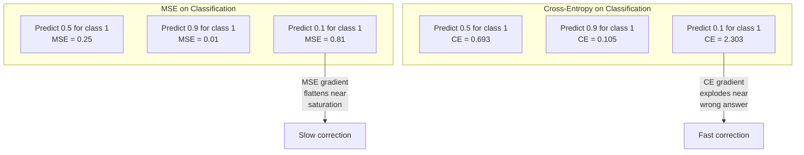
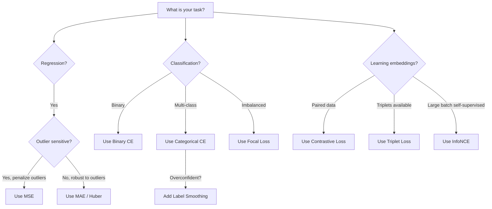

# Loss Functions | 损失函数

> Your network makes a prediction. The ground truth says otherwise. How wrong is it? That number is the loss. Pick the wrong loss function and your model optimizes for the wrong thing entirely.

> **【中文解读】** 损失函数是模型唯一优化的目标——不是准确率、不是 F1 分数，就是损失值。选错损失函数，模型会找到"数学上最省事"的方式满足它，而不是你真正想要的结果。比如分类任务用 MSE，模型会预测所有样本为 0.5（最低损失但毫无用处）。

**Type:** Build
**Languages:** Python
**Prerequisites:** Lesson 03.04 (Activation Functions)
**Time:** ~75 minutes

## Learning Objectives | 学习目标

- Implement MSE, binary cross-entropy, categorical cross-entropy, and contrastive loss (InfoNCE) from scratch with their gradients
- Explain why MSE fails for classification by demonstrating the "predict 0.5 for everything" failure mode
- Apply label smoothing to cross-entropy and describe how it prevents overconfident predictions
- Choose the correct loss function for regression, binary classification, multi-class classification, and embedding learning tasks

> **【中文解读】** 本章目标：实现 5 种损失函数及梯度，理解为什么分类任务不能用 MSE，学习标签平滑和对比损失，学会根据任务选择正确的损失函数。

## The Problem | 问题引入

A model minimizing MSE on a classification problem will confidently predict 0.5 for everything. It's minimizing loss. It's also useless.

> 一个在分类问题上最小化 MSE 的模型会自信地对所有输入预测 0.5。它在最小化损失。但同时也毫无用处。

The loss function is the only thing your model actually optimizes. Not accuracy. Not F1 score. Not whatever metric you report to your manager. The optimizer takes the gradient of the loss function and adjusts weights to make that number smaller. If the loss function doesn't capture what you care about, the model will find the mathematically cheapest way to satisfy it, and that way is almost never what you wanted.

> 损失函数是你的模型实际优化的唯一目标。不是准确率。不是 F1 分数。不是你向经理报告的任何指标。优化器获取损失函数的梯度并调整权重使该数字更小。如果损失函数没有捕捉到你在乎的东西，模型会找到数学上最便宜的方式来满足它，而那个方式几乎从来不是你想要的。

Here is a concrete example. You have a binary classification task. Two classes, 50/50 split. You use MSE as your loss. The model predicts 0.5 for every single input. The average MSE is 0.25, which is the minimum possible without actually learning anything. The model has zero discriminative ability but it has technically minimized your loss function. Switch to cross-entropy and the same model is forced to push predictions toward 0 or 1, because -log(0.5) = 0.693 is a terrible loss, while -log(0.99) = 0.01 rewards confident correct predictions. The choice of loss function is the difference between a model that learns and a model that games the metric.

> 具体例子：二元分类任务，两类各占 50%。你用 MSE 作为损失。模型对每个输入都预测 0.5。平均 MSE 为 0.25，这是在实际上没学到任何东西的情况下可能的最小值。模型没有任何区分能力，但在技术上已经最小化了你的损失函数。换成交叉熵后，同样的模型被迫将预测推向 0 或 1，因为 -log(0.5) = 0.693 是一个很差的损失，而 -log(0.99) = 0.01 会奖励自信的正确预测。损失函数的选择决定了模型是学习还是在钻系统的空子。

It gets worse. In self-supervised learning, you don't even have labels. Contrastive loss defines the learning signal entirely: what counts as similar, what counts as different, and how hard the model should push them apart. Get contrastive loss wrong and your embeddings collapse to a single point -- every input maps to the same vector. Technically zero loss. Completely worthless.

> 情况更糟的是，在自监督学习中，你甚至没有标签。对比损失完全定义了学习信号：什么算相似，什么算不同，模型应该以多大力度将它们分开。搞错对比损失，你的嵌入会坍缩到一个点——每个输入映射到同一个向量。技术上损失为零。但完全无用。

> **【中文解读】** MSE 做分类时，模型发现预测 0.5 是最安全的策略——损失最低但毫无区分能力。交叉熵则通过 -log(p) 惩罚不自信的预测：-log(0.5)=0.693（很差）vs -log(0.99)=0.01（很好），迫使模型做出明确判断。在自监督学习中，对比损失定义了全部学习信号——搞错了会导致所有嵌入坍缩到同一点。

## The Concept | 核心概念

### Mean Squared Error (MSE) | 均方误差

The default for regression. Compute the squared difference between prediction and target, average over all samples.

> 回归任务的默认选择。计算预测值与目标值的平方差，对所有样本取平均。

```
MSE = (1/n) * sum((y_pred - y_true)^2)
```

Why squaring matters: it penalizes large errors quadratically. An error of 2 costs 4x as much as an error of 1. An error of 10 costs 100x. This makes MSE sensitive to outliers -- a single wildly wrong prediction dominates the loss.

> 为什么平方很重要：它对大误差进行二次惩罚。误差为 2 的代价是误差为 1 的 4 倍。误差为 10 的代价是 100 倍。这使得 MSE 对异常值敏感——一个严重错误的预测会主导整个损失。

Real numbers: if your model predicts housing prices and is off by $10,000 on most houses but off by $200,000 on one mansion, MSE will aggressively try to fix that one mansion, potentially hurting performance on the other 99 houses.

> 具体数字：如果你的模型预测房价，大多数房屋偏差 $10,000，但一栋豪宅偏差 $200,000，MSE 会激进地试图修复那栋豪宅，可能会损害其他 99 栋房屋的性能。

The gradient of MSE with respect to a prediction is:

> MSE 对预测的梯度为：

```
dMSE/dy_pred = (2/n) * (y_pred - y_true)      # 梯度与误差成线性关系
```

Linear in the error. Bigger errors get bigger gradients. This is a feature for regression (large errors need large corrections) and a bug for classification (you want to penalize confident wrong answers exponentially, not linearly).

> 与误差成线性关系。更大的误差获得更大的梯度。这对回归是优点（大误差需要大修正），但对分类是缺点（你想对自信的错误答案进行指数级惩罚，而不是线性惩罚）。

> **【中文解读】** MSE 是回归任务的默认损失：误差的平方平均。平方让大误差付出更高代价（误差 10 的惩罚是误差 1 的 100 倍），但也让它对异常值敏感。梯度与误差成线性关系——对回归是好事（大误差需要大修正），对分类是坏事（应该对"自信的错误"指数级惩罚）。

> **【拓展：MSE 在 AI 中的应用】** MSE 常用于回归任务（房价预测、温度预测）。在图像生成模型（如 Stable Diffusion）中，MSE 也用于衡量生成图像和目标图像的像素差异。PyTorch: `F.mse_loss(pred, target)`。

### Cross-Entropy Loss | 交叉熵损失

The loss function for classification. Rooted in information theory -- it measures the divergence between the predicted probability distribution and the true distribution.

> 分类任务的损失函数。根植于信息论——它衡量预测概率分布与真实分布之间的差异。

**Binary Cross-Entropy (BCE) | 二元交叉熵：**

```
BCE = -(y * log(p) + (1 - y) * log(1 - p))
```

Where y is the true label (0 or 1) and p is the predicted probability.

> 其中 y 是真实标签（0 或 1），p 是预测概率。

Why -log(p) works: when the true label is 1 and you predict p = 0.99, the loss is -log(0.99) = 0.01. When you predict p = 0.01, the loss is -log(0.01) = 4.6. That 460x difference is why cross-entropy works. It brutally punishes confident wrong predictions while barely penalizing confident correct ones.

> 为什么 -log(p) 有效：当真实标签为 1 且你预测 p = 0.99 时，损失为 -log(0.99) = 0.01。当你预测 p = 0.01 时，损失为 -log(0.01) = 4.6。那 460 倍的差距就是交叉熵有效的原因。它残酷地惩罚自信的错误预测，而对自信的正确预测几乎不惩罚。

The gradient tells the same story:

```
dBCE/dp = -(y/p) + (1-y)/(1-p)     # 梯度在预测错误时极大
```

When y = 1 and p is near zero, the gradient is -1/p which approaches negative infinity. The model gets an enormous signal to fix its mistake. When p is near 1, the gradient is tiny. Already correct, nothing to fix.

> **【中文解读】** 交叉熵是分类任务的标配。核心是 -log(p)：预测正确且自信（p=0.99）时损失只有 0.01，预测错误且自信（p=0.01）时损失高达 4.6——460 倍的差距！梯度在预测错误时趋近无穷大，给模型强烈的修正信号。

> **【拓展：交叉熵在 Transformer 中】** GPT 的训练损失就是交叉熵——预测下一个 token 的交叉熵。每个位置预测词表中的哪个词，用交叉熵衡量预测和真实的差距。PyTorch: `F.cross_entropy(logits, labels)`。

**Categorical Cross-Entropy | 多类交叉熵：**

For multi-class classification with one-hot encoded targets.

```
CCE = -sum(y_i * log(p_i))          # 只有真实类别贡献损失
```

Only the true class contributes to the loss (because all other y_i are zero). If there are 10 classes and the correct class gets probability 0.1 (random guessing), the loss is -log(0.1) = 2.3. If the correct class gets probability 0.9, the loss is -log(0.9) = 0.105. The model learns to concentrate probability mass on the right answer.

### Why MSE Fails for Classification | 为什么 MSE 不适合分类



MSE gradients flatten when predictions are near 0 or 1 (due to sigmoid saturation). Cross-entropy gradients compensate for this -- the -log cancels the sigmoid's flat regions, giving strong gradients exactly where they are needed most.

> **【中文解读】** MSE 的梯度在预测接近 0 或 1 时变平（因为 sigmoid 饱和），导致修正缓慢。交叉熵的 -log 正好抵消 sigmoid 的平坦区域，在最需要修正的地方提供最强梯度。

### Label Smoothing | 标签平滑

Standard one-hot labels say "this is 100% class 3 and 0% everything else." That's a strong claim. Label smoothing softens it:

```
smooth_label = (1 - alpha) * one_hot + alpha / num_classes
```

With alpha = 0.1 and 10 classes: instead of [0, 0, 1, 0, ...], the target becomes [0.01, 0.01, 0.91, 0.01, ...]. The model targets 0.91 instead of 1.0.

Why this works: a model trying to output exactly 1.0 through a softmax needs to push logits to infinity. This causes overconfidence, hurts generalization, and makes the model brittle to distribution shift. Label smoothing caps the target at 0.9 (with alpha=0.1), keeping logits in a reasonable range. GPT and most modern models use label smoothing or its equivalent.

> **【中文解读】** 标签平滑把硬标签 [0, 0, 1, 0, ...] 变成软标签 [0.01, 0.01, 0.91, 0.01, ...]。因为要让 softmax 输出 1.0 需要 logit 趋近无穷大，这会导致过拟合和过度自信。标签平滑把目标上限降到 0.9，保持 logit 在合理范围。GPT 和大多数现代模型都用标签平滑。

### Contrastive Loss | 对比损失

No labels. No classes. Just pairs of inputs and the question: are these similar or different?

> 没有标签。没有类别。只有输入对和这个问题：它们相似还是不同？

**SimCLR-style contrastive loss (NT-Xent / InfoNCE):**

Take one image. Create two augmented views of it (crop, rotate, color jitter). These are the "positive pair" -- they should have similar embeddings. Every other image in the batch forms a "negative pair" -- they should have different embeddings.

> 取一张图像。创建两个增强视图（裁剪、旋转、颜色抖动）。这是"正对"——它们应该有相似的嵌入。批量中的每张其他图像形成"负对"——它们应该有不同的嵌入。

```
L = -log(exp(sim(z_i, z_j) / tau) / sum(exp(sim(z_i, z_k) / tau)))
```

Where sim() is cosine similarity, z_i and z_j are the positive pair, the sum is over all negatives, and tau (temperature) controls how sharp the distribution is. Lower temperature = harder negatives = more aggressive separation.

> **【中文解读】** 对比损失不需要标签！取一张图片的两个增强版本作为"正对"（应该相似），其他图片作为"负对"（应该不同）。损失 = -log(正对相似度 / 所有可能对的相似度之和)。温度 tau 越低，区分越严格。

> **【拓展：对比学习在 RAG 和嵌入模型中】** OpenAI 的 text-embedding-ada-002、BGE、E5 等嵌入模型都用对比学习训练。在 RAG 中，检索器的好坏取决于嵌入质量，而嵌入质量取决于对比损失的设计。SimCLR、CLIP、SimCSE 都是这个范式。

### Focal Loss | 焦点损失

For imbalanced datasets. Standard cross-entropy treats all correctly classified examples equally. Focal loss down-weights easy examples:

```
FL = -alpha * (1 - p_t)^gamma * log(p_t)
```

Where p_t is the predicted probability of the true class and gamma controls the focusing. With gamma = 0, this is standard cross-entropy. With gamma = 2 (the default):

- Easy example (p_t = 0.9): weight = (0.1)^2 = 0.01. Effectively ignored.
- Hard example (p_t = 0.1): weight = (0.9)^2 = 0.81. Full gradient signal.

> **【中文解读】** Focal Loss 为类别不平衡设计。简单样本（p_t=0.9）的权重只有 0.01，几乎被忽略；困难样本（p_t=0.1）的权重 0.81，获得完整梯度信号。这让模型专注于困难案例。用于目标检测（RetinaNet），99% 是背景、1% 是目标。

### Loss Function Decision Tree | 损失函数选择决策树



> **【中文解读】** 选择经验：回归用 MSE/Huber，二分类用 BCE，多分类用 CCE，不平衡用 Focal Loss，学嵌入用对比损失。

## Build It | 动手构建

### Step 1: MSE and Its Gradient | MSE 及其梯度

```python
def mse(predictions, targets):
    n = len(predictions)
    total = 0.0
    for p, t in zip(predictions, targets):
        total += (p - t) ** 2            # 平方误差
    return total / n                      # 取平均

def mse_gradient(predictions, targets):
    n = len(predictions)
    grads = []
    for p, t in zip(predictions, targets):
        grads.append(2.0 * (p - t) / n)  # 梯度 = 2*(pred - true) / n
    return grads
```

### Step 2: Binary Cross-Entropy | 二元交叉熵

The log(0) problem is real. If the model predicts exactly 0 for a positive example, log(0) = negative infinity. Clipping prevents this.

```python
import math

def binary_cross_entropy(predictions, targets, eps=1e-15):
    n = len(predictions)
    total = 0.0
    for p, t in zip(predictions, targets):
        p_clipped = max(eps, min(1 - eps, p))  # 裁剪防止 log(0)
        total += -(t * math.log(p_clipped) + (1 - t) * math.log(1 - p_clipped))  # -[y*log(p) + (1-y)*log(1-p)]
    return total / n

def bce_gradient(predictions, targets, eps=1e-15):
    grads = []
    for p, t in zip(predictions, targets):
        p_clipped = max(eps, min(1 - eps, p))
        grads.append(-(t / p_clipped) + (1 - t) / (1 - p_clipped))  # 梯度 = -y/p + (1-y)/(1-p)
    return grads
```

### Step 3: Categorical Cross-Entropy with Softmax | 带softmax的多类交叉熵

```python
def softmax(logits):
    max_val = max(logits)  # 数值稳定性
    exps = [math.exp(x - max_val) for x in logits]
    total = sum(exps)
    return [e / total for e in exps]

def categorical_cross_entropy(logits, target_index, eps=1e-15):
    probs = softmax(logits)
    p = max(eps, probs[target_index])
    return -math.log(p)  # -log(真实类别的概率)

def cce_gradient(logits, target_index):
    probs = softmax(logits)
    grads = list(probs)              # 复制 softmax 输出
    grads[target_index] -= 1.0      # 真实类别减 1：softmax 输出 - one-hot
    return grads
```

The gradient of softmax + cross-entropy simplifies beautifully: it's just (predicted probability - 1) for the true class, and (predicted probability) for all other classes. This elegant simplification is not a coincidence -- it's why softmax and cross-entropy are paired.

> **【中文解读】** Softmax + 交叉熵的梯度简化为：预测概率减去 one-hot 目标。真实类别是 p-1，其他类别是 p。这个优雅的简化就是为什么 softmax 和交叉熵总是配对使用。

### Step 4: Label Smoothing | 标签平滑

```python
def label_smoothed_cce(logits, target_index, num_classes, alpha=0.1, eps=1e-15):
    probs = softmax(logits)
    loss = 0.0
    for i in range(num_classes):
        if i == target_index:
            smooth_target = 1.0 - alpha + alpha / num_classes  # 目标类别：0.9（alpha=0.1, 10 类）
        else:
            smooth_target = alpha / num_classes                 # 非目标类别：0.01
        p = max(eps, probs[i])
        loss += -smooth_target * math.log(p)
    return loss
```

### Step 5: Contrastive Loss (Simplified InfoNCE) | 对比损失

```python
def cosine_similarity(a, b):
    dot = sum(x * y for x, y in zip(a, b))        # 点积
    norm_a = math.sqrt(sum(x * x for x in a))      # 向量 a 的模
    norm_b = math.sqrt(sum(x * x for x in b))      # 向量 b 的模
    if norm_a < 1e-10 or norm_b < 1e-10:
        return 0.0
    return dot / (norm_a * norm_b)                  # 余弦相似度

def contrastive_loss(anchor, positive, negatives, temperature=0.07):
    sim_pos = cosine_similarity(anchor, positive) / temperature     # 正对相似度 / 温度
    sim_negs = [cosine_similarity(anchor, neg) / temperature for neg in negatives]  # 负对相似度

    max_sim = max(sim_pos, max(sim_negs)) if sim_negs else sim_pos  # 数值稳定性
    exp_pos = math.exp(sim_pos - max_sim)
    exp_negs = [math.exp(s - max_sim) for s in sim_negs]
    total_exp = exp_pos + sum(exp_negs)

    return -math.log(max(1e-15, exp_pos / total_exp))  # -log(正对概率)
```

### Step 6: MSE vs Cross-Entropy on Classification | MSE vs 交叉熵分类对比

Train the same network from lesson 04 (circle dataset) with both loss functions. Watch cross-entropy converge faster.

```python
import random

def sigmoid(x):
    x = max(-500, min(500, x))
    return 1.0 / (1.0 + math.exp(-x))

def make_circle_data(n=200, seed=42):
    random.seed(seed)
    data = []
    for _ in range(n):
        x = random.uniform(-2, 2)
        y = random.uniform(-2, 2)
        label = 1.0 if x * x + y * y < 1.5 else 0.0
        data.append(([x, y], label))
    return data


class LossComparisonNetwork:
    """用不同损失函数训练的网络，对比 MSE 和 BCE 的收敛速度"""
    def __init__(self, loss_type="bce", hidden_size=8, lr=0.1):
        random.seed(0)
        self.loss_type = loss_type  # "mse" 或 "bce"
        self.lr = lr
        self.hidden_size = hidden_size

        self.w1 = [[random.gauss(0, 0.5) for _ in range(2)] for _ in range(hidden_size)]
        self.b1 = [0.0] * hidden_size
        self.w2 = [random.gauss(0, 0.5) for _ in range(hidden_size)]
        self.b2 = 0.0

    def forward(self, x):
        self.x = x
        self.z1 = []
        self.h = []
        for i in range(self.hidden_size):
            z = self.w1[i][0] * x[0] + self.w1[i][1] * x[1] + self.b1[i]
            self.z1.append(z)
            self.h.append(max(0.0, z))  # ReLU 激活

        self.z2 = sum(self.w2[i] * self.h[i] for i in range(self.hidden_size)) + self.b2
        self.out = sigmoid(self.z2)  # 输出层 sigmoid
        return self.out

    def backward(self, target):
        # 根据损失类型选择不同的梯度
        if self.loss_type == "mse":
            d_loss = 2.0 * (self.out - target)  # MSE 梯度：线性
        else:
            eps = 1e-15
            p = max(eps, min(1 - eps, self.out))
            d_loss = -(target / p) + (1 - target) / (1 - p)  # BCE 梯度：在错误预测时极大

        d_sigmoid = self.out * (1 - self.out)
        d_out = d_loss * d_sigmoid

        for i in range(self.hidden_size):
            d_relu = 1.0 if self.z1[i] > 0 else 0.0
            d_h = d_out * self.w2[i] * d_relu
            self.w2[i] -= self.lr * d_out * self.h[i]
            for j in range(2):
                self.w1[i][j] -= self.lr * d_h * self.x[j]
            self.b1[i] -= self.lr * d_h
        self.b2 -= self.lr * d_out

    def compute_loss(self, pred, target):
        if self.loss_type == "mse":
            return (pred - target) ** 2
        else:
            eps = 1e-15
            p = max(eps, min(1 - eps, pred))
            return -(target * math.log(p) + (1 - target) * math.log(1 - p))

    def train(self, data, epochs=200):
        losses = []
        for epoch in range(epochs):
            total_loss = 0.0
            correct = 0
            for x, y in data:
                pred = self.forward(x)
                self.backward(y)
                total_loss += self.compute_loss(pred, y)
                if (pred >= 0.5) == (y >= 0.5):
                    correct += 1
            avg_loss = total_loss / len(data)
            accuracy = correct / len(data) * 100
            losses.append((avg_loss, accuracy))
            if epoch % 50 == 0 or epoch == epochs - 1:
                print(f"    Epoch {epoch:3d}: loss={avg_loss:.4f}, accuracy={accuracy:.1f}%")
        return losses
```

## Use It | 实际应用

PyTorch provides all standard loss functions with numerical stability built in:

```python
import torch
import torch.nn as nn
import torch.nn.functional as F

predictions = torch.tensor([0.9, 0.1, 0.7], requires_grad=True)
targets = torch.tensor([1.0, 0.0, 1.0])

mse_loss = F.mse_loss(predictions, targets)              # MSE：回归
bce_loss = F.binary_cross_entropy(predictions, targets)   # BCE：二分类

logits = torch.randn(4, 10)                              # 4 个样本，10 类
labels = torch.tensor([3, 7, 1, 9])
ce_loss = F.cross_entropy(logits, labels)                # CCE：多分类（推荐用法）
ce_smooth = F.cross_entropy(logits, labels, label_smoothing=0.1)  # 带标签平滑
```

Use `F.cross_entropy` (not `F.nll_loss` plus manual softmax). It combines log-softmax and negative log-likelihood in one numerically stable operation. Applying softmax separately then taking the log is less stable -- you lose precision in the subtraction of large exponentials.

For contrastive learning, most teams use custom implementations or libraries like `lightly` or `pytorch-metric-learning`. The core loop is always the same: compute pairwise similarities, create the softmax over positives and negatives, backpropagate.

> **【中文解读】** PyTorch 中直接用 `F.cross_entropy(logits, labels)`——它内部合并了 log-softmax 和 NLL，数值最稳定。不要手动 softmax 再取 log。对比学习通常用 `lightly` 或 `pytorch-metric-learning` 库。

## Ship It | 输出物

This lesson produces:
- `outputs/prompt-loss-function-selector.md` -- a reusable prompt for choosing the right loss function
- `outputs/prompt-loss-debugger.md` -- a diagnostic prompt for when your loss curve looks wrong

## Exercises | 练习题

1. Implement Huber loss (smooth L1 loss), which is MSE for small errors and MAE for large errors. Train a regression network predicting y = sin(x) with MSE vs Huber when 5% of training targets have random noise added (outliers). Compare final test error.
   > **练习 1：** 实现 Huber 损失（小误差用 MSE，大误差用 MAE）。在有 5% 异常值的数据上对比 MSE 和 Huber。

2. Add focal loss to the binary classification training loop. Create an imbalanced dataset (90% class 0, 10% class 1). Compare standard BCE vs focal loss (gamma=2) on the minority class recall after 200 epochs.
   > **练习 2：** 在 90:10 的不平衡数据集上对比 BCE 和 Focal Loss（gamma=2）的少数类召回率。

3. Implement triplet loss with semi-hard negative mining. Generate 2D embedding data for 5 classes. For each anchor, find the hardest negative that is still farther than the positive (semi-hard). Compare convergence to random triplet selection.
   > **练习 3：** 实现带半困难负样本挖掘的三元组损失，对比随机选择负样本的收敛速度。

4. Run the MSE vs cross-entropy comparison but track gradient magnitudes at each layer during training. Plot the average gradient norm per epoch. Verify that cross-entropy produces larger gradients in early epochs when the model is most uncertain.
   > **练习 4：** 追踪 MSE 和交叉熵训练中各层梯度大小，验证交叉熵在早期产生更大梯度。

5. Implement KL divergence loss and verify that minimizing KL(true || predicted) gives the same gradients as cross-entropy when the true distribution is one-hot. Then try soft targets (like knowledge distillation) where the "true" distribution comes from a teacher model's softmax output.
   > **练习 5：** 实现 KL 散度损失，验证在 one-hot 真实分布时与交叉熵梯度相同。然后尝试知识蒸馏中的软目标。

## Key Terms | 关键术语

| Term | What people say | What it actually means |
|------|----------------|----------------------|
| Loss function | "How wrong the model is" | A differentiable function mapping predictions and targets to a scalar that the optimizer minimizes |
| MSE | "Average squared error" | Mean of squared differences between predictions and targets; penalizes large errors quadratically |
| Cross-entropy | "The classification loss" | Measures divergence between predicted probability distribution and true distribution using -log(p) |
| Binary cross-entropy | "BCE" | Cross-entropy for two classes: -(y*log(p) + (1-y)*log(1-p)) |
| Label smoothing | "Softening the targets" | Replacing hard 0/1 targets with soft values (e.g., 0.1/0.9) to prevent overconfidence and improve generalization |
| Contrastive loss | "Pull together, push apart" | A loss that learns representations by making similar pairs close and dissimilar pairs far in embedding space |
| InfoNCE | "The CLIP/SimCLR loss" | Normalized temperature-scaled cross-entropy over similarity scores; treats contrastive learning as classification |
| Focal loss | "The imbalanced data fix" | Cross-entropy weighted by (1-p_t)^gamma to down-weight easy examples and focus on hard ones |
| Triplet loss | "Anchor-positive-negative" | Pushes anchor closer to positive than negative by at least a margin in embedding space |
| Temperature | "Sharpness knob" | A scalar divisor on logits/similarities that controls how peaked the resulting distribution is; lower = sharper |

| 术语 | 通俗说法 | 实际含义 |
|------|---------|---------|
| 损失函数 (Loss function) | "模型错多少" | 把预测和目标映射为标量的可导函数，优化器最小化这个值 |
| MSE | "平方误差平均" | 预测与目标的平方差的均值；对大误差二次惩罚 |
| 交叉熵 (Cross-entropy) | "分类损失" | 用 -log(p) 衡量预测分布和真实分布的差异 |
| 二元交叉熵 (BCE) | "二分类损失" | 两类的交叉熵：-(y*log(p) + (1-y)*log(1-p)) |
| 标签平滑 (Label smoothing) | "软化目标" | 把硬标签 0/1 换成软值（如 0.1/0.9），防止过度自信 |
| 对比损失 (Contrastive loss) | "拉近推远" | 让相似样本嵌入接近、不同样本嵌入远离的损失 |
| InfoNCE | "CLIP/SimCLR 损失" | 温度缩放的相似度交叉熵；把对比学习变成分类问题 |
| Focal Loss | "不平衡数据修复" | 交叉熵乘以 (1-p_t)^gamma，降低简单样本权重，聚焦困难样本 |
| 三元组损失 (Triplet loss) | "锚-正-负" | 让锚点离正样本比离负样本近至少一个边距 |
| 温度 (Temperature) | "尖锐度旋钮" | logits/相似度的除数，控制分布尖锐程度；越低越尖锐 |

## Further Reading | 延伸阅读

- Lin et al., "Focal Loss for Dense Object Detection" (2017) -- introduced focal loss for handling extreme class imbalance in object detection (RetinaNet)
- Chen et al., "A Simple Framework for Contrastive Learning of Visual Representations" (SimCLR, 2020) -- defined the modern contrastive learning pipeline with NT-Xent loss
- Szegedy et al., "Rethinking the Inception Architecture" (2016) -- introduced label smoothing as a regularization technique, now standard in most large models
- Hinton et al., "Distilling the Knowledge in a Neural Network" (2015) -- knowledge distillation using soft targets and KL divergence, foundational for model compression
