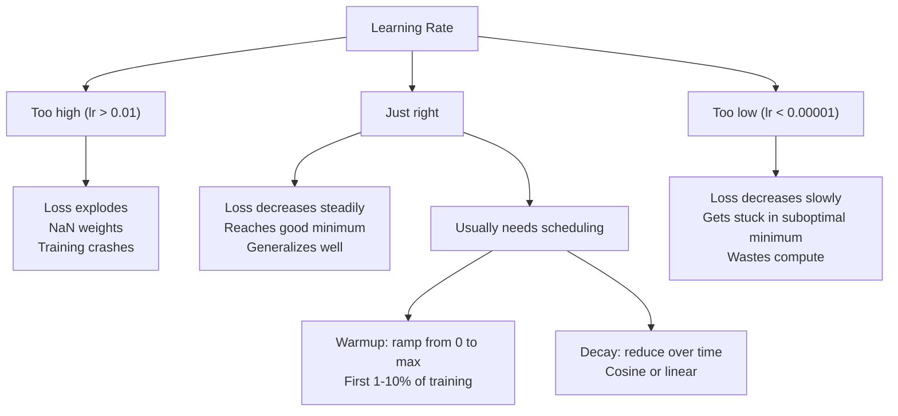
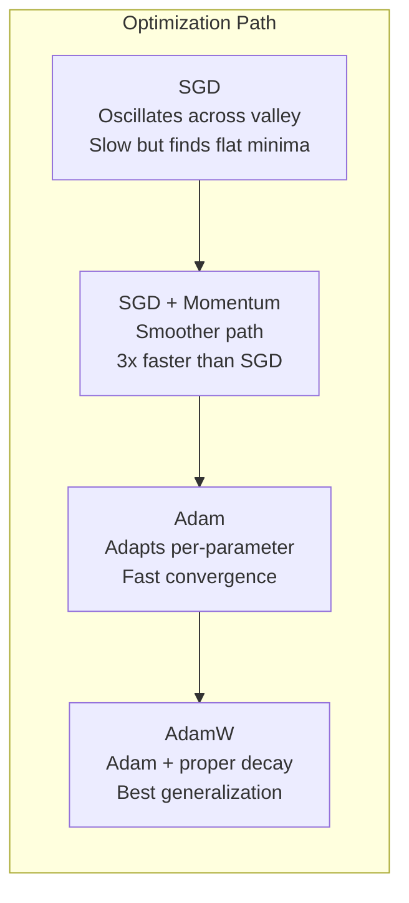
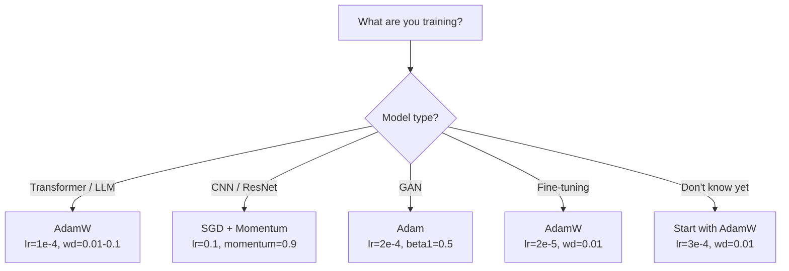

# Optimizers | 优化器

> Gradient descent tells you which direction to move. It says nothing about how far or how fast. SGD is a compass. Adam is GPS with traffic data.

> **【中文解读】** 梯度下降告诉你方向，但不说步幅和速度。SGD 像指南针——只知道方向。Adam 像带实时路况的 GPS——根据历史信息调整策略。本章从零实现 SGD → Momentum → Adam → AdamW，理解每一步优化的直觉。

**Type:** Build
**Languages:** Python
**Prerequisites:** Lesson 03.05 (Loss Functions)
**Time:** ~75 minutes

## Learning Objectives | 学习目标

- Implement SGD, SGD with momentum, Adam, and AdamW optimizers from scratch in Python
- Explain how Adam's bias correction compensates for zero-initialized moment estimates in early training steps
- Demonstrate why AdamW produces better generalization than Adam with L2 regularization on the same task
- Select the appropriate optimizer and default hyperparameters for transformers, CNNs, GANs, and fine-tuning

## The Problem | 问题引入

You computed the gradients. You know that weight #4,721 should decrease by 0.003 to reduce the loss. But 0.003 in what units? Scaled by what? And should you move the same amount on step 1 as on step 1,000?

> 你计算了梯度。你知道权重 #4,721 应该减少 0.003 来降低损失。但 0.003 是什么单位？按什么比例缩放？在步骤 1 和步骤 1,000 上应该移动相同的量吗？

Vanilla gradient descent applies the same learning rate to every parameter on every step: w = w - lr * gradient. This creates three problems that make training neural networks painful in practice.

> 原始梯度下降在每个步骤对每个参数应用相同的学习率：w = w - lr * gradient。这造成了三个使训练神经网络在实践中很痛苦的问题。

First, oscillation. The loss landscape is rarely shaped like a smooth bowl. It's more like a long, narrow valley. The gradient points across the valley (steep direction), not along it (shallow direction). Gradient descent bounces back and forth across the narrow dimension while making tiny progress along the useful one. You've seen this: loss drops fast then plateaus, not because the model converged but because it's oscillating.

> 首先，振荡。损失曲面很少像平滑的碗。它更像一个长而窄的山谷。梯度指向山谷的横向（陡峭方向），而不是纵向（浅方向）。梯度下降在窄维度上来回弹跳，而在有用的方向上进展微小。

Second, one learning rate for all parameters is wrong. Some weights need large updates (they're in the early, underfitting stage). Others need tiny updates (they're near their optimal value). A learning rate that works for the former destroys the latter, and vice versa.

> 其次，所有参数共用一个学习率是错误的。有些权重需要大的更新（它们处于早期欠拟合阶段）。另一些需要微小的更新（它们接近最优值）。对前者有效的学习率会破坏后者，反之亦然。

Third, saddle points. In high dimensions, the loss landscape has vast flat regions where the gradient is near zero. Vanilla SGD crawls through these at the speed of the gradient, which is effectively zero. The model looks stuck. It isn't stuck -- it's in a flat region with useful descent on the other side. But SGD has no mechanism to push through.

> 第三，鞍点。在高维中，损失曲面有大片平坦区域，梯度接近于零。原始 SGD 以梯度（实际上为零）的速度爬行通过这些区域。模型看起来卡住了。它并没有卡住——它在一个平坦区域中，另一侧有有用的下降。但 SGD 没有机制来突破。

Adam solves all three. It maintains two running averages per parameter -- the mean gradient (momentum, handles oscillation) and the mean squared gradient (adaptive rate, handles different scales). Combined with bias correction for the first few steps, it gives you a single optimizer that works on 80% of problems with default hyperparameters. This lesson builds it from scratch so you understand exactly when and why it fails on the other 20%.

> Adam 解决了所有三个问题。它为每个参数维护两个运行平均值——均值梯度（动量，处理振荡）和均方梯度（自适应速率，处理不同规模）。结合前几步的偏差修正，它提供了一个单一的优化器，在默认超参数下适用于 80% 的问题。本课从零构建它，让你准确理解它在另外 20% 的问题上何时以及为何失败。

> **【中文解读】** 原始 SGD 有三个问题：振荡（在窄谷中来回跳动）、单一学习率（不适合所有参数）、无法穿越平坦区域（梯度接近零就卡住）。Adam 同时解决这三个问题：动量抑制振荡、自适应学习率适合不同参数、偏差修正加速初期收敛。

## The Concept | 核心概念

### Stochastic Gradient Descent (SGD) | 随机梯度下降

The simplest optimizer. Compute the gradient on a mini-batch and step in the opposite direction.

> 最简单的优化器。在小批量上计算梯度，然后向相反方向走一步。

```
w = w - lr * gradient    # 最简单的参数更新公式
```

The "stochastic" means you use a random subset (mini-batch) of data to estimate the gradient, rather than the full dataset. This noise is actually useful -- it helps escape sharp local minima. But the noise also causes oscillation.

> "随机"意味着你使用数据的随机子集（小批量）来估计梯度，而不是整个数据集。这种噪声实际上是有用的——它有助于逃离尖锐的局部最小值。但噪声也会导致振荡。

Learning rate is the only knob. Too high: the loss diverges. Too low: training takes forever. The optimal value depends on the architecture, the data, the batch size, and the current stage of training. For vanilla SGD on modern networks, typical values range from 0.01 to 0.1. But even within a single training run, the ideal learning rate changes.

> 学习率是唯一的旋钮。太高：损失发散。太低：训练永远完不成。最优值取决于架构、数据、批量大小和训练的当前阶段。对于现代网络上的原始 SGD，典型值范围为 0.01 到 0.1。但即使在单次训练运行中，理想的学习率也在变化。

### Momentum | 动量

The ball-rolling-downhill analogy is overused but accurate. Instead of stepping by the gradient alone, you maintain a velocity that accumulates past gradients.

> 球滚下山坡的比喻被过度使用但很准确。与仅按梯度步进不同，你维护一个累积过去梯度的速度。

```
m_t = beta * m_{t-1} + gradient    # 速度 = 衰减 × 历史速度 + 当前梯度
w = w - lr * m_t                    # 沿速度方向更新
```

Beta (typically 0.9) controls how much history to keep. With beta = 0.9, the momentum is roughly the average of the last 10 gradients (1 / (1 - 0.9) = 10).

> Beta（通常为 0.9）控制保留多少历史。当 beta = 0.9 时，动量大约是最近 10 个梯度的平均值（1 / (1 - 0.9) = 10）。

Why this fixes oscillation: gradients that point in the same direction accumulate. Gradients that flip direction cancel out. In that narrow valley, the "across" component flips sign each step and gets dampened. The "along" component stays consistent and gets amplified. The result is smooth acceleration in the useful direction.

> 为什么这能修复振荡：指向相同方向的梯度累积。翻转方向的梯度相互抵消。在那个窄谷中，"横向"分量每步翻转符号并被抑制。"纵向"分量保持一致并被放大。结果是在有用方向上的平滑加速。

Real numbers: SGD alone on a badly conditioned loss landscape might take 10,000 steps. SGD with momentum (beta=0.9) typically takes 3,000-5,000 steps on the same problem. The speedup is not marginal.

> 具体数字：在条件差的损失曲面上，单独 SGD 可能需要 10,000 步。带动量（beta=0.9）的 SGD 在相同问题上通常需要 3,000-5,000 步。加速效果不是微不足道的。

> **【拓展：SGD + Momentum 的 resurgence】** 虽然 Adam 是默认选择，但 2023 年的论文显示 SGD+Momentum 在特定任务上仍有优势。ResNet 系列（ImageNet 分类冠军）和许多 Kaggle 竞赛赢家仍然用 SGD+Momentum (lr=0.1, momentum=0.9)。原因是 SGD 找到的极小值更"平"，泛化性更好。

### RMSProp | 均方根传播

The first per-parameter adaptive learning rate method that actually worked. Proposed by Hinton in a Coursera lecture (never formally published).

```
s_t = beta * s_{t-1} + (1 - beta) * gradient^2
w = w - lr * gradient / (sqrt(s_t) + epsilon)
```

s_t tracks the running average of squared gradients. Parameters with consistently large gradients get divided by a large number (smaller effective learning rate). Parameters with small gradients get divided by a small number (larger effective learning rate).

This solves the "one learning rate for all parameters" problem. A weight that's already been getting large updates is probably near its target -- slow it down. A weight that's been getting tiny updates might be undertrained -- speed it up.

Epsilon (typically 1e-8) prevents division by zero when a parameter hasn't been updated.

### Adam: Momentum + RMSProp | Adam：动量 + 自适应学习率

Adam combines both ideas. It maintains two exponential moving averages per parameter:

> Adam 结合了两种思想。它为每个参数维护两个指数移动平均值：

```
m_t = beta1 * m_{t-1} + (1 - beta1) * gradient        (first moment: mean)        # 一阶矩：梯度均值
v_t = beta2 * v_{t-1} + (1 - beta2) * gradient^2       (second moment: variance)   # 二阶矩：梯度方差
```

**Bias correction** is the key detail most explanations skip. At step 1, m_1 = (1 - beta1) * gradient. With beta1 = 0.9, that's 0.1 * gradient -- ten times too small. The moving average hasn't warmed up yet. Bias correction compensates:

```
m_hat = m_t / (1 - beta1^t)
v_hat = v_t / (1 - beta2^t)
```

At step 1 with beta1 = 0.9: m_hat = m_1 / (1 - 0.9) = m_1 / 0.1 = the actual gradient. At step 100: (1 - 0.9^100) is approximately 1.0, so the correction vanishes. Bias correction matters for the first ~10 steps and is irrelevant after ~50.

The update:

```
w = w - lr * m_hat / (sqrt(v_hat) + epsilon)
```

Adam defaults: lr = 0.001, beta1 = 0.9, beta2 = 0.999, epsilon = 1e-8. These defaults work for 80% of problems. When they don't, change lr first. Then beta2. Almost never change beta1 or epsilon.

> **【拓展：Adam 的局限性】** 尽管 Adam 是最常用的优化器，它并不完美：(1) 在某些 convex 问题上收敛不如 SGD；(2) Adam 的泛化性有时比 SGD 差（因为自适应学习率可能导致过拟合）；(3) Adam 的内存开销是 SGD 的 2-3 倍（需要存储 m 和 v）。2024 年的 AdamW + ScheduleFree 是新的改进方向。

### AdamW: Weight Decay Done Right | AdamW：正确的权重衰减

L2 regularization adds lambda * w^2 to the loss. In vanilla SGD, this is equivalent to weight decay (subtracting lambda * w from the weight at each step). In Adam, this equivalence breaks.

> L2 正则化将 lambda * w^2 加到损失中。在原始 SGD 中，这等价于权重衰减（每步从权重中减去 lambda * w）。在 Adam 中，这个等价性被打破了。

The Loshchilov & Hutter insight: when you add L2 to the loss and then Adam processes the gradient, the adaptive learning rate scales the regularization term too. Parameters with large gradient variance get less regularization. Parameters with small variance get more. This is not what you want -- you want uniform regularization regardless of the gradient statistics.

> Loshchilov 和 Hutter 的洞察：当你将 L2 加到损失中然后 Adam 处理梯度时，自适应学习率也会缩放正则化项。梯度方差大的参数获得较少的正则化。梯度方差小的获得更多。这不是你想要的——你想要无论梯度统计如何都统一正则化。

AdamW fixes this by applying weight decay directly to the weights, after the Adam update:

```
w = w - lr * m_hat / (sqrt(v_hat) + epsilon) - lr * lambda * w    # Adam 更新 + 解耦权重衰减
```

The weight decay term (lr * lambda * w) is not scaled by Adam's adaptive factor. Every parameter gets the same proportional shrinkage.

This seems like a minor detail. It's not. AdamW converges to better solutions than Adam + L2 regularization on virtually every task. It's the default optimizer in PyTorch for training transformers, diffusion models, and most modern architectures. BERT, GPT, LLaMA, Stable Diffusion -- all trained with AdamW.

> **【中文解读】** AdamW 的关键改进：权重衰减不经过 Adam 的自适应缩放，直接作用于参数。BERT、GPT、Llama、Stable Diffusion 都用 AdamW 训练。默认参数：lr=3e-4, weight_decay=0.01。

> **【拓展：LoRA 微调中的 AdamW】** 用 LoRA 微调 LLM 时，通常用 AdamW（lr=2e-5~1e-4, weight_decay=0.01）。LoRA 只训练低秩分解矩阵 A 和 B，AdamW 的权重衰减帮助控制这些新增参数的幅度。

### Learning Rate: The Most Important Hyperparameter | 学习率：最重要的超参数



If you tune one hyperparameter, tune the learning rate. A 10x change in learning rate matters more than any architectural decision you'll make. Common defaults:

- SGD: lr = 0.01 to 0.1
- Adam/AdamW: lr = 1e-4 to 3e-4
- Fine-tuning pretrained models: lr = 1e-5 to 5e-5
- Learning rate warmup: linear ramp over first 1-10% of steps

### Optimizer Comparison | 优化器对比



### When Each Optimizer Wins | 优化器选择指南



> **【拓展：深度学习中优化器的演进】** 从 2012 年 AlexNet 的 SGD+Momentum，到 2014 年 Adam 的提出，再到 2017 年 AdamW 的诞生——优化器的发展让训练从"需要数周调参"变成"默认参数就能跑"。Llama 3 405B 的训练使用 AdamW，峰值 lr=3e-4，在 16384 块 H100 GPU 上训练了 30.8M GPU 小时。

## Build It | 动手实现

> **【中文解读】** 下面从零实现四种优化器：SGD → SGD+Momentum → Adam → AdamW。每个都在前一个基础上增加一个关键机制。注意 Adam 的偏差修正和 AdamW 的解耦权重衰减——这是面试常考的知识点。

### Step 1: Vanilla SGD | 第一步：原始 SGD

```python
class SGD:
    def __init__(self, lr=0.01):
        self.lr = lr

    def step(self, params, grads):
        for i in range(len(params)):
            params[i] -= self.lr * grads[i]
```

### Step 2: SGD with Momentum | 第二步：带动量的 SGD

```python
class SGDMomentum:
    def __init__(self, lr=0.01, beta=0.9):
        self.lr = lr
        self.beta = beta
        self.velocities = None

    def step(self, params, grads):
        if self.velocities is None:
            self.velocities = [0.0] * len(params)
        for i in range(len(params)):
            self.velocities[i] = self.beta * self.velocities[i] + grads[i]
            params[i] -= self.lr * self.velocities[i]
```

### Step 3: Adam | 第三步：Adam 优化器

```python
import math

class Adam:
    def __init__(self, lr=0.001, beta1=0.9, beta2=0.999, epsilon=1e-8):
        self.lr = lr
        self.beta1 = beta1
        self.beta2 = beta2
        self.epsilon = epsilon
        self.m = None
        self.v = None
        self.t = 0

    def step(self, params, grads):
        if self.m is None:
            self.m = [0.0] * len(params)
            self.v = [0.0] * len(params)

        self.t += 1

        for i in range(len(params)):
            self.m[i] = self.beta1 * self.m[i] + (1 - self.beta1) * grads[i]
            self.v[i] = self.beta2 * self.v[i] + (1 - self.beta2) * grads[i] ** 2

            m_hat = self.m[i] / (1 - self.beta1 ** self.t)
            v_hat = self.v[i] / (1 - self.beta2 ** self.t)

            params[i] -= self.lr * m_hat / (math.sqrt(v_hat) + self.epsilon)
```

### Step 4: AdamW | 第四步：AdamW 优化器

```python
class AdamW:
    def __init__(self, lr=0.001, beta1=0.9, beta2=0.999, epsilon=1e-8, weight_decay=0.01):
        self.lr = lr
        self.beta1 = beta1
        self.beta2 = beta2
        self.epsilon = epsilon
        self.weight_decay = weight_decay
        self.m = None
        self.v = None
        self.t = 0

    def step(self, params, grads):
        if self.m is None:
            self.m = [0.0] * len(params)
            self.v = [0.0] * len(params)

        self.t += 1

        for i in range(len(params)):
            self.m[i] = self.beta1 * self.m[i] + (1 - self.beta1) * grads[i]
            self.v[i] = self.beta2 * self.v[i] + (1 - self.beta2) * grads[i] ** 2

            m_hat = self.m[i] / (1 - self.beta1 ** self.t)
            v_hat = self.v[i] / (1 - self.beta2 ** self.t)

            params[i] -= self.lr * m_hat / (math.sqrt(v_hat) + self.epsilon)
            params[i] -= self.lr * self.weight_decay * params[i]
```

### Step 5: Training Comparison | 第五步：训练对比

Train the same two-layer network on the circle dataset from lesson 05 with all four optimizers. Compare convergence.

```python
import random

def sigmoid(x):
    x = max(-500, min(500, x))
    return 1.0 / (1.0 + math.exp(-x))

def make_circle_data(n=200, seed=42):
    random.seed(seed)
    data = []
    for _ in range(n):
        x = random.uniform(-2, 2)
        y = random.uniform(-2, 2)
        label = 1.0 if x * x + y * y < 1.5 else 0.0
        data.append(([x, y], label))
    return data


class OptimizerTestNetwork:
    def __init__(self, optimizer, hidden_size=8):
        random.seed(0)
        self.hidden_size = hidden_size
        self.optimizer = optimizer

        self.w1 = [[random.gauss(0, 0.5) for _ in range(2)] for _ in range(hidden_size)]
        self.b1 = [0.0] * hidden_size
        self.w2 = [random.gauss(0, 0.5) for _ in range(hidden_size)]
        self.b2 = 0.0

    def get_params(self):
        params = []
        for row in self.w1:
            params.extend(row)
        params.extend(self.b1)
        params.extend(self.w2)
        params.append(self.b2)
        return params

    def set_params(self, params):
        idx = 0
        for i in range(self.hidden_size):
            for j in range(2):
                self.w1[i][j] = params[idx]
                idx += 1
        for i in range(self.hidden_size):
            self.b1[i] = params[idx]
            idx += 1
        for i in range(self.hidden_size):
            self.w2[i] = params[idx]
            idx += 1
        self.b2 = params[idx]

    def forward(self, x):
        self.x = x
        self.z1 = []
        self.h = []
        for i in range(self.hidden_size):
            z = self.w1[i][0] * x[0] + self.w1[i][1] * x[1] + self.b1[i]
            self.z1.append(z)
            self.h.append(max(0.0, z))

        self.z2 = sum(self.w2[i] * self.h[i] for i in range(self.hidden_size)) + self.b2
        self.out = sigmoid(self.z2)
        return self.out

    def compute_grads(self, target):
        eps = 1e-15
        p = max(eps, min(1 - eps, self.out))
        d_loss = -(target / p) + (1 - target) / (1 - p)
        d_sigmoid = self.out * (1 - self.out)
        d_out = d_loss * d_sigmoid

        grads = [0.0] * (self.hidden_size * 2 + self.hidden_size + self.hidden_size + 1)
        idx = 0
        for i in range(self.hidden_size):
            d_relu = 1.0 if self.z1[i] > 0 else 0.0
            d_h = d_out * self.w2[i] * d_relu
            grads[idx] = d_h * self.x[0]
            grads[idx + 1] = d_h * self.x[1]
            idx += 2

        for i in range(self.hidden_size):
            d_relu = 1.0 if self.z1[i] > 0 else 0.0
            grads[idx] = d_out * self.w2[i] * d_relu
            idx += 1

        for i in range(self.hidden_size):
            grads[idx] = d_out * self.h[i]
            idx += 1

        grads[idx] = d_out
        return grads

    def train(self, data, epochs=300):
        losses = []
        for epoch in range(epochs):
            total_loss = 0.0
            correct = 0
            for x, y in data:
                pred = self.forward(x)
                grads = self.compute_grads(y)
                params = self.get_params()
                self.optimizer.step(params, grads)
                self.set_params(params)

                eps = 1e-15
                p = max(eps, min(1 - eps, pred))
                total_loss += -(y * math.log(p) + (1 - y) * math.log(1 - p))
                if (pred >= 0.5) == (y >= 0.5):
                    correct += 1
            avg_loss = total_loss / len(data)
            accuracy = correct / len(data) * 100
            losses.append((avg_loss, accuracy))
            if epoch % 75 == 0 or epoch == epochs - 1:
                print(f"    Epoch {epoch:3d}: loss={avg_loss:.4f}, accuracy={accuracy:.1f}%")
        return losses
```

> **【拓展：GPT 训练中的优化器选择】** OpenAI 的 GPT 系列全部使用 Adam 优化器（GPT-4 推测也用 AdamW）。训练时一个常见技巧：对 embedding 层和 output 层使用不同的学习率。在 PyTorch 中通过 parameter groups 实现：`optimizer = AdamW([{'params': base_params}, {'params': head_params, 'lr': lr*0.1}])`。

## Use It | 用框架实现

> **【中文解读】** PyTorch 中的训练循环模式：zero_grad → forward → loss → backward → clip → step → schedule。这个顺序不能搞错。CNN 用 SGD+Momentum（lr=0.1），Transformer 用 AdamW（lr=1e-4）。

PyTorch optimizers handle parameter groups, gradient clipping, and learning rate scheduling:

```python
import torch
import torch.optim as optim

model = torch.nn.Sequential(
    torch.nn.Linear(784, 256),
    torch.nn.ReLU(),
    torch.nn.Linear(256, 10),
)

optimizer = optim.AdamW(model.parameters(), lr=3e-4, weight_decay=0.01)

scheduler = optim.lr_scheduler.CosineAnnealingLR(optimizer, T_max=100)

for epoch in range(100):
    optimizer.zero_grad()
    output = model(torch.randn(32, 784))
    loss = torch.nn.functional.cross_entropy(output, torch.randint(0, 10, (32,)))
    loss.backward()
    torch.nn.utils.clip_grad_norm_(model.parameters(), max_norm=1.0)
    optimizer.step()
    scheduler.step()
```

The pattern is always: zero_grad, forward, loss, backward, (clip), step, (schedule). Memorize this order. Getting it wrong (e.g., calling scheduler.step() before optimizer.step()) is a common source of subtle bugs.

For CNNs, many practitioners still prefer SGD + momentum (lr=0.1, momentum=0.9, weight_decay=1e-4) with a step or cosine schedule. SGD finds flatter minima, which often generalize better. For transformers and LLMs, AdamW with warmup + cosine decay is the universal default. Don't fight the consensus without a measured reason.

## Ship It | 产出物

This lesson produces:
- `outputs/prompt-optimizer-selector.md` -- a decision prompt for choosing the right optimizer and learning rate for any architecture

## Exercises | 练习题

1. Implement Nesterov momentum, where you compute the gradient at the "lookahead" position (w - lr * beta * v) instead of the current position. Compare convergence to standard momentum on the circle dataset.
   > **练习 1：** 实现 Nesterov 动量（在"前瞻"位置计算梯度），对比标准动量的收敛速度。

2. Implement a learning rate warmup schedule: linear ramp from 0 to max_lr over the first 10% of training steps, then cosine decay to 0. Train with Adam + warmup vs Adam without warmup. Measure how many epochs it takes to reach 90% accuracy on the circle dataset.
   > **练习 2：** 实现 warmup + cosine decay 学习率调度，对比有/无 warmup 达到 90% 准确率的轮数。

3. Track the effective learning rate for each parameter during Adam training. The effective rate is lr * m_hat / (sqrt(v_hat) + eps). Plot the distribution of effective rates after 10, 50, and 200 steps. Are all parameters being updated at the same speed?
   > **练习 3：** 追踪 Adam 训练中各参数的有效学习率，观察不同参数的更新速度差异。

4. Implement gradient clipping (clip by global norm). Set the max gradient norm to 1.0. Train with and without clipping using a high learning rate (lr=0.01 for Adam). Count how many runs diverge (loss goes to NaN) with and without clipping over 10 random seeds.
   > **练习 4：** 实现梯度裁剪，统计有/无裁剪时高学习率下训练发散的比例。

5. Compare Adam vs AdamW on a network with large weights. Initialize all weights to random values in [-5, 5] (much larger than normal). Train for 200 epochs with weight_decay=0.1. Plot the L2 norm of weights over training for both optimizers. AdamW should show faster weight shrinkage.
   > **练习 5：** 在大初始权重下对比 Adam 和 AdamW，观察权重衰减效果差异。

## Key Terms | 关键术语

| Term | What people say | What it actually means |
|------|----------------|----------------------|
| Learning rate | "Step size" | The scalar multiplier on the gradient update; the single most impactful hyperparameter in training |
| SGD | "Basic gradient descent" | Stochastic gradient descent: update weights by subtracting lr * gradient, computed on a mini-batch |
| Momentum | "Rolling ball analogy" | Exponential moving average of past gradients; dampens oscillation and accelerates consistent directions |
| RMSProp | "Adaptive learning rate" | Divides each parameter's gradient by the running RMS of its recent gradients; equalizes learning rates |
| Adam | "The default optimizer" | Combines momentum (first moment) and RMSProp (second moment) with bias correction for the initial steps |
| AdamW | "Adam done right" | Adam with decoupled weight decay; applies regularization directly to weights rather than through the gradient |
| Bias correction | "Warmup for running averages" | Dividing by (1 - beta^t) to compensate for the zero-initialization of Adam's moment estimates |
| Weight decay | "Shrink the weights" | Subtracting a fraction of the weight value at each step; a regularizer that penalizes large weights |
| Learning rate schedule | "Changing lr over time" | A function that adjusts the learning rate during training; warmup + cosine decay is the modern default |
| Gradient clipping | "Capping the gradient norm" | Scaling down the gradient vector when its norm exceeds a threshold; prevents exploding gradient updates |

| 术语 | 通俗说法 | 实际含义 |
|------|---------|---------|
| 学习率 (Learning rate) | "步长" | 梯度更新的标量乘数；训练中影响最大的超参数 |
| SGD | "基础梯度下降" | 随机梯度下降：用小批量梯度更新 w -= lr * grad |
| 动量 (Momentum) | "滚球的类比" | 历史梯度的指数移动平均；抑制振荡、加速一致方向 |
| RMSProp | "自适应学习率" | 除以梯度平方的移动平均根；均衡各参数学习速度 |
| Adam | "默认优化器" | 动量 + RMSProp + 偏差修正的统一优化器 |
| AdamW | "正确的 Adam" | Adam + 解耦权重衰减；直接对参数施加正则化 |
| 偏差修正 (Bias correction) | "运行平均的热身" | 除以 (1-beta^t) 补偿 Adam 矩估计的零初始化偏差 |
| 权重衰减 (Weight decay) | "缩小权重" | 每步减去权重的一小部分；惩罚大权重的正则化手段 |
| 学习率调度 (LR schedule) | "随时间改变 lr" | 训练中调整学习率的函数；warmup + cosine decay 是现代标配 |
| 梯度裁剪 (Gradient clipping) | "限制梯度范数" | 梯度范数超限时缩小梯度；防止梯度爆炸 |

## Further Reading | 延伸阅读

- Kingma & Ba, "Adam: A Method for Stochastic Optimization" (2014) -- the original Adam paper with convergence analysis and the bias correction derivation
- Loshchilov & Hutter, "Decoupled Weight Decay Regularization" (2017) -- proved that L2 regularization and weight decay are not equivalent in Adam, and proposed AdamW
- Smith, "Cyclical Learning Rates for Training Neural Networks" (2017) -- introduced the LR range test and cyclical schedules that remove the need to tune a fixed learning rate
- Ruder, "An Overview of Gradient Descent Optimization Algorithms" (2016) -- the best single survey of all optimizer variants, with clear comparisons and intuitions
