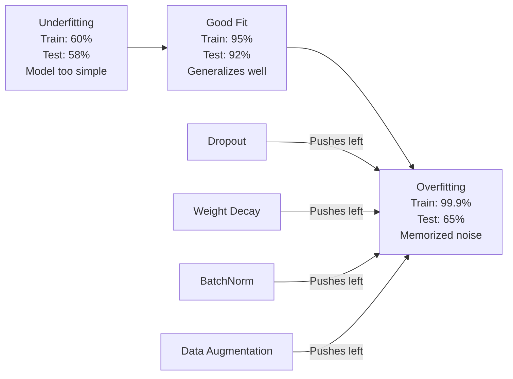
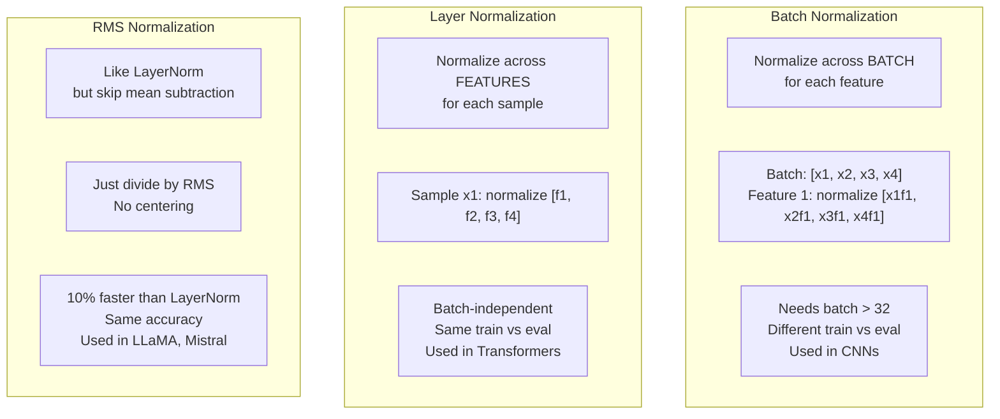
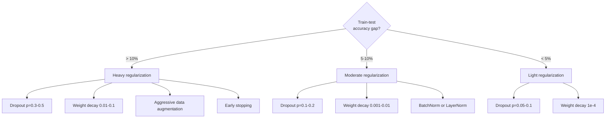

# Regularization | 正则化

> Your model gets 99% on training data and 60% on test data. It memorized instead of learning. Regularization is the tax you impose on complexity to force generalization.

> **【中文解读】** 模型训练集 99% 但测试集只有 60%——它是在"背诵"而不是"学习"。正则化是对复杂度征收的税，强迫模型泛化。本章覆盖 Dropout、L2 正则化、BatchNorm、LayerNorm、RMSNorm——这些是 Transformer 和现代深度学习的标配。

**Type:** Build
**Languages:** Python
**Prerequisites:** Lesson 03.06 (Optimizers)
**Time:** ~75 minutes

## Learning Objectives

- Implement dropout with inverted scaling, L2 weight decay, batch normalization, layer normalization, and RMSNorm from scratch
- Measure the train-test accuracy gap and diagnose overfitting using regularization experiments
- Explain why transformers use LayerNorm instead of BatchNorm and why modern LLMs prefer RMSNorm
- Apply the correct combination of regularization techniques based on the severity of overfitting

> **【中文解读】** 本章学习目标：从零实现五种正则化技术（Dropout、L2 权重衰减、BatchNorm、LayerNorm、RMSNorm），理解为什么 Transformer 用 LayerNorm 不用 BatchNorm，为什么 LLaMA/Mistral 等现代 LLM 用 RMSNorm 替代 LayerNorm。这些是现代深度学习的标配组件。

## The Problem

A neural network with enough parameters can memorize any dataset. This is not a hypothetical -- Zhang et al. (2017) proved it by training standard networks on ImageNet with random labels. The networks reached near-zero training loss on completely random label assignments. They memorized a million random input-output pairs with no pattern to learn. Training loss was perfect. Test accuracy was zero.

This is the overfitting problem, and it gets worse as models get larger. GPT-3 has 175 billion parameters. The training set has about 500 billion tokens. With that many parameters, the model has enough capacity to memorize significant chunks of the training data verbatim. Without regularization, it would just regurgitate training examples instead of learning generalizable patterns.

The gap between training performance and test performance is the overfitting gap. Every technique in this lesson attacks that gap from a different angle. Dropout forces the network to not rely on any single neuron. Weight decay prevents any single weight from growing too large. Batch normalization smooths the loss landscape so the optimizer finds flatter, more generalizable minima. Layer normalization does the same thing but works where batch normalization fails (small batches, variable-length sequences). RMSNorm does it 10% faster by dropping the mean calculation. Each technique is simple. Together, they're the difference between a model that memorizes and one that generalizes.

> **【中文解读】** 过拟合问题有多严重：Zhang et al. (2017) 证明了标准网络能在 ImageNet 上完美记忆随机标签——零训练损失，但测试准确率为零。GPT-3 有 1750 亿参数，训练集约 5000 亿 token，容量大到可以逐字记忆训练数据。每种正则化技术从不同角度攻击过拟合：Dropout 强制冗余表征、权重衰减限制参数大小、归一化平滑损失景观。

## The Concept

### The Overfitting Spectrum

Every model sits somewhere on a spectrum from underfitting (too simple to capture the pattern) to overfitting (so complex it captures noise). The sweet spot is in between, and regularization pushes models toward it from the overfit side.



### Dropout

The simplest regularization technique with the most elegant interpretation. During training, randomly set each neuron's output to zero with probability p.

```
output = activation(z) * mask    where mask[i] ~ Bernoulli(1 - p)
```

With p = 0.5, half the neurons are zeroed on every forward pass. The network must learn redundant representations because it can't predict which neurons will be available. This prevents co-adaptation -- neurons learning to rely on specific other neurons being present.

The ensemble interpretation: a network with N neurons and dropout creates 2^N possible subnetworks (every combination of which neurons are on or off). Training with dropout approximately trains all 2^N subnetworks simultaneously, each on different mini-batches. At test time, you use all neurons (no dropout) and scale outputs by (1 - p) to match the expected value during training. This is equivalent to averaging the predictions of 2^N subnetworks -- a massive ensemble from a single model.

In practice, the scaling is applied during training instead of testing (inverted dropout):

```
During training:  output = activation(z) * mask / (1 - p)
During testing:   output = activation(z)   (no change needed)
```

This is cleaner because test code doesn't need to know about dropout at all.

Default rates: p = 0.1 for transformers, p = 0.5 for MLPs, p = 0.2-0.3 for CNNs. Higher dropout = stronger regularization = more underfitting risk.

> **【中文解读】** Dropout：训练时随机将每个神经元的输出置零（概率 p）。网络被迫学习冗余表征，因为无法预测哪些神经元可用。集成解释：N 个神经元的 Dropout 网络等价于训练 2^N 个子网络的集成。实践中的关键细节——inverted dropout：在训练时做缩放（除以 1-p），这样测试代码不需要任何修改。Transformer 默认 p=0.1，MLP 默认 p=0.5。

> **【拓展：Dropout 在 Transformer 中的位置】** 在 GPT/LLaMA 等 Transformer 中，Dropout 主要用在两个地方：(1) self-attention 的权重矩阵上，(2) 每个子层的输出上（残差连接之前）。训练完成后 Dropout 完全关闭。推理时没有任何随机性。

### Weight Decay (L2 Regularization)

Add the squared magnitude of all weights to the loss:

```
total_loss = task_loss + (lambda / 2) * sum(w_i^2)
```

The gradient of the regularization term is lambda * w. This means at every step, each weight is shrunk toward zero by a fraction proportional to its magnitude. Large weights get penalized more. The model is pushed toward solutions where no single weight dominates.

Why this helps generalization: overfit models tend to have large weights that amplify noise in the training data. Weight decay keeps weights small, which limits the model's effective capacity and forces it to rely on robust, generalizable features rather than memorized quirks.

The lambda hyperparameter controls the strength. Typical values:

- 0.01 for AdamW on transformers
- 1e-4 for SGD on CNNs
- 0.1 for heavily overfit models

As discussed in lesson 06: weight decay and L2 regularization are equivalent in SGD but not in Adam. Always use AdamW (decoupled weight decay) when training with Adam.

> **【中文解读】** 权重衰减（L2 正则化）：将所有权重的平方和加入损失函数。梯度效果：每一步都将权重向零方向缩小一个比例。过拟合模型的权重通常很大（放大了训练数据中的噪声），权重衰减限制权重大小，迫使模型依赖鲁棒的特征。注意：在 Adam 中必须用 AdamW（解耦权重衰减），不能用标准 L2。

### Batch Normalization

Normalize the output of each layer across the mini-batch before passing it to the next layer.

For a mini-batch of activations at some layer:

```
mu = (1/B) * sum(x_i)           (batch mean)
sigma^2 = (1/B) * sum((x_i - mu)^2)   (batch variance)
x_hat = (x_i - mu) / sqrt(sigma^2 + eps)   (normalize)
y = gamma * x_hat + beta        (scale and shift)
```

Gamma and beta are learnable parameters that let the network undo the normalization if that's optimal. Without them, you'd be forcing every layer's output to be zero-mean unit-variance, which might not be what the network wants.

**Training vs inference split:** During training, mu and sigma come from the current mini-batch. During inference, you use running averages accumulated during training (exponential moving average with momentum = 0.1, meaning 90% old + 10% new).

Why BatchNorm works is still debated. The original paper claimed it reduces "internal covariate shift" (the distribution of layer inputs changing as earlier layers update). Santurkar et al. (2018) showed this explanation is wrong. The actual reason: BatchNorm makes the loss landscape smoother. The gradients are more predictive, the Lipschitz constants are smaller, and the optimizer can take larger steps safely. This is why BatchNorm lets you use higher learning rates and converge faster.

BatchNorm has a fundamental limitation: it depends on batch statistics. With batch size 1, the mean and variance are meaningless. With small batches (< 32), the statistics are noisy and hurt performance. This matters for tasks like object detection (where memory limits batch size) and language modeling (where sequence lengths vary).

> **【中文解读】** BatchNorm（批量归一化）：在 mini-batch 上归一化每层输出。训练时用当前 batch 的均值和方差，推理时用累积的运行平均值。原始论文声称它减少了"内部协变量偏移"，但 Santurkar et al. (2018) 证明这个解释是错的——真正原因是 BatchNorm 让损失景观更平滑，使得优化器可以用更大的学习率。但 BatchNorm 有根本局限：依赖 batch 统计量，batch_size=1 时无意义，小 batch 时噪声大。

> **【拓展：BatchNorm 的消失】** 在 NLP/LLM 领域，BatchNorm 几乎完全被 LayerNorm/RMSNorm 取代。原因是：语言模型推理时 batch_size 通常为 1（逐 token 生成），序列长度可变，BatchNorm 完全不适用。在 CV 领域，BatchNorm 仍然广泛使用（ResNet、EfficientNet 等经典架构）。

### Layer Normalization

Normalize across features instead of across the batch. For a single sample:

```
mu = (1/D) * sum(x_j)           (feature mean)
sigma^2 = (1/D) * sum((x_j - mu)^2)   (feature variance)
x_hat = (x_j - mu) / sqrt(sigma^2 + eps)
y = gamma * x_hat + beta
```

D is the feature dimension. Each sample is normalized independently -- no dependence on batch size. This is why transformers use LayerNorm instead of BatchNorm. Sequences have variable lengths, batch sizes are often small (or 1 during generation), and the computation is identical between training and inference.

LayerNorm in transformers is applied after each self-attention block and each feed-forward block (Post-LN), or before them (Pre-LN, which is more stable for training).

> **【中文解读】** LayerNorm（层归一化）：在特征维度上归一化，每个样本独立处理，不依赖 batch 大小。这就是 Transformer 用 LayerNorm 而不用 BatchNorm 的原因——序列长度可变、batch 可能很小（生成时为 1）、训练和推理的计算完全一致。在 Transformer 中，LayerNorm 放在每个子层之后（Post-LN）或之前（Pre-LN，更稳定）。

### RMSNorm

LayerNorm without the mean subtraction. Proposed by Zhang & Sennrich (2019).

```
rms = sqrt((1/D) * sum(x_j^2))
y = gamma * x / rms
```

That's it. No mean computation, no beta parameter. The observation: the re-centering (mean subtraction) in LayerNorm contributes very little to the model's performance, but costs computation. Removing it gives the same accuracy with about 10% less overhead.

LLaMA, LLaMA 2, LLaMA 3, Mistral, and most modern LLMs use RMSNorm instead of LayerNorm. At the scale of billions of parameters and trillions of tokens, that 10% savings is significant.

> **【中文解读】** RMSNorm：LayerNorm 去掉均值减法。观察发现均值减法对模型性能贡献很小，但增加了计算量。去掉后准确率相同，速度提升约 10%。LLaMA 1/2/3、Mistral 等现代 LLM 全部使用 RMSNorm。在数十亿参数、数万亿 token 的规模下，10% 的节省非常可观。

> **【拓展：从 BatchNorm 到 RMSNorm 的演进】** 归一化技术的演进路径：BatchNorm（2015，CNN 时代）→ LayerNorm（2016，Transformer 时代）→ RMSNorm（2019，LLaMA 时代）。每次演进都是"去掉不必要的东西"：BatchNorm 需要 batch 统计量，LayerNorm 去掉了这个依赖，RMSNorm 又去掉了均值减法。更简单的方案胜出。

### Normalization Comparison



### Data Augmentation as Regularization

Not a model modification but a data modification. Transform training inputs while preserving labels:

- Images: random crop, flip, rotation, color jitter, cutout
- Text: synonym replacement, back-translation, random deletion
- Audio: time stretch, pitch shift, noise addition

The effect is identical to regularization: it increases the effective size of the training set, making it harder for the model to memorize specific examples. A model that only sees each image once in its original form can memorize it. A model that sees 50 augmented versions of each image is forced to learn the invariant structure.

### Early Stopping

The simplest regularizer: stop training when validation loss starts increasing. The model hasn't overfit yet at that point. In practice, you track validation loss every epoch, save the best model, and continue training for a "patience" window (typically 5-20 epochs). If validation loss doesn't improve within the patience window, you stop and load the best saved model.

### When to Apply What



> **【中文解读】** 正则化使用指南：根据训练-测试准确率差距选择策略。差距 > 10% 用强正则化（Dropout 0.3-0.5 + 权重衰减 0.01-0.1 + 激进数据增强 + 早停）；差距 5-10% 用中等正则化（Dropout 0.1-0.2 + 权重衰减 0.001-0.01 + 归一化层）；差距 < 5% 用轻正则化（Dropout 0.05-0.1 + 权重衰减 1e-4）。

## Build It

### Step 1: Dropout (Train and Eval Mode)

```python
import random
import math


class Dropout:
    def __init__(self, p=0.5):
        self.p = p
        self.training = True
        self.mask = None

    def forward(self, x):
        if not self.training:
            return list(x)
        self.mask = []
        output = []
        for val in x:
            if random.random() < self.p:
                self.mask.append(0)
                output.append(0.0)
            else:
                self.mask.append(1)
                output.append(val / (1 - self.p))
        return output

    def backward(self, grad_output):
        grads = []
        for g, m in zip(grad_output, self.mask):
            if m == 0:
                grads.append(0.0)
            else:
                grads.append(g / (1 - self.p))
        return grads
```

### Step 2: L2 Weight Decay

```python
def l2_regularization(weights, lambda_reg):
    penalty = 0.0
    for w in weights:
        penalty += w * w
    return lambda_reg * 0.5 * penalty

def l2_gradient(weights, lambda_reg):
    return [lambda_reg * w for w in weights]
```

### Step 3: Batch Normalization

```python
class BatchNorm:
    def __init__(self, num_features, momentum=0.1, eps=1e-5):
        self.gamma = [1.0] * num_features
        self.beta = [0.0] * num_features
        self.eps = eps
        self.momentum = momentum
        self.running_mean = [0.0] * num_features
        self.running_var = [1.0] * num_features
        self.training = True
        self.num_features = num_features

    def forward(self, batch):
        batch_size = len(batch)
        if self.training:
            mean = [0.0] * self.num_features
            for sample in batch:
                for j in range(self.num_features):
                    mean[j] += sample[j]
            mean = [m / batch_size for m in mean]

            var = [0.0] * self.num_features
            for sample in batch:
                for j in range(self.num_features):
                    var[j] += (sample[j] - mean[j]) ** 2
            var = [v / batch_size for v in var]

            for j in range(self.num_features):
                self.running_mean[j] = (1 - self.momentum) * self.running_mean[j] + self.momentum * mean[j]
                self.running_var[j] = (1 - self.momentum) * self.running_var[j] + self.momentum * var[j]
        else:
            mean = list(self.running_mean)
            var = list(self.running_var)

        self.x_hat = []
        output = []
        for sample in batch:
            normalized = []
            out_sample = []
            for j in range(self.num_features):
                x_h = (sample[j] - mean[j]) / math.sqrt(var[j] + self.eps)
                normalized.append(x_h)
                out_sample.append(self.gamma[j] * x_h + self.beta[j])
            self.x_hat.append(normalized)
            output.append(out_sample)
        return output
```

### Step 4: Layer Normalization

```python
class LayerNorm:
    def __init__(self, num_features, eps=1e-5):
        self.gamma = [1.0] * num_features
        self.beta = [0.0] * num_features
        self.eps = eps
        self.num_features = num_features

    def forward(self, x):
        mean = sum(x) / len(x)
        var = sum((xi - mean) ** 2 for xi in x) / len(x)

        self.x_hat = []
        output = []
        for j in range(self.num_features):
            x_h = (x[j] - mean) / math.sqrt(var + self.eps)
            self.x_hat.append(x_h)
            output.append(self.gamma[j] * x_h + self.beta[j])
        return output
```

### Step 5: RMSNorm

```python
class RMSNorm:
    def __init__(self, num_features, eps=1e-6):
        self.gamma = [1.0] * num_features
        self.eps = eps
        self.num_features = num_features

    def forward(self, x):
        rms = math.sqrt(sum(xi * xi for xi in x) / len(x) + self.eps)
        output = []
        for j in range(self.num_features):
            output.append(self.gamma[j] * x[j] / rms)
        return output
```

### Step 6: Training With and Without Regularization

```python
def sigmoid(x):
    x = max(-500, min(500, x))
    return 1.0 / (1.0 + math.exp(-x))


def make_circle_data(n=200, seed=42):
    random.seed(seed)
    data = []
    for _ in range(n):
        x = random.uniform(-2, 2)
        y = random.uniform(-2, 2)
        label = 1.0 if x * x + y * y < 1.5 else 0.0
        data.append(([x, y], label))
    return data


class RegularizedNetwork:
    def __init__(self, hidden_size=16, lr=0.05, dropout_p=0.0, weight_decay=0.0):
        random.seed(0)
        self.hidden_size = hidden_size
        self.lr = lr
        self.dropout_p = dropout_p
        self.weight_decay = weight_decay
        self.dropout = Dropout(p=dropout_p) if dropout_p > 0 else None

        self.w1 = [[random.gauss(0, 0.5) for _ in range(2)] for _ in range(hidden_size)]
        self.b1 = [0.0] * hidden_size
        self.w2 = [random.gauss(0, 0.5) for _ in range(hidden_size)]
        self.b2 = 0.0

    def forward(self, x, training=True):
        self.x = x
        self.z1 = []
        self.h = []
        for i in range(self.hidden_size):
            z = self.w1[i][0] * x[0] + self.w1[i][1] * x[1] + self.b1[i]
            self.z1.append(z)
            self.h.append(max(0.0, z))

        if self.dropout and training:
            self.dropout.training = True
            self.h = self.dropout.forward(self.h)
        elif self.dropout:
            self.dropout.training = False
            self.h = self.dropout.forward(self.h)

        self.z2 = sum(self.w2[i] * self.h[i] for i in range(self.hidden_size)) + self.b2
        self.out = sigmoid(self.z2)
        return self.out

    def backward(self, target):
        eps = 1e-15
        p = max(eps, min(1 - eps, self.out))
        d_loss = -(target / p) + (1 - target) / (1 - p)
        d_sigmoid = self.out * (1 - self.out)
        d_out = d_loss * d_sigmoid

        for i in range(self.hidden_size):
            d_relu = 1.0 if self.z1[i] > 0 else 0.0
            d_h = d_out * self.w2[i] * d_relu
            self.w2[i] -= self.lr * (d_out * self.h[i] + self.weight_decay * self.w2[i])
            for j in range(2):
                self.w1[i][j] -= self.lr * (d_h * self.x[j] + self.weight_decay * self.w1[i][j])
            self.b1[i] -= self.lr * d_h
        self.b2 -= self.lr * d_out

    def evaluate(self, data):
        correct = 0
        total_loss = 0.0
        for x, y in data:
            pred = self.forward(x, training=False)
            eps = 1e-15
            p = max(eps, min(1 - eps, pred))
            total_loss += -(y * math.log(p) + (1 - y) * math.log(1 - p))
            if (pred >= 0.5) == (y >= 0.5):
                correct += 1
        return total_loss / len(data), correct / len(data) * 100

    def train_model(self, train_data, test_data, epochs=300):
        history = []
        for epoch in range(epochs):
            total_loss = 0.0
            correct = 0
            for x, y in train_data:
                pred = self.forward(x, training=True)
                self.backward(y)
                eps = 1e-15
                p = max(eps, min(1 - eps, pred))
                total_loss += -(y * math.log(p) + (1 - y) * math.log(1 - p))
                if (pred >= 0.5) == (y >= 0.5):
                    correct += 1
            train_loss = total_loss / len(train_data)
            train_acc = correct / len(train_data) * 100
            test_loss, test_acc = self.evaluate(test_data)
            history.append((train_loss, train_acc, test_loss, test_acc))
            if epoch % 75 == 0 or epoch == epochs - 1:
                gap = train_acc - test_acc
                print(f"    Epoch {epoch:3d}: train_acc={train_acc:.1f}%, test_acc={test_acc:.1f}%, gap={gap:.1f}%")
        return history
```

## Use It

PyTorch provides all normalization and regularization as modules:

```python
import torch
import torch.nn as nn

model = nn.Sequential(
    nn.Linear(784, 256),
    nn.BatchNorm1d(256),
    nn.ReLU(),
    nn.Dropout(0.3),
    nn.Linear(256, 128),
    nn.BatchNorm1d(128),
    nn.ReLU(),
    nn.Dropout(0.3),
    nn.Linear(128, 10),
)

model.train()
out_train = model(torch.randn(32, 784))

model.eval()
out_test = model(torch.randn(1, 784))
```

The `model.train()` / `model.eval()` toggle is critical. It switches dropout on/off and tells BatchNorm to use batch statistics vs running statistics. Forgetting `model.eval()` before inference is one of the most common bugs in deep learning. Your test accuracy will fluctuate randomly because dropout is still active and BatchNorm is using mini-batch statistics.

For transformers, the pattern is different:

```python
class TransformerBlock(nn.Module):
    def __init__(self, d_model=512, nhead=8, dropout=0.1):
        super().__init__()
        self.attention = nn.MultiheadAttention(d_model, nhead, dropout=dropout)
        self.norm1 = nn.LayerNorm(d_model)
        self.ff = nn.Sequential(
            nn.Linear(d_model, d_model * 4),
            nn.GELU(),
            nn.Linear(d_model * 4, d_model),
            nn.Dropout(dropout),
        )
        self.norm2 = nn.LayerNorm(d_model)
        self.dropout = nn.Dropout(dropout)

    def forward(self, x):
        attended, _ = self.attention(x, x, x)
        x = self.norm1(x + self.dropout(attended))
        x = self.norm2(x + self.ff(x))
        return x
```

LayerNorm, not BatchNorm. Dropout p=0.1, not p=0.5. These are the transformer defaults.

## Ship It

This lesson produces:
- `outputs/prompt-regularization-advisor.md` -- a prompt that diagnoses overfitting and recommends the right regularization strategy

## Exercises

1. Implement spatial dropout for 2D data: instead of dropping individual neurons, drop entire feature channels. Simulate this by treating groups of consecutive features as channels and dropping whole groups. Compare the train-test gap to standard dropout on the circle dataset with hidden_size=32.

2. Implement label smoothing from lesson 05 combined with dropout from this lesson. Train with four configurations: neither, dropout only, label smoothing only, both. Measure the final train-test accuracy gap for each. Which combination gives the smallest gap?

3. Add a BatchNorm layer between the hidden layer and the activation in your circle-dataset network. Train with and without BatchNorm at learning rates 0.01, 0.05, and 0.1. BatchNorm should allow stable training at higher learning rates where the vanilla network diverges.

4. Implement early stopping: track test loss each epoch, save the best weights, and stop if test loss hasn't improved for 20 epochs. Run the regularized network for 1000 epochs. Report which epoch had the best test accuracy and how many epochs of computation you saved.

5. Compare LayerNorm vs RMSNorm on a 4-layer network (not just 2). Initialize both with the same weights. Train for 200 epochs and compare final accuracy, training speed (time per epoch), and gradient magnitudes at the first layer. Verify that RMSNorm is faster with the same accuracy.

## Key Terms

| Term | What people say | What it actually means | 中文释义 |
|------|----------------|----------------------|---------|
| Overfitting | "Model memorized the data" | When a model's training performance significantly exceeds its test performance, indicating it learned noise rather than signal | 过拟合，模型记忆了噪声 |
| Regularization | "Preventing overfitting" | Any technique that constrains model complexity to improve generalization: dropout, weight decay, normalization, augmentation | 正则化，限制模型复杂度以提升泛化 |
| Dropout | "Random neuron deletion" | Zeroing random neurons during training with probability p, forcing redundant representations; equivalent to training an ensemble | 随机失活，训练时随机置零神经元 |
| Weight decay | "L2 penalty" | Shrinking all weights toward zero by subtracting lambda * w at each step; penalizes complexity through weight magnitude | 权重衰减，L2 正则化 |
| Batch normalization | "Normalize per batch" | Normalizing layer outputs across the batch dimension using batch statistics during training and running averages during inference | 批量归一化 |
| Layer normalization | "Normalize per sample" | Normalizing across features within each sample; batch-independent, used in transformers where batch size varies | 层归一化，Transformer 的标配 |
| RMSNorm | "LayerNorm without the mean" | Root mean square normalization; drops the mean subtraction from LayerNorm for 10% speedup with equal accuracy | 均方根归一化，LLaMA 等现代 LLM 使用 |
| Early stopping | "Stop before overfit" | Halting training when validation loss stops improving; the simplest regularizer, often used alongside others | 早停法 |
| Data augmentation | "More data from less" | Transforming training inputs (flip, crop, noise) to increase effective dataset size and force invariance learning | 数据增强 |
| Generalization gap | "Train-test split" | The difference between training and test performance; regularization aims to minimize this gap | 泛化差距 |

## Further Reading

- Srivastava et al., "Dropout: A Simple Way to Prevent Neural Networks from Overfitting" (2014) -- the original dropout paper with the ensemble interpretation and extensive experiments
- Ioffe & Szegedy, "Batch Normalization: Accelerating Deep Network Training by Reducing Internal Covariate Shift" (2015) -- introduced BatchNorm and its training procedure, one of the most cited deep learning papers
- Zhang & Sennrich, "Root Mean Square Layer Normalization" (2019) -- showed RMSNorm matches LayerNorm accuracy with reduced computation; adopted by LLaMA and Mistral
- Zhang et al., "Understanding Deep Learning Requires Rethinking Generalization" (2017) -- the landmark paper showing neural networks can memorize random labels, challenging traditional views of generalization
