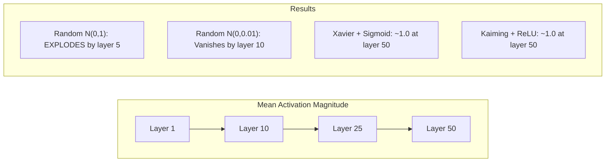
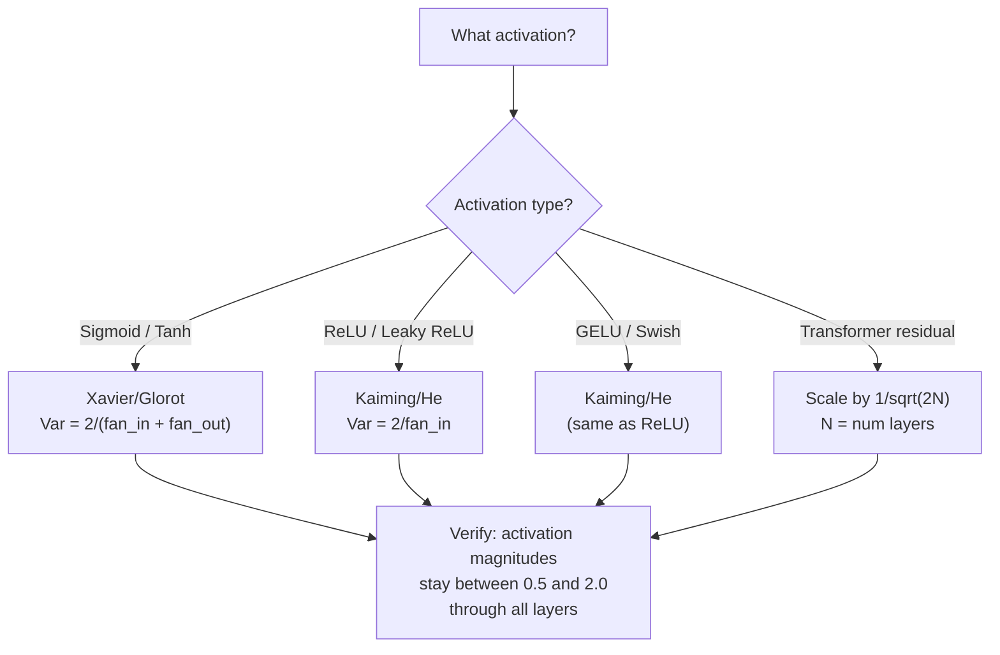

# Weight Initialization and Training Stability | 权重初始化与训练稳定性

> Initialize wrong and training never starts. Initialize right and 50 layers train as smoothly as 3.

> **【中文解读】** 初始化错了，训练永远不会开始——50 层网络的信号要么归零要么爆炸。初始化对了，50 层训练和 3 层一样平滑。Xavier 初始化（sigmoid/tanh）和 Kaiming 初始化（ReLU/GELU）是现代深度学习的基石。

**Type:** Build
**Languages:** Python
**Prerequisites:** Lesson 03.04 (Activation Functions), Lesson 03.07 (Regularization)
**Time:** ~90 minutes

## Learning Objectives | 学习目标

- Implement zero, random, Xavier/Glorot, and Kaiming/He initialization strategies and measure their effect on activation magnitudes through 50 layers
- Derive why Xavier init uses Var(w) = 2/(fan_in + fan_out) and Kaiming uses Var(w) = 2/fan_in
- Demonstrate the symmetry problem with zero initialization and explain why random scale alone is insufficient
- Match the correct initialization strategy to the activation function: Xavier for sigmoid/tanh, Kaiming for ReLU/GELU

> **【中文解读】** 本章核心问题：如何选择初始权重，让信号在 50 层网络中既不消失也不爆炸。答案是 Xavier 初始化（sigmoid/tanh 配套）和 Kaiming 初始化（ReLU/GELU 配套）。PyTorch 的 nn.Linear 默认使用 Kaiming 初始化——这就是为什么大多数网络"开箱即用"。

## The Problem | 问题引入

Initialize all weights to zero. Nothing learns. Every neuron computes the same function, receives the same gradient, and updates identically. After 10,000 epochs, your 512-neuron hidden layer is still 512 copies of the same neuron. You paid for 512 parameters and got 1.

Initialize them too large. Activations explode through the network. By layer 10, values hit 1e15. By layer 20, they overflow to infinity. Gradients follow the same trajectory in reverse.

Initialize them randomly from a standard normal distribution. Works for 3 layers. At 50 layers, the signal collapses to zero or detonates to infinity depending on whether the random scale was slightly too small or slightly too large. The boundary between "works" and "broken" is razor-thin.

Weight initialization is the most underrated decision in deep learning. Architecture gets papers. Optimizers get blog posts. Initialization gets a footnote. But get it wrong and nothing else matters -- your network is dead before training begins.

> **【中文解读】** 初始化是深度学习中最被低估的决策。零初始化导致对称性（所有神经元学一样的东西），随机初始化的方差不对会导致 50 层网络信号消失或爆炸。Xavier 和 Kaiming 初始化通过数学推导解决了这个问题。

> **【拓展：GPT-2 的残差缩放技巧】** GPT-2 引入了 1/sqrt(2N) 的残差缩放（N 是层数）。每个残差连接 x = x + sublayer(x) 都会增加方差，126 层的 Llama 3 会让方差增长 126 倍。缩放因子让方差保持稳定。这个技巧现在被所有 Transformer 采用。

## The Concept | 核心概念

### The Symmetry Problem | 对称性问题

Every neuron in a layer has the same structure: multiply inputs by weights, add bias, apply activation. If all weights start at the same value (zero is the extreme case), every neuron computes the same output. During backpropagation, every neuron receives the same gradient. During the update step, every neuron changes by the same amount.

You're stuck. The network has hundreds of parameters, but they all move in lockstep. This is called symmetry, and random initialization is the brute-force way to break it. Each neuron starts at a different point in weight space, so each learns a different feature.

But "random" is not enough. The *scale* of the randomness determines whether the network trains.

### Variance Propagation Through Layers | 方差逐层传播

Consider a single layer with fan_in inputs:

```
z = w1*x1 + w2*x2 + ... + w_n*x_n
```

If each weight wi is drawn from a distribution with variance Var(w) and each input xi has variance Var(x), the output variance is:

```
Var(z) = fan_in * Var(w) * Var(x)
```

If Var(w) = 1 and fan_in = 512, the output variance is 512x the input variance. After 10 layers: 512^10 = 1.2e27. Your signal has exploded.

If Var(w) = 0.001, the output variance shrinks by 0.001 * 512 = 0.512 per layer. After 10 layers: 0.512^10 = 0.00013. Your signal has vanished.

The goal: choose Var(w) so that Var(z) = Var(x). Signal magnitude stays constant across layers.

> **【中文解读】** 方差传播的数学：Var(z) = fan_in * Var(w) * Var(x)。如果 fan_in=512 且 Var(w)=1，输出方差是输入的 512 倍。10 层后：512^10 = 1.2e27，信号爆炸。Xavier 和 Kaiming 的目标都是让 Var(z) = Var(x)，使信号幅度逐层保持恒定。

### Xavier/Glorot Initialization | Xavier/Glorot 初始化

Glorot and Bengio (2010) derived the solution for sigmoid and tanh activations. To keep variance constant in both the forward and backward pass:

```
Var(w) = 2 / (fan_in + fan_out)
```

In practice, weights are drawn from:

```
w ~ Uniform(-limit, limit)  where limit = sqrt(6 / (fan_in + fan_out))
```

or:

```
w ~ Normal(0, sqrt(2 / (fan_in + fan_out)))
```

This works because sigmoid and tanh are roughly linear near zero, where properly initialized activations live. The variance stays stable through dozens of layers.

### Kaiming/He Initialization | Kaiming/He 初始化

ReLU kills half the outputs (everything negative becomes zero). The effective fan_in is halved because on average half the inputs are zeroed. Xavier init doesn't account for this -- it underestimates the variance needed.

He et al. (2015) adjusted the formula:

```
Var(w) = 2 / fan_in
```

Weights are drawn from:

```
w ~ Normal(0, sqrt(2 / fan_in))
```

The factor of 2 compensates for ReLU zeroing half the activations. Without it, the signal shrinks by ~0.5x per layer. With 50 layers: 0.5^50 = 8.8e-16. Kaiming init prevents this.

> **【拓展：PyTorch 的默认初始化】** PyTorch 的 nn.Linear 默认使用 Kaiming Uniform 初始化（`nn.init.kaiming_uniform_`，mode='fan_in'），配合 LeakyReLU 的 negative_slope=sqrt(5)。这意味着当你写 `nn.Linear(784, 256)` 时，PyTorch 已经帮你选好了初始化。但自定义架构（Transformer、混合专家模型）需要手动调整。

### Transformer Initialization | Transformer 初始化

GPT-2 introduced a different pattern. Residual connections add the output of each sub-layer to its input:

```
x = x + sublayer(x)
```

Each addition increases variance. With N residual layers, variance grows proportionally to N. GPT-2 scales the weights of residual layers by 1/sqrt(2N), where N is the number of layers. This keeps the accumulated signal magnitude stable.

Llama 3 (405B parameters, 126 layers) uses a similar scheme. Without this scaling, the residual stream would grow unbounded through 126 layers of attention and feedforward blocks.

> **【拓展：混合专家模型（MoE）的初始化挑战】** Mixtral 8x7B 和 GPT-4 等模型使用 MoE 架构，每个 token 只激活部分专家。初始化时需要确保：路由器的初始权重不能让所有 token 都选择同一个专家。常见做法是用小的初始化方差 + 噪声偏置，确保初始路由均匀。初始化不当会导致"路由崩塌"——一个专家承担所有负载。

```mermaid
flowchart TD
    subgraph "Zero Init"
        Z1["Layer 1<br/>All weights = 0"] --> Z2["Layer 2<br/>All neurons identical"]
        Z2 --> Z3["Layer 3<br/>Still identical"]
        Z3 --> ZR["Result: 1 effective neuron<br/>regardless of width"]
    end

    subgraph "Xavier Init"
        X1["Layer 1<br/>Var = 2/(fan_in+fan_out)"] --> X2["Layer 2<br/>Signal stable"]
        X2 --> X3["Layer 50<br/>Signal stable"]
        X3 --> XR["Result: Trains with<br/>sigmoid/tanh"]
    end

    subgraph "Kaiming Init"
        K1["Layer 1<br/>Var = 2/fan_in"] --> K2["Layer 2<br/>Signal stable"]
        K2 --> K3["Layer 50<br/>Signal stable"]
        K3 --> KR["Result: Trains with<br/>ReLU/GELU"]
    end
```



### Activation Magnitude Through 50 Layers | 50 层激活幅度实验



### Choosing the Right Init | 选择正确的初始化



## Build It | 动手实现

> **【中文解读】** 实验设计：让信号通过 50 层网络，测量每层的激活幅度。零初始化 → 所有神经元相同；随机 N(0,1) → 爆炸；随机 N(0,0.01) → 消失；Xavier+tanh / Kaiming+ReLU → 稳定。这个实验直观展示了初始化的重要性。

### Step 1: Initialization Strategies | 第一步：初始化策略

Four ways to initialize a weight matrix. Each returns a list of lists (a 2D matrix) with fan_in columns and fan_out rows.

```python
import math
import random


def zero_init(fan_in, fan_out):
    return [[0.0 for _ in range(fan_in)] for _ in range(fan_out)]


def random_init(fan_in, fan_out, scale=1.0):
    return [[random.gauss(0, scale) for _ in range(fan_in)] for _ in range(fan_out)]


def xavier_init(fan_in, fan_out):
    std = math.sqrt(2.0 / (fan_in + fan_out))
    return [[random.gauss(0, std) for _ in range(fan_in)] for _ in range(fan_out)]


def kaiming_init(fan_in, fan_out):
    std = math.sqrt(2.0 / fan_in)
    return [[random.gauss(0, std) for _ in range(fan_in)] for _ in range(fan_out)]
```

### Step 2: Activation Functions | 第二步：激活函数

We need sigmoid, tanh, and ReLU to test each init strategy with its intended activation.

```python
def sigmoid(x):
    x = max(-500, min(500, x))
    return 1.0 / (1.0 + math.exp(-x))


def tanh_act(x):
    return math.tanh(x)


def relu(x):
    return max(0.0, x)
```

### Step 3: Forward Pass Through 50 Layers | 第三步：50 层前向传播

Pass random data through a deep network and measure mean activation magnitude at each layer.

```python
def forward_deep(init_fn, activation_fn, n_layers=50, width=64, n_samples=100):
    random.seed(42)
    layer_magnitudes = []

    inputs = [[random.gauss(0, 1) for _ in range(width)] for _ in range(n_samples)]

    for layer_idx in range(n_layers):
        weights = init_fn(width, width)
        biases = [0.0] * width

        new_inputs = []
        for sample in inputs:
            output = []
            for neuron_idx in range(width):
                z = sum(weights[neuron_idx][j] * sample[j] for j in range(width)) + biases[neuron_idx]
                output.append(activation_fn(z))
            new_inputs.append(output)
        inputs = new_inputs

        magnitudes = []
        for sample in inputs:
            magnitudes.append(sum(abs(v) for v in sample) / width)
        mean_mag = sum(magnitudes) / len(magnitudes)
        layer_magnitudes.append(mean_mag)

    return layer_magnitudes
```

### Step 4: The Experiment | 第四步：实验

Run all combinations: zero init, random N(0,1), random N(0,0.01), Xavier with sigmoid, Xavier with tanh, Kaiming with ReLU. Print the magnitude at key layers.

```python
def run_experiment():
    configs = [
        ("Zero init + Sigmoid", lambda fi, fo: zero_init(fi, fo), sigmoid),
        ("Random N(0,1) + ReLU", lambda fi, fo: random_init(fi, fo, 1.0), relu),
        ("Random N(0,0.01) + ReLU", lambda fi, fo: random_init(fi, fo, 0.01), relu),
        ("Xavier + Sigmoid", xavier_init, sigmoid),
        ("Xavier + Tanh", xavier_init, tanh_act),
        ("Kaiming + ReLU", kaiming_init, relu),
    ]

    print(f"{'Strategy':<30} {'L1':>10} {'L5':>10} {'L10':>10} {'L25':>10} {'L50':>10}")
    print("-" * 80)

    for name, init_fn, act_fn in configs:
        mags = forward_deep(init_fn, act_fn)
        row = f"{name:<30}"
        for idx in [0, 4, 9, 24, 49]:
            val = mags[idx]
            if val > 1e6:
                row += f" {'EXPLODED':>10}"
            elif val < 1e-6:
                row += f" {'VANISHED':>10}"
            else:
                row += f" {val:>10.4f}"
        print(row)
```

### Step 5: Symmetry Demonstration | 第五步：对称性演示

Show that zero init produces identical neurons.

```python
def symmetry_demo():
    random.seed(42)
    weights = zero_init(2, 4)
    biases = [0.0] * 4

    inputs = [0.5, -0.3]
    outputs = []
    for neuron_idx in range(4):
        z = sum(weights[neuron_idx][j] * inputs[j] for j in range(2)) + biases[neuron_idx]
        outputs.append(sigmoid(z))

    print("\nSymmetry Demo (4 neurons, zero init):")
    for i, out in enumerate(outputs):
        print(f"  Neuron {i}: output = {out:.6f}")
    all_same = all(abs(outputs[i] - outputs[0]) < 1e-10 for i in range(len(outputs)))
    print(f"  All identical: {all_same}")
    print(f"  Effective parameters: 1 (not {len(weights) * len(weights[0])})")
```

### Step 6: Layer-by-Layer Magnitude Report | 第六步：逐层幅度报告

Print a visual bar chart of activation magnitudes through 50 layers.

```python
def magnitude_report(name, magnitudes):
    print(f"\n{name}:")
    for i, mag in enumerate(magnitudes):
        if i % 5 == 0 or i == len(magnitudes) - 1:
            if mag > 1e6:
                bar = "X" * 50 + " EXPLODED"
            elif mag < 1e-6:
                bar = "." + " VANISHED"
            else:
                bar_len = min(50, max(1, int(mag * 10)))
                bar = "#" * bar_len
            print(f"  Layer {i+1:3d}: {bar} ({mag:.6f})")
```

## Use It | 用框架实现

> **【中文解读】** PyTorch 内置 `nn.init.xavier_uniform_`、`nn.init.kaiming_normal_` 等函数。nn.Linear 默认用 Kaiming Uniform，所以简单网络"开箱即用"。但自定义架构需要手动调用这些函数。

PyTorch provides these as built-in functions:

```python
import torch
import torch.nn as nn

layer = nn.Linear(512, 256)

nn.init.xavier_uniform_(layer.weight)
nn.init.xavier_normal_(layer.weight)

nn.init.kaiming_uniform_(layer.weight, nonlinearity='relu')
nn.init.kaiming_normal_(layer.weight, nonlinearity='relu')

nn.init.zeros_(layer.bias)
```

When you call `nn.Linear(512, 256)`, PyTorch defaults to Kaiming uniform initialization. That's why most simple networks "just work" -- PyTorch already made the right choice. But when you build custom architectures or go deeper than 20 layers, you need to understand what's happening and potentially override the default.

For transformers, HuggingFace models typically handle initialization in their `_init_weights` method. GPT-2's implementation scales residual projections by 1/sqrt(N). If you're building a transformer from scratch, you need to add this yourself.

## Ship It | 产出物

This lesson produces:
- `outputs/prompt-init-strategy.md` -- a prompt that diagnoses weight initialization problems and recommends the right strategy

## Exercises | 练习题

1. Add LeCun initialization (Var = 1/fan_in, designed for SELU activation). Run the 50-layer experiment with LeCun init + tanh and compare to Xavier + tanh.

2. Implement the GPT-2 residual scaling: multiply the output of each layer by 1/sqrt(2*N) before adding to the residual stream. Run 50 layers with and without scaling, measure how fast the residual magnitude grows.

3. Create an "init health check" function that takes a network's layer dimensions and activation type, then recommends the correct initialization and warns if the current init will cause problems.

4. Run the experiment with fan_in = 16 vs fan_in = 1024. Xavier and Kaiming adapt to fan_in, but random init doesn't. Show how the gap between "works" and "breaks" widens with larger layers.

5. Implement orthogonal initialization (generate a random matrix, compute its SVD, use the orthogonal matrix U). Compare to Kaiming for ReLU networks at 50 layers.

## Key Terms | 术语速查表

| Term | What people say | What it actually means |
|------|----------------|----------------------|
| Weight initialization | "Set starting weights randomly" | The strategy for choosing initial weight values that determines whether a network can train at all |
| Symmetry breaking | "Make neurons different" | Using random initialization to ensure neurons learn distinct features instead of computing identical functions |
| Fan-in | "Number of inputs to a neuron" | The number of incoming connections, which determines how input variance accumulates in the weighted sum |
| Fan-out | "Number of outputs from a neuron" | The number of outgoing connections, relevant for maintaining gradient variance during backpropagation |
| Xavier/Glorot init | "The sigmoid initialization" | Var(w) = 2/(fan_in + fan_out), designed to preserve variance through sigmoid and tanh activations |
| Kaiming/He init | "The ReLU initialization" | Var(w) = 2/fan_in, accounts for ReLU zeroing half the activations |
| Variance propagation | "How signals grow or shrink through layers" | The mathematical analysis of how activation variance changes layer by layer based on weight scale |
| Residual scaling | "GPT-2's init trick" | Scaling residual connection weights by 1/sqrt(2N) to prevent variance growth through N transformer layers |
| Dead network | "Nothing trains" | A network where poor initialization causes all gradients to be zero or all activations to saturate |
| Exploding activations | "Values go to infinity" | When weight variance is too high, causing activation magnitudes to grow exponentially through layers |

## Further Reading | 延伸阅读

- Glorot & Bengio, "Understanding the difficulty of training deep feedforward neural networks" (2010) -- the original Xavier initialization paper with variance analysis
- He et al., "Delving Deep into Rectifiers" (2015) -- introduced Kaiming initialization for ReLU networks
- Radford et al., "Language Models are Unsupervised Multitask Learners" (2019) -- GPT-2 paper with residual scaling initialization
- Mishkin & Matas, "All You Need is a Good Init" (2016) -- layer-sequential unit-variance initialization, an empirical alternative to analytical formulas
