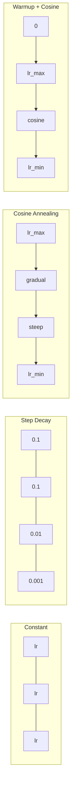
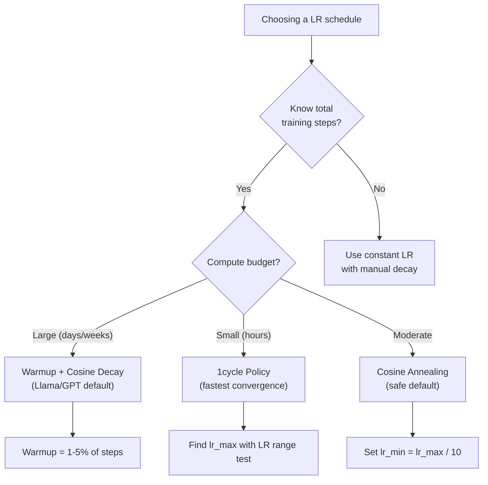
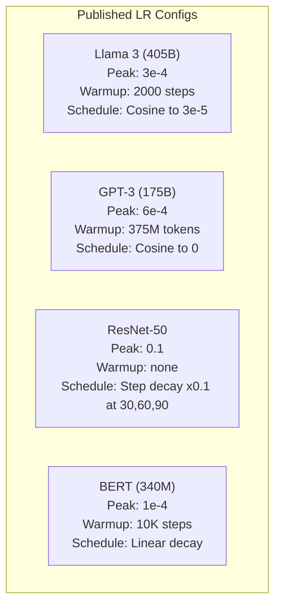

# Learning Rate Schedules and Warmup | 学习率调度与预热

> The learning rate is the single most important hyperparameter. Not the architecture. Not the dataset size. Not the activation function. The learning rate. If you tune nothing else, tune this.

> **【中文解读】** 学习率是最重要的超参数——不是架构，不是数据量，是学习率。Llama 3 用峰值 lr=3e-4 + 2000 步 warmup + cosine decay。GPT-3 用 lr=6e-4 + warmup。理解学习率调度是训练任何模型的关键。

**Type:** Build
**Languages:** Python
**Prerequisites:** Lesson 03.06 (Optimizers), Lesson 03.08 (Weight Initialization)
**Time:** ~90 minutes

## Learning Objectives | 学习目标

- Implement constant, step decay, cosine annealing, warmup + cosine, and 1cycle learning rate schedules from scratch
- Demonstrate the three failure modes of learning rate selection: divergence (too high), stalling (too low), and oscillation (no decay)
- Explain why warmup is necessary for Adam-based optimizers and how it stabilizes early training
- Compare convergence speed across all five schedules on the same task and select the appropriate one for a given training budget

> **【中文解读】** 本章实现五种学习率调度：恒定、阶梯衰减、余弦退火、warmup+余弦、1cycle 策略。现代大模型的标准配置是 warmup（前 1-5% 步数线性升温）+ cosine decay（余弦衰减到接近零）。理解 warmup 为什么必要是关键。

## The Problem | 问题引入

Set the learning rate to 0.1. Training diverges -- loss jumps to infinity in 3 steps. Set it to 0.0001. Training crawls -- after 100 epochs, the model has barely moved from random. Set it to 0.01. Training works for 50 epochs, then the loss oscillates around a minimum it can never reach because the steps are too large.

> 将学习率设为 0.1。训练发散——损失在 3 步内跳到无穷大。设为 0.0001。训练缓慢爬行——100 个 epoch 后，模型几乎没从随机状态移动。设为 0.01。训练前 50 个 epoch 有效，然后损失在一个永远无法达到的极小值附近振荡，因为步长太大。

The optimal learning rate is not a constant. It changes during training. Early on, you want large steps to cover ground quickly. Late in training, you want tiny steps to settle into a sharp minimum. The difference between a 90% accurate model and a 95% accurate model is often just the schedule.

> 最优学习率不是常数。它在训练过程中变化。早期，你想要大步长快速覆盖空间。训练后期，你想要微小步长稳定到一个尖锐的极小值。90% 准确率的模型和 95% 准确率的模型之间的差异往往只是调度方案。

Every major model published in the last three years uses a learning rate schedule. Llama 3 used peak lr=3e-4 with 2000 warmup steps and cosine decay to 3e-5. GPT-3 used lr=6e-4 with warmup over 375 million tokens. These are not arbitrary choices. They are the result of extensive hyperparameter sweeps that cost millions of dollars.

> 过去三年发表的每个主要模型都使用学习率调度。Llama 3 使用峰值 lr=3e-4，2000 步 warmup 和余弦衰减到 3e-5。GPT-3 使用 lr=6e-4，warmup 覆盖 3.75 亿 token。这些不是随意的选择。它们是花费数百万美元进行大量超参数搜索的结果。

You need to understand schedules because the defaults will not work for your problem. When you fine-tune a pretrained model, the right schedule is different than training from scratch. When you increase batch size, the warmup period needs to change. When training breaks at step 10,000, you need to know whether it's a schedule problem or something else.

> 你需要理解调度方案，因为默认值不适用于你的问题。当你微调预训练模型时，正确的调度与从头训练不同。当你增加批量大小时，warmup 期需要改变。当训练在第 10,000 步崩溃时，你需要知道是调度问题还是其他问题。

> **【中文解读】** 学习率太高 → 训练发散（loss 到无穷）；太低 → 训练极慢；合适但不衰减 → 振荡在最小值附近。每种主流模型都有精心调优的学习率调度方案，这些方案是通过百万美元级别的超参数搜索找到的。

> **【拓展：大模型的学习率配置】** Llama 3 405B：peak lr=3e-4, warmup=2000 步, cosine decay 到 3e-5, 训练 1.8T token。GPT-3 175B：peak lr=6e-4, warmup=375M token。BERT-base：peak lr=1e-4, warmup=10K 步, linear decay。规律：模型越大，学习率通常越小；预训练比微调的学习率高 10-100 倍。

## The Concept | 核心概念

### Constant Learning Rate | 恒定学习率

The simplest approach. Pick a number, use it for every step.

> 最简单的方法。选一个数字，每一步都用它。

```
lr(t) = lr_0
```

Rarely optimal. It's either too high for the end of training (oscillation around the minimum) or too low for the beginning (wasted compute on tiny steps). Works fine for small models and debugging. A terrible choice for anything that trains for more than an hour.

> 很少是最优的。要么对训练末期来说太高（在极小值附近振荡），要么对训练初期来说太低（微小步长浪费计算）。适用于小模型和调试。对于训练超过一小时的任务来说是糟糕的选择。

### Step Decay | 阶梯衰减

The old-school approach from the ResNet era. Cut the learning rate by a factor (usually 10x) at fixed epochs.

> ResNet 时代的老派方法。在固定的 epoch 将学习率降低一个因子（通常是 10 倍）。

```
lr(t) = lr_0 * gamma^(floor(epoch / step_size))
```

Where gamma = 0.1 and step_size = 30 means: lr drops by 10x every 30 epochs. ResNet-50 used this -- lr=0.1, drop by 10x at epochs 30, 60, and 90.

> gamma = 0.1 且 step_size = 30 意味着：每 30 个 epoch 学习率降低 10 倍。ResNet-50 使用了这个——lr=0.1，在 epoch 30、60 和 90 各降低 10 倍。

The problem: the optimal decay points depend on the dataset and architecture. Move to a different problem and you need to re-tune when to drop. The transitions are abrupt -- loss can spike when the rate suddenly changes.

> 问题：最优衰减点取决于数据集和架构。换一个问题就需要重新调整何时降低。过渡是突然的——学习率突然改变时损失可能飙升。

### Cosine Annealing | 余弦退火

Smooth decay from the maximum learning rate to a minimum, following a cosine curve:

> 从最大学习率到最小学习率的平滑衰减，遵循余弦曲线：

```
lr(t) = lr_min + 0.5 * (lr_max - lr_min) * (1 + cos(pi * t / T))
```

Where t is the current step and T is the total number of steps.

> 其中 t 是当前步数，T 是总步数。

At t=0, the cosine term is 1, so lr = lr_max. At t=T, the cosine term is -1, so lr = lr_min. The decay is gentle at first, accelerates in the middle, and becomes gentle again near the end.

> t=0 时，余弦项为 1，所以 lr = lr_max。t=T 时，余弦项为 -1，所以 lr = lr_min。衰减开始平缓，中间加速，末期又变平缓。

This is the default for most modern training runs. No hyperparameters to tune beyond lr_max and lr_min. The cosine shape matches the empirical observation that most learning happens in the middle of training -- you want reasonable step sizes during that critical period.

> 这是大多数现代训练运行的默认选择。除了 lr_max 和 lr_min 外无需调优超参数。余弦形状符合经验观察——大部分学习发生在训练中期——你希望在那个关键时期有合理的步长。

### Warmup: Why You Start Small | Warmup：为什么要从小学习率开始

Adam and other adaptive optimizers maintain running estimates of gradient mean and variance. At step 0, these estimates are initialized to zero. The first few gradient updates are based on garbage statistics. If your learning rate is large during this period, the model takes huge, poorly-directed steps.

> Adam 和其他自适应优化器维护梯度均值和方差的运行估计。在第 0 步，这些估计被初始化为零。前几次梯度更新基于垃圾统计。如果在这个期间学习率很大，模型会采取巨大的、方向错误的步骤。

Warmup fixes this. Start with a tiny learning rate (often lr_max / warmup_steps or even zero) and linearly ramp up to lr_max over the first N steps. By the time you reach the full learning rate, Adam's statistics have stabilized.

> Warmup 修复了这个问题。从一个很小的学习率开始（通常是 lr_max / warmup_steps 甚至零），然后在前 N 步线性升到 lr_max。当你达到完整学习率时，Adam 的统计量已经稳定了。

```
lr(t) = lr_max * (t / warmup_steps)     for t < warmup_steps
```

Typical warmup: 1-5% of total training steps. Llama 3 trained for ~1.8 trillion tokens and warmed up for 2000 steps. GPT-3 warmed up over 375 million tokens.

> **【拓展：Warmup 的数学解释】** Adam 的偏差修正 (m_hat = m_t / (1-beta1^t)) 在前几步补偿不足。以 beta1=0.9 为例，第 1 步的 m_1 = 0.1*gradient，除以 (1-0.9)=0.1 得到正确的梯度估计。但在前几步，方差估计 v_t 更不稳定。warmup 让 Adam 的统计量在低学习率下"热身"，避免初始阶段的大幅错误更新。

### Linear Warmup + Cosine Decay | 线性 Warmup + 余弦衰减

The modern default. Ramp up linearly, then decay with cosine:

```
if t < warmup_steps:
    lr(t) = lr_max * (t / warmup_steps)
else:
    progress = (t - warmup_steps) / (total_steps - warmup_steps)
    lr(t) = lr_min + 0.5 * (lr_max - lr_min) * (1 + cos(pi * progress))
```

This is what Llama, GPT, PaLM, and most modern transformers use. The warmup prevents early instability. The cosine decay settles the model into a good minimum.

> 这是 Llama、GPT、PaLM 和大多数现代 Transformer 使用的方法。warmup 防止早期不稳定。余弦衰减使模型稳定到一个好的极小值。

### 1cycle Policy | 1cycle 策略

Leslie Smith's discovery (2018): ramp the learning rate up from a low value to a high value in the first half of training, then ramp it back down in the second half. Counterintuitive -- why would you *increase* the learning rate midway through?

> Leslie Smith 的发现 (2018)：在训练前半段将学习率从低值升到高值，后半段再降回来。反直觉——为什么要在中途*增加*学习率？

The theory: a high learning rate acts as regularization by adding noise to the optimization trajectory. The model explores more of the loss landscape during the ramp-up phase, finding better basins. The ramp-down phase then refines within the best basin found.

> 理论：高学习率通过给优化轨迹添加噪声起到正则化作用。模型在升温阶段探索更多损失曲面，找到更好的盆地。降温阶段然后在找到的最佳盆地内精炼。

```
Phase 1 (0 to T/2):    lr ramps from lr_max/25 to lr_max
Phase 2 (T/2 to T):    lr ramps from lr_max to lr_max/10000
```

1cycle often trains faster than cosine annealing for a fixed compute budget. The tradeoff: you must know the total number of steps in advance.

> 1cycle 在固定计算预算下通常比余弦退火训练更快。权衡：你必须提前知道总步数。

> **【拓展：微调时的学习率策略】** 微调预训练模型（如 BERT、Llama）时，学习率通常比预训练小 10-100 倍。LoRA 微调 Llama：lr=2e-5~1e-4，warmup=总步数的 3%，cosine decay。关键技巧：对不同层使用不同学习率——底层（接近输入）用更小的 lr（因为通用特征已经学好），顶层（接近输出）用更大的 lr（因为需要适应新任务）。PyTorch 通过 parameter groups 实现。

### Schedule Shapes | 调度形状对比



### Decision Flowchart | 决策流程图



### Real Numbers from Published Models | 已发表模型的实际参数



## Build It | 动手实现

> **【中文解读】** 下面从零实现五种调度策略，然后用同一个 circle 数据集训练网络对比效果。实验会展示：高学习率导致发散、低学习率导致停滞、合适的调度让训练又快又稳。

### Step 1: Schedule Functions | 第一步：调度函数

Each function takes the current step and returns the learning rate at that step.

> 每个函数接收当前步数，返回该步的学习率。

```python
import math


def constant_schedule(step, lr=0.01, **kwargs):
    return lr


def step_decay_schedule(step, lr=0.1, step_size=100, gamma=0.1, **kwargs):
    return lr * (gamma ** (step // step_size))


def cosine_schedule(step, lr=0.01, total_steps=1000, lr_min=1e-5, **kwargs):
    if step >= total_steps:
        return lr_min
    return lr_min + 0.5 * (lr - lr_min) * (1 + math.cos(math.pi * step / total_steps))


def warmup_cosine_schedule(step, lr=0.01, total_steps=1000, warmup_steps=100, lr_min=1e-5, **kwargs):
    if total_steps <= warmup_steps:
        return lr * (step / max(warmup_steps, 1))
    if step < warmup_steps:
        return lr * step / warmup_steps
    progress = (step - warmup_steps) / (total_steps - warmup_steps)
    return lr_min + 0.5 * (lr - lr_min) * (1 + math.cos(math.pi * progress))


def one_cycle_schedule(step, lr=0.01, total_steps=1000, **kwargs):
    mid = max(total_steps // 2, 1)
    if step < mid:
        return (lr / 25) + (lr - lr / 25) * step / mid
    else:
        progress = (step - mid) / max(total_steps - mid, 1)
        return lr * (1 - progress) + (lr / 10000) * progress
```

### Step 2: Visualize All Schedules | 第二步：可视化所有调度

Print a text-based plot showing how each schedule evolves over training.

> 打印文本图表，展示每种调度在训练过程中的演变。

```python
def visualize_schedule(name, schedule_fn, total_steps=500, **kwargs):
    steps = list(range(0, total_steps, total_steps // 20))
    if total_steps - 1 not in steps:
        steps.append(total_steps - 1)

    lrs = [schedule_fn(s, total_steps=total_steps, **kwargs) for s in steps]
    max_lr = max(lrs) if max(lrs) > 0 else 1.0

    print(f"\n{name}:")
    for s, lr_val in zip(steps, lrs):
        bar_len = int(lr_val / max_lr * 40)
        bar = "#" * bar_len
        print(f"  Step {s:4d}: lr={lr_val:.6f} {bar}")
```

### Step 3: Training Network | 第三步：训练网络

A simple two-layer network on the circle dataset, same as previous lessons, but now we vary the schedule.

> 在圆形数据集上的简单两层网络，与前面课程相同，但现在我们变换调度方案。

```python
import random


def sigmoid(x):
    x = max(-500, min(500, x))
    return 1.0 / (1.0 + math.exp(-x))


def relu(x):
    return max(0.0, x)


def relu_deriv(x):
    return 1.0 if x > 0 else 0.0


def make_circle_data(n=200, seed=42):
    random.seed(seed)
    data = []
    for _ in range(n):
        x = random.uniform(-2, 2)
        y = random.uniform(-2, 2)
        label = 1.0 if x * x + y * y < 1.5 else 0.0
        data.append(([x, y], label))
    return data


def train_with_schedule(schedule_fn, schedule_name, data, epochs=300, base_lr=0.05, **kwargs):
    random.seed(0)
    hidden_size = 8
    total_steps = epochs * len(data)

    std = math.sqrt(2.0 / 2)
    w1 = [[random.gauss(0, std) for _ in range(2)] for _ in range(hidden_size)]
    b1 = [0.0] * hidden_size
    w2 = [random.gauss(0, std) for _ in range(hidden_size)]
    b2 = 0.0

    step = 0
    epoch_losses = []

    for epoch in range(epochs):
        total_loss = 0
        correct = 0

        for x, target in data:
            lr = schedule_fn(step, lr=base_lr, total_steps=total_steps, **kwargs)

            z1 = []
            h = []
            for i in range(hidden_size):
                z = w1[i][0] * x[0] + w1[i][1] * x[1] + b1[i]
                z1.append(z)
                h.append(relu(z))

            z2 = sum(w2[i] * h[i] for i in range(hidden_size)) + b2
            out = sigmoid(z2)

            error = out - target
            d_out = error * out * (1 - out)

            for i in range(hidden_size):
                d_h = d_out * w2[i] * relu_deriv(z1[i])
                w2[i] -= lr * d_out * h[i]
                for j in range(2):
                    w1[i][j] -= lr * d_h * x[j]
                b1[i] -= lr * d_h
            b2 -= lr * d_out

            total_loss += (out - target) ** 2
            if (out >= 0.5) == (target >= 0.5):
                correct += 1
            step += 1

        avg_loss = total_loss / len(data)
        accuracy = correct / len(data) * 100
        epoch_losses.append(avg_loss)

    return epoch_losses
```

### Step 4: Compare All Schedules | 第四步：对比所有调度

Train the same network with each schedule and compare final loss and convergence behavior.

> 用每种调度训练同一个网络，比较最终损失和收敛行为。

```python
def compare_schedules(data):
    configs = [
        ("Constant", constant_schedule, {}),
        ("Step Decay", step_decay_schedule, {"step_size": 15000, "gamma": 0.1}),
        ("Cosine", cosine_schedule, {"lr_min": 1e-5}),
        ("Warmup+Cosine", warmup_cosine_schedule, {"warmup_steps": 3000, "lr_min": 1e-5}),
        ("1cycle", one_cycle_schedule, {}),
    ]

    print(f"\n{'Schedule':<20} {'Start Loss':>12} {'Mid Loss':>12} {'End Loss':>12} {'Best Loss':>12}")
    print("-" * 70)

    for name, schedule_fn, extra_kwargs in configs:
        losses = train_with_schedule(schedule_fn, name, data, epochs=300, base_lr=0.05, **extra_kwargs)
        mid_idx = len(losses) // 2
        best = min(losses)
        print(f"{name:<20} {losses[0]:>12.6f} {losses[mid_idx]:>12.6f} {losses[-1]:>12.6f} {best:>12.6f}")
```

### Step 5: LR Too High vs Too Low | 第五步：学习率过高 vs 过低

Demonstrate the three failure modes: too high (divergence), too low (crawling), and just right.

> 展示三种失败模式：太高（发散）、太低（爬行）、刚好。

```python
def lr_sensitivity(data):
    learning_rates = [1.0, 0.1, 0.01, 0.001, 0.0001]

    print("\nLR Sensitivity (constant schedule, 100 epochs):")
    print(f"  {'LR':>10} {'Start Loss':>12} {'End Loss':>12} {'Status':>15}")
    print("  " + "-" * 52)

    for lr in learning_rates:
        losses = train_with_schedule(constant_schedule, f"lr={lr}", data, epochs=100, base_lr=lr)
        start = losses[0]
        end = losses[-1]

        if end > start or math.isnan(end) or end > 1.0:
            status = "DIVERGED"
        elif end > start * 0.9:
            status = "BARELY MOVED"
        elif end < 0.15:
            status = "CONVERGED"
        else:
            status = "LEARNING"

        end_str = f"{end:.6f}" if not math.isnan(end) else "NaN"
        print(f"  {lr:>10.4f} {start:>12.6f} {end_str:>12} {status:>15}")
```

## Use It | 用框架实现

> **【中文解读】** PyTorch 提供 15+ 种调度器。最常用的是 CosineAnnealingLR 和 HuggingFace 的 get_cosine_schedule_with_warmup。微调预训练模型时，使用 warmup = 总步数的 3-5% + cosine decay 是最安全的选择。

PyTorch provides schedulers in `torch.optim.lr_scheduler`:

```python
import torch
import torch.optim as optim
from torch.optim.lr_scheduler import CosineAnnealingLR, OneCycleLR, StepLR

model = nn.Sequential(nn.Linear(10, 64), nn.ReLU(), nn.Linear(64, 1))
optimizer = optim.Adam(model.parameters(), lr=3e-4)

scheduler = CosineAnnealingLR(optimizer, T_max=1000, eta_min=1e-5)

for step in range(1000):
    loss = train_step(model, optimizer)
    scheduler.step()
```

For warmup + cosine, use a lambda scheduler or the `get_cosine_schedule_with_warmup` from HuggingFace:

> 对于 warmup + 余弦，使用 lambda 调度器或 HuggingFace 的 `get_cosine_schedule_with_warmup`：

```python
from transformers import get_cosine_schedule_with_warmup

scheduler = get_cosine_schedule_with_warmup(
    optimizer,
    num_warmup_steps=2000,
    num_training_steps=100000,
)
```

The HuggingFace function is what most Llama and GPT fine-tuning scripts use. When in doubt, use warmup + cosine with warmup = 3-5% of total steps. It works for almost everything.

> HuggingFace 的函数是大多数 Llama 和 GPT 微调脚本使用的。不确定时，使用 warmup + 余弦，warmup 为总步数的 3-5%。它几乎适用于一切场景。

## Ship It | 产出物

This lesson produces:
- `outputs/prompt-lr-schedule-advisor.md` -- a prompt that recommends the right learning rate schedule and hyperparameters for your training setup

> 本课产出：`outputs/prompt-lr-schedule-advisor.md` - 一个推荐正确学习率调度和超参数的提示词

## Exercises | 练习题

1. Implement exponential decay: lr(t) = lr_0 * gamma^t where gamma = 0.999. Compare to cosine annealing on the circle dataset.

   1. 实现指数衰减：lr(t) = lr_0 * gamma^t，gamma = 0.999。在圆形数据集上和余弦退火对比。

2. Implement the learning rate range test (Leslie Smith): train for a few hundred steps while exponentially increasing the LR from 1e-7 to 1. Plot loss vs LR. The optimal max LR is just before the loss starts increasing.

   2. 实现学习率范围测试（Leslie Smith）：训练几百步，同时把 LR 从 1e-7 指数增加到 1。绘制 loss vs LR 曲线。最优 max LR 是 loss 开始上升前的值。

3. Train with warmup + cosine but vary the warmup length: 0%, 1%, 5%, 10%, 20% of total steps. Find the sweet spot where training is most stable.

   3. 用 warmup + 余弦训练，但变化 warmup 长度：总步数的 0%、1%、5%、10%、20%。找到训练最稳定的最佳点。

4. Implement cosine annealing with warm restarts (SGDR): reset the learning rate to lr_max every T steps and decay again. Compare to standard cosine on a longer training run.

   4. 实现带热重启的余弦退火（SGDR）：每 T 步把学习率重置为 lr_max 并再次衰减。在更长的训练上和标准余弦对比。

5. Build a "schedule surgeon" that monitors training loss and automatically switches from warmup to cosine when the loss stabilizes, and reduces lr if the loss plateaus for too long.

   5. 构建"调度医生"：监控训练 loss，loss 稳定时自动从 warmup 切换到余弦，loss 停滞太久时降低 lr。

## Key Terms | 术语速查表

| Term | What people say | What it actually means |
|------|----------------|----------------------|
| Learning rate | "How fast the model learns" | The scalar that multiplies the gradient to determine the parameter update size |
| Schedule | "Change the LR over time" | A function that maps training step to learning rate, designed to optimize convergence |
| Warmup | "Start with a small LR" | Linearly ramping the LR from near-zero to the target value over the first N steps to stabilize optimizer statistics |
| Cosine annealing | "Smooth LR decay" | Decreasing the LR following a cosine curve from lr_max to lr_min over training |
| Step decay | "Drop LR at milestones" | Multiplying the LR by a factor (usually 0.1) at fixed epoch intervals |
| 1cycle policy | "Up then down" | Leslie Smith's method of ramping LR up then down in a single cycle for faster convergence |
| LR range test | "Find the best learning rate" | Training briefly while increasing LR to find the value where loss starts diverging |
| Cosine with warm restarts | "Reset and repeat" | Periodically resetting the LR to lr_max and decaying again (SGDR) |
| Eta min | "The floor for the LR" | The minimum learning rate that the schedule decays to |
| Peak learning rate | "The maximum LR" | The highest LR reached during training, typically after warmup |

| 术语 | 俗称 | 实际含义 |
|------|------|---------|
| Learning rate / 学习率 | "模型学得多快" | 乘以梯度决定参数更新大小的标量 |
| Schedule / 调度 | "随时间变 LR" | 把训练步数映射到学习率的函数，旨在优化收敛 |
| Warmup / 预热 | "从小 LR 开始" | 在前 N 步把 LR 从近零线性升到目标值，稳定优化器统计 |
| Cosine annealing / 余弦退火 | "平滑 LR 衰减" | 训练中按余弦曲线从 lr_max 降到 lr_min |
| Step decay / 阶梯衰减 | "里程碑式降 LR" | 在固定 epoch 间隔把 LR 乘以一个因子（通常 0.1） |
| 1cycle policy / 1cycle 策略 | "先升后降" | Leslie Smith 的方法：单周期内先升 LR 后降，加速收敛 |
| LR range test / LR 范围测试 | "找最佳学习率" | 短训练中增加 LR，找到 loss 开始发散的点 |
| Cosine with warm restarts / 带热重启的余弦 | "重置并重复" | 周期性把 LR 重置为 lr_max 再次衰减（SGDR） |
| Eta min / 最小学习率 | "LR 的下限" | 调度衰减到的最小学习率 |
| Peak learning rate / 峰值学习率 | "最大 LR" | 训练期间达到的最高 LR，通常在 warmup 之后 |

## Further Reading | 延伸阅读

- Loshchilov & Hutter, "SGDR: Stochastic Gradient Descent with Warm Restarts" (2017) -- introduced cosine annealing and warm restarts
  Loshchilov & Hutter，《SGDR：带热重启的随机梯度下降》(2017)——引入余弦退火和热重启
- Smith, "Super-Convergence: Very Fast Training of Neural Networks Using Large Learning Rates" (2018) -- the 1cycle policy paper
  Smith，《超收敛：使用大学习率快速训练神经网络》(2018)——1cycle 策略论文
- Touvron et al., "Llama 2: Open Foundation and Fine-Tuned Chat Models" (2023) -- documents the warmup + cosine schedule used at scale
  Touvron 等人，《Llama 2：开放基础和微调聊天模型》(2023)——记录了大规模使用的 warmup + 余弦调度
- Goyal et al., "Accurate, Large Minibatch SGD: Training ImageNet in 1 Hour" (2017) -- linear scaling rule and warmup for large batch training
  Goyal 等人，《精确的大批量 SGD：1 小时训练 ImageNet》(2017)——线性缩放规则和大批量训练的 warmup
