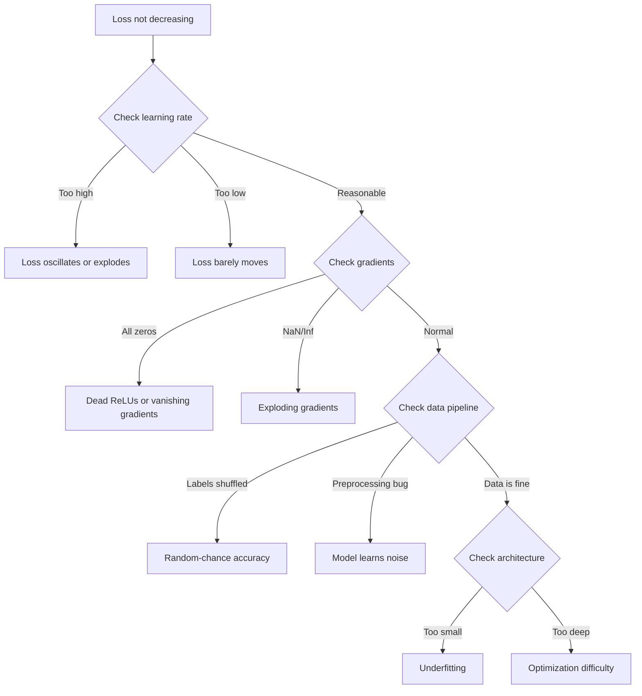
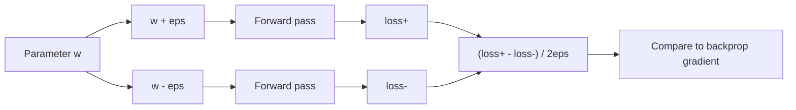
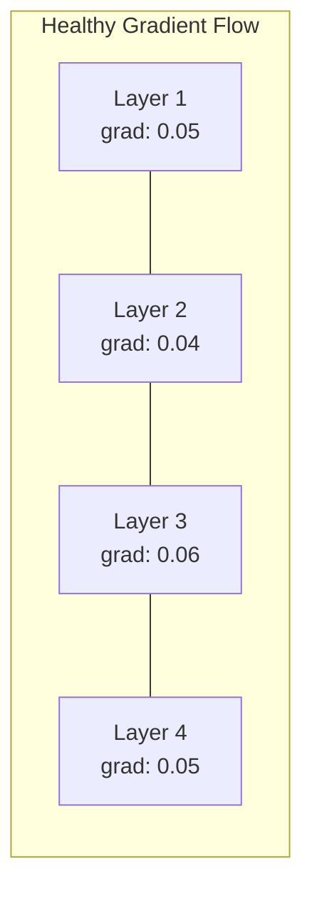
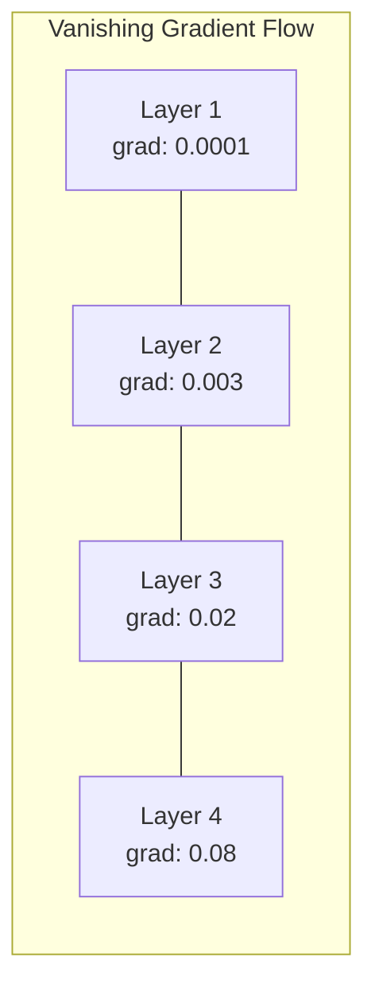
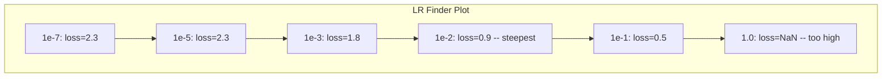

# Debugging Neural Networks | 调试神经网络

> Your network compiled. It ran. It produced a number. The number is wrong and nothing crashed. Welcome to the hardest kind of debugging -- the kind where there is no error message.

> **【中文解读】** 网络编译了、运行了、输出了数字——但数字是错的，没有报错信息。这是最难的调试：没有错误信息。本章系统介绍深度学习的调试方法论：过拟合单个 batch → 检查梯度 → 追踪数值稳定性 → 诊断学习率问题。

**Type:** Practice
**Languages:** Python, PyTorch
**Prerequisites:** Phase 03 Lessons 01-10 (especially backpropagation, loss functions, optimizers)
**Time:** ~90 minutes

## Learning Objectives | 学习目标

- Diagnose common neural network failures (NaN loss, flat loss curve, overfitting, oscillation) using systematic debugging strategies
- Apply the "overfit one batch" technique to verify that your model architecture and training loop are correct
- Inspect gradient magnitudes, activation distributions, and weight norms to identify vanishing/exploding gradient problems
- Build a debugging checklist that covers data pipeline, model architecture, loss function, optimizer, and learning rate issues

> **【中文解读】** 本章系统化地教你调试神经网络。核心方法论：过拟合单个 batch（验证代码正确性）→ 梯度检查（验证反向传播）→ 激活统计（发现 dead ReLU）→ 学习率搜索（找到合适的 lr）。60-70% 的 ML 调试时间花在"静默错误"上——程序不报错但结果不对。

## The Problem | 问题引入

Traditional software crashes when it is broken. A null pointer throws an exception. A type mismatch fails at compile time. An off-by-one error produces a clearly wrong output.

> 传统软件在出问题时会崩溃。空指针抛出异常。类型不匹配在编译时失败。差一错误产生明显错误的输出。

Neural networks do not give you that luxury.

> 神经网络不会给你这种奢侈。

A broken neural network runs to completion, prints a loss value, and outputs predictions. The loss might decrease. The predictions might look plausible. But the model is silently wrong -- learning shortcuts, memorizing noise, or converging to a useless local minimum. Google researchers estimated that 60-70% of ML debugging time is spent on "silent" bugs that produce no errors but degrade model quality.

> 一个有问题的神经网络可以运行到完成，打印损失值，输出预测。损失可能在下降。预测可能看起来合理。但模型在悄悄地犯错——学习捷径、记忆噪声或收敛到无用的局部最小值。Google 研究人员估计 60-70% 的 ML 调试时间花在"静默"错误上——不产生错误但降低模型质量。

The difference between a working model and a broken one is often a single misplaced line: a missing `zero_grad()`, a transposed dimension, a learning rate off by 10x. the canonical "Recipe for Training Neural Networks" (2019) opens with this: "The most common neural net mistakes are bugs that don't crash."

> 可用模型和损坏模型之间的差异往往只是一行放错位置的代码：缺少 `zero_grad()`、维度转置错误、学习率差 10 倍。经典的"训练神经网络的方法"(2019) 开头写道："最常见的神经网络错误是不会崩溃的 bug。"

This lesson teaches you to find those bugs.

> 本课教你如何找到这些 bug。

> **【中文解读】** 传统软件有明确的错误信号（异常、编译错误）。神经网络最难调试的地方在于"静默错误"——程序正常运行、loss 也在下降，但模型悄悄地学错了。最常见的三个坑：忘记 zero_grad()、维度转置错误、学习率差 10 倍。

> **【拓展：大模型训练中的调试】** 训练 Llama 3 405B 这样的模型（16384 块 H100，30.8M GPU 小时），一次训练失败的成本高达数百万美元。Meta 的做法是：(1) 先在小模型（8B）上验证所有代码；(2) 用 overfit-one-batch 测试完整 pipeline；(3) 在 64 块 GPU 上跑"冒烟测试"；(4) 逐步扩展到完整规模。每个阶段都有自动化监控检测 NaN、loss spike、dead neurons。

## The Concept | 核心概念

### The Debugging Mindset | 调试心态

Forget print-and-pray debugging. Neural network debugging requires a systematic approach because the feedback loop is slow (minutes to hours per training run) and the symptoms are ambiguous (bad loss could mean 20 different things).

> 忘掉 print-and-pray 调试。神经网络调试需要系统化的方法，因为反馈循环很慢（每次训练运行几分钟到几小时），而且症状模糊（差的损失可能意味着 20 种不同的问题）。

The golden rule: **start simple, add complexity one piece at a time, and verify each piece independently.**

> 黄金法则：**从简单开始，一次只加一个复杂度，独立验证每个组件。**

> **【中文解读】** 调试神经网络的黄金法则：从最简单的情况开始，每次只加一个组件，独立验证每个组件。不要一上来就跑完整训练——先确保模型能在单个 batch 上过拟合到 loss≈0，再逐步扩展。



### Symptom 1: Loss Not Decreasing | 症状 1：Loss 不下降

This is the most common complaint. The training loop runs, epochs tick by, and the loss stays flat or oscillates wildly.

> 这是最常见的抱怨。训练循环在跑，epoch 一个接一个过去，但 loss 一直不动或者剧烈震荡。

**Wrong learning rate.** Too high: loss oscillates or jumps to NaN. Too low: loss decreases so slowly it looks flat. For Adam, start at 1e-3. For SGD, start at 1e-1 or 1e-2. Always try 3 learning rates spanning 10x each (e.g., 1e-2, 1e-3, 1e-4) before concluding something else is wrong.

> **学习率错误。** 太高：loss 振荡或跳到 NaN。太低：loss 下降得太慢，看起来像不动。Adam 从 1e-3 开始。SGD 从 1e-1 或 1e-2 开始。在下结论说有其他问题之前，先尝试 3 个学习率（相差 10 倍，如 1e-2、1e-3、1e-4）。

**Dead ReLUs.** If a ReLU neuron receives a large negative input, it outputs 0 and its gradient is 0. It never activates again. If enough neurons die, the network cannot learn. Check: print the fraction of activations that are exactly 0 after each ReLU layer. If >50% are dead, switch to LeakyReLU or reduce the learning rate.

> **死亡 ReLU。** 如果 ReLU 神经元接收到大的负输入，它输出 0，梯度也是 0，永远不会再激活。如果死的神经元足够多，网络就学不到东西。检查方法：打印每个 ReLU 层后激活值恰好为 0 的比例。如果 >50% 死了，换用 LeakyReLU 或降低学习率。

**Vanishing gradients.** In deep networks with sigmoid or tanh activations, gradients shrink exponentially as they propagate backward. By the time they reach the first layer, they are ~0. The first layers stop learning. Fix: use ReLU/GELU, add residual connections, or use batch normalization.

> **梯度消失。** 在用 sigmoid 或 tanh 激活的深层网络中，梯度反向传播时指数级缩小。到达第一层时几乎是 0。前面的层停止学习。修复：用 ReLU/GELU、加残差连接、或用批归一化。

**Exploding gradients.** The opposite problem -- gradients grow exponentially. Common in RNNs and very deep networks. Loss jumps to NaN. Fix: gradient clipping (`torch.nn.utils.clip_grad_norm_`), lower learning rate, or add normalization.

> **梯度爆炸。** 相反的问题——梯度指数级增长。常见于 RNN 和非常深的网络。Loss 跳到 NaN。修复：梯度裁剪（`torch.nn.utils.clip_grad_norm_`）、降低学习率、或添加归一化层。

### Symptom 2: Loss Decreasing But Model is Bad | 症状 2：Loss 下降但模型不好

The loss goes down. Training accuracy hits 99%. But test accuracy is 55%. Or the model produces nonsensical outputs on real data.

> Loss 在下降。训练准确率达到 99%。但测试准确率只有 55%。或者模型在真实数据上输出无意义的结果。

**Overfitting.** The model memorizes training data instead of learning patterns. Gap between training and validation loss grows over time. Fix: more data, dropout, weight decay, early stopping, data augmentation.

> **过拟合。** 模型在背诵训练数据而不是学习规律。训练 loss 和验证 loss 之间的差距随时间扩大。修复：更多数据、Dropout、权重衰减、早停、数据增强。

**Data leakage.** Test data leaked into training. Accuracy is suspiciously high. Common causes: shuffling before splitting, preprocessing with statistics from the full dataset, duplicate samples across splits. Fix: split first, preprocess second, check for duplicates.

> **数据泄漏。** 测试数据混进了训练。准确率高得可疑。常见原因：划分前先打乱、用整个数据集的统计量做预处理、跨划分的重复样本。修复：先划分再预处理、检查重复。

**Label errors.** 5-10% of labels in most real datasets are wrong (Northcutt et al., 2021 -- "Pervasive Label Errors in Test Sets"). The model learns the noise. Fix: use confident learning to find and fix mislabeled examples, or use loss truncation to ignore high-loss samples.

> **标签错误。** 大多数真实数据集中 5-10% 的标签是错的（Northcutt 等人 2021 年的论文《Pervasive Label Errors in Test Sets》）。模型学到了噪声。修复：用 confident learning 找出并修正错标样本，或用 loss truncation 忽略高 loss 样本。

### Symptom 3: NaN or Inf in Loss | 症状 3：Loss 出现 NaN 或 Inf

The loss value becomes `nan` or `inf`. Training is dead.

> Loss 值变成 `nan` 或 `inf`。训练死了。

**Learning rate too high.** Gradient updates overshoot so far that weights explode. Fix: reduce by 10x.

> **学习率太高。** 梯度更新过冲到权重爆炸。修复：降低 10 倍。

**log(0) or log(negative).** Cross-entropy loss computes `log(p)`. If your model outputs exactly 0 or a negative probability, the log explodes. Fix: clamp predictions to `[eps, 1-eps]` where `eps=1e-7`.

> **log(0) 或 log(负数)。** 交叉熵损失计算 `log(p)`。如果模型输出恰好 0 或负概率，log 会爆炸。修复：把预测值钳制到 `[eps, 1-eps]`，其中 `eps=1e-7`。

**Division by zero.** Batch normalization divides by standard deviation. A batch with constant values has std=0. Fix: add epsilon to the denominator (PyTorch does this by default, but custom implementations might not).

> **除以零。** 批归一化要除以标准差。一个常数值的 batch 的 std=0。修复：分母加 epsilon（PyTorch 默认这样做，但自定义实现可能没有）。

**Numerical overflow.** Large activations fed into `exp()` produce Inf. Softmax is especially prone. Fix: subtract the max before exponentiating (the log-sum-exp trick).

> **数值溢出。** 大的激活值输入 `exp()` 会产生 Inf。Softmax 尤其容易。修复：指数化前减去最大值（log-sum-exp 技巧）。

### Technique 1: Gradient Checking | 技术 1：梯度检查

Compare your analytical gradients (from backprop) to numerical gradients (from finite differences). If they disagree, your backward pass has a bug.

> 把你的解析梯度（来自反向传播）和数值梯度（来自有限差分）做比较。如果两者不一致，你的反向传播有 bug。

Numerical gradient for parameter `w`:

> 参数 `w` 的数值梯度：

```
grad_numerical = (loss(w + eps) - loss(w - eps)) / (2 * eps)
```

Agreement metric (relative difference):

> 一致性度量（相对差异）：

```
rel_diff = |grad_analytical - grad_numerical| / max(|grad_analytical|, |grad_numerical|, 1e-8)
```

If `rel_diff < 1e-5`: correct. If `rel_diff > 1e-3`: almost certainly a bug.

> 如果 `rel_diff < 1e-5`：正确。如果 `rel_diff > 1e-3`：几乎肯定有 bug。



### Technique 2: Activation Statistics | 技术 2：激活统计

Monitor the mean and standard deviation of activations after each layer during training. Healthy networks maintain activations with mean near 0 and std near 1 (after normalization) or at least bounded.

> 训练时监控每层后激活值的均值和标准差。健康的网络保持激活值均值接近 0、标准差接近 1（归一化后）或至少有界。

| Health indicator | Mean | Std | Diagnosis |
|-----------------|------|-----|-----------|
| Healthy | ~0 | ~1 | Network is learning normally |
| Saturated | >>0 or <<0 | ~0 | Activations stuck at extreme values |
| Dead | 0 | 0 | Neurons are dead (all zeros) |
| Exploding | >>10 | >>10 | Activations growing without bound |

| 健康指标 | 均值 | 标准差 | 诊断 |
|---------|------|--------|------|
| 健康 | ~0 | ~1 | 网络正常学习中 |
| 饱和 | >>0 或 <<0 | ~0 | 激活卡在极端值 |
| 死亡 | 0 | 0 | 神经元死了（全零） |
| 爆炸 | >>10 | >>10 | 激活无界增长 |

### Technique 3: Gradient Flow Visualization | 技术 3：梯度流可视化

Plot the average gradient magnitude for each layer. In a healthy network, gradient magnitudes should be roughly similar across layers. If early layers have gradients 1000x smaller than later layers, you have vanishing gradients.

> 绘制每层的平均梯度幅度。在健康的网络中，各层的梯度幅度应该大致相似。如果前面层的梯度比后面层小 1000 倍，你就有梯度消失问题。





### Technique 4: The Overfit-One-Batch Test | 技术 4：过拟合单 batch 测试

The single most important debugging technique in deep learning.

> 深度学习中最重要的单一调试技术。

Take one small batch (8-32 samples). Train on it for 100+ iterations. The loss should go to nearly zero and training accuracy should hit 100%. If it does not, your model or training loop has a fundamental bug -- do not proceed to full training.

> 取一个小批量（8-32 个样本）。在上面训练 100+ 次迭代。损失应该降到接近零，训练准确率应该达到 100%。如果不是，你的模型或训练循环有根本性的 bug——不要进入完整训练。

This test catches:
- Broken loss functions
- Broken backward passes
- Architecture too small to represent the data
- Optimizer not connected to model parameters
- Data and labels misaligned

> 这个测试能捕获：损坏的损失函数、损坏的反向传播、架构太小无法表示数据、优化器未连接到模型参数、数据和标签不匹配。

This takes 30 seconds to run and saves hours of debugging full training runs.

> 这只需 30 秒运行，可以节省数小时的完整训练调试时间。

> **【拓展：Andrej Karpathy 的调试建议】** Karpathy 在 "Recipe for Training Neural Networks" 中给出的建议：(1) 先不要管性能，确保 loss 计算正确；(2) 在固定小数据集上过拟合；(3) 检查梯度用数值梯度验证；(4) 监控权重和梯度的范数；(5) 先用小模型验证，再扩大。他的核心观点："如果你不能过拟合一个小数据集，说明代码有 bug。"

### Technique 5: Learning Rate Finder | 技术 5：学习率搜索器

Leslie Smith (2017) proposed sweeping the learning rate from very small (1e-7) to very large (10) over one epoch while recording the loss. Plot loss vs learning rate. The optimal learning rate is roughly 10x smaller than the rate where loss starts decreasing fastest.

> Leslie Smith（2017）提出在一个 epoch 内把学习率从极小（1e-7）扫到极大（10），同时记录 loss。绘制 loss vs 学习率曲线。最优学习率大约是 loss 开始下降最快处的学习率的 1/10。



Best LR in this example: ~1e-3 (one order of magnitude before the steepest point).

> 本例的最佳学习率：~1e-3（在下降最陡处之前一个数量级）。

### Common PyTorch Bugs | 常见 PyTorch 错误

These are the bugs that waste the most collective hours in the PyTorch community:

> 这些是 PyTorch 社区集体浪费最多时间的 bug：

> **【拓展：大模型训练中的 loss spike】** 在训练超大规模模型时（如 GPT-4、Llama 3），会出现突然的 loss spike——loss 从正常值突然跳到很高再恢复。可能原因：(1) 数据中有异常样本（重复文本、编码错误）；(2) 梯度爆炸在某个 batch 触发；(3) 学习率调度不当。Meta 的做法：检测到 spike 时跳过该 batch 并从最近的 checkpoint 恢复。OpenAI 则使用梯度裁剪和更保守的学习率来预防。

| Bug | Symptom | Fix |
|-----|---------|-----|
| Forgetting `optimizer.zero_grad()` | Gradients accumulate across batches, loss oscillates | Add `optimizer.zero_grad()` before `loss.backward()` |
| Forgetting `model.eval()` at test time | Dropout and batch norm behave differently, test accuracy varies between runs | Add `model.eval()` and `torch.no_grad()` |
| Wrong tensor shapes | Silent broadcasting produces wrong results, no error | Print shapes after every operation during debugging |
| CPU/GPU mismatch | `RuntimeError: expected CUDA tensor` | Use `.to(device)` on model AND data |
| Not detaching tensors | Computation graph grows forever, OOM | Use `.detach()` or `with torch.no_grad()` |
| In-place operations breaking autograd | `RuntimeError: modified by in-place operation` | Replace `x += 1` with `x = x + 1` |
| Data not normalized | Loss stuck at random-chance level | Normalize inputs to mean=0, std=1 |
| Labels as wrong dtype | Cross-entropy expects `Long`, got `Float` | Cast labels: `labels.long()` |

| Bug | 症状 | 修复 |
|-----|------|------|
| 忘记 `optimizer.zero_grad()` | 梯度跨 batch 累积，loss 振荡 | 在 `loss.backward()` 前加 `optimizer.zero_grad()` |
| 测试时忘记 `model.eval()` | Dropout 和 BN 行为不同，测试准确率波动 | 加 `model.eval()` 和 `torch.no_grad()` |
| 张量形状错误 | 静默广播产生错误结果，无报错 | 调试时每个操作后打印形状 |
| CPU/GPU 不匹配 | `RuntimeError: expected CUDA tensor` | 模型和数据都用 `.to(device)` |
| 没有分离张量 | 计算图永远增长，OOM | 用 `.detach()` 或 `with torch.no_grad()` |
| 原地操作破坏 autograd | `RuntimeError: modified by in-place operation` | 把 `x += 1` 改成 `x = x + 1` |
| 数据未归一化 | Loss 卡在随机猜测水平 | 把输入归一化到 mean=0, std=1 |
| 标签 dtype 错误 | 交叉熵要 `Long`，得到了 `Float` | 转换标签：`labels.long()` |

### The Master Debugging Table | 调试总表

| Symptom | Likely cause | First thing to try |
|---------|-------------|-------------------|
| Loss stuck at -log(1/num_classes) | Model predicting uniform distribution | Check data pipeline, verify labels match inputs |
| Loss NaN after a few steps | Learning rate too high | Reduce LR by 10x |
| Loss NaN immediately | log(0) or division by zero | Add epsilon to log/division operations |
| Loss oscillating wildly | LR too high or batch size too small | Reduce LR, increase batch size |
| Loss decreasing then plateaus | LR too high for fine-tuning phase | Add LR schedule (cosine or step decay) |
| Training acc high, test acc low | Overfitting | Add dropout, weight decay, more data |
| Training acc = test acc = chance | Model not learning anything | Run overfit-one-batch test |
| Training acc = test acc but both low | Underfitting | Bigger model, more layers, more features |
| Gradients all zero | Dead ReLUs or detached computation graph | Switch to LeakyReLU, check `.requires_grad` |
| Out of memory during training | Batch too large or graph not freed | Reduce batch size, use `torch.no_grad()` for eval |

| 症状 | 可能原因 | 首选尝试 |
|------|---------|---------|
| Loss 卡在 -log(1/num_classes) | 模型预测均匀分布 | 检查数据管线，验证标签与输入匹配 |
| 几步后 Loss 变 NaN | 学习率太高 | 学习率降低 10 倍 |
| Loss 立即变 NaN | log(0) 或除以零 | 给 log/除法操作加 epsilon |
| Loss 剧烈振荡 | LR 太高或 batch 太小 | 降低 LR，增大 batch |
| Loss 下降后停滞 | 微调阶段 LR 太高 | 加 LR 调度（cosine 或阶梯衰减） |
| 训练 acc 高，测试 acc 低 | 过拟合 | 加 Dropout、权重衰减、更多数据 |
| 训练 acc = 测试 acc = 随机水平 | 模型没学到东西 | 跑过拟合单 batch 测试 |
| 训练 acc = 测试 acc 都低 | 欠拟合 | 更大模型、更多层、更多特征 |
| 梯度全零 | Dead ReLU 或计算图被 detach | 换 LeakyReLU，检查 `.requires_grad` |
| 训练时 OOM | Batch 太大或计算图未释放 | 减小 batch，eval 时用 `torch.no_grad()` |

## Build It | 动手实现

> **【中文解读】** 构建一个 NetworkDebugger 诊断工具：用 PyTorch 的 forward hook 和 backward hook 自动记录每层的激活统计和梯度统计。然后故意制造三种错误（学习率太高、dead ReLU、忘记 zero_grad），用工具诊断。最后实现学习率搜索器和梯度检查器。

A diagnostic toolkit that monitors activations, gradients, and loss curves. You will deliberately break a network and use the toolkit to diagnose each problem.

> 一个监控激活值、梯度和 loss 曲线的诊断工具包。你会故意破坏一个网络，然后用工具包诊断每个问题。

### Step 1: The NetworkDebugger Class | 第一步：NetworkDebugger 类

Hooks into a PyTorch model to record activation and gradient statistics per layer.

> 给 PyTorch 模型挂上钩子，记录每层的激活和梯度统计。

> NetworkDebugger 用 PyTorch 的 forward hook 和 backward hook 自动监控每层。健康检查逻辑：loss 检查（NaN/振荡/不下降）、激活检查（>50% 零值→死亡 ReLU，|mean|>10→爆炸，std<1e-6→坍缩）、梯度检查（abs_mean<1e-7→消失，>100→爆炸，首尾比值>100→梯度比失衡）。`print_report()` 输出综合诊断报告。

```python
import torch
import torch.nn as nn
import math


class NetworkDebugger:
    def __init__(self, model):
        self.model = model
        self.activation_stats = {}
        self.gradient_stats = {}
        self.loss_history = []
        self.lr_losses = []
        self.hooks = []
        self._register_hooks()

    def _register_hooks(self):
        for name, module in self.model.named_modules():
            if isinstance(module, (nn.Linear, nn.Conv2d, nn.ReLU, nn.LeakyReLU)):
                hook = module.register_forward_hook(self._make_activation_hook(name))
                self.hooks.append(hook)
                hook = module.register_full_backward_hook(self._make_gradient_hook(name))
                self.hooks.append(hook)

    def _make_activation_hook(self, name):
        def hook(module, input, output):
            with torch.no_grad():
                out = output.detach().float()
                self.activation_stats[name] = {
                    "mean": out.mean().item(),
                    "std": out.std().item(),
                    "fraction_zero": (out == 0).float().mean().item(),
                    "min": out.min().item(),
                    "max": out.max().item(),
                }
        return hook

    def _make_gradient_hook(self, name):
        def hook(module, grad_input, grad_output):
            if grad_output[0] is not None:
                with torch.no_grad():
                    grad = grad_output[0].detach().float()
                    self.gradient_stats[name] = {
                        "mean": grad.mean().item(),
                        "std": grad.std().item(),
                        "abs_mean": grad.abs().mean().item(),
                        "max": grad.abs().max().item(),
                    }
        return hook

    def record_loss(self, loss_value):
        self.loss_history.append(loss_value)

    def check_loss_health(self):
        if len(self.loss_history) < 2:
            return "NOT_ENOUGH_DATA"
        recent = self.loss_history[-10:]
        if any(math.isnan(v) or math.isinf(v) for v in recent):
            return "NAN_OR_INF"
        if len(self.loss_history) >= 20:
            first_half = sum(self.loss_history[:10]) / 10
            second_half = sum(self.loss_history[-10:]) / 10
            if second_half >= first_half * 0.99:
                return "NOT_DECREASING"
        if len(recent) >= 5:
            diffs = [recent[i+1] - recent[i] for i in range(len(recent)-1)]
            if max(diffs) - min(diffs) > 2 * abs(sum(diffs) / len(diffs)):
                return "OSCILLATING"
        return "HEALTHY"

    def check_activations(self):
        issues = []
        for name, stats in self.activation_stats.items():
            if stats["fraction_zero"] > 0.5:
                issues.append(f"DEAD_NEURONS: {name} has {stats['fraction_zero']:.0%} zero activations")
            if abs(stats["mean"]) > 10:
                issues.append(f"EXPLODING_ACTIVATIONS: {name} mean={stats['mean']:.2f}")
            if stats["std"] < 1e-6:
                issues.append(f"COLLAPSED_ACTIVATIONS: {name} std={stats['std']:.2e}")
        return issues if issues else ["HEALTHY"]

    def check_gradients(self):
        issues = []
        grad_magnitudes = []
        for name, stats in self.gradient_stats.items():
            grad_magnitudes.append((name, stats["abs_mean"]))
            if stats["abs_mean"] < 1e-7:
                issues.append(f"VANISHING_GRADIENT: {name} abs_mean={stats['abs_mean']:.2e}")
            if stats["abs_mean"] > 100:
                issues.append(f"EXPLODING_GRADIENT: {name} abs_mean={stats['abs_mean']:.2e}")
        if len(grad_magnitudes) >= 2:
            first_mag = grad_magnitudes[0][1]
            last_mag = grad_magnitudes[-1][1]
            if last_mag > 0 and first_mag / last_mag > 100:
                issues.append(f"GRADIENT_RATIO: first/last = {first_mag/last_mag:.0f}x (vanishing)")
        return issues if issues else ["HEALTHY"]

    def print_report(self):
        print("\n=== NETWORK DEBUGGER REPORT ===")
        print(f"\nLoss health: {self.check_loss_health()}")
        if self.loss_history:
            print(f"  Last 5 losses: {[f'{v:.4f}' for v in self.loss_history[-5:]]}")
        print("\nActivation diagnostics:")
        for item in self.check_activations():
            print(f"  {item}")
        print("\nGradient diagnostics:")
        for item in self.check_gradients():
            print(f"  {item}")
        print("\nPer-layer activation stats:")
        for name, stats in self.activation_stats.items():
            print(f"  {name}: mean={stats['mean']:.4f} std={stats['std']:.4f} zero={stats['fraction_zero']:.1%}")
        print("\nPer-layer gradient stats:")
        for name, stats in self.gradient_stats.items():
            print(f"  {name}: abs_mean={stats['abs_mean']:.2e} max={stats['max']:.2e}")

    def remove_hooks(self):
        for hook in self.hooks:
            hook.remove()
        self.hooks.clear()
```

### Step 2: The Overfit-One-Batch Test | 第二步：过拟合单 batch 测试

> 这个函数在单个 batch 上训练模型 200 步，验证 loss 能降到接近零、准确率能达到 100%。如果不能，说明模型或训练循环有根本性问题。

```python
def overfit_one_batch(model, x_batch, y_batch, criterion, lr=0.01, steps=200):
    optimizer = torch.optim.Adam(model.parameters(), lr=lr)
    model.train()
    print("\n=== OVERFIT ONE BATCH TEST ===")
    print(f"Batch size: {x_batch.shape[0]}, Steps: {steps}")

    for step in range(steps):
        optimizer.zero_grad()
        output = model(x_batch)
        loss = criterion(output, y_batch)
        loss.backward()
        optimizer.step()

        if step % 50 == 0 or step == steps - 1:
            with torch.no_grad():
                preds = (output > 0).float() if output.shape[-1] == 1 else output.argmax(dim=1)
                targets = y_batch if y_batch.dim() == 1 else y_batch.squeeze()
                acc = (preds.squeeze() == targets).float().mean().item()
            print(f"  Step {step:3d} | Loss: {loss.item():.6f} | Accuracy: {acc:.1%}")

    final_loss = loss.item()
    if final_loss > 0.1:
        print(f"\n  FAIL: Loss did not converge ({final_loss:.4f}). Model or training loop is broken.")
        return False
    print(f"\n  PASS: Loss converged to {final_loss:.6f}")
    return True
```

### Step 3: Learning Rate Finder | 第三步：学习率搜索器

> 这个函数从极小学习率（1e-7）指数扫到极大（10），每步记录 loss，最终给出"loss 下降最快点之前一个数量级"的学习率建议。注意先深拷贝模型状态，跑完恢复——这个搜索会破坏模型。

```python
def find_learning_rate(model, x_data, y_data, criterion, start_lr=1e-7, end_lr=10, steps=100):
    import copy
    original_state = copy.deepcopy(model.state_dict())
    optimizer = torch.optim.SGD(model.parameters(), lr=start_lr)
    lr_mult = (end_lr / start_lr) ** (1 / steps)

    model.train()
    results = []
    best_loss = float("inf")
    current_lr = start_lr

    print("\n=== LEARNING RATE FINDER ===")

    for step in range(steps):
        optimizer.zero_grad()
        output = model(x_data)
        loss = criterion(output, y_data)

        if math.isnan(loss.item()) or loss.item() > best_loss * 10:
            break

        best_loss = min(best_loss, loss.item())
        results.append((current_lr, loss.item()))

        loss.backward()
        optimizer.step()

        current_lr *= lr_mult
        for param_group in optimizer.param_groups:
            param_group["lr"] = current_lr

    model.load_state_dict(original_state)

    if len(results) < 10:
        print("  Could not complete LR sweep -- loss diverged too quickly")
        return results

    min_loss_idx = min(range(len(results)), key=lambda i: results[i][1])
    suggested_lr = results[max(0, min_loss_idx - 10)][0]

    print(f"  Swept {len(results)} steps from {start_lr:.0e} to {results[-1][0]:.0e}")
    print(f"  Minimum loss {results[min_loss_idx][1]:.4f} at lr={results[min_loss_idx][0]:.2e}")
    print(f"  Suggested learning rate: {suggested_lr:.2e}")

    return results
```

### Step 4: Gradient Checker | 第四步：梯度检查器

> 梯度检查器：对每个参数，比较反向传播算出的解析梯度和有限差分得到的数值梯度。`rel_diff < 1e-5` 表示正确，`> 1e-3` 几乎肯定有 bug。注意要用双精度（double）以减少数值误差。

```python
def _flat_to_multi_index(flat_idx, shape):
    multi_idx = []
    remaining = flat_idx
    for dim in reversed(shape):
        multi_idx.insert(0, remaining % dim)
        remaining //= dim
    return tuple(multi_idx)


def gradient_check(model, x, y, criterion, eps=1e-4):
    model.train()
    x_double = x.double()
    y_double = y.double()
    model_double = model.double()

    print("\n=== GRADIENT CHECK ===")
    overall_max_diff = 0
    checked = 0

    for name, param in model_double.named_parameters():
        if not param.requires_grad:
            continue

        layer_max_diff = 0

        model_double.zero_grad()
        output = model_double(x_double)
        loss = criterion(output, y_double)
        loss.backward()
        analytical_grad = param.grad.clone()

        num_checks = min(5, param.numel())
        for i in range(num_checks):
            idx = _flat_to_multi_index(i, param.shape)
            original = param.data[idx].item()

            param.data[idx] = original + eps
            with torch.no_grad():
                loss_plus = criterion(model_double(x_double), y_double).item()

            param.data[idx] = original - eps
            with torch.no_grad():
                loss_minus = criterion(model_double(x_double), y_double).item()

            param.data[idx] = original

            numerical = (loss_plus - loss_minus) / (2 * eps)
            analytical = analytical_grad[idx].item()

            denom = max(abs(numerical), abs(analytical), 1e-8)
            rel_diff = abs(numerical - analytical) / denom

            layer_max_diff = max(layer_max_diff, rel_diff)
            checked += 1

        overall_max_diff = max(overall_max_diff, layer_max_diff)
        status = "OK" if layer_max_diff < 1e-5 else "MISMATCH"
        print(f"  {name}: max_rel_diff={layer_max_diff:.2e} [{status}]")

    model.float()

    print(f"\n  Checked {checked} parameters")
    if overall_max_diff < 1e-5:
        print("  PASS: Gradients match (rel_diff < 1e-5)")
    elif overall_max_diff < 1e-3:
        print("  WARN: Small differences (1e-5 < rel_diff < 1e-3)")
    else:
        print("  FAIL: Gradient mismatch detected (rel_diff > 1e-3)")
    return overall_max_diff
```

### Step 5: Deliberately Broken Networks | 第五步：故意制造错误

Now apply the toolkit to broken networks and diagnose each one.

> 现在把工具包应用到被破坏的网络上，逐个诊断。三个故意制造的 bug：(1) 学习率太高（lr=10），观察 loss 发散；(2) 错误初始化导致 ReLU 死亡（权重全 -1，偏置全 -5），观察死亡神经元比例；(3) 忘记 zero_grad 导致梯度累积。最后用健康网络做对照。

```python
def demo_broken_networks():
    torch.manual_seed(42)
    x = torch.randn(64, 10)
    y = (x[:, 0] > 0).long()

    print("\n" + "=" * 60)
    print("BUG 1: Learning rate too high (lr=10)")
    print("=" * 60)
    model1 = nn.Sequential(nn.Linear(10, 32), nn.ReLU(), nn.Linear(32, 2))
    debugger1 = NetworkDebugger(model1)
    optimizer1 = torch.optim.SGD(model1.parameters(), lr=10.0)
    criterion = nn.CrossEntropyLoss()
    for step in range(20):
        optimizer1.zero_grad()
        out = model1(x)
        loss = criterion(out, y)
        debugger1.record_loss(loss.item())
        loss.backward()
        optimizer1.step()
    debugger1.print_report()
    debugger1.remove_hooks()

    print("\n" + "=" * 60)
    print("BUG 2: Dead ReLUs from bad initialization")
    print("=" * 60)
    model2 = nn.Sequential(nn.Linear(10, 32), nn.ReLU(), nn.Linear(32, 32), nn.ReLU(), nn.Linear(32, 2))
    with torch.no_grad():
        for m in model2.modules():
            if isinstance(m, nn.Linear):
                m.weight.fill_(-1.0)
                m.bias.fill_(-5.0)
    debugger2 = NetworkDebugger(model2)
    optimizer2 = torch.optim.Adam(model2.parameters(), lr=1e-3)
    for step in range(50):
        optimizer2.zero_grad()
        out = model2(x)
        loss = criterion(out, y)
        debugger2.record_loss(loss.item())
        loss.backward()
        optimizer2.step()
    debugger2.print_report()
    debugger2.remove_hooks()

    print("\n" + "=" * 60)
    print("BUG 3: Missing zero_grad (gradients accumulate)")
    print("=" * 60)
    model3 = nn.Sequential(nn.Linear(10, 32), nn.ReLU(), nn.Linear(32, 2))
    debugger3 = NetworkDebugger(model3)
    optimizer3 = torch.optim.SGD(model3.parameters(), lr=0.01)
    for step in range(50):
        out = model3(x)
        loss = criterion(out, y)
        debugger3.record_loss(loss.item())
        loss.backward()
        optimizer3.step()
    debugger3.print_report()
    debugger3.remove_hooks()

    print("\n" + "=" * 60)
    print("HEALTHY NETWORK: Correct setup for comparison")
    print("=" * 60)
    model_good = nn.Sequential(nn.Linear(10, 32), nn.ReLU(), nn.Linear(32, 2))
    debugger_good = NetworkDebugger(model_good)
    optimizer_good = torch.optim.Adam(model_good.parameters(), lr=1e-3)
    for step in range(50):
        optimizer_good.zero_grad()
        out = model_good(x)
        loss = criterion(out, y)
        debugger_good.record_loss(loss.item())
        loss.backward()
        optimizer_good.step()
    debugger_good.print_report()
    debugger_good.remove_hooks()

    print("\n" + "=" * 60)
    print("OVERFIT-ONE-BATCH TEST (healthy model)")
    print("=" * 60)
    model_test = nn.Sequential(nn.Linear(10, 32), nn.ReLU(), nn.Linear(32, 2))
    overfit_one_batch(model_test, x[:8], y[:8], criterion)

    print("\n" + "=" * 60)
    print("LEARNING RATE FINDER")
    print("=" * 60)
    model_lr = nn.Sequential(nn.Linear(10, 32), nn.ReLU(), nn.Linear(32, 2))
    find_learning_rate(model_lr, x, y, criterion)

    print("\n" + "=" * 60)
    print("GRADIENT CHECK")
    print("=" * 60)
    model_grad = nn.Sequential(nn.Linear(10, 8), nn.ReLU(), nn.Linear(8, 2))
    gradient_check(model_grad, x[:4], y[:4], criterion)
```

## Use It | 用框架实现

> **【中文解读】** PyTorch 内置调试工具：`torch.autograd.detect_anomaly()` 捕获 NaN/Inf、`model.named_parameters()` 遍历参数和梯度。生产环境用 Weights & Biases (wandb) 或 TensorBoard 实时监控 loss、梯度直方图、权重分布。关键是在问题发生时能快速定位是哪一层出了问题。

### PyTorch Built-in Tools | PyTorch 内置工具

> PyTorch 内置工具：`detect_anomaly()` 在反向传播中检测 NaN/Inf 并打印出错位置；`named_parameters()` 遍历所有参数及其梯度，可打印梯度均值定位死亡层。生产环境推荐用 wandb/TensorBoard 持续监控。

```python
import torch
import torch.nn as nn

model = nn.Sequential(
    nn.Linear(768, 256),
    nn.ReLU(),
    nn.Linear(256, 10),
)

with torch.autograd.detect_anomaly():
    output = model(input_tensor)
    loss = criterion(output, target)
    loss.backward()

for name, param in model.named_parameters():
    if param.grad is not None:
        print(f"{name}: grad_mean={param.grad.abs().mean():.2e}")
```

### Weights & Biases Integration | Weights & Biases 集成

> W&B 集成：每个 epoch 记录 loss、学习率、梯度范数，并为每个参数记录梯度直方图。线上仪表盘实时显示训练曲线，能快速发现 loss spike、梯度爆炸或参数饱和。

```python
import wandb

wandb.init(project="debug-training")

for epoch in range(100):
    loss = train_one_epoch()
    wandb.log({
        "loss": loss,
        "lr": optimizer.param_groups[0]["lr"],
        "grad_norm": torch.nn.utils.clip_grad_norm_(model.parameters(), float("inf")),
    })

    for name, param in model.named_parameters():
        if param.grad is not None:
            wandb.log({f"grad/{name}": wandb.Histogram(param.grad.cpu().numpy())})
```

### TensorBoard | TensorBoard 可视化

> TensorBoard 可视化：`add_scalar` 记录标量（loss、accuracy、学习率），`add_histogram` 记录权重和梯度的分布。训练时运行 `tensorboard --logdir=runs/` 启动本地仪表盘，实时查看训练曲线和参数分布变化。

```python
from torch.utils.tensorboard import SummaryWriter

writer = SummaryWriter("runs/debug_experiment")

for epoch in range(100):
    loss = train_one_epoch()
    writer.add_scalar("Loss/train", loss, epoch)

    for name, param in model.named_parameters():
        writer.add_histogram(f"weights/{name}", param, epoch)
        if param.grad is not None:
            writer.add_histogram(f"gradients/{name}", param.grad, epoch)
```

### The Debug Checklist (Before Full Training) | 调试清单（完整训练前）

1. Run overfit-one-batch test. If it fails, stop.
2. Print model summary -- verify parameter count is reasonable.
3. Run a single forward pass with random data -- check output shape.
4. Train for 5 epochs -- verify loss decreases.
5. Check activation statistics -- no dead layers, no explosions.
6. Check gradient flow -- no vanishing, no exploding.
7. Verify data pipeline -- print 5 random samples with labels.

> 调试清单（完整训练前）：
> 1. 跑过拟合单 batch 测试。失败就停止。
> 2. 打印模型摘要——验证参数量合理。
> 3. 用随机数据跑一次前向传播——检查输出形状。
> 4. 训练 5 个 epoch——验证 loss 在下降。
> 5. 检查激活统计——没有死层、没有爆炸。
> 6. 检查梯度流——没有消失、没有爆炸。
> 7. 验证数据管线——打印 5 个带标签的随机样本。

## Ship It | 产出物

This lesson produces:
- `outputs/prompt-nn-debugger.md` -- a prompt for diagnosing neural network training failures
- `outputs/skill-debug-checklist.md` -- a decision-tree checklist for debugging training issues

Key deployment patterns for debugging:
- Add monitoring hooks to production training scripts
- Log activation and gradient statistics to W&B or TensorBoard every N steps
- Implement automatic alerts for NaN loss, dead neurons (>80% zero), or gradient explosion
- Always run the overfit-one-batch test when changing architectures or data pipelines

> 本课产出：
> - `outputs/prompt-nn-debugger.md`——诊断神经网络训练失败的提示词
> - `outputs/skill-debug-checklist.md`——调试训练问题的决策树清单
>
> 调试的关键部署模式：
> - 给生产训练脚本加监控钩子
> - 每 N 步把激活和梯度统计记录到 W&B 或 TensorBoard
> - 实现自动告警：NaN loss、死亡神经元（>80% 零）、梯度爆炸
> - 改架构或数据管线时永远先跑过拟合单 batch 测试

## Exercises | 练习题

1. **Add an exploding gradient detector.** Modify the `NetworkDebugger` to detect when gradients exceed a threshold and automatically suggest a gradient clipping value. Test it on a 20-layer network with no normalization.

   **添加梯度爆炸检测器。** 修改 `NetworkDebugger`，检测梯度超过阈值时自动建议梯度裁剪值。在没有归一化的 20 层网络上测试。

2. **Build a dead neuron resurrector.** Write a function that identifies dead ReLU neurons (always outputting 0) and reinitializes their incoming weights with Kaiming initialization. Show that this recovers a network where >70% of neurons are dead.

   **构建死亡神经元复活器。** 写一个函数识别死亡 ReLU 神经元（始终输出 0），用 Kaiming 初始化重新初始化它们的输入权重。展示它能让一个 >70% 神经元死亡的网络恢复。

3. **Implement the learning rate finder with plotting.** Extend `find_learning_rate` to save results as a CSV and write a separate script that reads the CSV and displays the LR vs loss curve using matplotlib. Identify the optimal LR for ResNet-18 on CIFAR-10.

   **实现带绘图的学习率搜索器。** 扩展 `find_learning_rate`，把结果保存为 CSV，并写一个独立脚本读取 CSV 用 matplotlib 绘制 LR vs loss 曲线。在 CIFAR-10 上的 ResNet-18 中找出最优 LR。

4. **Create a data pipeline validator.** Write a function that checks for: duplicate samples across train/test splits, label distribution imbalance (>10:1 ratio), input normalization (mean near 0, std near 1), and NaN/Inf values in the data. Run it on a deliberately corrupted dataset.

   **创建数据管线验证器。** 写一个函数检查：训练/测试划分间的重复样本、标签分布不平衡（>10:1 比例）、输入归一化（均值接近 0，std 接近 1）、数据中的 NaN/Inf 值。在故意损坏的数据集上运行。

5. **Debug a real failure.** Take the mini-framework from Lesson 10, introduce a subtle bug (e.g., transpose the weight matrix in backward), and use gradient checking to locate exactly which parameter has incorrect gradients. Document the debugging process.

   **调试一个真实失败。** 取第 10 课的迷你框架，引入一个隐蔽的 bug（如反向传播中转置权重矩阵），用梯度检查精确定位哪个参数梯度不对。记录调试过程。

## Key Terms | 术语速查表

| Term | What people say | What it actually means |
|------|----------------|----------------------|
| Silent bug | "It runs but gives bad results" | A bug that produces no error but degrades model quality -- the dominant failure mode in ML |
| Dead ReLU | "The neurons died" | A ReLU neuron whose input is always negative, so it outputs 0 and receives 0 gradient permanently |
| Vanishing gradients | "Early layers stop learning" | Gradients shrink exponentially through layers, making weights in early layers effectively frozen |
| Exploding gradients | "Loss went to NaN" | Gradients grow exponentially through layers, causing weight updates so large they overflow |
| Gradient checking | "Verify backprop is correct" | Comparing analytical gradients from backprop to numerical gradients from finite differences |
| Overfit-one-batch | "The most important debug test" | Training on a single small batch to verify the model CAN learn -- if it cannot, something is fundamentally broken |
| LR finder | "Sweep to find the right learning rate" | Exponentially increasing the learning rate over one epoch and picking the rate just before loss diverges |
| Data leakage | "Test data leaked into training" | When information from the test set contaminates training, producing artificially high accuracy |
| Activation statistics | "Monitor layer health" | Tracking mean, std, and zero-fraction of each layer's output to detect dead, saturated, or exploding neurons |
| Gradient clipping | "Cap the gradient magnitude" | Scaling gradients down when their norm exceeds a threshold, preventing exploding gradient updates |

| 术语 | 俗称 | 实际含义 |
|------|------|---------|
| Silent bug / 静默 bug | "能跑但结果差" | 不产生错误但降低模型质量的 bug——ML 中主要的失败模式 |
| Dead ReLU / 死亡 ReLU | "神经元死了" | 输入始终为负的 ReLU 神经元，永远输出 0、梯度为 0 |
| Vanishing gradients / 梯度消失 | "前面层停止学习" | 梯度穿过层时指数缩小，使前面层的权重实际上被冻结 |
| Exploding gradients / 梯度爆炸 | "Loss 变 NaN" | 梯度穿过层时指数增长，权重更新过大而溢出 |
| Gradient checking / 梯度检查 | "验证反向传播正确" | 把反向传播的解析梯度和有限差分的数值梯度做比较 |
| Overfit-one-batch / 过拟合单 batch | "最重要的调试测试" | 在单个小 batch 上训练，验证模型能学习——如果不能，就是根本性错误 |
| LR finder / 学习率搜索器 | "扫一遍找合适学习率" | 一个 epoch 内指数级增加学习率，挑发散前一刻的学习率 |
| Data leakage / 数据泄漏 | "测试数据泄漏到训练" | 测试集信息污染了训练，产生虚假的高准确率 |
| Activation statistics / 激活统计 | "监控层健康" | 追踪每层输出的均值、标准差、零比例，检测死亡、饱和或爆炸神经元 |
| Gradient clipping / 梯度裁剪 | "限制梯度幅度" | 当梯度范数超过阈值时按比例缩小，防止梯度爆炸更新 |

## Further Reading | 延伸阅读

- Smith, "Cyclical Learning Rates for Training Neural Networks" (2017) -- the paper introducing the learning rate range test (LR finder)
- Northcutt et al., "Pervasive Label Errors in Test Sets Destabilize Machine Learning Benchmarks" (2021) -- demonstrates that 3-6% of labels in ImageNet, CIFAR-10, and other major benchmarks are wrong
- Zhang et al., "Understanding Deep Learning Requires Rethinking Generalization" (2017) -- the paper showing neural networks can memorize random labels, which is why the overfit-one-batch test works
- PyTorch documentation on `torch.autograd.detect_anomaly` and `torch.autograd.set_detect_anomaly` for built-in NaN/Inf detection

> 延伸阅读：
> - Smith，《Cyclical Learning Rates for Training Neural Networks》(2017)——提出学习率范围测试（LR finder）的论文
> - Northcutt 等人，《Pervasive Label Errors in Test Sets Destabilize Machine Learning Benchmarks》(2021)——证明 ImageNet、CIFAR-10 等主要基准的标签 3-6% 是错的
> - Zhang 等人，《Understanding Deep Learning Requires Rethinking Generalization》(2017)——证明神经网络能记住随机标签，这就是过拟合单 batch 测试有效的原因
> - PyTorch 文档关于 `torch.autograd.detect_anomaly` 和 `torch.autograd.set_detect_anomaly` 用于内置 NaN/Inf 检测
