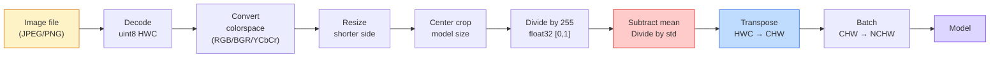
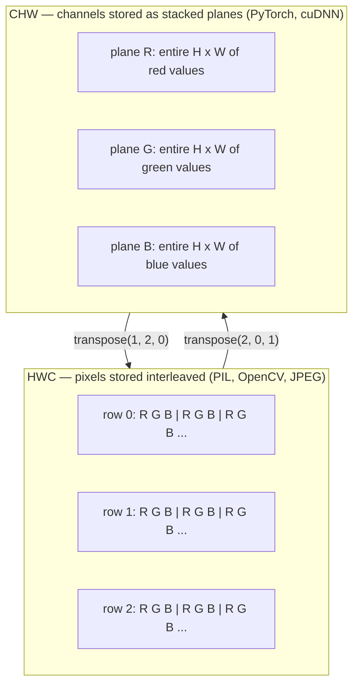

# Image Fundamentals — Pixels, Channels, Color Spaces | 图像基础 — 像素、通道与色彩空间

> An image is a tensor of light samples. Every vision model you will ever use starts from this one fact.

> **【中文解读】** 图像本质上是一组光线采样值的张量（多维数组）。无论是手机拍照、自动驾驶还是 GPT-4V，所有视觉模型都从这个基本事实出发。理解像素、通道和数据格式是避免 "模型吃错数据" 这类隐蔽 bug 的关键。

**Type:** Build | **类型:** 动手
**Languages:** Python | **语言:** Python
**Prerequisites:** Phase 1 Lesson 12 (Tensor Operations), Phase 3 Lesson 11 (Intro to PyTorch) | **前置知识:** Phase 1 Lesson 12（张量运算）、Phase 3 Lesson 11（PyTorch 入门）
**Time:** ~45 minutes | **时间:** ~45 分钟

## Learning Objectives | 学习目标

- Explain how a continuous scene gets discretized into pixels and why sampling/quantization decisions set the ceiling on every downstream model
  中文翻译：解释连续场景如何被离散化为像素，以及为什么采样/量化决策决定了所有下游模型的上限
- Read, slice, and inspect images as NumPy arrays and switch fluently between HWC and CHW layouts
  中文翻译：读取、切片、检查图像的 NumPy 数组表示，并在 HWC 和 CHW 布局之间自如切换
- Convert between RGB, grayscale, HSV, and YCbCr and justify why each color space exists
  中文翻译：在 RGB、灰度、HSV 和 YCbCr 之间转换，并说明每种色彩空间存在的理由
- Apply pixel-level preprocessing (normalize, standardize, resize, channel-first) exactly as pretrained PyTorch vision models expect it
  中文翻译：精确按照预训练 PyTorch 视觉模型的期望做像素级预处理（归一化、标准化、缩放、通道前置）

## The Problem | 问题引入

Every paper you will read, every pretrained weight you will download, every vision API you will call assumes a specific encoding of the input. Pass a `uint8` image where the model wants `float32` and it will still run — and silently produce garbage. Feed BGR to a network trained on RGB and accuracy collapses by ten points. Hand a model channels-last input when it expects channels-first and the first conv layer treats height as a feature channel. None of this throws an error. It just ruins your metrics and you spend a week hunting for a bug that lives in how you loaded the file.

> 你将阅读的每一篇论文、下载的每一个预训练权重、调用的每一个视觉 API，都假定了一种特定的输入编码。把 `uint8` 图像传给需要 `float32` 的模型，它仍然会运行——但静默地产生垃圾结果。把 BGR 喂给在 RGB 上训练的网络，准确率暴跌十个百分点。把通道在最后的输入传给期望通道在最前的模型，第一个卷积层会把高度当作特征通道。这些都不会抛出错误，只会毁掉你的指标，让你花一周时间寻找一个存在于文件加载方式中的 bug。

> **【中文解读】** 这是计算机视觉工程中最常见的 "隐性 bug" 来源：数据格式不匹配。模型不会报错，但结果完全错误。比如把 BGR（OpenCV 默认）当作 RGB（PyTorch 默认）喂给模型，准确率可能暴跌 10 个百分点。在实际 AI 工程中，这类问题可能导致自动驾驶系统误判红绿灯颜色。

A convolution is not complicated once you know what it is sliding over. The hard part is that "an image" means different things to a camera, a JPEG decoder, PIL, OpenCV, torchvision, and a CUDA kernel. Each stack has its own axis order, byte range, and channel convention. A vision engineer who cannot keep these straight ships broken pipelines.

> 一旦你知道卷积在什么上面滑动，它并不复杂。困难的部分在于"图像"对相机、JPEG 解码器、PIL、OpenCV、torchvision 和 CUDA 内核来说意味着不同的东西。每个技术栈都有自己的轴顺序、字节范围和通道约定。一个不能理清这些的视觉工程师只会交付有缺陷的流水线。

This lesson fixes the foundation so the rest of the phase can build on it. By the end you will know what a pixel is, why there are three numbers per pixel instead of one, what "normalize with ImageNet stats" actually does, and how to move between the two or three layouts that every other lesson in this phase will assume.

> 本课夯实基础，以便本阶段其余课程可以在此之上构建。学完后你将知道像素是什么、为什么每个像素有三个数字而不是一个、"用 ImageNet 统计量归一化"到底做了什么，以及如何在其余课程假定的两三种布局之间切换。

> **【拓展：数据标注与质量】** 视觉任务的效果高度依赖标注数据质量。Label Studio、CVAT 是主流标注工具。在工业场景中，主动学习（Active Learning）可以减少标注成本：模型对不确定的样本请求人工标注，确定性的样本自动标注。

## The Concept | 核心概念

### The full preprocessing pipeline at a glance | 预处理流水线全景

Every production vision system is the same sequence of reversible transforms. Get one step wrong and the model sees a different input than it was trained on.

> 每个生产级视觉系统都是相同的可逆变换序列。弄错任何一步，模型看到的输入就与训练时不同。



The two red and blue boxes are where 80% of silent failures live: missing standardization and wrong layout.

> 红色和蓝色两个方框是 80% 静默失败所在之处：缺少标准化和错误的布局。

> **【中文解读】** 80% 的隐性错误集中在两个环节：(1) 没有做标准化（减均值除标准差），(2) 数据布局搞错了（HWC vs CHW）。在实际项目中，按固定顺序组合这些步骤是最可靠的做法。

### A pixel is a sample, not a square | 像素是采样点，不是色块

A camera sensor counts photons that land on a grid of tiny detectors. Each detector integrates light for a fraction of a second and emits a voltage proportional to how many photons hit it. The sensor then discretizes that voltage into an integer. One detector becomes one pixel.

> 相机传感器统计落在微小探测器网格上的光子数量。每个探测器在一小段时间内积分光线，并发射与击中它的光子数成正比的电压。传感器随后将该电压离散化为整数。一个探测器就成为一个像素。

```
Continuous scene                 Sensor grid                     Digital image
(infinite detail)                (H x W detectors)               (H x W integers)

    ~~~~~                        +--+--+--+--+--+                 210 198 180 155 120
   ~   ~   ~                     |  |  |  |  |  |                 205 195 178 152 118
  ~ light ~      ---->           +--+--+--+--+--+     ---->       200 190 175 150 115
   ~~~~~                         |  |  |  |  |  |                 195 185 170 148 112
                                 +--+--+--+--+--+                 188 180 165 145 108
```

Two choices happen at this step and they fix the ceiling on everything downstream:

- **Spatial sampling** decides how many detectors per degree of the scene. Too few, and edges become jagged (aliasing). Too many, and storage and compute explode.
  中文翻译：空间采样决定场景每度有多少探测器。太少则边缘出现锯齿（混叠）。太多则存储和计算量暴增。
- **Intensity quantization** decides how finely the voltage is bucketed. 8 bits gives 256 levels and is standard for display. 10, 12, 16 bits give smoother gradients and matter for medical imaging, HDR, and raw sensor pipelines.
  中文翻译：强度量化决定电压被分得多细。8 位给出 256 个级别，是显示的标准。10、12、16 位提供更平滑的梯度，对医学成像、HDR 和原始传感器流水线很重要。

A pixel is not a coloured square with area. It is a single measurement. When you resize or rotate, you are resampling that measurement grid.

> 像素不是一个有面积的彩色方块。它是一次测量。当你缩放或旋转时，你是在重采样那个测量网格。

> **【中文解读】** 像素不是一个小方块，而是一个采样点——传感器在某个空间位置测得的一个数值。缩放或旋转图像时，实际上是对采样网格进行重采样。这个概念在医学影像（如 CT、MRI）和高动态范围（HDR）成像中尤为重要。

### Why three channels | 为什么是三个通道

One detector counts photons across the whole visible spectrum — that is grayscale. To get colour, the sensor covers the grid with a mosaic of red, green, and blue filters. After demosaicing, every spatial location has three integers: the response of the red-filtered detector, green-filtered, and blue-filtered nearby. Those three integers are a pixel's RGB triplet.

> 一个探测器统计整个可见光谱上的光子——那就是灰度。为了获得颜色，传感器用红、绿、蓝滤光片的马赛克覆盖网格。去马赛克后，每个空间位置有三个整数：红滤光探测器、绿滤光探测器和蓝滤光探测器的响应值。这三个整数就是一个像素的 RGB 三元组。

```
One pixel in memory:

    (R, G, B) = (210, 140, 30)   <- reddish-orange

An H x W RGB image:

    shape (H, W, 3)     stored as   H rows of W pixels of 3 values
                                    each in [0, 255] for uint8
```

Three is not magic. Depth cameras add a Z channel. Satellites add infrared and ultraviolet bands. Medical scans often have one channel (X-ray, CT) or many (hyperspectral). The number of channels is the last axis; conv layers learn to mix across it.

> 三不是魔法。深度摄像头增加 Z 通道。卫星增加红外和紫外波段。医学扫描通常有一个通道（X光、CT）或许多通道（高光谱）。通道数是最后一个轴；卷积层学习跨通道混合。

> **【拓展：多通道图像】** 卫星遥感图像通常有红外、紫外等额外波段（多光谱/高光谱）；医疗 CT 只有一个通道；深度摄像头（如 Kinect、iPhone LiDAR）会增加深度通道 D。这些多通道图像在农业监测、医学诊断和自动驾驶中有广泛应用。

### Two layout conventions: HWC and CHW | 两种布局约定：HWC 和 CHW

Same tensor, two orderings. Every library picks one.

> 同一个张量，两种排序。每个库都选一种。

```
HWC (height, width, channels)           CHW (channels, height, width)

   W ->                                    H ->
  +-----+-----+-----+                     +-----+-----+
H |R G B|R G B|R G B|                   C |R R R R R R|
| +-----+-----+-----+                   | +-----+-----+
v |R G B|R G B|R G B|                   v |G G G G G G|
  +-----+-----+-----+                     +-----+-----+
                                          |B B B B B B|
                                          +-----+-----+

   PIL, OpenCV, matplotlib,              PyTorch, most deep learning
   almost every image file on disk       frameworks, cuDNN kernels
```

CHW exists because convolution kernels slide across H and W. Keeping the channel axis first means each kernel sees a contiguous 2D plane per channel, which vectorizes cleanly. Disk formats keep HWC because that matches how scanlines come out of a sensor.

> CHW 之所以存在，是因为卷积核在 H 和 W 上滑动。保持通道轴在最前面意味着每个核看到的是每个通道的一个连续 2D 平面，可以干净地向量化。磁盘格式保持 HWC 是因为那匹配传感器扫描线的输出方式。

> **【中文解读】** HWC（高×宽×通道）是 PIL、OpenCV 等库的默认格式，也是图像文件在磁盘上的存储方式。CHW（通道×高×宽）是 PyTorch 和 GPU 计算（cuDNN）使用的格式，因为卷积核在 H 和 W 上滑动时，通道前置使得每个核看到的是连续的 2D 平面，计算效率更高。两者之间的转换是每天都要写无数次的操作。

The one-line conversion you will type a thousand times:

> 你会打一千遍的单行转换：

```
img_chw = img_hwc.transpose(2, 0, 1)      # NumPy
img_chw = img_hwc.permute(2, 0, 1)        # PyTorch tensor
```

Memory layout, visualised:

> 内存布局可视化：



### Byte ranges and dtype | 字节范围与数据类型

Three conventions dominate:

> 三种约定占主导地位：

| Convention | dtype | Range | Where you see it |
|------------|-------|-------|------------------|
| Raw | `uint8` | [0, 255] | Files on disk, PIL, OpenCV output |
| Normalized | `float32` | [0.0, 1.0] | After `img.astype('float32') / 255` |
| Standardized | `float32` | roughly [-2, +2] | After subtracting mean and dividing by std |

Convolutional networks were trained on standardized inputs. ImageNet stats `mean=[0.485, 0.456, 0.406]`, `std=[0.229, 0.224, 0.225]` are the arithmetic mean and standard deviation of the three channels over the full ImageNet training set, computed on [0, 1] normalized pixels. Feeding raw `uint8` into a model that expects standardized float is the single most common silent failure in applied vision.

> 卷积网络是在标准化输入上训练的。ImageNet 统计量 `mean=[0.485, 0.456, 0.406]`、`std=[0.229, 0.224, 0.225]` 是整个 ImageNet 训练集三个通道的算术平均值和标准差，在 [0, 1] 归一化像素上计算。把原始 `uint8` 喂给期望标准化浮点数的模型是应用视觉中最常见的静默失败。

> **【中文解读】** 三种数据范围：(1) uint8 [0,255] — 文件/PIL/OpenCV 的原始输出；(2) float32 [0,1] — 归一化后；(3) float32 ≈[-2,+2] — ImageNet 标准化后。把 uint8 直接喂给期望标准化输入的模型，是最常见的 "静默失败"。ImageNet 的均值和标准差是整个训练集统计出来的，几乎所有预训练模型都用这组数值。

### Color spaces and why they exist | 色彩空间及其存在的理由

RGB is the capture format but it is not always the most useful representation for a model.

> RGB 是捕获格式，但并不总是对模型最有用的表示。

```
 RGB               HSV                       YCbCr / YUV

 R red             H hue (angle 0-360)       Y luminance (brightness)
 G green           S saturation (0-1)        Cb chroma blue-yellow
 B blue            V value/brightness (0-1)  Cr chroma red-green

 Linear to         Separates color from      Separates brightness from
 sensor output     brightness. Useful for    color. JPEG and most video
                   color thresholding, UI    codecs compress the chroma
                   sliders, simple filters   channels harder because the
                                             human eye is less sensitive
                                             to chroma detail than to Y.
```

For most modern CNNs you feed RGB. You meet other spaces when:

> 对于大多数现代 CNN，你输入 RGB。你在以下场景会遇到其他色彩空间：

- **HSV** — classical CV code, color-based segmentation, white-balancing.
  中文翻译：经典 CV 代码、基于颜色的分割、白平衡。
- **YCbCr** — reading JPEG internals, video pipelines, super-resolution models that operate on Y only.
  中文翻译：读取 JPEG 内部结构、视频流水线、仅在 Y 通道上操作的超分辨率模型。
- **Grayscale** — OCR, document models, any case where color is nuisance variable rather than signal.
  中文翻译：OCR、文档模型、颜色是干扰变量而非信号的任何场景。

Grayscale from RGB is a weighted sum, not an average, because the human eye is more sensitive to green than to red or blue:

> 从 RGB 转灰度是加权和，不是平均值，因为人眼对绿色比对红色或蓝色更敏感：

```
Y = 0.299 R + 0.587 G + 0.114 B       (ITU-R BT.601, the classic weights)
```

### Aspect ratio, resizing, and interpolation | 宽高比、缩放与插值

Every model has a fixed input size (224x224 for most ImageNet classifiers, 384x384 or 512x512 for modern detectors). Your images rarely match. The three resize choices that matter:

> 每个模型都有固定的输入尺寸（大多数 ImageNet 分类器为 224x224，现代检测器为 384x384 或 512x512）。你的图像很少匹配。三个重要的缩放选择：

- **Resize shorter side, then center crop** — the standard ImageNet recipe. Preserves aspect ratio, throws away a strip of edge pixels.
  中文翻译：缩放短边然后中心裁剪——标准 ImageNet 做法。保持宽高比，丢弃一条边缘像素。
- **Resize and pad** — preserves aspect ratio and every pixel, adds black bars. Standard for detection and OCR.
  中文翻译：缩放并填充——保持宽高比和每个像素，添加黑边。检测和 OCR 的标准做法。
- **Resize directly to target** — stretches the image. Cheap, distorts geometry, fine for many classification tasks.
  中文翻译：直接缩放到目标尺寸——拉伸图像。成本低，扭曲几何形状，但对许多分类任务足够。

The interpolation method decides how intermediate pixels are computed when the new grid does not align with the old one:

> 插值方法决定当新网格与旧网格不对齐时如何计算中间像素：

```
Nearest neighbour     fastest, blocky, only choice for masks/labels
Bilinear              fast, smooth, default for most image resizing
Bicubic               slower, sharper on upscaling
Lanczos               slowest, best quality, used for final display
```

Rule of thumb: bilinear for training, bicubic or lanczos for assets you will look at, nearest for anything containing integer class IDs.

> 经验法则：训练用双线性，展示用双三次或 Lanczos，包含整数类别 ID 的用最近邻。

> **【中文解读】** 缩放时的插值方法选择：最近邻（nearest）速度最快但会产生锯齿，只用于掩码/标签图；双线性（bilinear）又快又平滑，是训练时的默认选择；双三次（bicubic）更慢但放大时更清晰；Lanczos 最慢但质量最好。经验法则：训练用 bilinear，展示用 bicubic/lanczos，标签用 nearest。

> **【拓展：工业部署中的视觉系统】** 在实际工业部署中，视觉模型需要考虑推理延迟、模型大小、边缘设备适配等问题。TensorRT、ONNX Runtime、OpenVINO 是常用的推理加速工具。自动驾驶系统（如 Tesla FSD）通常在车载芯片上实时运行多个视觉模型。
```figure
conv-output-size
```

## Build It | 动手实践

### Step 1: Build an image tensor and inspect its shape | 第1步：构建图像张量并检查其形状

Start with a deterministic synthetic image so the first lab runs offline with only NumPy. File decoding is a separate boundary: once a JPEG or PNG decoder returns RGB bytes, every tensor operation below is the same.

> 从一个确定性的合成图像开始，让第一个实验只需 NumPy 就能离线运行。文件解码是另一条边界：一旦 JPEG 或 PNG 解码器返回了 RGB 字节，下面的每个张量操作都是相同的。

```python
import numpy as np

def synthetic_rgb(h=128, w=192, seed=0):
    rng = np.random.default_rng(seed)
    yy, xx = np.meshgrid(np.linspace(0, 1, h), np.linspace(0, 1, w), indexing="ij")
    r = (np.sin(xx * 6) * 0.5 + 0.5) * 255
    g = yy * 255
    b = (1 - yy) * xx * 255
    rgb = np.stack([r, g, b], axis=-1) + rng.normal(0, 6, (h, w, 3))
    return np.clip(rgb, 0, 255).astype(np.uint8)

arr = synthetic_rgb()

print(f"type:   {type(arr).__name__}")
print(f"dtype:  {arr.dtype}")
print(f"shape:  {arr.shape}     # (H, W, C)")
print(f"min:    {arr.min()}")
print(f"max:    {arr.max()}")
print(f"pixel at (0, 0): {arr[0, 0]}")
```

Expected output: `shape: (H, W, 3)`, `dtype: uint8`, range `[0, 255]`. That is the canonical decoded representation whether the bytes came from a camera, an image decoder, or this synthetic generator.

> 预期输出：`shape: (H, W, 3)`、`dtype: uint8`、范围 `[0, 255]`。这就是解码后的规范表示，无论字节来自相机、图像解码器还是这个合成生成器。

### Step 2: Split channels and re-order layout | 第2步：分离通道并重排布局

Pull out R, G, B separately, then convert from HWC to CHW for PyTorch.

> 分别提取 R、G、B，然后将 HWC 转换为 CHW 以供 PyTorch 使用。

```python
R = arr[:, :, 0]
G = arr[:, :, 1]
B = arr[:, :, 2]
print(f"R shape: {R.shape}, mean: {R.mean():.1f}")
print(f"G shape: {G.shape}, mean: {G.mean():.1f}")
print(f"B shape: {B.shape}, mean: {B.mean():.1f}")

arr_chw = arr.transpose(2, 0, 1)
print(f"\nHWC shape: {arr.shape}")
print(f"CHW shape: {arr_chw.shape}")
```

Three grayscale planes, one per channel. CHW just reorders the axes; no data copy is strictly required when the memory layout allows it.

> 三个灰度平面，每通道一个。CHW 只是重新排序轴；当内存布局允许时，并不严格要求复制数据。

### Step 3: Grayscale and HSV conversions | 第3步：灰度与 HSV 转换

Weighted-sum grayscale, then a manual RGB-to-HSV.

> 加权求和灰度，然后手动实现 RGB 转 HSV。

```python
def rgb_to_grayscale(rgb):
    weights = np.array([0.299, 0.587, 0.114], dtype=np.float32)
    return (rgb.astype(np.float32) @ weights).astype(np.uint8)

def rgb_to_hsv(rgb):
    rgb_f = rgb.astype(np.float32) / 255.0
    r, g, b = rgb_f[..., 0], rgb_f[..., 1], rgb_f[..., 2]
    cmax = np.max(rgb_f, axis=-1)
    cmin = np.min(rgb_f, axis=-1)
    delta = cmax - cmin

    h = np.zeros_like(cmax)
    mask = delta > 0
    argmax = np.argmax(rgb_f, axis=-1)
    rmax = mask & (argmax == 0)
    gmax = mask & (argmax == 1)
    bmax = mask & (argmax == 2)
    h[rmax] = ((g[rmax] - b[rmax]) / delta[rmax]) % 6
    h[gmax] = ((b[gmax] - r[gmax]) / delta[gmax]) + 2
    h[bmax] = ((r[bmax] - g[bmax]) / delta[bmax]) + 4
    h = h * 60.0

    s = np.divide(delta, cmax, out=np.zeros_like(delta), where=cmax > 0)
    v = cmax
    return np.stack([h, s, v], axis=-1)

gray = rgb_to_grayscale(arr)
hsv = rgb_to_hsv(arr)
print(f"gray shape: {gray.shape}, range: [{gray.min()}, {gray.max()}]")
print(f"hsv   shape: {hsv.shape}")
print(f"hue range: [{hsv[..., 0].min():.1f}, {hsv[..., 0].max():.1f}] degrees")
print(f"sat range: [{hsv[..., 1].min():.2f}, {hsv[..., 1].max():.2f}]")
print(f"val range: [{hsv[..., 2].min():.2f}, {hsv[..., 2].max():.2f}]")
```

Hue comes out in degrees, saturation and value in [0, 1]. That matches the OpenCV `hsv_full` convention.

> 色相以度数输出，饱和度和明度在 [0, 1] 范围内。这与 OpenCV 的 `hsv_full` 约定一致。

### Step 4: Normalize, standardize, and reverse it | 第4步：归一化、标准化与逆变换

Go from raw bytes to the exact tensor a pretrained ImageNet model expects, then back.

> 从原始字节到预训练 ImageNet 模型期望的精确张量，再返回。

```python
mean = np.array([0.485, 0.456, 0.406], dtype=np.float32)
std = np.array([0.229, 0.224, 0.225], dtype=np.float32)

def preprocess_imagenet(rgb_uint8):
    x = rgb_uint8.astype(np.float32) / 255.0
    x = (x - mean) / std
    x = x.transpose(2, 0, 1)
    return x

def deprocess_imagenet(chw_float32):
    x = chw_float32.transpose(1, 2, 0)
    x = x * std + mean
    x = np.clip(x * 255.0, 0, 255).astype(np.uint8)
    return x

x = preprocess_imagenet(arr)
print(f"preprocessed shape: {x.shape}     # (C, H, W)")
print(f"preprocessed dtype: {x.dtype}")
print(f"preprocessed mean per channel:  {x.mean(axis=(1, 2)).round(3)}")
print(f"preprocessed std  per channel:  {x.std(axis=(1, 2)).round(3)}")

roundtrip = deprocess_imagenet(x)
max_diff = np.abs(roundtrip.astype(int) - arr.astype(int)).max()
print(f"roundtrip max pixel diff: {max_diff}    # should be 0 or 1")
```

Per-channel mean should be close to zero, std close to one. The preprocess/deprocess pair is exactly what every torchvision `transforms.Normalize` call is doing under the hood.

> 每个通道的均值应接近零，标准差接近一。预处理/反处理对正是每个 torchvision `transforms.Normalize` 调用在底层所做的事情。

### Step 5: Resize from scratch | 第5步：从零实现缩放

Nearest neighbor rounds each output coordinate to one source pixel. Bilinear interpolation finds the four surrounding pixels and blends them by distance. Both implementations below use endpoint-aligned coordinates so the first and last source pixels stay fixed.

> 最近邻把每个输出坐标四舍五入到一个源像素。双线性插值找到周围四个像素并按距离混合。下面两个实现都使用端点对齐的坐标，使第一个和最后一个源像素保持不动。

```python
def resize_coordinates(source_length, target_length):
    if target_length == 1:
        return np.zeros(1, dtype=np.float32)
    return np.linspace(0, source_length - 1, target_length, dtype=np.float32)

def nearest_resize(image, target_height, target_width):
    y = np.rint(resize_coordinates(image.shape[0], target_height)).astype(int)
    x = np.rint(resize_coordinates(image.shape[1], target_width)).astype(int)
    return image[y[:, None], x[None, :]]

def bilinear_resize(image, target_height, target_width):
    y = resize_coordinates(image.shape[0], target_height)
    x = resize_coordinates(image.shape[1], target_width)
    y0 = np.floor(y).astype(int)
    x0 = np.floor(x).astype(int)
    y1 = np.minimum(y0 + 1, image.shape[0] - 1)
    x1 = np.minimum(x0 + 1, image.shape[1] - 1)
    wy = (y - y0)[:, None, None]
    wx = (x - x0)[None, :, None]

    source = image.astype(np.float32)
    top = source[y0[:, None], x0[None, :]] * (1 - wx)
    top += source[y0[:, None], x1[None, :]] * wx
    bottom = source[y1[:, None], x0[None, :]] * (1 - wx)
    bottom += source[y1[:, None], x1[None, :]] * wx
    result = top * (1 - wy) + bottom * wy
    return np.clip(np.rint(result), 0, 255).astype(image.dtype)

target_height = arr.shape[0] * 3
target_width = arr.shape[1] * 3
nearest = nearest_resize(arr, target_height, target_width)
bilinear = bilinear_resize(arr, target_height, target_width)

def local_roughness(x):
    gy = np.diff(x.astype(float), axis=0)
    gx = np.diff(x.astype(float), axis=1)
    return float(np.abs(gy).mean() + np.abs(gx).mean())

for name, out in [("nearest", nearest), ("bilinear", bilinear)]:
    print(f"{name:>8}  shape={out.shape}  roughness={local_roughness(out):6.2f}")
```

Nearest scores highest on roughness because it keeps hard edges. Bilinear is smoother because every new pixel blends two positions on each axis. The runnable companion extends the same separable idea to four neighbors per axis with a Catmull-Rom cubic kernel, then prints all three results without an image library.

> 最近邻的粗糙度得分最高，因为它保留了硬边缘。双线性更平滑，因为每个新像素都在每个轴上混合两个位置。可运行的配套代码把同样的可分离思路扩展到每轴四个邻居（Catmull-Rom 三次核），然后在不借助图像库的情况下打印全部三种结果。

> **【中文解读】** 新版第 5 步从"调 PIL 的 resize"改为"从零实现最近邻与双线性"——这是 Build It 精神的回归：先用纯 NumPy 理解插值的坐标映射（`np.linspace` 端点对齐 + 索引 gather），再去看库的封装。配套的 `code/main.py` 还实现了 Catmull-Rom 双三次核，用同一套可分离权重打印 nearest/bilinear/bicubic 三种结果对比。

## Use It | 实际应用

PyTorch performs the same operations on batched, device-aware tensors. The code below resizes the shorter side, takes a center crop, standardizes each channel, and produces the NCHW tensor a pretrained model expects.

> PyTorch 在批量化的、感知设备的张量上执行相同的操作。下面的代码缩放短边、中心裁剪、逐通道标准化，并产出预训练模型期望的 NCHW 张量。

```python
import torch
import torch.nn.functional as F

image_hwc = torch.from_numpy(synthetic_rgb(256, 320))
batch = image_hwc.permute(2, 0, 1).unsqueeze(0).float() / 255.0

height, width = batch.shape[-2:]
scale = 256 / min(height, width)
resized_height = round(height * scale)
resized_width = round(width * scale)
batch = F.interpolate(
    batch,
    size=(resized_height, resized_width),
    mode="bilinear",
    align_corners=False,
    antialias=True,
)

top = (resized_height - 224) // 2
left = (resized_width - 224) // 2
batch = batch[:, :, top:top + 224, left:left + 224]

mean = torch.tensor([0.485, 0.456, 0.406]).view(1, 3, 1, 1)
std = torch.tensor([0.229, 0.224, 0.225]).view(1, 3, 1, 1)
batch = (batch - mean) / std

print(f"tensor dtype: {batch.dtype}")
print(f"batched shape: {tuple(batch.shape)}")
print(f"per-channel mean: {batch.mean(dim=(0, 2, 3)).tolist()}")
print(f"per-channel std:  {batch.std(dim=(0, 2, 3)).tolist()}")
```

Four steps, in this exact order: convert bytes to float and swap HWC to NCHW, resize the shorter side to 256, take a 224x224 center crop, then subtract the ImageNet mean and divide by its standard deviation. Reversing that order silently changes what reaches the model.

> 四个步骤，按此精确顺序：把字节转成浮点并将 HWC 换成 NCHW，把短边缩放到 256，取 224x224 的中心裁剪，然后减去 ImageNet 均值并除以其标准差。颠倒这个顺序会静默地改变模型接收到的内容。

> **【中文解读】** 新版"用框架实现"从 `torchvision.transforms` 换成了裸 `torch` + `torch.nn.functional`：permute→unsqueeze 换布局、`F.interpolate` 缩放短边（注意 `antialias=True` 与 `align_corners=False` 这两个生产级默认值）、张量切片做中心裁剪、广播减均值除标准差。这让你看到 `transforms.Compose` 之下每一步的真实形状变化——batch 维（N）始终在第 0 轴。

## Ship It | 交付产出

This lesson produces:

> 本课产出：

- `outputs/prompt-vision-preprocessing-audit.md` — a prompt that turns any model card or dataset card into a checklist of the exact preprocessing invariants a team must honour.
  中文翻译：`outputs/prompt-vision-preprocessing-audit.md` —— 一个把任意模型卡或数据集卡转换成团队必须遵守的预处理不变量清单的提示词。
- `outputs/skill-image-tensor-inspector.md` — a skill that, given any image-shaped tensor or array, reports dtype, layout, range, and whether it looks raw, normalized, or standardized.
  中文翻译：`outputs/skill-image-tensor-inspector.md` —— 一个技能：给定任意图像形状的张量或数组，报告其 dtype、布局、值范围，以及它看起来是原始的、归一化的还是标准化的。

## Exercises | 练习题

> **【中文解读】** 练习题按照 Easy/Medium/Hard 三个难度递进。建议至少完成 Medium 级别的题目，Hard 级别适合深入研究或面试准备。

1. **(Easy)** Create a 2x2 RGB `uint8` array with four distinct colors. Convert HWC to CHW and back, print both shapes, and prove the round trip preserves every value.
   中文翻译：创建一个含四种不同颜色的 2x2 RGB `uint8` 数组。在 HWC 与 CHW 之间来回转换，打印两个形状，并证明往返转换保住了每个值。
2. **(Medium)** Write `standardize(img, mean, std)` and its inverse that together pass a `roundtrip_max_diff <= 1` test on any uint8 image. Your functions must work on a single image in HWC and on a batch in NCHW with the same call.
   中文翻译：编写 `standardize(img, mean, std)` 及其逆函数，要求在任意 uint8 图像上通过 `roundtrip_max_diff <= 1` 测试，且同一调用既支持单张图（HWC）也支持批量（NCHW）。
3. **(Hard)** Take a 3-channel ImageNet-standardized tensor and run it through a 1x1 conv that learns a weighted mixture of RGB into a single grayscale channel. Initialize the weights to `[0.299, 0.587, 0.114]`, freeze them, and verify the output matches your manual `rgb_to_grayscale` to within floating-point error. What other classical color-space transforms can be written as 1x1 convolutions?
   中文翻译：取一个三通道 ImageNet 标准化张量，送入一个把 RGB 加权混合成单通道灰度的 1x1 卷积。把权重初始化为 `[0.299, 0.587, 0.114]` 并冻结，验证输出与手动 `rgb_to_grayscale` 的差异在浮点误差以内。思考：还有哪些经典色彩空间变换可以写成 1x1 卷积？

## Key Terms | 关键术语

| Term | What people say | What it actually means |
|------|----------------|----------------------|
| Pixel | "A coloured square" | One sample of light intensity at one grid location — three numbers for colour, one for grayscale |
| Channel | "The colour" | One of the parallel spatial grids stacked into an image tensor; last axis in HWC, first in CHW |
| HWC / CHW | "The shape" | Axis orderings for an image tensor; disk and PIL use HWC, PyTorch and cuDNN use CHW |
| Normalize | "Scale the image" | Divide by 255 so pixels live in [0, 1] — necessary but not sufficient |
| Standardize | "Zero-center" | Subtract mean and divide by std per channel so the input distribution matches what the model was trained on |
| Grayscale conversion | "Average the channels" | A weighted sum with coefficients 0.299/0.587/0.114 that matches human luminance perception |
| Interpolation | "How resize picks pixels" | The rule that decides output values when the new grid does not align with the old one — nearest for labels, bilinear for training, bicubic for display |
| Aspect ratio | "Width over height" | The ratio that distinguishes "resize and pad" from "resize and stretch" |

> 术语对照：Pixel=像素、Channel=通道、Normalize=归一化、Standardize=标准化、Grayscale conversion=灰度转换、Interpolation=插值、Aspect ratio=宽高比。完整中文释义见 zh.md 的术语表。

## Further Reading | 延伸阅读

- [Charles Poynton — A Guided Tour of Color Space](https://poynton.ca/PDFs/Guided_tour.pdf) — the clearest technical treatment of why there are so many color spaces and when each one matters
  中文翻译：Charles Poynton《色彩空间导览》——解释为什么有这么多色彩空间、各自何时重要的最清晰技术论述。
- [PyTorch Vision Transforms Docs](https://pytorch.org/vision/stable/transforms.html) — the full pipeline of transforms you will actually compose in production
  中文翻译：PyTorch Vision Transforms 文档——生产环境中你真正要组合的完整变换流水线。
- [How JPEG Works (Colt McAnlis)](https://www.youtube.com/watch?v=F1kYBnY6mwg) — a sharp visual tour of chroma subsampling, DCT, and why JPEG encodes YCbCr rather than RGB
  中文翻译：《JPEG 是如何工作的》（视频）——色度子采样、DCT 以及 JPEG 为何编码 YCbCr 而非 RGB 的直观讲解。
- [ImageNet Preprocessing Conventions (torchvision models)](https://pytorch.org/vision/stable/models.html) — the source of truth for `mean=[0.485, 0.456, 0.406]` and why every model in the zoo expects it
  中文翻译：torchvision 模型的 ImageNet 预处理约定——`mean=[0.485, 0.456, 0.406]` 的权威来源，以及为什么整个模型库都用它。
