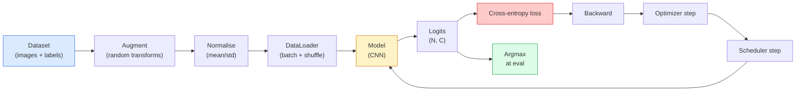

# Image Classification | 图像分类

> A classifier is a function from pixels to a probability distribution over classes. Everything else is plumbing.

> **【中文解读】** 图像分类器本质上是一个从像素到类别概率分布的函数。检测（分类区域）、分割（分类像素）、检索（按类别相似度排序）归根结底都是分类。掌握分类的完整流水线（数据集、增强、训练、评估）是所有视觉任务的基础。

**Type:** Build
**Languages:** Python
**Prerequisites:** Phase 2 Lesson 09 (Model Evaluation), Phase 3 Lesson 10 (Mini Framework), Phase 4 Lesson 03 (CNNs)
**Time:** ~75 minutes

## Learning Objectives | 学习目标

- Build an end-to-end image classification pipeline on CIFAR-10: dataset, augmentation, model, training loop, evaluation
- Explain the role of each component (dataloader, loss, optimizer, scheduler, augmentation) and predict how breaking any one of them manifests in the loss curve
- Implement mixup, cutout, and label smoothing from scratch and justify when each is worth adding
- Read a confusion matrix and a per-class precision/recall table to diagnose dataset and model failures beyond aggregate accuracy

> **【中文解读】** 学习目标列出了完成本课后应该掌握的核心能力。建议在开始学习前先浏览目标，学完后对照检查是否达成。


## The Problem | 问题引入

Every vision task that ships reduces to image classification at some level. Detection classifies regions. Segmentation classifies pixels. Retrieval ranks by similarity to class centroids. Getting classification right — the dataset loop, the augmentation policy, the loss, the evaluation — is the skill that transfers to every other task in the phase.

> **【中文解读】** 所有实际部署的视觉任务本质上都可以归结为图像分类：目标检测是"对区域分类"，语义分割是"对像素分类"，图像检索是"按类别中心相似度排序"。把分类流水线的每个环节搞清楚，是掌握本阶段所有后续课程的关键。

Most classification bugs are not in the model. They live in the pipeline: a broken normalisation, an unshuffled training set, augmentation that distorts labels, a validation split contaminated by training data, a learning rate that silently diverges after epoch 30. A CNN that would hit 93% on CIFAR-10 with a correct setup commonly scores 70-75% with a broken one, and the loss curve looks plausible the whole time.

This lesson wires the entire pipeline by hand so every part is inspectable. You will not use anything from `torchvision.datasets` that could hide a bug.

> **【中文解读】** 大多数分类 bug 不在模型本身，而在流水线中：归一化搞错、训练集没打乱、增强破坏了标签、验证集被训练数据污染、学习率悄然发散。正确配置能达 93% 的模型，错误配置只能到 70-75%，而且 loss 曲线看起来还挺正常——这才是最可怕的地方。本课从头搭建完整流水线，每个环节都可直接检查。

## The Concept | 核心概念

### The classification pipeline



Every line in this loop is where a bug can live. Cross-entropy takes raw logits, not softmax outputs, so any `model(x).softmax()` before the loss quietly computes the wrong gradient.

> **【中文解读】** 流水线中每一行都可能藏有 bug。交叉熵接收的是原始 logits（未经 softmax 的值），如果先做了 softmax 再传入 loss 函数，梯度计算就完全错了——但不会报错。 Augmentations apply to inputs only, not labels — except for mixup, which mixes both. `optimizer.zero_grad()` must happen once per step; skipping it accumulates gradients and looks like a wildly unstable learning rate. Each of those bugs flattens the learning curve without throwing an error.

### Cross-entropy, logits, and softmax

A classifier produces `C` numbers per image called logits. Applying softmax converts them into a probability distribution:

```
softmax(z)_i = exp(z_i) / sum_j exp(z_j)
```

Cross-entropy measures the negative log probability of the correct class:

```
CE(z, y) = -log( softmax(z)_y )
        = -z_y + log( sum_j exp(z_j) )
```

The right-hand form is the numerically stable one (log-sum-exp). PyTorch's `nn.CrossEntropyLoss` fuses softmax + NLL in one op and takes raw logits directly. Applying softmax yourself first is almost always a bug — you compute log(softmax(softmax(z))), a meaningless quantity.

> **【中文解读】** PyTorch 的 `nn.CrossEntropyLoss` 内部已经融合了 softmax + 负对数似然，直接传入原始 logits 即可。如果你先手动调了 softmax 再传入 loss，相当于做了两次 softmax，梯度计算完全错误。

### Why augmentation works

A CNN has inductive bias for translation (from weight sharing) but no built-in invariance to crops, flips, colour jitter, or occlusion. The only way to teach it those invariances is to show it pixels that exercise them. Every random transform during training is a way of saying: "these two images have the same label; learn the features that ignore the difference."

> **【拓展：数据增强与模型泛化】** 数据增强是现代 AI 最强大的免费正则化手段。在 ResNet、EfficientNet 等经典模型训练中，增强策略的好坏直接影响 3-5% 的准确率。Google 的 RandAugment 和 AutoAugment 用搜索方法自动选择最优增强组合，已在 ImageNet 上被广泛验证。

```
Original crop:  "dog facing left"
Flip:           "dog facing right"       <- same label, different pixels
Rotate(+15):    "dog, slight tilt"
Colour jitter:  "dog in warmer light"
RandomErasing:  "dog with patch missing"
```

The rule: augmentation must preserve the label. Cutout and rotation on a digit can flip "6" into "9"; for that dataset you use smaller rotation ranges and pick augmentations that respect digit-specific invariances.

### Mixup and cutmix

Ordinary augmentation transforms pixels but keeps labels one-hot. **Mixup** and **cutmix** break that by interpolating both.

```
Mixup:
  lambda ~ Beta(a, a)
  x = lambda * x_i + (1 - lambda) * x_j
  y = lambda * y_i + (1 - lambda) * y_j

Cutmix:
  paste a random rectangle of x_j into x_i
  y = area-weighted mix of y_i and y_j
```

Why it helps: the model stops memorising spiky one-hot targets and learns to interpolate between classes. Training loss goes up, test accuracy goes up. It is the single cheapest robustness upgrade for any classifier.

> **【拓展：Mixup 在大模型中的应用】** Mixup 的思想已扩展到 NLP 领域——对文本嵌入进行插值混合。在 ChatGPT 等 LLM 的训练中，标签平滑和软标签技术也被广泛使用，帮助模型产生更校准的概率输出，减少过度自信。

### Label smoothing

A cousin of mixup. Instead of training against `[0, 0, 1, 0, 0]`, train against `[eps/C, eps/C, 1-eps, eps/C, eps/C]` for a small `eps` like 0.1. Stops the model from producing arbitrarily sharp logits and improves calibration at almost no cost. Built into `nn.CrossEntropyLoss(label_smoothing=0.1)` since PyTorch 1.10.

### Evaluation beyond accuracy

Aggregate accuracy hides imbalance. A 90-10 binary classifier that always predicts the majority class scores 90%. The tools that actually tell you what is happening:

- **Per-class accuracy** — one number per class; immediately surfaces underperforming categories.
- **Confusion matrix** — C x C grid with row i col j = count of true class i predicted as class j; the diagonal is correct, the off-diagonals are where your model lives.
- **Top-1 / Top-5** — whether the correct class is in the top 1 or top 5 predictions; Top-5 matters for ImageNet because classes like "Norwich terrier" vs "Norfolk terrier" are genuinely ambiguous.
- **Calibration (ECE)** — does a 0.8 confidence prediction get it right 80% of the time? Modern networks are systematically over-confident; fix with temperature scaling or label smoothing.

> **【拓展：工业部署中的视觉系统】** 在实际工业部署中，视觉模型需要考虑推理延迟、模型大小、边缘设备适配等问题。TensorRT、ONNX Runtime、OpenVINO 是常用的推理加速工具。自动驾驶系统（如 Tesla FSD）通常在车载芯片上实时运行多个视觉模型。


## Build It | 动手实现

> **【中文解读】** 本节通过代码从零实现核心算法。这种 "from scratch" 的方式能帮助理解框架背后的原理，遇到问题时不会被黑盒困住。


### Step 1: A deterministic synthetic dataset

CIFAR-10 lives on disk. To make this lesson reproducible and fast we build a synthetic dataset that looks like CIFAR — 32x32 RGB images with class-specific structure the model must learn. The exact same pipeline works unchanged on real CIFAR-10.

```python
import numpy as np
import torch
from torch.utils.data import Dataset


def synthetic_cifar(num_per_class=1000, num_classes=10, seed=0):
    rng = np.random.default_rng(seed)
    X = []
    Y = []
    for c in range(num_classes):
        centre = rng.uniform(0, 1, (3,))
        freq = 2 + c
        for _ in range(num_per_class):
            yy, xx = np.meshgrid(np.linspace(0, 1, 32), np.linspace(0, 1, 32), indexing="ij")
            r = np.sin(xx * freq) * 0.5 + centre[0]
            g = np.cos(yy * freq) * 0.5 + centre[1]
            b = (xx + yy) * 0.5 * centre[2]
            img = np.stack([r, g, b], axis=-1)
            img += rng.normal(0, 0.08, img.shape)
            img = np.clip(img, 0, 1)
            X.append(img.astype(np.float32))
            Y.append(c)
    X = np.stack(X)
    Y = np.array(Y)
    idx = rng.permutation(len(X))
    return X[idx], Y[idx]


class ArrayDataset(Dataset):
    def __init__(self, X, Y, transform=None):
        self.X = X
        self.Y = Y
        self.transform = transform

    def __len__(self):
        return len(self.X)

    def __getitem__(self, i):
        img = self.X[i]
        if self.transform is not None:
            img = self.transform(img)
        img = torch.from_numpy(img).permute(2, 0, 1)
        return img, int(self.Y[i])
```

Each class gets its own colour palette and frequency pattern, plus Gaussian noise to force the model to learn the signal rather than memorise pixels. Ten classes, one thousand images each, permuted.

### Step 2: Normalisation and augmentation

The two transforms that every vision pipeline has.

```python
def standardize(mean, std):
    mean = np.array(mean, dtype=np.float32)
    std = np.array(std, dtype=np.float32)
    def _fn(img):
        return (img - mean) / std
    return _fn


def random_hflip(p=0.5):
    def _fn(img):
        if np.random.random() < p:
            return img[:, ::-1, :].copy()
        return img
    return _fn


def random_crop(pad=4):
    def _fn(img):
        h, w = img.shape[:2]
        padded = np.pad(img, ((pad, pad), (pad, pad), (0, 0)), mode="reflect")
        y = np.random.randint(0, 2 * pad)
        x = np.random.randint(0, 2 * pad)
        return padded[y:y + h, x:x + w, :]
    return _fn


def compose(*fns):
    def _fn(img):
        for fn in fns:
            img = fn(img)
        return img
    return _fn
```

Reflect-pad before crop, not zero-pad, because black borders are a signal the model would learn to ignore in a non-useful way.

### Step 3: Mixup

Mixes two images and two labels inside the training step. Implemented as a batch transform so it lives next to the forward pass rather than inside the dataset.

```python
def mixup_batch(x, y, num_classes, alpha=0.2):
    if alpha <= 0:
        return x, torch.nn.functional.one_hot(y, num_classes).float()
    lam = float(np.random.beta(alpha, alpha))
    idx = torch.randperm(x.size(0), device=x.device)
    x_mixed = lam * x + (1 - lam) * x[idx]
    y_onehot = torch.nn.functional.one_hot(y, num_classes).float()
    y_mixed = lam * y_onehot + (1 - lam) * y_onehot[idx]
    return x_mixed, y_mixed


def soft_cross_entropy(logits, soft_targets):
    log_probs = torch.log_softmax(logits, dim=-1)
    return -(soft_targets * log_probs).sum(dim=-1).mean()
```

`soft_cross_entropy` is cross-entropy against a soft-label distribution. It reduces to the usual one-hot case when the target is exactly one-hot.

### Step 4: The training loop

The complete recipe: one pass over the data, gradients once per batch, scheduler stepped once per epoch.

```python
import torch
import torch.nn as nn
from torch.utils.data import DataLoader
from torch.optim import SGD
from torch.optim.lr_scheduler import CosineAnnealingLR

def train_one_epoch(model, loader, optimizer, device, num_classes, use_mixup=True):
    model.train()
    total, correct, loss_sum = 0, 0, 0.0
    for x, y in loader:
        x, y = x.to(device), y.to(device)
        if use_mixup:
            x_m, y_soft = mixup_batch(x, y, num_classes)
            logits = model(x_m)
            loss = soft_cross_entropy(logits, y_soft)
        else:
            logits = model(x)
            loss = nn.functional.cross_entropy(logits, y, label_smoothing=0.1)
        optimizer.zero_grad()
        loss.backward()
        optimizer.step()
        loss_sum += loss.item() * x.size(0)
        total += x.size(0)
        # Training accuracy vs the un-mixed labels `y` is only an approximation
        # when mixup is on (the model saw soft targets, not y). Treat it as a
        # rough progress signal; rely on val accuracy for real performance.
        with torch.no_grad():
            pred = logits.argmax(dim=-1)
            correct += (pred == y).sum().item()
    return loss_sum / total, correct / total


@torch.no_grad()
def evaluate(model, loader, device, num_classes):
    model.eval()
    total, correct = 0, 0
    loss_sum = 0.0
    cm = torch.zeros(num_classes, num_classes, dtype=torch.long)
    for x, y in loader:
        x, y = x.to(device), y.to(device)
        logits = model(x)
        loss = nn.functional.cross_entropy(logits, y)
        pred = logits.argmax(dim=-1)
        for t, p in zip(y.cpu(), pred.cpu()):
            cm[t, p] += 1
        loss_sum += loss.item() * x.size(0)
        total += x.size(0)
        correct += (pred == y).sum().item()
    return loss_sum / total, correct / total, cm
```

Five invariants you check every time you write a training loop:

1. `model.train()` before training, `model.eval()` before evaluation — flips dropout and batchnorm behaviour.
2. `.zero_grad()` before `.backward()`.
3. `.item()` when accumulating metrics so nothing keeps the computation graph alive.
4. `@torch.no_grad()` during evaluation — saves memory and time, prevents subtle accidents.
5. Argmax against raw logits, not softmax — same result, one fewer op.

### Step 5: Put it together

Use the `TinyResNet` from the previous lesson, train for a few epochs, evaluate.

```python
from main import synthetic_cifar, ArrayDataset
from main import standardize, random_hflip, random_crop, compose
from main import mixup_batch, soft_cross_entropy
from main import train_one_epoch, evaluate
# TinyResNet comes from the previous lesson (03-cnns-lenet-to-resnet).
# Adjust the import path to wherever you stored the previous lesson's code.
from cnns_lenet_to_resnet import TinyResNet  # example placeholder

X, Y = synthetic_cifar(num_per_class=500)
split = int(0.9 * len(X))
X_train, Y_train = X[:split], Y[:split]
X_val, Y_val = X[split:], Y[split:]

mean = [0.5, 0.5, 0.5]
std = [0.25, 0.25, 0.25]
train_tf = compose(random_hflip(), random_crop(pad=4), standardize(mean, std))
eval_tf = standardize(mean, std)

train_ds = ArrayDataset(X_train, Y_train, transform=train_tf)
val_ds = ArrayDataset(X_val, Y_val, transform=eval_tf)

train_loader = DataLoader(train_ds, batch_size=128, shuffle=True, num_workers=0)
val_loader = DataLoader(val_ds, batch_size=256, shuffle=False, num_workers=0)

device = "cuda" if torch.cuda.is_available() else "cpu"
model = TinyResNet(num_classes=10).to(device)
optimizer = SGD(model.parameters(), lr=0.1, momentum=0.9, weight_decay=5e-4, nesterov=True)
scheduler = CosineAnnealingLR(optimizer, T_max=10)

for epoch in range(10):
    tr_loss, tr_acc = train_one_epoch(model, train_loader, optimizer, device, 10, use_mixup=True)
    va_loss, va_acc, _ = evaluate(model, val_loader, device, 10)
    scheduler.step()
    print(f"epoch {epoch:2d}  lr {scheduler.get_last_lr()[0]:.4f}  "
          f"train {tr_loss:.3f}/{tr_acc:.3f}  val {va_loss:.3f}/{va_acc:.3f}")
```

On the synthetic dataset, this gets to near-perfect validation accuracy within five epochs, which is the point: the pipeline is correct, the model can learn what is learnable. Swap the dataset for real CIFAR-10 and the same loop trains to ~90% without changes.

### Step 6: Read the confusion matrix

Accuracy alone never tells you where the model is failing. The confusion matrix does.

```python
def print_confusion(cm, labels=None):
    c = cm.shape[0]
    labels = labels or [str(i) for i in range(c)]
    print(f"{'':>6}" + "".join(f"{l:>5}" for l in labels))
    for i in range(c):
        row = cm[i].tolist()
        print(f"{labels[i]:>6}" + "".join(f"{v:>5}" for v in row))
    print()
    tp = cm.diag().float()
    fp = cm.sum(dim=0).float() - tp
    fn = cm.sum(dim=1).float() - tp
    prec = tp / (tp + fp).clamp_min(1)
    rec = tp / (tp + fn).clamp_min(1)
    f1 = 2 * prec * rec / (prec + rec).clamp_min(1e-9)
    for i in range(c):
        print(f"{labels[i]:>6}  prec {prec[i]:.3f}  rec {rec[i]:.3f}  f1 {f1[i]:.3f}")

_, _, cm = evaluate(model, val_loader, device, 10)
print_confusion(cm)
```

Rows are true classes, columns are predictions. A cluster of off-diagonal counts between classes 3 and 5 means the model confuses those two and gives you a starting point for targeted data collection or a class-specific augmentation.


## Use It | 用框架实现

> **【中文解读】** 本节展示如何用成熟框架（如 PyTorch、HuggingFace 等）快速应用该技术。在实际项目中，优先使用经过验证的框架实现，可以减少 bug 并提高开发效率。


`torchvision` wraps everything above into idiomatic components. For real CIFAR-10 the full pipeline is four lines plus a training loop.

```python
from torchvision.datasets import CIFAR10
from torchvision.transforms import Compose, RandomCrop, RandomHorizontalFlip, ToTensor, Normalize

mean = (0.4914, 0.4822, 0.4465)
std = (0.2470, 0.2435, 0.2616)
train_tf = Compose([
    RandomCrop(32, padding=4, padding_mode="reflect"),
    RandomHorizontalFlip(),
    ToTensor(),
    Normalize(mean, std),
])
eval_tf = Compose([ToTensor(), Normalize(mean, std)])

train_ds = CIFAR10(root="./data", train=True,  download=True, transform=train_tf)
val_ds   = CIFAR10(root="./data", train=False, download=True, transform=eval_tf)
```

Two things to notice: the mean/std are **dataset-specific** — computed on the CIFAR-10 training set, not ImageNet — and the reflect pad is the community-default crop policy. Copy-pasting ImageNet stats here is a ~1% accuracy leak that nobody catches until someone profiles the model.


> **【拓展：数据标注与质量】** 视觉任务的效果高度依赖标注数据质量。Label Studio、CVAT 是主流标注工具。在工业场景中，主动学习（Active Learning）可以减少标注成本：模型对不确定的样本请求人工标注，确定性的样本自动标注。

## Ship It | 产出物

> **【中文解读】** 本节关注如何将模型部署为可用的产品。从原型到生产级系统需要考虑性能优化、错误处理、监控等多个维度。


This lesson produces:

- `outputs/prompt-classifier-pipeline-auditor.md` — a prompt that audits a training script for the five invariants above and surfaces the first violation.
- `outputs/skill-classification-diagnostics.md` — a skill that, given a confusion matrix and a list of class names, summarises per-class failures and proposes the single most impactful fix.

> **【中文解读】** 练习题按照 Easy/Medium/Hard 三个难度递进。建议至少完成 Medium 级别的题目，Hard 级别适合深入研究或面试准备。


## Exercises | 练习题

1. **(Easy | 简单)** Train the same model with and without mixup for five epochs on the synthetic dataset. Plot train and val loss for both. Explain why train loss with mixup is higher yet val accuracy is similar or better.
   分别用有/无 mixup 训练 5 个 epoch，绘制训练和验证 loss 曲线，解释为何 mixup 的训练 loss 更高但验证准确率却不差。

2. **(Medium | 中等)** Implement Cutout — zero out a random 8x8 square in each training image — and run an ablation vs no augmentation, hflip+crop, hflip+crop+cutout, hflip+crop+mixup. Report val accuracy for each.
   实现 Cutout（随机遮挡 8x8 区域），对无增强、翻转+裁剪、翻转+裁剪+Cutout、翻转+裁剪+Mixup 四种方案做消融实验，报告验证准确率。

3. **(Hard | 困难)** Build a CIFAR-100 pipeline (100 classes, same input size) and reproduce a ResNet-34 training run to within 1% of published accuracy. Extras: sweep three learning rates and two weight decays, log to a local CSV, produce the final confusion-matrix-top-confusions table.
   搭建 CIFAR-100 流水线（100 类），复现 ResNet-34 的训练结果到与公开准确率相差 1% 以内。进阶：搜索三种学习率和两种权重衰减，记录到 CSV，生成混淆矩阵中最易混淆的类别对。

## Key Terms | 关键术语

| Term | What people say | What it actually means | 中文释义 |
|------|----------------|----------------------|---------|
| Logits | "Raw outputs" | The pre-softmax vector of C numbers per image; cross-entropy expects these, not softmaxed values | Logits：softmax 之前的原始输出向量，交叉熵直接接收它 |
| Cross-entropy | "The loss" | Negative log-probability of the correct class; combines log-softmax and NLL in one stable op | 交叉熵：正确类别的负对数概率，融合了 log-softmax 和 NLL |
| DataLoader | "The batcher" | Wraps a dataset with shuffling, batching, and (optional) multi-worker loading; gets blamed for half of training bugs | 数据加载器：封装数据集的打乱、分批、多进程加载 |
| Augmentation | "Random transforms" | Any pixel-level transform at training time that preserves the label; teaches invariances the CNN does not have natively | 数据增强：训练时保持标签不变的像素级变换，教会模型 CNN 天生不具备的不变性 |
| Mixup / Cutmix | "Mix two images" | Blend both inputs and labels so the classifier learns smooth interpolations instead of hard boundaries | Mixup/Cutmix：混合两张图像及其标签，让分类器学习平滑插值 |
| Label smoothing | "Softer targets" | Replace one-hot with (1-eps, eps/(C-1), ...); improves calibration and slightly boosts accuracy | 标签平滑：用软标签替代 one-hot，改善概率校准 |
| Top-k accuracy | "Top-5" | The correct class is in the k highest-probability predictions; used on datasets with genuinely ambiguous classes | Top-k 准确率：正确类别在前 k 个预测中即算对 |
| Confusion matrix | "Where errors live" | C x C table where entry (i, j) counts images of true class i predicted as j; diagonal is right, off-diagonal tells you what to fix | 混淆矩阵：C×C 表格，对角线是正确预测，非对角线揭示混淆的类别对 |

> **【中文解读】** 延伸阅读提供了深入学习的高质量资源。这些论文和教程是该领域的经典参考文献，适合需要深入理解的读者。


## Further Reading | 延伸阅读

- [CS231n: Training Neural Networks](https://cs231n.github.io/neural-networks-3/) — still the clearest tour of the training pipeline at a single page
- [Bag of Tricks for Image Classification (He et al., 2019)](https://arxiv.org/abs/1812.01187) — every small trick that together adds 3-4% to ResNet accuracy on ImageNet
- [mixup: Beyond Empirical Risk Minimization (Zhang et al., 2017)](https://arxiv.org/abs/1710.09412) — the original mixup paper; three pages of theory plus convincing experiments
- [Why temperature scaling matters (Guo et al., 2017)](https://arxiv.org/abs/1706.04599) — the paper that proved modern networks are miscalibrated and fixed it with one scalar parameter
