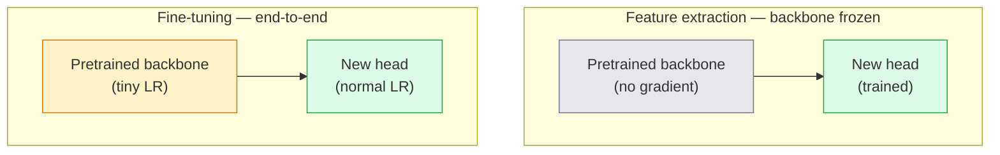

# Transfer Learning & Fine-Tuning | 迁移学习与微调

> Somebody else spent a million GPU hours teaching a network what edges, textures, and object parts look like. You should borrow those features before training your own.

> **【中文解读】** 别人花了一百万 GPU 小时教会网络识别边缘、纹理和物体部件。你应该在训练自己的模型之前先借用这些特征。迁移学习是 AI 工程中最实用的技术——预训练骨干 + 自定义分类头 = 几行代码就能解决新任务。

> **【拓展：迁移学习在工业界的应用】** 几乎所有生产级视觉系统都使用迁移学习：医疗影像（ImageNet 预训练 + 医学数据微调）、工业质检、自动驾驶。训练 ResNet-50 需 ~2000 GPU 小时，但微调只需几分钟。

**Type:** Build | **类型:** 动手
**Languages:** Python | **语言:** Python
**Prerequisites:** Phase 4 Lesson 03 (CNNs), Phase 4 Lesson 04 (Image Classification) | **前置知识:** Phase 4 Lesson 03（CNN），Phase 4 Lesson 04（图像分类）
**Time:** ~75 minutes | **时间:** ~75 分钟

## Learning Objectives | 学习目标

- Distinguish feature extraction from fine-tuning and pick the right one based on dataset size, domain distance, and compute budget
- Load a pretrained backbone, replace its classifier head, and train only the head to a working baseline in under 20 lines
- Progressively unfreeze layers with discriminative learning rates so early generic features get smaller updates than late task-specific ones
- Diagnose the three common failures: feature drift from too-high LR on unfrozen blocks, BN statistics collapse on tiny datasets, and catastrophic forgetting

> **【中文解读】** 学习目标列出了完成本课后应该掌握的核心能力。建议在开始学习前先浏览目标，学完后对照检查是否达成。


## The Problem | 问题引入

Training a ResNet-50 on ImageNet costs around 2,000 GPU-hours. Very few teams have that budget for every task they ship. What almost every team actually ships is a pretrained backbone with a new head trained on a few hundred or few thousand task-specific images.

> 在 ImageNet 上训练 ResNet-50 大约需要 2000 个 GPU 小时。很少有团队有预算为每个交付的任务投入这么多。几乎所有团队实际交付的是一个预训练骨干网络加上一个在几百或几千张任务特定图像上训练的新头部。

> **【中文解读】** 从零训练 ResNet-50 需要 ~2000 GPU 小时，但迁移学习只需几分钟。关键洞察是：CNN 的前几层学习的是通用特征（边缘、纹理），这些特征几乎对所有视觉任务都有用；只有最后几层才是任务特定的。

This is not a shortcut. The first conv block of any ImageNet-trained CNN learns edges and Gabor-like filters. The next few blocks learn textures and simple motifs. The middle blocks learn object parts. The final blocks learn combinations that start to look like the 1,000 ImageNet categories. The first 90% of that hierarchy transfers almost unchanged to medical imaging, industrial inspection, satellite data, and every other vision task — because nature has a limited vocabulary of edges and textures. The last 10% is what you actually train.

> 这不是捷径。任何在 ImageNet 上训练的 CNN 的第一个卷积块学习边缘和类 Gabor 滤波器。接下来几个块学习纹理和简单模式。中间块学习物体部件。最后几个块学习看起来像 1000 个 ImageNet 类别的组合。这个层次结构的前 90% 几乎不变地迁移到医学成像、工业检测、卫星数据和所有其他视觉任务——因为自然的边缘和纹理词汇是有限的。最后 10% 才是你实际训练的。

Getting transfer right has three bugs waiting for you: destroying pretrained features with a too-high learning rate, starving the model of information by freezing too much, and letting BatchNorm's running statistics drift toward a tiny dataset that the rest of the network never learnt from. This lesson walks each of them on purpose.

> 正确做迁移学习有三个 bug 在等着你：用过高的学习率破坏预训练特征，冻结太多导致模型信息匮乏，让 BatchNorm 的运行统计量漂移到一个网络其余部分从未学习过的微小数据集。本课特意逐一走过每个坑。

> **【中文解读】** 迁移学习最常见的三个坑：(1) 学习率太高破坏了预训练特征；(2) 冻结太多层导致模型欠拟合；(3) BatchNorm 的统计量在小数据集上漂移。本课逐一踩坑并给出解决方案。

## The Concept | 核心概念

> **【中文解读】** 本节介绍核心概念和理论基础。掌握这些概念是后续动手实现的前提，同时也是面试和工程实践中高频考察的知识点。


### Feature extraction vs fine-tuning

Two regimes, picked by how much you trust the pretrained features and how much data you have.

> 两种方案，取决于你有多信任预训练特征以及你有多少数据。



Rules of thumb:

> 经验法则：

| Dataset size / 数据量 | Domain distance / 领域距离 | Recipe / 方案 |
|--------------|-----------------|--------|
| < 1k images | close to ImageNet / 接近 ImageNet | Freeze backbone, train head only / 冻结骨干，只训头部 |
| 1k-10k | close / 接近 | Freeze first 2-3 stages, fine-tune the rest / 冻结前2-3阶段，微调其余 |
| 10k-100k | any / 任意 | Fine-tune end-to-end with discriminative LR / 用判别性学习率端到端微调 |
| 100k+ | far / 远 | Fine-tune everything; consider training from scratch if domain is far enough / 全量微调；领域足够远则考虑从头训练 |

"Close to ImageNet" roughly means natural RGB photos with object-like content. Medical CT scans, overhead satellite imagery, and microscopy are far domains — the features still help, but you will need to let more layers adapt.

> "接近 ImageNet" 大致意味着带有物体内容的自然 RGB 照片。医学 CT 扫描、俯视卫星图像和显微镜图像是远领域——特征仍然有帮助，但你需要让更多层去适应。

> **【拓展：迁移学习策略选择】** 在工业实践中，数据集大小和领域距离决定了迁移策略：<1k 张且与 ImageNet 接近就冻结骨干只训头部；10k+ 张就全量微调。医疗影像、卫星图等远领域需要解冻更多层。Stable Diffusion 的 U-Net 和 CLIP 的视觉编码器都是经过大规模预训练后微调的典型案例。

### Why freezing works at all

The ImageNet features a CNN learns are not specialised to the 1,000 categories. They are specialised to the statistics of natural images: edges at specific orientations, textures, contrast patterns, shape primitives. Those statistics are stable across almost every visual domain a human can name. That is why a model trained on ImageNet and evaluated zero-shot on CIFAR-10 with just a new linear head (no fine-tuning of the backbone) reaches 80%+ accuracy. The head is learning which of the already-learnt features to weight for this task.

> CNN 学到的 ImageNet 特征并不专用于 1000 个类别。它们专用于自然图像的统计特性：特定方向的边缘、纹理、对比度模式、形状基元。这些统计特性在几乎所有人类能命名的视觉领域中都是稳定的。这就是为什么一个在 ImageNet 上训练的模型，只用一个新的线性头部（不微调骨干网络）在 CIFAR-10 上零样本评估就能达到 80%+ 准确率。头部在学习为这个任务加权哪些已经学到的特征。

### Discriminative learning rates

When you do unfreeze, early layers should train slower than late layers. Early layers encode generic features that you want to preserve; late layers encode task-specific structure that you need to move a lot.

> 当你解冻时，早期层应该比晚期层训练得更慢。早期层编码你想保留的通用特征；晚期层编码你需要大幅调整的任务特定结构。

```
Typical recipe:

  stage 0 (stem + first group): lr = base_lr / 100    (mostly fixed)
  stage 1:                       lr = base_lr / 10
  stage 2:                       lr = base_lr / 3
  stage 3 (last backbone group): lr = base_lr
  head:                          lr = base_lr  (or slightly higher)
```

In PyTorch this is just a list of parameter groups passed to the optimizer. One model, five learning rates, zero extra code.

> 在 PyTorch 中，这只是传递给优化器的参数组列表。一个模型，五个学习率，零额外代码。

### The BatchNorm problem

BN layers hold `running_mean` and `running_var` buffers that were computed on ImageNet. If your task has a different pixel distribution — different lighting, different sensor, different colour space — those buffers are wrong. Three options in order of preference:

> BN 层持有在 ImageNet 上计算的 `running_mean` 和 `running_var` 缓冲区。如果你的任务有不同的像素分布——不同的光照、不同的传感器、不同的色彩空间——那些缓冲区就是错的。按优先顺序有三种选择：

1. **Fine-tune with BN in train mode.** Let BN update its running statistics along with everything else. Default choice when the task dataset is medium-sized (>= 5k examples).
2. **Freeze BN in eval mode.** Keep the ImageNet statistics and train only the weights. Correct when your dataset is small enough that BN's moving average would be noisy.
3. **Replace BN with GroupNorm.** Removes the moving-average problem entirely. Used in detection and segmentation backbones where batch size per GPU is tiny.

Getting this wrong silently tanks accuracy by 5-15%.

> 弄错这个会静默地降低 5-15% 的准确率。

### Head design

The classifier head is 1-3 linear layers plus an optional dropout. Every torchvision backbone ships a default head that you replace:

> 分类器头部是 1-3 个线性层加一个可选的 dropout。每个 torchvision 骨干网络都附带一个你替换的默认头部：

```
backbone.fc = nn.Linear(backbone.fc.in_features, num_classes)          # ResNet
backbone.classifier[1] = nn.Linear(..., num_classes)                    # EfficientNet, MobileNet
backbone.heads.head = nn.Linear(..., num_classes)                       # torchvision ViT
```

For small datasets, a single linear layer is usually enough. Adding a hidden layer (Linear -> ReLU -> Dropout -> Linear) helps when the task distribution is farther from the backbone's training distribution.

> 对于小数据集，单个线性层通常就够了。当任务分布与骨干网络的训练分布差距较大时，添加隐藏层（Linear -> ReLU -> Dropout -> Linear）会有帮助。

### Layer-wise LR decay

A smoother version of discriminative LR used in modern fine-tuning (BEiT, DINOv2, ViT-B fine-tunes). Instead of grouping layers into stages, give every layer a slightly smaller LR than the one above it:

> 现代微调（BEiT、DINOv2、ViT-B 微调）中使用的判别性学习率的更平滑版本。不将层分组为阶段，而是给每层一个比上层稍小的学习率：

```
lr_layer_k = base_lr * decay^(L - k)
```

With decay = 0.75 and L = 12 transformer blocks, the first block trains at `0.75^11 ≈ 0.04x` the head's LR. Matters more for transformer fine-tunes than for CNNs, where stage-grouped LRs are usually enough.

> 当 decay = 0.75 且 L = 12 个 Transformer 块时，第一个块以头部学习率的 `0.75^11 ≈ 0.04x` 训练。对 Transformer 微调比对 CNN 更重要，CNN 中阶段分组的学习率通常就够了。

### What to evaluate

Transfer-learning runs need two numbers you would not track on a scratch run:

- **Pretrained-only accuracy** — the head's accuracy with the backbone frozen. This is your floor.
- **Fine-tuned accuracy** — the same model after end-to-end training. This is your ceiling.

If fine-tuned is less than pretrained-only, you have a learning-rate or BN bug. Always print both.

> **【中文解读】** 本节通过代码从零实现核心算法。这种 "from scratch" 的方式能帮助理解框架背后的原理，遇到问题时不会被黑盒困住。

> **【拓展：工业部署中的视觉系统】** 在实际工业部署中，视觉模型需要考虑推理延迟、模型大小、边缘设备适配等问题。TensorRT、ONNX Runtime、OpenVINO 是常用的推理加速工具。自动驾驶系统（如 Tesla FSD）通常在车载芯片上实时运行多个视觉模型。


## Build It | 动手实现

### Step 1: Load a pretrained backbone and inspect it

```python
import torch
import torch.nn as nn
from torchvision.models import resnet18, ResNet18_Weights

backbone = resnet18(weights=ResNet18_Weights.IMAGENET1K_V1)
print(backbone)
print()
print("classifier head:", backbone.fc)
print("feature dim:", backbone.fc.in_features)
```

`ResNet18` has four stages (`layer1..layer4`) plus a stem and a `fc` head. Every torchvision classification backbone has an analogous structure.

### Step 2: Feature extraction — freeze everything, replace the head

```python
def make_feature_extractor(num_classes=10):
    model = resnet18(weights=ResNet18_Weights.IMAGENET1K_V1)
    for p in model.parameters():
        p.requires_grad = False
    model.fc = nn.Linear(model.fc.in_features, num_classes)
    return model

model = make_feature_extractor(num_classes=10)
trainable = sum(p.numel() for p in model.parameters() if p.requires_grad)
frozen = sum(p.numel() for p in model.parameters() if not p.requires_grad)
print(f"trainable: {trainable:>10,}")
print(f"frozen:    {frozen:>10,}")
```

Only `model.fc` is trainable. The backbone is a frozen feature extractor.

### Step 3: Discriminative fine-tuning

A utility that builds parameter groups with stage-specific learning rates.

```python
def discriminative_param_groups(model, base_lr=1e-3, decay=0.3):
    stages = [
        ["conv1", "bn1"],
        ["layer1"],
        ["layer2"],
        ["layer3"],
        ["layer4"],
        ["fc"],
    ]
    groups = []
    for i, names in enumerate(stages):
        lr = base_lr * (decay ** (len(stages) - 1 - i))
        params = [p for n, p in model.named_parameters()
                  if any(n.startswith(k) for k in names)]
        if params:
            groups.append({"params": params, "lr": lr, "name": "_".join(names)})
    return groups

model = resnet18(weights=ResNet18_Weights.IMAGENET1K_V1)
model.fc = nn.Linear(model.fc.in_features, 10)
for p in model.parameters():
    p.requires_grad = True

groups = discriminative_param_groups(model)
for g in groups:
    print(f"{g['name']:>10s}  lr={g['lr']:.2e}  params={sum(p.numel() for p in g['params']):>8,}")
```

`decay=0.3` means each stage trains at 30% of the rate of the next one. `fc` gets `base_lr`, `layer4` gets `0.3 * base_lr`, `conv1` gets `0.3^5 * base_lr ≈ 0.00243 * base_lr`. Extreme sounding; empirically it works.

### Step 4: BatchNorm handling

Helper to freeze BN running statistics without freezing its weights.

```python
def freeze_bn_stats(model):
    for m in model.modules():
        if isinstance(m, (nn.BatchNorm1d, nn.BatchNorm2d, nn.BatchNorm3d)):
            m.eval()
            for p in m.parameters():
                p.requires_grad = False
    return model
```

Call it after you set `model.train()` at the start of every epoch. `model.train()` flips everything to training mode; this reverses it only for BN layers.

### Step 5: A minimal end-to-end fine-tuning loop

```python
from torch.optim import SGD
from torch.utils.data import DataLoader
from torch.optim.lr_scheduler import CosineAnnealingLR
import torch.nn.functional as F

def fine_tune(model, train_loader, val_loader, device, epochs=5, base_lr=1e-3, freeze_bn=False):
    model = model.to(device)
    groups = discriminative_param_groups(model, base_lr=base_lr)
    optimizer = SGD(groups, momentum=0.9, weight_decay=1e-4, nesterov=True)
    scheduler = CosineAnnealingLR(optimizer, T_max=epochs)

    for epoch in range(epochs):
        model.train()
        if freeze_bn:
            freeze_bn_stats(model)
        tr_loss, tr_correct, tr_total = 0.0, 0, 0
        for x, y in train_loader:
            x, y = x.to(device), y.to(device)
            logits = model(x)
            loss = F.cross_entropy(logits, y, label_smoothing=0.1)
            optimizer.zero_grad()
            loss.backward()
            optimizer.step()
            tr_loss += loss.item() * x.size(0)
            tr_total += x.size(0)
            tr_correct += (logits.argmax(-1) == y).sum().item()
        scheduler.step()

        model.eval()
        va_total, va_correct = 0, 0
        with torch.no_grad():
            for x, y in val_loader:
                x, y = x.to(device), y.to(device)
                pred = model(x).argmax(-1)
                va_total += x.size(0)
                va_correct += (pred == y).sum().item()
        print(f"epoch {epoch}  train {tr_loss/tr_total:.3f}/{tr_correct/tr_total:.3f}  "
              f"val {va_correct/va_total:.3f}")
    return model
```

Five epochs with the above recipe on CIFAR-10 takes `ResNet18-IMAGENET1K_V1` from ~70% zero-shot linear-probe accuracy to ~93% fine-tuned accuracy. The head alone would plateau around 86% without ever touching the backbone.

### Step 6: Progressive unfreezing

A schedule that unfreezes one stage per epoch from the end toward the beginning. Mitigates feature drift at the cost of some extra epochs.

```python
def progressive_unfreeze_schedule(model):
    stages = ["layer4", "layer3", "layer2", "layer1"]
    yielded = set()

    def start():
        for p in model.parameters():
            p.requires_grad = False
        for p in model.fc.parameters():
            p.requires_grad = True

    def unfreeze(epoch):
        if epoch < len(stages):
            name = stages[epoch]
            yielded.add(name)
            for n, p in model.named_parameters():
                if n.startswith(name):
                    p.requires_grad = True
            return name
        return None

    return start, unfreeze
```

Call `start()` once before the first epoch. Call `unfreeze(epoch)` at the start of each epoch. Rebuild the optimizer whenever the set of trainable parameters changes, otherwise the frozen params still hold cached moments that confuse it.


## Use It | 用框架实现

> **【中文解读】** 本节展示如何用成熟框架（如 PyTorch、HuggingFace 等）快速应用该技术。在实际项目中，优先使用经过验证的框架实现，可以减少 bug 并提高开发效率。


For most real tasks, `torchvision.models` + three lines is enough. The heavier machinery above matters when you run into the problems that library defaults cannot fix.

```python
from torchvision.models import resnet50, ResNet50_Weights

model = resnet50(weights=ResNet50_Weights.IMAGENET1K_V2)
model.fc = nn.Linear(model.fc.in_features, num_classes)
optimizer = torch.optim.AdamW(model.parameters(), lr=1e-4, weight_decay=1e-4)
```

Two other production-grade defaults:

- `timm` ships ~800 pretrained vision backbones with a consistent API (`timm.create_model("resnet50", pretrained=True, num_classes=10)`). For any fine-tune beyond the torchvision zoo, it is the standard.
- For transformers, `transformers.AutoModelForImageClassification.from_pretrained(name, num_labels=N)` gives you ViT / BEiT / DeiT with the same loading semantics as text models.

> **【中文解读】** 本节关注如何将模型部署为可用的产品。从原型到生产级系统需要考虑性能优化、错误处理、监控等多个维度。


> **【拓展：数据标注与质量】** 视觉任务的效果高度依赖标注数据质量。Label Studio、CVAT 是主流标注工具。在工业场景中，主动学习（Active Learning）可以减少标注成本：模型对不确定的样本请求人工标注，确定性的样本自动标注。

## Ship It | 产出物

This lesson produces:

- `outputs/prompt-fine-tune-planner.md` — a prompt that picks feature-extraction vs progressive vs end-to-end fine-tuning based on dataset size, domain distance, and compute budget.
- `outputs/skill-freeze-inspector.md` — a skill that, given a PyTorch model, reports which parameters are trainable, which BatchNorm layers are in eval mode, and whether the optimizer is actually being fed the trainable parameters.

> **【中文解读】** 练习题按照 Easy/Medium/Hard 三个难度递进。建议至少完成 Medium 级别的题目，Hard 级别适合深入研究或面试准备。


## Exercises | 练习题

1. **(Easy | 简单)** Train a `ResNet18` as a linear probe (backbone frozen) and as a full fine-tune on the same synthetic-CIFAR dataset. Report both accuracies side by side. Explain which gap tells you the features transfer well and which tells you they do not.
   分别用线性探针（冻结骨干）和全量微调训练 ResNet18，对比准确率。解释哪个差距说明特征迁移得好、哪个说明不好。

2. **(Medium | 中等)** Introduce a bug on purpose: set `base_lr = 1e-1` on the backbone stage instead of the head. Show the training loss explode, then recover by applying the `discriminative_param_groups` helper. Record the LR at which each stage starts diverging.
   故意设置 `base_lr = 1e-1` 制造 bug，观察训练 loss 爆炸，然后用判别式学习率恢复。记录每个阶段开始发散的学习率。

3. **(Hard | 困难)** Take a medical imaging dataset (e.g. CheXpert-small, PatchCamelyon, or HAM10000) and compare three regimes: (a) ImageNet-pretrained frozen backbone + linear head; (b) ImageNet-pretrained fine-tune end-to-end; (c) scratch training. Report accuracy and compute cost for each. At what dataset size does scratch training become competitive?
   用医疗影像数据集对比三种方案：(a) 冻结骨干+线性头；(b) 全量微调；(c) 从零训练。报告准确率和计算成本，找出从零训练开始有竞争力的最小数据集规模。

## Key Terms | 关键术语

| Term | What people say | What it actually means | 中文释义 |
|------|----------------|----------------------|---------|
| Feature extraction | "Freeze and train head" | Backbone parameters frozen, only the new classifier head receives gradient | 特征提取：冻结骨干参数，只训练新的分类头 |
| Fine-tuning | "Retrain end-to-end" | All parameters trainable, usually with much smaller LR than scratch training | 微调：所有参数可训练，学习率远小于从零训练 |
| Discriminative LR | "Smaller LR for early layers" | Optimizer parameter groups where early-stage LR is a fraction of late-stage LR | 判别式学习率：早期层用更小的学习率 |
| Layer-wise LR decay | "Smooth LR gradient" | Per-layer LR multiplied by decay^(L - k); common in transformer fine-tunes | 逐层学习率衰减：每层 LR 乘以衰减系数 |
| Catastrophic forgetting | "The model lost ImageNet" | A too-high LR overwrites pretrained features before the new task signal is learnt | 灾难性遗忘：学习率过高导致预训练特征被覆盖 |
| BN statistics drift | "Running mean is wrong" | BatchNorm running_mean/var computed on a different distribution than the current task, silently hurting accuracy | BN 统计漂移：BatchNorm 的统计量与当前任务分布不匹配 |
| Linear probe | "Frozen backbone + linear head" | Evaluation of pretrained features — accuracy of the best linear classifier on top of the frozen representation | 线性探针：冻结骨干上训练线性分类器，评估预训练特征质量 |
| Catastrophic collapse | "Everything predicts one class" | Happens when fine-tuning with an LR high enough to destroy features before gradients from the head can stabilise | 灾难性崩塌：模型只预测一个类别 |

> **【中文解读】** 延伸阅读提供了深入学习的高质量资源。这些论文和教程是该领域的经典参考文献，适合需要深入理解的读者。


## Further Reading | 延伸阅读

- [How transferable are features in deep neural networks? (Yosinski et al., 2014)](https://arxiv.org/abs/1411.1792) — the paper that quantified feature transferability across layers
- [Universal Language Model Fine-tuning (ULMFiT, Howard & Ruder, 2018)](https://arxiv.org/abs/1801.06146) — the original discriminative LR / progressive unfreezing recipe; the ideas transfer directly to vision
- [timm documentation](https://huggingface.co/docs/timm) — the reference for modern vision backbones and the exact fine-tune defaults they were trained with
- [A Simple Framework for Linear-Probe Evaluation (Kornblith et al., 2019)](https://arxiv.org/abs/1805.08974) — why linear-probe accuracy matters and how to report it correctly
