# Object Detection — YOLO from Scratch | 目标检测 — 从零实现 YOLO

> Detection is classification plus regression, run at every position in a feature map, then cleaned up with non-maximum suppression.

> **【中文解读】** 目标检测 = 分类 + 回归，在特征图的每个位置运行，然后用非极大值抑制（NMS）清理重复检测框。YOLO（You Only Look Once）的核心思想是：将检测问题转化为密集预测问题，一次前向传播同时预测所有目标的类别和位置。

> **【拓展：YOLO 在自动驾驶中的应用】** YOLO 是自动驾驶中最常用的实时目标检测算法，能同时检测行人、车辆、交通标志等。从 YOLOv1 到 YOLOv8，速度和精度不断提升，是工业界最受欢迎的检测框架之一。

**Type:** Build
**Languages:** Python
**Prerequisites:** Phase 4 Lesson 03 (CNNs), Phase 4 Lesson 04 (Image Classification), Phase 4 Lesson 05 (Transfer Learning)
**Time:** ~75 minutes

## Learning Objectives | 学习目标

- Explain the grid-and-anchor design that turns detection into a dense prediction problem and state what every number in the output tensor means
- Compute Intersection-over-Union between boxes and implement non-maximum suppression from scratch
- Build a minimal YOLO-style head on top of a pretrained backbone, including the classification, objectness, and box-regression losses
- Read a detection metric row (precision@0.5, recall, mAP@0.5, mAP@0.5:0.95) and pick which knob to turn next

> **【中文解读】** 学习目标列出了完成本课后应该掌握的核心能力。建议在开始学习前先浏览目标，学完后对照检查是否达成。


## The Problem | 问题引入

Classification says "this image is a dog." Detection says "there is a dog at pixels (112, 40, 280, 210), there is a cat at (400, 180, 560, 310), and nothing else in the frame." That one structural change — predicting a variable number of labelled boxes instead of one label per image — is what every autonomous system, every surveillance product, every document layout parser, and every factory vision line depends on.

> 分类说"这张图是一只狗"。检测说"在像素 (112, 40, 280, 210) 处有一只狗，在 (400, 180, 560, 310) 处有一只猫，画面中没有其他东西。"这一个结构性变化——预测可变数量的带标签框而非每张图像一个标签——是每个自动驾驶系统、每个监控产品、每个文档版面解析器和每条工厂视觉产线所依赖的。

> **【中文解读】** 分类说"这张图是一只狗"，检测说"狗在 (112,40,280,210)，猫在 (400,180,560,310)"。这一个结构性变化——从预测一个标签变为预测不定数量的带标签框——是自动驾驶、安防监控、文档版面分析和工厂质检的核心能力。

Detection is also where every engineering trade-off in vision shows up at once. You want boxes that are accurate (regression head), you want the right class for each box (classification head), you want the model to know when there is nothing to detect (objectness score), and you want exactly one prediction per real object (non-maximum suppression). Miss any of these and the pipeline either misses objects, reports hallucinated boxes, or predicts the same object fifteen times in slightly different positions.

> 检测也是视觉中所有工程权衡同时出现的地方。你要框准确（回归头），你要每个框的类别正确（分类头），你要模型知道哪里没有东西要检测（目标性分数），你要每个真实物体恰好一个预测（非极大值抑制）。缺了任何一个，流水线要么漏检物体，要么报告幻觉框，要么把同一个物体在略微不同的位置预测十五次。

YOLO (You Only Look Once, Redmon et al. 2016) was the design that made all of this run in real time by doing it with a single forward pass of a conv net, and the same structural decisions are still the backbone of modern detectors (YOLOv8, YOLOv9, YOLO-NAS, RT-DETR). Learn the core and every variant becomes a rearrangement of the same parts.

> YOLO（You Only Look Once，Redmon 等 2016）是通过单次卷积网络前向传播使所有这些实时运行的设计，相同的结构决策仍然是现代检测器（YOLOv8、YOLOv9、YOLO-NAS、RT-DETR）的骨干。学习核心，每个变体都变成相同部件的重新排列。

> **【中文解读】** 检测是视觉中所有工程权衡的交汇点：框要准确（回归头）、类别要正确（分类头）、要知道哪里没有物体（置信度）、每个物体只检测一次（NMS）。YOLO 用单次前向传播实现所有这些，同样的设计思想延续到 YOLOv8、RT-DETR 等现代检测器。

## The Concept | 核心概念

> **【中文解读】** 本节介绍核心概念和理论基础。掌握这些概念是后续动手实现的前提，同时也是面试和工程实践中高频考察的知识点。


### Detection as dense prediction

A classifier outputs C numbers per image. A YOLO-style detector outputs `(S x S x (5 + C))` numbers per image, where S is the spatial grid size.

> 分类器每张图像输出 C 个数字。YOLO 风格的检测器每张图像输出 `(S x S x (5 + C))` 个数字，其中 S 是空间网格大小。

```mermaid
flowchart LR
    IMG["Input 416x416 RGB"] --> BB["Backbone<br/>(ResNet, DarkNet, ...)"]
    BB --> FM["Feature map<br/>(C_feat, 13, 13)"]
    FM --> HEAD["Detection head<br/>(1x1 convs)"]
    HEAD --> OUT["Output tensor<br/>(13, 13, B * (5 + C))"]
    OUT --> DEC["Decode<br/>(grid + sigmoid + exp)"]
    DEC --> NMS["Non-max suppression"]
    NMS --> RESULT["Final boxes"]

    style IMG fill:#dbeafe,stroke:#2563eb
    style HEAD fill:#fef3c7,stroke:#d97706
    style NMS fill:#fecaca,stroke:#dc2626
    style RESULT fill:#dcfce7,stroke:#16a34a
```



Each of the `S * S` grid cells predicts `B` boxes. For each box:

> 每个 `S * S` 网格单元预测 `B` 个框。对于每个框：

- 4 numbers describe geometry: `tx, ty, tw, th`.
  中文翻译：4 个数字描述几何形状：`tx, ty, tw, th`（中心偏移和宽高缩放）。
- 1 number is the objectness score: "is there an object centred in this cell?"
  中文翻译：1 个数字是目标性分数："该单元中心是否有物体？"
- C numbers are class probabilities.
  中文翻译：C 个数字是类别概率。

Total per cell: `B * (5 + C)`. For VOC with `S=13, B=2, C=20`, that is 50 numbers per cell.

> 每个单元总计：`B * (5 + C)`。对于 VOC 数据集，`S=13, B=2, C=20`，即每个单元 50 个数字。

### Why grids and anchors

Plain regression would predict `(x, y, w, h)` for every object as an absolute coordinate. That is hard for a conv network because translating the image should not translate all predictions by the same amount — each object is spatially anchored. The grid answers this by assigning each ground-truth box to the grid cell its centre falls in; only that cell is responsible for that object.

> 纯回归会把每个物体的 `(x, y, w, h)` 作为绝对坐标来预测。这对卷积网络来说很困难，因为平移图像不应该把所有预测都平移相同的量——每个物体在空间上是独立的。网格通过将每个真实框分配给其中心所在的网格单元来解决这个问题；只有该单元对该物体负责。

Anchors address a second problem. A 3x3 conv cannot easily regress a 500-pixel-wide box out of a 16-pixel receptive field feature cell. Instead, we pre-define `B` prior box shapes (anchors) per cell and predict small deltas from each anchor. The model learns to pick the right anchor and nudge it rather than regress from nothing.

> 锚框解决了第二个问题。3x3 卷积很难从 16 像素感受野的特征单元回归出 500 像素宽的框。因此我们为每个单元预定义 `B` 个先验框形状（锚框），并预测相对于每个锚框的小偏移量。模型学习选择正确的锚框并微调，而不是从零回归。

```
Anchor box priors (example for 416x416 input):

  small:   (30,  60)
  medium:  (75,  170)
  large:   (200, 380)

At each grid cell, every anchor emits (tx, ty, tw, th, obj, c_1, ..., c_C).
```

Modern detectors often use FPN with different anchor sets per resolution — small anchors on shallow high-resolution maps, large anchors on deep low-resolution maps. Same idea, more scales.

> 现代检测器通常使用 FPN（特征金字塔网络），在不同分辨率上使用不同的锚框集——浅层高分辨率图用小锚框，深层低分辨率图用大锚框。同样的思想，更多尺度。

### Decoding predictions

The raw `tx, ty, tw, th` are not box coordinates; they are regression targets to be transformed before plotting:

> 原始的 `tx, ty, tw, th` 不是框坐标；它们是需要在绘图前变换的回归目标：

```
centre x  = (sigmoid(tx) + cell_x) * stride
centre y  = (sigmoid(ty) + cell_y) * stride
width     = anchor_w * exp(tw)
height    = anchor_h * exp(th)
```

`sigmoid` keeps centre offsets inside the cell. `exp` lets the width scale freely from the anchor without a sign flip. `stride` scales the grid coordinates back to pixels. This decode step is the same in every YOLO version since v2.

> `sigmoid` 将中心偏移限制在单元内。`exp` 让宽度可以从锚框自由缩放而不需要符号翻转。`stride` 将网格坐标缩放回像素。这个解码步骤从 YOLOv2 开始在所有 YOLO 版本中都相同。

### IoU

Detection's universal similarity metric between two boxes:

> 检测中两个框之间的通用相似度度量：

```
IoU(A, B) = area(A intersect B) / area(A union B)
```

IoU = 1 means identical; IoU = 0 means no overlap. IoU between the prediction and the ground-truth box is what decides whether a prediction counts as a true positive (typically IoU >= 0.5). IoU between two predictions is what NMS uses to deduplicate.

> IoU = 1 表示完全相同；IoU = 0 表示完全不重叠。预测框与真实框之间的 IoU 决定预测是否算作真正例（通常 IoU >= 0.5）。两个预测之间的 IoU 是 NMS 用来去重的依据。

### Non-maximum suppression

A conv network trained on adjacent anchors will often predict overlapping boxes for the same object. NMS keeps the highest-confidence prediction and deletes any other prediction with IoU above a threshold.

> 在相邻锚框上训练的卷积网络通常会为同一个物体预测多个重叠的框。NMS 保留最高置信度的预测，并删除与该预测 IoU 超过阈值的任何其他预测。

```
NMS(boxes, scores, iou_threshold):
    sort boxes by score descending
    keep = []
    while boxes not empty:
        pick the top-scoring box, add to keep
        remove every box with IoU > iou_threshold to the picked box
    return keep
```

Typical threshold: 0.45 for object detection. Recent detectors replace standard NMS with `soft-NMS`, `DIoU-NMS`, or learn the suppression directly (RT-DETR) but the structural purpose is the same.

> 典型阈值：目标检测用 0.45。最近的检测器用 `soft-NMS`、`DIoU-NMS` 替代标准 NMS，或直接学习抑制策略（RT-DETR），但结构目的相同。

### The loss

YOLO loss is three losses added with weights:

> YOLO 损失是三个损失函数加权求和：

```
L = lambda_coord * L_box(pred, target, where obj=1)
  + lambda_obj   * L_obj(pred, 1,     where obj=1)
  + lambda_noobj * L_obj(pred, 0,     where obj=0)
  + lambda_cls   * L_cls(pred, target, where obj=1)
```

Only cells that contain an object contribute to the box-regression and classification losses. Cells without objects contribute only to the objectness loss (teaching the model to stay silent). `lambda_noobj` is usually small (~0.5) because the vast majority of cells are empty and would otherwise dominate the total loss.

> 只有包含物体的单元对框回归和分类损失有贡献。不含物体的单元只对目标性损失有贡献（教模型保持沉默）。`lambda_noobj` 通常很小（约 0.5），因为绝大多数单元是空的，否则会主导总损失。

Modern variants swap MSE box loss for CIoU / DIoU (which optimise IoU directly), use focal loss for class imbalance, and balance objectness with quality focal loss. The three-component structure is unchanged.

> 现代变体用 CIoU/DIoU（直接优化 IoU）替代 MSE 框损失，用 focal loss 处理类别不平衡，用 quality focal loss 平衡目标性。三组件结构不变。

### Detection metrics

Accuracy does not transfer to detection. Four numbers that do:

> 准确率不适用于检测。四个有用的指标：

- **Precision@IoU=0.5** — of the predictions counted as positives, how many are actually correct.
  中文翻译：**Precision@IoU=0.5** —— 在被计为正例的预测中，有多少是真正正确的。
- **Recall@IoU=0.5** — of the real objects, how many did we find.
  中文翻译：**Recall@IoU=0.5** —— 在所有真实物体中，我们找到了多少。
- **AP@0.5** — precision-recall curve area at IoU threshold 0.5; one number per class.
  中文翻译：**AP@0.5** —— IoU 阈值 0.5 下的精确率-召回率曲线面积；每个类别一个数。
- **mAP@0.5:0.95** — average of AP over IoU thresholds 0.5, 0.55, ..., 0.95. The COCO metric; strictest and most informative.
  中文翻译：**mAP@0.5:0.95** —— AP 在 IoU 阈值 0.5、0.55、...、0.95 上的平均值。COCO 指标；最严格、信息量最大。

Report all four. A detector that is strong on mAP@0.5 but weak on mAP@0.5:0.95 is localising roughly but not tightly; fix with better box-regression loss. A detector with high precision and low recall is too conservative; lower the confidence threshold or increase the objectness weight.

> 报告全部四个指标。一个在 mAP@0.5 上强但在 mAP@0.5:0.95 上弱的检测器定位粗略但不精确；用更好的框回归损失来修复。一个高精度低召回的检测器太保守；降低置信度阈值或增加目标性权重。

> **【拓展：工业部署中的视觉系统】** 在实际工业部署中，视觉模型需要考虑推理延迟、模型大小、边缘设备适配等问题。TensorRT、ONNX Runtime、OpenVINO 是常用的推理加速工具。自动驾驶系统（如 Tesla FSD）通常在车载芯片上实时运行多个视觉模型。

> **【拓展：数据标注与质量】** 视觉任务的效果高度依赖标注数据质量。Label Studio、CVAT 是主流标注工具。在工业场景中，主动学习（Active Learning）可以减少标注成本：模型对不确定的样本请求人工标注，确定性的样本自动标注。


## Build It | 动手实现

> **【中文解读】** 本节通过代码从零实现核心算法。这种 "from scratch" 的方式能帮助理解框架背后的原理，遇到问题时不会被黑盒困住。


### Step 1: IoU

The workhorse of the whole lesson. Works on two arrays of boxes in `(x1, y1, x2, y2)` format.

> 本课的核心工具。处理两组 `(x1, y1, x2, y2)` 格式的框。

```python
import numpy as np

def box_iou(boxes_a, boxes_b):
    ax1, ay1, ax2, ay2 = boxes_a[:, 0], boxes_a[:, 1], boxes_a[:, 2], boxes_a[:, 3]
    bx1, by1, bx2, by2 = boxes_b[:, 0], boxes_b[:, 1], boxes_b[:, 2], boxes_b[:, 3]

    inter_x1 = np.maximum(ax1[:, None], bx1[None, :])
    inter_y1 = np.maximum(ay1[:, None], by1[None, :])
    inter_x2 = np.minimum(ax2[:, None], bx2[None, :])
    inter_y2 = np.minimum(ay2[:, None], by2[None, :])

    inter_w = np.clip(inter_x2 - inter_x1, 0, None)
    inter_h = np.clip(inter_y2 - inter_y1, 0, None)
    inter = inter_w * inter_h

    area_a = (ax2 - ax1) * (ay2 - ay1)
    area_b = (bx2 - bx1) * (by2 - by1)
    union = area_a[:, None] + area_b[None, :] - inter
    return inter / np.clip(union, 1e-8, None)
```

Returns an `(N_a, N_b)` matrix of pairwise IoUs. Use it against a single ground-truth box by making one of the arrays shape `(1, 4)`.

> 返回 `(N_a, N_b)` 的成对 IoU 矩阵。将其中一个数组设为 `(1, 4)` 形状即可对单个真实框使用。

### Step 2: Non-max suppression

```python
def nms(boxes, scores, iou_threshold=0.45):
    order = np.argsort(-scores)
    keep = []
    while len(order) > 0:
        i = order[0]
        keep.append(i)
        if len(order) == 1:
            break
        rest = order[1:]
        ious = box_iou(boxes[[i]], boxes[rest])[0]
        order = rest[ious <= iou_threshold]
    return np.array(keep, dtype=np.int64)
```

Deterministic, `O(N log N)` from the sort, and matches the behaviour of `torchvision.ops.nms` on identical inputs.

> 确定性的，排序复杂度 `O(N log N)`，在相同输入上与 `torchvision.ops.nms` 的行为一致。

### Step 3: Box encoding and decoding

Convert between pixel coordinates and the `(tx, ty, tw, th)` targets that the network actually regresses.

```python
def encode(box_xyxy, cell_x, cell_y, stride, anchor_wh):
    x1, y1, x2, y2 = box_xyxy
    cx = 0.5 * (x1 + x2)
    cy = 0.5 * (y1 + y2)
    w = x2 - x1
    h = y2 - y1
    tx = cx / stride - cell_x
    ty = cy / stride - cell_y
    tw = np.log(w / anchor_wh[0] + 1e-8)
    th = np.log(h / anchor_wh[1] + 1e-8)
    return np.array([tx, ty, tw, th])


def decode(tx_ty_tw_th, cell_x, cell_y, stride, anchor_wh):
    tx, ty, tw, th = tx_ty_tw_th
    cx = (sigmoid(tx) + cell_x) * stride
    cy = (sigmoid(ty) + cell_y) * stride
    w = anchor_wh[0] * np.exp(tw)
    h = anchor_wh[1] * np.exp(th)
    return np.array([cx - w / 2, cy - h / 2, cx + w / 2, cy + h / 2])


def sigmoid(x):
    return 1.0 / (1.0 + np.exp(-x))
```

Test: encode a box then decode — you should get back something very close to the original (up to the sigmoid inverse not being perfectly invertible when `tx` is not in the post-sigmoid range).

### Step 4: A minimal YOLO head

One 1x1 conv on a feature map, reshaping to `(B, S, S, num_anchors, 5 + C)`.

```python
import torch
import torch.nn as nn

class YOLOHead(nn.Module):
    def __init__(self, in_c, num_anchors, num_classes):
        super().__init__()
        self.num_anchors = num_anchors
        self.num_classes = num_classes
        self.conv = nn.Conv2d(in_c, num_anchors * (5 + num_classes), kernel_size=1)

    def forward(self, x):
        n, _, h, w = x.shape
        y = self.conv(x)
        y = y.view(n, self.num_anchors, 5 + self.num_classes, h, w)
        y = y.permute(0, 3, 4, 1, 2).contiguous()
        return y
```

Output shape: `(N, H, W, num_anchors, 5 + C)`. The last dimension holds `[tx, ty, tw, th, obj, cls_0, ..., cls_{C-1}]`.

### Step 5: Ground-truth assignment

For every ground-truth box, decide which `(cell, anchor)` is responsible.

```python
def assign_targets(boxes_xyxy, classes, anchors, stride, grid_size, num_classes):
    num_anchors = len(anchors)
    target = np.zeros((grid_size, grid_size, num_anchors, 5 + num_classes), dtype=np.float32)
    has_obj = np.zeros((grid_size, grid_size, num_anchors), dtype=bool)

    for box, cls in zip(boxes_xyxy, classes):
        x1, y1, x2, y2 = box
        cx, cy = 0.5 * (x1 + x2), 0.5 * (y1 + y2)
        gx, gy = int(cx / stride), int(cy / stride)
        bw, bh = x2 - x1, y2 - y1

        ious = np.array([
            (min(bw, aw) * min(bh, ah)) / (bw * bh + aw * ah - min(bw, aw) * min(bh, ah))
            for aw, ah in anchors
        ])
        best = int(np.argmax(ious))
        aw, ah = anchors[best]

        target[gy, gx, best, 0] = cx / stride - gx
        target[gy, gx, best, 1] = cy / stride - gy
        target[gy, gx, best, 2] = np.log(bw / aw + 1e-8)
        target[gy, gx, best, 3] = np.log(bh / ah + 1e-8)
        target[gy, gx, best, 4] = 1.0
        target[gy, gx, best, 5 + cls] = 1.0
        has_obj[gy, gx, best] = True
    return target, has_obj
```

Anchor selection is "best shape IoU with the ground truth" — a cheap proxy that matches the YOLOv2/v3 assignment. v5 and later use more sophisticated strategies (task-aligned matching, dynamic k) that refine the same idea.

### Step 6: The three losses

```python
def yolo_loss(pred, target, has_obj, lambda_coord=5.0, lambda_obj=1.0, lambda_noobj=0.5, lambda_cls=1.0):
    has_obj_t = torch.from_numpy(has_obj).bool()
    target_t = torch.from_numpy(target).float()

    # box-regression loss: only on cells with objects
    box_pred = pred[..., :4][has_obj_t]
    box_true = target_t[..., :4][has_obj_t]
    loss_box = torch.nn.functional.mse_loss(box_pred, box_true, reduction="sum")

    # objectness loss
    obj_pred = pred[..., 4]
    obj_true = target_t[..., 4]
    loss_obj_pos = torch.nn.functional.binary_cross_entropy_with_logits(
        obj_pred[has_obj_t], obj_true[has_obj_t], reduction="sum")
    loss_obj_neg = torch.nn.functional.binary_cross_entropy_with_logits(
        obj_pred[~has_obj_t], obj_true[~has_obj_t], reduction="sum")

    # classification loss on cells with objects
    cls_pred = pred[..., 5:][has_obj_t]
    cls_true = target_t[..., 5:][has_obj_t]
    loss_cls = torch.nn.functional.binary_cross_entropy_with_logits(
        cls_pred, cls_true, reduction="sum")

    total = (lambda_coord * loss_box
             + lambda_obj * loss_obj_pos
             + lambda_noobj * loss_obj_neg
             + lambda_cls * loss_cls)
    return total, {"box": loss_box.item(), "obj_pos": loss_obj_pos.item(),
                   "obj_neg": loss_obj_neg.item(), "cls": loss_cls.item()}
```

Five hyper-parameters that every YOLO tutorial either hardcodes or sweeps. The ratios matter: `lambda_coord=5, lambda_noobj=0.5` mirrors the original YOLOv1 paper and still works as a reasonable default.

### Step 7: Inference pipeline

Decode the raw head output, apply sigmoid/exp, threshold on objectness, and NMS.

```python
def postprocess(pred_tensor, anchors, stride, img_size, conf_threshold=0.25, iou_threshold=0.45):
    pred = pred_tensor.detach().cpu().numpy()
    grid_h, grid_w = pred.shape[1], pred.shape[2]
    num_anchors = len(anchors)

    boxes, scores, classes = [], [], []
    for gy in range(grid_h):
        for gx in range(grid_w):
            for a in range(num_anchors):
                tx, ty, tw, th, obj, *cls = pred[0, gy, gx, a]
                score = sigmoid(obj) * sigmoid(np.array(cls)).max()
                if score < conf_threshold:
                    continue
                cls_idx = int(np.argmax(cls))
                cx = (sigmoid(tx) + gx) * stride
                cy = (sigmoid(ty) + gy) * stride
                w = anchors[a][0] * np.exp(tw)
                h = anchors[a][1] * np.exp(th)
                boxes.append([cx - w / 2, cy - h / 2, cx + w / 2, cy + h / 2])
                scores.append(float(score))
                classes.append(cls_idx)

    if not boxes:
        return np.zeros((0, 4)), np.zeros((0,)), np.zeros((0,), dtype=int)
    boxes = np.array(boxes)
    scores = np.array(scores)
    classes = np.array(classes)
    keep = nms(boxes, scores, iou_threshold)
    return boxes[keep], scores[keep], classes[keep]
```

> **【中文解读】** 本节展示如何用成熟框架（如 PyTorch、HuggingFace 等）快速应用该技术。在实际项目中，优先使用经过验证的框架实现，可以减少 bug 并提高开发效率。


That is the complete eval path: head -> decode -> threshold -> NMS.


> **【拓展：视觉模型的持续学习】** 在生产环境中，视觉模型需要不断适应新数据（新产品、新场景、新光照条件）。持续学习（Continual Learning）技术可以防止模型在适应新数据时遗忘旧知识。这在自动驾驶和工业质检中尤为重要。

## Use It | 用框架实现

`torchvision.models.detection` ships production detectors with the same conceptual structure. Loading a pretrained model takes three lines.

```python
import torch
from torchvision.models.detection import fasterrcnn_resnet50_fpn_v2

model = fasterrcnn_resnet50_fpn_v2(weights="DEFAULT")
model.eval()
with torch.no_grad():
    predictions = model([torch.randn(3, 400, 600)])
print(predictions[0].keys())
print(f"boxes:  {predictions[0]['boxes'].shape}")
print(f"scores: {predictions[0]['scores'].shape}")
print(f"labels: {predictions[0]['labels'].shape}")
```

For real-time inference pipelines, `ultralytics` (YOLOv8/v9) is the standard: `from ultralytics import YOLO; model = YOLO('yolov8n.pt'); model(img)`. The model handles decoding and NMS internally and returns the same `boxes / scores / labels` triple you built above.

> **【中文解读】** 本节关注如何将模型部署为可用的产品。从原型到生产级系统需要考虑性能优化、错误处理、监控等多个维度。


## Ship It | 产出物

This lesson produces:

- `outputs/prompt-detection-metric-reader.md` — a prompt that turns a `precision, recall, AP, mAP@0.5:0.95` row into a one-line diagnosis and the single most useful next experiment.
- `outputs/skill-anchor-designer.md` — a skill that, given a dataset of ground-truth boxes, runs k-means on `(w, h)` and returns anchor sets per FPN level plus the coverage statistics you need to pick the right number of anchors.

> **【中文解读】** 练习题按照 Easy/Medium/Hard 三个难度递进。建议至少完成 Medium 级别的题目，Hard 级别适合深入研究或面试准备。


## Exercises | 练习题

1. **(Easy | 简单)** Implement `box_iou` and run it against `torchvision.ops.box_iou` on 1,000 random box pairs. Verify max absolute difference is below `1e-6`.
   实现 `box_iou` 并与 torchvision 的实现在 1000 对随机框上对比，验证最大误差 < 1e-6。

2. **(Medium | 中等)** Port `yolo_loss` to a version that uses `CIoU` box loss instead of MSE. Show on a 100-image synthetic dataset that CIoU converges to a better final mAP@0.5:0.95 than MSE in the same number of epochs.
   将 `yolo_loss` 改为使用 CIoU 框损失（替代 MSE），在合成数据集上证明 CIoU 收敛到更高的 mAP。

3. **(Hard | 困难)** Implement multi-scale inference: feed the same image at three resolutions through the model, union the box predictions, and run a single NMS at the end. Measure the mAP lift vs single-scale inference on a held-out set.
   实现多尺度推理：用三个分辨率分别检测，合并预测框后统一做 NMS，测量相比单尺度的 mAP 提升。

## Key Terms | 关键术语

| Term | What people say | What it actually means | 中文释义 |
|------|----------------|----------------------|---------|
| Anchor | "Box prior" | A pre-defined box shape at each grid cell from which the network predicts deltas instead of absolute coordinates | 锚框：预定义的框形状，网络只预测相对于锚框的偏移量 |
| IoU | "Overlap" | Intersection-over-union of two boxes; the universal similarity measure in detection | IoU：交并比，检测中通用的相似度度量 |
| NMS | "Deduplicate" | Greedy algorithm that keeps highest-score predictions and removes overlapping ones above a threshold | NMS：非极大值抑制，去除重复检测框 |
| Objectness | "Is there something here" | Per-anchor, per-cell scalar predicting whether an object is centred in that cell | 置信度/目标性：预测该位置是否有物体 |
| Grid stride | "Downsample factor" | Pixels per grid cell; a 416-px input with a 13-grid head has stride 32 | 网格步长：每个网格单元对应的像素数 |
| mAP | "Mean average precision" | Average of the area under the precision-recall curve, averaged over classes and (for COCO) IoU thresholds | mAP：平均精度均值，检测的核心评估指标 |
| AP@0.5 | "PASCAL VOC AP" | Average precision with IoU threshold 0.5; the lenient version of the metric | AP@0.5：IoU 阈值 0.5 的平均精度（宽松版） |
| mAP@0.5:0.95 | "COCO AP" | Average over IoU thresholds 0.5..0.95 step 0.05; the strict version and current community standard | mAP@0.5:0.95：多个 IoU 阈值的平均（严格版，COCO 标准） |

> **【中文解读】** 延伸阅读提供了深入学习的高质量资源。这些论文和教程是该领域的经典参考文献，适合需要深入理解的读者。


## Further Reading | 延伸阅读

- [YOLOv1: You Only Look Once (Redmon et al., 2016)](https://arxiv.org/abs/1506.02640) — the founding paper; every YOLO since is a refinement of this structure
- [YOLOv3 (Redmon & Farhadi, 2018)](https://arxiv.org/abs/1804.02767) — the paper that introduced multi-scale FPN-style heads; still the clearest diagram
- [Ultralytics YOLOv8 docs](https://docs.ultralytics.com) — the current production reference; covers dataset formats, augmentations, training recipes
- [The Illustrated Guide to Object Detection (Jonathan Hui)](https://jonathan-hui.medium.com/object-detection-series-24d03a12f904) — best plain-English tour of the full detector zoo; priceless for understanding how DETR, RetinaNet, FCOS, and YOLO relate
