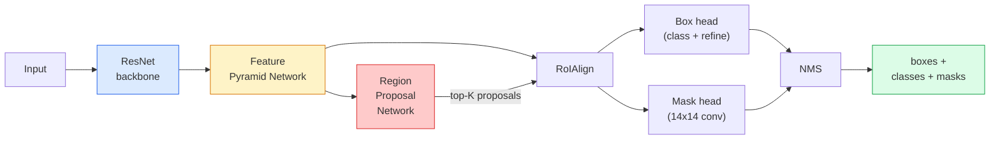

# Instance Segmentation — Mask R-CNN | 实例分割 — Mask R-CNN

> Add a tiny mask branch to a Faster R-CNN detector and you have instance segmentation. The hard part is RoIAlign, and it is harder than it looks.

> **【中文解读】** 在 Faster R-CNN 检测器上添加一个掩码分支就得到了实例分割。难点在于 RoIAlign——将不同大小的候选区域对齐到固定尺寸的特征图，且保持空间精度。实例分割与语义分割的区别在于：实例分割能区分同类的不同个体（如画面中的每一个人）。

> **【拓展：实例分割的应用】** Mask R-CNN 广泛用于自动驾驶（区分不同车辆和行人）、机器人抓取（识别单个物体轮廓）、视频编辑（精确抠图）。RoIAlign 技术后来也被用到 Vision Transformer 的适配器中。

**Type:** Build + Learn | **类型:** 动手 + 学习
**Languages:** Python | **语言:** Python
**Prerequisites:** Phase 4 Lesson 06 (YOLO), Phase 4 Lesson 07 (U-Net) | **前置知识:** Phase 4 Lesson 06（YOLO），Phase 4 Lesson 07（U-Net）
**Time:** ~75 minutes | **时间:** ~75 分钟

## Learning Objectives | 学习目标

- Trace the Mask R-CNN architecture end-to-end: backbone, FPN, RPN, RoIAlign, box head, mask head
- Implement RoIAlign from scratch and explain why RoIPool is no longer used
- Use the torchvision `maskrcnn_resnet50_fpn_v2` pretrained model for production-quality instance masks and read its output format correctly
- Fine-tune Mask R-CNN on a small custom dataset by replacing the box and mask heads and keeping the backbone frozen

> **【中文解读】** 学习目标列出了完成本课后应该掌握的核心能力。建议在开始学习前先浏览目标，学完后对照检查是否达成。


## The Problem | 问题引入

Semantic segmentation gives you one mask per class. Instance segmentation gives you one mask per object, even when two objects share a class. Counting individuals, tracking across frames, and measuring things (the bounding box of each brick in a wall, each cell in a microscope image) all demand instance segmentation.

> 语义分割给你每个类别一个掩码。实例分割给你每个物体一个掩码，即使两个物体属于同一类别。计数个体、跨帧跟踪和测量东西（墙壁中每块砖的边界框、显微镜图像中每个细胞）都需要实例分割。

Mask R-CNN (He et al., 2017) solved this by reframing instance segmentation as detection-plus-a-mask. The design was so clean that for the next five years almost every instance segmentation paper was a Mask R-CNN variant, and the torchvision implementation is still the production default for small to medium datasets.

> Mask R-CNN（He 等，2017）通过将实例分割重新定义为检测加掩码来解决这个问题。设计如此干净，以至于接下来五年几乎每篇实例分割论文都是 Mask R-CNN 的变体，torchvision 实现仍然是中小型数据集的生产默认选择。

The hard engineering problem is sampling: how do you crop a fixed-size feature region out of a proposal box whose corners do not align with pixel boundaries? Getting that wrong costs tenths of a mAP point everywhere. RoIAlign is the answer.

> 困难的工程问题是采样：你如何从角点不与像素边界对齐的候选框中裁剪出固定大小的特征区域？弄错这个在所有地方都会损失零点几个 mAP。RoIAlign 就是答案。

## The Concept | 核心概念

> **【中文解读】** 本节介绍核心概念和理论基础。掌握这些概念是后续动手实现的前提，同时也是面试和工程实践中高频考察的知识点。


### The architecture



Five pieces to understand:

1. **Backbone** — ResNet-50 or ResNet-101 trained on ImageNet. Produces a hierarchy of feature maps at strides 4, 8, 16, 32.
   中文翻译：在 ImageNet 上训练的 ResNet-50 或 ResNet-101。生成步幅为 4、8、16、32 的层级特征图。
2. **FPN (Feature Pyramid Network)** — top-down + lateral connections that give every level C channels of semantic-rich features. Detection queries the FPN level matching the object size.
   中文翻译：自上而下加横向连接，为每个层级提供 C 个通道的语义丰富特征。检测时查询与物体大小匹配的 FPN 层级。
3. **RPN (Region Proposal Network)** — a small conv head that, at every anchor position, predicts "is there an object here?" and "how do I refine the box?". Produces ~1000 proposals per image.
   中文翻译：一个小的卷积头，在每个锚点位置预测"这里有没有物体？"和"如何修正边界框？"。每张图像生成约 1000 个候选区域。
4. **RoIAlign** — samples a fixed-size (e.g. 7x7) feature patch from any box on any FPN level. Bilinear sampling, no quantisation.
   中文翻译：从任意 FPN 层级的任意框中采样固定大小（如 7x7）的特征块。双线性采样，无量化。
5. **Heads** — two-layer box head that refines the box and picks a class, plus a small conv head that outputs a `28x28` binary mask for each proposal.
   中文翻译：两层框头用于修正边界框并选择类别，加上一个小的卷积头为每个候选区域输出 `28x28` 的二值掩码。

### Why RoIAlign, not RoIPool

The original Fast R-CNN used RoIPool, which splits a proposal box into a grid, takes the maximum feature in each cell, and rounds all coordinates to integers. That rounding misaligns the feature map from the input pixel coordinates by up to a full feature-map pixel — small on a 224x224 image, catastrophic when the feature map is stride 32.

> 原始的 Fast R-CNN 使用 RoIPool，它将候选框分成网格，取每个格子中的最大特征值，并将所有坐标四舍五入为整数。这种舍入会使特征图与输入像素坐标错位多达一个特征图像素——在 224x224 的图像上影响很小，但当特征图步幅为 32 时则是灾难性的。

```
RoIPool:
  box (34.7, 51.3, 98.2, 142.9)
  round -> (34, 51, 98, 142)
  split grid -> round each cell boundary
  misalignment accumulates at every step

RoIAlign:
  box (34.7, 51.3, 98.2, 142.9)
  sample at exact float coordinates using bilinear interpolation
  no rounding anywhere
```

RoIAlign lifts mask AP by 3-4 points on COCO for free. Every detector that cares about localisation now uses it — YOLOv7 seg, RT-DETR, Mask2Former alike.

> RoIAlign 在 COCO 上免费提升掩码 AP 3-4 个点。每个关心定位精度的检测器现在都使用它——YOLOv7 seg、RT-DETR、Mask2Former 无一例外。

### The RPN in one paragraph

At every position of a feature map, place K anchor boxes of different sizes and shapes. Predict an objectness score for each anchor and a regression offset to turn the anchor into a better-fitting box. Keep the top ~1,000 boxes by score, apply NMS at IoU 0.7, and hand the survivors to the heads. The RPN is trained with its own mini-loss — the same structure as the YOLO loss from Lesson 6, just with two classes (object / no object).

> 在特征图的每个位置放置 K 个不同大小和形状的锚框。为每个锚框预测一个目标性分数和一个回归偏移量，将锚框转换为更拟合的边界框。保留得分最高的约 1000 个框，在 IoU 0.7 下应用 NMS，将幸存者交给后续头部。RPN 用自己的小损失函数训练——结构与第 6 课的 YOLO 损失相同，只是只有两个类别（物体 / 非物体）。

### The mask head

For each proposal (after RoIAlign) the mask head is a tiny FCN: four 3x3 convs, a 2x deconv, a final 1x1 conv that produces `num_classes` output channels at `28x28` resolution. Only the channel corresponding to the predicted class is kept; the others are ignored. This decouples mask prediction from classification.

> 对于每个候选区域（RoIAlign 之后），掩码头是一个微小的 FCN：四个 3x3 卷积、一个 2x 反卷积、一个最终的 1x1 卷积，在 `28x28` 分辨率上生成 `num_classes` 个输出通道。只保留与预测类别对应的通道；其余通道被忽略。这将掩码预测与分类解耦。

Upsample the 28x28 mask to the proposal's original pixel size to produce the final binary mask.

> 将 28x28 掩码上采样到候选区域的原始像素大小，生成最终的二值掩码。

### Losses

Mask R-CNN has four losses added together:

> Mask R-CNN 有四个损失函数相加：

```
L = L_rpn_cls + L_rpn_box + L_box_cls + L_box_reg + L_mask
```

- `L_rpn_cls`, `L_rpn_box` — objectness + box regression for the RPN proposals.
  中文翻译：RPN 候选区域的目标性和边界框回归损失。
- `L_box_cls` — cross-entropy over (C+1) classes (including background) on the head's classifier.
  中文翻译：头部分类器上 (C+1) 个类别（含背景）的交叉熵损失。
- `L_box_reg` — smooth L1 on the head's box refinement.
  中文翻译：头部边界框修正的平滑 L1 损失。
- `L_mask` — per-pixel binary cross-entropy on the 28x28 mask output.
  中文翻译：28x28 掩码输出上的逐像素二元交叉熵损失。

Each loss has its own default weight; the torchvision implementation exposes them as constructor arguments.

> 每个损失有自己的默认权重；torchvision 实现将它们暴露为构造函数参数。

### Output format

`torchvision.models.detection.maskrcnn_resnet50_fpn_v2` returns a list of dicts, one per image:

```
{
    "boxes":  (N, 4) in (x1, y1, x2, y2) pixel coordinates,
    "labels": (N,) class IDs, 0 = background so indices are 1-based,
    "scores": (N,) confidence scores,
    "masks":  (N, 1, H, W) float masks in [0, 1] — threshold at 0.5 for binary,
}
```

> **【中文解读】** 本节通过代码从零实现核心算法。这种 "from scratch" 的方式能帮助理解框架背后的原理，遇到问题时不会被黑盒困住。


The mask is full image resolution already. The 28x28 head output has been upsampled internally.

> **【拓展：工业部署中的视觉系统】** 在实际工业部署中，视觉模型需要考虑推理延迟、模型大小、边缘设备适配等问题。TensorRT、ONNX Runtime、OpenVINO 是常用的推理加速工具。自动驾驶系统（如 Tesla FSD）通常在车载芯片上实时运行多个视觉模型。

> **【拓展：数据标注与质量】** 视觉任务的效果高度依赖标注数据质量。Label Studio、CVAT 是主流标注工具。在工业场景中，主动学习（Active Learning）可以减少标注成本：模型对不确定的样本请求人工标注，确定性的样本自动标注。


## Build It | 动手实现

### Step 1: RoIAlign from scratch

This is the one component of Mask R-CNN that is simpler to understand as code than as prose.

> 这是 Mask R-CNN 中唯一一个用代码比用文字更容易理解的组件。

```python
import torch
import torch.nn.functional as F

def roi_align_single(feature, box, output_size=7, spatial_scale=1 / 16.0):
    """
    feature: (C, H, W) single-image feature map
    box: (x1, y1, x2, y2) in original image pixel coordinates
    output_size: side of the output grid (7 for box head, 14 for mask head)
    spatial_scale: reciprocal of the feature map stride
    """
    C, H, W = feature.shape
    x1, y1, x2, y2 = [c * spatial_scale - 0.5 for c in box]
    bin_w = (x2 - x1) / output_size
    bin_h = (y2 - y1) / output_size

    grid_y = torch.linspace(y1 + bin_h / 2, y2 - bin_h / 2, output_size)
    grid_x = torch.linspace(x1 + bin_w / 2, x2 - bin_w / 2, output_size)
    yy, xx = torch.meshgrid(grid_y, grid_x, indexing="ij")

    gx = 2 * (xx + 0.5) / W - 1
    gy = 2 * (yy + 0.5) / H - 1
    grid = torch.stack([gx, gy], dim=-1).unsqueeze(0)
    sampled = F.grid_sample(feature.unsqueeze(0), grid, mode="bilinear",
                            align_corners=False)
    return sampled.squeeze(0)
```

Every number is at a bilinearly-sampled position. No rounding, no quantisation, no dropped gradients.

> 每个数值都位于双线性采样的位置上。没有舍入、没有量化、没有梯度丢失。

### Step 2: Compare to torchvision's RoIAlign

```python
from torchvision.ops import roi_align

feature = torch.randn(1, 16, 50, 50)
boxes = torch.tensor([[0, 10, 20, 100, 90]], dtype=torch.float32)  # (batch_idx, x1, y1, x2, y2)

ours = roi_align_single(feature[0], boxes[0, 1:].tolist(), output_size=7, spatial_scale=1/4)
theirs = roi_align(feature, boxes, output_size=(7, 7), spatial_scale=1/4, sampling_ratio=1, aligned=True)[0]

print(f"shape ours:   {tuple(ours.shape)}")
print(f"shape theirs: {tuple(theirs.shape)}")
print(f"max|diff|:    {(ours - theirs).abs().max().item():.3e}")
```

With `sampling_ratio=1` and `aligned=True`, the two match to within `1e-5`.

> 当 `sampling_ratio=1` 且 `aligned=True` 时，两者的差异在 `1e-5` 以内。

### Step 3: Load a pretrained Mask R-CNN

```python
import torch
from torchvision.models.detection import maskrcnn_resnet50_fpn_v2, MaskRCNN_ResNet50_FPN_V2_Weights

model = maskrcnn_resnet50_fpn_v2(weights=MaskRCNN_ResNet50_FPN_V2_Weights.DEFAULT)
model.eval()
print(f"params: {sum(p.numel() for p in model.parameters()):,}")
print(f"classes (including background): {len(model.roi_heads.box_predictor.cls_score.out_features * [0])}")
```

46M parameters, 91 classes (COCO). The first class (id 0) is background; everything the model actually detects starts at id 1.

> 4600 万参数，91 个类别（COCO）。第一个类别（id 0）是背景；模型实际检测的所有类别从 id 1 开始。

### Step 4: Run inference

```python
with torch.no_grad():
    x = torch.randn(3, 400, 600)
    predictions = model([x])
p = predictions[0]
print(f"boxes:  {tuple(p['boxes'].shape)}")
print(f"labels: {tuple(p['labels'].shape)}")
print(f"scores: {tuple(p['scores'].shape)}")
print(f"masks:  {tuple(p['masks'].shape)}")
```

The mask tensor is shape `(N, 1, H, W)`. Threshold at 0.5 to get a binary mask per object:

> 掩码张量的形状为 `(N, 1, H, W)`。以 0.5 为阈值获得每个物体的二值掩码：

```python
binary_masks = (p['masks'] > 0.5).squeeze(1)  # (N, H, W) boolean
```

### Step 5: Swap the heads for a custom class count

The common fine-tuning recipe: reuse the backbone, FPN, and RPN; replace the two classifier heads.

> 常见的微调方案：复用骨干网络、FPN 和 RPN；替换两个分类器头部。

```python
from torchvision.models.detection.faster_rcnn import FastRCNNPredictor
from torchvision.models.detection.mask_rcnn import MaskRCNNPredictor

def build_custom_maskrcnn(num_classes):
    model = maskrcnn_resnet50_fpn_v2(weights=MaskRCNN_ResNet50_FPN_V2_Weights.DEFAULT)
    in_features = model.roi_heads.box_predictor.cls_score.in_features
    model.roi_heads.box_predictor = FastRCNNPredictor(in_features, num_classes)
    in_features_mask = model.roi_heads.mask_predictor.conv5_mask.in_channels
    hidden_layer = 256
    model.roi_heads.mask_predictor = MaskRCNNPredictor(in_features_mask, hidden_layer, num_classes)
    return model

custom = build_custom_maskrcnn(num_classes=5)
print(f"custom cls_score.out_features: {custom.roi_heads.box_predictor.cls_score.out_features}")
```

`num_classes` must include the background class, so a dataset with 4 object classes uses `num_classes=5`.

> `num_classes` 必须包含背景类，因此有 4 个物体类别的数据集使用 `num_classes=5`。

### Step 6: Freeze what does not need training

On small datasets, freeze the backbone and the FPN. Only the RPN objectness + regression and the two heads learn.

> 在小型数据集上，冻结骨干网络和 FPN。只有 RPN 的目标性+回归和两个头部参与学习。

```python
def freeze_backbone_and_fpn(model):
    # torchvision Mask R-CNN packs the FPN inside `model.backbone` (as
    # `model.backbone.fpn`), so iterating `model.backbone.parameters()` covers
    # both the ResNet feature layers and the FPN lateral/output convs.
    for p in model.backbone.parameters():
        p.requires_grad = False
    return model

custom = freeze_backbone_and_fpn(custom)
trainable = sum(p.numel() for p in custom.parameters() if p.requires_grad)
print(f"trainable after freeze: {trainable:,}")
```

> **【中文解读】** 本节展示如何用成熟框架（如 PyTorch、HuggingFace 等）快速应用该技术。在实际项目中，优先使用经过验证的框架实现，可以减少 bug 并提高开发效率。


On 500-image datasets this is the difference between convergence and overfitting.


> **【拓展：视觉模型的持续学习】** 在生产环境中，视觉模型需要不断适应新数据（新产品、新场景、新光照条件）。持续学习（Continual Learning）技术可以防止模型在适应新数据时遗忘旧知识。这在自动驾驶和工业质检中尤为重要。

## Use It | 用框架实现

The full training loop for Mask R-CNN in torchvision is 40 lines and does not change meaningfully between tasks — swap datasets and go.

```python
def train_step(model, images, targets, optimizer):
    model.train()
    loss_dict = model(images, targets)
    losses = sum(loss for loss in loss_dict.values())
    optimizer.zero_grad()
    losses.backward()
    optimizer.step()
    return {k: v.item() for k, v in loss_dict.items()}
```

The `targets` list must have per-image dicts with `boxes`, `labels`, and `masks` (as `(num_instances, H, W)` binary tensors). The model returns a dict of four losses during training and a list of predictions during eval, keyed on `model.training`.

The `pycocotools` evaluator produces mAP@IoU=0.5:0.95 both for boxes and for masks; you need both numbers to know if the box head or the mask head is the bottleneck.

> **【中文解读】** 本节关注如何将模型部署为可用的产品。从原型到生产级系统需要考虑性能优化、错误处理、监控等多个维度。


## Ship It | 产出物

This lesson produces:

> **【中文解读】** 练习题按照 Easy/Medium/Hard 三个难度递进。建议至少完成 Medium 级别的题目，Hard 级别适合深入研究或面试准备。


- `outputs/prompt-instance-vs-semantic-router.md` — a prompt that asks three questions and picks instance vs semantic vs panoptic plus the exact model to start with.
- `outputs/skill-mask-rcnn-head-swapper.md` — a skill that generates the 10 lines of code for swapping heads on any torchvision detection model, given the new `num_classes`.

## Exercises | 练习题

1. **(Easy)** Verify your RoIAlign against `torchvision.ops.roi_align` on 100 random boxes. Report the max absolute difference. Also run RoIPool (pre-2017 behaviour) and show it diverges by ~1-2 feature-map pixels on boxes near the border.
2. **(Medium)** Fine-tune `maskrcnn_resnet50_fpn_v2` on a 50-image custom dataset (any two classes: balloons, fish, pothole, logos). Freeze the backbone, train for 20 epochs, report mask AP@0.5.
3. **(Hard)** Replace Mask R-CNN's mask head with one that predicts at 56x56 instead of 28x28. Measure mAP@IoU=0.75 before and after. Explain why the gain (or lack of one) matches the expected boundary-precision / memory trade-off.

> **【中文解读】** 术语表中的 "What people say" vs "What it actually means" 区分了日常口语和精确技术含义。在团队协作中，统一术语定义可以避免大量沟通误解。


## Key Terms | 术语速查表

| Term | What people say | What it actually means |
|------|----------------|----------------------|
| Mask R-CNN | "Detection plus masks" | Faster R-CNN + a small FCN head that predicts a 28x28 mask per proposal per class |
| FPN | "Feature pyramid" | Top-down + lateral connections that give every stride level C channels of semantic-rich features |
| RPN | "Region proposer" | A small conv head that produces ~1000 object/no-object proposals per image |
| RoIAlign | "No-rounding crop" | Bilinearly samples a fixed-size feature grid from any float-coordinate box |
| RoIPool | "Pre-2017 crop" | Same purpose as RoIAlign but rounds box coordinates; obsolete |
| Mask AP | "Instance mAP" | Average precision computed with mask IoU instead of box IoU; the COCO instance segmentation metric |
| Binary mask head | "Per-class mask" | Predicts one binary mask per class for each proposal; only the predicted class's channel is kept |
| Background class | "Class 0" | The catch-all "no object" class; indices for real classes start at 1 |

> **【中文解读】** 延伸阅读提供了深入学习的高质量资源。这些论文和教程是该领域的经典参考文献，适合需要深入理解的读者。


## Further Reading | 延伸阅读

- [Mask R-CNN (He et al., 2017)](https://arxiv.org/abs/1703.06870) — the paper; section 3 on RoIAlign is the critical read
- [FPN: Feature Pyramid Networks (Lin et al., 2017)](https://arxiv.org/abs/1612.03144) — the FPN paper; every modern detector uses it
- [torchvision Mask R-CNN tutorial](https://pytorch.org/tutorials/intermediate/torchvision_tutorial.html) — the reference for the fine-tuning loop
- [Detectron2 model zoo](https://github.com/facebookresearch/detectron2/blob/main/MODEL_ZOO.md) — production implementations with trained weights for nearly every detection and segmentation variant
