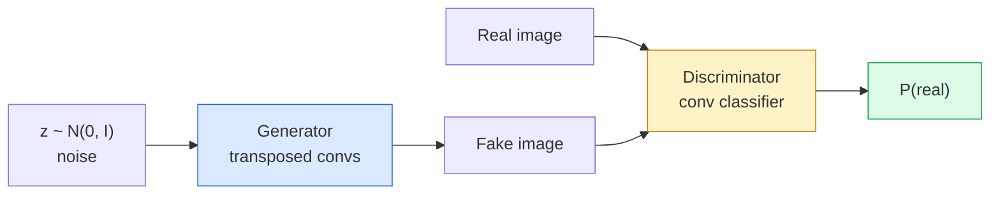
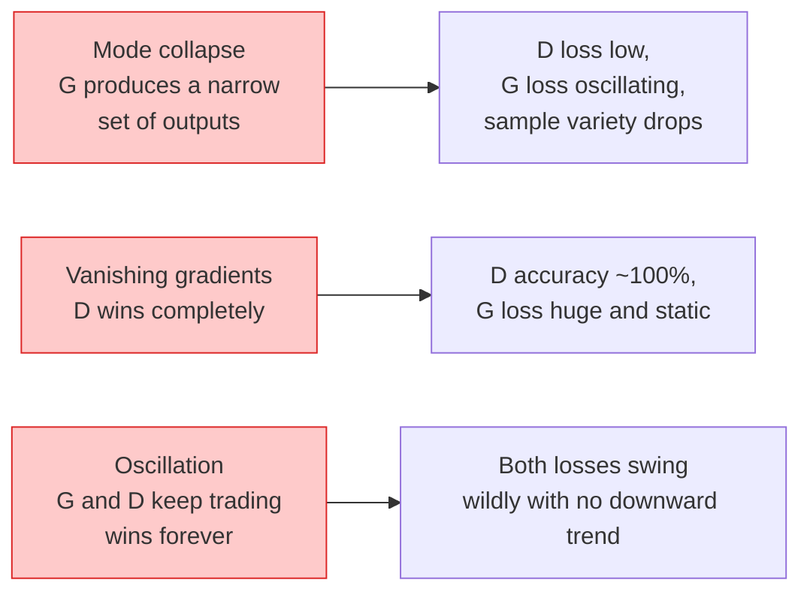

# Image Generation — GANs | 图像生成 — 生成对抗网络

> A GAN is two neural networks in a fixed game. One draws, one critiques. They get better together until the drawings fool the critic.

> **【中文解读】** GAN（生成对抗网络）是两个神经网络的博弈：生成器画画，判别器挑毛病，两者共同进步直到生成器能骗过判别器。GAN 是图像生成三大路线（GAN/VAE/Diffusion）之一，曾统治 AI 图像生成领域多年。

> **【拓展：GAN 的遗产】** GAN 在 StyleGAN（人脸生成）、CycleGAN（风格迁移）、Super-Resolution GAN（图像超分辨率）中有里程碑式应用。虽然扩散模型在 2022 年后成为图像生成的主流，GAN 的对抗训练思想仍被用于提升其他生成模型的质量。

**Type:** Build
**Languages:** Python
**Prerequisites:** Phase 4 Lesson 03 (CNNs), Phase 3 Lesson 06 (Optimizers), Phase 3 Lesson 07 (Regularization)
**Time:** ~75 minutes

## Learning Objectives

- Explain the minimax game between generator and discriminator and why the equilibrium corresponds to p_model = p_data
- Implement a DCGAN in PyTorch and get it to generate coherent 32x32 synthetic images in under 60 lines
- Stabilise GAN training with the three standard tricks: non-saturating loss, spectral norm, TTUR (two-timescale update rule)
- Read training curves that distinguish healthy convergence from mode collapse, oscillation, and discriminator-wins-completely

> **【中文解读】** 学习目标列出了完成本课后应该掌握的核心能力。建议在开始学习前先浏览目标，学完后对照检查是否达成。


## The Problem | 问题引入

Classification teaches a network to map images to labels. Generation inverts the problem: sample new images that look like they came from the same distribution. There is no "correct" output you can diff against; there is only a distribution you want to mimic.

> 分类教网络将图像映射到标签。生成反转了这个问题：采样看起来来自相同分布的新图像。没有"正确"的输出可以对比；只有一个你想要模仿的分布。

The standard loss functions (MSE, cross-entropy) cannot measure "did this sample come from the real distribution." Minimising per-pixel error produces blurry averages, not realistic samples. The breakthrough was to learn the loss: train a second network whose job is to tell real from fake, and use its judgement to push the generator.

> 标准损失函数（MSE、交叉熵）无法衡量"这个样本是否来自真实分布"。最小化逐像素误差产生模糊的平均值，而不是逼真的样本。突破是学习损失：训练第二个网络，其工作是区分真假，并用它的判断来推动生成器。

GANs (Goodfellow et al., 2014) defined that framework. By 2018 StyleGAN was producing 1024x1024 faces indistinguishable from photographs. Diffusion models have since taken the throne on quality and controllability, but every trick that makes diffusion practical — normalisation choices, latent spaces, feature losses — was first understood on GANs.

> GAN（Goodfellow 等，2014）定义了那个框架。到 2018 年 StyleGAN 已经能产生与照片无法区分的 1024x1024 面部。扩散模型此后在质量和可控性上夺得了王位，但使扩散实用的每个技巧——归一化选择、潜空间、特征损失——都是首先在 GAN 上理解的。

## The Concept | 核心概念

> **【中文解读】** 本节介绍核心概念和理论基础。掌握这些概念是后续动手实现的前提，同时也是面试和工程实践中高频考察的知识点。


### The two networks



The **generator** G takes a vector of noise `z` and outputs an image. The **discriminator** D takes an image and outputs a single scalar: the probability that the image is real.

> **生成器** G 接收噪声向量 `z` 并输出一张图像。**判别器** D 接收一张图像并输出一个标量：该图像为真实图像的概率。

### The game

G wants D to be wrong. D wants to be right. Formally:

> G 希望 D 判断错误，D 希望判断正确。形式化地：

```
min_G max_D  E_x[log D(x)] + E_z[log(1 - D(G(z)))]
```

Read right to left: D is maximising accuracy on real (`log D(real)`) and fake (`log (1 - D(fake))`) images. G is minimising D's accuracy on fakes — it wants `D(G(z))` to be high.

> 从右往左读：D 在最大化对真实图像（`log D(real)`）和假图像（`log(1 - D(fake))`）的分类准确率。G 在最小化 D 对假图像的分类准确率——它希望 `D(G(z))` 尽可能高。

Goodfellow proved that this minimax has a global equilibrium where `p_G = p_data`, D outputs 0.5 everywhere, and the Jensen-Shannon divergence between generated and real distributions is zero. The hard part is getting there.

> Goodfellow 证明了这个极小极大博弈存在全局均衡点，此时 `p_G = p_data`，D 在所有位置输出 0.5，生成分布与真实分布之间的 Jensen-Shannon 散度为零。困难的部分是如何到达那个均衡。

### Non-saturating loss

The form above is numerically unstable. Early in training, `D(G(z))` is near zero for every fake, so `log(1 - D(G(z)))` has vanishing gradients with respect to G. The fix: flip G's loss.

> 上述形式在数值上不稳定。训练早期，`D(G(z))` 对每个假样本都接近零，因此 `log(1 - D(G(z)))` 对 G 的梯度趋于消失。修复方法：翻转 G 的损失函数。

```
L_D = -E_x[log D(x)] - E_z[log(1 - D(G(z)))]
L_G = -E_z[log D(G(z))]                          # non-saturating
```

Now when `D(G(z))` is near zero, G's loss is large and its gradient is informative. Every modern GAN trains with this variant.

> 现在，当 `D(G(z))` 接近零时，G 的损失很大，梯度信息充足。每个现代 GAN 都使用这个变体训练。

### DCGAN architecture rules

Radford, Metz, Chintala (2015) distilled years of failed experiments into five rules that make GAN training stable:

> Radford、Metz、Chintala（2015）将多年失败实验的经验提炼为五条使 GAN 训练稳定的规则：

1. Replace pooling with strided convs (both nets).
   中文翻译：用步幅卷积替代池化层（两个网络都适用）。
2. Use batch norm in both generator and discriminator, except output of G and input of D.
   中文翻译：在生成器和判别器中都使用批归一化，但 G 的输出层和 D 的输入层除外。
3. Remove fully connected layers on deeper architectures.
   中文翻译：在更深的架构中移除全连接层。
4. G uses ReLU on all layers except output (tanh for output in [-1, 1]).
   中文翻译：G 在所有层使用 ReLU，输出层除外（输出层用 tanh 将值域限制在 [-1, 1]）。
5. D uses LeakyReLU (negative_slope=0.2) on all layers.
   中文翻译：D 在所有层使用 LeakyReLU（负斜率=0.2）。

Every modern conv-based GAN (StyleGAN, BigGAN, GigaGAN) still starts from these rules and replaces pieces one at a time.

> 每个现代基于卷积的 GAN（StyleGAN、BigGAN、GigaGAN）仍然从这些规则出发，逐一替换其中的组件。

### Failure modes and their signatures



- **Mode collapse**: G finds one image that fools D and produces only that. Fix: add minibatch discrimination, spectral norm, or label-conditioning.
  中文翻译：模式坍塌——G 找到一张能骗过 D 的图像，然后只生成那张。修复：添加小批量判别、谱归一化或标签条件化。
- **Discriminator wins**: D becomes too strong too fast, G's gradients vanish. Fix: smaller D, lower D learning rate, or apply label smoothing on the real labels.
  中文翻译：判别器完胜——D 变得太强太快，G 的梯度消失。修复：缩小 D、降低 D 学习率或对真实标签进行平滑。
- **Oscillation**: the two nets trade wins without ever approaching equilibrium. Fix: TTUR (D learns faster than G by a factor of 2-4), or switch to Wasserstein loss.
  中文翻译：振荡——两个网络交替占优，永远无法逼近均衡。修复：TTUR（D 比 G 快 2-4 倍）或切换到 Wasserstein 损失。

### Evaluation

GANs have no ground truth, so how do you know they are working?

> GAN 没有标准答案，那么如何判断它们是否在正常工作？

- **Sample inspection** — just look at 64 samples at the end of every epoch. Non-negotiable.
  中文翻译：样本检查——每个 epoch 结束时看 64 个样本。这是不可省略的步骤。
- **FID (Fréchet Inception Distance)** — distance between Inception-v3 feature distributions of real and generated sets. Lower is better. Community standard.
  中文翻译：FID（Fréchet Inception Distance）——真实集和生成集在 Inception-v3 特征分布之间的距离。越低越好。社区标准。
- **Inception Score** — older, more brittle; prefer FID.
  中文翻译：Inception Score——较老、较脆弱；优先使用 FID。
- **Precision/Recall for generative models** — measures quality (precision) and coverage (recall) separately. More informative than FID alone.
  中文翻译：生成模型的精确率/召回率——分别衡量质量（精确率）和覆盖度（召回率）。比单独的 FID 更有信息量。

For a small synthetic-data run, sample inspection is enough.

> 对于小规模的合成数据实验，样本检查就够了。

> **【中文解读】** 本节通过代码从零实现核心算法。这种 "from scratch" 的方式能帮助理解框架背后的原理，遇到问题时不会被黑盒困住。

> **【拓展：工业部署中的视觉系统】** 在实际工业部署中，视觉模型需要考虑推理延迟、模型大小、边缘设备适配等问题。TensorRT、ONNX Runtime、OpenVINO 是常用的推理加速工具。自动驾驶系统（如 Tesla FSD）通常在车载芯片上实时运行多个视觉模型。

> **【拓展：数据标注与质量】** 视觉任务的效果高度依赖标注数据质量。Label Studio、CVAT 是主流标注工具。在工业场景中，主动学习（Active Learning）可以减少标注成本：模型对不确定的样本请求人工标注，确定性的样本自动标注。


## Build It | 动手实现

### Step 1: Generator

A small DCGAN generator that takes 64-dim noise and produces a 32x32 image.

> 一个小型 DCGAN 生成器，接收 64 维噪声并生成 32x32 图像。

```python
import torch
import torch.nn as nn

class Generator(nn.Module):
    def __init__(self, z_dim=64, img_channels=3, feat=64):
        super().__init__()
        self.net = nn.Sequential(
            nn.ConvTranspose2d(z_dim, feat * 4, kernel_size=4, stride=1, padding=0, bias=False),
            nn.BatchNorm2d(feat * 4),
            nn.ReLU(inplace=True),
            nn.ConvTranspose2d(feat * 4, feat * 2, kernel_size=4, stride=2, padding=1, bias=False),
            nn.BatchNorm2d(feat * 2),
            nn.ReLU(inplace=True),
            nn.ConvTranspose2d(feat * 2, feat, kernel_size=4, stride=2, padding=1, bias=False),
            nn.BatchNorm2d(feat),
            nn.ReLU(inplace=True),
            nn.ConvTranspose2d(feat, img_channels, kernel_size=4, stride=2, padding=1, bias=False),
            nn.Tanh(),
        )

    def forward(self, z):
        return self.net(z.view(z.size(0), -1, 1, 1))
```

Four transposed convs, each with `kernel_size=4, stride=2, padding=1` so they cleanly double spatial size. Output activations in [-1, 1] via tanh.

> 四个转置卷积，每个使用 `kernel_size=4, stride=2, padding=1` 以便干净地将空间尺寸翻倍。通过 tanh 将输出激活值限制在 [-1, 1]。

### Step 2: Discriminator

Mirror of the generator. LeakyReLU, strided convs, ends with a scalar logit.

> 生成器的镜像。LeakyReLU、步幅卷积，最终输出一个标量 logit。

```python
class Discriminator(nn.Module):
    def __init__(self, img_channels=3, feat=64):
        super().__init__()
        self.net = nn.Sequential(
            nn.Conv2d(img_channels, feat, kernel_size=4, stride=2, padding=1),
            nn.LeakyReLU(0.2, inplace=True),
            nn.Conv2d(feat, feat * 2, kernel_size=4, stride=2, padding=1, bias=False),
            nn.BatchNorm2d(feat * 2),
            nn.LeakyReLU(0.2, inplace=True),
            nn.Conv2d(feat * 2, feat * 4, kernel_size=4, stride=2, padding=1, bias=False),
            nn.BatchNorm2d(feat * 4),
            nn.LeakyReLU(0.2, inplace=True),
            nn.Conv2d(feat * 4, 1, kernel_size=4, stride=1, padding=0),
        )

    def forward(self, x):
        return self.net(x).view(-1)
```

The last conv reduces a `4x4` feature map to `1x1`. Output is a single scalar per image; apply sigmoid only during loss computation.

> 最后一个卷积将 `4x4` 特征图缩减为 `1x1`。每张图像输出一个标量；仅在损失计算时应用 sigmoid。

### Step 3: Training step

Alternate: update D once, then G once, every batch.

> 交替进行：每个 batch 先更新 D 一次，再更新 G 一次。

```python
import torch.nn.functional as F

def train_step(G, D, real, z, opt_g, opt_d, device):
    real = real.to(device)
    bs = real.size(0)

    # D step
    opt_d.zero_grad()
    d_real = D(real)
    d_fake = D(G(z).detach())
    loss_d = (F.binary_cross_entropy_with_logits(d_real, torch.ones_like(d_real))
              + F.binary_cross_entropy_with_logits(d_fake, torch.zeros_like(d_fake)))
    loss_d.backward()
    opt_d.step()

    # G step
    opt_g.zero_grad()
    d_fake = D(G(z))
    loss_g = F.binary_cross_entropy_with_logits(d_fake, torch.ones_like(d_fake))
    loss_g.backward()
    opt_g.step()

    return loss_d.item(), loss_g.item()
```

`G(z).detach()` in the D step is critical: we do not want gradients flowing into G during its update. Forgetting that is the classic beginner bug.

> D 步骤中的 `G(z).detach()` 至关重要：我们不希望在 D 的更新过程中梯度流回 G。忘记这一点是典型的初学者 bug。

### Step 4: Full training loop on synthetic shapes

```python
from torch.utils.data import DataLoader, TensorDataset
import numpy as np

def synthetic_images(num=2000, size=32, seed=0):
    rng = np.random.default_rng(seed)
    imgs = np.zeros((num, 3, size, size), dtype=np.float32) - 1.0
    for i in range(num):
        r = rng.uniform(6, 12)
        cx, cy = rng.uniform(r, size - r, size=2)
        yy, xx = np.meshgrid(np.arange(size), np.arange(size), indexing="ij")
        mask = (xx - cx) ** 2 + (yy - cy) ** 2 < r ** 2
        color = rng.uniform(-0.5, 1.0, size=3)
        for c in range(3):
            imgs[i, c][mask] = color[c]
    return torch.from_numpy(imgs)

device = "cuda" if torch.cuda.is_available() else "cpu"
data = synthetic_images()
loader = DataLoader(TensorDataset(data), batch_size=64, shuffle=True)

G = Generator(z_dim=64, img_channels=3, feat=32).to(device)
D = Discriminator(img_channels=3, feat=32).to(device)
opt_g = torch.optim.Adam(G.parameters(), lr=2e-4, betas=(0.5, 0.999))
opt_d = torch.optim.Adam(D.parameters(), lr=2e-4, betas=(0.5, 0.999))

for epoch in range(10):
    for (batch,) in loader:
        z = torch.randn(batch.size(0), 64, device=device)
        ld, lg = train_step(G, D, batch, z, opt_g, opt_d, device)
    print(f"epoch {epoch}  D {ld:.3f}  G {lg:.3f}")
```

`Adam(lr=2e-4, betas=(0.5, 0.999))` is the DCGAN default — the low beta1 keeps the momentum term from stabilising the adversarial game too much.

> `Adam(lr=2e-4, betas=(0.5, 0.999))` 是 DCGAN 的默认配置——较低的 beta1 防止动量项过度稳定对抗博弈。

### Step 5: Sampling

```python
@torch.no_grad()
def sample(G, n=16, z_dim=64, device="cpu"):
    G.eval()
    z = torch.randn(n, z_dim, device=device)
    imgs = G(z)
    imgs = (imgs + 1) / 2
    return imgs.clamp(0, 1)
```

Always switch to eval mode before sampling. For DCGAN this matters because batch norm running stats are used instead of the batch's stats.

> 采样前务必切换到 eval 模式。对 DCGAN 来说这很重要，因为批归一化会使用运行时统计量而不是当前 batch 的统计量。

### Step 6: Spectral normalisation

A drop-in replacement for BN in the discriminator that guarantees the network is 1-Lipschitz. Fixes most "D wins too hard" failures.

> 谱归一化是判别器中批归一化的即插即用替代方案，保证网络是 1-Lipschitz 的。能修复大多数 "D 赢得太彻底" 的问题。

```python
from torch.nn.utils import spectral_norm

def build_sn_discriminator(img_channels=3, feat=64):
    return nn.Sequential(
        spectral_norm(nn.Conv2d(img_channels, feat, 4, 2, 1)),
        nn.LeakyReLU(0.2, inplace=True),
        spectral_norm(nn.Conv2d(feat, feat * 2, 4, 2, 1)),
        nn.LeakyReLU(0.2, inplace=True),
        spectral_norm(nn.Conv2d(feat * 2, feat * 4, 4, 2, 1)),
        nn.LeakyReLU(0.2, inplace=True),
        spectral_norm(nn.Conv2d(feat * 4, 1, 4, 1, 0)),
    )
```

> **【中文解读】** 本节展示如何用成熟框架（如 PyTorch、HuggingFace 等）快速应用该技术。在实际项目中，优先使用经过验证的框架实现，可以减少 bug 并提高开发效率。


Swap `Discriminator` for `build_sn_discriminator()` and you often do not need the TTUR trick. Spectral norm is the easiest single robustness upgrade you can apply.

> 将 `Discriminator` 替换为 `build_sn_discriminator()` 后通常就不需要 TTUR 技巧了。谱归一化是你能应用的最简单的单一鲁棒性升级。


> **【拓展：视觉模型的持续学习】** 在生产环境中，视觉模型需要不断适应新数据（新产品、新场景、新光照条件）。持续学习（Continual Learning）技术可以防止模型在适应新数据时遗忘旧知识。这在自动驾驶和工业质检中尤为重要。

## Use It | 用框架实现

For serious generation, use pretrained weights or switch to diffusion. Two standard libraries:

- `torch_fidelity` computes FID / IS on your generator without writing custom eval code.
- `pytorch-gan-zoo` (legacy) and `StudioGAN` ship tested implementations of DCGAN, WGAN-GP, SN-GAN, StyleGAN, and BigGAN.

In 2026, GANs are still the best choice for: real-time image generation (latency <10 ms), style transfer, image-to-image translation with precise control (Pix2Pix, CycleGAN). Diffusion wins on photorealism and text conditioning.

> **【中文解读】** 本节关注如何将模型部署为可用的产品。从原型到生产级系统需要考虑性能优化、错误处理、监控等多个维度。


## Ship It | 产出物

This lesson produces:

- `outputs/prompt-gan-training-triage.md` — a prompt that reads a training curve description and picks the failure mode (mode collapse, D-wins, oscillation) plus the single recommended fix.
- `outputs/skill-dcgan-scaffold.md` — a skill that writes a DCGAN scaffold from `z_dim`, target `image_size`, and `num_channels`, including training loop and sample saver.

> **【中文解读】** 练习题按照 Easy/Medium/Hard 三个难度递进。建议至少完成 Medium 级别的题目，Hard 级别适合深入研究或面试准备。


## Exercises | 练习题

1. **(Easy)** Train the DCGAN above on the synthetic circle dataset and save a grid of 16 samples at the end of each epoch. By which epoch do the generated circles become clearly circular?
2. **(Medium)** Replace the discriminator's batch norm with spectral norm. Train both versions side by side. Which one converges faster? Which one has lower variance across three seeds?
3. **(Hard)** Implement a conditional DCGAN: feed the class label into both G and D (concat one-hot to the noise in G, concat a class embedding channel in D). Train on the synthetic "circles vs squares" dataset from lesson 7 and show that class conditioning works by sampling with specific labels.

> **【中文解读】** 术语表中的 "What people say" vs "What it actually means" 区分了日常口语和精确技术含义。在团队协作中，统一术语定义可以避免大量沟通误解。


## Key Terms | 术语速查表

| Term | What people say | What it actually means |
|------|----------------|----------------------|
| Generator (G) | "The draws-stuff net" | Maps noise to images; trained to fool the discriminator |
| Discriminator (D) | "The critic" | Binary classifier; trained to distinguish real from generated images |
| Minimax | "The game" | min over G, max over D of an adversarial loss; equilibrium is p_G = p_data |
| Non-saturating loss | "The numerically sane version" | G's loss is -log(D(G(z))) instead of log(1 - D(G(z))) to avoid vanishing gradients early in training |
| Mode collapse | "Generator makes one thing" | G produces only a small subset of the data distribution; fix with SN, minibatch discrimination, or larger batch |
| TTUR | "Two learning rates" | D learns faster than G, typically by a factor of 2-4; stabilises training |
| Spectral norm | "1-Lipschitz layer" | A weight-normalisation that bounds each layer's Lipschitz constant; stops D from becoming arbitrarily steep |
| FID | "Fréchet Inception Distance" | Distance between Inception-v3 feature distributions of real and generated sets; the standard evaluation metric |

> **【中文解读】** 延伸阅读提供了深入学习的高质量资源。这些论文和教程是该领域的经典参考文献，适合需要深入理解的读者。


## Further Reading | 延伸阅读

- [Generative Adversarial Networks (Goodfellow et al., 2014)](https://arxiv.org/abs/1406.2661) — the paper that started it all
- [DCGAN (Radford, Metz, Chintala, 2015)](https://arxiv.org/abs/1511.06434) — the architecture rules that made GANs trainable
- [Spectral Normalization for GANs (Miyato et al., 2018)](https://arxiv.org/abs/1802.05957) — the single most useful stabilisation trick
- [StyleGAN3 (Karras et al., 2021)](https://arxiv.org/abs/2106.12423) — the SOTA GAN; reads like a greatest-hits album of every trick from the last decade
