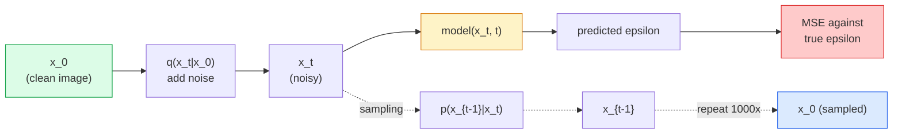

# Image Generation — Diffusion Models | 图像生成 — 扩散模型

> A diffusion model learns to denoise. Train it to remove a tiny bit of noise from a noisy image, repeat that backwards a thousand times, and you have an image generator.

> **【中文解读】** 扩散模型学习去噪：训练网络从加了一点噪的图像中去除噪声，反向重复一千次就能从纯噪声生成图像。扩散模型是 Stable Diffusion、DALL-E、Midjourney 等图像生成工具的核心技术。

> **【拓展：扩散模型的革命】** 扩散模型在 2022 年后取代 GAN 成为图像生成的主流。Stable Diffusion 使用潜在空间扩散（Latent Diffusion）大幅降低计算成本，DDIM 采样器将推理步数从 1000 步降至 20 步。扩散模型也被应用于视频生成（Sora）、3D 生成、音频生成等领域。

**Type:** Build | **类型:** 动手
**Languages:** Python | **语言:** Python
**Prerequisites:** Phase 4 Lesson 07 (U-Net), Phase 1 Lesson 06 (Probability), Phase 3 Lesson 06 (Optimizers) | **前置知识:** Phase 4 Lesson 07（U-Net），Phase 1 Lesson 06（概率），Phase 3 Lesson 06（优化器）
**Time:** ~75 minutes | **时间:** ~75 分钟

## Learning Objectives | 学习目标

- Derive the forward noising process `x_0 -> x_1 -> ... -> x_T` and explain why the closed-form `q(x_t | x_0)` holds for any t
- Implement a DDPM-style training objective that regresses the noise added at each step, and a sampler that walks back from pure noise to an image
- Build a time-conditioned U-Net (small enough to train on CPU) that predicts the noise for any timestep
- Explain the difference between DDPM and DDIM sampling, and when each is appropriate (Lesson 23 covers flow matching and rectified flow in depth)

> **【中文解读】** 学习目标列出了完成本课后应该掌握的核心能力。建议在开始学习前先浏览目标，学完后对照检查是否达成。


## The Problem | 问题引入

GANs generate one-shot: noise in, image out, one forward pass. They are fast and hard to train. Diffusion models generate iteratively: start from pure noise, denoise in small steps, image emerges. They are slow and easy to train. For the last five years the latter property has dominated: any small team can train a diffusion model and get reasonable samples; GAN training is a craft you learn over years of failed runs.

> GAN 一次性生成：噪声输入、图像输出、一次前向传播。它们速度快但难以训练。扩散模型迭代生成：从纯噪声开始，小步去噪，图像逐渐显现。它们速度慢但容易训练。过去五年后者占据了主导地位：任何小团队都能训练扩散模型并获得合理样本；GAN 训练是需要多年失败运行才能掌握的工艺。

Beyond training stability, diffusion's iterative structure is what unlocks everything modern image generation does: text conditioning, inpainting, image editing, super-resolution, controllable style. Each step of the sampling loop is a place to inject a new constraint. That hook is why Stable Diffusion, Imagen, DALL-E 3, Midjourney, and every controllable image model you will use are all diffusion-based.

> 除了训练稳定性，扩散的迭代结构解锁了现代图像生成所做的一切：文本条件化、图像修复、图像编辑、超分辨率、可控风格。采样循环的每一步都是注入新约束的地方。这个钩子就是为什么 Stable Diffusion、Imagen、DALL-E 3、Midjourney 和你将使用的每个可控图像模型都是基于扩散的。

This lesson builds the minimal DDPM: forward noising, backward denoising, training loop. The next lesson (Stable Diffusion) wires it into a production system with a VAE, a text encoder, and classifier-free guidance.

> 本课构建最小 DDPM：前向加噪、后向去噪、训练循环。下一课（Stable Diffusion）将它接入生产系统，包含 VAE、文本编码器和无分类器引导。

## The Concept | 核心概念

> **【中文解读】** 本节介绍核心概念和理论基础。掌握这些概念是后续动手实现的前提，同时也是面试和工程实践中高频考察的知识点。


### The forward process

Take an image `x_0`. Add a tiny amount of Gaussian noise to get `x_1`. Add a tiny amount more to get `x_2`. Keep going for T steps until `x_T` is nearly indistinguishable from pure Gaussian noise.

> 取一张图像 `x_0`，加一点高斯噪声得到 `x_1`，再加一点得到 `x_2`，持续 T 步直到 `x_T` 与纯高斯噪声几乎无法区分。

```
q(x_t | x_{t-1}) = N(x_t; sqrt(1 - beta_t) * x_{t-1},  beta_t * I)
```

`beta_t` is a small variance schedule, typically linear from 0.0001 to 0.02 over T=1000 steps. Each step slightly shrinks the signal and injects fresh noise.

> `beta_t` 是一个小的方差调度，通常在 T=1000 步内从 0.0001 线性增长到 0.02。每一步略微缩小信号并注入新噪声。

### The closed-form jump

Adding noise one step at a time is a Markov chain, but the math folds: you can sample `x_t` directly from `x_0` in one step.

> 一步一步加噪是一个马尔可夫链，但数学上可以折叠：你可以一步直接从 `x_0` 采样 `x_t`。

```
Define alpha_t = 1 - beta_t
Define alpha_bar_t = prod_{s=1..t} alpha_s

Then:
  q(x_t | x_0) = N(x_t; sqrt(alpha_bar_t) * x_0,  (1 - alpha_bar_t) * I)

Equivalently:
  x_t = sqrt(alpha_bar_t) * x_0 + sqrt(1 - alpha_bar_t) * epsilon
  where epsilon ~ N(0, I)
```

This single equation is the whole reason diffusion is practical. During training you pick a random `t`, sample `x_t` directly from `x_0`, and train in one step — no simulation of the full Markov chain needed.

> 这一个方程就是扩散模型实用的全部原因。训练时你随机选一个 `t`，直接从 `x_0` 采样 `x_t`，一步完成训练——无需模拟完整的马尔可夫链。

### The reverse process

The forward process is fixed. The reverse process `p(x_{t-1} | x_t)` is what the neural network learns. Diffusion models do not predict `x_{t-1}` directly; they predict the noise `epsilon` added at step t, and the math derives `x_{t-1}` from it.

> 前向过程是固定的。反向过程 `p(x_{t-1} | x_t)` 是神经网络要学习的。扩散模型不直接预测 `x_{t-1}`；它们预测第 t 步添加的噪声 `epsilon`，然后通过数学推导得到 `x_{t-1}`。



### The training loss

For every training step:

> 每个训练步骤：

1. Sample a real image `x_0`.
   中文翻译：采样一张真实图像 `x_0`。
2. Sample a timestep `t` uniformly from [1, T].
   中文翻译：从 [1, T] 中均匀采样一个时间步 `t`。
3. Sample noise `epsilon ~ N(0, I)`.
   中文翻译：采样噪声 `epsilon ~ N(0, I)`。
4. Compute `x_t = sqrt(alpha_bar_t) * x_0 + sqrt(1 - alpha_bar_t) * epsilon`.
   中文翻译：计算 `x_t = sqrt(alpha_bar_t) * x_0 + sqrt(1 - alpha_bar_t) * epsilon`。
5. Predict `epsilon_theta(x_t, t)` with the network.
   中文翻译：用网络预测 `epsilon_theta(x_t, t)`。
6. Minimise `|| epsilon - epsilon_theta(x_t, t) ||^2`.
   中文翻译：最小化 `|| epsilon - epsilon_theta(x_t, t) ||^2`。

That is it. The neural network learns to predict the noise at any timestep. The loss is MSE. There is no adversarial game, no collapse, no oscillation.

> 就是这样。神经网络学习预测任意时间步的噪声。损失函数是 MSE。没有对抗博弈，没有模式坍塌，没有振荡。

### The sampler (DDPM)

To generate: start from `x_T ~ N(0, I)` and walk backwards one step at a time.

```
for t = T, T-1, ..., 1:
    eps = model(x_t, t)
    x_{t-1} = (1 / sqrt(alpha_t)) * (x_t - (beta_t / sqrt(1 - alpha_bar_t)) * eps) + sqrt(beta_t) * z
    where z ~ N(0, I) if t > 1, else 0
return x_0
```

The key is that even though the reverse conditional is not known in closed form in general, for this specific Gaussian forward process it is. The ugly-looking coefficients are what Bayes' rule gives you.

> 关键在于，虽然一般情况下反向条件概率没有闭合形式的解，但对于这个特定的高斯前向过程是有的。那些看起来丑陋的系数正是贝叶斯法则给出的结果。

### Why 1000 steps

The forward noise schedule is chosen so each step adds just enough noise that the reverse step is nearly Gaussian. Too few steps and the reverse step is far from Gaussian, the network cannot model it well. Too many steps and sampling becomes expensive with diminishing gain. T=1000 with a linear schedule is the DDPM default.

> 前向噪声调度的设计使得每一步只加足够少的噪声，从而反向步骤近似高斯的。步数太少则反向步骤远离高斯分布，网络无法很好地建模；步数太多则采样变得昂贵且收益递减。T=1000 配合线性调度是 DDPM 的默认设置。

### DDIM: 20x faster sampling

Training is the same. Sampling changes. DDIM (Song et al., 2020) defines a deterministic reverse process that skips timesteps without retraining. Sampling in 50 steps with DDIM gives near-1000-step DDPM quality. Every production system uses DDIM or an even faster variant (DPM-Solver, Euler ancestral).

> 训练方式不变，采样方式改变。DDIM（Song 等，2020）定义了一个确定性的反向过程，可以跳过时间步而无需重新训练。用 DDIM 50 步采样能达到接近 1000 步 DDPM 的质量。每个生产系统都使用 DDIM 或更快的变体（DPM-Solver、Euler ancestral）。

### Time conditioning

The network `epsilon_theta(x_t, t)` needs to know which timestep it is denoising. Modern diffusion models inject `t` via sinusoidal time embeddings (same idea as positional encoding in transformers) that get added to feature maps at every U-Net level.

> 网络 `epsilon_theta(x_t, t)` 需要知道它在去噪哪个时间步。现代扩散模型通过正弦时间嵌入（与 Transformer 中的位置编码思路相同）注入 `t`，在每个 U-Net 层级的特征图上相加。

```
t_embedding = sinusoidal(t)
feature_map += MLP(t_embedding)
```

Without time conditioning the network has to guess the noise level from the image itself, which works but is much less sample-efficient.

> 没有时间条件化，网络必须从图像本身猜测噪声水平，这样虽然能工作但样本效率低得多。

> **【拓展：工业部署中的视觉系统】** 在实际工业部署中，视觉模型需要考虑推理延迟、模型大小、边缘设备适配等问题。TensorRT、ONNX Runtime、OpenVINO 是常用的推理加速工具。自动驾驶系统（如 Tesla FSD）通常在车载芯片上实时运行多个视觉模型。

> **【拓展：数据标注与质量】** 视觉任务的效果高度依赖标注数据质量。Label Studio、CVAT 是主流标注工具。在工业场景中，主动学习（Active Learning）可以减少标注成本：模型对不确定的样本请求人工标注，确定性的样本自动标注。


## Build It | 动手实现

> **【中文解读】** 本节通过代码从零实现核心算法。这种 "from scratch" 的方式能帮助理解框架背后的原理，遇到问题时不会被黑盒困住。


### Step 1: Noise schedule

```python
import torch

def linear_beta_schedule(T=1000, beta_start=1e-4, beta_end=2e-2):
    return torch.linspace(beta_start, beta_end, T)


def precompute_schedule(betas):
    alphas = 1.0 - betas
    alphas_cumprod = torch.cumprod(alphas, dim=0)
    return {
        "betas": betas,
        "alphas": alphas,
        "alphas_cumprod": alphas_cumprod,
        "sqrt_alphas_cumprod": torch.sqrt(alphas_cumprod),
        "sqrt_one_minus_alphas_cumprod": torch.sqrt(1.0 - alphas_cumprod),
        "sqrt_recip_alphas": torch.sqrt(1.0 / alphas),
    }

schedule = precompute_schedule(linear_beta_schedule(T=1000))
```

Precompute once, gather by index during training and sampling.

> 预计算一次，训练和采样时通过索引取用。

### Step 2: Forward diffusion (q_sample)

```python
def q_sample(x0, t, noise, schedule):
    sqrt_a = schedule["sqrt_alphas_cumprod"][t].view(-1, 1, 1, 1)
    sqrt_one_minus_a = schedule["sqrt_one_minus_alphas_cumprod"][t].view(-1, 1, 1, 1)
    return sqrt_a * x0 + sqrt_one_minus_a * noise
```

One-line closed form. `t` is a batch of timesteps, one per image in the batch.

> 一行闭合形式。`t` 是一批时间步，每张图像一个。

### Step 3: A tiny time-conditioned U-Net

```python
import torch.nn as nn
import torch.nn.functional as F
import math

def timestep_embedding(t, dim=64):
    half = dim // 2
    freqs = torch.exp(-math.log(10000) * torch.arange(half, device=t.device) / half)
    args = t[:, None].float() * freqs[None]
    emb = torch.cat([args.sin(), args.cos()], dim=-1)
    return emb


class TinyUNet(nn.Module):
    def __init__(self, img_channels=3, base=32, t_dim=64):
        super().__init__()
        self.t_mlp = nn.Sequential(
            nn.Linear(t_dim, base * 4),
            nn.SiLU(),
            nn.Linear(base * 4, base * 4),
        )
        self.t_dim = t_dim
        self.enc1 = nn.Conv2d(img_channels, base, 3, padding=1)
        self.enc2 = nn.Conv2d(base, base * 2, 4, stride=2, padding=1)
        self.mid = nn.Conv2d(base * 2, base * 2, 3, padding=1)
        self.dec1 = nn.ConvTranspose2d(base * 2, base, 4, stride=2, padding=1)
        self.dec2 = nn.Conv2d(base * 2, img_channels, 3, padding=1)
        self.time_proj = nn.Linear(base * 4, base * 2)

    def forward(self, x, t):
        t_emb = timestep_embedding(t, self.t_dim)
        t_emb = self.t_mlp(t_emb)
        t_proj = self.time_proj(t_emb)[:, :, None, None]

        h1 = F.silu(self.enc1(x))
        h2 = F.silu(self.enc2(h1)) + t_proj
        h3 = F.silu(self.mid(h2))
        d1 = F.silu(self.dec1(h3))
        d2 = torch.cat([d1, h1], dim=1)
        return self.dec2(d2)
```

Two-level U-Net with time conditioning injected at the bottleneck. Scale up the depth and width for real images.

> 两层 U-Net，在瓶颈层注入时间条件化。对于真实图像，可以增加深度和宽度。

### Step 4: Training loop

```python
def train_step(model, x0, schedule, optimizer, device, T=1000):
    model.train()
    x0 = x0.to(device)
    bs = x0.size(0)
    t = torch.randint(0, T, (bs,), device=device)
    noise = torch.randn_like(x0)
    x_t = q_sample(x0, t, noise, schedule)
    pred = model(x_t, t)
    loss = F.mse_loss(pred, noise)
    optimizer.zero_grad()
    loss.backward()
    optimizer.step()
    return loss.item()
```

That is the entire training loop. No GAN game, no specialised loss, one MSE call.

> 这就是整个训练循环。没有 GAN 对抗博弈，没有特殊损失函数，只需要一个 MSE 调用。

### Step 5: Sampler (DDPM)

```python
@torch.no_grad()
def sample(model, schedule, shape, T=1000, device="cpu"):
    model.eval()
    x = torch.randn(shape, device=device)
    betas = schedule["betas"].to(device)
    sqrt_one_minus_a = schedule["sqrt_one_minus_alphas_cumprod"].to(device)
    sqrt_recip_alphas = schedule["sqrt_recip_alphas"].to(device)

    for t in reversed(range(T)):
        t_batch = torch.full((shape[0],), t, dtype=torch.long, device=device)
        eps = model(x, t_batch)
        coef = betas[t] / sqrt_one_minus_a[t]
        mean = sqrt_recip_alphas[t] * (x - coef * eps)
        if t > 0:
            x = mean + torch.sqrt(betas[t]) * torch.randn_like(x)
        else:
            x = mean
    return x
```

1000 forward passes to produce one batch of samples. In real code you would swap this for a DDIM 50-step sampler.

> 1000 次前向传播才能生成一批样本。在实际代码中，你会换成 DDIM 50 步采样器。

### Step 6: DDIM sampler (deterministic, ~20x faster)

```python
@torch.no_grad()
def sample_ddim(model, schedule, shape, steps=50, T=1000, device="cpu", eta=0.0):
    model.eval()
    x = torch.randn(shape, device=device)
    alphas_cumprod = schedule["alphas_cumprod"].to(device)

    ts = torch.linspace(T - 1, 0, steps + 1).long()
    for i in range(steps):
        t = ts[i]
        t_prev = ts[i + 1]
        t_batch = torch.full((shape[0],), t, dtype=torch.long, device=device)
        eps = model(x, t_batch)
        a_t = alphas_cumprod[t]
        a_prev = alphas_cumprod[t_prev] if t_prev >= 0 else torch.tensor(1.0, device=device)
        x0_pred = (x - torch.sqrt(1 - a_t) * eps) / torch.sqrt(a_t)
        sigma = eta * torch.sqrt((1 - a_prev) / (1 - a_t) * (1 - a_t / a_prev))
        dir_xt = torch.sqrt(1 - a_prev - sigma ** 2) * eps
        noise = sigma * torch.randn_like(x) if eta > 0 else 0
        x = torch.sqrt(a_prev) * x0_pred + dir_xt + noise
    return x
```

> **【中文解读】** 本节展示如何用成熟框架（如 PyTorch、HuggingFace 等）快速应用该技术。在实际项目中，优先使用经过验证的框架实现，可以减少 bug 并提高开发效率。


`eta=0` is fully deterministic (same noise input always produces the same output). `eta=1` recovers DDPM.

> `eta=0` 是完全确定性的（相同噪声输入始终产生相同输出）。`eta=1` 则退化为 DDPM。


> **【拓展：视觉模型的持续学习】** 在生产环境中，视觉模型需要不断适应新数据（新产品、新场景、新光照条件）。持续学习（Continual Learning）技术可以防止模型在适应新数据时遗忘旧知识。这在自动驾驶和工业质检中尤为重要。

## Use It | 用框架实现

For production work, use `diffusers`:

```python
from diffusers import DDPMScheduler, UNet2DModel

unet = UNet2DModel(sample_size=32, in_channels=3, out_channels=3, layers_per_block=2)
scheduler = DDPMScheduler(num_train_timesteps=1000)
```

The library ships ready-made schedulers (DDPM, DDIM, DPM-Solver, Euler, Heun), configurable U-Nets, pipelines for text-to-image and image-to-image, and LoRA fine-tuning helpers.

For research, `k-diffusion` (Katherine Crowson) has the most faithful reference implementations and the best sampling variants.

> **【中文解读】** 本节关注如何将模型部署为可用的产品。从原型到生产级系统需要考虑性能优化、错误处理、监控等多个维度。


## Ship It | 产出物

This lesson produces:

- `outputs/prompt-diffusion-sampler-picker.md` — a prompt that picks DDPM / DDIM / DPM-Solver / Euler based on quality target, latency budget, and conditioning type.
- `outputs/skill-noise-schedule-designer.md` — a skill that produces a linear, cosine, or sigmoid beta schedule given T and target corruption level, plus diagnostic plots of signal-to-noise ratio over time.

> **【中文解读】** 练习题按照 Easy/Medium/Hard 三个难度递进。建议至少完成 Medium 级别的题目，Hard 级别适合深入研究或面试准备。


## Exercises | 练习题

1. **(Easy)** Visualise the forward process: take one image and plot `x_t` at `t in [0, 100, 250, 500, 750, 1000]`. Verify that `x_1000` looks like pure Gaussian noise.
2. **(Medium)** Train the TinyUNet on the synthetic-circles dataset for 20 epochs and sample 16 circles. Compare DDPM (1000 steps) and DDIM (50 steps) sampling — do they produce similar images from the same noise seed?
3. **(Hard)** Implement a cosine noise schedule (Nichol & Dhariwal, 2021): `alpha_bar_t = cos^2((t/T + s) / (1 + s) * pi / 2)`. Train the same model with linear and cosine schedules and show that cosine gives better samples at low step counts.

> **【中文解读】** 术语表中的 "What people say" vs "What it actually means" 区分了日常口语和精确技术含义。在团队协作中，统一术语定义可以避免大量沟通误解。


## Key Terms | 术语速查表

| Term | What people say | What it actually means |
|------|----------------|----------------------|
| Forward process | "Add noise over time" | Fixed Markov chain that corrupts an image into Gaussian noise over T steps |
| Reverse process | "Denoise step by step" | Learned distribution that walks back from noise to image |
| Epsilon prediction | "Predict the noise" | The training target: `epsilon_theta(x_t, t)` predicts the noise added at step t |
| Beta schedule | "Noise amounts" | Sequence of T small variances that define how much noise enters per step |
| alpha_bar_t | "Cumulative retain factor" | Product of (1 - beta_s) up to time t; bigger t means less signal left |
| DDPM sampler | "Ancestral, stochastic" | Samples each x_{t-1} from its conditional Gaussian; 1000 steps |
| DDIM sampler | "Deterministic, fast" | Rewrites sampling as a deterministic ODE; 20-100 steps with similar quality |
| Time conditioning | "Tell the model which t" | Sinusoidal embedding of t injected into the U-Net so it knows the noise level |

> **【中文解读】** 延伸阅读提供了深入学习的高质量资源。这些论文和教程是该领域的经典参考文献，适合需要深入理解的读者。


## Further Reading | 延伸阅读

- [Denoising Diffusion Probabilistic Models (Ho et al., 2020)](https://arxiv.org/abs/2006.11239) — the paper that made diffusion practical and beat GANs on FID
- [Improved DDPM (Nichol & Dhariwal, 2021)](https://arxiv.org/abs/2102.09672) — cosine schedule and v-parameterisation
- [DDIM (Song, Meng, Ermon, 2020)](https://arxiv.org/abs/2010.02502) — the deterministic sampler that made real-time inference possible
- [Elucidating the Design Space of Diffusion (Karras et al., 2022)](https://arxiv.org/abs/2206.00364) — a unified view of every diffusion design choice; current best reference
