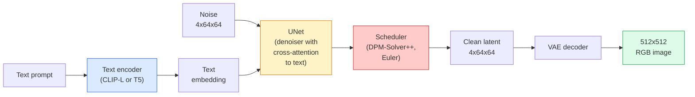

# Stable Diffusion — Architecture & Fine-Tuning | Stable Diffusion — 架构与微调

> Stable Diffusion is a DDPM that runs in the latent space of a pretrained VAE, conditioned on text via cross-attention, sampled with a fast deterministic ODE solver, and steered by classifier-free guidance.

> **【中文解读】** Stable Diffusion 是在预训练 VAE 的潜在空间中运行的扩散模型，通过交叉注意力（cross-attention）接受文本条件，使用快速确定性 ODE 求解器采样，并通过无分类器引导（classifier-free guidance）控制生成质量。它是 AIGC（AI 生成内容）领域最重要的开源模型之一。

> **【拓展：Stable Diffusion 生态】** Stable Diffusion 衍生出了 LoRA（轻量微调）、ControlNet（控制姿态/边缘）、IP-Adapter（图像提示）等丰富生态。LoRA 微调只需几张图片和消费级 GPU 即可定制风格，使 AI 绘画走进了千家万户。SDXL、SD3、FLUX 等后续版本不断推动图像质量提升。

**Type:** Learn + Use | **类型:** 学习 + 应用
**Languages:** Python | **语言:** Python
**Prerequisites:** Phase 4 Lesson 10 (Diffusion), Phase 7 Lesson 02 (Self-Attention) | **前置知识:** Phase 4 Lesson 10（扩散模型），Phase 7 Lesson 02（自注意力）
**Time:** ~75 minutes | **时间:** ~75 分钟

## Learning Objectives | 学习目标

- Trace the five pieces of a Stable Diffusion pipeline: VAE, text encoder, U-Net, scheduler, safety checker — and what each of them actually does
- Explain latent diffusion and why training in a 4x64x64 latent space (instead of a 3x512x512 image) reduces compute by 48x without quality loss
- Use `diffusers` to generate images, run image-to-image, inpainting, and ControlNet-guided generation
- Fine-tune Stable Diffusion with LoRA on a small custom dataset and load the LoRA adapter at inference

> **【中文解读】** 学习目标列出了完成本课后应该掌握的核心能力。建议在开始学习前先浏览目标，学完后对照检查是否达成。


## The Problem | 问题引入

Training a DDPM directly on 512x512 RGB images is expensive. Every training step backprops through a U-Net that sees 3x512x512 = 786,432 input values, and sampling takes 50+ forward passes through that same U-Net. At the quality level of Stable Diffusion 1.5 (released 2022), pixel-space diffusion would need roughly 256 GPU-months of training and 10-30 seconds per image on a consumer GPU.

> 直接在 512x512 RGB 图像上训练 DDPM 很昂贵。每个训练步骤都要通过一个看到 3x512x512 = 786,432 个输入值的 U-Net 反向传播，采样需要通过同一个 U-Net 进行 50+ 次前向传播。在 Stable Diffusion 1.5（2022 年发布）的质量水平上，像素空间扩散大约需要 256 个 GPU 月的训练时间，消费级 GPU 上每张图像需要 10-30 秒。

The trick that made open-weight text-to-image practical was **latent diffusion** (Rombach et al., CVPR 2022). Train a VAE that maps a 3x512x512 image to a 4x64x64 latent tensor and back, then do the diffusion in that latent space. Compute drops by `(3*512*512)/(4*64*64) = 48x`. Sampling drops from tens of seconds to under two seconds on the same GPU.

> 使开放权重文本到图像变得实用的技巧是**潜空间扩散**（Rombach 等，CVPR 2022）。训练一个 VAE 将 3x512x512 图像映射到 4x64x64 潜张量并还原，然后在那个潜空间中做扩散。计算量降低 `(3*512*512)/(4*64*64) = 48x`。在同一 GPU 上采样从几十秒降到两秒以内。

Almost every modern image-generation model — SDXL, SD3, FLUX, HunyuanDiT, Wan-Video — is a latent diffusion model with variations on the autoencoder, the denoiser (U-Net or DiT), and the text conditioning. Learn Stable Diffusion and you have learnt the template.

> 几乎每个现代图像生成模型——SDXL、SD3、FLUX、HunyuanDiT、Wan-Video——都是潜空间扩散模型，在自编码器、去噪器（U-Net 或 DiT）和文本条件化上有所不同。学会 Stable Diffusion 就学会了模板。

## The Concept | 核心概念

> **【中文解读】** 本节介绍核心概念和理论基础。掌握这些概念是后续动手实现的前提，同时也是面试和工程实践中高频考察的知识点。


### The pipeline



- **VAE** — frozen autoencoder. Encoder turns image into latents (used for img2img and training). Decoder turns latents back into an image.
  中文翻译：VAE——冻结的自编码器。编码器将图像转换为潜变量（用于 img2img 和训练），解码器将潜变量还原为图像。
- **Text encoder** — CLIP text encoder (SD 1.x/2.x), CLIP-L + CLIP-G (SDXL), or T5-XXL (SD3/FLUX). Produces a sequence of token embeddings.
  中文翻译：文本编码器——CLIP 文本编码器（SD 1.x/2.x）、CLIP-L + CLIP-G（SDXL）或 T5-XXL（SD3/FLUX）。产生一系列 token 嵌入。
- **U-Net** — the denoiser. Has cross-attention layers that attend from latents to the text embedding at every resolution level.
  中文翻译：U-Net——去噪器。包含交叉注意力层，在每个分辨率级别上从潜变量关注文本嵌入。
- **Scheduler** — the sampling algorithm (DDIM, Euler, DPM-Solver++). Picks sigmas, blends predicted noise back into the latent.
  中文翻译：调度器——采样算法（DDIM、Euler、DPM-Solver++）。选择 sigma 值，将预测的噪声混合回潜变量。
- **Safety checker** — optional NSFW / illegal-content filter on the output image.
  中文翻译：安全检查器——可选的 NSFW / 违规内容过滤器，作用于输出图像。

### Classifier-free guidance (CFG)

Plain text conditioning learns `epsilon_theta(x_t, t, c)` for every prompt `c`. CFG trains the same network with `c` dropped 10% of the time (replaced by an empty embedding), giving a single model that predicts both the conditional and the unconditional noise. At inference:

> 纯文本条件化学习 `epsilon_theta(x_t, t, c)` 对每个提示词 `c`。CFG 训练同一个网络时 10% 的时间丢弃 `c`（替换为空嵌入），得到一个同时预测条件噪声和无条件噪声的模型。推理时：

```
eps = eps_uncond + w * (eps_cond - eps_uncond)
```

`w` is the guidance scale. `w=0` is unconditional, `w=1` is plain conditional, `w>1` pushes the output toward being "more conditioned on the prompt" at the cost of diversity. SD default is `w=7.5`.

> `w` 是引导尺度。`w=0` 是无条件生成，`w=1` 是普通条件生成，`w>1` 以牺牲多样性为代价推动输出更"符合提示词"。SD 默认值是 `w=7.5`。

CFG is the reason text-to-image works at production quality. Without it, prompts bias the output weakly; with it, prompts dominate.

> CFG 是文本到图像能在生产级质量下工作的原因。没有它，提示词对输出的影响很弱；有了它，提示词占据主导地位。

### Latent space geometry

The VAE's 4-channel latent is not just a compressed image. It is a manifold where arithmetic roughly corresponds to semantic edits (prompt engineering + interpolation both live here), and where the diffusion U-Net has been trained to spend its entire modelling budget. Decoding a random 4x64x64 latent does not produce a random-looking image — it produces garbage, because only a specific submanifold of latents decodes to valid images.

> VAE 的 4 通道潜变量不仅仅是压缩图像。它是一个流形，其上的算术运算大致对应语义编辑（提示词工程和插值都发生在这里），也是扩散 U-Net 训练时投入全部建模预算的地方。解码一个随机的 4x64x64 潜变量不会产生看起来随机的图像——它产生垃圾，因为只有潜变量的特定子流形才能解码为有效图像。

Two consequences:

> 两个后果：

1. **Img2img** = encode image to latent, add partial noise, run the denoiser, decode. Image structure survives because encoding is near-invertible; content changes based on the prompt.
   中文翻译：**Img2img** = 将图像编码为潜变量，添加部分噪声，运行去噪器，解码。图像结构保留，因为编码近似可逆；内容根据提示词改变。
2. **Inpainting** = same as img2img but the denoiser only updates masked regions; unmasked regions are kept at the encoded latent.
   中文翻译：**Inpainting** = 与 img2img 相同，但去噪器只更新掩码区域；未掩码区域保持为编码后的潜变量。

### The U-Net architecture

The SD U-Net is a big version of the TinyUNet from Lesson 10 with three additions:

> SD 的 U-Net 是第 10 课 TinyUNet 的大版本，增加了三个组件：

- **Transformer blocks** at every spatial resolution, containing self-attention + cross-attention to the text embedding.
  中文翻译：每个空间分辨率上的 Transformer 块，包含自注意力 + 对文本嵌入的交叉注意力。
- **Time embedding** via MLP on sinusoidal encoding.
  中文翻译：通过 MLP 处理正弦编码的时间嵌入。
- **Skip connections** between encoder and decoder at matching resolutions.
  中文翻译：编码器和解码器在匹配分辨率之间的跳跃连接。

Total parameters in SD 1.5: ~860M. SDXL: ~2.6B. FLUX: ~12B. The jump in params is mostly in attention layers.

> SD 1.5 总参数量约 8.6 亿。SDXL 约 26 亿。FLUX 约 120 亿。参数量的增长主要来自注意力层。

### LoRA fine-tuning

Full fine-tuning of Stable Diffusion needs 20+ GB of VRAM and updates 860M parameters. LoRA (Low-Rank Adaptation) keeps the base model frozen and injects small rank-decomposition matrices into the attention layers. A LoRA adapter for SD is typically 10-50 MB, trains in 10-60 minutes on a single consumer GPU, and loads at inference time as a drop-in modification.

> Stable Diffusion 的全量微调需要 20+ GB 显存并更新 8.6 亿参数。LoRA（低秩适应）保持基础模型冻结，在注意力层中注入小型秩分解矩阵。SD 的 LoRA 适配器通常只有 10-50 MB，在单张消费级 GPU 上训练 10-60 分钟，推理时作为即插即用的修改加载。

```
Original: W_q : (d_in, d_out)   frozen
LoRA:     W_q + alpha * (A @ B)   where A : (d_in, r), B : (r, d_out)

r is typically 4-32.
```

LoRA is how almost every community fine-tune is distributed. CivitAI and Hugging Face host millions of them.

> LoRA 是几乎所有社区微调的分发方式。CivitAI 和 Hugging Face 托管了数百万个 LoRA。

### Schedulers you will see

- **DDIM** — deterministic, ~50 steps, simple.
  中文翻译：DDIM——确定性，约 50 步，简单。
- **Euler ancestral** — stochastic, 30-50 steps, slightly more creative samples.
  中文翻译：Euler ancestral——随机性，30-50 步，样本更具创意。
- **DPM-Solver++ 2M Karras** — deterministic, 20-30 steps, production default.
  中文翻译：DPM-Solver++ 2M Karras——确定性，20-30 步，生产环境默认选择。
- **LCM / TCD / Turbo** — consistency models and distilled variants; 1-4 steps at the cost of some quality.
  中文翻译：LCM / TCD / Turbo——一致性模型和蒸馏变体；1-4 步，代价是一些质量损失。

Swapping schedulers is a one-line change in `diffusers` and sometimes fixes sample issues without any retraining.

> 在 `diffusers` 中切换调度器只需一行代码，有时无需重新训练就能修复采样问题。

> **【中文解读】** 本节通过代码从零实现核心算法。这种 "from scratch" 的方式能帮助理解框架背后的原理，遇到问题时不会被黑盒困住。

> **【拓展：工业部署中的视觉系统】** 在实际工业部署中，视觉模型需要考虑推理延迟、模型大小、边缘设备适配等问题。TensorRT、ONNX Runtime、OpenVINO 是常用的推理加速工具。自动驾驶系统（如 Tesla FSD）通常在车载芯片上实时运行多个视觉模型。

> **【拓展：数据标注与质量】** 视觉任务的效果高度依赖标注数据质量。Label Studio、CVAT 是主流标注工具。在工业场景中，主动学习（Active Learning）可以减少标注成本：模型对不确定的样本请求人工标注，确定性的样本自动标注。


## Build It | 动手实现

This lesson uses `diffusers` end-to-end rather than rebuilding Stable Diffusion from scratch. The pieces you would need to rebuild (VAE, text encoder, U-Net, scheduler) are topics of their own lessons; here the goal is fluency with the production API.

> 本课端到端使用 `diffusers` 而不是从零重建 Stable Diffusion。你需要重建的组件（VAE、文本编码器、U-Net、调度器）各有专门的课程；这里的目标是熟练掌握生产 API。

### Step 1: Text-to-image

```python
import torch
from diffusers import StableDiffusionPipeline

pipe = StableDiffusionPipeline.from_pretrained(
    "runwayml/stable-diffusion-v1-5",
    torch_dtype=torch.float16,
).to("cuda")

image = pipe(
    prompt="a dog riding a skateboard in tokyo, studio ghibli style",
    guidance_scale=7.5,
    num_inference_steps=25,
    generator=torch.Generator("cuda").manual_seed(42),
).images[0]
image.save("dog.png")
```

`float16` halves VRAM with no visible quality loss. `num_inference_steps=25` with the default DPM-Solver++ matches `num_inference_steps=50` with DDIM.

> `float16` 减半显存用量且无明显质量损失。使用默认 DPM-Solver++ 的 `num_inference_steps=25` 等效于使用 DDIM 的 `num_inference_steps=50`。

### Step 2: Swap the scheduler

```python
from diffusers import DPMSolverMultistepScheduler, EulerAncestralDiscreteScheduler

pipe.scheduler = DPMSolverMultistepScheduler.from_config(pipe.scheduler.config)
pipe.scheduler = EulerAncestralDiscreteScheduler.from_config(pipe.scheduler.config)
```

Scheduler state is decoupled from U-Net weights. You can train on DDPM and sample with any scheduler.

> 调度器状态与 U-Net 权重解耦。你可以在 DDPM 上训练，用任何调度器采样。

### Step 3: Image-to-image

```python
from diffusers import StableDiffusionImg2ImgPipeline
from PIL import Image

img2img = StableDiffusionImg2ImgPipeline.from_pretrained(
    "runwayml/stable-diffusion-v1-5",
    torch_dtype=torch.float16,
).to("cuda")

init_image = Image.open("dog.png").convert("RGB").resize((512, 512))
out = img2img(
    prompt="a dog riding a skateboard, oil painting",
    image=init_image,
    strength=0.6,
    guidance_scale=7.5,
).images[0]
```

`strength` is how much noise to add before denoising (0.0 = unchanged, 1.0 = full regeneration). 0.5-0.7 is the standard range for style transfer.

> `strength` 控制去噪前添加多少噪声（0.0 = 不变，1.0 = 完全重新生成）。0.5-0.7 是风格迁移的标准范围。

### Step 4: Inpainting

```python
from diffusers import StableDiffusionInpaintPipeline

inpaint = StableDiffusionInpaintPipeline.from_pretrained(
    "runwayml/stable-diffusion-inpainting",
    torch_dtype=torch.float16,
).to("cuda")

image = Image.open("dog.png").convert("RGB").resize((512, 512))
mask = Image.open("dog_mask.png").convert("L").resize((512, 512))

out = inpaint(
    prompt="a cat",
    image=image,
    mask_image=mask,
    guidance_scale=7.5,
).images[0]
```

White pixels in the mask are the area to regenerate. Black pixels are preserved.

> 掩码中白色像素是需要重新生成的区域，黑色像素被保留。

### Step 5: LoRA loading

```python
pipe.load_lora_weights("sayakpaul/sd-lora-ghibli")
pipe.fuse_lora(lora_scale=0.8)

image = pipe(prompt="a village square in ghibli style").images[0]
```

`lora_scale` controls strength; 0.0 = no effect, 1.0 = full effect. `fuse_lora` bakes the adapter into the weights in place for speed, but prevents swapping. Call `pipe.unfuse_lora()` before loading a different adapter.

> `lora_scale` 控制强度；0.0 = 无效果，1.0 = 完全效果。`fuse_lora` 将适配器融合到权重中以提升速度，但会阻止切换。加载不同适配器前调用 `pipe.unfuse_lora()`。

### Step 6: LoRA training (sketch)

Real LoRA training lives in `peft` or `diffusers.training`. The outline:

> 真正的 LoRA 训练在 `peft` 或 `diffusers.training` 中进行。概要如下：

```python
# Pseudocode
for step, batch in enumerate(dataloader):
    images, prompts = batch
    latents = vae.encode(images).latent_dist.sample() * 0.18215

    t = torch.randint(0, num_train_timesteps, (batch_size,))
    noise = torch.randn_like(latents)
    noisy_latents = scheduler.add_noise(latents, noise, t)

    text_emb = text_encoder(tokenizer(prompts))

    pred_noise = unet(noisy_latents, t, text_emb)  # LoRA weights injected here

    loss = F.mse_loss(pred_noise, noise)
    loss.backward()
    optimizer.step()
```

> **【中文解读】** 本节展示如何用成熟框架（如 PyTorch、HuggingFace 等）快速应用该技术。在实际项目中，优先使用经过验证的框架实现，可以减少 bug 并提高开发效率。


Only the LoRA matrices receive gradient; the base U-Net, VAE, and text encoder are frozen. With a batch size of 1 and gradient checkpointing this fits in 8 GB of VRAM.

> 只有 LoRA 矩阵接收梯度；基础 U-Net、VAE 和文本编码器都是冻结的。批量大小为 1 并启用梯度检查点时，8 GB 显存即可运行。


> **【拓展：视觉模型的持续学习】** 在生产环境中，视觉模型需要不断适应新数据（新产品、新场景、新光照条件）。持续学习（Continual Learning）技术可以防止模型在适应新数据时遗忘旧知识。这在自动驾驶和工业质检中尤为重要。

## Use It | 用框架实现

In production, the decisions you actually make:

- **Model family**: SD 1.5 for open-source community fine-tunes, SDXL for higher fidelity, SD3 / FLUX for state of the art and strict licensing requirements.
- **Scheduler**: DPM-Solver++ 2M Karras for 20-30 steps, LCM-LoRA when latency is under 1s.
- **Precision**: `float16` on 4080/4090, `bfloat16` on A100 and newer, `int8` (via `bitsandbytes` or `compel`) when VRAM is tight.
- **Conditioning**: plain text works; for stronger control, add ControlNet (canny, depth, pose) on top of the base pipeline.

> **【中文解读】** 本节关注如何将模型部署为可用的产品。从原型到生产级系统需要考虑性能优化、错误处理、监控等多个维度。


For batch generation, `AUTO1111` / `ComfyUI` are the community tools; for production APIs, `diffusers` + `accelerate` or `optimum-nvidia` with TensorRT compilation.


## Ship It | 产出物

This lesson produces:

- `outputs/prompt-sd-pipeline-planner.md` — a prompt that picks SD 1.5 / SDXL / SD3 / FLUX plus scheduler and precision given a latency budget, fidelity target, and licensing constraint.
- `outputs/skill-lora-training-setup.md` — a skill that writes a full LoRA training config for a custom dataset including captions, rank, batch size, and learning rate.

> **【中文解读】** 练习题按照 Easy/Medium/Hard 三个难度递进。建议至少完成 Medium 级别的题目，Hard 级别适合深入研究或面试准备。


## Exercises | 练习题

1. **(Easy)** Generate the same prompt with `guidance_scale` in `[1, 3, 5, 7.5, 10, 15]`. Describe how the image changes. At what guidance value do artefacts appear?
2. **(Medium)** Take any real photograph, run it through `StableDiffusionImg2ImgPipeline` at `strength` in `[0.2, 0.4, 0.6, 0.8, 1.0]`. Which strength preserves composition while changing style? Why does 1.0 ignore the input entirely?
3. **(Hard)** Train a LoRA on 10-20 images of a single subject (a pet, a logo, a character) and generate novel scenes with that subject in them. Report the LoRA rank and training steps that produced the best identity preservation without overfitting to the input images.

> **【中文解读】** 术语表中的 "What people say" vs "What it actually means" 区分了日常口语和精确技术含义。在团队协作中，统一术语定义可以避免大量沟通误解。


## Key Terms | 术语速查表

| Term | What people say | What it actually means |
|------|----------------|----------------------|
| Latent diffusion | "Diffuse in latents" | Run the entire DDPM in the VAE latent space (4x64x64) instead of pixel space (3x512x512); 48x compute saving |
| VAE scale factor | "0.18215" | Constant that rescales the VAE's raw latent to roughly unit variance; hardcoded in every SD pipeline |
| Classifier-free guidance | "CFG" | Mix conditional and unconditional noise predictions; the single most impactful inference knob |
| Scheduler | "Sampler" | The algorithm that turns noise + model predictions into a denoised latent trajectory |
| LoRA | "Low-rank adapter" | Small rank-decomposition matrices that fine-tune attention layers without touching base weights |
| Cross-attention | "Text-image attention" | Attention from latent tokens to text tokens; injects prompt information at every U-Net level |
| ControlNet | "Structure conditioning" | A separately-trained adapter that steers SD with an extra input (canny, depth, pose, segmentation) |
| DPM-Solver++ | "The default scheduler" | Second-order deterministic ODE solver; best quality at low step counts (20-30) in 2026 |

> **【中文解读】** 延伸阅读提供了深入学习的高质量资源。这些论文和教程是该领域的经典参考文献，适合需要深入理解的读者。


## Further Reading | 延伸阅读

- [High-Resolution Image Synthesis with Latent Diffusion (Rombach et al., 2022)](https://arxiv.org/abs/2112.10752) — the Stable Diffusion paper; includes every ablation that justifies the design
- [Classifier-Free Diffusion Guidance (Ho & Salimans, 2022)](https://arxiv.org/abs/2207.12598) — the CFG paper
- [LoRA: Low-Rank Adaptation of Large Language Models (Hu et al., 2021)](https://arxiv.org/abs/2106.09685) — LoRA was NLP-first; it transferred to SD with almost no changes
- [diffusers documentation](https://huggingface.co/docs/diffusers) — the reference for every SD / SDXL / SD3 / FLUX pipeline
