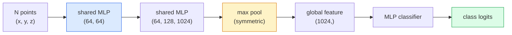

# 3D Vision — Point Clouds & NeRFs | 3D 视觉 — 点云与 NeRF

> 3D vision comes in two flavours. Point clouds are the sensor's raw output. NeRFs are the learned volumetric field. Both answer "what is where in space."

> **【中文解读】** 3D 视觉有两种范式：点云是传感器（LiDAR、深度相机）的原始输出；NeRF（神经辐射场）是学习到的体积场。两者都在回答"什么东西在空间的哪个位置"。NeRF 通过神经网络学习场景的 3D 表示，可以从任意视角渲染逼真图像。

> **【拓展：3D 视觉的应用】** NeRF 被用于虚拟现实/增强现实（VR/AR）、建筑可视化、自动驾驶场景重建。3D Gaussian Splatting（下一课）是 NeRF 的快速替代方案，实时渲染质量更高。点云处理是自动驾驶 LiDAR 感知的核心。

**Type:** Learn + Build | **类型:** 学习 + 动手
**Languages:** Python | **语言:** Python
**Prerequisites:** Phase 4 Lesson 03 (CNNs), Phase 1 Lesson 12 (Tensor Operations) | **前置知识:** Phase 4 Lesson 03（CNN），Phase 1 Lesson 12（张量运算）
**Time:** ~45 minutes | **时间:** ~45 分钟

## Learning Objectives | 学习目标

- Distinguish explicit (point cloud, mesh, voxel) and implicit (signed distance field, NeRF) 3D representations and when each is used
- Understand PointNet's symmetric-function trick that makes a neural network permutation-invariant over an unordered set of points
- Trace a NeRF forward pass: ray casting, volumetric rendering, positional encoding, MLP density+colour head
- Use `nerfstudio` or `instant-ngp` for pretrained 3D reconstruction from a small set of posed images

> **【中文解读】** 学习目标列出了完成本课后应该掌握的核心能力。建议在开始学习前先浏览目标，学完后对照检查是否达成。


## The Problem | 问题引入

A camera produces a 2D image. A LIDAR produces a set of 3D points with no ordering. A structure-from-motion pipeline produces a sparse cloud of 3D keypoints. A NeRF reconstructs an entire 3D scene from a handful of posed images. All of these are "vision" but none of them look like the dense tensor a CNN wants.

> 相机产生 2D 图像。LiDAR 产生一组无序的 3D 点。运动恢复结构流水线产生稀疏的 3D 关键点云。NeRF 从几张位姿图像重建整个 3D 场景。这些都是"视觉"，但没有一个看起来像 CNN 想要的密集张量。

3D vision matters because almost every high-value robot task runs in 3D: grasping, obstacle avoidance, navigation, AR occlusion, 3D content capture. A vision engineer who only understands 2D images is locked out of the fastest-growing slice of the field (AR/VR content, robotics, autonomous driving stacks, NeRF-based 3D reconstruction for real-estate or construction).

> 3D 视觉很重要，因为几乎每个高价值机器人任务都在 3D 中运行：抓取、避障、导航、AR 遮挡、3D 内容捕获。只理解 2D 图像的视觉工程师被锁在了该领域增长最快的部分之外（AR/VR 内容、机器人、自动驾驶栈、基于 NeRF 的房地产或建筑 3D 重建）。

The two representations dominate for different reasons. Point clouds are what sensors give you for free. NeRFs and their successors (3D Gaussian splatting, neural SDFs) are what you get when you ask a neural network to learn a scene.

> 两种表示因不同原因占据主导。点云是传感器免费给你的。NeRF 及其后继者（3D 高斯泼溅、神经 SDF）是当你让神经网络学习场景时得到的。

## The Concept | 核心概念

> **【中文解读】** 本节介绍核心概念和理论基础。掌握这些概念是后续动手实现的前提，同时也是面试和工程实践中高频考察的知识点。


### Point clouds

A point cloud is an unordered set of N points in R^3, optionally each with features (colour, intensity, normal).

> 点云是 R^3 中 N 个点的无序集合，每个点可带有特征（颜色、强度、法线）。

```
cloud = [
  (x1, y1, z1, r1, g1, b1),
  (x2, y2, z2, r2, g2, b2),
  ...
  (xN, yN, zN, rN, gN, bN),
]
```

No grid, no connectivity. Two properties make this hard for neural networks:

> 没有网格，没有连接关系。两个特性使其对神经网络很困难：

- **Permutation invariance** — the output must not depend on point order.
  中文翻译：**置换不变性**——输出不能依赖于点的顺序。
- **Variable N** — a single model must handle clouds of different sizes.
  中文翻译：**可变 N**——单一模型必须处理不同大小的点云。

PointNet (Qi et al., 2017) solved both with one idea: apply a shared MLP to every point, then aggregate with a symmetric function (max pool). The result is a fixed-size vector that does not depend on order.

> PointNet（Qi 等，2017）用一个想法解决了两个问题：对每个点应用共享 MLP，然后用对称函数（最大池化）聚合。结果是一个与顺序无关的固定大小向量。

```
f(P) = max_{p in P} MLP(p)
```

This is the entire core of PointNet. Deeper variants (PointNet++, Point Transformer) add hierarchical sampling and local aggregation but the symmetric-function trick is unchanged.

> 这就是 PointNet 的全部核心。更深的变体（PointNet++、Point Transformer）增加了层次化采样和局部聚合，但对称函数技巧不变。

### The PointNet architecture



"Shared MLP" means the same MLP runs on every point independently. Implemented as a 1x1 conv over the point dimension for efficiency.

> "共享 MLP"意味着同一个 MLP 在每个点上独立运行。为提高效率，实现为在点维度上的 1x1 卷积。

### Neural Radiance Fields (NeRFs)

NeRFs (Mildenhall et al., 2020) took the question "can we reconstruct a 3D scene from N photos?" and answered with a neural network that is the scene. The network maps `(x, y, z, viewing_direction)` to `(density, colour)`. Rendering a new view is a ray-casting loop over this network.

> NeRF（Mildenhall 等，2020）回答了"能否从 N 张照片重建 3D 场景？"这个问题——用一个神经网络来表示场景本身。网络将 `(x, y, z, 观察方向)` 映射到 `(密度, 颜色)`。渲染新视角就是在这个网络上做光线投射循环。

```
NeRF MLP:  (x, y, z, theta, phi) -> (sigma, r, g, b)

To render a pixel (u, v) of a new view:
  1. Cast a ray from the camera through pixel (u, v)
  2. Sample points along the ray at distances t_1, t_2, ..., t_N
  3. Query the MLP at each point
  4. Composite the colours weighted by (1 - exp(-sigma * dt))
  5. The sum is the rendered pixel colour
```

A loss compares the rendered pixel to the ground-truth pixel in the training photos. Backprop through the rendering step updates the MLP. No 3D ground truth, no explicit geometry — the scene is stored in the MLP weights.

> 损失函数比较渲染像素与训练照片中的真实像素。通过渲染步骤的反向传播更新 MLP。没有 3D 真值，没有显式几何——场景存储在 MLP 权重中。

### Positional encoding in NeRF

A vanilla MLP on `(x, y, z)` cannot represent high-frequency details because MLPs are spectrally biased toward low frequencies. NeRF fixes this by encoding each coordinate into a Fourier feature vector before the MLP:

> 普通 MLP 在 `(x, y, z)` 上无法表示高频细节，因为 MLP 频谱偏向低频。NeRF 通过在每个坐标送入 MLP 前编码为傅里叶特征向量来修复这个问题：

```
gamma(p) = (sin(2^0 pi p), cos(2^0 pi p), sin(2^1 pi p), cos(2^1 pi p), ...)
```

Up to L=10 frequency levels. This is the same trick transformers use for positions, and it appears again in diffusion time conditioning (Lesson 10). Without it, NeRFs look blurry.

> 最多 L=10 个频率级别。这与 Transformer 用于位置的技巧相同，也再次出现在扩散模型的时间条件化中（第 10 课）。没有它，NeRF 看起来模糊。

### Volumetric rendering

```
C(r) = sum_i T_i * (1 - exp(-sigma_i * delta_i)) * c_i

T_i  = exp(- sum_{j<i} sigma_j * delta_j)
delta_i = t_{i+1} - t_i
```

`T_i` is transmittance — how much light survives to point i. `(1 - exp(-sigma_i * delta_i))` is the opacity at point i. `c_i` is the colour. The final pixel is a weighted sum along the ray.

> `T_i` 是透射率——到达第 i 个点时光线存留多少。`(1 - exp(-sigma_i * delta_i))` 是第 i 个点的不透明度。`c_i` 是颜色。最终像素是沿光线的加权和。

### What replaced NeRFs

Pure NeRFs are slow to train (hours) and slow to render (seconds per image). The lineage since:

> 纯 NeRF 训练慢（小时级）且渲染慢（每张图像秒级）。后续发展：

- **Instant-NGP** (2022) — hash-grid encoding replaces the MLP's position input; trains in seconds.
  中文翻译：**Instant-NGP**（2022）——哈希网格编码替代 MLP 的位置输入；秒级训练。
- **Mip-NeRF 360** — handles unbounded scenes and anti-aliasing.
  中文翻译：**Mip-NeRF 360**——处理无界场景和抗锯齿。
- **3D Gaussian Splatting** (2023) — replaces the volumetric field with millions of 3D Gaussians; trains in minutes, renders in real time. The current production default.
  中文翻译：**3D 高斯泼溅**（2023）——用数百万个 3D 高斯替代体积场；分钟级训练，实时渲染。当前生产默认方案。

Almost every real NeRF product in 2026 is actually 3D Gaussian splatting. The mental model is still NeRF.

> 2026 年几乎所有真正的 NeRF 产品实际上都是 3D 高斯泼溅。但心智模型仍然是 NeRF。

### Datasets and benchmarks

- **ShapeNet** — classification and segmentation of 3D CAD models as point clouds.
  中文翻译：ShapeNet——3D CAD 模型的点云分类和分割。
- **ScanNet** — real indoor scans for segmentation.
  中文翻译：ScanNet——真实室内扫描，用于分割。
- **KITTI** — outdoor LIDAR point clouds for autonomous driving.
  中文翻译：KITTI——户外 LiDAR 点云，用于自动驾驶。
- **NeRF Synthetic** / **Blended MVS** — posed-image datasets for view synthesis.
  中文翻译：NeRF Synthetic / Blended MVS——带位姿的图像数据集，用于视角合成。
- **Mip-NeRF 360** dataset — unbounded real scenes.
  中文翻译：Mip-NeRF 360 数据集——无界真实场景。

> **【中文解读】** 本节通过代码从零实现核心算法。这种 "from scratch" 的方式能帮助理解框架背后的原理，遇到问题时不会被黑盒困住。

> **【拓展：工业部署中的视觉系统】** 在实际工业部署中，视觉模型需要考虑推理延迟、模型大小、边缘设备适配等问题。TensorRT、ONNX Runtime、OpenVINO 是常用的推理加速工具。自动驾驶系统（如 Tesla FSD）通常在车载芯片上实时运行多个视觉模型。

> **【拓展：数据标注与质量】** 视觉任务的效果高度依赖标注数据质量。Label Studio、CVAT 是主流标注工具。在工业场景中，主动学习（Active Learning）可以减少标注成本：模型对不确定的样本请求人工标注，确定性的样本自动标注。


## Build It | 动手实现

### Step 1: PointNet classifier

```python
import torch
import torch.nn as nn

class PointNet(nn.Module):
    def __init__(self, num_classes=10):
        super().__init__()
        self.mlp1 = nn.Sequential(
            nn.Conv1d(3, 64, 1),    nn.BatchNorm1d(64),   nn.ReLU(inplace=True),
            nn.Conv1d(64, 64, 1),   nn.BatchNorm1d(64),   nn.ReLU(inplace=True),
        )
        self.mlp2 = nn.Sequential(
            nn.Conv1d(64, 128, 1),  nn.BatchNorm1d(128),  nn.ReLU(inplace=True),
            nn.Conv1d(128, 1024, 1), nn.BatchNorm1d(1024), nn.ReLU(inplace=True),
        )
        self.head = nn.Sequential(
            nn.Linear(1024, 512),   nn.BatchNorm1d(512),  nn.ReLU(inplace=True),
            nn.Dropout(0.3),
            nn.Linear(512, 256),    nn.BatchNorm1d(256),  nn.ReLU(inplace=True),
            nn.Dropout(0.3),
            nn.Linear(256, num_classes),
        )

    def forward(self, x):
        # x: (N, 3, num_points) — transposed for Conv1d
        x = self.mlp1(x)
        x = self.mlp2(x)
        x = torch.max(x, dim=-1)[0]       # (N, 1024)
        return self.head(x)

pts = torch.randn(4, 3, 1024)
net = PointNet(num_classes=10)
print(f"output: {net(pts).shape}")
print(f"params: {sum(p.numel() for p in net.parameters()):,}")
```

About 1.6M parameters. Runs on 1,024 points per cloud.

> 约 160 万参数。每个点云处理 1,024 个点。

### Step 2: Positional encoding

```python
def positional_encoding(x, L=10):
    """
    x: (..., D) -> (..., D * 2 * L)
    """
    freqs = 2.0 ** torch.arange(L, dtype=x.dtype, device=x.device)
    args = x.unsqueeze(-1) * freqs * 3.141592653589793
    sinc = torch.cat([args.sin(), args.cos()], dim=-1)
    return sinc.reshape(*x.shape[:-1], -1)

x = torch.randn(5, 3)
y = positional_encoding(x, L=10)
print(f"input:  {x.shape}")
print(f"encoded: {y.shape}     # (5, 60)")
```

Multiplying by `2^l * pi` gives progressively higher frequencies.

> 乘以 `2^l * pi` 产生逐步升高的频率。

### Step 3: Tiny NeRF MLP

```python
class TinyNeRF(nn.Module):
    def __init__(self, L_pos=10, L_dir=4, hidden=128):
        super().__init__()
        self.L_pos = L_pos
        self.L_dir = L_dir
        pos_dim = 3 * 2 * L_pos
        dir_dim = 3 * 2 * L_dir
        self.trunk = nn.Sequential(
            nn.Linear(pos_dim, hidden), nn.ReLU(inplace=True),
            nn.Linear(hidden, hidden),  nn.ReLU(inplace=True),
            nn.Linear(hidden, hidden),  nn.ReLU(inplace=True),
            nn.Linear(hidden, hidden),  nn.ReLU(inplace=True),
        )
        self.sigma = nn.Linear(hidden, 1)
        self.color = nn.Sequential(
            nn.Linear(hidden + dir_dim, hidden // 2), nn.ReLU(inplace=True),
            nn.Linear(hidden // 2, 3), nn.Sigmoid(),
        )

    def forward(self, x, d):
        x_enc = positional_encoding(x, self.L_pos)
        d_enc = positional_encoding(d, self.L_dir)
        h = self.trunk(x_enc)
        sigma = torch.relu(self.sigma(h)).squeeze(-1)
        rgb = self.color(torch.cat([h, d_enc], dim=-1))
        return sigma, rgb

nerf = TinyNeRF()
x = torch.randn(128, 3)
d = torch.randn(128, 3)
s, c = nerf(x, d)
print(f"sigma: {s.shape}   rgb: {c.shape}")
```

Tiny compared to the original NeRF (which has 2 MLP trunks of depth 8). Enough to demonstrate the architecture.

> 与原始 NeRF（有 2 个深度为 8 的 MLP 主体）相比很小。足以展示架构原理。

### Step 4: Volumetric rendering along a ray

```python
def volumetric_render(sigma, rgb, t_vals):
    """
    sigma: (..., N_samples)
    rgb:   (..., N_samples, 3)
    t_vals: (N_samples,) distances along the ray
    """
    delta = torch.cat([t_vals[1:] - t_vals[:-1], torch.full_like(t_vals[:1], 1e10)])
    alpha = 1.0 - torch.exp(-sigma * delta)
    trans = torch.cumprod(torch.cat([torch.ones_like(alpha[..., :1]), 1.0 - alpha + 1e-10], dim=-1), dim=-1)[..., :-1]
    weights = alpha * trans
    rendered = (weights.unsqueeze(-1) * rgb).sum(dim=-2)
    depth = (weights * t_vals).sum(dim=-1)
    return rendered, depth, weights


N = 64
t_vals = torch.linspace(2.0, 6.0, N)
sigma = torch.rand(N) * 0.5
rgb = torch.rand(N, 3)
rendered, depth, weights = volumetric_render(sigma, rgb, t_vals)
print(f"rendered colour: {rendered.tolist()}")
print(f"depth:           {depth.item():.2f}")
```

> **【中文解读】** 本节展示如何用成熟框架（如 PyTorch、HuggingFace 等）快速应用该技术。在实际项目中，优先使用经过验证的框架实现，可以减少 bug 并提高开发效率。


One ray, 64 samples, composite to a single RGB pixel and a depth.

> 一条光线，64 个采样点，合成为一个 RGB 像素和深度值。


> **【拓展：视觉模型的持续学习】** 在生产环境中，视觉模型需要不断适应新数据（新产品、新场景、新光照条件）。持续学习（Continual Learning）技术可以防止模型在适应新数据时遗忘旧知识。这在自动驾驶和工业质检中尤为重要。

## Use It | 用框架实现

For real work:

- `nerfstudio` (Tancik et al.) — the current reference library for NeRF / Instant-NGP / Gaussian Splatting. Command-line plus a web viewer.
- `pytorch3d` (Meta) — differentiable rendering, point-cloud utilities, mesh ops.
- `open3d` — point cloud processing, registration, visualisation.

> **【中文解读】** 本节关注如何将模型部署为可用的产品。从原型到生产级系统需要考虑性能优化、错误处理、监控等多个维度。


For deployment, 3D Gaussian splatting has largely replaced pure NeRFs because it renders 100x faster. The reconstruction quality is comparable.


## Ship It | 产出物

This lesson produces:

> **【中文解读】** 练习题按照 Easy/Medium/Hard 三个难度递进。建议至少完成 Medium 级别的题目，Hard 级别适合深入研究或面试准备。


- `outputs/prompt-3d-task-router.md` — a prompt that routes to the right 3D representation (point cloud, mesh, voxel, NeRF, Gaussian splat) based on task and input data.
- `outputs/skill-point-cloud-loader.md` — a skill that writes a PyTorch `Dataset` for .ply / .pcd / .xyz files with correct normalisation, centring, and point sampling.

## Exercises | 练习题

1. **(Easy)** Show that PointNet is permutation-invariant: run the same cloud through twice, once with points shuffled. Verify outputs are identical up to floating-point noise.
2. **(Medium)** Implement a minimal ray-generation function that, given camera intrinsics and pose, produces ray origins and directions for every pixel of an H x W image.
3. **(Hard)** Train a TinyNeRF on a synthetic dataset of rendered views of a coloured cube (generated via differentiable rendering or a simple ray tracer). Report rendering loss at epoch 1, 10, and 100. At what epoch does the model produce recognisable views?

> **【中文解读】** 术语表中的 "What people say" vs "What it actually means" 区分了日常口语和精确技术含义。在团队协作中，统一术语定义可以避免大量沟通误解。


## Key Terms | 术语速查表

| Term | What people say | What it actually means |
|------|----------------|----------------------|
| Point cloud | "3D points from LIDAR" | Unordered set of (x, y, z) + optional features per point |
| PointNet | "First neural net on point clouds" | Shared MLP per point + symmetric (max) pool; permutation-invariant by construction |
| NeRF | "MLP that is the scene" | Network mapping (x, y, z, dir) to (density, colour); rendered by ray casting |
| Positional encoding | "Fourier features" | Encode each coordinate into sin/cos at multiple frequencies to overcome MLP low-frequency bias |
| Volumetric rendering | "Ray integration" | Composite samples along a ray into a single pixel using transmittance and alpha |
| Instant-NGP | "Hash-grid NeRF" | Replaces NeRF's coordinate MLP with a multi-resolution hash grid; 100-1000x faster |
| 3D Gaussian splatting | "Millions of Gaussians" | Scene = collection of 3D Gaussians; renders in real time, trains in minutes |
| SDF | "Signed distance field" | Function returning signed distance to the nearest surface; another implicit representation |

> **【中文解读】** 延伸阅读提供了深入学习的高质量资源。这些论文和教程是该领域的经典参考文献，适合需要深入理解的读者。


## Further Reading | 延伸阅读

- [PointNet (Qi et al., 2017)](https://arxiv.org/abs/1612.00593) — the permutation-invariant classifier
- [NeRF (Mildenhall et al., 2020)](https://arxiv.org/abs/2003.08934) — the paper that made 3D reconstruction from photos a neural-net problem
- [Instant-NGP (Müller et al., 2022)](https://arxiv.org/abs/2201.05989) — hash grids, 1000x speedup
- [3D Gaussian Splatting (Kerbl et al., 2023)](https://arxiv.org/abs/2308.04079) — the architecture that replaced NeRFs in production
