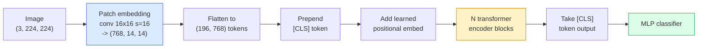

# Vision Transformers (ViT) | 视觉 Transformer

> Cut the image into patches, treat each patch as a word, run a standard transformer. Don't look back.

> **【中文解读】** 将图像切成小块（patch），把每个 patch 当作一个"词"，然后用标准 Transformer 处理。就是这么简单。ViT 证明了 Transformer 架构不仅在 NLP 中有效，在视觉领域同样可以超越 CNN。

> **【拓展：ViT 与 GPT-4V】** ViT 是 GPT-4V、Claude 的视觉能力、LLaVA 等多模态大模型的视觉编码器。从 2021 年至今，ViT 已成为计算机视觉的基础架构，被用于 CLIP、SAM、DINO 等核心模型。ViT 的 patch 嵌入思想也启发了视频 Transformer 和多模态模型的设计。

**Type:** Build
**Languages:** Python
**Prerequisites:** Phase 7 Lesson 02 (Self-Attention), Phase 4 Lesson 04 (Image Classification)
**Time:** ~45 minutes

## Learning Objectives

- Implement patch embedding, learned positional embedding, class token, and transformer encoder blocks from scratch to build a minimal ViT
- Explain why ViT was thought to need massive pretraining data until DeiT and MAE proved otherwise
- Compare ViT, Swin, and ConvNeXt on their architectural priors (none, local window attention, conv backbone)
- Fine-tune a pretrained ViT on a small dataset using `timm` and the standard linear-probe / fine-tune recipe

> **【中文解读】** 学习目标列出了完成本课后应该掌握的核心能力。建议在开始学习前先浏览目标，学完后对照检查是否达成。


## The Problem | 问题引入

For a decade, convolution was synonymous with computer vision. CNNs had strong inductive biases — locality, translation equivariance — that nobody thought you could replace. Then Dosovitskiy et al. (2020) showed that a plain transformer applied to flattened image patches, with no convolutional machinery at all, could match or beat the best CNNs at scale.

> 十年来，卷积就是计算机视觉的代名词。CNN 有很强的归纳偏置——局部性、平移等变性——没人认为你可以替代。然后 Dosovitskiy 等（2020）展示了将普通 Transformer 应用于展平的图像块，完全不需要卷积机制，就能在大规模上匹配或击败最好的 CNN。

The catch was "at scale." ViT on ImageNet-1k lost to ResNet. ViT pretrained on ImageNet-21k or JFT-300M then fine-tuned on ImageNet-1k beat it. The conclusion was that transformers lacked useful priors but could learn them from enough data. Subsequent work (DeiT, MAE, DINO) showed that with the right training recipes — strong augmentation, self-supervised pretraining, distillation — ViTs train fine on small data too.

> 陷阱是"在大规模上"。ViT 在 ImageNet-1k 上输给了 ResNet。在 ImageNet-21k 或 JFT-300M 上预训练然后在 ImageNet-1k 上微调的 ViT 赢了。结论是 Transformer 缺乏有用的先验但可以从足够的数据中学到。后续工作（DeiT、MAE、DINO）表明，用正确的训练方案——强增强、自监督预训练、蒸馏——ViT 在小数据上也能训练得很好。

By 2026, pure CNNs are still competitive on edge devices (ConvNeXt is the strongest), but transformers dominate everything else: segmentation (Mask2Former, SegFormer), detection (DETR, RT-DETR), multimodal (CLIP, SigLIP), video (VideoMAE, VJEPA). The ViT block structure is the one to know.

> 到 2026 年，纯 CNN 在边缘设备上仍然有竞争力（ConvNeXt 最强），但 Transformer 统治了其他一切：分割（Mask2Former、SegFormer）、检测（DETR、RT-DETR）、多模态（CLIP、SigLIP）、视频（VideoMAE、VJEPA）。ViT 块结构是必须了解的。

## The Concept | 核心概念

> **【中文解读】** 本节介绍核心概念和理论基础。掌握这些概念是后续动手实现的前提，同时也是面试和工程实践中高频考察的知识点。


### The pipeline



Seven steps. Patches -> tokens -> attention -> classifier. Every variant (DeiT, Swin, ConvNeXt, MAE pretraining) changes one or two of the seven and leaves the rest alone.

> 七步。补丁 -> token -> 注意力 -> 分类器。每个变体（DeiT、Swin、ConvNeXt、MAE 预训练）只改变七步中的一两步，其余保持不变。

### Patch embedding

The first conv is the secret. Kernel size 16, stride 16, so a 224x224 image becomes a 14x14 grid of 16x16 patches, each projected to a 768-dim embedding. That single conv both patchifies and linearly projects.

> 第一个卷积是秘密所在。核大小 16，步幅 16，所以 224x224 的图像变成 14x14 的 16x16 补丁网格，每个补丁投影为 768 维嵌入。这一个卷积同时完成了分块和线性投影。

```
Input:  (3, 224, 224)
Conv (3 -> 768, k=16, s=16, no padding):
Output: (768, 14, 14)
Flatten spatial: (196, 768)
```

196 patches = 196 tokens. Each token's feature dimension is 768 (ViT-B), 1024 (ViT-L), or 1280 (ViT-H).

> 196 个补丁 = 196 个 token。每个 token 的特征维度为 768（ViT-B）、1024（ViT-L）或 1280（ViT-H）。

### Class token

A single learned vector prepended to the sequence:

> 一个可学习的向量添加到序列前面：

```
tokens = [CLS; patch_1; patch_2; ...; patch_196]   shape (197, 768)
```

After N transformer blocks, the `[CLS]` output is the global image representation. Classification head reads only this one vector.

> 经过 N 个 Transformer 块后，`[CLS]` 的输出是全局图像表示。分类头只读取这一个向量。

### Positional embedding

Transformers have no built-in notion of spatial position. Add a learned vector to every token:

> Transformer 没有内置的空间位置概念。给每个 token 加一个可学习的向量：

```
tokens = tokens + learned_pos_embedding   (also shape (197, 768))
```

The embedding is a parameter of the model; gradient-based training adapts it to 2D image structure. Sinusoidal 2D alternatives exist but are rarely used in practice.

> 嵌入是模型的参数；基于梯度的训练使其适应 2D 图像结构。存在正弦 2D 替代方案，但实际中很少使用。

### Transformer encoder block

Standard. Multi-head self-attention, MLP, residual connections, pre-LayerNorm.

> 标准结构。多头自注意力、MLP、残差连接、前置 LayerNorm。

```
x = x + MSA(LN(x))
x = x + MLP(LN(x))

MLP is two-layer with GELU: Linear(d -> 4d) -> GELU -> Linear(4d -> d)
```

ViT-B/16 stacks 12 of these blocks, each with 12 attention heads, totalling 86M parameters.

> ViT-B/16 堆叠 12 个这样的块，每个有 12 个注意力头，共 8600 万参数。

### Why pre-LN

Early transformers used post-LN (`x = LN(x + sublayer(x))`) and struggled to train past 6-8 layers without warmup. Pre-LN (`x = x + sublayer(LN(x))`) trains deeper networks stably without warmup. Every ViT and every modern LLM uses pre-LN.

> 早期 Transformer 使用后置 LN（`x = LN(x + sublayer(x))`），很难在没有预热的情况下训练超过 6-8 层。前置 LN（`x = x + sublayer(LN(x))`）无需预热即可稳定训练更深的网络。每个 ViT 和每个现代 LLM 都使用前置 LN。

### Patch size trade-off

- 16x16 patches -> 196 tokens, standard.
  中文翻译：16x16 补丁 -> 196 个 token，标准配置。
- 32x32 patches -> 49 tokens, faster but lower resolution.
  中文翻译：32x32 补丁 -> 49 个 token，更快但分辨率更低。
- 8x8 patches -> 784 tokens, finer but O(n^2) attention cost scales badly.
  中文翻译：8x8 补丁 -> 784 个 token，更精细但 O(n^2) 注意力成本增长严重。

Bigger patches = fewer tokens = faster but less spatial detail. SwinV2 uses 4x4 patches in hierarchical windows.

> 更大的补丁 = 更少的 token = 更快但空间细节更少。SwinV2 在层次化窗口中使用 4x4 补丁。

### DeiT's recipe for training ViT on ImageNet-1k

The original ViT needed JFT-300M to beat CNNs. DeiT (Touvron et al., 2020) trained ViT-B to 81.8% top-1 on ImageNet-1k alone with four changes:

> 原始 ViT 需要 JFT-300M 才能击败 CNN。DeiT（Touvron 等，2020）仅用四项改进就在 ImageNet-1k 上将 ViT-B 训练到 81.8% top-1：

1. Heavy augmentation: RandAugment, Mixup, CutMix, Random Erasing.
   中文翻译：强数据增强：RandAugment、Mixup、CutMix、Random Erasing。
2. Stochastic depth (drop entire blocks at random during training).
   中文翻译：随机深度（训练时随机丢弃整个块）。
3. Repeated augmentation (same image sampled 3 times per batch).
   中文翻译：重复增强（同一图像在每个 batch 中采样 3 次）。
4. Distillation from a CNN teacher (optional, lifts accuracy further).
   中文翻译：从 CNN 教师模型蒸馏（可选，进一步提升精度）。

Every modern ViT training recipe descends from DeiT.

> 每个现代 ViT 训练方案都源自 DeiT。

### Swin vs ConvNeXt

- **Swin** (Liu et al., 2021) — window-based attention. Each block attends within a local window; alternating blocks shift the window to mix information across windows. Brings back a CNN-like locality prior while keeping the attention operator.
  中文翻译：**Swin**（Liu 等，2021）——基于窗口的注意力。每个块在局部窗口内做注意力；交替块移动窗口以跨窗口混合信息。恢复了类 CNN 的局部性先验，同时保留了注意力算子。
- **ConvNeXt** (Liu et al., 2022) — redesigned CNN that matches Swin's architecture choices (depthwise convs, LayerNorm, GELU, inverted bottleneck). Showed that the gap is not "attention vs convolution" but "modern training recipe + architecture."
  中文翻译：**ConvNeXt**（Liu 等，2022）——重新设计的 CNN，匹配 Swin 的架构选择（深度可分离卷积、LayerNorm、GELU、倒置瓶颈）。表明差距不是"注意力 vs 卷积"而是"现代训练方案 + 架构"。

In 2026, ConvNeXt-V2 and Swin-V2 are both production-grade; the right choice depends on your inference stack (ConvNeXt compiles better for edge) and pretraining corpus.

> 2026 年，ConvNeXt-V2 和 Swin-V2 都是生产级方案；正确选择取决于推理栈（ConvNeXt 在边缘设备上编译更好）和预训练语料。

### MAE pretraining

Masked Autoencoder (He et al., 2022): mask 75% of patches at random, train the encoder to process only the visible 25%, train a small decoder to reconstruct the masked patches from the encoder's output. After pretraining, discard the decoder and fine-tune the encoder.

> 掩码自编码器（He 等，2022）：随机掩蔽 75% 的补丁，训练编码器只处理可见的 25%，训练一个小解码器从编码器输出重建被掩蔽的补丁。预训练后丢弃解码器，微调编码器。

MAE makes ViT trainable on ImageNet-1k alone, hits SOTA, and is the current default self-supervised recipe.

> MAE 使 ViT 仅在 ImageNet-1k 上可训练，达到 SOTA，是当前默认的自监督训练方案。

> **【中文解读】** 本节通过代码从零实现核心算法。这种 "from scratch" 的方式能帮助理解框架背后的原理，遇到问题时不会被黑盒困住。

> **【拓展：工业部署中的视觉系统】** 在实际工业部署中，视觉模型需要考虑推理延迟、模型大小、边缘设备适配等问题。TensorRT、ONNX Runtime、OpenVINO 是常用的推理加速工具。自动驾驶系统（如 Tesla FSD）通常在车载芯片上实时运行多个视觉模型。

> **【拓展：数据标注与质量】** 视觉任务的效果高度依赖标注数据质量。Label Studio、CVAT 是主流标注工具。在工业场景中，主动学习（Active Learning）可以减少标注成本：模型对不确定的样本请求人工标注，确定性的样本自动标注。


## Build It | 动手实现

### Step 1: Patch embedding

```python
import torch
import torch.nn as nn

class PatchEmbedding(nn.Module):
    def __init__(self, in_channels=3, patch_size=16, dim=192, image_size=64):
        super().__init__()
        assert image_size % patch_size == 0
        self.proj = nn.Conv2d(in_channels, dim, kernel_size=patch_size, stride=patch_size)
        num_patches = (image_size // patch_size) ** 2
        self.num_patches = num_patches

    def forward(self, x):
        x = self.proj(x)
        return x.flatten(2).transpose(1, 2)
```

One conv, one flatten, one transpose. That is the entire image-to-tokens step.

> 一个卷积、一个展平、一个转置。这就是图像到 token 的全部步骤。

### Step 2: Transformer block

Pre-LN, multi-head self-attention, MLP with GELU, residual connections.

> 前置 LN、多头自注意力、带 GELU 的 MLP、残差连接。

```python
class Block(nn.Module):
    def __init__(self, dim, num_heads, mlp_ratio=4, dropout=0.0):
        super().__init__()
        self.ln1 = nn.LayerNorm(dim)
        self.attn = nn.MultiheadAttention(dim, num_heads, dropout=dropout, batch_first=True)
        self.ln2 = nn.LayerNorm(dim)
        self.mlp = nn.Sequential(
            nn.Linear(dim, dim * mlp_ratio),
            nn.GELU(),
            nn.Dropout(dropout),
            nn.Linear(dim * mlp_ratio, dim),
            nn.Dropout(dropout),
        )

    def forward(self, x):
        a, _ = self.attn(self.ln1(x), self.ln1(x), self.ln1(x), need_weights=False)
        x = x + a
        x = x + self.mlp(self.ln2(x))
        return x
```

`nn.MultiheadAttention` handles the splitting into heads, the scaled dot-product, and the output projection. `batch_first=True` so shapes are `(N, seq, dim)`.

> `nn.MultiheadAttention` 处理多头拆分、缩放点积和输出投影。`batch_first=True` 使形状为 `(N, seq, dim)`。

### Step 3: The ViT

```python
class ViT(nn.Module):
    def __init__(self, image_size=64, patch_size=16, in_channels=3,
                 num_classes=10, dim=192, depth=6, num_heads=3, mlp_ratio=4):
        super().__init__()
        self.patch = PatchEmbedding(in_channels, patch_size, dim, image_size)
        num_patches = self.patch.num_patches
        self.cls_token = nn.Parameter(torch.zeros(1, 1, dim))
        self.pos_embed = nn.Parameter(torch.zeros(1, num_patches + 1, dim))
        self.blocks = nn.ModuleList([
            Block(dim, num_heads, mlp_ratio) for _ in range(depth)
        ])
        self.ln = nn.LayerNorm(dim)
        self.head = nn.Linear(dim, num_classes)
        nn.init.trunc_normal_(self.pos_embed, std=0.02)
        nn.init.trunc_normal_(self.cls_token, std=0.02)

    def forward(self, x):
        x = self.patch(x)
        cls = self.cls_token.expand(x.size(0), -1, -1)
        x = torch.cat([cls, x], dim=1)
        x = x + self.pos_embed
        for blk in self.blocks:
            x = blk(x)
        x = self.ln(x[:, 0])
        return self.head(x)

vit = ViT(image_size=64, patch_size=16, num_classes=10, dim=192, depth=6, num_heads=3)
x = torch.randn(2, 3, 64, 64)
print(f"output: {vit(x).shape}")
print(f"params: {sum(p.numel() for p in vit.parameters()):,}")
```

About 2.8M parameters — a tiny ViT tractable on CPU. Real ViT-B is 86M; same class definition with `dim=768, depth=12, num_heads=12`.

> 约 280 万参数——一个可在 CPU 上训练的小型 ViT。真正的 ViT-B 有 8600 万参数；同样的类定义，只需 `dim=768, depth=12, num_heads=12`。

### Step 4: Sanity check — single image inference

```python
logits = vit(torch.randn(1, 3, 64, 64))
print(f"logits: {logits}")
print(f"probs:  {logits.softmax(-1)}")
```

> **【中文解读】** 本节展示如何用成熟框架（如 PyTorch、HuggingFace 等）快速应用该技术。在实际项目中，优先使用经过验证的框架实现，可以减少 bug 并提高开发效率。


Should run without error. Probabilities sum to 1.

> 应无错误运行。概率之和为 1。


> **【拓展：视觉模型的持续学习】** 在生产环境中，视觉模型需要不断适应新数据（新产品、新场景、新光照条件）。持续学习（Continual Learning）技术可以防止模型在适应新数据时遗忘旧知识。这在自动驾驶和工业质检中尤为重要。

## Use It | 用框架实现

`timm` ships every ViT variant with ImageNet pretrained weights. One line:

```python
import timm

model = timm.create_model("vit_base_patch16_224", pretrained=True, num_classes=10)
```

`timm` is the production default for vision transformers in 2026. Supports ViT, DeiT, Swin, Swin-V2, ConvNeXt, ConvNeXt-V2, MaxViT, MViT, EfficientFormer, and dozens of others under the same API.

For multi-modal work (image + text), `transformers` ships CLIP, SigLIP, BLIP-2, LLaVA. The image encoder in all of those is a ViT variant.

> **【中文解读】** 本节关注如何将模型部署为可用的产品。从原型到生产级系统需要考虑性能优化、错误处理、监控等多个维度。


## Ship It | 产出物

This lesson produces:

- `outputs/prompt-vit-vs-cnn-picker.md` — a prompt that picks between a ViT, a ConvNeXt, or a Swin based on dataset size, compute, and inference stack.
- `outputs/skill-vit-patch-and-pos-embed-inspector.md` — a skill that verifies a ViT's patch embedding and positional embedding shapes match the model's expected sequence length, catching the most common porting bugs.

> **【中文解读】** 练习题按照 Easy/Medium/Hard 三个难度递进。建议至少完成 Medium 级别的题目，Hard 级别适合深入研究或面试准备。


## Exercises | 练习题

1. **(Easy)** Print the shapes of every intermediate tensor for a forward pass through the tiny ViT above. Confirm: input `(N, 3, 64, 64)` -> patches `(N, 16, 192)` -> with CLS `(N, 17, 192)` -> classifier input `(N, 192)` -> output `(N, num_classes)`.
2. **(Medium)** Fine-tune a pretrained `timm` ViT-S/16 on the synthetic-CIFAR dataset from Lesson 4. Compare against ResNet-18 fine-tuning on the same data. Report training time and final accuracy.
3. **(Hard)** Implement MAE pretraining for the tiny ViT: mask 75% of patches, train the encoder + a small decoder to reconstruct the masked patches. Evaluate linear-probe accuracy on the synthetic data before and after pretraining.

> **【中文解读】** 术语表中的 "What people say" vs "What it actually means" 区分了日常口语和精确技术含义。在团队协作中，统一术语定义可以避免大量沟通误解。


## Key Terms | 术语速查表

| Term | What people say | What it actually means |
|------|----------------|----------------------|
| Patch embedding | "The first conv" | A conv with kernel size = stride = patch size; turns the image into a grid of token embeddings |
| Class token | "[CLS]" | A learned vector prepended to the token sequence; its final output is the global image representation |
| Positional embedding | "Learned pos" | A learned vector added to every token so the transformer knows where each patch came from |
| Pre-LN | "LayerNorm before sublayer" | The stable transformer variant: `x + sublayer(LN(x))` instead of `LN(x + sublayer(x))` |
| Multi-head attention | "Parallel attention" | Standard transformer attention split into num_heads independent subspaces, concatenated afterwards |
| ViT-B/16 | "Base, patch 16" | The canonical size: dim=768, depth=12, heads=12, patch_size=16, image=224; ~86M params |
| DeiT | "Data-efficient ViT" | ViT trained on ImageNet-1k alone with strong augmentation; proved large pretraining datasets are not strictly required |
| MAE | "Masked autoencoder" | Self-supervised pretraining: mask 75% of patches, reconstruct; the dominant ViT pretraining recipe |

> **【中文解读】** 延伸阅读提供了深入学习的高质量资源。这些论文和教程是该领域的经典参考文献，适合需要深入理解的读者。


## Further Reading | 延伸阅读

- [An Image is Worth 16x16 Words (Dosovitskiy et al., 2020)](https://arxiv.org/abs/2010.11929) — the ViT paper
- [DeiT: Data-efficient Image Transformers (Touvron et al., 2020)](https://arxiv.org/abs/2012.12877) — how to train ViT on ImageNet-1k alone
- [Masked Autoencoders are Scalable Vision Learners (He et al., 2022)](https://arxiv.org/abs/2111.06377) — MAE pretraining
- [timm documentation](https://huggingface.co/docs/timm) — the reference for every vision transformer you will use in production
