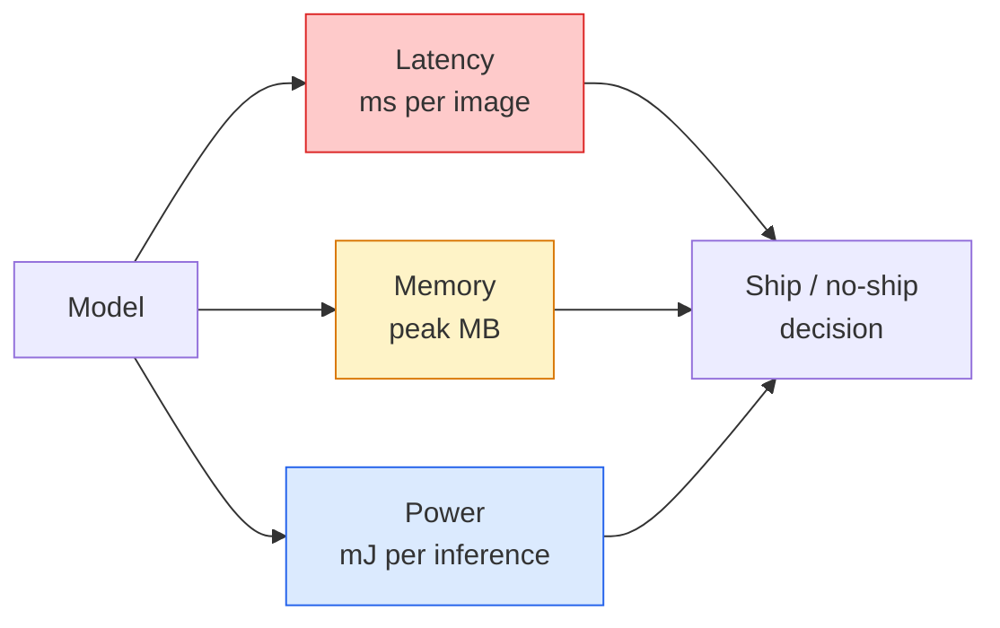

# Real-Time Vision — Edge Deployment | 实时视觉 — 边缘部署

> Edge inference is the discipline of getting a 90-accuracy model to run at 30 fps on a device with 2 GB of RAM. Every percentage point of accuracy is traded against milliseconds of latency.

> **【中文解读】** 边缘推理是一门平衡艺术：让 90% 准确率的模型在只有 2GB 内存的设备上以 30fps 运行。每一个百分点的准确率都在与毫秒级延迟做交易。关键技术包括量化（INT8）、剪枝、知识蒸馏、ONNX Runtime 和 TensorRT。

> **【拓展：边缘 AI 的应用】** 边缘部署在智能手机（人脸解锁、拍照美化）、无人机（实时目标检测）、工业 IoT（缺陷检测）和自动驾驶（车载推理）中至关重要。MobileNet、YOLO-nano、EfficientNet 是常见的轻量级模型。

**Type:** Learn + Build | **类型:** 学习 + 动手
**Languages:** Python | **语言:** Python
**Prerequisites:** Phase 4 Lesson 04 (Image Classification), Phase 10 Lesson 11 (Quantization) | **前置知识:** Phase 4 Lesson 04（图像分类），Phase 10 Lesson 11（量化）
**Time:** ~75 minutes | **时间:** ~75 分钟

## Learning Objectives | 学习目标

- Measure inference latency, peak memory, and throughput for any PyTorch model, and read the FLOPs / params / latency trade-off
- Quantise a vision model to INT8 using PyTorch's post-training quantisation and verify accuracy loss < 1%
- Export to ONNX and compile with ONNX Runtime or TensorRT; name the three most common export failures and their fixes
- Explain when to pick MobileNetV3, EfficientNet-Lite, ConvNeXt-Tiny, or MobileViT for an edge constraint

> **【中文解读】** 学习目标列出了完成本课后应该掌握的核心能力。建议在开始学习前先浏览目标，学完后对照检查是否达成。


## The Problem | 问题引入

A training-time vision model is a floating-point monster. 100M parameters, 10 GFLOPs per forward pass, 2 GB of VRAM. None of that fits on a phone, a car's infotainment unit, an industrial camera, or a drone. Shipping a vision system means fitting the same predictions into a budget that is 100x smaller.

> 训练时的视觉模型是一个浮点数怪兽。1 亿参数、每次前向传播 10 GFLOPs、2 GB 显存。这些都无法装入手机、车载信息娱乐系统、工业摄像头或无人机。交付视觉系统意味着将相同的预测装入小 100 倍的预算。

Three knobs do most of the work: model choice (a smaller architecture with the same recipe), quantisation (INT8 instead of FP32), and the inference runtime (ONNX Runtime, TensorRT, Core ML, TFLite). Getting them right is the difference between a demo that runs on a workstation and a product that ships on a $30 camera module.

> 三个旋钮做了大部分工作：模型选择（相同方案的小架构）、量化（INT8 替代 FP32）和推理运行时（ONNX Runtime、TensorRT、Core ML、TFLite）。正确使用它们是在工作站上运行的演示和在 30 美元摄像头模块上交付的产品之间的区别。

This lesson sets up the measurement discipline first (you cannot optimise what you cannot measure), then walks the three knobs. The goal is not to learn every edge runtime but to know what levers exist and how to verify each one does what you think.

> 本课首先建立度量纪律（你无法优化你无法度量的东西），然后遍历三个旋钮。目标不是学习每个边缘运行时，而是知道有哪些杠杆以及如何验证每个杠杆做了你认为它做的事。

## The Concept | 核心概念

> **【中文解读】** 本节介绍核心概念和理论基础。掌握这些概念是后续动手实现的前提，同时也是面试和工程实践中高频考察的知识点。


### The three budgets



- **Latency**: p50, p95, p99. Averaging only p50 hides tail behaviour that matters for real-time systems.
  中文翻译：**延迟**：p50、p95、p99。只看 p50 平均值会隐藏对实时系统至关重要的尾部行为。
- **Peak memory**: the maximum the device ever sees, not the steady-state average. Matters because OOMs are fatal on embedded targets.
  中文翻译：**峰值内存**：设备所见最大值，不是稳态平均值。重要是因为 OOM 在嵌入式目标上是致命的。
- **Power / energy**: millijoules per inference on a battery-powered device. Often proxied by CPU/GPU utilisation * time.
  中文翻译：**功耗/能量**：电池供电设备上每次推理的毫焦数。通常用 CPU/GPU 利用率 × 时间来近似。

A table of (model, latency, memory, accuracy) is what an edge decision is made from. Every cell is measured on the target device, not the workstation.

> 一张 (模型, 延迟, 内存, 精度) 的表格是边缘部署决策的依据。每个数据都在目标设备上测量，而非工作站。

### Measurement discipline

Three rules that every edge profile should follow:

> 每个边缘性能分析都应遵循的三条规则：

1. **Warm up** the model with 5-10 dummy forward passes before measuring. Cold caches and JIT compilation produce unrepresentative first numbers.
   中文翻译：**预热**——测量前用 5-10 次虚拟前向传播预热模型。冷缓存和 JIT 编译会产生不具代表性的初始数据。
2. **Synchronise** GPU workloads with `torch.cuda.synchronize()` before and after the timed block. Without this you measure kernel dispatch, not kernel execution.
   中文翻译：**同步**——在计时块前后用 `torch.cuda.synchronize()` 同步 GPU 工作负载。否则你测量的是内核调度，不是内核执行。
3. **Fix input sizes** to the production resolution. Latency on 224x224 is not latency on 512x512.
   中文翻译：**固定输入尺寸**——使用生产分辨率。224x224 上的延迟不等于 512x512 上的延迟。

### FLOPs as a proxy

FLOPs (floating-point operations per inference) is a cheap, device-independent proxy for latency. Useful for architecture comparison, misleading as absolute wall-clock. A model with 10% more FLOPs can be 2x faster in practice because it uses hardware-friendly ops (depthwise convs compile well, large 7x7 convs do not).

> FLOPs（每次推理的浮点运算数）是廉价的、设备无关的延迟代理指标。适用于架构比较，但作为绝对耗时则有误导性。一个多 10% FLOPs 的模型实际上可能快 2 倍，因为它使用了硬件友好的操作（深度可分离卷积编译良好，大的 7x7 卷积则不然）。

Rule: use FLOPs for architecture search, use on-device latency for deployment decisions.

> 法则：用 FLOPs 做架构搜索，用设备上的延迟做部署决策。

### Quantisation in one paragraph

Replace FP32 weights and activations with INT8. Model size drops 4x, memory bandwidth drops 4x, compute drops 2-4x on hardware that has INT8 kernels (every modern mobile SoC, every NVIDIA GPU with Tensor Cores). Accuracy loss on vision tasks is typically 0.1-1 percentage points with post-training static quantisation.

> 将 FP32 权重和激活替换为 INT8。模型大小减少 4 倍，内存带宽减少 4 倍，在有 INT8 内核的硬件上计算量减少 2-4 倍（每个现代移动 SoC、每个带 Tensor Cores 的 NVIDIA GPU）。视觉任务上的精度损失通常为 0.1-1 个百分点（使用训练后静态量化）。

Types:

> 类型：

- **Dynamic** — quantise weights to INT8, activations computed in FP. Easy, small speedup.
  中文翻译：**动态**——权重量化为 INT8，激活值以 FP 计算。简单，加速有限。
- **Static (post-training)** — quantise weights + calibrate activation ranges on a small calibration set. Much faster than dynamic.
  中文翻译：**静态（训练后）**——量化权重 + 在小校准集上校准激活范围。比动态快得多。
- **Quantisation-aware training (QAT)** — simulate quantisation during training so the model learns around it. Best accuracy, needs labelled data.
  中文翻译：**量化感知训练（QAT）**——训练时模拟量化，让模型学会适应。精度最好，需要标注数据。

For vision, post-training static quantisation gives 95% of the benefit with 5% of the effort. Use QAT only when accuracy loss from PTQ is unacceptable.

> 对于视觉任务，训练后静态量化以 5% 的努力获得 95% 的收益。只有当 PTQ 的精度损失不可接受时才使用 QAT。

### Pruning and distillation

- **Pruning** — remove unimportant weights (magnitude-based) or channels (structured). Works well on overparameterised models; less useful on already-compact architectures.
  中文翻译：**剪枝**——移除不重要的权重（基于幅度）或通道（结构化）。对过参数化模型效果好；对已经很紧凑的架构用处不大。
- **Distillation** — train a small student to mimic a large teacher's logits. Often recovers most of the accuracy lost by shrinking the model. Standard for production edge models.
  中文翻译：**蒸馏**——训练小模型（学生）模仿大模型（教师）的 logits。通常能恢复缩小模型所损失的大部分精度。生产级边缘模型的标准做法。

### The inference runtimes

- **PyTorch eager** — slow, not for deployment. Use for development only.
  中文翻译：**PyTorch eager**——慢，不用于部署。仅用于开发。
- **TorchScript** — legacy. Superseded by `torch.compile` and ONNX export.
  中文翻译：**TorchScript**——遗留方案。已被 `torch.compile` 和 ONNX 导出取代。
- **ONNX Runtime** — the neutral runtime. CPU, CUDA, CoreML, TensorRT, OpenVINO all have ONNX providers. Start here.
  中文翻译：**ONNX Runtime**——中性运行时。CPU、CUDA、CoreML、TensorRT、OpenVINO 都有 ONNX 提供者。从这里开始。
- **TensorRT** — NVIDIA's compiler. Best latency on NVIDIA GPUs (workstation and Jetson). Integrates with ONNX Runtime or standalone.
  中文翻译：**TensorRT**——NVIDIA 的编译器。在 NVIDIA GPU（工作站和 Jetson）上延迟最低。
- **Core ML** — Apple's runtime for iOS/macOS. Needs `.mlmodel` or `.mlpackage`.
  中文翻译：**Core ML**——Apple 的 iOS/macOS 运行时。需要 `.mlmodel` 或 `.mlpackage`。
- **TFLite** — Google's runtime for Android/ARM. Needs `.tflite`.
  中文翻译：**TFLite**——Google 的 Android/ARM 运行时。需要 `.tflite`。
- **OpenVINO** — Intel's runtime for CPU/VPU. Needs `.xml` + `.bin`.
  中文翻译：**OpenVINO**——Intel 的 CPU/VPU 运行时。需要 `.xml` + `.bin`。

In practice: export PyTorch -> ONNX -> pick the runtime for the target. ONNX is the lingua franca.

> 实践中：导出 PyTorch -> ONNX -> 选择目标运行时。ONNX 是通用语言。

### Edge architecture picker

| Budget | Model | Why |
|--------|-------|-----|
| < 3M params | MobileNetV3-Small | Compiles everywhere, good baseline |
| 3-10M | EfficientNet-Lite-B0 | Best accuracy per param on TFLite |
| 10-20M | ConvNeXt-Tiny | Best accuracy-per-param, CPU-friendly |
| 20-30M | MobileViT-S or EfficientViT | Transformer with ImageNet accuracy |
| 30-80M | Swin-V2-Tiny | If stack supports window attention |

Quantise all of these to INT8 unless you have a specific reason not to.

> **【中文解读】** 本节通过代码从零实现核心算法。这种 "from scratch" 的方式能帮助理解框架背后的原理，遇到问题时不会被黑盒困住。

> **【拓展：工业部署中的视觉系统】** 在实际工业部署中，视觉模型需要考虑推理延迟、模型大小、边缘设备适配等问题。TensorRT、ONNX Runtime、OpenVINO 是常用的推理加速工具。自动驾驶系统（如 Tesla FSD）通常在车载芯片上实时运行多个视觉模型。

> **【拓展：数据标注与质量】** 视觉任务的效果高度依赖标注数据质量。Label Studio、CVAT 是主流标注工具。在工业场景中，主动学习（Active Learning）可以减少标注成本：模型对不确定的样本请求人工标注，确定性的样本自动标注。


## Build It | 动手实现

### Step 1: Measure latency correctly

```python
import time
import torch

def measure_latency(model, input_shape, device="cpu", warmup=10, iters=50):
    model = model.to(device).eval()
    x = torch.randn(input_shape, device=device)
    with torch.no_grad():
        for _ in range(warmup):
            model(x)
        if device == "cuda":
            torch.cuda.synchronize()
        times = []
        for _ in range(iters):
            if device == "cuda":
                torch.cuda.synchronize()
            t0 = time.perf_counter()
            model(x)
            if device == "cuda":
                torch.cuda.synchronize()
            times.append((time.perf_counter() - t0) * 1000)
    times.sort()
    return {
        "p50_ms": times[len(times) // 2],
        "p95_ms": times[int(len(times) * 0.95)],
        "p99_ms": times[int(len(times) * 0.99)],
        "mean_ms": sum(times) / len(times),
    }
```

Warm up, synchronise, use `time.perf_counter()`. Report percentiles, not just mean.

> 预热、同步、使用 `time.perf_counter()`。报告百分位数，不只是均值。

### Step 2: Parameter and FLOP counts

```python
def parameter_count(model):
    return sum(p.numel() for p in model.parameters())

def flops_estimate(model, input_shape):
    """
    Rough FLOP count for a conv/linear-only model. For production use `fvcore` or `ptflops`.
    """
    total = 0
    def conv_hook(m, inp, out):
        nonlocal total
        c_out, c_in, kh, kw = m.weight.shape
        h, w = out.shape[-2:]
        total += 2 * c_in * c_out * kh * kw * h * w
    def linear_hook(m, inp, out):
        nonlocal total
        total += 2 * m.in_features * m.out_features
    hooks = []
    for m in model.modules():
        if isinstance(m, torch.nn.Conv2d):
            hooks.append(m.register_forward_hook(conv_hook))
        elif isinstance(m, torch.nn.Linear):
            hooks.append(m.register_forward_hook(linear_hook))
    model.eval()
    with torch.no_grad():
        model(torch.randn(input_shape))
    for h in hooks:
        h.remove()
    return total
```

For real projects use `fvcore.nn.FlopCountAnalysis` or `ptflops`; they handle every module type correctly.

> 真实项目使用 `fvcore.nn.FlopCountAnalysis` 或 `ptflops`；它们能正确处理每种模块类型。

### Step 3: Post-training static quantisation

```python
def quantise_ptq(model, calibration_loader, backend="x86"):
    import torch.ao.quantization as tq
    model = model.eval().cpu()
    model.qconfig = tq.get_default_qconfig(backend)
    tq.prepare(model, inplace=True)
    with torch.no_grad():
        for x, _ in calibration_loader:
            model(x)
    tq.convert(model, inplace=True)
    return model
```

Three steps: configure, prepare (insert observers), calibrate with real data, convert (fuse + quantise). Requires the model to be fused (`Conv -> BN -> ReLU` -> `ConvBnReLU`), which `torch.ao.quantization.fuse_modules` handles.

> 三步：配置、准备（插入观察器）、用真实数据校准、转换（融合 + 量化）。需要模型已融合（`Conv -> BN -> ReLU` -> `ConvBnReLU`），`torch.ao.quantization.fuse_modules` 处理此事。

### Step 4: Export to ONNX

```python
def export_onnx(model, sample_input, path="model.onnx"):
    model = model.eval()
    torch.onnx.export(
        model,
        sample_input,
        path,
        input_names=["input"],
        output_names=["output"],
        dynamic_axes={"input": {0: "batch"}, "output": {0: "batch"}},
        opset_version=17,
    )
    return path
```

`opset_version=17` is the safe default in 2026. `dynamic_axes` lets you run the ONNX model with arbitrary batch size.

> `opset_version=17` 是 2026 年的安全默认值。`dynamic_axes` 允许 ONNX 模型以任意批量大小运行。

### Step 5: Benchmark and compare regimes

```python
import torch.nn as nn
from torchvision.models import mobilenet_v3_small

def compare_regimes():
    model = mobilenet_v3_small(weights=None, num_classes=10)
    params = parameter_count(model)
    flops = flops_estimate(model, (1, 3, 224, 224))
    lat_fp32 = measure_latency(model, (1, 3, 224, 224), device="cpu")
    print(f"FP32 MobileNetV3-Small: {params:,} params  {flops/1e9:.2f} GFLOPs  "
          f"p50={lat_fp32['p50_ms']:.2f}ms  p95={lat_fp32['p95_ms']:.2f}ms")
```

Run the same function for `resnet50`, `efficientnet_v2_s`, and `convnext_tiny` and you have the comparison table you need for a deployment decision.

> 对 `resnet50`、`efficientnet_v2_s` 和 `convnext_tiny` 运行相同函数，你就得到了部署决策所需的对比表。

> **【中文解读】** 本节展示如何用成熟框架（如 PyTorch、HuggingFace 等）快速应用该技术。在实际项目中，优先使用经过验证的框架实现，可以减少 bug 并提高开发效率。


> **【拓展：视觉模型的持续学习】** 在生产环境中，视觉模型需要不断适应新数据（新产品、新场景、新光照条件）。持续学习（Continual Learning）技术可以防止模型在适应新数据时遗忘旧知识。这在自动驾驶和工业质检中尤为重要。

## Use It | 用框架实现

Production stacks converge on one of three paths:

- **Web / serverless**: PyTorch -> ONNX -> ONNX Runtime (CPU or CUDA provider). Easiest, good enough for most.
- **NVIDIA edge (Jetson, GPU server)**: PyTorch -> ONNX -> TensorRT. Best latency, biggest engineering effort.
- **Mobile**: PyTorch -> ONNX -> Core ML (iOS) or TFLite (Android). Quantise before export.

> **【中文解读】** 本节关注如何将模型部署为可用的产品。从原型到生产级系统需要考虑性能优化、错误处理、监控等多个维度。


For measurement, `torch-tb-profiler`, `nvprof` / `nsys`, and Instruments on macOS give layer-by-layer breakdowns. `benchmark_app` (OpenVINO) and `trtexec` (TensorRT) give standalone CLI numbers.


## Ship It | 产出物

> **【中文解读】** 练习题按照 Easy/Medium/Hard 三个难度递进。建议至少完成 Medium 级别的题目，Hard 级别适合深入研究或面试准备。


This lesson produces:

- `outputs/prompt-edge-deployment-planner.md` — a prompt that picks backbone, quantisation strategy, and runtime given target device and latency SLA.
- `outputs/skill-latency-profiler.md` — a skill that writes a complete latency-benchmarking script with warmup, synchronisation, percentiles, and memory tracking.

## Exercises | 练习题

1. **(Easy)** Measure p50 latency for `resnet18`, `mobilenet_v3_small`, `efficientnet_v2_s`, and `convnext_tiny` at 224x224 on CPU. Report the table and identify which architecture has the best accuracy-per-ms.
2. **(Medium)** Apply post-training static quantisation to `mobilenet_v3_small`. Report FP32 vs INT8 latency and accuracy loss on a held-out subset of CIFAR-10 or similar.
3. **(Hard)** Export `convnext_tiny` to ONNX, run it through `onnxruntime` with the `CPUExecutionProvider`, and compare latency to the PyTorch eager baseline. Identify the first layer where ONNX Runtime is faster and explain why.

> **【中文解读】** 术语表中的 "What people say" vs "What it actually means" 区分了日常口语和精确技术含义。在团队协作中，统一术语定义可以避免大量沟通误解。


## Key Terms | 术语速查表

| Term | What people say | What it actually means |
|------|----------------|----------------------|
| Latency | "How fast" | Time from input to output; p50/p95/p99 percentiles, not mean |
| FLOPs | "Model size" | Floating-point ops per forward pass; rough proxy for compute cost |
| INT8 quantisation | "8-bit" | Replace FP32 weights/activations with 8-bit integers; ~4x smaller, 2-4x faster |
| PTQ | "Post-training quantisation" | Quantise a trained model without retraining; easy, usually enough |
| QAT | "Quantisation-aware training" | Simulate quantisation during training; best accuracy, requires labelled data |
| ONNX | "The neutral format" | Model exchange format supported by every mainstream inference runtime |
| TensorRT | "NVIDIA compiler" | Compiles ONNX into an optimised engine for NVIDIA GPUs |
| Distillation | "Teacher -> student" | Train a small model to mimic a big model's logits; recovers most lost accuracy |

> **【中文解读】** 延伸阅读提供了深入学习的高质量资源。这些论文和教程是该领域的经典参考文献，适合需要深入理解的读者。


## Further Reading | 延伸阅读

- [EfficientNet (Tan & Le, 2019)](https://arxiv.org/abs/1905.11946) — compound scaling for efficient architectures
- [MobileNetV3 (Howard et al., 2019)](https://arxiv.org/abs/1905.02244) — mobile-first architecture with h-swish and squeeze-excite
- [A Practical Guide to TensorRT Optimization (NVIDIA)](https://developer.nvidia.com/blog/accelerating-model-inference-with-tensorrt-tips-and-best-practices-for-pytorch-users/) — how to actually get the throughput numbers in the paper
- [ONNX Runtime docs](https://onnxruntime.ai/docs/) — quantisation, graph optimisation, provider selection
