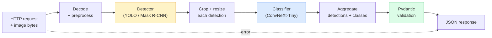

# Build a Complete Vision Pipeline — Capstone | 构建完整视觉流水线 — 毕业项目

> A production vision system is a chain of models and rules stitched with data contracts. The pieces are already in this phase; the capstone wires them together end-to-end.

> **【中文解读】** 生产级视觉系统是多个模型和规则通过数据契约串联而成的链条。本阶段前面的课程已经涵盖了各个组件，这个毕业项目将它们端到端地组装起来，包括数据加载、预处理、模型推理、后处理和结果输出。

**Type:** Build
**Languages:** Python
**Prerequisites:** Phase 4 Lessons 01-15
**Time:** ~120 minutes

## Learning Objectives

- Design a production vision pipeline that detects objects, classifies them, and emits structured JSON — with every failure path handled
- Plug a detector (Mask R-CNN or YOLO), a classifier (ConvNeXt-Tiny), and a data contract (Pydantic) into one service
- Benchmark the end-to-end pipeline and identify the first bottleneck (usually preprocessing, then the detector)
- Ship a minimal FastAPI service that accepts an image upload, runs the pipeline, and returns detections with classifications

> **【中文解读】** 学习目标列出了完成本课后应该掌握的核心能力。建议在开始学习前先浏览目标，学完后对照检查是否达成。


## The Problem | 问题引入

Individual vision models are useful; vision products are chains of them. A retail shelf audit is a detector plus a product classifier plus a price-OCR pipeline. Autonomous driving is a 2D detector plus a 3D detector plus a segmenter plus a tracker plus a planner. A medical pre-screen is a segmenter plus a region classifier plus a clinician UI.

> 单个视觉模型有用；视觉产品是它们的链条。零售货架审计是检测器加产品分类器加价格 OCR 流水线。自动驾驶是 2D 检测器加 3D 检测器加分割器加跟踪器加规划器。医疗预筛是分割器加区域分类器加临床 UI。

Wiring those chains is the part that separates a ML prototype from a product. Every interface between models is a new place for bugs. Every coordinate transform, every normalisation, every mask resize is a silent-failure candidate. A pipeline is as strong as its weakest interface.

> 连接这些链条是将 ML 原型与产品区分开来的部分。模型之间的每个接口都是 bug 的新去处。每次坐标变换、每次归一化、每次掩码缩放都是静默失败的候选。流水线的强度取决于最弱的接口。

This capstone sets up the minimum viable pipeline: detection + classification + structured output + a serving layer. Everything else in Phase 4 slots into this skeleton: swap Mask R-CNN for YOLOv8, add a OCR head, add a segmentation branch, add a tracker. The architecture is stable; the pieces are pluggable.

> 这个毕业项目搭建最小可行流水线：检测 + 分类 + 结构化输出 + 服务层。第四阶段的其他一切都插入这个骨架：把 Mask R-CNN 换成 YOLOv8，添加 OCR 头，添加分割分支，添加跟踪器。架构是稳定的；组件是可插拔的。

## The Concept | 核心概念

> **【中文解读】** 本节介绍核心概念和理论基础。掌握这些概念是后续动手实现的前提，同时也是面试和工程实践中高频考察的知识点。


### The pipeline



Seven stages. The two model stages are expensive; the five other stages are where the bugs live.

> 七个阶段。两个模型阶段是昂贵的；其余五个阶段是 bug 藏身之处。

### Data contracts with Pydantic

Every model boundary becomes a typed object. This turns silent failures into loud ones.

> 每个模型边界都变成类型化对象。这将静默失败变成显式错误。

```
Detection(
    box: tuple[float, float, float, float],   # (x1, y1, x2, y2), absolute pixels
    score: float,                              # [0, 1]
    class_id: int,                             # from detector's label map
    mask: Optional[list[list[int]]],           # RLE-encoded if present
)

PipelineResult(
    image_id: str,
    detections: list[Detection],
    classifications: list[Classification],
    inference_ms: float,
)
```

When a detector returns boxes in `(cx, cy, w, h)` instead of `(x1, y1, x2, y2)`, Pydantic's validation fails at the boundary and you find out immediately instead of debugging a downstream crop that silently returns empty regions.

> 当检测器返回 `(cx, cy, w, h)` 而非 `(x1, y1, x2, y2)` 格式的框时，Pydantic 的验证会在边界处失败，你立刻就能发现问题，而不是调试下游裁剪时发现它静默返回空区域。

### Where latency goes

Three truths hold in nearly every vision pipeline:

> 几乎每个视觉流水线都成立的三个事实：

1. **Preprocessing is often the biggest single block.** Decoding JPEGs, converting colour spaces, resizing — these are CPU-bound and easy to forget.
   中文翻译：**预处理通常是最大的单一开销。** 解码 JPEG、转换色彩空间、缩放——这些都是 CPU 密集型的，容易被遗忘。
2. **The detector dominates GPU time.** 70-90% of GPU time is in the detection forward pass.
   中文翻译：**检测器占据 GPU 时间的主导。** 70-90% 的 GPU 时间花在检测前向传播上。
3. **Postprocessing (NMS, RLE encode/decode) is cheap on GPU, expensive on CPU.** Always profile with the actual target.
   中文翻译：**后处理（NMS、RLE 编解码）在 GPU 上便宜，在 CPU 上昂贵。** 始终在实际目标上分析。

Knowing the distribution is what turns optimisation into a prioritised list.

> 了解分布情况才能将优化变成优先级列表。

### Failure modes

- **Empty detections** — return empty list, do not crash. Log.
  中文翻译：**空检测结果**——返回空列表，不要崩溃。记录日志。
- **Out-of-bounds boxes** — clamp to image size before cropping.
  中文翻译：**越界框**——裁剪前限制到图像尺寸内。
- **Tiny crops** — skip classification for boxes smaller than the classifier's minimum input.
  中文翻译：**微小裁剪**——跳过小于分类器最小输入的框的分类。
- **Corrupt upload** — 400 response with a specific error code, not 500.
  中文翻译：**损坏的上传**——返回带特定错误码的 400 响应，不是 500。
- **Model load failure** — fail at service startup, not at first request.
  中文翻译：**模型加载失败**——在服务启动时失败，而不是第一个请求时。

A production pipeline handles each of these without writing generic `try/except` that hides the failure. Every failure gets a named code and a response.

> 生产级流水线处理每种情况时不用隐藏失败的泛型 `try/except`。每个失败都有命名代码和响应。

### Batching

A production service serves multiple clients. Batching detections and classifications across requests multiplies throughput. The trade-off: extra latency from waiting for a batch to fill. Typical setup: collect requests for up to 20ms, batch together, process, distribute responses. `torchserve` and `triton` do this natively; small services with predictable load roll their own micro-batcher.

> 生产服务同时服务多个客户端。跨请求批量处理检测和分类可以倍增吞吐量。代价：等待批次填满带来的额外延迟。典型设置：收集请求最多 20ms，批量处理，分发响应。`torchserve` 和 `triton` 原生支持；负载可预测的小型服务可以自己实现微批处理器。

> **【拓展：工业部署中的视觉系统】** 在实际工业部署中，视觉模型需要考虑推理延迟、模型大小、边缘设备适配等问题。TensorRT、ONNX Runtime、OpenVINO 是常用的推理加速工具。自动驾驶系统（如 Tesla FSD）通常在车载芯片上实时运行多个视觉模型。

> **【拓展：数据标注与质量】** 视觉任务的效果高度依赖标注数据质量。Label Studio、CVAT 是主流标注工具。在工业场景中，主动学习（Active Learning）可以减少标注成本：模型对不确定的样本请求人工标注，确定性的样本自动标注。

> **【拓展：合成数据与数据增强】** 当真实数据不足时，合成数据（如用 Blender、Unity 渲染）和数据增强（如 albumentations 库）是两种有效策略。NVIDIA 的 Omniverse 平台可以生成高质量的合成训练数据，在自动驾驶和机器人领域应用广泛。


## Build It | 动手实现

> **【中文解读】** 本节通过代码从零实现核心算法。这种 "from scratch" 的方式能帮助理解框架背后的原理，遇到问题时不会被黑盒困住。


### Step 1: Data contracts

```python
from pydantic import BaseModel, Field
from typing import List, Optional, Tuple

class Detection(BaseModel):
    box: Tuple[float, float, float, float]
    score: float = Field(ge=0, le=1)
    class_id: int = Field(ge=0)
    mask_rle: Optional[str] = None


class Classification(BaseModel):
    detection_index: int
    class_id: int
    class_name: str
    score: float = Field(ge=0, le=1)


class PipelineResult(BaseModel):
    image_id: str
    detections: List[Detection]
    classifications: List[Classification]
    inference_ms: float
```

Five seconds of code saves an hour of debugging on any serious pipeline.

> 五秒钟的代码能节省任何严肃流水线上一小时的调试。

### Step 2: A minimal Pipeline class

```python
import time
import numpy as np
import torch
from PIL import Image

class VisionPipeline:
    def __init__(self, detector, classifier, class_names,
                 device="cpu", min_crop=32):
        self.detector = detector.to(device).eval()
        self.classifier = classifier.to(device).eval()
        self.class_names = class_names
        self.device = device
        self.min_crop = min_crop

    def preprocess(self, image):
        """
        image: PIL.Image or np.ndarray (H, W, 3) uint8
        returns: CHW float tensor on device
        """
        if isinstance(image, Image.Image):
            image = np.asarray(image.convert("RGB"))
        tensor = torch.from_numpy(image).permute(2, 0, 1).float() / 255.0
        return tensor.to(self.device)

    @torch.no_grad()
    def detect(self, image_tensor):
        return self.detector([image_tensor])[0]

    @torch.no_grad()
    def classify(self, crops):
        if len(crops) == 0:
            return []
        batch = torch.stack(crops).to(self.device)
        logits = self.classifier(batch)
        probs = logits.softmax(-1)
        scores, cls = probs.max(-1)
        return list(zip(cls.tolist(), scores.tolist()))

    def run(self, image, image_id="anonymous"):
        t0 = time.perf_counter()
        tensor = self.preprocess(image)
        det = self.detect(tensor)

        crops = []
        detections = []
        valid_indices = []
        for i, (box, score, cls) in enumerate(zip(det["boxes"], det["scores"], det["labels"])):
            x1, y1, x2, y2 = [max(0, int(b)) for b in box.tolist()]
            x2 = min(x2, tensor.shape[-1])
            y2 = min(y2, tensor.shape[-2])
            detections.append(Detection(
                box=(x1, y1, x2, y2),
                score=float(score),
                class_id=int(cls),
            ))
            if (x2 - x1) < self.min_crop or (y2 - y1) < self.min_crop:
                continue
            crop = tensor[:, y1:y2, x1:x2]
            crop = torch.nn.functional.interpolate(
                crop.unsqueeze(0),
                size=(224, 224),
                mode="bilinear",
                align_corners=False,
            )[0]
            crops.append(crop)
            valid_indices.append(i)

        class_preds = self.classify(crops)

        classifications = []
        for valid_idx, (cls_id, cls_score) in zip(valid_indices, class_preds):
            classifications.append(Classification(
                detection_index=valid_idx,
                class_id=int(cls_id),
                class_name=self.class_names[cls_id],
                score=float(cls_score),
            ))

        return PipelineResult(
            image_id=image_id,
            detections=detections,
            classifications=classifications,
            inference_ms=(time.perf_counter() - t0) * 1000,
        )
```

Every interface is typed. Every failure path has a specific handling decision.

> 每个接口都是类型化的。每个失败路径都有明确的处理决策。

### Step 3: Wire a detector and a classifier

```python
from torchvision.models.detection import maskrcnn_resnet50_fpn_v2
from torchvision.models import convnext_tiny

# Use ImageNet-pretrained weights for a realistic pipeline without training
detector = maskrcnn_resnet50_fpn_v2(weights="DEFAULT")
classifier = convnext_tiny(weights="DEFAULT")
class_names = [f"imagenet_class_{i}" for i in range(1000)]

pipe = VisionPipeline(detector, classifier, class_names)

# Smoke test with a synthetic image
test_image = (np.random.rand(400, 600, 3) * 255).astype(np.uint8)
result = pipe.run(test_image, image_id="demo")
print(result.model_dump_json(indent=2)[:500])
```

### Step 4: FastAPI service

```python
from fastapi import FastAPI, UploadFile, HTTPException
from io import BytesIO

app = FastAPI()
pipe = None  # initialised on startup

@app.on_event("startup")
def load():
    global pipe
    detector = maskrcnn_resnet50_fpn_v2(weights="DEFAULT").eval()
    classifier = convnext_tiny(weights="DEFAULT").eval()
    pipe = VisionPipeline(detector, classifier, class_names=[f"c{i}" for i in range(1000)])

@app.post("/detect")
async def detect_endpoint(file: UploadFile):
    if file.content_type not in {"image/jpeg", "image/png", "image/webp"}:
        raise HTTPException(status_code=400, detail="unsupported image type")
    data = await file.read()
    try:
        img = Image.open(BytesIO(data)).convert("RGB")
    except Exception:
        raise HTTPException(status_code=400, detail="cannot decode image")
    result = pipe.run(img, image_id=file.filename or "upload")
    return result.model_dump()
```

Run with `uvicorn main:app --host 0.0.0.0 --port 8000`. Test with `curl -F 'file=@dog.jpg' http://localhost:8000/detect`.

> 用 `uvicorn main:app --host 0.0.0.0 --port 8000` 运行。用 `curl -F 'file=@dog.jpg' http://localhost:8000/detect` 测试。

### Step 5: Benchmark the pipeline

```python
import time

def benchmark(pipe, num_runs=20, image_size=(400, 600)):
    img = (np.random.rand(*image_size, 3) * 255).astype(np.uint8)
    pipe.run(img)  # warm up

    stages = {"preprocess": [], "detect": [], "classify": [], "total": []}
    for _ in range(num_runs):
        t0 = time.perf_counter()
        tensor = pipe.preprocess(img)
        t1 = time.perf_counter()
        det = pipe.detect(tensor)
        t2 = time.perf_counter()
        crops = []
        for box in det["boxes"]:
            x1, y1, x2, y2 = [max(0, int(b)) for b in box.tolist()]
            x2 = min(x2, tensor.shape[-1])
            y2 = min(y2, tensor.shape[-2])
            if (x2 - x1) >= pipe.min_crop and (y2 - y1) >= pipe.min_crop:
                crop = tensor[:, y1:y2, x1:x2]
                crop = torch.nn.functional.interpolate(
                    crop.unsqueeze(0), size=(224, 224), mode="bilinear", align_corners=False
                )[0]
                crops.append(crop)
        pipe.classify(crops)
        t3 = time.perf_counter()
        stages["preprocess"].append((t1 - t0) * 1000)
        stages["detect"].append((t2 - t1) * 1000)
        stages["classify"].append((t3 - t2) * 1000)
        stages["total"].append((t3 - t0) * 1000)

    for stage, times in stages.items():
        times.sort()
        print(f"{stage:12s}  p50={times[len(times)//2]:7.1f} ms  p95={times[int(len(times)*0.95)]:7.1f} ms")
```

Typical output on CPU: preprocess ~3 ms, detect 300-500 ms, classify 20-40 ms, total 350-550 ms. On GPU, detect is 20-40 ms and the preprocess + classify start to matter more in relative terms.

> CPU 上的典型输出：预处理约 3ms、检测 300-500ms、分类 20-40ms、总计 350-550ms。在 GPU 上，检测约 20-40ms，预处理和分类的相对占比变得更重要。

> **【中文解读】** 本节展示如何用成熟框架（如 PyTorch、HuggingFace 等）快速应用该技术。在实际项目中，优先使用经过验证的框架实现，可以减少 bug 并提高开发效率。


> **【拓展：视觉模型的持续学习】** 在生产环境中，视觉模型需要不断适应新数据（新产品、新场景、新光照条件）。持续学习（Continual Learning）技术可以防止模型在适应新数据时遗忘旧知识。这在自动驾驶和工业质检中尤为重要。

## Use It | 用框架实现

Production templates converge to the same structure, plus:

- **Model versioning** — always log the model name and weights hash in the response.
- **Per-request trace IDs** — log every stage timing for every request so you can correlate slow responses with stages.
- **Fallback path** — if the classifier times out, return detections without classifications rather than failing the whole request.
- **Safety filters** — NSFW / PII filters run after classification, before the response leaves the service.
- **Batch endpoint** — a `/detect_batch` accepting a list of image URLs for bulk processing.

For production serving, `torchserve`, `Triton Inference Server`, and `BentoML` handle batching, versioning, metrics, and health checks out of the box. Running `FastAPI` directly is fine for prototypes and small-scale products.

> **【中文解读】** 本节关注如何将模型部署为可用的产品。从原型到生产级系统需要考虑性能优化、错误处理、监控等多个维度。


## Ship It | 产出物

This lesson produces:

- `outputs/prompt-vision-service-shape-reviewer.md` — a prompt that reviews a vision service's code for contract/response shape violations and names the first breaking bug.
- `outputs/skill-pipeline-budget-planner.md` — a skill that, given target latency and throughput, assigns a time budget to every pipeline stage and flags which stage will miss its budget first.

> **【中文解读】** 练习题按照 Easy/Medium/Hard 三个难度递进。建议至少完成 Medium 级别的题目，Hard 级别适合深入研究或面试准备。


## Exercises | 练习题

1. **(Easy)** Run the pipeline on 10 images from any open dataset. Report the average time per stage and the distribution of detection counts per image.
2. **(Medium)** Add a mask output field to `Detection` and encode it as RLE. Verify the JSON stays under 1MB even for a 10-object image.
3. **(Hard)** Add a micro-batcher in front of the classifier: collect crops for up to 10 ms, classify them all in one GPU call, return results per request. Measure the throughput gain at 5 concurrent requests per second and the latency added.

> **【中文解读】** 术语表中的 "What people say" vs "What it actually means" 区分了日常口语和精确技术含义。在团队协作中，统一术语定义可以避免大量沟通误解。


## Key Terms | 术语速查表

| Term | What people say | What it actually means |
|------|----------------|----------------------|
| Pipeline | "The system" | An ordered chain of preprocessing, inference, and postprocessing steps with a typed interface between each pair |
| Data contract | "The schema" | Pydantic / dataclass definitions that every stage input and output conforms to; catches integration bugs at the boundary |
| Preprocessing | "Before the model" | Decoding, colour conversion, resizing, normalising; usually the biggest CPU time sink |
| Postprocessing | "After the model" | NMS, mask resize, threshold, RLE encode; cheap on GPU, expensive on CPU |
| Microbatcher | "Collect then forward" | Aggregator that waits a fixed window for multiple requests, runs a single batched forward pass |
| Trace ID | "Request id" | Per-request identifier logged at every stage so slow requests can be traced end-to-end |
| Failure code | "Named error" | Specific error code per failure class instead of generic 500; enables client retry logic |
| Health check | "Readiness probe" | Cheap endpoint that reports whether the service can answer; loadbalancers rely on this |

> **【中文解读】** 延伸阅读提供了深入学习的高质量资源。这些论文和教程是该领域的经典参考文献，适合需要深入理解的读者。


## Further Reading | 延伸阅读

- [Full Stack Deep Learning — Deploying Models](https://fullstackdeeplearning.com/course/2022/lecture-5-deployment/) — the canonical overview of production ML deployment
- [BentoML docs](https://docs.bentoml.com) — serving framework with batching, versioning, and metrics
- [torchserve docs](https://pytorch.org/serve/) — PyTorch's official serving library
- [NVIDIA Triton Inference Server](https://developer.nvidia.com/triton-inference-server) — high-throughput serving with batching and multi-model support
