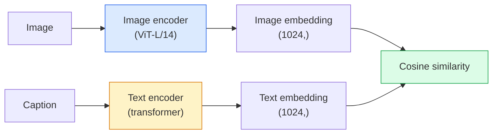

# Open-Vocabulary Vision — CLIP | 开放词汇视觉 — CLIP

> Train an image encoder and a text encoder together so that matching (image, caption) pairs land at the same point in a shared space. That is the whole trick.

> **【中文解读】** CLIP 同时训练图像编码器和文本编码器，使匹配的（图像，描述）对落在共享空间的同一点。就这么简单。这使得零样本分类成为可能——不需要训练数据就能识别任意类别的图像。

> **【拓展：CLIP 是多模态 AI 的基石】** CLIP 是 DALL-E、Stable Diffusion（文本条件）、LLaVA、GPT-4V 等多模态模型的基础组件。它的对比学习预训练范式被广泛采用，开创了 "开放词汇" 视觉的新时代——模型可以理解训练中从未见过的概念。

**Type:** Build + Use
**Languages:** Python
**Prerequisites:** Phase 4 Lesson 14 (ViT), Phase 4 Lesson 17 (Self-Supervised)
**Time:** ~45 minutes

## Learning Objectives

- Explain CLIP's two-tower architecture and contrastive training objective
- Use a pretrained CLIP (or SigLIP) for zero-shot classification without any task-specific training
- Implement zero-shot classification from scratch: encode class prompts, compute cosine similarity, take argmax
- Distinguish CLIP, SigLIP, OpenCLIP, and LLaVA/LLaMA-vision models — what each is for in 2026

> **【中文解读】** 学习目标列出了完成本课后应该掌握的核心能力。建议在开始学习前先浏览目标，学完后对照检查是否达成。


## The Problem | 问题引入

Traditional classifiers are closed-vocabulary: a 1000-class ImageNet model can only predict 1000 labels. Every new category requires labelled data and a retrained head.

CLIP (Radford et al., OpenAI 2021) showed that training on 400M (image, caption) pairs scraped from the web produces a model that can classify into any set of categories at inference, described purely in natural language. You give it a new class by writing a sentence.

That capability — zero-shot transfer — is why every modern vision system starts with a CLIP-family checkpoint. Detection (Grounding DINO, OWL-ViT), segmentation (CLIPSeg, SAM), retrieval, content moderation, VLMs, and text-to-image generation all build on CLIP-style joint embeddings.

## The Concept | 核心概念

> **【中文解读】** 本节介绍核心概念和理论基础。掌握这些概念是后续动手实现的前提，同时也是面试和工程实践中高频考察的知识点。


### Two towers



Both encoders end with a linear projection to the same embedding dimension (512 for CLIP-B/32, 1024 for CLIP-L/14). L2-normalise and compute cosine similarity.

### The objective

Given a batch of N (image, caption) pairs, build an NxN similarity matrix. Train both encoders so the diagonal (matching pairs) has high similarity and off-diagonals (non-matching) have low similarity.

```
sim_matrix = image_embeddings @ text_embeddings.T / tau

loss_i2t = cross_entropy(sim_matrix,       targets=arange(N))
loss_t2i = cross_entropy(sim_matrix.T,     targets=arange(N))
loss = (loss_i2t + loss_t2i) / 2
```

Symmetric because both image-to-text and text-to-image retrieval should work. `tau` (temperature) is typically learned as a scalar parameter, initialised to 0.07.

### SigLIP: a better loss

SigLIP (Zhai et al., 2023) replaced the softmax with per-pair sigmoid:

```
loss = mean over pairs of log(1 + exp(-y_ij * sim_ij))
y_ij = +1 if matching, -1 otherwise
```

Per-pair loss removes the batch-level normalisation that CLIP requires. SigLIP trains better at small batch sizes and matches or exceeds CLIP at equal data.

### Zero-shot classification

Given a trained CLIP:

1. For each class, compose a prompt: "a photo of a {class}".
2. Encode all class prompts with the text encoder -> `T` shape (C, d).
3. Encode the test image -> `I` shape (1, d).
4. Similarity = `I @ T.T` shape (1, C).
5. Argmax -> predicted class.

Prompt engineering matters. OpenAI published 80 prompt templates for ImageNet ("a photo of a {}", "a blurry photo of a {}", "a sketch of a {}", ...). Average the embeddings of all templates per class for an extra 1-3% top-1 accuracy.

### Where CLIP-style models are used in 2026

- **Zero-shot classification** — direct use.
- **Image retrieval** — encode all images once, embed query at inference.
- **Text-conditioned detection** — Grounding DINO, OWL-ViT wrap a CLIP text tower around a detector.
- **Text-conditioned segmentation** — CLIPSeg; SAM uses text-prompt inputs via CLIP.
- **VLMs** — LLaVA, Qwen-VL, InternVL wire a CLIP-family vision encoder into an LLM.
- **Text-to-image gen** — Stable Diffusion, DALL-E 3 condition on CLIP text embeddings.

Once you have a shared embedding space, every vision+language task becomes a distance computation.

> **【中文解读】** 本节通过代码从零实现核心算法。这种 "from scratch" 的方式能帮助理解框架背后的原理，遇到问题时不会被黑盒困住。

> **【拓展：工业部署中的视觉系统】** 在实际工业部署中，视觉模型需要考虑推理延迟、模型大小、边缘设备适配等问题。TensorRT、ONNX Runtime、OpenVINO 是常用的推理加速工具。自动驾驶系统（如 Tesla FSD）通常在车载芯片上实时运行多个视觉模型。

> **【拓展：数据标注与质量】** 视觉任务的效果高度依赖标注数据质量。Label Studio、CVAT 是主流标注工具。在工业场景中，主动学习（Active Learning）可以减少标注成本：模型对不确定的样本请求人工标注，确定性的样本自动标注。


## Build It | 动手实现

### Step 1: A tiny two-tower model

Real CLIP is ViT + transformer. For this lesson the towers are small MLPs over pre-extracted features so the training signal is visible on CPU.

```python
import torch
import torch.nn as nn
import torch.nn.functional as F


class TwoTower(nn.Module):
    def __init__(self, img_in=128, txt_in=64, emb=64):
        super().__init__()
        self.image_proj = nn.Sequential(nn.Linear(img_in, 128), nn.ReLU(), nn.Linear(128, emb))
        self.text_proj = nn.Sequential(nn.Linear(txt_in, 128), nn.ReLU(), nn.Linear(128, emb))
        self.logit_scale = nn.Parameter(torch.ones([]) * 2.6592)  # ln(1/0.07)

    def forward(self, img_feats, txt_feats):
        i = F.normalize(self.image_proj(img_feats), dim=-1)
        t = F.normalize(self.text_proj(txt_feats), dim=-1)
        return i, t, self.logit_scale.exp()
```

Two projections, shared-dim output, learned temperature. Same shape as the real CLIP API.

### Step 2: Contrastive loss

```python
def clip_loss(image_emb, text_emb, logit_scale):
    N = image_emb.size(0)
    sim = logit_scale * image_emb @ text_emb.T
    targets = torch.arange(N, device=sim.device)
    l_i = F.cross_entropy(sim, targets)
    l_t = F.cross_entropy(sim.T, targets)
    return (l_i + l_t) / 2
```

Symmetric. Higher logit_scale = sharper softmax = more confident but risk of instability.

### Step 3: Zero-shot classifier

```python
@torch.no_grad()
def zero_shot_classify(model, image_feats, class_text_feats, class_names):
    """
    image_feats:      (N, img_in)
    class_text_feats: (C, txt_in)   one averaged embedding per class
    """
    i = F.normalize(model.image_proj(image_feats), dim=-1)
    t = F.normalize(model.text_proj(class_text_feats), dim=-1)
    sim = i @ t.T
    pred = sim.argmax(dim=-1)
    return [class_names[p] for p in pred.tolist()]
```

One line per step. This is the exact zero-shot procedure used with a production CLIP checkpoint.

### Step 4: Sanity check

```python
torch.manual_seed(0)
model = TwoTower()

img = torch.randn(8, 128)
txt = torch.randn(8, 64)
i, t, scale = model(img, txt)
loss = clip_loss(i, t, scale)
print(f"batch size: {i.size(0)}   loss: {loss.item():.3f}")
```

Loss should be close to `log(N) = log(8) = 2.08` for a randomly initialised model — the symmetric cross-entropy target when no structure is learned yet.

> **【中文解读】** 本节展示如何用成熟框架（如 PyTorch、HuggingFace 等）快速应用该技术。在实际项目中，优先使用经过验证的框架实现，可以减少 bug 并提高开发效率。


> **【拓展：视觉模型的持续学习】** 在生产环境中，视觉模型需要不断适应新数据（新产品、新场景、新光照条件）。持续学习（Continual Learning）技术可以防止模型在适应新数据时遗忘旧知识。这在自动驾驶和工业质检中尤为重要。

## Use It | 用框架实现

OpenCLIP is the community default in 2026:

```python
import open_clip
import torch
from PIL import Image

model, _, preprocess = open_clip.create_model_and_transforms("ViT-B-32", pretrained="laion2b_s34b_b79k")
tokenizer = open_clip.get_tokenizer("ViT-B-32")

image = preprocess(Image.open("dog.jpg")).unsqueeze(0)
text = tokenizer(["a photo of a dog", "a photo of a cat", "a photo of a car"])

with torch.no_grad():
    image_features = model.encode_image(image)
    text_features = model.encode_text(text)
    image_features = image_features / image_features.norm(dim=-1, keepdim=True)
    text_features = text_features / text_features.norm(dim=-1, keepdim=True)
    probs = (100.0 * image_features @ text_features.T).softmax(dim=-1)

> **【中文解读】** 本节关注如何将模型部署为可用的产品。从原型到生产级系统需要考虑性能优化、错误处理、监控等多个维度。


print(probs)
```

SigLIP is newer, trains better at small scales, and is preferred for new work: `google/siglip-base-patch16-224`. Hugging Face ships both.


## Ship It | 产出物

> **【中文解读】** 练习题按照 Easy/Medium/Hard 三个难度递进。建议至少完成 Medium 级别的题目，Hard 级别适合深入研究或面试准备。


This lesson produces:

- `outputs/prompt-zero-shot-class-picker.md` — a prompt that designs class templates for zero-shot CLIP given a list of classes and a domain.
- `outputs/skill-image-text-retriever.md` — a skill that builds an image embedding index with any CLIP checkpoint, supports query-by-text and query-by-image.

## Exercises | 练习题

1. **(Easy)** Use a pretrained OpenCLIP ViT-B/32 and do zero-shot classification on CIFAR-10 with the 80-template prompt set. Report top-1 accuracy; it should be around 85-90%.
2. **(Medium)** Compare single-template ("a photo of a {}") vs 80-template averaged embeddings on the same CIFAR-10 task. Quantify the gap and explain why templates help.
3. **(Hard)** Build a zero-shot image retrieval index: embed 1,000 images with CLIP, build a FAISS index, query with a natural language description. Report retrieval recall@5 for 20 held-out queries you write by hand.

> **【中文解读】** 术语表中的 "What people say" vs "What it actually means" 区分了日常口语和精确技术含义。在团队协作中，统一术语定义可以避免大量沟通误解。


## Key Terms | 术语速查表

| Term | What people say | What it actually means |
|------|----------------|----------------------|
| Two-tower | "Dual encoder" | Separate image and text encoders ending in a shared-dim projection head |
| Zero-shot | "No task-specific training" | Classify into classes described only by text at inference; no labels touched |
| Temperature / logit_scale | "tau" | Learned scalar that scales the similarity matrix before softmax |
| Prompt template | "A photo of a {}" | Natural-language wrapper around class names; averaging many templates boosts zero-shot accuracy |
| CLIP | "Image+text model" | The 2021 OpenAI model; vocabulary of the field in 2026 |
| SigLIP | "Sigmoid CLIP" | Swaps softmax for per-pair sigmoid; trains better at small batches |
| OpenCLIP | "Open reproduction" | Community-trained CLIP variants on LAION; production default for open-source pipelines |
| VLM | "Vision-language model" | A CLIP-family encoder plus an LLM, trained to answer questions about images |

> **【中文解读】** 延伸阅读提供了深入学习的高质量资源。这些论文和教程是该领域的经典参考文献，适合需要深入理解的读者。


## Further Reading | 延伸阅读

- [CLIP: Learning Transferable Visual Models from Natural Language Supervision (Radford et al., 2021)](https://arxiv.org/abs/2103.00020)
- [SigLIP: Sigmoid Loss for Language-Image Pre-Training (Zhai et al., 2023)](https://arxiv.org/abs/2303.15343)
- [OpenCLIP](https://github.com/mlfoundations/open_clip) — the community codebase
- [DINOv2 vs CLIP vs MAE: a features comparison](https://huggingface.co/blog/dinov2) — HF guide with side-by-side use cases
