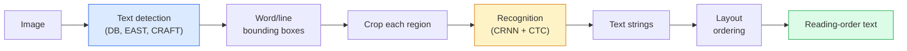

# OCR 与文档理解

> OCR is a three-stage pipeline — detect text boxes, recognise the characters, then lay them out. Every modern OCR system reorders these stages or merges them.

> **【中文解读】** OCR（光学字符识别）是三阶段流水线：检测文本框 → 识别字符 → 布局分析。现代 OCR 系统将这些阶段重新排序或合并。文档理解不仅识别文字，还理解表格、图表、版面结构。

> **【拓展：文档理解的金融应用】** OCR 与文档理解在金融领域有广泛应用：银行流水识别、发票自动处理、合同智能审查、财务报表解析。LayoutLM、Donut 等模型将视觉和文本信息融合，实现了端到端的文档理解。

**类型：** Learn + Use
**语言：** Python
**前置知识：** Phase 4 Lesson 06 (Detection), Phase 7 Lesson 02 (Self-Attention)
**预计时间：** ~45 minutes

## 学习目标

- Trace the classical OCR pipeline (detect -> recognise -> layout) and the modern end-to-end alternatives (Donut, Qwen-VL-OCR)
- Implement CTC (Connectionist Temporal Classification) loss for sequence-to-sequence OCR training
- Use PaddleOCR or EasyOCR for production document parsing without training
- Distinguish OCR, layout parsing, and document understanding — and pick the right tool per task

> **【中文解读】** 学习目标列出了完成本课后应该掌握的核心能力。建议在开始学习前先浏览目标，学完后对照检查是否达成。


## 问题引入

Images full of text are everywhere: receipts, invoices, IDs, scanned books, forms, whiteboards, signs, screenshots. Extracting structured data from them — not just the characters, but "this is the total amount" — is one of the highest-value applied-vision problems.

The field splits into three skill layers:

1. **OCR proper**: turn pixels into text.
2. **Layout parsing**: group OCR output into regions (title, body, table, header).
3. **Document understanding**: extract structured fields ("invoice_total = $42.50") from layout.

Each layer has classical and modern approaches, and the gap between "I want text from an image" and "I need the total amount from this receipt" is bigger than most teams realise.

## 核心概念

> **【中文解读】** 本节介绍核心概念和理论基础。掌握这些概念是后续动手实现的前提，同时也是面试和工程实践中高频考察的知识点。


### The classical pipeline



- **Text detection** produces per-line or per-word quadrilaterals.
- **Recognition** crops each region to a fixed height, runs a CNN + BiLSTM + CTC to produce a character sequence.
- **Layout** rebuilds reading order (top-to-bottom, left-to-right for Latin; different for Arabic, Japanese).

### CTC in one paragraph

OCR recognition produces a variable-length sequence from a fixed-length feature map. CTC (Graves et al., 2006) lets you train this without character-level alignment. The model outputs a distribution over (vocab + blank) at every time step; CTC loss marginalises over all alignments that reduce to the target text after merging repeats and removing blanks.

```
raw output: "h h h _ _ e e l l _ l l o _ _"
after merge repeats and remove blanks: "hello"
```

CTC is the reason CRNN worked in 2015 and still trains most production OCR models in 2026.

### Modern end-to-end models

- **Donut** (Kim et al., 2022) — a ViT encoder + a text decoder; reads an image and emits JSON directly. No text detector, no layout module.
- **TrOCR** — ViT + transformer decoder for line-level OCR.
- **Qwen-VL-OCR / InternVL** — full vision-language models fine-tuned for OCR tasks; best accuracy in 2026 on complex documents.
- **PaddleOCR** — classical DB + CRNN pipeline in a mature production package; still the open-source workhorse.

End-to-end models need more data and compute but skip the error accumulation of multi-stage pipelines.

### Layout parsing

For structured documents, run a layout detector (LayoutLMv3, DocLayNet) that labels each region: Title, Paragraph, Figure, Table, Footnote. Reading order then becomes "iterate through regions in layout order, concatenate."

For forms, use **Key-Value extraction** models (Donut for visually-rich documents, LayoutLMv3 for plain scans). They take image + detected text + positions and predict structured key-value pairs.

### Evaluation metrics

- **Character Error Rate (CER)** — Levenshtein distance / length of reference. Lower is better. Production target: < 2% on clean scans.
- **Word Error Rate (WER)** — same at the word level.
- **F1 on structured fields** — for key-value tasks; measures whether `{invoice_total: 42.50}` appears correctly.
- **Edit distance on JSON** — for end-to-end document parsing; the Donut paper introduced normalised tree edit distance.

> **【中文解读】** 本节通过代码从零实现核心算法。这种 "from scratch" 的方式能帮助理解框架背后的原理，遇到问题时不会被黑盒困住。

> **【拓展：工业部署中的视觉系统】** 在实际工业部署中，视觉模型需要考虑推理延迟、模型大小、边缘设备适配等问题。TensorRT、ONNX Runtime、OpenVINO 是常用的推理加速工具。自动驾驶系统（如 Tesla FSD）通常在车载芯片上实时运行多个视觉模型。

> **【拓展：数据标注与质量】** 视觉任务的效果高度依赖标注数据质量。Label Studio、CVAT 是主流标注工具。在工业场景中，主动学习（Active Learning）可以减少标注成本：模型对不确定的样本请求人工标注，确定性的样本自动标注。


## 动手实现

### Step 1: CTC loss + greedy decoder

```python
import torch
import torch.nn as nn
import torch.nn.functional as F


def ctc_loss(log_probs, targets, input_lengths, target_lengths, blank=0):
    """
    log_probs:      (T, N, C) log-softmax over vocab including blank at index 0
    targets:        (N, S) int targets (no blanks)
    input_lengths:  (N,) per-sample time steps used
    target_lengths: (N,) per-sample target length
    """
    return F.ctc_loss(log_probs, targets, input_lengths, target_lengths,
                      blank=blank, reduction="mean", zero_infinity=True)


def greedy_ctc_decode(log_probs, blank=0):
    """
    log_probs: (T, N, C) log-softmax
    returns: list of index sequences (blanks removed, repeats merged)
    """
    preds = log_probs.argmax(dim=-1).transpose(0, 1).cpu().tolist()
    out = []
    for seq in preds:
        decoded = []
        prev = None
        for idx in seq:
            if idx != prev and idx != blank:
                decoded.append(idx)
            prev = idx
        out.append(decoded)
    return out
```

`F.ctc_loss` uses the efficient CuDNN implementation when available. The greedy decoder is simpler than a beam search and usually within 1% CER of it.

### Step 2: Tiny CRNN recogniser

Minimal CNN + BiLSTM for line OCR.

```python
class TinyCRNN(nn.Module):
    def __init__(self, vocab_size=40, hidden=128, feat=32):
        super().__init__()
        self.cnn = nn.Sequential(
            nn.Conv2d(1, feat, 3, 1, 1), nn.BatchNorm2d(feat), nn.ReLU(inplace=True),
            nn.MaxPool2d(2),
            nn.Conv2d(feat, feat * 2, 3, 1, 1), nn.BatchNorm2d(feat * 2), nn.ReLU(inplace=True),
            nn.MaxPool2d(2),
            nn.Conv2d(feat * 2, feat * 4, 3, 1, 1), nn.BatchNorm2d(feat * 4), nn.ReLU(inplace=True),
            nn.MaxPool2d((2, 1)),
            nn.Conv2d(feat * 4, feat * 4, 3, 1, 1), nn.BatchNorm2d(feat * 4), nn.ReLU(inplace=True),
            nn.MaxPool2d((2, 1)),
        )
        self.rnn = nn.LSTM(feat * 4, hidden, bidirectional=True, batch_first=True)
        self.head = nn.Linear(hidden * 2, vocab_size)

    def forward(self, x):
        # x: (N, 1, H, W)
        f = self.cnn(x)                # (N, C, H', W')
        f = f.mean(dim=2).transpose(1, 2)  # (N, W', C)
        h, _ = self.rnn(f)
        return F.log_softmax(self.head(h).transpose(0, 1), dim=-1)  # (W', N, vocab)
```

Fixed-height input (the CNN max-pools height to 1). Width is the time dimension for CTC.

### Step 3: Synthetic OCR

Generate black-on-white digit strings for an end-to-end smoke test.

```python
import numpy as np

def synthetic_line(text, height=32, char_width=16):
    W = char_width * len(text)
    img = np.ones((height, W), dtype=np.float32)
    for i, c in enumerate(text):
        x = i * char_width
        shade = 0.0 if c.isalnum() else 0.5
        img[6:height - 6, x + 2:x + char_width - 2] = shade
    return img


def build_batch(strings, vocab):
    H = 32
    W = 16 * max(len(s) for s in strings)
    imgs = np.ones((len(strings), 1, H, W), dtype=np.float32)
    target_lengths = []
    targets = []
    for i, s in enumerate(strings):
        imgs[i, 0, :, :16 * len(s)] = synthetic_line(s)
        ids = [vocab.index(c) for c in s]
        targets.extend(ids)
        target_lengths.append(len(ids))
    return torch.from_numpy(imgs), torch.tensor(targets), torch.tensor(target_lengths)


vocab = ["_"] + list("0123456789abcdefghijklmnopqrstuvwxyz")
imgs, targets, lengths = build_batch(["hello", "world"], vocab)
print(f"images: {imgs.shape}   targets: {targets.shape}   lengths: {lengths.tolist()}")
```

A real OCR dataset adds fonts, noise, rotation, blur, and colour. The pipeline above is identical.

### Step 4: Training sketch

```python
model = TinyCRNN(vocab_size=len(vocab))
opt = torch.optim.Adam(model.parameters(), lr=1e-3)

for step in range(200):
    strings = ["abc" + str(step % 10)] * 4 + ["xyz" + str((step + 1) % 10)] * 4
    imgs, targets, target_lens = build_batch(strings, vocab)
    log_probs = model(imgs)  # (W', 8, vocab)
    input_lens = torch.full((8,), log_probs.size(0), dtype=torch.long)
    loss = ctc_loss(log_probs, targets, input_lens, target_lens, blank=0)
    opt.zero_grad(); loss.backward(); opt.step()
```

> **【中文解读】** 本节展示如何用成熟框架（如 PyTorch、HuggingFace 等）快速应用该技术。在实际项目中，优先使用经过验证的框架实现，可以减少 bug 并提高开发效率。


Loss should drop from ~3 to ~0.2 over 200 steps on this trivial synthetic data.


> **【拓展：视觉模型的持续学习】** 在生产环境中，视觉模型需要不断适应新数据（新产品、新场景、新光照条件）。持续学习（Continual Learning）技术可以防止模型在适应新数据时遗忘旧知识。这在自动驾驶和工业质检中尤为重要。

## 用框架实现

Three production paths:

- **PaddleOCR** — mature, fast, multilingual. One-line usage: `paddleocr.PaddleOCR(lang="en").ocr(image_path)`.
- **EasyOCR** — Python-native, multilingual, PyTorch backbone.
- **Tesseract** — classical; still useful for old scanned documents when models struggle.

For end-to-end document parsing, use Donut or a VLM:

```python
from transformers import DonutProcessor, VisionEncoderDecoderModel

processor = DonutProcessor.from_pretrained("naver-clova-ix/donut-base-finetuned-cord-v2")
model = VisionEncoderDecoderModel.from_pretrained("naver-clova-ix/donut-base-finetuned-cord-v2")
```

> **【中文解读】** 本节关注如何将模型部署为可用的产品。从原型到生产级系统需要考虑性能优化、错误处理、监控等多个维度。


For receipts, invoices, and forms with repeatable structure, fine-tune Donut. For arbitrary documents or OCR with reasoning, a VLM like Qwen-VL-OCR is the current default.


## 产出物

> **【中文解读】** 练习题按照 Easy/Medium/Hard 三个难度递进。建议至少完成 Medium 级别的题目，Hard 级别适合深入研究或面试准备。


This lesson produces:

- `outputs/prompt-ocr-stack-picker.md` — a prompt that picks Tesseract / PaddleOCR / Donut / VLM-OCR given document type, language, and structure.
- `outputs/skill-ctc-decoder.md` — a skill that writes greedy and beam-search CTC decoders from scratch, including length normalisation.

## 练习题

> **【中文解读】** 术语表中的 "What people say" vs "What it actually means" 区分了日常口语和精确技术含义。在团队协作中，统一术语定义可以避免大量沟通误解。


1. **(Easy)** Train the TinyCRNN on 5-digit random numeric strings for 500 steps. Report CER on a held-out set.
2. **(Medium)** Replace greedy decoding with beam search (beam_width=5). Report CER delta. On which inputs does beam search win?
3. **(Hard)** Use PaddleOCR on a set of 20 receipts, extract line items, and compute F1 against hand-labelled ground truth for {item_name, price} pairs.

## 术语速查表

| Term | What people say | What it actually means |
|------|----------------|----------------------|
| OCR | "Text from pixels" | Turning image regions into character sequences |
| CTC | "Alignment-free loss" | Loss that trains a sequence model without per-timestep labels; marginalises over alignments |
| CRNN | "Classic OCR model" | Conv feature extractor + BiLSTM + CTC; the 2015 baseline still used in production |
| Donut | "End-to-end OCR" | ViT encoder + text decoder; emits JSON directly from image |
| Layout parsing | "Find regions" | Detect and label Title/Table/Figure/Paragraph regions in a document |
| Reading order | "Text sequence" | Ordering of recognised regions into a sentence; trivial for Latin, non-trivial for mixed layouts |
| CER / WER | "Error rates" | Levenshtein distance / reference length at character or word granularity |
| VLM-OCR | "LLM that reads" | A vision-language model trained or prompted for OCR tasks; current SOTA on complex documents |

> **【中文解读】** 延伸阅读提供了深入学习的高质量资源。这些论文和教程是该领域的经典参考文献，适合需要深入理解的读者。


## 延伸阅读

- [CRNN (Shi et al., 2015)](https://arxiv.org/abs/1507.05717) — the original CNN+RNN+CTC architecture
- [CTC (Graves et al., 2006)](https://www.cs.toronto.edu/~graves/icml_2006.pdf) — the original CTC paper; densely packed with the algorithmic ideas
- [Donut (Kim et al., 2022)](https://arxiv.org/abs/2111.15664) — OCR-free document understanding transformer
- [PaddleOCR](https://github.com/PaddlePaddle/PaddleOCR) — the open-source production OCR stack