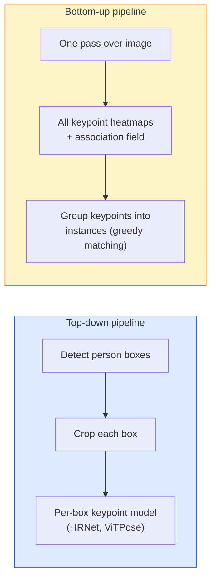

# Keypoint Detection & Pose Estimation | 关键点检测与姿态估计

> A pose is a set of ordered keypoints. A keypoint detector is a heatmap regressor. Everything else is bookkeeping.

> **【中文解读】** 姿态是一组有序的关键点（如人体的 17 个关节点）。关键点检测器本质上是一个热力图回归器——为每个关键点预测一张概率热力图。姿态估计广泛应用于运动分析、人机交互和 AR 滤镜。

> **【拓展：姿态估计的应用】** OpenPose、MediaPipe、YOLO-Pose 是常见的姿态估计工具。应用场景包括：健身动作纠正（Keep）、手势控制（HoloLens）、运动分析（体育训练）、虚拟试衣等。

**Type:** Build
**Languages:** Python
**Prerequisites:** Phase 4 Lesson 06 (Detection), Phase 4 Lesson 07 (U-Net)
**Time:** ~45 minutes

## Learning Objectives

- Distinguish top-down and bottom-up pose estimation and state when each is used
- Regress heatmaps for K keypoints with a Gaussian-per-keypoint target and extract keypoint coordinates at inference
- Explain Part Affinity Fields (PAFs) and how bottom-up pipelines associate keypoints into instances
- Use MediaPipe Pose or MMPose for production keypoint estimation and understand their output format

> **【中文解读】** 学习目标列出了完成本课后应该掌握的核心能力。建议在开始学习前先浏览目标，学完后对照检查是否达成。


## The Problem | 问题引入

Keypoint tasks hide under many names: human pose (17 body joints), face landmarks (68 or 478 points), hand (21 points), animal pose, robotic object pose, medical anatomy landmarks. Every one of them shares the same structure: detect K discrete points on an object and output their (x, y) coordinates.

> 关键点任务隐藏在许多名称下：人体姿态（17 个身体关节）、面部特征点（68 或 478 个点）、手部（21 个点）、动物姿态、机器人物体姿态、医学解剖标志。每一个都有相同的结构：检测物体上的 K 个离散点并输出它们的 (x, y) 坐标。

Pose estimation is the foundation of motion capture, fitness apps, sports analytics, gesture control, animation, AR try-on, and robotic grasping. The 2D case is mature; 3D pose (estimating joint positions in world coordinates from a single camera) is the current research frontier.

> 姿态估计是动作捕捉、健身应用、运动分析、手势控制、动画、AR 试穿和机器人抓取的基础。2D 情况已经成熟；3D 姿态（从单个相机估计世界坐标中的关节位置）是当前的研究前沿。

The engineering question is scale. A single-image, single-person pose is a 20ms problem. Multi-person pose in a crowd at 30 fps is a different problem with different architectures.

> 工程问题是规模。单图像、单人的姿态是一个 20ms 的问题。人群中 30fps 的多人姿态是一个有着不同架构的不同问题。

## The Concept | 核心概念

> **【中文解读】** 本节介绍核心概念和理论基础。掌握这些概念是后续动手实现的前提，同时也是面试和工程实践中高频考察的知识点。


### Top-down vs bottom-up



- **Top-down** — detect people first, then run a per-person keypoint model on each crop. Highest accuracy; scales linearly with number of people.
- **Bottom-up** — one forward pass predicts all keypoints plus an association field; group them. Constant time regardless of crowd size.

Top-down (HRNet, ViTPose) is the accuracy leader; bottom-up (OpenPose, HigherHRNet) is the throughput leader for crowded scenes.

### Heatmap regression

Instead of regressing `(x, y)` directly, predict an `H x W` heatmap per keypoint with a Gaussian blob centred at the true location.

```
target[k, y, x] = exp(-((x - cx_k)^2 + (y - cy_k)^2) / (2 sigma^2))
```

At inference, the argmax of each heatmap is the predicted keypoint location.

Why heatmaps work better than direct regression: the network's spatial structure (conv feature map) aligns naturally with spatial output. Gaussian targets also regularise — a small localisation error produces a small loss, not zero.

### Sub-pixel localisation

Argmax gives integer coordinates. For sub-pixel precision, refine by fitting a parabola to the argmax and its neighbours, or use the well-known offset `(dx, dy) = 0.25 * (heatmap[y, x+1] - heatmap[y, x-1], ...)` direction.

### Part Affinity Fields (PAFs)

OpenPose's trick for bottom-up association. For each pair of connected keypoints (e.g. left shoulder to left elbow), predict a 2-channel field that encodes the unit vector pointing from one to the other. To associate a shoulder with its elbow, integrate the PAF along the line connecting candidate pairs; the pair with the highest integral is matched.

```
For each connection (limb):
  PAF channels: 2 (unit vector x, y)
  Line integral: sum over sample points of (PAF . line_direction)
  Higher integral = stronger match
```

Elegant and scales to arbitrary crowd sizes without per-person crops.

### COCO keypoints

The standard body-pose dataset: 17 keypoints per person, PCK (Percentage of Correct Keypoints) and OKS (Object Keypoint Similarity) as metrics. OKS is the keypoint analogue of IoU and is what COCO mAP@OKS reports.

### 2D vs 3D

- **2D pose** — image coordinates; solved at production quality (MediaPipe, HRNet, ViTPose).
- **3D pose** — world / camera coordinates; still active research. Common approaches:
  - Lift 2D predictions to 3D with a small MLP (VideoPose3D).
  - Direct 3D regression from image (PyMAF, MHFormer).
  - Multi-view setups (CMU Panoptic) for ground truth.

> **【中文解读】** 本节通过代码从零实现核心算法。这种 "from scratch" 的方式能帮助理解框架背后的原理，遇到问题时不会被黑盒困住。

> **【拓展：工业部署中的视觉系统】** 在实际工业部署中，视觉模型需要考虑推理延迟、模型大小、边缘设备适配等问题。TensorRT、ONNX Runtime、OpenVINO 是常用的推理加速工具。自动驾驶系统（如 Tesla FSD）通常在车载芯片上实时运行多个视觉模型。

> **【拓展：数据标注与质量】** 视觉任务的效果高度依赖标注数据质量。Label Studio、CVAT 是主流标注工具。在工业场景中，主动学习（Active Learning）可以减少标注成本：模型对不确定的样本请求人工标注，确定性的样本自动标注。


## Build It | 动手实现

### Step 1: Gaussian heatmap target

```python
import numpy as np
import torch

def gaussian_heatmap(size, cx, cy, sigma=2.0):
    yy, xx = np.meshgrid(np.arange(size), np.arange(size), indexing="ij")
    return np.exp(-((xx - cx) ** 2 + (yy - cy) ** 2) / (2 * sigma ** 2)).astype(np.float32)

hm = gaussian_heatmap(64, 32, 32, sigma=2.0)
print(f"peak: {hm.max():.3f} at ({hm.argmax() % 64}, {hm.argmax() // 64})")
```

Per-keypoint heatmaps stacked along a channel axis give the full target tensor.

### Step 2: Tiny keypoint head

A U-Net-style model that outputs K heatmap channels.

```python
import torch.nn as nn
import torch.nn.functional as F

class TinyKeypointNet(nn.Module):
    def __init__(self, num_keypoints=4, base=16):
        super().__init__()
        self.down1 = nn.Sequential(nn.Conv2d(3, base, 3, 2, 1), nn.ReLU(inplace=True))
        self.down2 = nn.Sequential(nn.Conv2d(base, base * 2, 3, 2, 1), nn.ReLU(inplace=True))
        self.mid = nn.Sequential(nn.Conv2d(base * 2, base * 2, 3, 1, 1), nn.ReLU(inplace=True))
        self.up1 = nn.ConvTranspose2d(base * 2, base, 2, 2)
        self.up2 = nn.ConvTranspose2d(base, num_keypoints, 2, 2)

    def forward(self, x):
        h1 = self.down1(x)
        h2 = self.down2(h1)
        h3 = self.mid(h2)
        u1 = self.up1(h3)
        return self.up2(u1)
```

Input `(N, 3, H, W)`, output `(N, K, H, W)`. Loss is per-pixel MSE against Gaussian targets.

### Step 3: Inference — extract keypoint coordinates

```python
def heatmap_to_coords(heatmaps):
    """
    heatmaps: (N, K, H, W)
    returns:  (N, K, 2) float coordinates in image pixels
    """
    N, K, H, W = heatmaps.shape
    hm = heatmaps.reshape(N, K, -1)
    idx = hm.argmax(dim=-1)
    ys = (idx // W).float()
    xs = (idx % W).float()
    return torch.stack([xs, ys], dim=-1)

coords = heatmap_to_coords(torch.randn(2, 4, 32, 32))
print(f"coords: {coords.shape}")  # (2, 4, 2)
```

One line at inference. For sub-pixel refinement, interpolate around the argmax.

### Step 4: Synthetic keypoint dataset

Simple: draw four points on a white canvas and learn to predict them.

```python
def make_synthetic_sample(size=64):
    img = np.ones((3, size, size), dtype=np.float32)
    rng = np.random.default_rng()
    kps = rng.integers(8, size - 8, size=(4, 2))
    for cx, cy in kps:
        img[:, cy - 2:cy + 2, cx - 2:cx + 2] = 0.0
    hms = np.stack([gaussian_heatmap(size, cx, cy) for cx, cy in kps])
    return img, hms, kps
```

Easy enough for a tiny model to learn in a minute.

### Step 5: Training

```python
model = TinyKeypointNet(num_keypoints=4)
opt = torch.optim.Adam(model.parameters(), lr=3e-3)

for step in range(200):
    batch = [make_synthetic_sample() for _ in range(16)]
    imgs = torch.from_numpy(np.stack([b[0] for b in batch]))
    hms = torch.from_numpy(np.stack([b[1] for b in batch]))
    pred = model(imgs)
    # Upsample pred to full resolution
    pred = F.interpolate(pred, size=hms.shape[-2:], mode="bilinear", align_corners=False)
    loss = F.mse_loss(pred, hms)
    opt.zero_grad(); loss.backward(); opt.step()
```

> **【中文解读】** 本节展示如何用成熟框架（如 PyTorch、HuggingFace 等）快速应用该技术。在实际项目中，优先使用经过验证的框架实现，可以减少 bug 并提高开发效率。


> **【拓展：视觉模型的持续学习】** 在生产环境中，视觉模型需要不断适应新数据（新产品、新场景、新光照条件）。持续学习（Continual Learning）技术可以防止模型在适应新数据时遗忘旧知识。这在自动驾驶和工业质检中尤为重要。

## Use It | 用框架实现

- **MediaPipe Pose** — Google's production pose estimator; ships WebGL + mobile runtimes with sub-10ms latency.
- **MMPose** (OpenMMLab) — comprehensive research codebase; every SOTA architecture with pretrained weights.
- **YOLOv8-pose** — fastest real-time multi-person pose with a single forward pass.
- **transformers HumanDPT / PoseAnything** — newer vision-language approaches for open-vocabulary pose (any object, any keypoint set).

> **【中文解读】** 本节关注如何将模型部署为可用的产品。从原型到生产级系统需要考虑性能优化、错误处理、监控等多个维度。


## Ship It | 产出物

> **【中文解读】** 练习题按照 Easy/Medium/Hard 三个难度递进。建议至少完成 Medium 级别的题目，Hard 级别适合深入研究或面试准备。


This lesson produces:

- `outputs/prompt-pose-stack-picker.md` — a prompt that picks MediaPipe / YOLOv8-pose / HRNet / ViTPose given latency, crowd size, and 2D vs 3D need.
- `outputs/skill-heatmap-to-coords.md` — a skill that writes the sub-pixel heatmap-to-coordinate routine used by every production pose model.

## Exercises | 练习题

1. **(Easy)** Train the tiny keypoint model on the synthetic 4-point dataset. Report mean L2 error between predicted and true keypoints after 200 steps.
2. **(Medium)** Add sub-pixel refinement: given the argmax position, fit a 1D parabola along x and y from the neighbouring pixels. Report the accuracy gain vs integer argmax.
3. **(Hard)** Build a 2-person synthetic dataset where each image shows two instances of the 4-keypoint pattern. Train a bottom-up pipeline with PAFs that predict which keypoint belongs to which instance, and evaluate OKS.

> **【中文解读】** 术语表中的 "What people say" vs "What it actually means" 区分了日常口语和精确技术含义。在团队协作中，统一术语定义可以避免大量沟通误解。


## Key Terms | 术语速查表

| Term | What people say | What it actually means |
|------|----------------|----------------------|
| Keypoint | "A landmark" | A specific ordered point on an object (joint, corner, feature) |
| Pose | "The skeleton" | An ordered set of keypoints belonging to one instance |
| Top-down | "Detect then pose" | Two-stage pipeline: person detector + per-crop keypoint model; highest accuracy |
| Bottom-up | "Pose first, group later" | Single-pass all-keypoint prediction + grouping; constant time in crowd size |
| Heatmap | "Gaussian target" | H x W tensor per keypoint with peak at the true location; the preferred regression target |
| PAF | "Part Affinity Field" | 2-channel unit vector field encoding limb directions; used to group keypoints into instances |
| OKS | "Keypoint IoU" | Object Keypoint Similarity; the COCO metric for pose |
| HRNet | "High-Resolution Net" | The dominant top-down keypoint architecture; preserves high-res features throughout |

> **【中文解读】** 延伸阅读提供了深入学习的高质量资源。这些论文和教程是该领域的经典参考文献，适合需要深入理解的读者。


## Further Reading | 延伸阅读

- [OpenPose (Cao et al., 2017)](https://arxiv.org/abs/1812.08008) — bottom-up with PAFs; still the best writeup of the approach
- [HRNet (Sun et al., 2019)](https://arxiv.org/abs/1902.09212) — the top-down reference architecture
- [ViTPose (Xu et al., 2022)](https://arxiv.org/abs/2204.12484) — plain ViT as a pose backbone; current SOTA on many benchmarks
- [MediaPipe Pose](https://developers.google.com/mediapipe/solutions/vision/pose_landmarker) — production real-time pose; the fastest deployed stack in 2026
