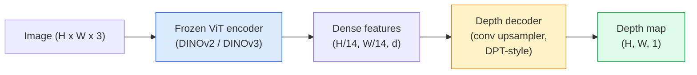

# Monocular Depth & Geometry Estimation | 单目深度与几何估计

> A depth map is a single-channel image where each pixel is a distance from the camera. Predicting it from one RGB frame used to be impossible without stereo or LiDAR. In 2026 a frozen ViT encoder plus a lightweight head gets within a few percent of ground truth.

> **【中文解读】** 深度图是单通道图像，每个像素值表示到相机的距离。从单张 RGB 图像预测深度曾经被认为是不可能的（需要双目或 LiDAR），但 2026 年的 ViT 编码器 + 轻量级解码器已经可以达到接近真值的精度。

> **【拓展：深度估计的应用】** 单目深度估计在自动驾驶（补充 LiDAR）、AR/VR（场景理解）、机器人导航、3D 照片效果（背景虚化）中有重要应用。Depth Anything、MiDaS、ZoeDepth 是代表性模型。

**Type:** Build + Use
**Languages:** Python
**Prerequisites:** Phase 4 Lesson 14 (ViT), Phase 4 Lesson 17 (Self-Supervised Vision), Phase 4 Lesson 07 (U-Net)
**Time:** ~60 minutes

## Learning Objectives

- Distinguish relative and metric depth and state which one each production model (MiDaS, Marigold, Depth Anything V3, ZoeDepth) solves
- Use Depth Anything V3 (DINOv2 backbone) to predict depth for arbitrary single images with no calibration
- Explain why monocular depth works at all from a single image (perspective cues, texture gradients, learned priors) and what it cannot recover (absolute scale, occluded geometry)
- Lift 2D detections to 3D points using a depth map and pinhole camera intrinsics

> **【中文解读】** 学习目标列出了完成本课后应该掌握的核心能力。建议在开始学习前先浏览目标，学完后对照检查是否达成。


## The Problem | 问题引入

Depth is the missing axis in 2D computer vision. Given RGB, you know where things appear in the image plane; you do not know how far they are. Depth sensors (stereo rigs, LiDAR, time-of-flight) solve this directly but are expensive, fragile, and limited in range.

> 深度是 2D 计算机视觉中缺失的轴。给定 RGB，你知道物体在图像平面上的位置；你不知道它们有多远。深度传感器（立体相机、LiDAR、飞行时间）直接解决这个问题，但昂贵、脆弱且范围有限。

Monocular depth estimation — predicting depth from a single RGB frame — used to produce blurry, unreliable output. By 2026 large pretrained encoders changed that: Depth Anything V3 uses a frozen DINOv2 backbone and produces depth maps that generalise across indoor, outdoor, medical, and satellite domains. Marigold reframes depth as a conditional diffusion problem. ZoeDepth regresses true metric distances.

> 单目深度估计——从单个 RGB 帧预测深度——过去产生模糊、不可靠的输出。到 2026 年大型预训练编码器改变了这一点：Depth Anything V3 使用冻结的 DINOv2 骨干并产生跨室内、室外、医学和卫星领域泛化的深度图。Marigold 将深度重新定义为条件扩散问题。ZoeDepth 回归真实的公制距离。

Depth is also the bridge between 2D detection and 3D understanding: multiply a detected box's pixels by depth and you lift the 2D object into a 3D point cloud. That is the core of every AR occlusion system, every obstacle-avoidance pipeline, and every "pick up the cup" robot.

> 深度也是 2D 检测和 3D 理解之间的桥梁：将检测到的框的像素乘以深度，你就能将 2D 物体提升到 3D 点云。那是每个 AR 遮挡系统、每个避障流水线和每个"拿起杯子"的机器人的核心。

## The Concept | 核心概念

> **【中文解读】** 本节介绍核心概念和理论基础。掌握这些概念是后续动手实现的前提，同时也是面试和工程实践中高频考察的知识点。


### Relative vs metric depth

- **Relative depth** — ordered `z` values without a real-world unit. "Pixel A is closer than pixel B, but the ratio of distances is not anchored to metres."
  中文翻译：**相对深度**——有序的 `z` 值，没有真实世界单位。"像素 A 比像素 B 近，但距离比率不锚定到米。"
- **Metric depth** — absolute distance in metres from the camera. Requires the model to have learnt the statistical relationship between image cues and real distance.
  中文翻译：**度量深度**——从相机出发的绝对距离（米）。需要模型学到图像线索与真实距离之间的统计关系。

MiDaS and Depth Anything V3 produce relative depth. Marigold produces relative depth. ZoeDepth, UniDepth, and Metric3D produce metric depth. Metric models are sensitive to camera intrinsics; relative models are not.

> MiDaS 和 Depth Anything V3 产生相对深度。Marigold 产生相对深度。ZoeDepth、UniDepth 和 Metric3D 产生度量深度。度量模型对相机内参敏感；相对模型则不敏感。

### The encoder-decoder pattern



Depth Anything V3 freezes the encoder and trains only the DPT-style decoder. The encoder provides rich features; the decoder interpolates them back to image resolution and regresses depth.

> Depth Anything V3 冻结编码器，只训练 DPT 风格的解码器。编码器提供丰富特征；解码器将它们插值回图像分辨率并回归深度。

### Why a single image produces depth at all

A 2D image contains many monocular cues that correlate with depth:

> 一张 2D 图像包含许多与深度相关的单目线索：

- **Perspective** — parallel lines in 3D converge in 2D.
  中文翻译：**透视**——3D 中的平行线在 2D 中汇聚。
- **Texture gradient** — surfaces far away have smaller, denser texture.
  中文翻译：**纹理梯度**——远处的表面纹理更小更密。
- **Occlusion order** — nearer objects occlude farther ones.
  中文翻译：**遮挡顺序**——近处物体遮挡远处物体。
- **Size constancy** — known objects (cars, humans) give approximate scale.
  中文翻译：**大小恒常性**——已知物体（车、人）给出近似尺度。
- **Atmospheric perspective** — distant objects appear hazier and bluer in outdoor scenes.
  中文翻译：**大气透视**——远处物体在户外场景中显得更朦胧更蓝。

A ViT trained on billions of images internalises these cues. With enough data and a strong backbone, monocular depth hits reasonable accuracy without any explicit 3D supervision.

> 在数十亿图像上训练的 ViT 将这些线索内化。有了足够的数据和强骨干，单目深度无需任何显式 3D 监督就能达到合理精度。

### What monocular depth cannot do

- **Absolute metric scale** without intrinsics or a known object in the scene. The network can predict "the cup is twice as far as the spoon" without knowing whether the cup is 1 m or 10 m away.
- **Occluded geometry** — the back of a chair is unseen and cannot be inferred reliably.
- **Truly untextured / reflective surfaces** — mirrors, glass, uniform walls. The network reports plausible but wrong depth.

### Depth Anything V3 in 2026

- Vanilla DINOv2 ViT-L/14 as encoder (frozen).
- DPT decoder.
- Trained on posed image pairs from diverse sources (no explicit depth supervision needed beyond photometric consistency).
- Predicts spatially consistent geometry from **an arbitrary number of visual inputs, with or without known camera poses**.
- SOTA across monocular depth, any-view geometry, visual rendering, camera pose estimation.

This is the drop-in model to call when you need depth in 2026.

> 这是 2026 年你需要深度时直接调用的模型。

### Marigold — diffusion for depth

Marigold (Ke et al., CVPR 2024) reframes depth estimation as conditional image-to-image diffusion. Conditioning: RGB. Target: depth map. Uses a pretrained Stable Diffusion 2 U-Net as backbone. Output depth maps are exceptionally sharp at object boundaries. Trade-off: slower inference than feed-forward models (10-50 denoising steps).

> Marigold（Ke 等，CVPR 2024）将深度估计重新框架为条件图像到图像的扩散。条件：RGB。目标：深度图。使用预训练的 Stable Diffusion 2 U-Net 作为骨干。输出深度图在物体边界处异常清晰。代价：推理比前馈模型慢（10-50 个去噪步骤）。

### Intrinsics and the pinhole camera

To lift a pixel `(u, v)` with depth `d` to a 3D point `(X, Y, Z)` in camera coordinates:

```
fx, fy, cx, cy = camera intrinsics
X = (u - cx) * d / fx
Y = (v - cy) * d / fy
Z = d
```

Intrinsics come from EXIF metadata, a calibration pattern, or a monocular intrinsics estimator (Perspective Fields, UniDepth). Without intrinsics, you can still render a point cloud by assuming a 60-70° FOV and moderate-resolution principals — usable for visualisation, not for measurement.

### Evaluation

Two standard metrics:

- **AbsRel** (absolute relative error): `mean(|d_pred - d_gt| / d_gt)`. Lower is better. 0.05-0.1 for production models.
- **delta < 1.25** (threshold accuracy): fraction of pixels where `max(d_pred/d_gt, d_gt/d_pred) < 1.25`. Higher is better. 0.9+ for SOTA.

For relative depth (Depth Anything V3, MiDaS), evaluation uses scale-and-shift invariant versions of both metrics.

> **【中文解读】** 本节通过代码从零实现核心算法。这种 "from scratch" 的方式能帮助理解框架背后的原理，遇到问题时不会被黑盒困住。

> **【拓展：工业部署中的视觉系统】** 在实际工业部署中，视觉模型需要考虑推理延迟、模型大小、边缘设备适配等问题。TensorRT、ONNX Runtime、OpenVINO 是常用的推理加速工具。自动驾驶系统（如 Tesla FSD）通常在车载芯片上实时运行多个视觉模型。

> **【拓展：数据标注与质量】** 视觉任务的效果高度依赖标注数据质量。Label Studio、CVAT 是主流标注工具。在工业场景中，主动学习（Active Learning）可以减少标注成本：模型对不确定的样本请求人工标注，确定性的样本自动标注。


## Build It | 动手实现

### Step 1: Depth metrics

```python
import torch

def abs_rel_error(pred, target, mask=None):
    if mask is not None:
        pred = pred[mask]
        target = target[mask]
    return (torch.abs(pred - target) / target.clamp(min=1e-6)).mean().item()


def delta_accuracy(pred, target, threshold=1.25, mask=None):
    if mask is not None:
        pred = pred[mask]
        target = target[mask]
    ratio = torch.maximum(pred / target.clamp(min=1e-6), target / pred.clamp(min=1e-6))
    return (ratio < threshold).float().mean().item()
```

Always mask invalid depth pixels (zero, NaN, saturated) before evaluation.

### Step 2: Scale-and-shift alignment

For relative-depth models, align prediction to ground truth before computing metrics. Least-squares fit of `a * pred + b = target`:

```python
def align_scale_shift(pred, target, mask=None):
    if mask is not None:
        p = pred[mask]
        t = target[mask]
    else:
        p = pred.flatten()
        t = target.flatten()
    A = torch.stack([p, torch.ones_like(p)], dim=1)
    coeffs, *_ = torch.linalg.lstsq(A, t.unsqueeze(-1))
    a, b = coeffs[:2, 0]
    return a * pred + b
```

Run `align_scale_shift` before `abs_rel_error` when evaluating MiDaS / Depth Anything.

### Step 3: Lift depth to a point cloud

```python
import numpy as np

def depth_to_point_cloud(depth, intrinsics):
    H, W = depth.shape
    fx, fy, cx, cy = intrinsics
    v, u = np.meshgrid(np.arange(H), np.arange(W), indexing="ij")
    z = depth
    x = (u - cx) * z / fx
    y = (v - cy) * z / fy
    return np.stack([x, y, z], axis=-1)


depth = np.random.uniform(0.5, 4.0, (240, 320))
intr = (320.0, 320.0, 160.0, 120.0)
pc = depth_to_point_cloud(depth, intr)
print(f"point cloud shape: {pc.shape}  (H, W, 3)")
```

One function, every 3D-lifted application. Export the point cloud to `.ply` and open in MeshLab or CloudCompare.

### Step 4: Smoke test with a synthetic depth scene

```python
def synthetic_depth(size=96):
    yy, xx = np.meshgrid(np.arange(size), np.arange(size), indexing="ij")
    # Floor: linear gradient from near (top) to far (bottom)
    depth = 1.0 + (yy / size) * 4.0
    # Box in the middle: closer
    mask = (np.abs(xx - size / 2) < size / 6) & (np.abs(yy - size * 0.6) < size / 6)
    depth[mask] = 2.0
    return depth.astype(np.float32)


gt = torch.from_numpy(synthetic_depth(96))
pred = gt + 0.3 * torch.randn_like(gt)  # simulated prediction
aligned = align_scale_shift(pred, gt)
print(f"before align  absRel = {abs_rel_error(pred, gt):.3f}")
print(f"after align   absRel = {abs_rel_error(aligned, gt):.3f}")
```

### Step 5: Depth Anything V3 usage (reference)

```python
import torch
from transformers import pipeline
from PIL import Image

pipe = pipeline(task="depth-estimation", model="LiheYoung/depth-anything-v2-large")

image = Image.open("street.jpg").convert("RGB")
out = pipe(image)
depth_np = np.array(out["depth"])
```

> **【中文解读】** 本节展示如何用成熟框架（如 PyTorch、HuggingFace 等）快速应用该技术。在实际项目中，优先使用经过验证的框架实现，可以减少 bug 并提高开发效率。


Three lines. `out["depth"]` is a PIL grayscale; convert to numpy for math. For Depth Anything V3 specifically, swap the model id once released; the API is unchanged.


> **【拓展：视觉模型的持续学习】** 在生产环境中，视觉模型需要不断适应新数据（新产品、新场景、新光照条件）。持续学习（Continual Learning）技术可以防止模型在适应新数据时遗忘旧知识。这在自动驾驶和工业质检中尤为重要。

## Use It | 用框架实现

- **Depth Anything V3** (Meta AI / ByteDance, 2024-2026) — the default for relative depth. Fastest ViT-large-backbone model in production.
- **Marigold** (ETH, 2024) — highest visual quality, slow inference.
- **UniDepth** (ETH, 2024) — metric depth with camera intrinsics estimation.
- **ZoeDepth** (Intel, 2023) — metric depth; older, still reliable.
- **MiDaS v3.1** — legacy but stable; good baseline for comparison.

Typical integration pattern:

1. RGB frame arrives.
2. Depth model produces depth map.
3. Detector produces boxes.
4. Lift box centroids through depth to 3D; merge with point cloud if available.
5. Downstream: AR occlusion, path planning, object-size estimation, stereo replacement.

> **【中文解读】** 本节关注如何将模型部署为可用的产品。从原型到生产级系统需要考虑性能优化、错误处理、监控等多个维度。


For real-time use, Depth Anything V2 Small (INT8 quantised) hits ~30 fps on a consumer GPU at 518x518.


## Ship It | 产出物

> **【中文解读】** 练习题按照 Easy/Medium/Hard 三个难度递进。建议至少完成 Medium 级别的题目，Hard 级别适合深入研究或面试准备。


This lesson produces:

- `outputs/prompt-depth-model-picker.md` — picks between Depth Anything V3, Marigold, UniDepth, MiDaS given latency, metric-vs-relative need, and scene type.
- `outputs/skill-depth-to-pointcloud.md` — a skill that builds point clouds from depth maps with correct intrinsics handling and export to `.ply`.

## Exercises | 练习题

1. **(Easy)** Run Depth Anything V2 on any 10 images of your desk. Save depth as grayscale PNGs and inspect. Identify one object whose predicted depth looks wrong and explain why the monocular cues failed.
2. **(Medium)** Given RGB + depth from Depth Anything V2, lift to a point cloud and render with `open3d`. Compare two scenes (indoor / outdoor) and note which looks more believable.
3. **(Hard)** Take five pairs of images that differ only by a known object's position (e.g. bottle moved 30 cm closer). Use UniDepth to predict metric depth on both. Report the predicted distance delta vs the true 30 cm.

> **【中文解读】** 术语表中的 "What people say" vs "What it actually means" 区分了日常口语和精确技术含义。在团队协作中，统一术语定义可以避免大量沟通误解。


## Key Terms | 术语速查表

| Term | What people say | What it actually means |
|------|----------------|----------------------|
| Monocular depth | "Single-image depth" | Depth estimation from one RGB frame, no stereo or LiDAR |
| Relative depth | "Ordered depth" | Ordered z-values without real-world units |
| Metric depth | "Absolute distance" | Depth in metres; requires calibration or a model trained with metric supervision |
| AbsRel | "Absolute relative error" | Mean of |d_pred - d_gt| / d_gt; standard depth metric |
| Delta accuracy | "delta < 1.25" | Fraction of pixels with prediction within 25% of ground truth |
| Pinhole camera | "fx, fy, cx, cy" | The camera model used to lift (u, v, d) to (X, Y, Z) |
| DPT | "Dense Prediction Transformer" | The conv-based decoder used on top of frozen ViT encoders for depth |
| DINOv2 backbone | "The reason it works" | Self-supervised features that generalise across domains without depth labels |

> **【中文解读】** 延伸阅读提供了深入学习的高质量资源。这些论文和教程是该领域的经典参考文献，适合需要深入理解的读者。


## Further Reading | 延伸阅读

- [Depth Anything V3 paper page](https://depth-anything.github.io/) — SOTA monocular depth with DINOv2 encoder
- [Marigold (Ke et al., CVPR 2024)](https://marigoldmonodepth.github.io/) — diffusion-based depth estimation
- [UniDepth (Piccinelli et al., 2024)](https://arxiv.org/abs/2403.18913) — metric depth with intrinsics
- [MiDaS v3.1 (Intel ISL)](https://github.com/isl-org/MiDaS) — the canonical relative-depth baseline
- [DINOv3 blog post (Meta)](https://ai.meta.com/blog/dinov3-self-supervised-vision-model/) — the encoder family that lifts depth accuracy
