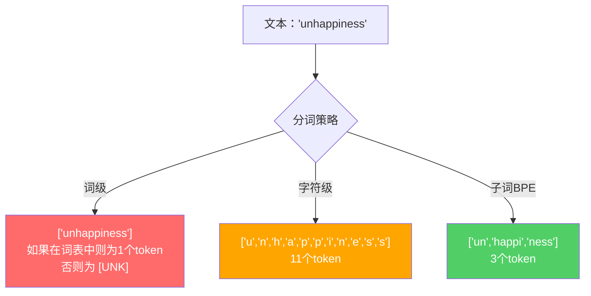
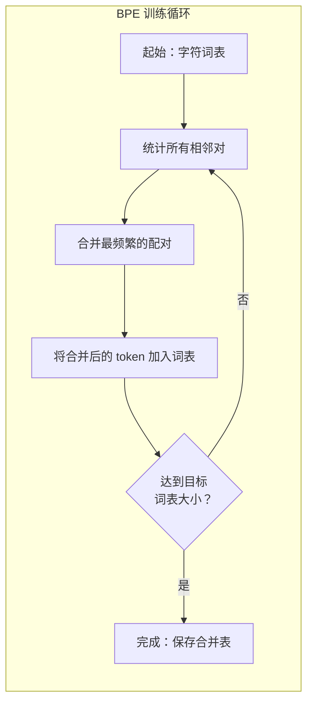
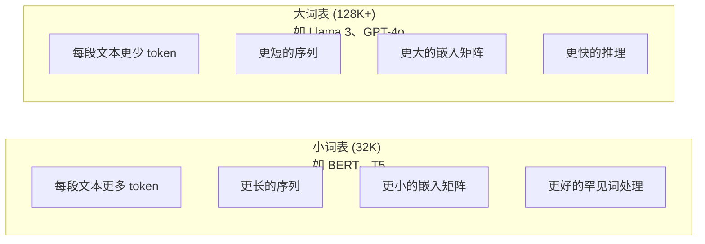

# 分词器：BPE、WordPiece、SentencePiece | Tokenizers: BPE, WordPiece, SentencePiece

> 你的 LLM 并不阅读英文。它阅读的是整数。分词器决定了这些整数是有意义的还是在浪费。

> **【中文解读】** LLM 不读英文，它读整数。分词器决定这些整数是有意义还是浪费。子词分词（subword tokenization）在词级和字符级之间找到平衡点：常见词保持完整，罕见词拆分为有意义的片段。GPT-4 用 BPE，Llama 用 SentencePiece。

> **【拓展：BPE→GPT系列】** OpenAI 的所有模型（GPT-2、GPT-3、GPT-4）都使用 BPE 分词器。tiktoken 是 GPT 系列的分词器库。分词质量直接影响上下文窗口利用率——"unfortunately" 拆成4个 token vs 1个 token，等于上下文窗口缩水 75%。

**类型：** 构建
**语言：** Python
**前置条件：** Phase 05（NLP 基础）
**时长：** 约 90 分钟

## 学习目标

- 从零实现 BPE、WordPiece 和 Unigram 分词算法，并比较它们的合并策略
- 解释词表大小如何影响模型效率：太小会产生长序列，太大会浪费嵌入参数
- 分析跨语言和代码的分词产物，找出特定分词器失效的场景
- 使用 tiktoken 和 sentencepiece 库对文本进行分词，并检查生成的 token ID

> **【中文解读】** 本章的学习目标围绕分词器的四个维度：实现（手写 BPE/WordPiece/Unigram 算法）、理解（词表大小的工程权衡）、分析（跨语言分词的边界情况）、应用（tiktoken/sentencepiece 工具库）。分词是 LLM 管线的第一步，直接影响模型效率和成本。

## 问题引入

你的 LLM 并不阅读英文。它不阅读任何语言。它阅读的是数字。

"Hello, world!" 与 [15496, 11, 995, 0] 之间的鸿沟就是分词器。每个单词、每个空格、每个标点符号都必须被转换为整数，模型才能处理它。这种转换不是中性的——它将假设烘焙到模型中，且之后无法撤销。

做错了，你的模型会浪费容量，用多个 token 来编码常见词。"unfortunately" 变成四个 token 而不是一个。你的 128K 上下文窗口对于多音节词较多的文本来说直接缩水了 75%。做对了，同样的上下文窗口能承载两倍的意义。"这个模型处理代码很好" 和 "这个模型对 Python 窒息" 之间的区别往往取决于分词器是如何训练的。

你对 GPT-4 或 Claude 发起的每次 API 调用都按 token 计费。你的模型生成的每个 token 都消耗算力。表示输出所需的 token 越少，端到端推理就越快。分词不是预处理，它是架构。

> **【中文解读】** 分词不是简单的预处理步骤，而是模型架构的一部分。每次调用 GPT-4 API 都按 token 计费，每个 token 的生成都消耗算力。"unfortunately" 被拆成 4 个 token 意味着上下文窗口利用率下降 75%。分词器的设计直接决定了模型处理不同语言和代码的能力。

> **【拓展：API 定价与分词效率】** GPT-4o 的定价为 $5/M input tokens、$15/M output tokens。同一个中文段落，用 GPT-2 分词器可能消耗 500 tokens，用 GPT-4o 的 o200k_base 分词器只需约 200 tokens，成本差 2.5 倍。这也是为什么 Llama 3 将词表从 32K 扩展到 128K——降低非英语用户的推理成本。

## 核心概念

### 三种失败的方案（以及一种成功的）

有三种显而易见的方法可以将文本转换为数字。其中两种在大规模场景下不可行。

**词级分词（Word-level tokenization）** 按空格和标点符号分割。"The cat sat" 变成 ["The", "cat", "sat"]。简单。但是 "tokenization" 呢？或者 "GPT-4o" 呢？或者像 "Geschwindigkeitsbegrenzung" 这样的德语复合词？词级分词需要一个巨大的词表来覆盖每种语言中的每个单词。遗漏一个单词就会得到可怕的 `[UNK]` token——模型表达"我不知道这是什么"的方式。仅英语就有超过一百万个词形。加上代码、URL、科学记数法和 100 种其他语言，你需要一个无限大的词表。

**字符级分词（Character-level tokenization）** 走另一个极端。"hello" 变成 ["h", "e", "l", "l", "o"]。词表极小（几百个字符）。永远不会有未知 token。但序列变得极其漫长。一个本来 10 个词级 token 的句子会变成 50 个字符级 token。模型必须学会 "t"、"h"、"e" 组合在一起表示 "the"——浪费注意力容量在一个三岁小孩就会的事情上。

**子词分词（Subword tokenization）** 找到了最佳平衡点。常见词保持完整："the" 是一个 token。罕见词分解为有意义的片段："unhappiness" 变成 ["un", "happi", "ness"]。词表保持可管理（30K 到 128K 个 token）。序列保持较短。未知 token 基本消失了，因为任何单词都可以由子词片段构建。

> **【中文解读】** 词级分词（word-level）的问题是词表爆炸——英语有百万级词形，加上代码、URL、科学记数法和其他语言，词表会无限增长。字符级分词（character-level）虽然词表小，但序列太长，模型要学会 "t"+"h"+"e" 组合为 "the"，浪费注意力容量。子词分词在两者之间取得平衡：常见词保持完整，罕见词拆分为有意义的片段。

每个现代 LLM 都使用子词分词。GPT-2、GPT-4、BERT、Llama 3、Claude——所有模型都是如此。问题只是使用哪种算法。



### BPE：字节对编码

BPE 是一种被重新用于分词的贪心压缩算法。其思想简单到可以写在一张索引卡上。

从单个字符开始。统计训练语料库中每对相邻字符的出现频率。将最频繁的一对合并为一个新 token。重复此过程，直到达到目标词表大小。

以下是 BPE 在一个包含 "lower"、"lowest" 和 "newest" 的小型语料库上运行的过程：

```
语料库（含词频）：
  "lower"  x5
  "lowest" x2
  "newest" x6

步骤 0 -- 从字符开始：
  l o w e r       (x5)
  l o w e s t     (x2)
  n e w e s t     (x6)

步骤 1 -- 统计相邻对：
  (e,s): 8    (s,t): 8    (l,o): 7    (o,w): 7
  (w,e): 13   (e,r): 5    (n,e): 6    ...

步骤 2 -- 合并最频繁的配对 (w,e) -> "we"：
  l o we r        (x5)
  l o we s t      (x2)
  n e we s t      (x6)

步骤 3 -- 重新统计并合并 (e,s) -> "es"：
  l o we r        (x5)
  l o we s t      (x2)    <- 'es' 只由 'e'+'s' 形成，不是 'we'+'s'
  n e we s t      (x6)    <- 等等，'we' 前面的 'e' 和 'we' 后面的 's'

精确跟踪如下：
  合并 "we" 后，剩余配对：
  (l,o): 7   (o,we): 7   (we,r): 5   (we,s): 8
  (s,t): 8   (n,e): 6    (e,we): 6

步骤 3 -- 合并 (we,s) -> "wes" 或 (s,t) -> "st"（同为 8，取第一个）：
  合并 (we,s) -> "wes"：
  l o we r        (x5)
  l o wes t       (x2)
  n e wes t       (x6)

步骤 4 -- 合并 (wes,t) -> "west"：
  l o we r        (x5)
  l o west        (x2)
  n e west        (x6)

...继续直到达到目标词表大小。
```

合并表就是分词器。要编码新文本，按学习到的顺序依次应用合并规则。训练语料库决定了存在哪些合并，而这个选择会永久性地塑造模型看到的内容。

> **【中文解读】** BPE 的核心训练循环：从单个字符开始，统计所有相邻字符对的出现频率，将最高频的对合并为新 token，重复直到达到目标词表大小。合并表（merge table）就是分词器本身。编码新文本时，按训练时学到的顺序依次应用合并规则——顺序很重要，因为合并 1 可能产生 "th"，合并 5 才能在 "th"+"e" 的基础上产生 "the"。

> **【拓展：BPE 的压缩原理】** BPE 最初是 1994 年的通用数据压缩算法。Sennrich 等人在 2016 年将其引入 NLP 领域。在生产环境中，tiktoken 在 Rust 中实现了 BPE，编码速度可达每秒数百万 token。GPT-4 的 cl100k_base 编码器在数百 GB 文本上训练了约 100,000 次合并。



### 字节级 BPE（GPT-2、GPT-3、GPT-4）

标准 BPE 操作 Unicode 字符。字节级 BPE 操作原始字节（0-255）。这给你一个恰好 256 个的基础词表，能处理任何语言或编码，永远不会产生未知 token。

GPT-2 引入了这种方法。基础词表覆盖了每个可能的字节。BPE 合并在此基础上构建。OpenAI 的 tiktoken 库实现了字节级 BPE，词表大小如下：

> **【中文解读】** 字节级 BPE（Byte-level BPE）是 GPT-2 引入的关键创新。传统 BPE 操作 Unicode 字符，而字节级 BPE 直接操作原始字节（0-255），基础词表恰好 256 个，理论上可处理任何语言或编码，永远不会出现 [UNK] token。这就是为什么 GPT 系列模型能处理代码、emoji、多语言混合文本而不会"卡住"。

- GPT-2：50,257 个 token
- GPT-3.5/GPT-4：约 100,256 个 token（cl100k_base 编码）
- GPT-4o：200,019 个 token（o200k_base 编码）

### WordPiece（BERT）

WordPiece 看起来类似于 BPE，但选择合并的方式不同。它不是使用原始频率，而是最大化训练数据的似然：

```
BPE 合并准则：      count(A, B)
WordPiece 合并准则： count(AB) / (count(A) * count(B))
```

BPE 问的是："哪对出现得最频繁？"WordPiece 问的是："哪对比随机预期更频繁地一起出现？"这个微妙的差异产生了不同的词表。WordPiece 倾向于合并共现令人惊讶的配对，而不仅仅是频繁的配对。

WordPiece 还使用 "##" 前缀来表示续接子词：

```
"unhappiness" -> ["un", "##happi", "##ness"]
"embedding"   -> ["em", "##bed", "##ding"]
```

"##" 前缀告诉你这个片段续接了前一个 token。BERT 使用 WordPiece，词表为 30,522 个 token。每个 BERT 变体——DistilBERT，以及 RoBERTa 的分词器实际上是 BPE——但 BERT 本身使用的是 WordPiece。

### SentencePiece（Llama、T5）

SentencePiece 将输入视为原始 Unicode 字符流，包括空格。没有预分词步骤。没有关于词边界的语言特定规则。这使其真正做到了语言无关——它可以在中文、日文、泰文和其他不使用空格分隔词语的语言上工作。

SentencePiece 支持两种算法：
- **BPE 模式**：与标准 BPE 相同的合并逻辑，应用于原始字符序列
- **Unigram 模式**：从一个大词表开始，迭代地删除对整体似然影响最小的 token。与 BPE 相反——剪枝而非合并。

Llama 2 使用 SentencePiece BPE，词表为 32,000 个 token。T5 使用 SentencePiece Unigram，词表为 32,000 个 token。注意：Llama 3 切换到了基于 tiktoken 的字节级 BPE 分词器，词表为 128,256 个 token。

> **【中文解读】** SentencePiece 的独特之处在于它把输入当作原始 Unicode 字符流（包括空格），不做任何语言的预分词。这让它在中文、日文、泰文等不使用空格分隔词语的语言上表现优秀。它支持两种算法：BPE 模式（自底向上合并）和 Unigram 模式（自顶向下剪枝）。Llama 2 用 SentencePiece BPE（32K 词表），而 Llama 3 切换到了 tiktoken 风格的字节级 BPE（128K 词表）。

> **【拓展：SentencePiece 在开源模型中的地位】** Google T5（110亿参数）、Llama 2（7B-70B）、Mistral 7B 等开源模型都使用 SentencePiece。它的优势在于语言无关性——同一个分词器可以处理 100+ 种语言而不需要任何语言特定的预处理规则。Unigram 模式还有一个独特优势：它能输出多个分词候选及其概率，用于鲁棒的模型训练。

### 词表大小的权衡

这是一个有可衡量后果的真实工程决策。



具体数字。对于 128K 词表配合 4,096 维嵌入，仅嵌入矩阵就有 128,000 x 4,096 = 5.24 亿个参数。对于 32K 词表，则是 1.31 亿个参数。仅分词器选择就带来了 4 亿参数的差异。

但更大的词表更积极地压缩文本。同样的英文段落，32K 词表可能需要 100 个 token，128K 词表可能只需 70 个 token。这意味着生成过程中减少了 30% 的前向传播。对于服务数百万请求的模型来说，这是计算成本的直接降低。

趋势很明确：词表大小在增长。GPT-2 使用 50,257。GPT-4 使用约 100K。Llama 3 使用 128K。GPT-4o 使用 200K。

| 模型 | 词表大小 | 分词器类型 | 平均每英文单词 token 数 |
|------|---------|-----------|----------------------|
| BERT | 30,522 | WordPiece | 约 1.4 |
| GPT-2 | 50,257 | 字节级 BPE | 约 1.3 |
| Llama 2 | 32,000 | SentencePiece BPE | 约 1.4 |
| GPT-4 | 约 100,256 | 字节级 BPE | 约 1.2 |
| Llama 3 | 128,256 | 字节级 BPE (tiktoken) | 约 1.1 |
| GPT-4o | 200,019 | 字节级 BPE | 约 1.0 |

### 多语言税

主要在英语上训练的分词器对其他语言非常残酷。韩文文本在 GPT-2 分词器中平均每词需要 2-3 个 token。中文可能更糟。这意味着韩语用户的有效上下文窗口只有英语用户的一半——付同样的价格，获得的信息密度却更低。

这就是为什么 Llama 3 将词表从 32K 翻了四倍到 128K。更多 token 分配给非英语文字，实现跨语言的更公平压缩。

> **【中文解读】** 多语言税（Multilingual Tax）是分词器设计中最容易被忽略的公平性问题。以 GPT-2 分词器为例，韩文平均每个词需要 2-3 个 token，中文可能更糟。这意味着韩文/中文用户的有效上下文窗口只有英文用户的一半——付同样的价格，获得的信息密度却更低。Llama 3 将词表从 32K 扩展到 128K，正是为了给非英语文字分配更多 token，实现跨语言的公平压缩。

> **【拓展：多语言分词的实际影响】** 在 GPT-3.5 的 cl100k_base 分词器中，一段 1000 字的中文大约需要 ~1500 tokens，而等量英文信息可能只需 ~500 tokens。这意味着中文用户的 API 成本是英文用户的 3 倍。Llama 3 的 128K 词表将中文的 token 效率提升了约 2 倍，但与英文相比仍有差距。这也是为什么国产模型（如 Qwen、DeepSeek）专门针对中文优化了分词器。

## 动手实现

### 步骤 1：字符级分词器

从基础开始。字符级分词器将每个字符映射到其 Unicode 码点。不需要训练。没有未知 token。直接映射。

```python
class CharTokenizer:
    def encode(self, text):
        return [ord(c) for c in text]

    def decode(self, tokens):
        return "".join(chr(t) for t in tokens)
```

"hello" 变成 [104, 101, 108, 108, 111]。每个字符都是独立的 token。这是我们改进的基线。

### 步骤 2：从零实现 BPE 分词器

真正的实现。我们在原始字节上训练（像 GPT-2），统计配对，合并最频繁的，并按顺序记录每次合并。合并表就是分词器。

```python
from collections import Counter

class BPETokenizer:
    def __init__(self):
        self.merges = {}
        self.vocab = {}

    def _get_pairs(self, tokens):
        pairs = Counter()
        for i in range(len(tokens) - 1):
            pairs[(tokens[i], tokens[i + 1])] += 1
        return pairs

    def _merge_pair(self, tokens, pair, new_token):
        merged = []
        i = 0
        while i < len(tokens):
            if i < len(tokens) - 1 and tokens[i] == pair[0] and tokens[i + 1] == pair[1]:
                merged.append(new_token)
                i += 2
            else:
                merged.append(tokens[i])
                i += 1
        return merged

    def train(self, text, num_merges):
        tokens = list(text.encode("utf-8"))
        self.vocab = {i: bytes([i]) for i in range(256)}

        for i in range(num_merges):
            pairs = self._get_pairs(tokens)
            if not pairs:
                break
            best_pair = max(pairs, key=pairs.get)
            new_token = 256 + i
            tokens = self._merge_pair(tokens, best_pair, new_token)
            self.merges[best_pair] = new_token
            self.vocab[new_token] = self.vocab[best_pair[0]] + self.vocab[best_pair[1]]

        return self

    def encode(self, text):
        tokens = list(text.encode("utf-8"))
        for pair, new_token in self.merges.items():
            tokens = self._merge_pair(tokens, pair, new_token)
        return tokens

    def decode(self, tokens):
        byte_sequence = b"".join(self.vocab[t] for t in tokens)
        return byte_sequence.decode("utf-8", errors="replace")
```

训练循环是 BPE 的核心：统计配对，合并胜者，重复。每次合并减少总 token 数。经过 `num_merges` 轮后，词表从 256（基础字节）增长到 256 + num_merges。

编码按学习到的确切顺序应用合并。这很重要。如果合并 1 创建了 "th"，合并 5 创建了 "the"，编码必须先应用合并 1，这样 "the" 才能在合并 5 中由 "th" + "e" 形成。

解码是逆过程：在词表中查找每个 token ID，拼接字节，解码为 UTF-8。

### 步骤 3：编码与解码的往返验证

```python
corpus = (
    "The cat sat on the mat. The cat ate the rat. "
    "The dog sat on the log. The dog ate the frog. "
    "Natural language processing is the study of how computers "
    "understand and generate human language. "
    "Tokenization is the first step in any NLP pipeline."
)

tokenizer = BPETokenizer()
tokenizer.train(corpus, num_merges=40)

test_sentences = [
    "The cat sat on the mat.",
    "Natural language processing",
    "tokenization pipeline",
    "unhappiness",
]

for sentence in test_sentences:
    encoded = tokenizer.encode(sentence)
    decoded = tokenizer.decode(encoded)
    raw_bytes = len(sentence.encode("utf-8"))
    ratio = len(encoded) / raw_bytes
    print(f"'{sentence}'")
    print(f"  Tokens: {len(encoded)} (from {raw_bytes} bytes) -- ratio: {ratio:.2f}")
    print(f"  Roundtrip: {'PASS' if decoded == sentence else 'FAIL'}")
```

压缩比告诉你分词器的效率。比率为 0.50 意味着分词器将文本压缩到原始字节数的一半。越低越好。在训练语料上，压缩比会很好。对于分布外文本如 "unhappiness"（它不出现在语料中），压缩比会更差——分词器对未见过的模式会退回到字符级编码。

### 步骤 4：与 tiktoken 比较

```python
import tiktoken

enc = tiktoken.get_encoding("cl100k_base")

texts = [
    "The cat sat on the mat.",
    "unhappiness",
    "Hello, world!",
    "def fibonacci(n): return n if n < 2 else fibonacci(n-1) + fibonacci(n-2)",
    "Geschwindigkeitsbegrenzung",
]

for text in texts:
    our_tokens = tokenizer.encode(text)
    tiktoken_tokens = enc.encode(text)
    tiktoken_pieces = [enc.decode([t]) for t in tiktoken_tokens]
    print(f"'{text}'")
    print(f"  Our BPE:   {len(our_tokens)} tokens")
    print(f"  tiktoken:  {len(tiktoken_tokens)} tokens -> {tiktoken_pieces}")
```

tiktoken 使用完全相同的算法，但在数百 GB 的文本上训练，进行了 100,000 次合并。算法是相同的。区别在于训练数据和合并次数。你在一段文字上用 40 次合并训练的分词器无法与 tiktoken 在海量语料上 100K 次合并的结果竞争。但机制是相同的。

### 步骤 5：词表分析

```python
def analyze_vocabulary(tokenizer, test_texts):
    total_tokens = 0
    total_chars = 0
    token_usage = Counter()

    for text in test_texts:
        encoded = tokenizer.encode(text)
        total_tokens += len(encoded)
        total_chars += len(text)
        for t in encoded:
            token_usage[t] += 1

    print(f"Vocabulary size: {len(tokenizer.vocab)}")
    print(f"Total tokens across all texts: {total_tokens}")
    print(f"Total characters: {total_chars}")
    print(f"Avg tokens per character: {total_tokens / total_chars:.2f}")

    print(f"\nMost used tokens:")
    for token_id, count in token_usage.most_common(10):
        token_bytes = tokenizer.vocab[token_id]
        display = token_bytes.decode("utf-8", errors="replace")
        print(f"  Token {token_id:4d}: '{display}' (used {count} times)")

    unused = [t for t in tokenizer.vocab if t not in token_usage]
    print(f"\nUnused tokens: {len(unused)} out of {len(tokenizer.vocab)}")
```

这揭示了词表中的 Zipf 分布。少数 token 占主导地位（空格、"the"、"e"）。大多数 token 很少被使用。生产分词器针对这个分布进行优化——常见模式获得短 token ID，罕见模式使用更长的表示。

> **【中文解读】** 词表分析揭示了 Zipf 分布规律：少数 token 占据了绝大部分使用量（如空格、"the"、"e"），大多数 token 很少被使用。生产级分词器针对这个分布进行优化——常见模式获得短 token ID，罕见模式使用更长的表示。这也是为什么词表大小是工程权衡而非越大越好。

> **【拓展：生产环境的词表优化】** GPT-4o 的 o200k_base 词表有 200,019 个 token，但最常用的 1000 个 token 覆盖了日常英文文本约 80% 的出现频率。在部署 LLM 时，embedding 矩阵的大小直接由词表决定：128K 词表 x 4096 维 = 5.24 亿参数，仅嵌入层就占用了约 2GB 显存（FP16）。

## 用框架实现

你从零实现的 BPE 可以用了。现在看看生产工具是什么样的。

### tiktoken（OpenAI）

```python
import tiktoken

enc = tiktoken.get_encoding("cl100k_base")

text = "Tokenizers convert text to integers"
tokens = enc.encode(text)
print(f"Tokens: {tokens}")
print(f"Pieces: {[enc.decode([t]) for t in tokens]}")
print(f"Roundtrip: {enc.decode(tokens)}")
```

tiktoken 用 Rust 编写，带有 Python 绑定。它每秒可编码数百万个 token。同样的 BPE 算法，工业级实现。

### Hugging Face tokenizers

```python
from tokenizers import Tokenizer
from tokenizers.models import BPE
from tokenizers.trainers import BpeTrainer
from tokenizers.pre_tokenizers import ByteLevel

tokenizer = Tokenizer(BPE())
tokenizer.pre_tokenizer = ByteLevel()

trainer = BpeTrainer(vocab_size=1000, special_tokens=["<pad>", "<eos>", "<unk>"])
tokenizer.train(["corpus.txt"], trainer)

output = tokenizer.encode("The cat sat on the mat.")
print(f"Tokens: {output.tokens}")
print(f"IDs: {output.ids}")
```

Hugging Face tokenizers 库底层也是 Rust。它可以在几秒内在 GB 级语料上训练 BPE。这就是你在训练自己的模型时使用的工具。

### 加载 Llama 的分词器

```python
from transformers import AutoTokenizer

tokenizer = AutoTokenizer.from_pretrained("meta-llama/Llama-3.1-8B")

text = "Tokenizers are the unsung heroes of LLMs"
tokens = tokenizer.encode(text)
print(f"Token IDs: {tokens}")
print(f"Tokens: {tokenizer.convert_ids_to_tokens(tokens)}")
print(f"Vocab size: {tokenizer.vocab_size}")

multilingual = ["Hello world", "Hola mundo", "Bonjour le monde"]
for text in multilingual:
    ids = tokenizer.encode(text)
    print(f"'{text}' -> {len(ids)} tokens")
```

Llama 3 的 128K 词表在压缩非英语文本方面明显优于 GPT-2 的 50K 词表。你可以自己验证——用多种语言编码同一个句子并统计 token 数。

## 产出物

本课产出 `outputs/prompt-tokenizer-analyzer.md`——一个可复用的 prompt，用于分析任意文本和模型组合的分词效率。给它一个文本样本，它会告诉你哪个模型的分词器处理效果最好。

## 练习题

1. 修改 BPE 分词器，在每次合并步骤打印词表。观察 "t" + "h" 如何变成 "th"，然后 "th" + "e" 变成 "the"。追踪常见英文单词是如何一步步组装的。

2. 为 BPE 分词器添加特殊 token（`<pad>`、`<eos>`、`<unk>`）。给它们分配 ID 0、1、2，并相应调整所有其他 token。实现一个在运行 BPE 之前按空格分割的预分词步骤。

3. 实现 WordPiece 合并准则（似然比而非频率）。在同一语料上用相同的合并次数训练 BPE 和 WordPiece。比较生成的词表——哪一个产生更多具有语言学意义的子词？

4. 构建一个多语言分词效率基准测试。取 10 个英文、西班牙文、中文、韩文和阿拉伯文句子。用 tiktoken (cl100k_base) 对每个进行分词，测量每字符的平均 token 数。量化每种语言的"多语言税"。

5. 在更大的语料上训练 BPE 分词器（下载一篇维基百科文章）。调整合并次数，使压缩比在该文本上与 tiktoken 相差不超过 10%。这迫使你理解语料大小、合并次数和压缩质量之间的关系。

## 术语速查表

| 术语 | 通俗说法 | 实际含义 |
|------|---------|---------|
| Token（词元） | "一个词" | 模型词表中的基本单元——可以是字符、子词、词或多词片段 |
| BPE（字节对编码） | "某种压缩方法" | 迭代合并最频繁的相邻 token 对，直到达到目标词表大小 |
| WordPiece | "BERT 的分词器" | 类似 BPE，但合并最大化似然比 count(AB)/(count(A)*count(B)) 而非原始频率 |
| SentencePiece | "一个分词器库" | 语言无关的分词器，操作原始 Unicode 而不预分词，支持 BPE 和 Unigram 算法 |
| Vocabulary size（词表大小） | "它认识多少词" | 唯一 token 的总数：GPT-2 有 50,257，BERT 有 30,522，Llama 3 有 128,256 |
| Fertility（生育率） | "不是分词术语" | 每词平均 token 数——衡量跨语言的分词效率（1.0 完美，3.0 意味着模型工作量是 3 倍） |
| Byte-level BPE（字节级 BPE） | "GPT 的分词器" | 在原始字节（0-255）而非 Unicode 字符上操作的 BPE，保证任何输入都不会有未知 token |
| Merge table（合并表） | "分词器文件" | 训练期间学到的有序配对合并列表——这就是分词器本身，顺序很重要 |
| Pre-tokenization（预分词） | "按空格分割" | 在子词分词前应用的规则：空格分割、数字分隔、标点处理 |
| Compression ratio（压缩比） | "分词器多高效" | 生成的 token 数除以输入字节数——越低越好，推理越快 |

## 延伸阅读

- [Sennrich 等人, 2016 -- "Neural Machine Translation of Rare Words with Subword Units"](https://arxiv.org/abs/1508.07909) -- 将 BPE 引入 NLP 的论文，把 1994 年的压缩算法变成了现代分词的基础
- [Kudo & Richardson, 2018 -- "SentencePiece: A simple and language independent subword tokenizer"](https://arxiv.org/abs/1808.06226) -- 语言无关的分词方案，使多语言模型成为可能
- [OpenAI tiktoken 仓库](https://github.com/openai/tiktoken) -- Rust 中的生产级 BPE 实现，带 Python 绑定，被 GPT-3.5/4/4o 使用
- [Hugging Face Tokenizers 文档](https://huggingface.co/docs/tokenizers) -- 带 Rust 性能的生产级分词器训练
