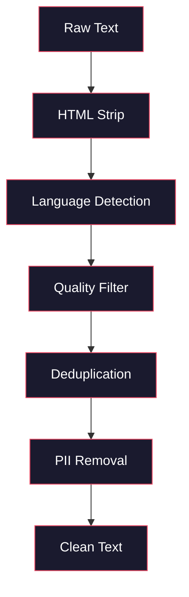
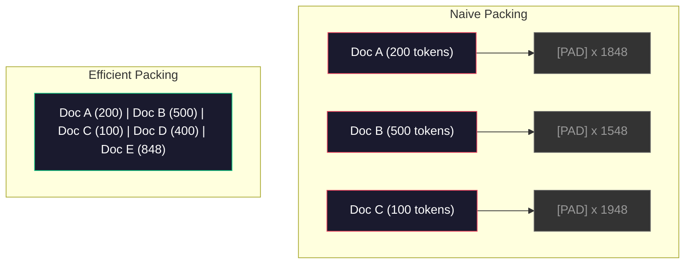

# Data Pipelines for Pre-Training | 预训练数据管线

> The model is a mirror. It reflects whatever data you feed it. Feed it garbage, it reflects garbage with perfect fluency.

> **【中文解读】** 模型是一面镜子，忠实反映你喂给它的数据。预训练数据管线包括：去重、语言检测、内容过滤、流式分词、分块、打乱和批处理——所有操作都必须在 TB 级数据上不加载到内存的情况下完成。

> **【拓展：数据质量→GPT-4/Claude】** GPT-4 和 Claude 的高质量输出源于精心设计的数据管线。Llama 3 的预训练数据包含 15T token，经过严格去重和质量过滤。数据质量是模型质量的上限。

**Type:** Build
**Languages:** Python
**Prerequisites:** Phase 10, Lessons 01-02 (Tokenizers, Building a Tokenizer)
**Time:** ~90 minutes

## Learning Objectives | 学习目标

- Build a streaming data pipeline that tokenizes, chunks, shuffles, and batches terabytes of text without loading it all into memory
  构建流式数据管线，在 TB 级文本上实现分词、分块、打乱和批处理，无需全部加载到内存
- Implement data quality filters (deduplication, language detection, content filtering) used in real pre-training pipelines
  实现真实预训练管线中使用的数据质量过滤器（去重、语言检测、内容过滤）
- Create fixed-length training sequences with proper attention masks and document boundary handling
  创建具有正确注意力掩码和文档边界处理的固定长度训练序列
- Profile pipeline throughput to ensure the dataloader keeps up with GPU training speed
  分析管线吞吐量，确保数据加载速度跟得上 GPU 训练速度

> **【中文解读】** 本课聚焦预训练数据管线——LLM 质量的真正决定因素。你将构建流式数据管线，在 TB 级数据上实现去重（MinHash+LSH）、质量过滤、分词打包和批处理，且所有操作都不能将数据全部加载到内存中。

## The Problem | 问题引入

You have a tokenizer. Now you need data.

> 你有了分词器。现在你需要数据。

Not a dataset. Not a CSV file. Terabytes of text -- cleaned, deduplicated, filtered for quality, tokenized into fixed-length sequences, and served in randomized batches fast enough that your 8-GPU cluster never waits for the next batch.

> 不是数据集。不是 CSV 文件。数 TB 的文本——经过清洗、去重、质量过滤、分词为固定长度序列，并以随机批次提供服务，速度快到你的 8-GPU 集群永远不会等待下一批数据。

Most people think training an LLM is about the model architecture. It is not. Llama 3 used 15.6 trillion tokens. GPT-3 used 300 billion. DeepSeek-V2 used 8.1 trillion. The architecture across all three is roughly the same: stacked transformer blocks with attention and feedforward layers. The difference in output quality comes overwhelmingly from the data.

> 大多数人认为训练 LLM 是关于模型架构。不是的。Llama 3 使用了 15.6 万亿 token。GPT-3 使用了 3000 亿。DeepSeek-V2 使用了 8.1 万亿。三者的架构大致相同：堆叠的 transformer 块，包含注意力和前馈层。输出质量的差异绝大多数来自数据。

The Chinchilla paper from DeepMind made this precise. For a given compute budget, there is an optimal ratio of model parameters to training tokens. Chinchilla showed that most models in 2022 were dramatically undertrained -- they had too many parameters for the amount of data they saw. A 70B parameter model trained on 1.4 trillion tokens (Chinchilla-optimal) outperformed a 280B model trained on 300 billion tokens (Gopher).

> DeepMind 的 Chinchilla 论文精确地说明了这一点。对于给定的计算预算，模型参数与训练 token 之间存在最优比例。Chinchilla 表明 2022 年大多数模型严重训练不足——它们对于所看到的数据量有太多参数。一个在 1.4 万亿 token 上训练的 70B 参数模型（Chinchilla 最优）超过了在 3000 亿 token 上训练的 280B 模型（Gopher）。

Your data pipeline determines whether your model learns language or learns noise.

> 你的数据管线决定了你的模型学习的是语言还是噪声。

> **【中文解读】** Chinchilla 论文（DeepMind 2022）证明：在固定算力预算下，模型参数量和训练 token 数应该等比例扩展。Llama 3 的 70B 模型在 15.6T tokens 上训练——远超 Chinchilla 最优比例，但 Meta 发现这种"过度训练"产出的模型推理成本更低。数据管线的质量决定了模型学习的是语言还是噪声。

> **【拓展：数据混合比的工程经验】** Llama 3 公开的数据配比为：约 50% 网页数据、25% 代码、13% 书籍和论文、8% 数学、4% 多语言网页。GPT-4 的训练数据据说包含大量代码（提升推理能力）和学术文献（提升事实准确性）。比例没有公式可循，完全依赖实验和评估。

> 🔗 **【前置】** 学本节前请先掌握：(1) Phase 10·01 和 02（分词器）——理解 token 与字节流；(2) Phase 10·01 提到的 Chinchilla scaling law——理解参数量与 token 数的最优比例；(3) Python 生成器 / `IterableDataset` / `datasets.stream`——流式处理范式；(4) MinHash + LSH 近似去重算法（不熟悉请先看 Llama 3 / RefinedWeb 论文的相关章节）。本节不会重讲这些基础。

## The Concept | 核心概念

### Where the Data Comes From

Every large language model is trained on a mix of sources. The exact composition is a closely guarded secret for most labs, but we know enough to understand the categories.

> 每个大语言模型都是在混合数据源上训练的。大多数实验室对确切组成保密，但我们了解得足以理解各个类别。

| Source | Size | Quality | Used By |
|--------|------|---------|---------|
| Common Crawl | ~250 TB raw | Low (needs heavy filtering) | GPT-3, Llama, most open models |
| Wikipedia | ~20 GB | High | Every major LLM |
| GitHub code | ~1 TB+ | Medium (lots of duplicates, dead code) | StarCoder, CodeLlama, DeepSeek-Coder |
| Books (BookCorpus, Pile) | ~100 GB | High | GPT-2, GPT-3, early models |
| Academic papers (arXiv, S2ORC) | ~100 GB | High for STEM | Llama, Galactica |
| StackOverflow, Reddit | ~100 GB | Medium | Llama, Falcon |
| Curated web (C4, RefinedWeb) | ~5 TB | Medium-High (pre-filtered) | T5, Falcon |

Llama 3 disclosed its data mix: roughly 50% web data, 25% code, 13% books and academic papers, 8% math data, and 4% multilingual web data. The total was 15.6 trillion tokens from sources exceeding 5 TB of raw text.

> Llama 3 公开了其数据配比：约 50% 网页数据、25% 代码、13% 书籍和学术论文、8% 数学数据和 4% 多语言网页数据。总计 15.6 万亿 token，来自超过 5 TB 原始文本的数据源。

The ratio matters as much as the total size. Too much web data and the model becomes a Reddit parrot. Too little code and it cannot program. Too little math and it fails at reasoning. Getting this mix right is one of the hardest parts of training an LLM, and there is no formula -- it requires experimentation and evaluation.

> 比例与总大小同等重要。网页数据太多，模型就变成 Reddit 鹦鹉。代码太少，它就不会编程。数学数据太少，它在推理上就会失败。配比是训练 LLM 最难的部分之一，没有公式——需要实验和评估。

### Data Cleaning

Raw web data is filthy. A typical Common Crawl dump contains:

> 原始网页数据非常脏。一个典型的 Common Crawl 转储包含：

- HTML tags and JavaScript
  中文翻译：HTML 标签和 JavaScript
- Boilerplate headers, footers, navigation menus
  中文翻译：样板页眉、页脚、导航菜单
- Duplicate pages (exact and near-duplicate)
  中文翻译：重复页面（精确和近似重复）
- Machine-generated spam
  中文翻译：机器生成的垃圾内容
- Personally identifiable information (PII)
  中文翻译：个人身份信息（PII）
- Low-quality text (lists of keywords, SEO spam)
  中文翻译：低质量文本（关键词列表、SEO 垃圾）
- Non-text content encoded as text
  中文翻译：编码为文本的非文本内容

Cleaning this is not optional. It is the difference between a model that generates coherent paragraphs and one that outputs HTML tags mixed with product listings.

> 清洗不是可选的。这是生成连贯段落的模型和输出混合 HTML 标签与产品列表的模型之间的区别。

> 💡 **【类比】** 数据管线像"自来水厂的多级过滤系统"：原水（Common Crawl）→ 沉淀池（HTML 剥离）→ 沙滤（语言检测）→ 活性炭（质量分类器过滤 SEO 垃圾）→ 反渗透（MinHash 近似去重）→ 紫外线（PII 脱敏）→ 出水口（打包成 token chunk）。任何一级漏掉，最后流出的"水"就有杂质——模型学到的就是杂质而非语言。Chinchilla 论文指出，决定模型质量的不是模型大小而是"水的洁净度 × 水量"。



Each step eliminates a category of noise:

> 每个步骤消除一类噪声：

**HTML stripping:** Remove all markup. Keep only the visible text content. Libraries like `trafilatura` or `readability` extract article content while discarding navigation, ads, and boilerplate.

> **HTML 剥离：** 移除所有标记。只保留可见文本内容。`trafilatura` 或 `readability` 等库提取文章内容，同时丢弃导航、广告和样板。

**Language detection:** Use fastText's language identification model (lid.176.bin) to classify each document. Filter to your target languages. A document classified as English with less than 0.8 confidence probably is not clean English.

> **语言检测：** 使用 fastText 的语言识别模型（lid.176.bin）对每篇文档分类。过滤到目标语言。一篇被分类为英文但置信度低于 0.8 的文档可能不是干净的英文。

**Quality filtering:** This is where it gets interesting. RefinedWeb (the dataset behind Falcon) uses a perplexity-based filter: train a small language model on Wikipedia, then score each document. High perplexity means the document is unlike Wikipedia -- likely spam, keyword lists, or machine-generated content. Documents with perplexity above a threshold get removed.

> **质量过滤：** 这是有趣的部分。RefinedWeb（Falcon 背后的数据集）使用基于困惑度的过滤器：在 Wikipedia 上训练一个小型语言模型，然后对每篇文档评分。高困惑度意味着文档不像 Wikipedia——可能是垃圾内容、关键词列表或机器生成的内容。困惑度超过阈值的文档被删除。

**Deduplication:** The single most impactful cleaning step. Common Crawl contains enormous numbers of duplicated pages -- legal disclaimers, cookie notices, terms of service. Training on duplicates wastes compute and can cause the model to memorize and regurgitate specific passages verbatim.

> **去重：** 影响最大的清洗步骤。Common Crawl 包含大量重复页面——法律声明、cookie 通知、服务条款。在重复数据上训练浪费算力，还可能导致模型逐字记忆和复述特定段落。

**PII removal:** Names, email addresses, phone numbers, social security numbers. Regex-based detection for structured PII, NER models for names in context.

> **PII 移除：** 姓名、电子邮件地址、电话号码、社会安全号码。结构化 PII 用正则检测，上下文中的姓名用 NER 模型。

> **【中文解读】** 数据清洗是预训练中最不性感但最重要的环节。原始网页数据充满噪声：HTML 标签、导航菜单、机器生成的 SEO 垃圾、个人隐私信息（PII）。清洗管线依次执行：HTML 剥离 → 语言检测 → 质量过滤 → 去重 → PII 移除。RefinedWeb 使用困惑度过滤——在 Wikipedia 上训练一个小语言模型，对每篇文档评分，高困惑度文档（像垃圾内容）被删除。

> **【拓展：去重的工程影响】** Llama 团队报告通过去重移除了约 38% 的网页数据。Common Crawl 中超过三分之一的页面是重复或近似重复内容。训练在重复数据上不仅浪费算力，还会导致模型逐字记忆特定段落，增加隐私泄露风险。MinHash+LSH 算法将 O(n^2) 的两两比较降到了近似线性时间。

> ⚠️ **【易错点】** 数据管线四个常见坑：(1) **整库加载进内存**——`datasets.load_dataset("common_crawl", split="train")` 默认会实例化全部 15T token，必 OOM；必须用 `streaming=True` 或 `IterableDataset`；(2) **去重时把"高密度优质内容"误删**——文档 A 包含整篇 Wikipedia（5KB），文档 B 是只引用一句话的博客（500 字），MinHash 误判为高相似度。修复：在 shingle 之前对每篇文档归一化长度，或对小文档用更保守的阈值；(3) **打包（pack）跨文档 attention 漏 mask**——把 3 篇短文拼进 2048 token 但没加 document boundary mask，第 1 篍末尾的 token 会"看到"第 2 篍开头的 token，造成跨文档污染；修复：用 FlashAttention 的 `varlen` 接口或 block-diagonal attention mask；(4) **配比（mix）在 epoch 间漂移**——shuffle 时按"文档级"而非"token 级"采样，结果小文档被过度采样、大文档欠采样。

### Deduplication with MinHash

Exact deduplication is easy: hash each document, remove duplicates. But near-duplicates are the real problem. Two copies of the same news article with slightly different ads around it are near-duplicates. The content is 95% identical, but byte-for-byte they differ.

> 精确去重很简单：对每篇文档哈希，移除重复。但近似重复才是真正的问题。同一篇新闻文章的两个副本，周围广告略有不同，就是近似重复。内容 95% 相同，但逐字节不同。

MinHash + Locality-Sensitive Hashing (LSH) solves this efficiently.

> MinHash + 局部敏感哈希（LSH）高效地解决了这个问题。


The idea:

> 核心思想：

1. **Shingling:** Convert each document into a set of n-grams (e.g., 5-grams of words or characters). "the quick brown fox" with 3-word shingles becomes {"the quick brown", "quick brown fox"}.
   中文翻译：**Shingling：** 将每篇文档转换为一组 n-gram 集合（如 5-词或 5-字符的 n-gram）。"the quick brown fox" 用 3-词 shingle 变为 {"the quick brown", "quick brown fox"}。

2. **MinHash:** For each document's shingle set, compute k hash values. Each hash value is the minimum hash across all shingles under a different hash function. This creates a fixed-size "signature" that approximates the Jaccard similarity between any two documents.
   中文翻译：**MinHash：** 对每篇文档的 shingle 集合计算 k 个哈希值。每个哈希值是所有 shingle 在不同哈希函数下的最小哈希。这创建了一个固定大小的"签名"，近似任意两篇文档的 Jaccard 相似度。

3. **LSH:** Group documents into buckets based on bands of their MinHash signature. Documents in the same bucket are candidate near-duplicates. This avoids comparing every pair -- you only compare candidates.
   中文翻译：**LSH：** 根据MinHash 签名的条带将文档分组到桶中。同一桶中的文档是候选近似重复。这避免了两两比较——只比较候选对。

4. **Verify:** For each candidate pair, compute exact Jaccard similarity. Remove one copy if similarity exceeds a threshold (typically 0.8).
   中文翻译：**验证：** 对每对候选，计算精确的 Jaccard 相似度。如果相似度超过阈值（通常为 0.8），移除一个副本。

The Llama team reported removing approximately 38% of their web data through deduplication. That is not a small number. More than a third of Common Crawl is duplicate or near-duplicate content.

> Llama 团队报告通过去重移除了约 38% 的网页数据。这不是一个小数字。Common Crawl 超过三分之一的内容是重复或近似重复的。

### Sequence Packing

Your model expects fixed-length input sequences. Your documents are variable length. Some are 50 tokens. Some are 50,000 tokens.

> 你的模型期望固定长度的输入序列。你的文档长度不一。有的 50 个 token。有的 50,000 个 token。

Naive approach: pad every document to the maximum sequence length. This wastes enormous compute on padding tokens that contribute nothing to learning.

> 朴素方法：将每篇文档填充到最大序列长度。这浪费大量算力在贡献为零的填充 token 上。

Better approach: pack multiple documents into a single sequence, separated by end-of-sequence tokens. A 2048-token sequence might contain three short documents concatenated with [EOS] tokens between them.

> 更好的方法：将多篇文档打包到单个序列中，用序列结束 token 分隔。一个 2048 token 的序列可能包含三篇短文档，中间用 [EOS] token 连接。

> 🤔 **【困惑】** Q: 既然 packing 会跨文档污染，为什么不直接用 padding？多浪费点算力换正确性不是更稳吗？ A: 因为预训练算力极其昂贵——Llama 3 训练成本估计 1 亿美元。Packing 把序列平均填充率从 ~40%（带 padding）提升到 ~95%+，等于把训练成本砍掉一半以上（约省 5000 万美元）。正确做法不是退回 padding，而是用 document boundary mask（FlashAttention 的 `cu_seqlens` 或 block-diagonal attention）让第 1 篍末尾的 query 看不到第 2 篍的 key/value。这在工程上零成本（只多一个 index），但能完全消除污染。



The attention mask must be set correctly. Tokens from Document A should not attend to tokens from Document B within the same packed sequence. This requires a block-diagonal attention mask.

> 注意力掩码必须正确设置。文档 A 的 token 不应注意到同一打包序列中文档 B 的 token。这需要块对角注意力掩码。

Long documents get truncated or split into chunks at sequence boundaries. The split point matters: splitting mid-sentence forces the model to see incomplete thoughts. Some pipelines align splits to paragraph or sentence boundaries when possible.

> 长文档在序列边界处被截断或拆分为块。拆分点很重要：在句子中间拆分迫使模型看到不完整的思想。一些管线在可能时将拆分点对齐到段落或句子边界。

> **【中文解读】** 序列打包（Sequence Packing）是将变长文档填充到固定长度训练序列的技术。朴素方法用 PAD 填充会浪费大量算力。高效方法将多个短文档用 [EOS] 分隔拼接进同一个序列，但需要块对角注意力掩码（block-diagonal attention mask）——文档 A 的 token 不应该注意到同一序列中文档 B 的 token。

> **【拓展：Chinchilla 定律与过度训练】** Chinchilla 定律认为模型参数和训练 token 数应等比增长。但 Llama 3 的 70B 模型在 15T tokens 上训练（远超最优的约 1.4T），这是"推理最优"策略：多花的训练成本是一次性的，但更小的模型服务成本永久降低。这种过度训练已成为 2024 年以来的行业标准。

### The Chinchilla Scaling Law

For a fixed compute budget C (measured in FLOPs), the optimal model size N and dataset size D follow:

> 对于固定的计算预算 C（以 FLOPs 衡量），最优模型大小 N 和数据集大小 D 遵循：

```
N_opt ~ C^0.5
D_opt ~ C^0.5
```

In practice, this means you should scale model size and dataset size roughly equally. A model with 10x more parameters needs roughly 10x more training tokens to reach the same loss.

> 在实践中，这意味着你应该大致等比例地扩展模型大小和数据集大小。参数量 10 倍的模型需要大约 10 倍的训练 token 来达到相同的损失。

| Model | Parameters | Training Tokens | Chinchilla-Optimal? |
|-------|-----------|----------------|-------------------|
| GPT-3 | 175B | 300B | No (undertrained 3-4x) |
| Chinchilla | 70B | 1.4T | Yes (by design) |
| Llama 2 | 70B | 2T | Overtrained (intentionally) |
| Llama 3 | 70B | 15T | Heavily overtrained |

Llama 3 deliberately violates the Chinchilla law. Meta found that overtraining on more data -- far beyond the compute-optimal ratio -- produces better models for inference. The extra training cost is paid once, but the smaller model is cheaper to serve forever. This is sometimes called the "inference-optimal" scaling approach, and it has become the industry standard since 2024.

> Llama 3 故意违反了 Chinchilla 定律。Meta 发现用更多数据过度训练——远超计算最优比例——能产生推理效果更好的模型。额外的训练成本只付一次，但更小的模型永久更便宜地服务。这有时被称为"推理最优"缩放方法，自 2024 年以来已成为行业标准。

## Build It | 动手实现

### Step 1: Text Cleaning

Strip HTML, normalize whitespace, remove non-text content. We will use a public domain text (Project Gutenberg) as our small corpus.

> 剥离 HTML、归一化空白、移除非文本内容。我们将使用公共领域文本（古腾堡计划）作为小型语料。

```python
import re

def clean_text(text):
    text = re.sub(r"<[^>]+>", "", text)
    text = re.sub(r"http\S+", "", text)
    text = re.sub(r"[^\x20-\x7E\n]", "", text)
    text = re.sub(r"\n{3,}", "\n\n", text)
    text = re.sub(r" {2,}", " ", text)
    return text.strip()

def quality_filter(text, min_words=50, max_ratio_caps=0.3, max_ratio_special=0.1):
    words = text.split()
    if len(words) < min_words:
        return False
    caps_ratio = sum(1 for w in words if w.isupper()) / len(words)
    if caps_ratio > max_ratio_caps:
        return False
    special_chars = sum(1 for c in text if not c.isalnum() and not c.isspace())
    if special_chars / max(len(text), 1) > max_ratio_special:
        return False
    return True
```

The quality filter catches SEO spam (ALL CAPS), machine-generated noise (high special character ratio), and stub pages (too short). These three checks alone remove a surprising amount of garbage from web crawls.

> 质量过滤器捕获 SEO 垃圾（全大写）、机器生成的噪声（高特殊字符比例）和存根页面（太短）。仅这三个检查就能从网页爬取中移除大量垃圾。

### Step 2: MinHash Deduplication

Implement MinHash from scratch. No external libraries required -- just `hashlib`.

> 从零实现 MinHash。不需要外部库——只需 `hashlib`。

```python
import hashlib
from collections import defaultdict

def get_shingles(text, k=5):
    words = text.lower().split()
    if len(words) < k:
        return set()
    return {" ".join(words[i:i+k]) for i in range(len(words) - k + 1)}

def minhash_signature(shingles, num_hashes=128):
    signature = []
    for i in range(num_hashes):
        min_hash = float("inf")
        for shingle in shingles:
            h = int(hashlib.sha256(f"{i}:{shingle}".encode()).hexdigest(), 16)
            min_hash = min(min_hash, h)
        signature.append(min_hash)
    return signature

def lsh_buckets(signature, bands=16):
    rows_per_band = len(signature) // bands
    buckets = []
    for b in range(bands):
        start = b * rows_per_band
        band_data = tuple(signature[start:start + rows_per_band])
        bucket_hash = hashlib.md5(str(band_data).encode()).hexdigest()
        buckets.append((b, bucket_hash))
    return buckets

def deduplicate(documents, threshold=0.8, num_hashes=128, bands=16):
    signatures = []
    shingle_sets = []
    for doc in documents:
        shingles = get_shingles(doc)
        shingle_sets.append(shingles)
        signatures.append(minhash_signature(shingles, num_hashes))

    bucket_map = defaultdict(list)
    for doc_idx, sig in enumerate(signatures):
        for band_id, bucket_hash in lsh_buckets(sig, bands):
            bucket_map[(band_id, bucket_hash)].append(doc_idx)

    duplicate_pairs = set()
    for bucket_docs in bucket_map.values():
        if len(bucket_docs) < 2:
            continue
        for i in range(len(bucket_docs)):
            for j in range(i + 1, len(bucket_docs)):
                duplicate_pairs.add((bucket_docs[i], bucket_docs[j]))

    removed = set()
    for i, j in duplicate_pairs:
        if i in removed or j in removed:
            continue
        s1, s2 = shingle_sets[i], shingle_sets[j]
        if not s1 or not s2:
            continue
        jaccard = len(s1 & s2) / len(s1 | s2)
        if jaccard >= threshold:
            removed.add(j)

    return [doc for idx, doc in enumerate(documents) if idx not in removed], len(removed)
```

The `num_hashes=128` and `bands=16` parameters control the precision-recall tradeoff. More hashes give more accurate similarity estimates. More bands increase recall (catch more duplicates) at the cost of more false positives. These values work well for typical web text.

> `num_hashes=128` 和 `bands=16` 参数控制精确度-召回率的权衡。更多哈希值给出更准确的相似度估计。更多条带增加召回率（捕获更多重复），代价是更多误报。这些值对典型网页文本效果良好。

### Step 3: Tokenize and Pack Sequences

Take the clean, deduplicated text, tokenize it, and pack into fixed-length sequences for training.

> 取清洗、去重后的文本，分词，打包为固定长度序列用于训练。

```python
def tokenize_corpus(documents, tokenizer):
    all_tokens = []
    for doc in documents:
        tokens = tokenizer.encode(doc)
        all_tokens.extend(tokens)
        all_tokens.append(tokenizer.eos_id)
    return all_tokens

def pack_sequences(token_ids, seq_length, pad_id=0):
    sequences = []
    attention_masks = []
    for i in range(0, len(token_ids), seq_length):
        seq = token_ids[i:i + seq_length]
        mask = [1] * len(seq)
        if len(seq) < seq_length:
            pad_count = seq_length - len(seq)
            seq = seq + [pad_id] * pad_count
            mask = mask + [0] * pad_count
        sequences.append(seq)
        attention_masks.append(mask)
    return sequences, attention_masks
```

### Step 4: DataLoader for Training

Yield randomized batches of packed sequences. This is what the training loop consumes.

> 生成随机化的打包序列批次。这是训练循环消费的数据。

```python
import random

class PreTrainingDataLoader:
    def __init__(self, sequences, attention_masks, batch_size, shuffle=True):
        self.sequences = sequences
        self.attention_masks = attention_masks
        self.batch_size = batch_size
        self.shuffle = shuffle

    def __len__(self):
        return (len(self.sequences) + self.batch_size - 1) // self.batch_size

    def __iter__(self):
        indices = list(range(len(self.sequences)))
        if self.shuffle:
            random.shuffle(indices)
        for start in range(0, len(indices), self.batch_size):
            batch_idx = indices[start:start + self.batch_size]
            batch_seqs = [self.sequences[i] for i in batch_idx]
            batch_masks = [self.attention_masks[i] for i in batch_idx]
            yield batch_seqs, batch_masks
```

### Step 5: Dataset Statistics

Compute the numbers that matter: total tokens, unique tokens, compression ratio, document length distribution.

> 计算关键指标：总 token 数、唯一 token 数、压缩比、文档长度分布。

```python
from collections import Counter

def compute_statistics(documents, token_ids, sequences, tokenizer_vocab_size):
    total_chars = sum(len(d) for d in documents)
    total_tokens = len(token_ids)
    unique_tokens = len(set(token_ids))
    compression_ratio = total_chars / total_tokens

    doc_lengths = [len(d.split()) for d in documents]
    avg_doc_length = sum(doc_lengths) / max(len(doc_lengths), 1)
    max_doc_length = max(doc_lengths) if doc_lengths else 0
    min_doc_length = min(doc_lengths) if doc_lengths else 0

    token_counts = Counter(token_ids)
    top_tokens = token_counts.most_common(10)

    non_pad_tokens = sum(sum(1 for t in seq if t != 0) for seq in sequences)
    total_positions = sum(len(seq) for seq in sequences)
    utilization = non_pad_tokens / max(total_positions, 1)

    stats = {
        "total_documents": len(documents),
        "total_characters": total_chars,
        "total_tokens": total_tokens,
        "unique_tokens": unique_tokens,
        "vocab_utilization": unique_tokens / tokenizer_vocab_size,
        "compression_ratio": compression_ratio,
        "avg_doc_length_words": avg_doc_length,
        "max_doc_length_words": max_doc_length,
        "min_doc_length_words": min_doc_length,
        "num_sequences": len(sequences),
        "sequence_utilization": utilization,
        "top_10_tokens": top_tokens,
    }
    return stats
```

Compression ratio tells you how efficient the tokenizer is on this corpus. English text typically compresses to about 3-4 characters per token. If you see 1.5 characters per token, your tokenizer is splitting too aggressively. If you see 8+, it has learned very domain-specific merges.

> 压缩比告诉你分词器在此语料上的效率。英文文本通常压缩到每个 token 约 3-4 个字符。如果你看到每个 token 1.5 个字符，说明分词器拆分过于激进。如果看到 8+，说明它学到了非常特定领域的合并。

Sequence utilization tells you how much of your packed sequences is real data versus padding. Below 90% means your packing is inefficient -- you are wasting compute on padding tokens.

> 序列利用率告诉你打包序列中有多少是真实数据 versus 填充。低于 90% 意味着打包效率低——你在填充 token 上浪费算力。

## Use It | 用框架实现

### Compare With HuggingFace Datasets

Load the same corpus through HuggingFace's datasets library and compare the pipeline speed.

> 通过 HuggingFace 的 datasets 库加载相同语料并比较管线速度。

```python
from datasets import load_dataset
from transformers import AutoTokenizer

ds = load_dataset("wikitext", "wikitext-2-raw-v1", split="train")
tokenizer = AutoTokenizer.from_pretrained("meta-llama/Meta-Llama-3-8B")

import time

start = time.time()
tokenized = ds.map(
    lambda x: tokenizer(x["text"], truncation=True, max_length=2048),
    batched=True,
    num_proc=4,
)
hf_time = time.time() - start
total_tokens = sum(len(t) for t in tokenized["input_ids"])
print(f"HuggingFace: {total_tokens:,} tokens in {hf_time:.2f}s ({total_tokens/hf_time:,.0f} tokens/sec)")
```

The HuggingFace pipeline uses Rust tokenizers under the hood and parallel processing across 4 cores. Your pure Python pipeline will be 10-50x slower. That gap is why production teams use compiled tokenizers. The algorithm is the same. The implementation language is the difference.

> HuggingFace 管线底层使用 Rust 分词器和 4 核并行处理。你的纯 Python 管线会慢 10-50 倍。这就是为什么生产团队使用编译分词器。算法相同。实现语言是区别。

## Ship It | 产出物

This lesson produces a prompt for validating and debugging data quality in LLM training pipelines. See `outputs/prompt-data-quality-checker.md`.

> 本课产出用于验证和调试 LLM 训练管线数据质量的 prompt。参见 `outputs/prompt-data-quality-checker.md`。

## Exercises | 练习题

1. **Easy:** Add language detection to the cleaning pipeline using a simple heuristic (character set analysis). Filter to only English documents and measure how many documents get removed.
2. **Medium:** Implement exact deduplication using SHA-256 hashes alongside the MinHash near-deduplication. Compare the number of duplicates caught by each method on a web-scraped corpus.
3. **Hard:** Build a perplexity-based quality filter. Train a small bigram language model on Wikipedia text, score each document by perplexity, and remove the bottom 20%. Compare model output quality when training on filtered vs unfiltered data.

## Key Terms | 术语速查表

| Term | What people say | What it actually means | 中文释义 |
|------|----------------|----------------------|---------|
| Common Crawl | "The internet" | A non-profit that crawls the web monthly -- ~250TB raw, the starting point for most LLM training data | 通用爬虫，LLM 训练数据的起点 |
| MinHash | "Some hashing trick" | A technique to estimate Jaccard similarity between sets using fixed-size signatures -- enables near-duplicate detection at scale | 最小哈希，近似重复检测的核心技术 |
| LSH | "Locality-Sensitive Hashing" | A method to group similar items into the same bucket -- reduces pairwise comparisons from O(n^2) to near-linear | 局部敏感哈希，将 O(n^2) 降为近似线性 |
| Sequence packing | "Concatenating documents" | Fitting multiple documents into fixed-length sequences with proper attention masks -- eliminates padding waste | 序列打包，消除填充浪费 |
| Chinchilla scaling | "Train on more data" | For a fixed compute budget, optimal performance requires scaling model size and training tokens roughly equally | Chinchilla 缩放定律，参数和数据应等比增长 |
| Fertility | "Tokens per word" | Average number of tokens per word -- 1.3 for English in GPT-4, higher for non-Latin scripts | 生育率，每词 token 数 |
| Data mixing | "Choosing training data" | The ratio of code vs text vs math vs multilingual data -- no formula, requires experimentation | 数据混合比，需实验确定 |
| Perplexity filter | "Quality scoring" | Use a small language model to score documents -- high perplexity means the text is unlike clean reference data | 困惑度过滤，低质量文档评分高 |
| Deduplication | "Removing copies" | Eliminating exact and near-duplicate documents -- typically removes 30-40% of raw web data | 去重，通常移除 30-40% 网页数据 |
| Attention mask | "Which tokens to look at" | A binary mask that prevents attention across document boundaries in packed sequences | 注意力掩码，阻止跨文档注意力 |

## Further Reading | 延伸阅读

- [Hoffmann et al., 2022 -- Training Compute-Optimal Large Language Models (Chinchilla)](https://arxiv.org/abs/2203.15556) -- the paper that changed how we think about data scale
- [Penedo et al., 2023 -- The RefinedWeb Dataset for Falcon LLM](https://arxiv.org/abs/2306.01116) -- how to filter Common Crawl to high quality
- [Touvron et al., 2023 -- Llama 2: Open Foundation and Fine-Tuned Chat Models](https://arxiv.org/abs/2307.09288) -- data pipeline details for Llama 2
- [Lee et al., 2022 -- Deduplicating Training Data Makes Language Models Better](https://arxiv.org/abs/2107.06499) -- why deduplication matters more than you think
- [Broder, 1997 -- On the Resemblance and Containment of Documents](https://ieeexplore.ieee.org/document/666900) -- the original MinHash paper
- [Meta, 2024 -- Llama 3 Technical Report](https://arxiv.org/abs/2407.21783) -- 15.6T tokens, data mixing ratios, filtering pipeline
