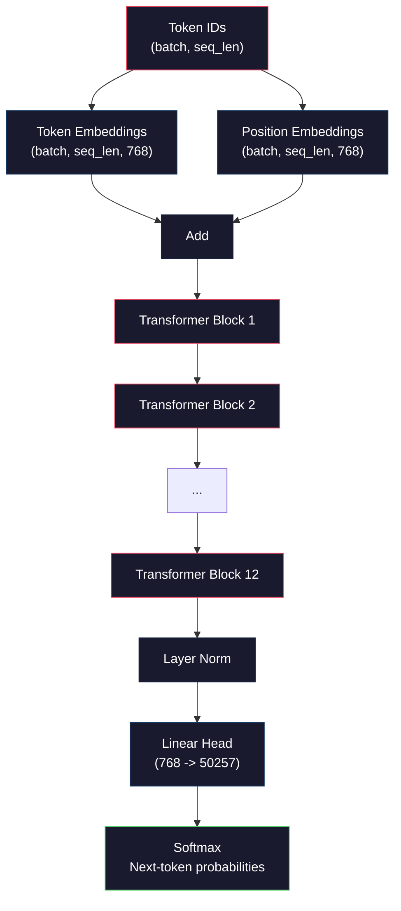
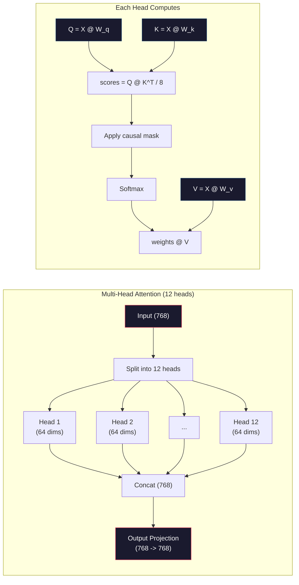
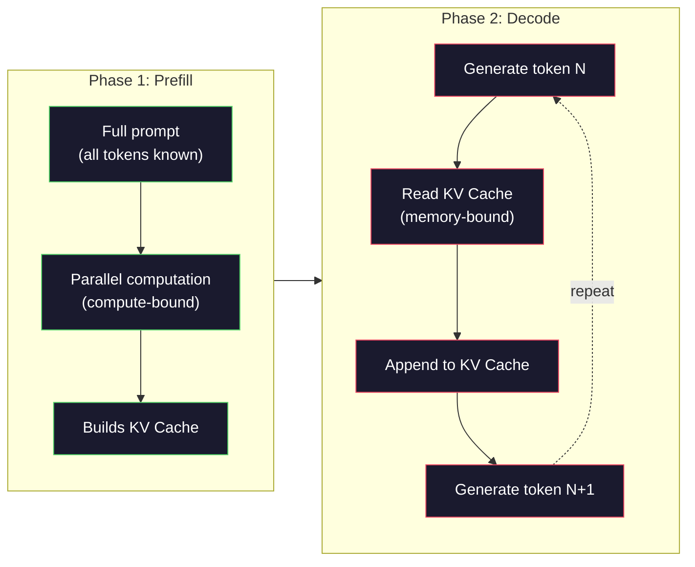

# Pre-Training a Mini GPT (124M Parameters) | 预训练迷你 GPT（1.24 亿参数）

> GPT-2 Small has 124 million parameters. That's 12 transformer layers, 12 attention heads, and 768-dimensional embeddings. You can train it from scratch on a single GPU in a few hours. Most people never do this. They use pre-trained checkpoints. But if you don't train one yourself, you don't actually understand what's happening inside the model you're building products on.

> **【中文解读】** GPT-2 Small 有 1.24 亿参数：12 层 Transformer、12 个注意力头、768 维嵌入。单 GPU 几小时即可从头训练。理解预训练是理解大模型的第一步。

> **【拓展：大模型三阶段】** 大模型训练三阶段：(1) 预训练（海量无标注数据，学习语言表示）→ (2) SFT（指令微调，学会跟随指令）→ (3) RLHF/DPO（对齐人类偏好）。本课是第一阶段，GPT-2 是所有 GPT 系列的原型。

> 🔗 **【前置】** 学本节前请先掌握：(1) Phase 10·01-03（分词器、数据管线）——理解 token ID 序列如何输入模型；(2) Transformer 架构（Phase 05）——self-attention、LayerNorm、FFN；(3) numpy 矩阵运算、反向传播手算（Phase 03 微积分与链式法则）；(4) 交叉熵损失函数的梯度推导。本课**用 numpy 实现**，不再依赖 PyTorch autograd，要能自己写 `backward()`。

**Type:** Build
**Languages:** Python (with numpy)
**Prerequisites:** Phase 10, Lessons 01-03 (Tokenizers, Building a Tokenizer, Data Pipelines)
**Time:** ~120 minutes

## Learning Objectives | 学习目标

- Implement the full GPT-2 architecture (124M parameters) from scratch: token embeddings, positional embeddings, transformer blocks, and the language model head
  从零实现完整的 GPT-2 架构（124M 参数）：token 嵌入、位置嵌入、Transformer 块和语言模型头
- Train a GPT model on a text corpus using next-token prediction with cross-entropy loss
  使用下一 token 预测和交叉熵损失在文本语料上训练 GPT 模型
- Implement autoregressive text generation with temperature sampling and top-k/top-p filtering
  实现带温度采样和 top-k/top-p 过滤的自回归文本生成
- Monitor training loss curves and validate that the model learns coherent language patterns
  监控训练损失曲线，验证模型学到了连贯的语言模式

> **【中文解读】** 本课用纯 numpy 从零实现 GPT-2 Small（124M 参数）。你将看到 1.24 亿个参数如何通过前向传播、损失计算、反向传播、权重更新的训练循环来预测下一个 token。这不是 PyTorch 黑箱——每一个矩阵乘法都是可见的。

## The Problem | 问题引入

You know what a transformer is. You have read the diagrams. You can recite "attention is all you need" and draw boxes labeled "Multi-Head Attention" on a whiteboard.

> 你知道什么是 transformer。你看过图表。你能背诵"attention is all you need"并在白板上画出标有"Multi-Head Attention"的框。

None of that means you understand what happens when a model generates text.

> 这些都不意味着你理解模型生成文本时发生了什么。

There are 124,438,272 parameters in GPT-2 Small (with weight tying). Every single one of them was set by running a training loop: forward pass, compute loss, backward pass, update weights. Twelve transformer blocks. Twelve attention heads per block. A 768-dimensional embedding space. A vocabulary of 50,257 tokens. Every time the model generates a token, all 124 million parameters participate in a single matrix multiplication chain that takes a sequence of token IDs and produces a probability distribution over the next token.

> GPT-2 Small 有 124,438,272 个参数（含权重共享）。每一个参数都通过训练循环设定：前向传播、计算损失、反向传播、更新权重。12 个 Transformer 块，每块 12 个注意力头，768 维嵌入空间，50,257 词表。每次生成 token，所有 1.24 亿参数参与一条矩阵乘法链，将 token ID 序列转换为下一个 token 的概率分布。

If you have never built this yourself, you are working with a black box. You can use the API. You can fine-tune. But when something goes wrong -- when the model hallucinates, when it repeats itself, when it refuses to follow instructions -- you have no mental model for *why*.

> 如果你从未亲手构建过这个模型，你就在使用一个黑箱。你可以调用 API，可以微调。但当模型产生幻觉、重复自己或拒绝遵循指令时，你不知道为什么。

This lesson builds GPT-2 Small from scratch. Not in PyTorch. In numpy. Every matrix multiplication is visible. Every gradient is computed by your code. You will see exactly how 124 million numbers conspire to predict the next word.

> 本课从零构建 GPT-2 Small。不用 PyTorch。用 numpy。每个矩阵乘法都可见。每个梯度都由你的代码计算。你将看到 1.24 亿个数字如何协作预测下一个词。

> 本课从零构建 GPT-2 Small。不用 PyTorch。用 numpy。每个矩阵乘法都可见。每个梯度都由你的代码计算。你将看到 1.24 亿个数字如何协作预测下一个词。

## The Concept | 核心概念

### The GPT Architecture

Here is the full computation graph from token IDs to next-token probabilities:

> 以下是从 token ID 到下一 token 概率的完整计算图：

1. Token IDs come in. Shape: (batch_size, seq_len).
2. Token embedding lookup. Each ID maps to a 768-dimensional vector. Shape: (batch_size, seq_len, 768).
3. Position embedding lookup. Each position (0, 1, 2, ...) maps to a 768-dimensional vector. Same shape.
4. Add token embeddings + position embeddings.
5. Pass through 12 transformer blocks.
6. Final layer normalization.
7. Linear projection to vocabulary size. Shape: (batch_size, seq_len, vocab_size).
8. Softmax to get probabilities.

That is the entire model. No convolutions. No recurrence. Just embeddings, attention, feedforward networks, and layer norms stacked 12 times.

> 这就是整个模型。没有卷积。没有循环。只有嵌入、注意力、前馈网络和层归一化堆叠 12 次。

> 💡 **【类比】** GPT 像一台"流水线打字机"：纸带送进 token ID → 印章 1（token embedding）盖出 768 维向量 → 印章 2（position embedding）叠加位置 → 12 道工人（Transformer block）逐层修改这个向量 → 末端喷墨头（LM head）在 50257 个候选词上喷概率分布 → 选最高概率的词输出 → 把新词再送回纸带开头，循环。一切奥秘都在那 12 道工人怎么"修改"向量——而 self-attention 就是工人们用 12 只眼睛（attention heads）同时看序列里其他 token 的能力。



### The Transformer Block

Each of the 12 blocks follows the same pattern. Pre-norm architecture (GPT-2 uses pre-norm, not post-norm like the original transformer):

> 12 个块中的每一个遵循相同模式。Pre-norm 架构（GPT-2 使用 pre-norm，而非原始 transformer 的 post-norm）：

1. LayerNorm
2. Multi-Head Self-Attention
3. Residual connection (add input back)
4. LayerNorm
5. Feed-Forward Network (MLP)
6. Residual connection (add input back)

The residual connections are critical. Without them, gradients vanish by the time they reach block 1 during backpropagation. With them, gradients can flow directly from the loss to any layer through the "skip" path. This is why you can stack 12, 32, or even 96 blocks (GPT-4 is rumored to use 120).

> 残差连接是关键。没有它们，梯度在反向传播到达第 1 块时会消失。有了它们，梯度可以通过"跳跃"路径直接从损失流到任何层。这就是为什么你可以堆叠 12、32 甚至 96 个块（GPT-4 据传使用 120 个）。

> **【中文解读】** GPT 架构的核心是 Transformer 解码器块的堆叠。每个块包含：LayerNorm → 多头自注意力 → 残差连接 → LayerNorm → 前馈网络（MLP）→ 残差连接。GPT-2 使用 pre-norm（先归一化再注意力），而非原始 Transformer 的 post-norm。残差连接是关键——没有它，梯度在 12 层反向传播后会消失，无法训练深层网络。

> **【拓展：GPT 系列的架构演进】** GPT-2 Small（124M，12 层 768 维）→ GPT-2 Medium（355M，24 层 1024 维）→ GPT-2 Large（774M，36 层 1280 维）→ GPT-2 XL（1.5B，48 层 1600 维）→ GPT-3（175B，96 层 12288 维）。架构基本相同，只是层数和维度不断扩展。GPT-4 的具体参数量未公开，但推测使用了约 120 层和 MoE（混合专家）架构。

### Attention: The Core Mechanism

Self-attention lets every token look at every previous token and decide how much to attend to each one. Here is the math.

> 自注意力让每个 token 看到每个之前的 token，并决定对每个 token 给予多少关注。以下是数学公式。

For each token position, compute three vectors from the input:
- **Query (Q)**: "What am I looking for?"
  中文翻译：**查询（Q）**："我在找什么？"
- **Key (K)**: "What do I contain?"
  中文翻译：**键（K）**："我包含什么？"
- **Value (V)**: "What information do I carry?"
  中文翻译：**值（V）**："我携带什么信息？"

```
Q = input @ W_q    (768 -> 768)
K = input @ W_k    (768 -> 768)
V = input @ W_v    (768 -> 768)

attention_scores = Q @ K^T / sqrt(d_k)
attention_scores = mask(attention_scores)   # causal mask: -inf for future positions
attention_weights = softmax(attention_scores)
output = attention_weights @ V
```

The causal mask is what makes GPT autoregressive. Position 5 can attend to positions 0-5 but not 6, 7, 8, and so on. This prevents the model from "cheating" by looking at future tokens during training.

> 因果掩码使 GPT 成为自回归模型。位置 5 可以注意到位置 0-5 但不能注意到 6、7、8 等。这防止模型在训练时通过看未来 token 来"作弊"。

**Multi-head attention** splits the 768-dimensional space into 12 heads of 64 dimensions each. Each head learns a different attention pattern. One head might track syntactic relationships (subject-verb agreement). Another might track semantic similarity (synonyms). Another might track positional proximity (nearby words). The outputs from all 12 heads are concatenated and projected back to 768 dimensions.

> **多头注意力**将 768 维空间拆分为 12 个 64 维的头。每个头学习不同的注意力模式。一个头可能追踪句法关系（主谓一致）。另一个可能追踪语义相似性（同义词）。另一个可能追踪位置邻近性（相邻词）。所有 12 个头的输出被拼接并投影回 768 维。



The division by sqrt(d_k) -- sqrt(64) = 8 -- is scaling. Without it, the dot products grow large for high-dimensional vectors, pushing softmax into regions where gradients are nearly zero. This was one of the key insights in the original "Attention Is All You Need" paper.

> 除以 sqrt(d_k)——sqrt(64) = 8——是缩放。没有它，点积在高维向量上会变得很大，将 softmax 推入梯度接近零的区域。这是原始"Attention Is All You Need"论文的关键洞察之一。

### KV Cache: Why Inference Is Fast

During training, you process the entire sequence at once. During inference, you generate one token at a time. Without optimization, generating token N requires recomputing attention for all N-1 previous tokens. That is O(N^2) per generated token, or O(N^3) total for a sequence of length N.

> 训练时，你一次处理整个序列。推理时，你逐个生成 token。没有优化的话，生成 token N 需要为所有 N-1 个之前的 token 重新计算注意力。这是每个生成 token 的 O(N^2)，或长度 N 的序列总共 O(N^3)。

KV Cache solves this. After computing K and V for each token, store them. When generating token N+1, you only need to compute Q for the new token and look up the cached K and V from all previous tokens. This reduces per-token cost from O(N) to O(1) for the K and V computation. The attention score calculation is still O(N) because you attend to all previous positions, but you avoid redundant matrix multiplications on the input.

> KV 缓存解决了这个问题。计算每个 token 的 K 和 V 后存储它们。生成 token N+1 时，你只需计算新 token 的 Q 并查找所有之前 token 缓存的 K 和 V。这将 K 和 V 计算的每 token 成本从 O(N) 降到 O(1)。注意力分数计算仍然是 O(N)，因为你注意到所有之前位置，但避免了输入上的冗余矩阵乘法。

For GPT-2 with 12 layers and 12 heads, the KV cache stores 2 (K + V) x 12 layers x 12 heads x 64 dims = 18,432 values per token. For a 1024-token sequence, that is about 75MB in FP32. For Llama 3 405B with 128 layers, the KV cache for a single sequence can exceed 10GB. This is why long-context inference is memory-bound.

> 对于 12 层 12 头的 GPT-2，KV 缓存每 token 存储 2（K + V）x 12 层 x 12 头 x 64 维 = 18,432 个值。对于 1024 token 的序列，在 FP32 中约为 75MB。对于 128 层的 Llama 3 405B，单个序列的 KV 缓存可超过 10GB。这就是为什么长上下文推理是内存受限的。

### Prefill vs Decode: Two Phases of Inference

When you send a prompt to an LLM, inference happens in two distinct phases.

> 当你向 LLM 发送 prompt 时，推理发生在两个不同阶段。

**Prefill** processes your entire prompt in parallel. All tokens are known, so the model can compute attention for all positions simultaneously. This phase is compute-bound -- the GPU is doing matrix multiplications at full throughput. For a 1000-token prompt on an A100, prefill takes roughly 20-50ms.

> **预填充（Prefill）** 并行处理整个 prompt。所有 token 已知，所以模型可以同时计算所有位置的注意力。这个阶段是计算密集型的——GPU 以全吞吐量做矩阵乘法。在 A100 上处理 1000 token 的 prompt，预填充大约需要 20-50ms。

**Decode** generates tokens one at a time. Each new token depends on all previous tokens. This phase is memory-bound -- the bottleneck is reading the model weights and KV cache from GPU memory, not the matrix math itself. The GPU's compute cores sit mostly idle waiting for memory reads. For GPT-2, each decode step takes about the same time regardless of how many FLOPs the matmuls require, because memory bandwidth is the constraint.

> **解码（Decode）** 逐个生成 token。每个新 token 依赖所有之前的 token。这个阶段是访存密集型的——瓶颈是从 GPU 内存读取模型权重和 KV 缓存，而非矩阵运算本身。GPU 的计算核心大部分时间在等待内存读取。对于 GPT-2，每个解码步骤的时间大致相同，无论矩阵乘法需要多少 FLOP，因为内存带宽是限制。

This distinction matters for production systems. Prefill throughput scales with GPU compute (more FLOPS = faster prefill). Decode throughput scales with memory bandwidth (faster memory = faster decode). That is why NVIDIA's H100 focused on memory bandwidth improvements over the A100 -- it directly speeds up token generation.

> 这个区别对生产系统很重要。预填充吞吐量与 GPU 计算能力成比例（更多 FLOPS = 更快预填充）。解码吞吐量与内存带宽成比例（更快内存 = 更快解码）。这就是为什么 NVIDIA 的 H100 在 A100 基础上专注于内存带宽改进——它直接加速了 token 生成。



### The Training Loop

Training an LLM is next-token prediction. Given tokens [0, 1, 2, ..., N-1], predict tokens [1, 2, 3, ..., N]. The loss function is cross-entropy between the model's predicted probability distribution and the actual next token.

> 训练 LLM 就是下一 token 预测。给定 token [0, 1, 2, ..., N-1]，预测 token [1, 2, 3, ..., N]。损失函数是模型预测的概率分布与实际下一 token 之间的交叉熵。

One training step:

> 一个训练步骤：

1. **Forward pass**: Run the batch through all 12 blocks. Get logits (pre-softmax scores) for each position.
2. **Compute loss**: Cross-entropy between logits and target tokens (the input shifted by one position).
3. **Backward pass**: Compute gradients for all 124M parameters using backpropagation.
4. **Optimizer step**: Update weights. GPT-2 uses Adam with learning rate warmup and cosine decay.

The learning rate schedule matters more than you might expect. GPT-2 warms up from 0 to the peak learning rate over the first 2,000 steps, then decays following a cosine curve. Starting with a high learning rate causes the model to diverge. Keeping a constant high rate causes oscillation in later training. The warmup-then-decay pattern is used by every major LLM.

> 学习率调度比你想象的更重要。GPT-2 在前 2,000 步从 0 预热到峰值学习率，然后按余弦曲线衰减。以高学习率开始会导致模型发散。保持恒定的高学习率会导致后期训练振荡。预热然后衰减的模式被所有主要 LLM 使用。

### GPT-2 Small: The Numbers

| Component | Shape | Parameters |
|-----------|-------|------------|
| Token embeddings | (50257, 768) | 38,597,376 |
| Position embeddings | (1024, 768) | 786,432 |
| Per-block attention (W_q, W_k, W_v, W_out) | 4 x (768, 768) | 2,359,296 |
| Per-block FFN (up + down) | (768, 3072) + (3072, 768) | 4,718,592 |
| Per-block LayerNorms (2x) | 2 x 768 x 2 | 3,072 |
| Final LayerNorm | 768 x 2 | 1,536 |
| **Total per block** | | **7,080,960** |
| **Total (12 blocks)** | | **85,054,464 + 39,383,808 = 124,438,272** |

The output projection (logits head) shares weights with the token embedding matrix. This is called weight tying -- it reduces the parameter count by 38M and improves performance because it forces the model to use the same representation space for input and output.

> **【中文解读】** GPT-2 的参数分布：token 嵌入层占 38.6M（50257 x 768），12 个 Transformer 块各占约 7.1M，最终 LayerNorm 仅 1.5K。权重共享（weight tying）让输出投影层复用 token 嵌入矩阵，减少 38M 参数的同时还提升了性能——因为输入和输出被强制使用同一表示空间。

## Build It | 动手实现

### Step 1: Embedding Layer

Token embeddings map each of the 50,257 possible tokens to a 768-dimensional vector. Position embeddings add information about where each token sits in the sequence. The two are summed.

> Token 嵌入将 50,257 个可能的 token 各映射到一个 768 维向量。位置嵌入添加每个 token 在序列中位置的信息。两者相加。

```python
import numpy as np

class Embedding:
    def __init__(self, vocab_size, embed_dim, max_seq_len):
        self.token_embed = np.random.randn(vocab_size, embed_dim) * 0.02
        self.pos_embed = np.random.randn(max_seq_len, embed_dim) * 0.02

    def forward(self, token_ids):
        seq_len = token_ids.shape[-1]
        tok_emb = self.token_embed[token_ids]
        pos_emb = self.pos_embed[:seq_len]
        return tok_emb + pos_emb
```

The 0.02 standard deviation for initialization comes from the GPT-2 paper. Too large and the initial forward passes produce extreme values that destabilize training. Too small and the initial outputs are nearly identical for all inputs, making early gradient signals useless.

> 0.02 标准差的初始化来自 GPT-2 论文。太大则初始前向传播产生极端值，破坏训练稳定性。太小则所有输入的初始输出几乎相同，使早期梯度信号无用。

### Step 2: Self-Attention with Causal Mask

Single-head attention first. The causal mask sets future positions to negative infinity before softmax, ensuring each position can only attend to itself and earlier positions.

> 先做单头注意力。因果掩码在 softmax 前将未来位置设为负无穷，确保每个位置只能注意到自身和更早的位置。

```python
def attention(Q, K, V, mask=None):
    d_k = Q.shape[-1]
    scores = Q @ K.transpose(0, -1, -2 if Q.ndim == 4 else 1) / np.sqrt(d_k)
    if mask is not None:
        scores = scores + mask
    weights = np.exp(scores - scores.max(axis=-1, keepdims=True))
    weights = weights / weights.sum(axis=-1, keepdims=True)
    return weights @ V
```

The softmax implementation subtracts the maximum before exponentiating. Without this, exp(large_number) overflows to infinity. This is a numerical stability trick that does not change the output because softmax(x - c) = softmax(x) for any constant c.

> softmax 实现在取指数前减去最大值。没有这个，exp(large_number) 会溢出到无穷大。这是一个数值稳定性技巧，不改变输出，因为对任意常数 c，softmax(x - c) = softmax(x)。

### Step 3: Multi-Head Attention

Split the 768-dimensional input into 12 heads of 64 dimensions each. Each head computes attention independently. Concatenate the results and project back to 768 dimensions.

> 将 768 维输入拆分为 12 个 64 维的头。每个头独立计算注意力。拼接结果并投影回 768 维。

```python
class MultiHeadAttention:
    def __init__(self, embed_dim, num_heads):
        self.num_heads = num_heads
        self.head_dim = embed_dim // num_heads
        self.W_q = np.random.randn(embed_dim, embed_dim) * 0.02
        self.W_k = np.random.randn(embed_dim, embed_dim) * 0.02
        self.W_v = np.random.randn(embed_dim, embed_dim) * 0.02
        self.W_out = np.random.randn(embed_dim, embed_dim) * 0.02

    def forward(self, x, mask=None):
        batch, seq_len, d = x.shape
        Q = (x @ self.W_q).reshape(batch, seq_len, self.num_heads, self.head_dim).transpose(0, 2, 1, 3)
        K = (x @ self.W_k).reshape(batch, seq_len, self.num_heads, self.head_dim).transpose(0, 2, 1, 3)
        V = (x @ self.W_v).reshape(batch, seq_len, self.num_heads, self.head_dim).transpose(0, 2, 1, 3)

        scores = Q @ K.transpose(0, 1, 3, 2) / np.sqrt(self.head_dim)
        if mask is not None:
            scores = scores + mask
        weights = np.exp(scores - scores.max(axis=-1, keepdims=True))
        weights = weights / weights.sum(axis=-1, keepdims=True)
        attn_out = weights @ V

        attn_out = attn_out.transpose(0, 2, 1, 3).reshape(batch, seq_len, d)
        return attn_out @ self.W_out
```

The reshape-transpose-reshape dance is the most confusing part of multi-head attention. Here is what happens: the (batch, seq_len, 768) tensor becomes (batch, seq_len, 12, 64), then (batch, 12, seq_len, 64). Now each of the 12 heads has its own (seq_len, 64) matrix to run attention on. After attention, we reverse the process: (batch, 12, seq_len, 64) becomes (batch, seq_len, 12, 64) becomes (batch, seq_len, 768).

> reshape-transpose-reshape 的操作是多头注意力中最令人困惑的部分。过程如下：(batch, seq_len, 768) 张量变为 (batch, seq_len, 12, 64)，然后 (batch, 12, seq_len, 64)。现在 12 个头各有自己的 (seq_len, 64) 矩阵来运行注意力。注意力之后，我们反转过程：(batch, 12, seq_len, 64) 变为 (batch, seq_len, 12, 64) 变为 (batch, seq_len, 768)。

### Step 4: Transformer Block

One complete transformer block: LayerNorm, multi-head attention with residual, LayerNorm, feedforward with residual.

> 一个完整的 transformer 块：LayerNorm、带残差的多头注意力、LayerNorm、带残差的前馈网络。

```python
class LayerNorm:
    def __init__(self, dim, eps=1e-5):
        self.gamma = np.ones(dim)
        self.beta = np.zeros(dim)
        self.eps = eps

    def forward(self, x):
        mean = x.mean(axis=-1, keepdims=True)
        var = x.var(axis=-1, keepdims=True)
        return self.gamma * (x - mean) / np.sqrt(var + self.eps) + self.beta


class FeedForward:
    def __init__(self, embed_dim, ff_dim):
        self.W1 = np.random.randn(embed_dim, ff_dim) * 0.02
        self.b1 = np.zeros(ff_dim)
        self.W2 = np.random.randn(ff_dim, embed_dim) * 0.02
        self.b2 = np.zeros(embed_dim)

    def forward(self, x):
        h = x @ self.W1 + self.b1
        h = np.maximum(0, h)  # GELU approximation: ReLU for simplicity
        return h @ self.W2 + self.b2


class TransformerBlock:
    def __init__(self, embed_dim, num_heads, ff_dim):
        self.ln1 = LayerNorm(embed_dim)
        self.attn = MultiHeadAttention(embed_dim, num_heads)
        self.ln2 = LayerNorm(embed_dim)
        self.ffn = FeedForward(embed_dim, ff_dim)

    def forward(self, x, mask=None):
        x = x + self.attn.forward(self.ln1.forward(x), mask)
        x = x + self.ffn.forward(self.ln2.forward(x))
        return x
```

The feedforward network expands the 768-dimensional input to 3,072 dimensions (4x), applies a nonlinearity, then projects back to 768. This expansion-contraction pattern gives the model a "wider" internal representation to work with at each position. GPT-2 uses GELU activation, but we use ReLU here for simplicity -- the difference is minor for understanding the architecture.

> 前馈网络将 768 维输入扩展到 3,072 维（4 倍），应用非线性，然后投影回 768。这种扩展-收缩模式给模型一个"更宽"的内部表示在每个位置上工作。GPT-2 使用 GELU 激活函数，但这里为了简单使用 ReLU——对于理解架构来说差异很小。

### Step 5: Full GPT Model

Stack 12 transformer blocks. Add the embedding layer at the front and the output projection at the back.

> 堆叠 12 个 transformer 块。前面加嵌入层，后面加输出投影。

```python
class MiniGPT:
    def __init__(self, vocab_size=50257, embed_dim=768, num_heads=12,
                 num_layers=12, max_seq_len=1024, ff_dim=3072):
        self.embedding = Embedding(vocab_size, embed_dim, max_seq_len)
        self.blocks = [
            TransformerBlock(embed_dim, num_heads, ff_dim)
            for _ in range(num_layers)
        ]
        self.ln_f = LayerNorm(embed_dim)
        self.vocab_size = vocab_size
        self.embed_dim = embed_dim

    def forward(self, token_ids):
        seq_len = token_ids.shape[-1]
        mask = np.triu(np.full((seq_len, seq_len), -1e9), k=1)

        x = self.embedding.forward(token_ids)
        for block in self.blocks:
            x = block.forward(x, mask)
        x = self.ln_f.forward(x)

        logits = x @ self.embedding.token_embed.T
        return logits

    def count_parameters(self):
        total = 0
        total += self.embedding.token_embed.size
        total += self.embedding.pos_embed.size
        for block in self.blocks:
            total += block.attn.W_q.size + block.attn.W_k.size
            total += block.attn.W_v.size + block.attn.W_out.size
            total += block.ffn.W1.size + block.ffn.b1.size
            total += block.ffn.W2.size + block.ffn.b2.size
            total += block.ln1.gamma.size + block.ln1.beta.size
            total += block.ln2.gamma.size + block.ln2.beta.size
        total += self.ln_f.gamma.size + self.ln_f.beta.size
        return total
```

Notice the weight tying: `logits = x @ self.embedding.token_embed.T`. The output projection reuses the token embedding matrix (transposed). This is not just a parameter-saving trick. It means the model uses the same vector space for understanding tokens (embeddings) and predicting them (output).

> 注意权重共享：`logits = x @ self.embedding.token_embed.T`。输出投影复用 token 嵌入矩阵（转置）。这不仅是节省参数的技巧。它意味着模型使用相同的向量空间来理解 token（嵌入）和预测 token（输出）。

### Step 6: Training Loop

For a real training run on 124M parameters, you would need a GPU and PyTorch. This training loop demonstrates the mechanics on a small model that runs in pure numpy. We use a tiny model (4 layers, 4 heads, 128 dims) to make it tractable.

> 对于 124M 参数的真正训练运行，你需要 GPU 和 PyTorch。这个训练循环在纯 numpy 运行的小模型上演示机制。我们使用一个微型模型（4 层、4 头、128 维）使其可行。

```python
def cross_entropy_loss(logits, targets):
    batch, seq_len, vocab_size = logits.shape
    logits_flat = logits.reshape(-1, vocab_size)
    targets_flat = targets.reshape(-1)

    max_logits = logits_flat.max(axis=-1, keepdims=True)
    log_softmax = logits_flat - max_logits - np.log(
        np.exp(logits_flat - max_logits).sum(axis=-1, keepdims=True)
    )

    loss = -log_softmax[np.arange(len(targets_flat)), targets_flat].mean()
    return loss


def train_mini_gpt(text, vocab_size=256, embed_dim=128, num_heads=4,
                   num_layers=4, seq_len=64, num_steps=200, lr=3e-4):
    tokens = np.array(list(text.encode("utf-8")[:2048]))
    model = MiniGPT(
        vocab_size=vocab_size, embed_dim=embed_dim, num_heads=num_heads,
        num_layers=num_layers, max_seq_len=seq_len, ff_dim=embed_dim * 4
    )

    print(f"Model parameters: {model.count_parameters():,}")
    print(f"Training tokens: {len(tokens):,}")
    print(f"Config: {num_layers} layers, {num_heads} heads, {embed_dim} dims")
    print()

    for step in range(num_steps):
        start_idx = np.random.randint(0, max(1, len(tokens) - seq_len - 1))
        batch_tokens = tokens[start_idx:start_idx + seq_len + 1]

        input_ids = batch_tokens[:-1].reshape(1, -1)
        target_ids = batch_tokens[1:].reshape(1, -1)

        logits = model.forward(input_ids)
        loss = cross_entropy_loss(logits, target_ids)

        if step % 20 == 0:
            print(f"Step {step:4d} | Loss: {loss:.4f}")

    return model
```

The loss starts near ln(vocab_size) -- for a 256-token byte-level vocabulary, that is ln(256) = 5.55. A random model assigns equal probability to every token. As training progresses, the loss drops because the model learns to predict common patterns: "th" after "t", space after a period, and so on.

> 损失初始接近 ln(vocab_size)——对于 256 个 token 的字节级词表，即 ln(256) = 5.55。随机模型给每个 token 分配等概率。随着训练进行，损失下降，因为模型学会预测常见模式："t" 后面是 "th"，句号后面是空格等。

In production, you would use Adam optimizer with gradient accumulation, learning rate warmup, and gradient clipping. The forward-pass-loss-backward-update loop is identical. The optimizer is more sophisticated.

> 在生产中，你会使用 Adam 优化器配合梯度累积、学习率预热和梯度裁剪。前向传播-损失-反向传播-更新的循环是相同的。优化器更复杂。

### Step 7: Text Generation

Generation uses the trained model to predict one token at a time. Each prediction is sampled from the output distribution (or taken greedily as the argmax).

> 生成使用训练好的模型逐个预测 token。每个预测从输出分布中采样（或贪心地取 argmax）。

```python
def generate(model, prompt_tokens, max_new_tokens=100, temperature=0.8):
    tokens = list(prompt_tokens)
    seq_len = model.embedding.pos_embed.shape[0]

    for _ in range(max_new_tokens):
        context = np.array(tokens[-seq_len:]).reshape(1, -1)
        logits = model.forward(context)
        next_logits = logits[0, -1, :]

        next_logits = next_logits / temperature
        probs = np.exp(next_logits - next_logits.max())
        probs = probs / probs.sum()

        next_token = np.random.choice(len(probs), p=probs)
        tokens.append(next_token)

    return tokens
```

Temperature controls randomness. Temperature 1.0 uses the raw distribution. Temperature 0.5 sharpens it (more deterministic -- the model picks its top choices more often). Temperature 1.5 flattens it (more random -- low-probability tokens get a bigger chance). Temperature 0.0 is greedy decoding (always pick the highest probability token).

> 温度控制随机性。温度 1.0 使用原始分布。温度 0.5 使其更尖锐（更确定性——模型更频繁地选择顶部候选）。温度 1.5 使其更平坦（更随机——低概率 token 获得更大机会）。温度 0.0 是贪心解码（始终选择最高概率 token）。

The `tokens[-seq_len:]` window is necessary because the model has a maximum context length (1024 for GPT-2). Once you exceed it, you must drop the oldest tokens. This is the "context window" that everyone talks about.

> `tokens[-seq_len:]` 窗口是必要的，因为模型有最大上下文长度（GPT-2 为 1024）。一旦超出，你必须丢弃最旧的 token。这就是大家说的"上下文窗口"。

## Use It | 用框架实现

### Full Training and Generation Demo

```python
corpus = """The transformer architecture has revolutionized natural language processing.
Attention mechanisms allow the model to focus on relevant parts of the input.
Self-attention computes relationships between all pairs of positions in a sequence.
Multi-head attention splits the representation into multiple subspaces.
Each attention head can learn different types of relationships.
The feedforward network provides nonlinear transformations at each position.
Residual connections enable gradient flow through deep networks.
Layer normalization stabilizes training by normalizing activations.
Position embeddings give the model information about token ordering.
The causal mask ensures autoregressive generation during training.
Pre-training on large text corpora teaches the model general language understanding.
Fine-tuning adapts the pre-trained model to specific downstream tasks."""

model = train_mini_gpt(corpus, num_steps=200)

prompt = list("The transformer".encode("utf-8"))
output_tokens = generate(model, prompt, max_new_tokens=100, temperature=0.8)
generated_text = bytes(output_tokens).decode("utf-8", errors="replace")
print(f"\nGenerated: {generated_text}")
```

On a small corpus with a small model, the generated text will be semi-coherent at best. It will learn some byte-level patterns from the training text but cannot generalize the way GPT-2 does with 40GB of training data and the full 124M parameter architecture. The point is not the output quality. The point is that you can trace every step: embedding lookup, attention computation, feedforward transformation, logit projection, softmax, and sampling. Every operation is visible.

> 在小语料和小模型上，生成的文本充其量是半连贯的。它会从训练文本中学到一些字节级模式，但无法像 GPT-2 在 40GB 训练数据和完整 124M 参数架构上那样泛化。关键不在于输出质量。关键在于你可以追踪每一步：嵌入查找、注意力计算、前馈变换、logit 投影、softmax 和采样。每个操作都是可见的。

## Ship It | 产出物

This lesson produces `outputs/prompt-gpt-architecture-analyzer.md` -- a prompt that analyzes the architecture choices in any GPT-style model. Feed it a model card or technical report and it breaks down the parameter allocation, attention design, and scaling decisions.

> 本课产出 `outputs/prompt-gpt-architecture-analyzer.md`——一个分析任意 GPT 风格模型架构选择的 prompt。输入模型卡或技术报告，它会分解参数分配、注意力设计和缩放决策。

## Exercises | 练习题

1. Modify the model to use 24 layers and 16 heads instead of 12/12. Count the parameters. How does doubling the depth compare to doubling the width (embedding dimension)?

2. Implement the GELU activation function (GELU(x) = x * 0.5 * (1 + erf(x / sqrt(2)))) and replace the ReLU in the feedforward network. Run training for 500 steps with each activation and compare the final loss.

3. Add a KV cache to the generation function. Store K and V tensors for each layer after the first forward pass, and reuse them for subsequent tokens. Measure the speedup: generate 200 tokens with and without the cache and compare wall-clock time.

4. Implement top-k sampling (only consider the k highest-probability tokens) and top-p sampling (nucleus sampling: consider the smallest set of tokens whose cumulative probability exceeds p). Compare the output quality at temperature 0.8 with top-k=50 vs top-p=0.95.

5. Build a training loss curve plotter. Train the model for 1000 steps and plot loss vs step. Identify the three phases: rapid initial descent (learning common bytes), slower middle phase (learning byte patterns), and plateau (overfitting on the small corpus). The shape of this curve is the same whether you are training a 128-dim model or GPT-4.

## Key Terms | 术语速查表

| Term | What people say | What it actually means | 中文释义 |
|------|----------------|----------------------|---------|
| Autoregressive | "It generates one word at a time" | Each output token is conditioned on all previous tokens -- the model predicts P(token_n \| token_0, ..., token_{n-1}) | 自回归，逐 token 生成，每个 token 依赖之前所有 token |
| Causal mask | "It can't see the future" | An upper-triangular matrix of -infinity values that prevents attention to future positions during training | 因果掩码，防止看到未来位置 |
| Multi-head attention | "Multiple attention patterns" | Splitting Q, K, V into parallel heads (e.g., 12 heads of 64 dims each for GPT-2) so each head can learn different relationship types | 多头注意力，并行学习不同关系类型 |
| KV Cache | "Caching for speed" | Storing computed Key and Value tensors from previous tokens to avoid redundant computation during autoregressive generation | KV 缓存，避免重复计算已生成 token 的 K/V |
| Prefill | "Processing the prompt" | The first inference phase where all prompt tokens are processed in parallel -- compute-bound on GPU FLOPS | 预填充阶段，并行处理 prompt，计算密集 |
| Decode | "Generating tokens" | The second inference phase where tokens are generated one at a time -- memory-bound on GPU bandwidth | 解码阶段，逐 token 生成，访存密集 |
| Weight tying | "Sharing embeddings" | Using the same matrix for input token embeddings and the output projection head -- saves 38M params in GPT-2 | 权重共享，输入输出共用嵌入矩阵 |
| Residual connection | "Skip connection" | Adding the input directly to the output of a sublayer (x + sublayer(x)) -- enables gradient flow in deep networks | 残差连接，使深层网络梯度流通 |
| Layer normalization | "Normalizing activations" | Normalizing across the feature dimension to mean 0 and variance 1, with learnable scale and bias parameters | 层归一化，特征维度归一化 |
| Cross-entropy loss | "How wrong the predictions are" | -log(probability assigned to the correct next token), averaged over all positions -- the standard LLM training objective | 交叉熵损失，LLM 训练的标准目标函数 |

## Further Reading | 延伸阅读

- [Radford et al., 2019 -- "Language Models are Unsupervised Multitask Learners" (GPT-2)](https://cdn.openai.com/better-language-models/language_models_are_unsupervised_multitask_learners.pdf) -- the GPT-2 paper that introduced the 124M to 1.5B parameter family
- [Vaswani et al., 2017 -- "Attention Is All You Need"](https://arxiv.org/abs/1706.03762) -- the original transformer paper with scaled dot-product attention and multi-head attention
- [Llama 3 Technical Report](https://arxiv.org/abs/2407.21783) -- how Meta scaled the GPT architecture to 405B parameters with 16K GPUs
- [Pope et al., 2022 -- "Efficiently Scaling Transformer Inference"](https://arxiv.org/abs/2211.05102) -- the paper that formalized prefill vs decode and KV cache analysis
