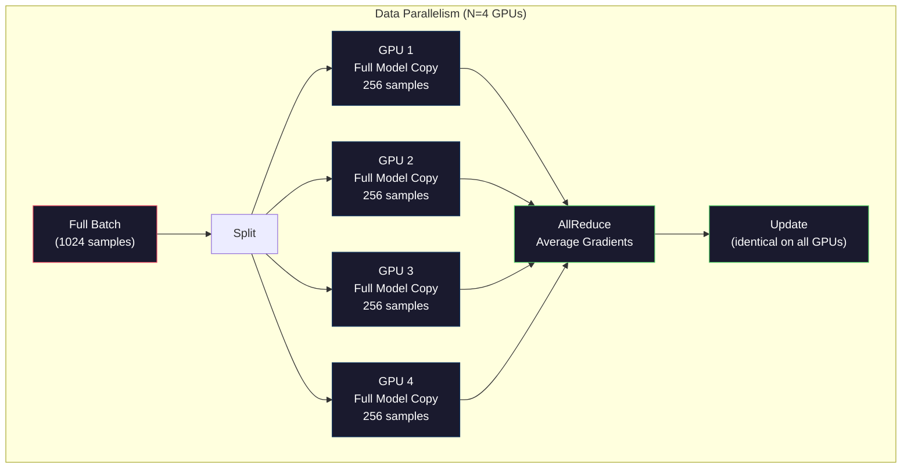
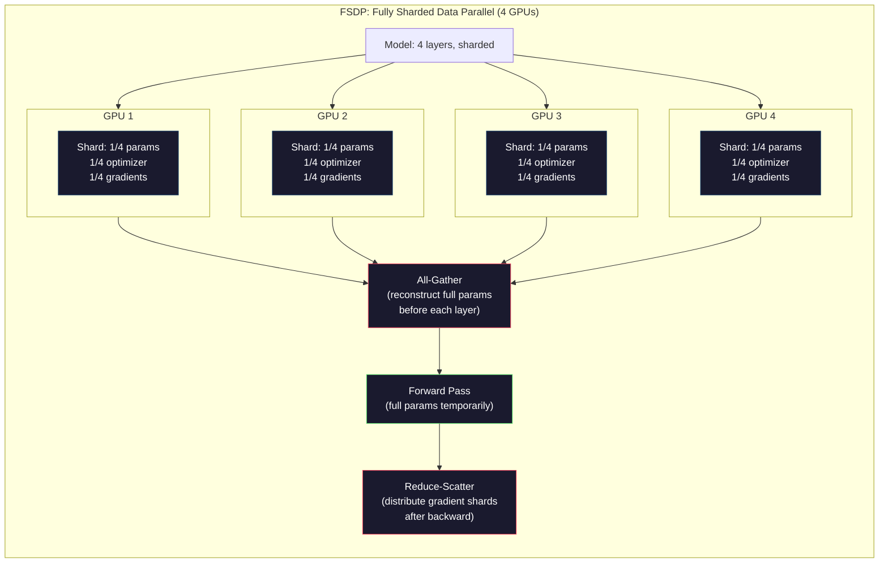
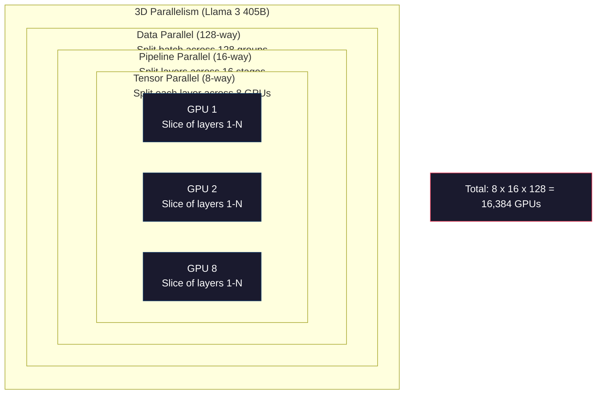

# Scaling: Distributed Training, FSDP, DeepSpeed | 扩展：分布式训练、FSDP、DeepSpeed

> Your 124M model trained on one GPU. Now try 7 billion parameters. The model doesn't fit in memory. The data takes weeks on a single machine. Distributed training isn't optional at scale. It's the only path forward.

> **【中文解读】** 1.24 亿模型在单 GPU 上训练。但 70 亿参数的模型放不进显存，单机训练数据需要数周。分布式训练是规模化的唯一路径：数据并行、张量并行、流水线并行。

> **【拓展：DeepSeek-V3的2048卡训练】** DeepSeek-V3 使用 2048 张 H800 GPU 训练，采用 DualPipe 流水线并行 + MoE 专家并行。理解分布式训练是理解前沿大模型如何被训练出来的基础。

> 🔗 **【前置】** 学本节前请先掌握：Phase 10·04（Pre-Training Mini GPT）——单 GPU 训练基础；PyTorch DDP 概念；多 GPU 通信（NCCL、AllReduce）。本节是 Phase 10·19（DualPipe）和 Phase 10·20（DeepSeek-V3 Walkthrough）的前置。

**Type:** Build
**Languages:** Python
**Prerequisites:** Phase 10, Lesson 04 (Pre-Training a Mini GPT)
**Time:** ~120 minutes

> 💡 **【类比】** 分布式训练 = 多人合作搬大箱子。**数据并行**（DP）= 4 个人各搬一个相同的小箱子（同模型不同数据，结果 AllReduce 平均）。**张量并行**（TP）= 4 个人一起抬一个大箱子的四角（同一层分到 4 卡）。**流水线并行**（PP）= 4 个人流水线，第 1 人搬一层传给第 2 人（模型按层切分）。**FSDP** = DP + 把模型切片分到各卡，用时再聚合（省显存）。生产场景一般 3 种组合用（3D parallelism）。

> ⚠️ **【易错点】** 分布式训练的 3 个坑：(1) **batch size 设错**——单卡 bs=8，4 卡应该 bs=32（4×8）而非 bs=8；用 effective batch size 计算 lr。(2) **AllReduce 瓶颈**——卡间通信比 GPU 计算慢 10 倍，bs 太小会让 GPU 等通信；bs 至少 32+ 才划算。(3) **没设 seed**——每卡随机初始化不同，结果不可复现；`torch.manual_seed(42) + torch.cuda.manual_seed_all(42)`。

## Learning Objectives | 学习目标

- Explain the three types of parallelism (data, tensor, pipeline) and when each is necessary based on model and cluster size
  解释三种并行类型（数据并行、张量并行、流水线并行）及其适用场景
- Implement data-parallel training using PyTorch DDP with gradient synchronization across multiple GPUs
  使用 PyTorch DDP 实现多 GPU 数据并行训练和梯度同步
- Calculate the memory budget for a given model size (weights + optimizer states + gradients + activations) to determine the minimum hardware
  计算给定模型大小的显存预算（权重 + 优化器状态 + 梯度 + 激活值），确定最低硬件需求
- Configure FSDP or DeepSpeed ZeRO stages to shard model states across GPUs and fit models that exceed single-GPU memory
  配置 FSDP 或 DeepSpeed ZeRO 阶段来分片模型状态，使超出单卡显存的模型得以训练

> **【中文解读】** 本课聚焦 LLM 训练的核心瓶颈：显存。7B 模型在 FP16 下仅权重就需 14GB，加上 Adam 优化器状态（28GB）和梯度（14GB），总计 56GB——还没算激活值。你将学习三种并行策略（数据并行、张量并行、流水线并行）以及 FSDP/ZeRO 分片技术来突破单卡显存限制。

## The Problem | 问题引入

A 7B parameter model in FP16 needs 14GB just for the weights. Adam optimizer stores two additional copies of every parameter (first and second moment estimates). That is another 28GB. Gradients during backpropagation add 14GB more. You are at 56GB before a single activation is stored.

> 7B 参数模型在 FP16 下仅权重就需要 14GB。Adam 优化器为每个参数额外存储两份副本（一阶和二阶矩估计），又需要 28GB。反向传播的梯度再加 14GB。在存储任何激活值之前，你已经到了 56GB。

An NVIDIA A100 has 80GB of memory.

> NVIDIA A100 有 80GB 显存。

56GB out of 80GB consumed. That leaves 24GB for activations -- the intermediate values computed during the forward pass that must be kept alive for backpropagation. For a 2048-token sequence with a 4096-dimensional model, a single layer's activations use about 64MB. With 32 layers, you need 2GB per sample. A batch size of 8 requires 16GB. You have 24GB. A batch size of 12 blows up.

> 80GB 中已消耗 56GB。剩下 24GB 用于激活值——前向传播中计算的中间值，必须为反向传播保留。对于 2048 token 序列和 4096 维模型，单层激活值约 64MB。32 层需要每样本 2GB。批量大小 8 需要 16GB。你有 24GB。批量大小 12 就会爆显存。

Now try 70B parameters. Weights alone: 140GB in FP16. Does not fit on one GPU. You need at least 2 A100s (2 x 80GB = 160GB) just to hold the weights. Add optimizer states and gradients and you need far more: 3+ GPUs minimum, and realistically 8-16 depending on sharding strategy.

> 现在试试 70B 参数。仅权重：FP16 下 140GB。放不进一张 GPU。至少需要 2 张 A100（2 x 80GB = 160GB）才能放下权重。加上优化器状态和梯度，需要更多：最少 3+ 张 GPU，实际需要 8-16 张，取决于分片策略。

Llama 3 405B was trained on 16,384 NVIDIA H100 GPUs. The training run cost an estimated $100 million in compute. DeepSeek V3 trained a comparable model for roughly $5.6 million by being clever about architecture (Mixture of Experts means only a fraction of parameters activate per token) and training efficiency.

> Llama 3 405B 在 16,384 张 NVIDIA H100 GPU 上训练，计算成本估计约 1 亿美元。DeepSeek V3 通过巧妙的架构设计（MoE 意味着每次只激活一部分参数）和训练效率，用约 560 万美元训练了同等能力的模型。

This lesson covers the four strategies that make large-scale training possible: data parallelism, tensor parallelism, pipeline parallelism, and fully sharded data parallelism. You will simulate each one in pure Python to understand the mechanics before ever touching a distributed training framework.

> 本课覆盖使大规模训练成为可能的四种策略：数据并行、张量并行、流水线并行和完全分片数据并行。你将用纯 Python 模拟每一种，在接触分布式训练框架之前理解其机制。

## The Concept | 核心概念

### Why Distribution is Required

Here is the memory math for real models. Every number is calculated, not estimated.

> 以下是真实模型的显存数学计算。每个数字都是计算得出的，不是估算。

| Model | Params | Weights (FP16) | Adam States | Gradients (FP16) | Total (no activations) |
|-------|--------|----------------|-------------|------------------|----------------------|
| GPT-2 Small | 124M | 248 MB | 992 MB | 248 MB | 1.5 GB |
| Llama 3 8B | 8B | 16 GB | 64 GB | 16 GB | 96 GB |
| Llama 3 70B | 70B | 140 GB | 560 GB | 140 GB | 840 GB |
| Llama 3 405B | 405B | 810 GB | 3,240 GB | 810 GB | 4,860 GB |

The "Adam States" column is the killer. Adam stores a running mean (m) and a running variance (v) for every parameter, both in FP32. For a 70B model, that is 70B x 4 bytes x 2 = 560GB. The optimizer alone needs seven A100s.

> "Adam 状态"列是致命的。Adam 为每个参数存储一个运行均值（m）和一个运行方差（v），都是 FP32。对于 70B 模型，即 70B x 4 字节 x 2 = 560GB。仅优化器就需要七张 A100。

A single H100 has 80GB. Llama 3 405B needs at least 61 H100s to hold the weights, optimizer, and gradients. Add activations and the number grows further. Meta used 16,384 GPUs not because they wanted to -- because they had to.

> 单张 H100 有 80GB。Llama 3 405B 至少需要 61 张 H100 来放置权重、优化器和梯度。加上激活值数字更大。Meta 使用 16,384 张 GPU 不是因为他们想——而是因为他们必须。

> **【中文解读】** 显存预算是 LLM 训练的第一道关卡。以 Llama 3 70B 为例：FP16 权重 140GB + Adam 优化器状态 560GB + 梯度 140GB = 840GB（不含激活值）。单张 H100 只有 80GB，至少需要 11 张 GPU 才能放下这些状态。Llama 3 405B 的总需求高达 4,860GB。Adam 优化器是显存杀手——它为每个参数存储两个 FP32 的动量估计（m 和 v），参数量 x 8 字节 x 2。

> **【拓展：Llama 3 的 16384 GPU 训练】** Llama 3 405B 在 16,384 张 H100 GPU 上训练，使用了 3D 并行（数据并行 + 张量并行 + 流水线并行）。训练总成本估计约 1 亿美元。作为对比，DeepSeek-V3 用 MoE 架构（每次只激活部分参数）和 DualPipe 流水线，以约 560 万美元训练了同等能力的模型。

### Data Parallelism

The simplest distributed strategy. Copy the entire model to N GPUs. Split each training batch into N equal parts. Each GPU runs a forward and backward pass on its shard of the data. After the backward pass, average the gradients across all GPUs. Every GPU updates its copy of the weights with the same averaged gradients, keeping all copies in sync.

> 最简单的分布式策略。将整个模型复制到 N 张 GPU。将每个训练批次拆分为 N 等份。每张 GPU 对其数据分片运行前向和反向传播。反向传播后，在所有 GPU 间平均梯度。每张 GPU 用相同的平均梯度更新其权重副本，保持所有副本同步。

**The good:** Linear throughput scaling. N GPUs process N times more data per step. Communication is limited to gradient averaging, which overlaps with computation.

> **优点：** 吞吐量线性扩展。N 张 GPU 每步处理 N 倍的数据。通信仅限于梯度平均，可与计算重叠。

**The bad:** Every GPU holds a complete copy of the model, optimizer states, and gradients. For a 70B model, each GPU needs 840GB. Data parallelism does nothing to reduce per-GPU memory. It only reduces training time.

> **缺点：** 每张 GPU 持有模型、优化器状态和梯度的完整副本。对于 70B 模型，每张 GPU 需要 840GB。数据并行不减少每 GPU 显存。它只减少训练时间。

**The math:** Effective batch size = per_gpu_batch_size x N. For N=64 GPUs with per-GPU batch of 16, the effective batch is 1,024. Llama 3 used an effective batch size of 16 million tokens per step.

> **数学：** 有效批量大小 = 每GPU批量 x N。对于 N=64 张 GPU，每 GPU 批量 16，有效批量为 1,024。Llama 3 使用每步 1600 万 token 的有效批量。



### Tensor Parallelism

Split individual layers across GPUs. A single matrix multiplication is divided among GPUs, each computing part of the result.

> 将单个层拆分到多张 GPU。一次矩阵乘法被分配到多张 GPU，每张计算部分结果。

Consider a weight matrix of shape (8192, 8192) in a feedforward layer. With 4-way tensor parallelism, each GPU holds a (8192, 2048) shard. Each GPU multiplies the input by its shard, producing a partial result. The partial results are combined (via all-reduce or all-gather) to produce the full output.

> 考虑前馈层中形状为 (8192, 8192) 的权重矩阵。使用 4 路张量并行，每张 GPU 持有 (8192, 2048) 的分片。每张 GPU 将输入乘以其分片，产生部分结果。部分结果通过全归约或全收集组合为完整输出。

**The good:** Reduces per-GPU memory for model weights. A 70B model split across 8 GPUs means each GPU holds ~8.75B parameters worth of weights.

> **优点：** 减少模型权重的每 GPU 显存。70B 模型拆分到 8 张 GPU 意味着每张 GPU 持有约 8.75B 参数的权重。

**The bad:** Requires fast inter-GPU communication after every layer. The all-reduce after each matmul adds latency. This works well with NVLink (900 GB/s between GPUs on the same node) but poorly across nodes connected by InfiniBand (400 Gb/s, about 50 GB/s). Tensor parallelism is almost always limited to within a single node (8 GPUs).

> **缺点：** 每层之后需要快速 GPU 间通信。每次矩阵乘法后的全归约增加延迟。这在 NVLink（同节点 GPU 间 900 GB/s）上效果良好，但在 InfiniBand（400 Gb/s，约 50 GB/s）连接的跨节点上效果差。张量并行几乎总是限于单节点内（8 张 GPU）。

**Real usage:** Megatron-LM pioneered tensor parallelism. Llama 3 405B uses 8-way tensor parallelism within each node.

> **实际使用：** Megatron-LM 率先提出了张量并行。Llama 3 405B 在每个节点内使用 8 路张量并行。

> **【中文解读】** 张量并行（Tensor Parallelism）将单个层的矩阵乘法拆分到多张 GPU 上。例如一个 (8192, 8192) 的权重矩阵在 4 路并行下，每张 GPU 只需存储 (8192, 2048) 的分片。但缺点是每层都需要全归约（all-reduce）通信，因此几乎只限于 NVLink 连接的单节点内（8 张 GPU）。Llama 3 405B 就使用 8 路张量并行。

> **【拓展：流水线并行的气泡问题】** 流水线并行将模型按层分配到不同 GPU（如 GPU1 跑 1-8 层，GPU2 跑 9-16 层）。但会产生"气泡"——GPU 空闲等待。GPipe 通过微批次（micro-batch）重叠计算来缓解：4 个阶段用 16 个微批次，气泡率降至 (4-1)/16 = 18.75%。

### Pipeline Parallelism

Split the model by layers. GPU 1 runs layers 1-8. GPU 2 runs layers 9-16. GPU 3 runs layers 17-24. GPU 4 runs layers 25-32. Data flows through the pipeline: GPU 1 computes its layers and sends activations to GPU 2, which computes its layers and sends to GPU 3, and so on.

> 按层拆分模型。GPU 1 跑 1-8 层。GPU 2 跑 9-16 层。GPU 3 跑 17-24 层。GPU 4 跑 25-32 层。数据流过流水线：GPU 1 计算其层并将激活值发送给 GPU 2，GPU 2 计算其层并发送给 GPU 3，以此类推。

**The good:** Minimal communication between GPUs -- just the activations at layer boundaries, which are small compared to gradients or weights. Works across nodes because bandwidth requirements are low.

> **优点：** GPU 间通信最少——只有层边界的激活值，与梯度或权重相比很小。可跨节点工作，因为带宽需求低。

**The bad:** Pipeline bubbles. When GPU 4 is computing the forward pass on micro-batch 1, GPUs 1, 2, and 3 are idle (they have already forwarded their portion). During backward pass, the pattern reverses. With naive pipelining, GPU utilization is only 1/N for N pipeline stages.

> **缺点：** 流水线气泡。当 GPU 4 在计算微批次 1 的前向传播时，GPU 1、2、3 空闲（它们已经完成了自己的部分）。反向传播时模式相反。朴素流水线下，N 个阶段的 GPU 利用率仅为 1/N。

**GPipe and PipeDream** solve the bubble problem by splitting the batch into micro-batches. GPU 1 starts on micro-batch 2 as soon as it finishes forwarding micro-batch 1. This overlaps computation across pipeline stages. With M micro-batches and N stages, the bubble fraction drops to (N-1)/M. Use M=16 micro-batches with N=4 stages and the bubble is 3/16 = 18.75% idle time.

> **GPipe 和 PipeDream** 通过将批次拆分为微批次来解决气泡问题。GPU 1 一完成微批次 1 的前向传播就开始微批次 2。这在流水线阶段间重叠计算。M 个微批次和 N 个阶段，气泡比例降至 (N-1)/M。用 M=16 个微批次和 N=4 个阶段，气泡为 3/16 = 18.75% 空闲时间。

### FSDP: Fully Sharded Data Parallel

FSDP combines the scalability of data parallelism with the memory efficiency of sharding. Instead of each GPU holding a complete copy of the model, each GPU holds only 1/N of the parameters, gradients, and optimizer states.

> FSDP 结合了数据并行的可扩展性和分片的显存效率。每张 GPU 不持有完整模型副本，而是只持有 1/N 的参数、梯度和优化器状态。

Before a layer's forward pass, FSDP runs an **all-gather** to collect the full parameters from all GPUs into each GPU's memory. After the forward pass, each GPU discards the non-local parameters. During backward, the all-gather runs again to reconstruct parameters for gradient computation. After the backward pass, a **reduce-scatter** distributes gradient shards so each GPU only stores 1/N of the gradients.

> 在一层的前向传播之前，FSDP 运行全收集操作从所有 GPU 收集完整参数到每张 GPU 的显存中。前向传播后，每张 GPU 丢弃非本地参数。反向传播时，全收集再次运行以重建参数进行梯度计算。反向传播后，归约散射分发梯度分片，使每张 GPU 只存储 1/N 的梯度。

**The math for a 70B model on 8 GPUs:**

| Component | Without FSDP | With FSDP |
|-----------|-------------|-----------|
| Weights (FP16) | 140 GB per GPU | 17.5 GB per GPU |
| Adam States (FP32) | 560 GB per GPU | 70 GB per GPU |
| Gradients (FP16) | 140 GB per GPU | 17.5 GB per GPU |
| **Total** | **840 GB per GPU** | **105 GB per GPU** |

Without FSDP, you cannot fit a 70B model on a single 80GB GPU. With FSDP on 8 GPUs, each GPU uses 105GB -- wait, that still does not fit. You need at least 16 GPUs to get under 80GB per GPU, or you combine FSDP with activation checkpointing (recompute activations during backward instead of storing them).

> 没有 FSDP，70B 模型无法放入单张 80GB GPU。使用 FSDP 在 8 张 GPU 上，每张 GPU 用 105GB——等等，还是放不下。你需要至少 16 张 GPU 才能降到每卡 80GB 以下，或将 FSDP 与激活检查点结合（反向传播时重新计算激活值而不是存储它们）。

The communication cost is higher than vanilla data parallelism because of the all-gather before each layer. But the memory savings make previously impossible training runs possible.

> 通信成本高于普通数据并行，因为每层之前需要全收集。但显存节省使之前不可能的训练运行成为可能。

> **【中文解读】** FSDP（完全分片数据并行）是数据并行和分片的结合。每个 GPU 只存储 1/N 的参数、梯度和优化器状态。前向传播前，通过 all-gather 从所有 GPU 收集完整参数；前向传播后，丢弃非本地参数；反向传播后再通过 reduce-scatter 分发梯度分片。70B 模型在 8 GPU 上用 FSDP 后每卡 105GB——还是超了，需要配合激活检查点（activation checkpointing）才能放下。

> **【拓展：DeepSpeed ZeRO 的三个阶段】** ZeRO Stage 1 分片优化器状态（省 4x 显存），Stage 2 加上梯度分片（省 8x），Stage 3 加上参数分片（省 N 倍，N 为 GPU 数）。FSDP 本质上是 ZeRO Stage 3 的 PyTorch 原生实现。Llama 3 405B 的 16,384 GPU 训练使用了 FSDP + 张量并行 + 流水线并行的 3D 组合。



### DeepSpeed ZeRO

DeepSpeed's ZeRO (Zero Redundancy Optimizer) is conceptually identical to FSDP but was developed independently by Microsoft. It defines three stages, each sharding more aggressively:

> DeepSpeed 的 ZeRO（零冗余优化器）在概念上与 FSDP 相同，但由微软独立开发。它定义了三个阶段，每个阶段更激进地分片：

| Stage | Shards | Memory Savings | Communication |
|-------|--------|---------------|---------------|
| ZeRO-1 | Optimizer states only | ~4x reduction | Same as data parallel |
| ZeRO-2 | + Gradients | ~8x reduction | Slightly more |
| ZeRO-3 | + Parameters | ~Nx reduction (N GPUs) | All-gather per layer |

ZeRO-3 is equivalent to FSDP. The naming is different, the mechanism is the same. PyTorch added FSDP as a native implementation after DeepSpeed proved the concept.

> ZeRO-3 等同于 FSDP。名称不同，机制相同。PyTorch 在 DeepSpeed 验证了概念后将 FSDP 作为原生实现加入。

DeepSpeed also introduced ZeRO-Offload (offload optimizer states to CPU RAM, which is cheaper and larger) and ZeRO-Infinity (offload to NVMe SSDs). These trade compute speed for memory capacity -- the offloaded operations are slower but free up GPU memory.

> DeepSpeed 还引入了 ZeRO-Offload（将优化器状态卸载到 CPU 内存，更便宜且更大）和 ZeRO-Infinity（卸载到 NVMe SSD）。这些用计算速度换取内存容量——卸载的操作更慢但释放了 GPU 显存。

### Mixed Precision Training

Modern training uses multiple floating-point formats simultaneously:

> 现代训练同时使用多种浮点格式：

- **Forward pass**: FP16 or BF16 (16-bit). Half the memory of FP32. Matmuls run 2x faster on tensor cores.
- **Master weights**: FP32 (32-bit). Maintained by the optimizer for numerical precision during weight updates.
- **Loss scaling**: Multiply the loss by a large constant before backward pass to prevent FP16 gradients from underflowing to zero. Divide by the same constant before the optimizer step.

BF16 (Brain Float 16) has the same exponent range as FP32 (8 exponent bits) but reduced precision (7 mantissa bits vs FP32's 23). It rarely needs loss scaling because it can represent the same range of values. FP16 has 5 exponent bits and 10 mantissa bits -- it can represent fine-grained values but overflows/underflows at extreme magnitudes.

Google's TPUs use BF16 natively. NVIDIA's A100 and H100 support both FP16 and BF16. The industry has largely moved to BF16 because it eliminates loss scaling headaches.

> **【中文解读】** 混合精度训练是现代 LLM 训练的标准做法：前向传播用 BF16（16 位），优化器维护 FP32 主权重（32 位），损失缩放防止梯度下溢。BF16 与 FP32 有相同的指数范围（8 位），但精度降低（7 位尾数 vs 23 位），几乎不需要损失缩放。业界已从 FP16 全面转向 BF16。混合精度为 7B 模型节省约 28GB 显存。

> **【拓展：3D 并行与 MoE 的经济性】** Llama 3 405B 使用 3D 并行：节点间数据并行 + 节点内 8 路张量并行 + 跨节点流水线并行。DeepSeek-V3 则用 MoE（混合专家）架构降低成本——每次前向传播只激活约 37B 参数（总参数 671B），训练成本仅约 560 万美元，是 Llama 3 的 1/18。

**Memory comparison for a 7B model:**

| Precision | Weights | Optimizer | Gradients | Total |
|-----------|---------|-----------|-----------|-------|
| FP32 everywhere | 28 GB | 56 GB | 28 GB | 112 GB |
| Mixed (BF16 + FP32 master) | 14 GB | 56 GB | 14 GB | 84 GB |

Mixed precision saves 28GB on this model. The optimizer states stay in FP32 regardless -- this is where most of the memory goes.

### Megatron-LM and 3D Parallelism

Real large-scale training combines all three parallelisms:

- **Data parallelism** across groups of nodes (scale batch size)
- **Tensor parallelism** within a node (split layers across 8 GPUs)
- **Pipeline parallelism** across nodes (split layer groups across machines)

Llama 3 405B on 16,384 H100s:
- 8-way tensor parallelism within each node (8 GPUs per node)
- 16-way pipeline parallelism across nodes (16 pipeline stages)
- 128-way data parallelism across the remaining dimension (16,384 / 8 / 16 = 128)

This 3D decomposition (8 x 16 x 128 = 16,384) is how you scale to thousands of GPUs. Each GPU sees a different data shard (data parallel), holds one slice of each layer (tensor parallel), and computes a different set of layers (pipeline parallel).

> 这种 3D 分解（8 x 16 x 128 = 16,384）是你如何扩展到数千张 GPU 的方式。每张 GPU 看到不同的数据分片（数据并行）、持有每层的一个切片（张量并行）、并计算不同组的层（流水线并行）。

DeepSeek V3 took a different approach. Their Mixture of Experts architecture activates only 37B out of 671B parameters per token. This means each GPU only needs to compute (and store activations for) the active parameters. They trained on 2,048 H800 GPUs -- less than 1/8 of Meta's GPU count -- for $5.6M vs Meta's estimated $100M.

> DeepSeek V3 采用了不同方法。他们的混合专家架构每个 token 只激活 671B 参数中的 37B。这意味着每张 GPU 只需计算（并存储激活值）活跃参数。他们在 2,048 张 H800 GPU 上训练——不到 Meta GPU 数量的 1/8——成本 560 万美元 vs Meta 估计的 1 亿美元。



## Build It | 动手实现

### Step 1: Simulate Data Parallelism

Split a batch across simulated GPUs. Each GPU computes a forward pass on its shard. Average the "gradients" (we simulate them as the loss values).

> 将批次拆分到模拟的 GPU 上。每张 GPU 在其分片上计算前向传播。平均"梯度"（我们用损失值模拟）。

```python
import numpy as np

def simulate_data_parallelism(data, num_gpus, model_fn):
    batch_size = len(data)
    shard_size = batch_size // num_gpus
    remainder = batch_size % num_gpus

    gpu_losses = []
    gpu_gradients = []

    offset = 0
    for gpu_id in range(num_gpus):
        extra = 1 if gpu_id < remainder else 0
        shard = data[offset:offset + shard_size + extra]
        offset += shard_size + extra

        loss, grad = model_fn(shard)
        gpu_losses.append(loss)
        gpu_gradients.append(grad)

    avg_loss = np.mean(gpu_losses)
    avg_gradient = np.mean(gpu_gradients, axis=0)

    return avg_loss, avg_gradient
```

The all-reduce operation (averaging gradients) is the only communication in data parallelism. In practice, this uses the NCCL library on NVIDIA GPUs, which implements ring all-reduce: each GPU sends 1/N of its gradients to its neighbor, receives 1/N from the other neighbor, and after N-1 steps every GPU has the complete average. Total communication volume: 2 x gradient_size x (N-1)/N, approaching 2x the gradient size for large N.

> 全归约操作（平均梯度）是数据并行中唯一的通信。实践中，这使用 NVIDIA GPU 上的 NCCL 库，实现了环形全归约：每张 GPU 将 1/N 的梯度发送给邻居，从另一个邻居接收 1/N，N-1 步后每张 GPU 都有完整的平均值。总通信量：2 x 梯度大小 x (N-1)/N，对于大 N 接近 2 倍梯度大小。

### Step 2: Simulate Tensor Parallelism

Split a weight matrix across GPUs. Each GPU computes a partial matrix multiplication. Combine the results.

> 将权重矩阵拆分到多张 GPU。每张 GPU 计算部分矩阵乘法。组合结果。

```python
def simulate_tensor_parallelism(input_data, weight_matrix, num_gpus):
    d_in, d_out = weight_matrix.shape
    assert d_out % num_gpus == 0, f"d_out {d_out} not divisible by num_gpus {num_gpus}"
    shard_size = d_out // num_gpus

    partial_results = []
    for gpu_id in range(num_gpus):
        start = gpu_id * shard_size
        end = start + shard_size
        weight_shard = weight_matrix[:, start:end]

        partial = input_data @ weight_shard
        partial_results.append(partial)

    full_output = np.concatenate(partial_results, axis=-1)

    direct_output = input_data @ weight_matrix
    error = np.abs(full_output - direct_output).max()

    return full_output, error
```

The error should be exactly zero (or machine epsilon). Tensor parallelism is mathematically exact -- it produces the same result as computing the full matmul on one GPU. The split is along the output dimension, so each GPU produces a different chunk of columns, and concatenation reconstructs the full result.

> 误差应该恰好为零（或机器 epsilon）。张量并行在数学上是精确的——它产生与在一张 GPU 上计算完整矩阵乘法相同的结果。拆分沿输出维度进行，每张 GPU 产生不同的列块，拼接重建完整结果。

For column-parallel linear layers (splitting the output dimension), you concatenate. For row-parallel (splitting the input dimension), you sum. In a transformer FFN, the first linear (expand) uses column-parallel and the second linear (contract) uses row-parallel. This avoids an all-reduce between the two layers.

> 对于列并行线性层（拆分输出维度），你拼接。对于行并行（拆分输入维度），你求和。在 transformer FFN 中，第一个线性（扩展）使用列并行，第二个线性（收缩）使用行并行。这避免了两个层之间的全归约。

### Step 3: Simulate Pipeline Parallelism

Split a model's layers across virtual GPUs. Show the bubble problem where early stages sit idle while later stages compute.

> 将模型的层拆分到虚拟 GPU 上。展示早期阶段空闲而后期阶段计算时的气泡问题。

```python
def simulate_pipeline_parallelism(num_layers, num_stages, num_microbatches):
    layers_per_stage = num_layers // num_stages

    timeline = {}
    clock = 0

    for mb in range(num_microbatches):
        for stage in range(num_stages):
            start_time = max(
                timeline.get((stage, mb - 1, "fwd"), (0, 0))[1] if mb > 0 else 0,
                timeline.get((stage - 1, mb, "fwd"), (0, 0))[1] if stage > 0 else 0,
            )
            end_time = start_time + layers_per_stage
            timeline[(stage, mb, "fwd")] = (start_time, end_time)

    last_fwd_end = max(v[1] for v in timeline.values())

    for mb in range(num_microbatches - 1, -1, -1):
        for stage in range(num_stages - 1, -1, -1):
            deps = [last_fwd_end]
            if mb < num_microbatches - 1 and (stage, mb + 1, "bwd") in timeline:
                deps.append(timeline[(stage, mb + 1, "bwd")][1])
            if stage < num_stages - 1 and (stage + 1, mb, "bwd") in timeline:
                deps.append(timeline[(stage + 1, mb, "bwd")][1])
            start_time = max(deps)
            end_time = start_time + layers_per_stage
            timeline[(stage, mb, "bwd")] = (start_time, end_time)

    total_time = max(v[1] for v in timeline.values())
    compute_time = num_microbatches * num_stages * layers_per_stage * 2
    bubble_fraction = 1.0 - compute_time / (total_time * num_stages)

    return timeline, total_time, bubble_fraction
```

With 4 stages and 1 micro-batch, the bubble fraction is 75% -- three out of four GPUs idle at any time. With 16 micro-batches, it drops to about 19%. The cost of eliminating bubbles is memory: you must store activations for all in-flight micro-batches simultaneously.

> 4 个阶段和 1 个微批次，气泡比例为 75%——四分之三的 GPU 任何时候都空闲。16 个微批次时降至约 19%。消除气泡的代价是显存：你必须同时存储所有进行中微批次的激活值。

### Step 4: Memory Calculator

Compute the exact memory requirements for training any model size.

> 计算训练任意模型大小的精确显存需求。

```python
def memory_calculator(
    params_billions,
    precision_bytes=2,
    optimizer="adam",
    num_gpus=1,
    sharding="none",
    sequence_length=2048,
    batch_size_per_gpu=1,
    hidden_dim=None,
    num_layers=None,
):
    params = params_billions * 1e9

    weight_memory = params * precision_bytes

    if optimizer == "adam":
        optimizer_memory = params * 4 * 2
    elif optimizer == "sgd":
        optimizer_memory = params * 4
    else:
        optimizer_memory = 0

    gradient_memory = params * precision_bytes

    total_no_activation = weight_memory + optimizer_memory + gradient_memory

    if hidden_dim and num_layers:
        activation_per_layer = (
            sequence_length * batch_size_per_gpu * hidden_dim * precision_bytes * 4
        )
        activation_memory = activation_per_layer * num_layers
    else:
        activation_memory = params * precision_bytes * 0.5

    if sharding == "fsdp" or sharding == "zero3":
        weight_memory /= num_gpus
        optimizer_memory /= num_gpus
        gradient_memory /= num_gpus
    elif sharding == "zero2":
        optimizer_memory /= num_gpus
        gradient_memory /= num_gpus
    elif sharding == "zero1":
        optimizer_memory /= num_gpus

    per_gpu_total = weight_memory + optimizer_memory + gradient_memory + activation_memory

    return {
        "params_billions": params_billions,
        "weights_gb": weight_memory / 1e9,
        "optimizer_gb": optimizer_memory / 1e9,
        "gradients_gb": gradient_memory / 1e9,
        "activations_gb": activation_memory / 1e9,
        "per_gpu_total_gb": per_gpu_total / 1e9,
        "total_across_gpus_gb": per_gpu_total * num_gpus / 1e9,
        "fits_on_80gb": per_gpu_total / 1e9 <= 80,
        "num_gpus": num_gpus,
        "sharding": sharding,
    }
```

This calculator answers the question every ML engineer asks: "How many GPUs do I need?" Feed it the model size and see whether it fits. Adjust sharding strategy until the per-GPU total drops below 80GB.

> 这个计算器回答每个 ML 工程师问的问题："我需要多少张 GPU？"输入模型大小看是否放得下。调整分片策略直到每 GPU 总量降到 80GB 以下。

### Step 5: Mixed Precision Simulation

Compare memory usage between FP32, FP16, and mixed precision training.

```python
def mixed_precision_comparison(params_billions):
    params = params_billions * 1e9

    fp32_weights = params * 4
    fp32_optimizer = params * 4 * 2
    fp32_gradients = params * 4
    fp32_total = fp32_weights + fp32_optimizer + fp32_gradients

    fp16_weights = params * 2
    fp16_master = params * 4
    fp16_optimizer = params * 4 * 2
    fp16_gradients = params * 2
    fp16_total = fp16_weights + fp16_master + fp16_optimizer + fp16_gradients

    mixed_weights = params * 2
    mixed_optimizer = params * 4 * 2
    mixed_gradients = params * 2
    mixed_total = mixed_weights + mixed_optimizer + mixed_gradients

    return {
        "fp32_total_gb": fp32_total / 1e9,
        "fp16_with_master_gb": fp16_total / 1e9,
        "mixed_bf16_gb": mixed_total / 1e9,
        "savings_vs_fp32": 1 - mixed_total / fp32_total,
    }
```

The biggest surprise for most people: mixed precision does not halve the memory. The optimizer states (Adam's m and v) stay in FP32 regardless of precision. For a 7B model, FP32 training uses 112GB. Mixed precision uses 84GB. That is a 25% reduction, not 50%. The optimizer dominates.

> 对大多数人来说最大的意外：混合精度不会减半显存。优化器状态（Adam 的 m 和 v）无论精度如何都保持 FP32。对于 7B 模型，FP32 训练用 112GB。混合精度用 84GB。这是 25% 的减少，不是 50%。优化器占主导。

## Use It | 用框架实现

### Run All Simulations

```python
def run_all_demos():
    print("=" * 70)
    print("DATA PARALLELISM SIMULATION")
    print("=" * 70)

    np.random.seed(42)
    data = np.random.randn(64, 32)
    weight = np.random.randn(32, 16)

    def model_fn(batch):
        output = batch @ weight
        loss = np.mean(output ** 2)
        grad = 2 * batch.T @ (batch @ weight) / len(batch)
        return loss, grad

    for n_gpus in [1, 2, 4, 8]:
        loss, grad = simulate_data_parallelism(data, n_gpus, model_fn)
        print(f"  {n_gpus} GPUs: loss={loss:.4f}, grad_norm={np.linalg.norm(grad):.4f}")

    print()
    print("=" * 70)
    print("TENSOR PARALLELISM SIMULATION")
    print("=" * 70)

    x = np.random.randn(4, 8192)
    W = np.random.randn(8192, 8192)

    for n_gpus in [1, 2, 4, 8]:
        output, error = simulate_tensor_parallelism(x, W, n_gpus)
        print(f"  {n_gpus} GPUs: output_shape={output.shape}, max_error={error:.2e}")

    print()
    print("=" * 70)
    print("PIPELINE PARALLELISM SIMULATION")
    print("=" * 70)

    for n_mb in [1, 4, 8, 16, 32]:
        _, total_t, bubble = simulate_pipeline_parallelism(32, 4, n_mb)
        print(f"  {n_mb:2d} micro-batches: total_time={total_t:4d}, bubble={bubble:.1%}")

    print()
    print("=" * 70)
    print("MEMORY CALCULATOR")
    print("=" * 70)

    configs = [
        (7, "none", 1),
        (7, "fsdp", 8),
        (70, "none", 1),
        (70, "fsdp", 8),
        (70, "fsdp", 16),
        (405, "fsdp", 64),
        (405, "fsdp", 128),
    ]

    print(f"  {'Model':>8} {'Sharding':>8} {'GPUs':>5} {'Per-GPU':>10} {'Fits 80GB':>10}")
    print("  " + "-" * 50)
    for params, shard, gpus in configs:
        result = memory_calculator(params, num_gpus=gpus, sharding=shard)
        fits = "Yes" if result["fits_on_80gb"] else "No"
        print(f"  {params:>6}B {shard:>8} {gpus:>5} {result['per_gpu_total_gb']:>8.1f}GB {fits:>10}")

    print()
    print("=" * 70)
    print("MIXED PRECISION COMPARISON")
    print("=" * 70)

    for params_b in [7, 13, 70, 405]:
        result = mixed_precision_comparison(params_b)
        print(f"  {params_b}B: FP32={result['fp32_total_gb']:.0f}GB, "
              f"Mixed BF16={result['mixed_bf16_gb']:.0f}GB, "
              f"Savings={result['savings_vs_fp32']:.0%}")
```

## Ship It | 产出物

This lesson produces `outputs/prompt-distributed-training-planner.md` -- a prompt that takes a model size and available hardware, then produces a complete distributed training plan: parallelism strategy, memory budget, communication overhead, and expected throughput.

## Exercises | 练习题

1. Modify the memory calculator to include activation checkpointing. With checkpointing, only store activations at every K-th layer (typical K=1, meaning recompute all). Show the memory-compute tradeoff: how much memory does checkpointing save, and how much does it slow down training (roughly 33% more compute for full checkpointing)?

2. Extend the pipeline parallelism simulation to implement the 1F1B (one forward, one backward) schedule used by PipeDream. Compare the bubble fraction against the naive schedule for 4 stages and 8 micro-batches. The 1F1B schedule should have a smaller peak memory because it starts backward passes earlier.

3. Implement a gradient accumulation simulator. Instead of all-reducing after every micro-batch, accumulate gradients locally for K steps, then all-reduce. Show how this reduces communication by K times but produces identical final gradients (and thus identical training).

4. Build a cost estimator. Given a model size, target token count, GPU type (A100 at $2/hr, H100 at $3.50/hr), and parallelism strategy, estimate the total training cost in dollars. Validate against known costs: Llama 3 405B reportedly cost ~$100M, DeepSeek V3 cost ~$5.6M.

5. Add ZeRO-Offload to the memory calculator. Assume CPU RAM is 512GB per node and NVMe is 2TB. Show how offloading optimizer states to CPU allows a 70B model to train on 4 GPUs instead of 16, at the cost of 30-50% slower optimizer steps.

## Key Terms | 术语速查表

| Term | What people say | What it actually means | 中文释义 |
|------|----------------|----------------------|---------|
| Data parallelism | "Copy the model to every GPU" | Each GPU processes a different data shard; gradients are averaged via all-reduce after each step | 数据并行，每 GPU 处理不同数据分片，通过 all-reduce 平均梯度 |
| Tensor parallelism | "Split a layer across GPUs" | Partition weight matrices so each GPU computes part of the matmul; requires fast NVLink interconnect | 张量并行，拆分权重矩阵到多 GPU，需要 NVLink 互连 |
| Pipeline parallelism | "Split layers across GPUs" | Each GPU runs a different group of layers; data flows through the pipeline with micro-batches to reduce bubbles | 流水线并行，每 GPU 运行不同层组，用微批次减少气泡 |
| FSDP | "Shard everything" | Fully Sharded Data Parallel -- each GPU holds 1/N of weights, gradients, and optimizer states; all-gather before compute | 完全分片数据并行，每 GPU 持有 1/N 的参数/梯度/优化器状态 |
| ZeRO | "DeepSpeed's version of FSDP" | Zero Redundancy Optimizer with 3 stages: shard optimizer (Stage 1), + gradients (Stage 2), + parameters (Stage 3) | 零冗余优化器，三阶段分片：优化器→梯度→参数 |
| All-reduce | "Average across GPUs" | Collective operation where every GPU ends with the sum (or average) of all GPUs' inputs -- typically implemented as ring all-reduce | 全归约，所有 GPU 最终获得全局总和/均值 |
| All-gather | "Collect from all GPUs" | Collective operation where every GPU ends with the concatenation of all GPUs' data -- used in FSDP to reconstruct full parameters | 全收集，每 GPU 获得所有 GPU 数据的拼接 |
| Reduce-scatter | "Sum and distribute" | Collective operation that reduces (sums) data and scatters different chunks to different GPUs -- used in FSDP for gradient sharding | 归约散射，求和后分发不同块到不同 GPU |
| Mixed precision | "Train in half precision" | Use FP16/BF16 for forward/backward and FP32 for optimizer states -- saves ~25% memory, not 50%, because the optimizer dominates | 混合精度，前向/反向用 16 位，优化器用 32 位，省约 25% 显存 |
| Pipeline bubble | "Idle time in the pipeline" | Fraction of time GPUs sit idle waiting for data from the previous stage -- reduced by using more micro-batches | 流水线气泡，GPU 空闲等待前一阶段数据的比例 |

## Further Reading | 延伸阅读

- [Rajbhandari et al., 2020 -- "ZeRO: Memory Optimizations Toward Training Trillion Parameter Models"](https://arxiv.org/abs/1910.02054) -- the DeepSpeed ZeRO paper that defined the three sharding stages
- [Shoeybi et al., 2020 -- "Megatron-LM: Training Multi-Billion Parameter Language Models Using Model Parallelism"](https://arxiv.org/abs/1909.08053) -- NVIDIA's tensor parallelism for transformers
- [Narayanan et al., 2021 -- "Efficient Large-Scale Language Model Training on GPU Clusters Using Megatron-LM"](https://arxiv.org/abs/2104.04473) -- 3D parallelism combining data, tensor, and pipeline
- [Zhao et al., 2023 -- "PyTorch FSDP: Experiences on Scaling Fully Sharded Data Parallel"](https://arxiv.org/abs/2304.11277) -- PyTorch's native FSDP implementation
- [Llama 3 Technical Report](https://arxiv.org/abs/2407.21783) -- 16,384 GPU training with 3D parallelism details
- [DeepSeek-V3 Technical Report](https://arxiv.org/abs/2412.19437) -- how MoE architecture reduces training cost by an order of magnitude
