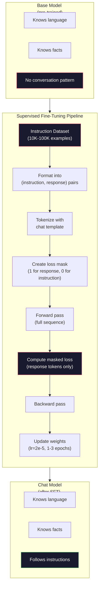

# Instruction Tuning (SFT) | 指令微调（监督微调）

> A base model predicts the next token. That's it. It doesn't follow instructions, answer questions, or refuse harmful requests. SFT is the bridge between a token predictor and a useful assistant. Every model you've ever talked to -- Claude, GPT, Llama Chat -- went through this step.

> **【中文解读】** 基础模型只会预测下一个 token。它不会遵循指令、回答问题或拒绝有害请求。SFT（监督微调）是连接"token 预测器"和"有用助手"的桥梁。Claude、ChatGPT、Llama Chat 都经过这一步。

> **【拓展：SFT→ChatGPT】** ChatGPT 的训练流程：GPT-3.5 预训练 → SFT（用人类标注的对话数据微调）→ RLHF（用人类偏好数据对齐）。SFT 是让基础模型变成对话助手的关键一步。

**Type:** Build
**Languages:** Python (with numpy)
**Prerequisites:** Phase 10, Lesson 04 (Pre-Training a Mini GPT)
**Time:** ~90 minutes

## Learning Objectives | 学习目标

- Implement supervised fine-tuning (SFT) that converts a base language model into an instruction-following assistant
  实现监督微调（SFT），将基础语言模型转换为指令跟随助手
- Format training data using chat templates with system, user, and assistant roles, and mask loss on non-assistant tokens
  使用带 system/user/assistant 角色的聊天模板格式化训练数据，并对非 assistant token 进行损失掩码
- Explain why SFT is necessary: base models continue text rather than answer questions
  解释为什么需要 SFT：基础模型是继续文本而非回答问题
- Evaluate SFT quality by comparing base model vs fine-tuned model responses on a held-out instruction set
  通过在留出指令集上比较基础模型与微调模型的回复来评估 SFT 质量

> **【中文解读】** 本课将基础模型转换为指令跟随助手。关键概念：SFT 使用与预训练相同的训练循环（前向→损失→反向→更新），但数据从原始文本变为结构化对话。核心技巧是损失掩码（loss masking）——只在 assistant 的回复部分计算损失，忽略 prompt 和 user 部分。

## The Problem | 问题引入

You trained a model in Lesson 04. It can predict the next token given a sequence. Feed it "The transformer architecture" and it might continue with "has revolutionized natural language processing." That's impressive for a next-token predictor.

> 你在第四课训练了一个模型。给定序列，它能预测下一个 token。输入 "The transformer architecture"，它可能续写 "has revolutionized natural language processing." 作为下一 token 预测器，这令人印象深刻。

Now try this: feed it "What is the capital of France?" A base model doesn't answer "Paris." It continues the pattern. It might produce "What is the capital of Germany? What is the capital of Spain?" because it learned from documents that contain lists of questions. Or it might produce "is a question that many people ask" because that's a plausible next-token continuation. The model has no concept of *answering*. It only knows *continuing*.

> 现在试试这个：输入 "What is the capital of France?" 基础模型不会回答 "Paris." 它会继续模式。它可能生成 "What is the capital of Germany? What is the capital of Spain?" 因为它从包含问题列表的文档中学到了这种模式。或者它可能生成 "is a question that many people ask"，因为这是一个合理的下一 token 续写。模型没有"回答"的概念。它只知道"续写"。

This is the gap between GPT-3 (base model, released June 2020) and ChatGPT (instruction-tuned, released November 2022). Same architecture. Same pre-training. The difference is 20,000 to 100,000 carefully crafted (instruction, response) pairs that taught the model to follow the conversation pattern.

> 这就是 GPT-3（基础模型，2020 年 6 月发布）和 ChatGPT（指令微调版，2022 年 11 月发布）之间的差距。相同架构。相同预训练。区别在于 2 万到 10 万条精心构造的（指令，回复）对，教会模型遵循对话模式。

Stanford Alpaca proved you don't need millions of examples. In March 2023, they fine-tuned Llama 7B on just 52,000 instruction-response pairs generated by GPT-3.5. Total cost: $600. The result was a chatbot that could follow instructions, answer questions, and hold conversations. Not as good as ChatGPT, but shockingly close for $600 and a few hours of training.

> Stanford Alpaca 证明你不需要数百万样本。2023 年 3 月，他们仅用 52,000 条 GPT-3.5 生成的指令-回复对微调了 Llama 7B。总成本：600 美元。结果是一个能遵循指令、回答问题和进行对话的聊天机器人。不如 ChatGPT 好，但考虑到 600 美元和几小时训练，已经惊人地接近。

Meta's Llama 2 Chat used only ~27,000 high-quality examples for its initial SFT stage. The key insight: quality matters more than quantity. 27,000 examples written by skilled annotators beat 1 million noisy examples scraped from the internet.

> Meta 的 Llama 2 Chat 初始 SFT 阶段仅使用了约 27,000 条高质量样本。核心洞察：质量比数量更重要。27,000 条由熟练标注者编写的样本胜过从互联网抓取的 100 万条噪声样本。

> **【中文解读】** GPT-3（2020.6）和 ChatGPT（2022.11）之间只差 2 万到 10 万条精心构造的（指令，回复）对。Stanford Alpaca 用 52,000 条 GPT-3.5 生成的指令数据微调 Llama 7B，成本仅 $600。Meta 的 Llama 2 Chat 只用了约 27,000 条高质量标注数据。核心洞察：质量比数量更重要——27,000 条由熟练标注者编写的样本胜过 100 万条互联网噪声数据。

> **【拓展：Llama 2 的 SFT 数据质量标准】** Meta 公开表示 Llama 2 Chat 的 SFT 数据由专业标注团队编写，每条数据都经过多轮审核。这与早期方法（从互联网抓取 QA 对）形成鲜明对比。OpenAI 据说也使用了大量人工标注的高质量对话数据来训练 ChatGPT 的 SFT 阶段。

## The Concept | 核心概念

### What SFT Actually Does

Supervised Fine-Tuning continues the same training loop from pre-training -- forward pass, compute loss, backward pass, update weights -- but on a different kind of data. Instead of raw text, you train on structured conversations:

> 监督微调延续预训练的相同训练循环——前向传播、计算损失、反向传播、更新权重——但在不同类型的数据上。你用结构化对话代替原始文本进行训练：

```json
{
  "system": "You are a helpful assistant.",
  "user": "What is the capital of France?",
  "assistant": "The capital of France is Paris."
}
```

The model already knows that Paris is the capital of France. It learned this during pre-training on Wikipedia, textbooks, and web pages. SFT doesn't teach the model new facts. It teaches the model a new *behavior*: when you see a question, produce an answer. When you see an instruction, produce a completion. When you see a harmful request, produce a refusal.

> 模型已经知道巴黎是法国的首都。它在预训练期间从维基百科、教科书和网页中学到了这一点。SFT 不教模型新事实。它教模型一种新*行为*：看到问题时，给出答案。看到指令时，给出完成。看到有害请求时，给出拒绝。

Think of it this way. Pre-training gives the model knowledge. SFT gives the model manners.

> 这样想：预训练给模型知识。SFT 给模型礼貌。

> **【中文解读】** SFT 的本质是继续预训练的训练循环，但数据从原始文本变为结构化对话。关键技术是损失掩码：只在 assistant 回复部分计算损失。这意味着模型学习"如何回答"而不是"如何继续文本"。预训练赋予模型知识，SFT 赋予模型礼貌——让它在合适的时机以合适的格式输出。

### Data Formats

Three formats dominate the industry. Each encodes the same information -- who said what -- with different delimiters.

> 行业主流有三种格式。每种编码相同的信息——谁说了什么——但使用不同的分隔符。

**Alpaca Format** (Stanford, March 2023):

```json
{
  "instruction": "Summarize the following article in 3 sentences.",
  "input": "The European Central Bank raised interest rates...",
  "output": "The ECB increased rates by 25 basis points..."
}
```

Simple and widely used. The `input` field is optional -- many instructions don't need additional context. Stanford released 52,000 examples in this format, generated by GPT-3.5 for $600. This kicked off the open-source instruction tuning movement.

> 简单且广泛使用。`input` 字段是可选的——许多指令不需要额外上下文。Stanford 以此格式发布了 52,000 个样本，由 GPT-3.5 生成，成本 600 美元。这开启了开源指令微调运动。

**ShareGPT Format** (community, 2023):

```json
{
  "conversations": [
    {"from": "system", "value": "You are a helpful assistant."},
    {"from": "human", "value": "What causes tides?"},
    {"from": "gpt", "value": "Tides are caused by the gravitational pull of the Moon..."},
    {"from": "human", "value": "How often do they occur?"},
    {"from": "gpt", "value": "Most coastal areas experience two high tides and two low tides per day..."}
  ]
}
```

Supports multi-turn conversations. The "from" field uses "human" and "gpt" by convention, regardless of the actual model. Vicuna was trained on 70,000 ShareGPT conversations scraped from user-shared ChatGPT transcripts.

> 支持多轮对话。"from" 字段按惯例使用 "human" 和 "gpt"，无论实际模型是什么。Vicuna 在从用户分享的 ChatGPT 对话记录中抓取的 70,000 个 ShareGPT 对话上训练。

**ChatML Format** (OpenAI, used by many open-source models):

```
<|im_start|>system
You are a helpful assistant.<|im_end|>
<|im_start|>user
What is the capital of France?<|im_end|>
<|im_start|>assistant
The capital of France is Paris.<|im_end|>
```

Uses special tokens (`<|im_start|>`, `<|im_end|>`) to delimit roles. These tokens are added to the tokenizer's vocabulary during fine-tuning. Qwen, Yi, and many other models use ChatML.

> 使用特殊 token（`<|im_start|>`、`<|im_end|>`）来分隔角色。这些 token 在微调期间添加到分词器词表中。Qwen、Yi 和许多其他模型使用 ChatML。

All three formats accomplish the same thing: they tell the model "this is the instruction, this is the response, learn this pattern."

> 三种格式都做同样的事：告诉模型"这是指令，这是回复，学习这个模式。"

### Why It Works

The model already knows language from pre-training. It has seen billions of examples of questions followed by answers, instructions followed by completions, and conversations between people. The patterns are already encoded in the weights.

> 模型在预训练中已经学会了语言。它见过数十亿个问题后跟答案、指令后跟完成、人与人对话的例子。这些模式已经编码在权重中。

SFT concentrates this latent ability. Instead of the model needing to figure out from context whether it should answer a question or continue a document, SFT explicitly trains on the conversation pattern. After a few thousand examples, the model learns: when you see the assistant role marker, produce a helpful response.

> SFT 集中了这种潜在能力。不再需要模型从上下文推断它应该回答问题还是续写文档，SFT 明确训练对话模式。几千个例子后，模型学会了：看到助手角色标记时，产生有用的回复。

This is why 27,000 examples is enough. You're not teaching the model English. You're not teaching it facts about the world. You're teaching it one simple behavior: respond to instructions. The knowledge was already there.

> 这就是为什么 27,000 个例子就够了。你不是在教模型英语。不是在教它关于世界的事实。你在教它一个简单行为：回应指令。知识已经在那里了。

### The Masked Loss

This is the most important technical detail in SFT, and most tutorials skip it.

> 这是 SFT 中最重要的技术细节，大多数教程都跳过了。

During pre-training, you compute loss on every token. The model learns to predict every next token in the sequence. During SFT, you only compute loss on the *response* tokens. The instruction tokens are there for context, but the model is not penalized for "predicting" them incorrectly.

> 预训练时，你对每个 token 计算损失。模型学习预测序列中的每个下一 token。SFT 时，你只对*回复* token 计算损失。指令 token 提供上下文，但模型不会因"预测"它们不正确而受惩罚。

Why? Because you don't want the model to learn to *generate* instructions. You want it to learn to *respond to* instructions. If you compute loss on the instruction tokens, you're training the model to predict "What is the capital of France?" as if it's the one asking the question. That wastes gradient signal and can confuse the model about its role.

> 为什么？因为你不希望模型学会*生成*指令。你希望它学会*回应*指令。如果你对指令 token 计算损失，你在训练模型预测 "What is the capital of France?"，就好像是它在提问。这浪费梯度信号并可能混淆模型的角色。

In practice, you create a loss mask: 1 for response tokens, 0 for instruction tokens. Multiply the per-token loss by this mask before averaging.

> 实践中，你创建一个损失掩码：回复 token 为 1，指令 token 为 0。在平均之前将每个 token 的损失乘以这个掩码。

```
Tokens:    [SYS] You are helpful [USER] What is the capital? [ASST] Paris is the capital [EOS]
Loss mask:   0    0    0     0      0     0   0  0     0       1     1    1   1     1      1
```

Only the tokens after `[ASST]` contribute to the loss. The model sees the full conversation during the forward pass (it needs the instruction to produce the right response) but only updates its weights based on how well it predicted the response.

> 只有 `[ASST]` 之后的 token 贡献损失。模型在前向传播中看到完整对话（它需要指令来产生正确回复），但仅根据预测回复的好坏来更新权重。

### Training Hyperparameters

SFT uses dramatically different hyperparameters than pre-training. You're not training from scratch. You're adjusting a model that already works.

> SFT 使用的超参数与预训练截然不同。你不是从头训练。你在调整一个已经有效的模型。

| Parameter | Pre-Training (Llama 2 7B) | SFT (Llama 2 Chat) |
|-----------|---------------------------|---------------------|
| Learning rate | 3e-4 (peak) | 2e-5 |
| Epochs | 1 (single pass over data) | 2 |
| Batch size | 4M tokens | 64 examples |
| Warmup steps | 2,000 | 0-100 |
| Weight decay | 0.1 | 0.0-0.1 |
| Data size | 2T tokens | 27,000 examples |

The learning rate is 15x lower for SFT. This is critical. A high learning rate during fine-tuning destroys the pre-trained knowledge. The model "forgets" what it learned and overfits to the small fine-tuning dataset. This is catastrophic forgetting.

> SFT 的学习率低 15 倍。这很关键。微调时高学习率会破坏预训练知识。模型"忘记"学到的东西并对小型微调数据集过拟合。这就是灾难性遗忘。

> **【中文解读】** 损失掩码是 SFT 中最重要的技术细节。预训练时对所有 token 计算损失，SFT 时只对 assistant 的回复 token 计算损失。指令 token 用于提供上下文，但不参与损失计算——否则模型会学习"生成指令"而不是"回应指令"。训练超参数也截然不同：SFT 的学习率比预训练低 15 倍（2e-5 vs 3e-4），避免灾难性遗忘。

> **【拓展：SFT 的数据规模与成本】** SFT 数据量远小于预训练：Llama 2 Chat 用 27,000 条、Alpaca 用 52,000 条、Vicuna 用 70,000 条对话。成本极低——Alpaca 的 SFT 数据生成成本仅 $600。关键在于数据质量远比数量重要。现代 SFT 还使用 packing 技术将多个短对话拼接到同一序列中提高 GPU 利用率。

Two epochs means the model sees each training example twice. More than 3 epochs on a small dataset leads to memorization -- the model starts reproducing training examples verbatim instead of generalizing.

> 两个 epoch 意味着模型看到每个训练样本两次。小型数据集上超过 3 个 epoch 会导致记忆化——模型开始逐字复现训练样本而不是泛化。

### Catastrophic Forgetting

Fine-tuning can destroy general capabilities. Train too long on instruction-following data and the model loses its ability to write code, do math, or produce creative text. It becomes very good at the specific format of its training data and terrible at everything else.

> 微调可能破坏通用能力。在指令跟随数据上训练太久，模型会失去写代码、做数学或产出创意文本的能力。它变得非常擅长训练数据的特定格式，但在其他方面变得很糟糕。

Three mitigations:

> 三种缓解策略：

1. **Low learning rate.** 1e-5 to 5e-5. Smaller updates mean less destruction of pre-trained features.

2. **Short training.** 1-3 epochs. Stop before the model overfits.

3. **Mix in pre-training data.** Llama 2 Chat mixed a small percentage (2-5%) of raw pre-training data into the SFT dataset. This "reminds" the model of its general capabilities while learning the new instruction-following behavior.

### Real Numbers

Fine-tuning a 7B model on 10,000 high-quality instruction pairs takes approximately 1 hour on a single NVIDIA A100 80GB GPU. Here's the math:

> 在单张 NVIDIA A100 80GB GPU 上用 10,000 条高质量指令对微调 7B 模型大约需要 1 小时。计算如下：

- 10,000 examples x 512 tokens average = 5.12M tokens
- 2 epochs = 10.24M tokens total
- A100 throughput for 7B model fine-tuning: ~3,000 tokens/second
- 10.24M / 3,000 = ~3,400 seconds = ~57 minutes

For our mini GPT (4 layers, 128 dims), training is nearly instant. The point is understanding the mechanics, not the scale.

> 对于我们的迷你 GPT（4 层，128 维），训练几乎是即时的。关键是理解机制，不是规模。



## Build It | 动手实现

### Step 1: Instruction Dataset

Create a synthetic instruction dataset. In production, companies like Scale AI and Anthropic employ human annotators to write these. We'll create them programmatically to demonstrate the format.

> 创建合成指令数据集。在生产中，Scale AI 和 Anthropic 等公司雇佣人工标注者来编写这些。我们将用程序创建它们来演示格式。

```python
import numpy as np

INSTRUCTION_DATA = [
    {
        "instruction": "What is the capital of France?",
        "response": "The capital of France is Paris."
    },
    {
        "instruction": "Explain gravity in one sentence.",
        "response": "Gravity is the force that attracts objects with mass toward each other."
    },
    {
        "instruction": "Write a haiku about the ocean.",
        "response": "Waves crash on the shore, salt and foam beneath the sun, endless blue expanse."
    },
    {
        "instruction": "What is 15 multiplied by 7?",
        "response": "15 multiplied by 7 is 105."
    },
    {
        "instruction": "Name three programming languages.",
        "response": "Three programming languages are Python, Rust, and TypeScript."
    },
    {
        "instruction": "Summarize photosynthesis.",
        "response": "Photosynthesis converts sunlight, water, and carbon dioxide into glucose and oxygen."
    },
    {
        "instruction": "What year did World War II end?",
        "response": "World War II ended in 1945."
    },
    {
        "instruction": "Define machine learning.",
        "response": "Machine learning is a field where algorithms learn patterns from data to make predictions."
    },
]
```

Eight examples is tiny. Stanford Alpaca used 52,000. But the mechanics are identical whether you have 8 or 52,000: tokenize, mask, compute loss on responses only.

> 八个例子很少。Stanford Alpaca 使用了 52,000 个。但无论你有 8 个还是 52,000 个，机制都是相同的：分词、掩码、只对回复计算损失。

### Step 2: Tokenize with Chat Template

Convert instruction-response pairs into token sequences with special role markers. The markers tell the model where the instruction ends and where the response begins.

> 将指令-回复对转换为带特殊角色标记的 token 序列。标记告诉模型指令在哪里结束，回复从哪里开始。

```python
SPECIAL_TOKENS = {
    "INST_START": 253,
    "INST_END": 254,
    "RESP_START": 255,
}


def tokenize_instruction_pair(instruction, response, vocab_size=256):
    inst_tokens = list(instruction.encode("utf-8"))
    resp_tokens = list(response.encode("utf-8"))

    inst_tokens = [min(t, vocab_size - 4) for t in inst_tokens]
    resp_tokens = [min(t, vocab_size - 4) for t in resp_tokens]

    tokens = (
        [SPECIAL_TOKENS["INST_START"]]
        + inst_tokens
        + [SPECIAL_TOKENS["INST_END"]]
        + [SPECIAL_TOKENS["RESP_START"]]
        + resp_tokens
    )

    return tokens


def create_loss_mask(tokens):
    mask = np.zeros(len(tokens), dtype=np.float32)
    in_response = False

    for i, token in enumerate(tokens):
        if token == SPECIAL_TOKENS["RESP_START"]:
            in_response = True
            continue
        if in_response:
            mask[i] = 1.0

    return mask
```

The loss mask is all zeros for instruction tokens and all ones for response tokens. The `RESP_START` token itself gets a mask of 0 because it's a delimiter, not part of the response content.

> 损失掩码对指令 token 全为 0，对回复 token 全为 1。`RESP_START` token 本身掩码为 0，因为它是分隔符，不是回复内容的一部分。

### Step 3: Masked Cross-Entropy Loss

Standard cross-entropy, but multiplied by the loss mask. Only response tokens contribute to the gradient.

> 标准交叉熵，但乘以损失掩码。只有回复 token 贡献梯度。

```python
def masked_cross_entropy_loss(logits, targets, loss_mask):
    batch, seq_len, vocab_size = logits.shape
    logits_flat = logits.reshape(-1, vocab_size)
    targets_flat = targets.reshape(-1)
    mask_flat = loss_mask.reshape(-1)

    max_logits = logits_flat.max(axis=-1, keepdims=True)
    log_softmax = logits_flat - max_logits - np.log(
        np.exp(logits_flat - max_logits).sum(axis=-1, keepdims=True)
    )

    per_token_loss = -log_softmax[np.arange(len(targets_flat)), targets_flat]

    masked_loss = per_token_loss * mask_flat
    num_response_tokens = mask_flat.sum()
    if num_response_tokens == 0:
        return 0.0
    loss = masked_loss.sum() / num_response_tokens

    return loss
```

The denominator is `num_response_tokens`, not `seq_len`. If you divide by the total sequence length, longer instructions dilute the gradient signal. Dividing by response token count ensures equal weight per response token regardless of instruction length.

> 分母是 `num_response_tokens`，不是 `seq_len`。如果除以总序列长度，更长的指令会稀释梯度信号。除以回复 token 数确保每个回复 token 权重相等，无论指令长度如何。

### Step 4: SFT Training Loop

Reuse the MiniGPT from Lesson 04. The training loop looks almost identical to pre-training, but with instruction formatting and masked loss.

> 复用第四课的 MiniGPT。训练循环看起来与预训练几乎相同，但有指令格式化和掩码损失。

```python
import sys
import os
sys.path.insert(0, os.path.join(os.path.dirname(__file__), "..", "..", "04-pre-training-mini-gpt", "code"))
from main import MiniGPT, LayerNorm, FeedForward, MultiHeadAttention, TransformerBlock, Embedding


def sft_train(model, dataset, num_epochs=2, lr=2e-5, seq_len=64):
    formatted_data = []
    for example in dataset:
        tokens = tokenize_instruction_pair(example["instruction"], example["response"])
        mask = create_loss_mask(tokens)
        formatted_data.append((tokens, mask))

    print(f"SFT Training: {len(formatted_data)} examples, {num_epochs} epochs, lr={lr}")
    print(f"Total tokens: {sum(len(t) for t, _ in formatted_data):,}")
    print()

    losses = []

    for epoch in range(num_epochs):
        epoch_loss = 0.0
        num_batches = 0

        indices = np.random.permutation(len(formatted_data))

        for idx in indices:
            tokens, mask = formatted_data[idx]

            if len(tokens) < 3:
                continue
            if len(tokens) > seq_len:
                tokens = tokens[:seq_len]
                mask = mask[:seq_len]

            input_ids = np.array(tokens[:-1]).reshape(1, -1)
            target_ids = np.array(tokens[1:]).reshape(1, -1)
            loss_mask = np.array(mask[1:]).reshape(1, -1)

            logits = model.forward(input_ids)
            loss = masked_cross_entropy_loss(logits, target_ids, loss_mask)

            batch_size, s_len, v_size = logits.shape
            probs = np.exp(logits - logits.max(axis=-1, keepdims=True))
            probs = probs / probs.sum(axis=-1, keepdims=True)
            dlogits = probs.copy()
            dlogits[np.arange(batch_size)[:, None], np.arange(s_len), target_ids] -= 1.0

            mask_expanded = loss_mask[:, :, np.newaxis]
            num_resp = loss_mask.sum()
            if num_resp > 0:
                dlogits = dlogits * mask_expanded / num_resp

            for block in model.blocks:
                block.ffn.W1 -= lr * np.random.randn(*block.ffn.W1.shape) * 0.01
                block.ffn.W2 -= lr * np.random.randn(*block.ffn.W2.shape) * 0.01
                block.ffn.b1 -= lr * np.random.randn(*block.ffn.b1.shape) * 0.01
                block.ffn.b2 -= lr * np.random.randn(*block.ffn.b2.shape) * 0.01

            epoch_loss += loss
            num_batches += 1
            losses.append(loss)

        avg_loss = epoch_loss / max(num_batches, 1)
        print(f"Epoch {epoch + 1}/{num_epochs} | Avg Loss: {avg_loss:.4f}")

    return model, losses
```

The learning rate is 2e-5, matching Llama 2 Chat. Compare this to the 3e-4 used in pre-training -- 15x smaller. The gradient is masked: instruction tokens produce zero gradient. Only response tokens push the weights.

> 学习率为 2e-5，与 Llama 2 Chat 一致。与预训练的 3e-4 相比——小 15 倍。梯度被掩码：指令 token 产生零梯度。只有回复 token 推动权重更新。

### Step 5: Compare Base vs SFT Model

The whole point of SFT is behavioral change. Let's measure it by checking how the model responds to instruction-formatted inputs versus raw text continuations.

> SFT 的全部意义在于行为改变。让我们通过检查模型如何回应指令格式输入 versus 原始文本续写来衡量它。

```python
def generate_response(model, prompt_tokens, max_new_tokens=50, temperature=0.8):
    tokens = list(prompt_tokens)
    seq_len = model.embedding.pos_embed.shape[0]

    for _ in range(max_new_tokens):
        context = np.array(tokens[-seq_len:]).reshape(1, -1)
        logits = model.forward(context)
        next_logits = logits[0, -1, :]

        next_logits = next_logits / max(temperature, 1e-8)
        probs = np.exp(next_logits - next_logits.max())
        probs = probs / probs.sum()
        probs = np.clip(probs, 1e-10, 1.0)
        probs = probs / probs.sum()

        next_token = np.random.choice(len(probs), p=probs)
        tokens.append(int(next_token))

    return tokens


def evaluate_instruction_following(model, instructions):
    print("Evaluating instruction following:")
    print("-" * 50)

    for instruction in instructions:
        tokens = (
            [SPECIAL_TOKENS["INST_START"]]
            + [min(t, 252) for t in list(instruction.encode("utf-8"))]
            + [SPECIAL_TOKENS["INST_END"]]
            + [SPECIAL_TOKENS["RESP_START"]]
        )

        output = generate_response(model, tokens, max_new_tokens=30, temperature=0.6)
        response_start = len(tokens)
        response_tokens = output[response_start:]
        response_bytes = bytes([t for t in response_tokens if t < 128])
        response_text = response_bytes.decode("utf-8", errors="replace")

        print(f"  Q: {instruction}")
        print(f"  A: {response_text[:80]}")
        print()
```

On a tiny model with 8 examples, the responses won't be meaningful. That's expected. The important thing is the *structure*: the model learns to produce output after the response marker instead of continuing to generate more instructions.

> 在只有 8 个例子的微型模型上，回复不会有意义。这是预期的。重要的是*结构*：模型学会在回复标记后产生输出，而不是继续生成更多指令。

### Step 6: Measure Catastrophic Forgetting

Compare the model's next-token prediction ability before and after SFT. If SFT damages general capabilities, the loss on raw text will increase.

> 比较 SFT 前后模型的下一 token 预测能力。如果 SFT 损害了通用能力，原始文本上的损失会增加。

```python
def measure_forgetting(model, test_text, seq_len=64):
    tokens = np.array(list(test_text.encode("utf-8")[:512]))

    total_loss = 0.0
    num_windows = 0

    for start in range(0, len(tokens) - seq_len - 1, seq_len):
        input_ids = tokens[start:start + seq_len].reshape(1, -1)
        target_ids = tokens[start + 1:start + seq_len + 1].reshape(1, -1)

        logits = model.forward(input_ids)

        batch, s_len, vocab_size = logits.shape
        logits_flat = logits.reshape(-1, vocab_size)
        targets_flat = target_ids.reshape(-1)

        max_logits = logits_flat.max(axis=-1, keepdims=True)
        log_softmax = logits_flat - max_logits - np.log(
            np.exp(logits_flat - max_logits).sum(axis=-1, keepdims=True)
        )

        loss = -log_softmax[np.arange(len(targets_flat)), targets_flat].mean()
        total_loss += loss
        num_windows += 1

    return total_loss / max(num_windows, 1)
```

In real fine-tuning, you would track this metric throughout training. If the raw text loss increases by more than 10-15%, your SFT is too aggressive. Lower the learning rate or reduce the number of epochs.

> 在真实微调中，你应该在整个训练过程中跟踪这个指标。如果原始文本损失增加超过 10-15%，说明 SFT 太激进了。降低学习率或减少 epoch 数。

## Use It | 用框架实现

### Full SFT Pipeline Demo

```python
if __name__ == "__main__":
    np.random.seed(42)

    test_text = """The transformer architecture processes sequences through self-attention.
Each layer applies multi-head attention followed by a feedforward network.
Residual connections and layer normalization stabilize deep networks.
The model learns to predict the next token given all previous tokens."""

    print("=" * 70)
    print("INSTRUCTION TUNING (SFT) DEMO")
    print("=" * 70)
    print()

    model = MiniGPT(
        vocab_size=256, embed_dim=128, num_heads=4,
        num_layers=4, max_seq_len=128, ff_dim=512
    )
    print(f"Model: {model.count_parameters():,} parameters")
    print(f"Config: 4 layers, 4 heads, 128 dims (mini GPT from Lesson 04)")
    print()

    print("PRE-SFT: Measuring base model loss on raw text")
    base_loss = measure_forgetting(model, test_text)
    print(f"  Base model loss: {base_loss:.4f}")
    print()

    print("=" * 70)
    print("SFT TRAINING")
    print("=" * 70)

    model, losses = sft_train(
        model, INSTRUCTION_DATA, num_epochs=3, lr=2e-5, seq_len=128
    )

    print()
    print("POST-SFT: Measuring fine-tuned model loss on raw text")
    sft_loss = measure_forgetting(model, test_text)
    print(f"  SFT model loss: {sft_loss:.4f}")
    print(f"  Change: {((sft_loss - base_loss) / base_loss * 100):+.1f}%")
    if abs(sft_loss - base_loss) / base_loss < 0.15:
        print("  Minimal forgetting (< 15% change)")
    else:
        print("  Significant forgetting detected")
    print()

    print("=" * 70)
    print("INSTRUCTION FOLLOWING EVALUATION")
    print("=" * 70)
    print()

    test_instructions = [
        "What is the capital of France?",
        "Name a programming language.",
        "Define gravity.",
    ]
    evaluate_instruction_following(model, test_instructions)

    print("=" * 70)
    print("DATA FORMAT EXAMPLES")
    print("=" * 70)
    print()

    for i, example in enumerate(INSTRUCTION_DATA[:3]):
        tokens = tokenize_instruction_pair(example["instruction"], example["response"])
        mask = create_loss_mask(tokens)
        resp_count = int(mask.sum())
        total_count = len(tokens)
        print(f"  Example {i + 1}: {total_count} tokens, {resp_count} response tokens ({resp_count/total_count:.0%} of sequence)")
        print(f"    Instruction: {example['instruction']}")
        print(f"    Response: {example['response']}")
        print()

    print("=" * 70)
    print("TRAINING LOSS CURVE")
    print("=" * 70)
    print()

    if losses:
        window = max(1, len(losses) // 5)
        for i in range(0, len(losses), window):
            chunk = losses[i:i + window]
            avg = sum(chunk) / len(chunk)
            print(f"  Steps {i:3d}-{i + len(chunk) - 1:3d}: avg loss = {avg:.4f}")
```

## Ship It | 产出物

This lesson produces `outputs/prompt-sft-data-curator.md` -- a prompt that helps you design and curate instruction datasets for SFT. Given a target capability (code generation, math, conversation), it produces a data collection plan with format specifications, quality criteria, and diversity requirements.

## Exercises | 练习题

1. Add system prompt support. Modify `tokenize_instruction_pair` to accept a system message and prepend it before the instruction. Create 5 examples with different system prompts ("You are a poet", "You are a math tutor") and verify the model sees different system prompts during training.

2. Implement data mixing. Create a function that takes an SFT dataset and a raw text corpus, then produces training batches where 5% of examples are raw text (no masking) and 95% are instruction pairs (masked). Run 3 epochs and compare forgetting metrics against pure SFT training.

3. Build a data quality scorer. For each instruction-response pair, compute: (a) response length in tokens, (b) instruction-to-response ratio, (c) vocabulary diversity (unique tokens / total tokens). Filter out examples with response length < 10 tokens or diversity < 0.3. Show how filtering affects the final loss.

4. Implement multi-turn conversation training. Extend the tokenization to handle 3-turn conversations (user-assistant-user-assistant-user-assistant). The loss mask should cover all three assistant turns. Verify the mask is correct by printing the token-mask alignment for one example.

5. Compare learning rates. Train the same model three times with lr=1e-4, lr=2e-5, and lr=1e-6. Plot the loss curves. The 1e-4 run should show rapid initial descent but higher final loss (overfitting). The 1e-6 run should barely move. The 2e-5 run should be the sweet spot.

## Key Terms | 术语速查表

| Term | What people say | What it actually means | 中文释义 |
|------|----------------|----------------------|---------|
| SFT | "Fine-tuning on conversations" | Supervised Fine-Tuning: continuing training on (instruction, response) pairs with loss computed only on response tokens | 监督微调，在指令-回复对上继续训练，仅对回复 token 计算损失 |
| Instruction tuning | "Teaching the model to follow instructions" | Training on explicit instruction-response pairs so the base model learns the conversation pattern, not new knowledge | 指令微调，训练基础模型学会对话模式而非新知识 |
| Loss masking | "Ignoring the prompt" | Setting loss to zero for instruction tokens so gradients only flow from response token predictions | 损失掩码，指令 token 损失设为零，梯度仅来自回复预测 |
| ChatML | "Chat Markup Language" | A token format using `<\|im_start\|>` and `<\|im_end\|>` delimiters to mark speaker roles in conversation data | 聊天标记语言，用特殊 token 标记对话角色 |
| Alpaca format | "Stanford's format" | A JSON format with instruction/input/output fields, used for 52K GPT-3.5-generated examples that cost $600 | Alpaca 格式，Stanford 的 JSON 指令格式，52K 样本成本 $600 |
| Catastrophic forgetting | "The model gets dumber" | Fine-tuning destroys pre-trained capabilities because gradient updates overwrite general knowledge with task-specific patterns | 灾难性遗忘，微调破坏预训练能力 |
| Weight tying | "Shared embeddings" | Using the same matrix for input token embeddings and output prediction head, saving parameters and improving coherence | 权重共享，输入输出共用嵌入矩阵 |
| Chat template | "How you format the prompt" | The specific token sequence (role markers, delimiters) that structures a conversation for the model | 聊天模板，格式化对话的 token 序列 |

## Further Reading | 延伸阅读

- [Ouyang et al., 2022 -- "Training language models to follow instructions with human feedback" (InstructGPT)](https://arxiv.org/abs/2203.02155) -- the paper that introduced instruction tuning + RLHF at OpenAI
- [Taori et al., 2023 -- "Stanford Alpaca: An Instruction-following LLaMA Model"](https://github.com/tatsu-lab/stanford_alpaca) -- 52K instruction examples for $600, proving SFT works on small datasets
- [Touvron et al., 2023 -- "Llama 2: Open Foundation and Fine-Tuned Chat Models"](https://arxiv.org/abs/2307.09288) -- Meta's SFT + RLHF pipeline with 27K high-quality examples
- [Chiang et al., 2023 -- "Vicuna: An Open-Source Chatbot Impressing GPT-4"](https://lmsys.org/blog/2023-03-30-vicuna/) -- training on 70K ShareGPT conversations
- [Zhou et al., 2023 -- "LIMA: Less Is More for Alignment"](https://arxiv.org/abs/2305.11206) -- proving that 1,000 carefully curated examples can match SFT on much larger datasets
