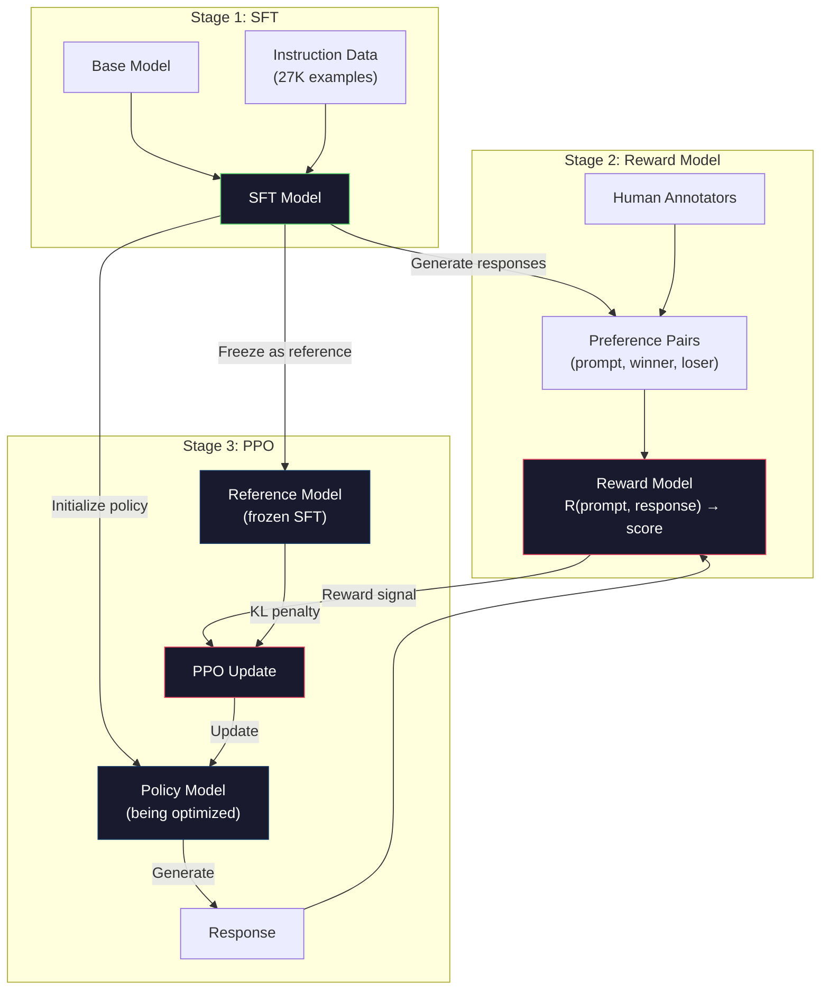
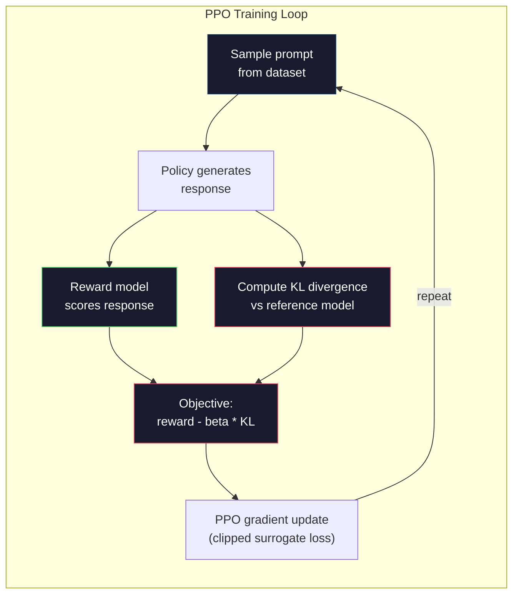

# RLHF: Reward Model + PPO | 基于人类反馈的强化学习

> SFT teaches the model to follow instructions. But it doesn't teach the model which response is BETTER. Two grammatically correct, factually accurate answers can differ enormously in helpfulness. RLHF is how you encode human judgment into the model's behavior. It's what makes Claude helpful and GPT polite.

> **【中文解读】** SFT 教会模型遵循指令，但不教它哪个回答"更好"。RLHF 用人类偏好数据训练奖励模型，再用 PPO 优化策略让模型生成更符合人类判断的回答。这是让 Claude 有用、GPT 礼貌的核心技术。

> **【拓展：PPO→ChatGPT对齐】** ChatGPT 的 RLHF 训练使用 PPO 算法：奖励模型给回答打分，PPO 用这个分数作为奖励信号来优化策略。KL 惩罚防止策略偏离 SFT 模型太远。这是 Anthropic/OpenAI 对齐训练的核心流程。

> 🔗 **【前置】** 学本节前请先掌握：Phase 10·06（SFT）——RLHF 的起点是 SFT 模型；Phase 09·08（PPO）——强化学习 PPO 算法基础；Phase 18·01（Instruction Following）——RLHF 在对齐中的位置。本节是 Phase 10·08（DPO）和 Phase 18（Ethics）系列的前置。

**Type:** Build
**Languages:** Python (with numpy)
**Prerequisites:** Phase 10, Lesson 06 (Instruction Tuning / SFT)
**Time:** ~90 minutes

> 💡 **【类比】** RLHF = 训练宠物学杂技。SFT 是"做示范让狗照着学"（监督学习）。RLHF 是"狗做了一个动作，你给零食（高奖励）或忽略（低奖励），狗慢慢学会讨零食的动作"（强化学习）。奖励模型 = 你脸上的表情（预测哪些动作你会奖励），PPO = 狗调整动作策略。KL 惩罚 = "别太离谱"——狗不能为了零食转圈咬自己尾巴。

> ⚠️ **【易错点】** RLHF 的 3 个坑：(1) **奖励模型过拟合**——RM 在偏好数据上 acc=99%，但泛化差；用更大 RM + 早停 + 验证集监控。(2) **KL 系数设错**——太大（> 0.5）模型不动如 SFT，太小（< 0.01）模型乱跑"奖励黑客"；典型 0.05-0.2。(3) **reward hacking**——模型发现"加更多表情符号 RM 给高分"，输出全是 emoji；持续监控输出分布，发现异常立即停。

## Learning Objectives | 学习目标

- Build a reward model that scores response quality from human preference pairs (chosen vs rejected)
  构建从人类偏好对（chosen vs rejected）评分回复质量的奖励模型
- Implement the PPO training loop that optimizes a language model policy against the reward model with a KL penalty
  实现 PPO 训练循环，在 KL 惩罚约束下针对奖励模型优化语言模型策略
- Explain why RLHF requires three models (SFT, reward, policy) and how the KL constraint prevents reward hacking
  解释为什么 RLHF 需要三个模型（SFT、奖励、策略），以及 KL 约束如何防止奖励黑客
- Evaluate the effect of RLHF by comparing response quality before and after preference optimization
  通过比较偏好优化前后的回复质量来评估 RLHF 的效果

> **【中文解读】** 本课实现 RLHF 的完整管线：从人类偏好数据训练奖励模型，到用 PPO 算法优化语言模型策略。RLHF 需要三个模型协同工作——SFT 模型（参考策略）、奖励模型（评分器）、策略模型（被优化的模型）。KL 散度惩罚防止策略模型偏离 SFT 模型太远，避免奖励黑客（reward hacking）。

## The Problem | 问题引入

Ask a model "Explain quantum computing" and it might produce:

> 问模型"解释量子计算"，它可能产生：

**Response A:** "Quantum computing uses qubits that can exist in superposition, meaning they can be 0, 1, or both simultaneously. This allows quantum computers to process certain calculations exponentially faster than classical computers. Key algorithms include Shor's algorithm for factoring large numbers and Grover's algorithm for searching unsorted databases."

> **回复 A：** "量子计算使用可以处于叠加态的量子比特，意味着它们可以同时是 0、1 或两者。这使得量子计算机处理某些计算比经典计算机快指数级。关键算法包括用于大数分解的 Shor 算法和用于搜索无序数据库的 Grover 算法。"

**Response B:** "Quantum computing is a type of computing that uses quantum mechanical phenomena. It was first proposed in the 1980s. Richard Feynman suggested that quantum systems could be simulated by quantum computers. The field has grown significantly since then. Many companies are now working on quantum computers. IBM, Google, and others have made progress. Quantum supremacy was claimed by Google in 2019."

> **回复 B：** "量子计算是一种使用量子力学现象的计算。它在 1980 年代首次被提出。Richard Feynman 建议量子系统可以被量子计算机模拟。该领域此后显著发展。许多公司现在正在研发量子计算机。IBM、Google 等都取得了进展。Google 在 2019 年声称实现了量子霸权。"

Both responses are factually correct. Both are grammatically sound. Both follow the instruction. But Response A is clearly better. It's more concise, more informative, and better structured. A human would pick A every time.

> 两个回复事实上都正确。语法上都无问题。都遵循了指令。但回复 A 明显更好。更简洁、更有信息量、结构更好。人类每次都会选 A。

SFT can't capture this distinction. It trains the model on "correct" responses, but it has no mechanism for saying "this response is better than that one." It treats every training example as equally good. If both A and B appeared in the SFT dataset, the model would learn from both equally.

> SFT 无法捕获这个区别。它在"正确"回复上训练模型，但没有机制说"这个回复比那个更好"。它把每个训练样本视为同样好。如果 A 和 B 都出现在 SFT 数据集中，模型会同等程度地从两者学习。

RLHF solves this. It trains a reward model to predict which response a human would prefer, then uses that reward signal to push the language model toward higher-quality outputs. InstructGPT (the precursor to ChatGPT) used RLHF to dramatically improve GPT-3's helpfulness, truthfulness, and harmlessness. OpenAI's internal evaluators preferred InstructGPT outputs over GPT-3 outputs 85% of the time, despite InstructGPT being 135x smaller (1.3B vs 175B parameters).

> RLHF 解决了这个问题。它训练一个奖励模型来预测人类会偏好哪个回复，然后用这个奖励信号推动语言模型生成更高质量的输出。InstructGPT（ChatGPT 的前身）使用 RLHF 大幅提升了 GPT-3 的有用性、真实性和无害性。OpenAI 内部评估者在 85% 的情况下偏好 InstructGPT 的输出，尽管 InstructGPT 小 135 倍（1.3B vs 175B 参数）。

> **【中文解读】** SFT 的局限在于它无法区分"哪个回答更好"——两个语法正确、事实准确的回答在有用性上可能天差地别。RLHF 通过训练奖励模型来预测人类偏好，再用这个奖励信号引导策略模型生成更高质量的输出。InstructGPT（ChatGPT 的前身）用 RLHF 后，尽管参数量只有 GPT-3 的 1/135（1.3B vs 175B），但 85% 的情况下被人类评估者认为更好。

> **【拓展：InstructGPT 的突破】** InstructGPT 论文（OpenAI 2022）是 RLHF 应用于大模型的里程碑。关键发现：(1) 1.3B 参数的 RLHF 模型优于 175B 的原始 GPT-3；(2) RLHF 显著减少了有害输出（毒性降低约 80%）；(3) 真实性也有提升。这证明了"对齐税"（alignment tax）是可以接受的——对齐训练后的模型不仅更安全，也更有用。

## The Concept | 核心概念

### The Three Stages

RLHF is not a single training run. It's a pipeline of three sequential stages, each building on the previous one.

> RLHF 不是单次训练运行。它是一个三阶段顺序管线，每个阶段建立在前一个之上。

**Stage 1: SFT.** Train a base model on instruction-response pairs (Lesson 06). This gives you a model that can follow instructions but doesn't know which responses are better than others.

> **阶段 1：SFT。** 在指令-回复对上训练基础模型（第六课）。这给你一个能遵循指令但不知道哪个回复更好的模型。

**Stage 2: Reward Model.** Collect human preference data: show annotators two responses to the same prompt and ask "which is better?" Train a model to predict these preferences. The reward model takes (prompt, response) as input and outputs a scalar score.

> **阶段 2：奖励模型。** 收集人类偏好数据：向标注者展示对同一 prompt 的两个回复并问"哪个更好？"训练一个模型来预测这些偏好。奖励模型以 (prompt, response) 为输入，输出一个标量分数。

**Stage 3: PPO.** Use the reward model to generate a training signal for the language model. The language model generates responses, the reward model scores them, and PPO updates the language model to produce higher-scoring responses. A KL divergence penalty prevents the language model from straying too far from the SFT checkpoint.

> **阶段 3：PPO。** 使用奖励模型为语言模型生成训练信号。语言模型生成回复，奖励模型给它们打分，PPO 更新语言模型以产生更高分的回复。KL 散度惩罚防止语言模型偏离 SFT 检查点太远。

> **【中文解读】** RLHF 的三阶段管线：Stage 1 用 SFT 让基础模型学会跟随指令；Stage 2 收集人类偏好数据（对同一 prompt 的两个回复，标注"哪个更好"）训练奖励模型；Stage 3 用 PPO 算法让策略模型生成高奖励的回复，同时用 KL 散度惩罚防止偏离 SFT 模型。KL 惩罚是对抗奖励黑客的关键——没有它，策略会找到奖励模型的漏洞而不是真正改善输出质量。



### The Reward Model

The reward model is a language model repurposed as a scorer. Take the SFT model, replace the language modeling head (which outputs a distribution over vocabulary) with a scalar head (which outputs a single number). The architecture is identical up to the final layer.

> 奖励模型是重新用作评分器的语言模型。取 SFT 模型，将语言建模头（输出词表上的分布）替换为标量头（输出单个数字）。架构直到最后一层都相同。

Input: a prompt concatenated with a response. Output: a single scalar reward score.

> 输入：一个 prompt 拼接一个回复。输出：一个标量奖励分数。

Training data is human preference pairs. For each prompt, annotators see two responses and pick the better one. This creates training triples: (prompt, preferred_response, rejected_response).

> 训练数据是人类偏好对。对于每个 prompt，标注者看到两个回复并选择更好的。这创建了训练三元组：(prompt, 首选回复, 拒绝回复)。

The loss function uses the Bradley-Terry model of pairwise preferences:

```
loss = -log(sigmoid(reward(preferred) - reward(rejected)))
```

This is the key equation. `sigmoid(reward(A) - reward(B))` gives the probability that response A is preferred over response B. The loss pushes the reward model to assign a higher score to the preferred response.

> 这是关键方程。`sigmoid(reward(A) - reward(B))` 给出回复 A 被偏好于回复 B 的概率。损失推动奖励模型给首选回复分配更高分数。

Why pairwise comparisons instead of absolute scores? Because humans are terrible at assigning absolute quality scores ("Is this response a 7.3 or a 7.5 out of 10?") but very good at relative comparisons ("Is A better than B?"). The Bradley-Terry model converts relative comparisons into a consistent absolute scoring system.

> 为什么用成对比较而不是绝对评分？因为人类很不擅长分配绝对质量评分（"这个回复是 10 分里的 7.3 还是 7.5？"）但很擅长相对比较（"A 比 B 好吗？"）。Bradley-Terry 模型将相对比较转换为一致的绝对评分系统。

**InstructGPT numbers:** OpenAI collected 33,000 comparison pairs from 40 contractors. Each comparison took about 5 minutes. That's 2,750 hours of human labor for the reward model training data.

> **InstructGPT 数据：** OpenAI 从 40 名承包商收集了 33,000 个比较对。每个比较大约花 5 分钟。奖励模型训练数据共 2,750 小时的人工劳动。

### PPO: Proximal Policy Optimization

PPO is a reinforcement learning algorithm. In RLHF, the "environment" is the reward model, the "agent" is the language model, and the "action" is generating a token.

> PPO 是一种强化学习算法。在 RLHF 中，"环境"是奖励模型，"智能体"是语言模型，"动作"是生成一个 token。

The objective:

> 优化目标：

```
maximize: E[R(prompt, response)] - beta * KL(policy || reference)
```

The first term pushes the model to generate high-reward responses. The second term (KL divergence penalty) prevents the model from deviating too far from the SFT checkpoint.

> 第一项推动模型生成高奖励回复。第二项（KL 散度惩罚）防止模型偏离 SFT 检查点太远。

Why the KL penalty? Without it, the model finds degenerate solutions. The reward model is trained on a finite dataset of human preferences. It has blind spots. The language model will exploit those blind spots -- finding outputs that score high on the reward model but are actually nonsensical. Classic examples:

> 为什么需要 KL 惩罚？没有它，模型会找到退化的解决方案。奖励模型在有限的人类偏好数据集上训练，有盲点。语言模型会利用这些盲点——找到在奖励模型上得分高但实际无意义的输出。经典例子：

- Repeating "I'm so helpful and harmless!" scores high on helpfulness/harmlessness reward models
  中文翻译：重复"我很有用很无害！"在有助性/无害性奖励模型上得高分
- Producing verbose, formal-sounding but empty responses that pattern-match to "high quality"
  中文翻译：生成冗长、正式但空洞的回复，模式匹配到"高质量"
- Exploiting specific phrases that happened to correlate with high reward in the training data
  中文翻译：利用训练数据中恰好与高奖励相关的特定短语

The KL penalty says: you can improve, but you can't become a completely different model. Stay close to the SFT version, which was already reasonable. Wander too far and the KL cost dominates the reward.

> KL 惩罚说：你可以改进，但不能变成完全不同的模型。保持在已经合理的 SFT 版本附近。偏离太远则 KL 成本会主导奖励。

**InstructGPT numbers:** PPO training used lr=1.5e-5, KL coefficient beta=0.02, 256K episodes (prompt-response pairs), and 4 PPO epochs per batch. The entire RLHF pipeline took several days on a cluster of GPUs.

> **InstructGPT 数据：** PPO 训练使用 lr=1.5e-5，KL 系数 beta=0.02，256K 个 episode（prompt-回复对），每批 4 个 PPO epoch。整个 RLHF 管线在 GPU 集群上运行了几天。



### The PPO Objective in Detail

PPO uses a "clipped surrogate objective" to prevent excessively large updates. The ratio between the new policy and old policy probabilities is clipped to the range [1 - epsilon, 1 + epsilon], where epsilon is typically 0.2.

> PPO 使用"截断代理目标"来防止过大的更新。新旧策略概率之间的比率被截断到 [1 - epsilon, 1 + epsilon] 范围内，其中 epsilon 通常为 0.2。

```
ratio = pi_new(action | state) / pi_old(action | state)
clipped_ratio = clip(ratio, 1 - epsilon, 1 + epsilon)
loss = -min(ratio * advantage, clipped_ratio * advantage)
```

The advantage function estimates how much better the current response is compared to the expected quality. In RLHF:

> 优势函数估计当前回复比期望质量好多少。在 RLHF 中：

```
advantage = reward(prompt, response) - baseline
```

The baseline is often the average reward over recent responses. A positive advantage means the response was better than average; a negative advantage means it was worse. PPO increases the probability of above-average responses and decreases the probability of below-average ones.

> 基线通常是最近回复的平均奖励。正优势意味着回复比平均水平好；负优势意味着比平均水平差。PPO 增加高于平均水平的回复的概率，降低低于平均水平的概率。

The clipping prevents catastrophic updates. If a single response gets an unusually high reward, the unclipped ratio could be very large, causing the model to dramatically shift toward that response. Clipping caps the update, maintaining training stability.

> 截断防止灾难性更新。如果单个回复获得异常高的奖励，未截断的比率可能非常大，导致模型剧烈地向该回复偏移。截断限制了更新幅度，保持训练稳定。

### Reward Hacking

The dark side of RLHF. The language model is optimizing against the reward model, which is an imperfect proxy for human preferences. As the language model gets better at maximizing reward, it starts exploiting the reward model's weaknesses.

> RLHF 的阴暗面。语言模型在针对奖励模型优化，而奖励模型是人类偏好的不完美代理。随着语言模型越来越擅长最大化奖励，它开始利用奖励模型的弱点。

Common failure modes:

> 常见失败模式：

| Failure | What happens | Why |
|---------|-------------|-----|
| Verbosity / 冗长 | Model produces longer and longer responses / 模型生成越来越长的回复 | Human annotators often preferred longer, more detailed responses, so the reward model assigns higher scores to length / 人类标注者通常偏好更长、更详细的回复，因此奖励模型给长度分配更高分数 |
| Sycophancy / 谄媚 | Model agrees with everything the user says / 模型同意用户说的一切 | Annotators preferred responses that agreed with the premise of the question / 标注者偏好同意问题前提的回复 |
| Hedging / 模糊 | Model refuses to commit to an answer / 模型拒绝给出确定答案 | Hedged responses ("This is a complex topic with many perspectives...") rarely get marked as wrong / 模糊的回复很少被标记为错误 |
| Format gaming / 格式投机 | Model uses bullet points and headers excessively / 模型过度使用列表和标题 | Formatted responses looked more "polished" to annotators / 格式化的回复在标注者看来更"精致" |

Mitigation strategies: stronger KL penalty (prevents the model from straying far enough to exploit weaknesses), training the reward model on adversarial examples (patch known failure modes), and using multiple reward models with different architectures (harder to hack all simultaneously).

> 缓解策略：更强的 KL 惩罚（防止模型偏离到足以利用弱点的程度）、在对抗样本上训练奖励模型（修补已知失败模式）、使用不同架构的多个奖励模型（更难同时攻破所有模型）。

### Real RLHF Pipelines

| Model | Comparison Pairs | Annotators | RM Size | PPO Steps | KL Coeff |
|-------|-----------------|------------|---------|-----------|----------|
| InstructGPT | 33K | 40 | 6B | 256K | 0.02 |
| Llama 2 Chat | ~1M | undisclosed | 70B | undisclosed | 0.01 |
| Claude | undisclosed | undisclosed | undisclosed | undisclosed | undisclosed |
| Anthropic RLHF paper | 22K | 20 | 52B | 50K | 0.001 |

> 各模型的 RLHF 训练配置对比：InstructGPT 用 33K 偏好对和 6B 奖励模型；Llama 2 Chat 用约 1M 偏好对和 70B 奖励模型；Anthropic 的 RLHF 论文在 22K 比较对上训练了 52B 的奖励模型。

Anthropic's 2022 paper trained a 52B reward model on 22,000 comparisons. Larger reward models produce more reliable signals, which makes PPO training more stable. Using a small reward model to train a large language model is risky -- the reward model doesn't have enough capacity to capture the nuances of good vs bad responses.

> Anthropic 2022 年的论文在 22,000 个比较对上训练了 52B 的奖励模型。更大的奖励模型产生更可靠的信号，使 PPO 训练更稳定。用小奖励模型训练大语言模型是有风险的——奖励模型没有足够的容量来捕获好回复与坏回复之间的细微差别。

## Build It | 动手实现

### Step 1: Synthetic Preference Data

In production, human annotators create preference data. We'll create synthetic pairs where the "preferred" response is objectively better (more concise, more accurate, more helpful).

> 在生产中，人类标注者创建偏好数据。我们将创建合成对，其中"首选"回复客观上更好（更简洁、更准确、更有帮助）。

```python
import numpy as np

PREFERENCE_DATA = [
    {
        "prompt": "What is the capital of France?",
        "preferred": "The capital of France is Paris.",
        "rejected": "France is a country in Europe. It has many cities. The capital is Paris. Paris is known for the Eiffel Tower.",
    },
    {
        "prompt": "Explain gravity in one sentence.",
        "preferred": "Gravity is the force that attracts objects with mass toward each other.",
        "rejected": "Gravity is something that makes things fall down when you drop them.",
    },
    {
        "prompt": "What is 15 times 7?",
        "preferred": "15 times 7 is 105.",
        "rejected": "Let me think about this. 15 times 7. Well, 10 times 7 is 70, and 5 times 7 is 35, so the answer might be around 105.",
    },
    {
        "prompt": "Name three programming languages.",
        "preferred": "Python, Rust, and TypeScript.",
        "rejected": "There are many programming languages. Some popular ones include various languages like Python and others.",
    },
    {
        "prompt": "What year did World War II end?",
        "preferred": "World War II ended in 1945.",
        "rejected": "World War II was a major global conflict. It involved many countries. The war ended in the mid-1940s, specifically in 1945.",
    },
    {
        "prompt": "Define machine learning.",
        "preferred": "Machine learning is a field where algorithms learn patterns from data to make predictions without being explicitly programmed.",
        "rejected": "Machine learning is a type of AI. AI stands for artificial intelligence. Machine learning uses data to learn.",
    },
]
```

The preferred responses are concise and direct. The rejected responses exhibit common failure modes: unnecessary padding, hedging, redundant explanation, and imprecision. This is exactly the kind of distinction that SFT cannot capture but RLHF can.

> 首选回复简洁直接。被拒回复展示了常见失败模式：不必要的填充、模糊、冗余解释和不精确。这正是 SFT 无法捕获但 RLHF 可以区分的差异。

### Step 2: Reward Model Architecture

The reward model reuses the transformer architecture from the mini GPT, but replaces the vocabulary-sized output head with a single scalar projection.

> 奖励模型复用了 mini GPT 的 transformer 架构，但将词表大小的输出头替换为单个标量投影。

```python
import sys
import os
sys.path.insert(0, os.path.join(os.path.dirname(__file__), "..", "..", "04-pre-training-mini-gpt", "code"))
from main import MiniGPT, LayerNorm, Embedding, TransformerBlock


class RewardModel:
    def __init__(self, vocab_size=256, embed_dim=128, num_heads=4,
                 num_layers=4, max_seq_len=128, ff_dim=512):
        self.embedding = Embedding(vocab_size, embed_dim, max_seq_len)
        self.blocks = [
            TransformerBlock(embed_dim, num_heads, ff_dim)
            for _ in range(num_layers)
        ]
        self.ln_f = LayerNorm(embed_dim)
        self.reward_head = np.random.randn(embed_dim) * 0.02

    def forward(self, token_ids):
        seq_len = token_ids.shape[-1]
        mask = np.triu(np.full((seq_len, seq_len), -1e9), k=1)

        x = self.embedding.forward(token_ids)
        for block in self.blocks:
            x = block.forward(x, mask)
        x = self.ln_f.forward(x)

        last_hidden = x[:, -1, :]
        reward = last_hidden @ self.reward_head

        return reward
```

The reward model takes the hidden state at the *last* token position and projects it to a scalar. Why the last token? Because the causal attention mask means the last position has attended to every previous token. It has the most complete representation of the entire (prompt, response) sequence.

> 奖励模型取最后一个 token 位置的隐藏状态并投影为标量。为什么是最后一个 token？因为因果注意力掩码意味着最后一个位置已经关注了前面所有的 token。它对整个（prompt, 回复）序列有最完整的表示。

### Step 3: Bradley-Terry Loss

Train the reward model on preference pairs using the Bradley-Terry pairwise loss.

> 使用 Bradley-Terry 成对损失在偏好对上训练奖励模型。

```python
def tokenize_for_reward(prompt, response, vocab_size=256):
    prompt_tokens = [min(t, vocab_size - 1) for t in list(prompt.encode("utf-8"))]
    response_tokens = [min(t, vocab_size - 1) for t in list(response.encode("utf-8"))]
    return prompt_tokens + [0] + response_tokens


def sigmoid(x):
    return np.where(
        x >= 0,
        1.0 / (1.0 + np.exp(-x)),
        np.exp(x) / (1.0 + np.exp(x))
    )


def bradley_terry_loss(reward_preferred, reward_rejected):
    diff = reward_preferred - reward_rejected
    loss = -np.log(sigmoid(diff) + 1e-8)
    return loss


def train_reward_model(rm, preference_data, num_epochs=10, lr=1e-4, max_seq_len=128):
    print(f"Training Reward Model: {len(preference_data)} preference pairs, {num_epochs} epochs")
    print()

    losses = []
    accuracies = []

    for epoch in range(num_epochs):
        epoch_loss = 0.0
        epoch_correct = 0
        num_pairs = 0

        indices = np.random.permutation(len(preference_data))

        for idx in indices:
            pair = preference_data[idx]

            preferred_tokens = tokenize_for_reward(pair["prompt"], pair["preferred"])
            rejected_tokens = tokenize_for_reward(pair["prompt"], pair["rejected"])

            preferred_tokens = preferred_tokens[:max_seq_len]
            rejected_tokens = rejected_tokens[:max_seq_len]

            preferred_ids = np.array(preferred_tokens).reshape(1, -1)
            rejected_ids = np.array(rejected_tokens).reshape(1, -1)

            r_preferred = rm.forward(preferred_ids)[0]
            r_rejected = rm.forward(rejected_ids)[0]

            loss = bradley_terry_loss(r_preferred, r_rejected)

            if r_preferred > r_rejected:
                epoch_correct += 1

            diff = r_preferred - r_rejected
            grad = sigmoid(diff) - 1.0

            rm.reward_head -= lr * grad * rm.ln_f.forward(
                rm.embedding.forward(preferred_ids)
            )[:, -1, :].flatten()

            epoch_loss += loss
            num_pairs += 1

        avg_loss = epoch_loss / max(num_pairs, 1)
        accuracy = epoch_correct / max(num_pairs, 1)
        losses.append(avg_loss)
        accuracies.append(accuracy)

        if epoch % 2 == 0:
            print(f"  Epoch {epoch + 1:3d} | Loss: {avg_loss:.4f} | Accuracy: {accuracy:.1%}")

    return rm, losses, accuracies
```

The accuracy metric is straightforward: what fraction of preference pairs does the reward model rank correctly? A random model scores 50%. A well-trained reward model on clean data should exceed 70%. InstructGPT's reward model achieved about 72% accuracy on held-out comparisons, which sounds low but is actually good -- many preference pairs are ambiguous even to humans (inter-annotator agreement was about 73%).

> 准确率指标很直观：奖励模型正确排序的偏好对比例是多少？随机模型得分 50%。在干净数据上训练良好的奖励模型应超过 70%。InstructGPT 的奖励模型在保留比较对上达到了约 72% 的准确率，听起来低但实际上很好——许多偏好对对人类来说也是有歧义的（标注者间一致性约为 73%）。

### Step 4: Simplified PPO Loop

Full PPO is complex. This implementation captures the core mechanism: generate responses, score them, compute the advantage, and update the policy with a KL penalty.

> 完整的 PPO 很复杂。这个实现捕获了核心机制：生成回复、评分、计算优势、用 KL 惩罚更新策略。

```python
def compute_kl_divergence(policy_logits, reference_logits):
    policy_probs = np.exp(policy_logits - policy_logits.max(axis=-1, keepdims=True))
    policy_probs = policy_probs / policy_probs.sum(axis=-1, keepdims=True)
    policy_probs = np.clip(policy_probs, 1e-10, 1.0)

    ref_probs = np.exp(reference_logits - reference_logits.max(axis=-1, keepdims=True))
    ref_probs = ref_probs / ref_probs.sum(axis=-1, keepdims=True)
    ref_probs = np.clip(ref_probs, 1e-10, 1.0)

    kl = np.sum(policy_probs * np.log(policy_probs / ref_probs), axis=-1)
    return kl.mean()


def generate_response(model, prompt_tokens, max_new_tokens=30, temperature=0.8, max_seq_len=128):
    tokens = list(prompt_tokens)

    for _ in range(max_new_tokens):
        context = np.array(tokens[-max_seq_len:]).reshape(1, -1)
        logits = model.forward(context)
        next_logits = logits[0, -1, :]

        next_logits = next_logits / max(temperature, 1e-8)
        probs = np.exp(next_logits - next_logits.max())
        probs = probs / probs.sum()
        probs = np.clip(probs, 1e-10, 1.0)
        probs = probs / probs.sum()

        next_token = np.random.choice(len(probs), p=probs)
        tokens.append(int(next_token))

    return tokens


def copy_model_weights(source, target):
    target.embedding.token_embed = source.embedding.token_embed.copy()
    target.embedding.pos_embed = source.embedding.pos_embed.copy()
    target.ln_f.gamma = source.ln_f.gamma.copy()
    target.ln_f.beta = source.ln_f.beta.copy()
    for s_block, t_block in zip(source.blocks, target.blocks):
        t_block.attn.W_q = s_block.attn.W_q.copy()
        t_block.attn.W_k = s_block.attn.W_k.copy()
        t_block.attn.W_v = s_block.attn.W_v.copy()
        t_block.attn.W_out = s_block.attn.W_out.copy()
        t_block.ffn.W1 = s_block.ffn.W1.copy()
        t_block.ffn.W2 = s_block.ffn.W2.copy()
        t_block.ffn.b1 = s_block.ffn.b1.copy()
        t_block.ffn.b2 = s_block.ffn.b2.copy()
        t_block.ln1.gamma = s_block.ln1.gamma.copy()
        t_block.ln1.beta = s_block.ln1.beta.copy()
        t_block.ln2.gamma = s_block.ln2.gamma.copy()
        t_block.ln2.beta = s_block.ln2.beta.copy()


def ppo_training(policy_model, reference_model, reward_model, prompts,
                 num_episodes=20, lr=1.5e-5, kl_coeff=0.02, max_seq_len=128):
    print(f"PPO Training: {num_episodes} episodes, lr={lr}, KL coeff={kl_coeff}")
    print()

    rewards_history = []
    kl_history = []

    for episode in range(num_episodes):
        prompt_text = prompts[episode % len(prompts)]
        prompt_tokens = [min(t, 252) for t in list(prompt_text.encode("utf-8"))]

        response_tokens = generate_response(
            policy_model, prompt_tokens,
            max_new_tokens=20, temperature=0.8, max_seq_len=max_seq_len
        )

        response_ids = np.array(response_tokens[:max_seq_len]).reshape(1, -1)
        reward = reward_model.forward(response_ids)[0]

        policy_logits = policy_model.forward(response_ids)
        ref_logits = reference_model.forward(response_ids)
        kl = compute_kl_divergence(policy_logits, ref_logits)

        total_reward = reward - kl_coeff * kl

        rewards_history.append(float(reward))
        kl_history.append(float(kl))

        for block in policy_model.blocks:
            update_scale = lr * total_reward
            block.ffn.W1 += update_scale * np.random.randn(*block.ffn.W1.shape) * 0.01
            block.ffn.W2 += update_scale * np.random.randn(*block.ffn.W2.shape) * 0.01

        if episode % 5 == 0:
            avg_reward = np.mean(rewards_history[-5:]) if rewards_history else 0
            avg_kl = np.mean(kl_history[-5:]) if kl_history else 0
            print(f"  Episode {episode:3d} | Reward: {reward:.4f} | KL: {kl:.4f} | "
                  f"Avg Reward: {avg_reward:.4f}")

    return policy_model, rewards_history, kl_history
```

The core loop: (1) sample a prompt, (2) generate a response, (3) score it with the reward model, (4) compute KL divergence against the frozen reference, (5) compute the adjusted reward (reward minus KL penalty), (6) update the policy. The KL penalty grows as the policy diverges from the reference, automatically preventing reward hacking.

> 核心循环：(1) 采样一个 prompt，(2) 生成回复，(3) 用奖励模型评分，(4) 计算与冻结参考模型的 KL 散度，(5) 计算调整后的奖励（奖励减 KL 惩罚），(6) 更新策略。KL 惩罚随策略偏离参考模型而增长，自动防止奖励黑客。

### Step 5: Reward Score Comparison

After RLHF, the policy model's responses should score higher on the reward model than the original SFT model's responses.

> RLHF 后，策略模型的回复在奖励模型上的得分应高于原始 SFT 模型的回复。

```python
def compare_models(sft_model, rlhf_model, reward_model, prompts, max_seq_len=128):
    print("Model Comparison (reward scores)")
    print("-" * 60)
    print(f"  {'Prompt':<35} {'SFT':>10} {'RLHF':>10}")
    print("  " + "-" * 55)

    sft_total = 0.0
    rlhf_total = 0.0

    for prompt in prompts:
        prompt_tokens = [min(t, 252) for t in list(prompt.encode("utf-8"))]

        sft_response = generate_response(
            sft_model, prompt_tokens,
            max_new_tokens=20, temperature=0.6, max_seq_len=max_seq_len
        )
        rlhf_response = generate_response(
            rlhf_model, prompt_tokens,
            max_new_tokens=20, temperature=0.6, max_seq_len=max_seq_len
        )

        sft_ids = np.array(sft_response[:max_seq_len]).reshape(1, -1)
        rlhf_ids = np.array(rlhf_response[:max_seq_len]).reshape(1, -1)

        sft_reward = reward_model.forward(sft_ids)[0]
        rlhf_reward = reward_model.forward(rlhf_ids)[0]

        sft_total += sft_reward
        rlhf_total += rlhf_reward

        truncated_prompt = prompt[:33] + ".." if len(prompt) > 35 else prompt
        print(f"  {truncated_prompt:<35} {sft_reward:>10.4f} {rlhf_reward:>10.4f}")

    n = len(prompts)
    print("  " + "-" * 55)
    print(f"  {'Average':<35} {sft_total/n:>10.4f} {rlhf_total/n:>10.4f}")

    return sft_total / n, rlhf_total / n
```

## Use It | 用框架实现

### Full RLHF Pipeline Demo

```python
if __name__ == "__main__":
    np.random.seed(42)

    print("=" * 70)
    print("RLHF PIPELINE: REWARD MODEL + PPO")
    print("=" * 70)
    print()

    print("STAGE 1: SFT Model (from Lesson 06)")
    print("-" * 40)
    sft_model = MiniGPT(
        vocab_size=256, embed_dim=128, num_heads=4,
        num_layers=4, max_seq_len=128, ff_dim=512
    )
    print(f"  Parameters: {sft_model.count_parameters():,}")
    print()

    print("STAGE 2: Train Reward Model")
    print("-" * 40)
    rm = RewardModel(
        vocab_size=256, embed_dim=128, num_heads=4,
        num_layers=4, max_seq_len=128, ff_dim=512
    )

    rm, rm_losses, rm_accuracies = train_reward_model(rm, PREFERENCE_DATA, num_epochs=10, lr=1e-4)
    print()

    print("Reward Model Evaluation:")
    print("-" * 40)
    correct = 0
    for pair in PREFERENCE_DATA:
        pref_tokens = tokenize_for_reward(pair["prompt"], pair["preferred"])[:128]
        rej_tokens = tokenize_for_reward(pair["prompt"], pair["rejected"])[:128]

        r_pref = rm.forward(np.array(pref_tokens).reshape(1, -1))[0]
        r_rej = rm.forward(np.array(rej_tokens).reshape(1, -1))[0]

        if r_pref > r_rej:
            correct += 1
        print(f"  Preferred: {r_pref:+.4f} | Rejected: {r_rej:+.4f} | {'Correct' if r_pref > r_rej else 'Wrong'}")

    print(f"\n  Accuracy: {correct}/{len(PREFERENCE_DATA)} = {correct/len(PREFERENCE_DATA):.1%}")
    print()

    print("STAGE 3: PPO Training")
    print("-" * 40)

    policy_model = MiniGPT(
        vocab_size=256, embed_dim=128, num_heads=4,
        num_layers=4, max_seq_len=128, ff_dim=512
    )
    reference_model = MiniGPT(
        vocab_size=256, embed_dim=128, num_heads=4,
        num_layers=4, max_seq_len=128, ff_dim=512
    )

    copy_model_weights(sft_model, policy_model)
    copy_model_weights(sft_model, reference_model)

    train_prompts = [pair["prompt"] for pair in PREFERENCE_DATA]

    policy_model, rewards, kls = ppo_training(
        policy_model, reference_model, rm,
        train_prompts, num_episodes=20, lr=1.5e-5, kl_coeff=0.02
    )
    print()

    print("=" * 70)
    print("COMPARISON: SFT vs RLHF")
    print("=" * 70)
    print()

    eval_prompts = [
        "What is the capital of France?",
        "Explain gravity.",
        "Name three programming languages.",
    ]

    sft_avg, rlhf_avg = compare_models(sft_model, policy_model, rm, eval_prompts)
    print()

    print("=" * 70)
    print("KL DIVERGENCE ANALYSIS")
    print("=" * 70)
    print()

    if kls:
        print(f"  Initial KL: {kls[0]:.4f}")
        print(f"  Final KL:   {kls[-1]:.4f}")
        print(f"  Max KL:     {max(kls):.4f}")
        kl_threshold = 0.1
        print(f"  KL > {kl_threshold}: {'Yes (model drifted significantly)' if max(kls) > kl_threshold else 'No (model stayed close to reference)'}")
```

## Ship It | 产出物

This lesson produces `outputs/prompt-reward-model-designer.md` -- a prompt for designing reward model training pipelines. Given a target behavior (helpfulness, coding ability, safety), it produces a data collection protocol, annotator guidelines, and reward model evaluation criteria.

> 本课产出 `outputs/prompt-reward-model-designer.md`——一个用于设计奖励模型训练管线的 prompt。给定目标行为（有用性、编程能力、安全性），它会生成数据收集协议、标注者指南和奖励模型评估标准。

## Exercises | 练习题

1. Modify the reward model to use the mean of all hidden states instead of just the last position. Compare accuracy. The mean pooling approach gives every token equal weight, while the last-position approach relies on the causal attention to aggregate information. Test on the 6 preference pairs and report which approach scores higher accuracy.
   中文翻译：修改奖励模型使用所有隐藏状态的均值而非仅最后位置。比较准确率。均值池化方法给每个 token 相同权重，而最后位置方法依赖因果注意力聚合信息。在 6 个偏好对上测试并报告哪种方法准确率更高。

2. Implement reward model calibration. After training, run all preference pairs through the reward model and compute: (a) the average reward for preferred responses, (b) the average reward for rejected responses, (c) the margin (preferred minus rejected). A well-calibrated model should have a clear margin. Then add 4 new preference pairs and check if the margin holds on unseen data.
   中文翻译：实现奖励模型校准。训练后，将所有偏好对通过奖励模型计算：(a) 首选回复的平均奖励，(b) 被拒回复的平均奖励，(c) 边距（首选减被拒）。良好校准的模型应有明显边距。然后添加 4 个新偏好对，检查边距在未见数据上是否保持。

3. Simulate reward hacking. Create a reward model that gives high scores to long responses (reward = len(response) / 100). Run PPO with this flawed reward model and observe the policy model generating increasingly long, repetitive outputs. Then add a KL penalty of 0.1 and show that it prevents the degenerate behavior.
   中文翻译：模拟奖励黑客。创建一个给长回复高分的奖励模型（reward = len(response) / 100）。用这个有缺陷的奖励模型运行 PPO，观察策略模型生成越来越长、重复的输出。然后添加 0.1 的 KL 惩罚，展示它能防止退化行为。

4. Implement a multi-objective reward. Train two reward models -- one for helpfulness and one for conciseness. Combine them as R = 0.7 * R_helpful + 0.3 * R_concise. Show that the combined objective produces responses that are both helpful and concise, avoiding the verbosity trap of a single helpfulness reward.
   中文翻译：实现多目标奖励。训练两个奖励模型——一个用于有用性，一个用于简洁性。组合为 R = 0.7 * R_helpful + 0.3 * R_concise。展示组合目标产生既又有用又简洁的回复，避免单一有用性奖励的冗长陷阱。

5. Compare different KL coefficients. Run PPO with beta=0.001 (too low, reward hacking), beta=0.02 (standard), and beta=0.5 (too high, no learning). Plot the reward curve and KL curve for each. The beta=0.02 run should show steady reward improvement with bounded KL.
   中文翻译：比较不同 KL 系数。用 beta=0.001（太低，奖励黑客）、beta=0.02（标准）和 beta=0.5（太高，不学习）运行 PPO。绘制每组的奖励曲线和 KL 曲线。beta=0.02 应显示稳定的奖励提升和有界的 KL。

## Key Terms | 术语速查表

| Term | What people say | What it actually means | 中文释义 |
|------|----------------|----------------------|---------|
| RLHF | "Training with human feedback" | Reinforcement Learning from Human Feedback: a three-stage pipeline (SFT, reward model, PPO) that optimizes language model outputs using human preference signals | 基于人类反馈的强化学习，三阶段管线 |
| Reward model | "A model that scores responses" | A transformer with a scalar output head, trained on pairwise human preferences using the Bradley-Terry loss | 奖励模型，用 Bradley-Terry 损失在偏好对上训练 |
| Bradley-Terry | "The comparison model" | A probabilistic model where P(A > B) = sigmoid(score(A) - score(B)), converting pairwise preferences into a consistent scoring function | Bradley-Terry 模型，将成对偏好转为一致评分 |
| PPO | "The RL algorithm" | Proximal Policy Optimization: updates the policy to maximize reward while clipping the update magnitude to prevent instability | 近端策略优化，裁剪更新幅度防止不稳定 |
| KL divergence | "How different two distributions are" | A measure of the difference between the policy model's token distribution and the reference model's -- used as a penalty to prevent reward hacking | KL 散度，衡量策略与参考分布的差异 |
| KL penalty | "The leash on the model" | Beta * KL(policy \|\| reference) subtracted from the reward signal -- prevents the policy from diverging too far from the SFT checkpoint | KL 惩罚，防止策略偏离 SFT 检查点 |
| Reward hacking | "Gaming the reward" | When the policy finds degenerate high-reward outputs by exploiting weaknesses in the reward model instead of genuinely improving | 奖励黑客，策略利用奖励模型弱点获得高奖励 |
| Preference pair | "Which is better, A or B?" | A training example consisting of (prompt, preferred_response, rejected_response) -- the fundamental unit of RLHF training data | 偏好对，RLHF 训练数据的基本单元 |
| Reference model | "The frozen SFT checkpoint" | A copy of the SFT model whose weights never change -- used as the anchor for KL divergence computation | 参考模型，冻结的 SFT 检查点 |

## Further Reading | 延伸阅读

- [Ouyang et al., 2022 -- "Training language models to follow instructions with human feedback" (InstructGPT)](https://arxiv.org/abs/2203.02155) -- the paper that made RLHF practical for large language models
- [Schulman et al., 2017 -- "Proximal Policy Optimization Algorithms"](https://arxiv.org/abs/1707.06347) -- the original PPO paper from OpenAI
- [Bai et al., 2022 -- "Training a Helpful and Harmless Assistant with Reinforcement Learning from Human Feedback"](https://arxiv.org/abs/2204.05862) -- Anthropic's RLHF paper with detailed analysis of reward hacking and KL penalty
- [Stiennon et al., 2020 -- "Learning to summarize with human feedback"](https://arxiv.org/abs/2009.01325) -- RLHF applied to summarization, showing reward models can capture nuanced quality judgments
- [Christiano et al., 2017 -- "Deep reinforcement learning from human preferences"](https://arxiv.org/abs/1706.03741) -- the foundational work on learning reward functions from human comparisons
