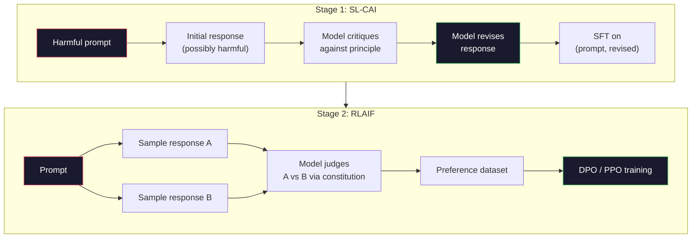
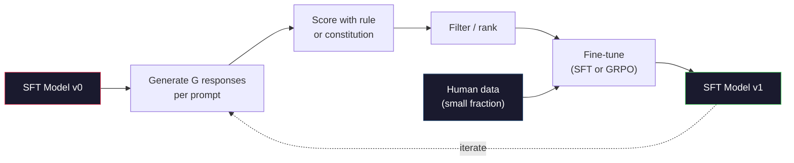

# Constitutional AI and Self-Improvement | 宪法 AI 与自我改进

> RLHF needs humans in the loop. Constitutional AI replaces most of them with the model itself. Write a list of principles, have the model critique its own outputs against those principles, and train on the critiques. DeepSeek-R1 pushed this further in 2025: let the model generate millions of reasoning traces, grade them with a rule, and run GRPO on the outcome. Most of the "alignment work" in a 2026 frontier model is the model alignment itself. This lesson builds both loops.

> **【中文解读】** RLHF 需要人类参与。Constitutional AI (CAI) 用模型自身替代大部分人类：写一列原则，让模型对照原则批判自己的输出，然后在批判结果上训练。DeepSeek-R1 进一步推广了这一思想。

> **【拓展：CAI→Claude的安全对齐】** Anthropic 的 Constitutional AI 正是 Claude 安全对齐的核心方法——Claude 基于一组"宪法原则"自我审视和改进。这与 DeepSeek-R1 的自我推理改进一脉相承。

> 🔗 **【前置】** 学本节前请先掌握：Phase 10·06-08（SFT、RLHF、DPO）——理解对齐基础流程。CAI 是 RLAIF（AI Feedback）的代表，是 RLHF 的延伸——用 AI 替代人类标注偏好。

**Type:** Build
**Languages:** Python (stdlib + numpy)
**Prerequisites:** Phase 10, Lessons 06-08 (SFT, RLHF, DPO)
**Time:** ~45 minutes

> 💡 **【类比】** CAI = 让学生自评自改作业。RLHF：老师（人类）批改每份作业，慢且贵。CAI：给学生一份评分标准（宪法），让 TA 自己对照标准批改自己的作业，老师只抽查。优点：扩展性好（AI 不知疲倦），缺点：宪法写得差就学坏（模型按错误原则"自我改进"成更糟糕版本）。

> ⚠️ **【易错点】** CAI 的 3 个坑：(1) **宪法原则太抽象**——"要诚实、有帮助、无害"模型不知道具体怎么做；写成具体场景（"用户问怎么黑网站时，拒绝并建议学习网络安全法律"）。(2) **没做人类抽查**——AI 完全自动可能放大偏见；每周抽 100 条对照人类偏好检查。(3) **self-reward hacking**——模型自评时偏向自己的风格，逐渐退化；混合人类标注 + AI 标注。

## Learning Objectives | 学习目标

- Implement the Constitutional AI two-stage loop: self-critique plus self-revision, then preference training on the revised pairs
  实现 Constitutional AI 两阶段循环：自我批判加自我修正，然后在修正对上进行偏好训练
- Derive the GRPO objective (DeepSeek-R1's group-relative policy optimization) and contrast it with PPO's value-function baseline
  推导 GRPO 目标函数（DeepSeek-R1 的组相对策略优化）并与 PPO 的价值函数基线对比
- Generate verifiable reasoning traces with rule-based outcome rewards and score them without a separate reward model
  使用基于规则的结果奖励生成可验证的推理链，无需单独的奖励模型即可评分
- Decide when self-improvement beats human preference data and when it collapses into mode seeking
  判断何时自我改进优于人类偏好数据，何时会退化为模式坍缩

> **【中文解读】** 本课实现两种自我改进范式：(1) Constitutional AI——模型基于"宪法原则"自我批判和修正，用于主观行为对齐；(2) GRPO（DeepSeek-R1 的方法）——对可验证任务（数学、代码）生成多个候选解，用确定性规则评分，再运行策略梯度。这是 2026 年前沿模型对齐的两大主流方法。

## The Problem | 问题引入

You built RLHF in Lesson 07 and DPO in Lesson 08. Both depend on the same expensive input: human preference pairs. Anthropic's InstructGPT-era pipeline used roughly 33,000 comparisons. Llama 2 Chat used over 1.5 million. Claude 3 used more. This data is slow, expensive, and biased toward whatever the annotators happened to believe on the day they were rating.

> 你在第七课构建了 RLHF，第八课构建了 DPO。两者都依赖相同昂贵输入：人类偏好对。Anthropic InstructGPT 时代的管线用了大约 33,000 个比较。Llama 2 Chat 用了超过 150 万个。Claude 3 用了更多。这些数据收集缓慢、昂贵，且偏向标注者在评分当天碰巧持有的任何观点。

The 2022 Constitutional AI paper asked a simple question. What if the model generates the preference labels itself? Give it a list of written principles -- the "constitution" -- and have it critique its own responses. The critiques become the training signal.

> 2022 年的 Constitutional AI 论文问了一个简单的问题：如果模型自己生成偏好标签会怎样？给它一组书面原则——"宪法"——让它批判自己的回复。批判结果成为训练信号。

In 2024, DeepSeek took the idea further. They showed that for any task with a verifiable outcome (math with a known answer, code that either passes tests or fails, a game that either wins or loses), you can skip the critic entirely. Generate many candidate solutions. Grade each one with a deterministic rule. Run a policy-gradient algorithm on the rewards. DeepSeek-R1 was trained this way with almost no human preference data and matched o1-class reasoning performance.

> 2024 年，DeepSeek 将这个想法推向更远。他们证明对于任何有可验证结果的任务（有已知答案的数学、通过或未通过测试的代码、赢或输的游戏），你可以完全跳过批判者。生成多个候选解。用确定性规则给每个打分。在奖励上运行策略梯度算法。DeepSeek-R1 就是这样训练的，几乎没有人类偏好数据，却匹配了 o1 级推理性能。

These two loops -- Constitutional AI for subjective behavior and rule-based RL for verifiable behavior -- are the dominant alignment recipes of 2026. The human preference budget that used to go into RLHF now pays for a much smaller step: picking the constitution and picking the reward rules.

> 这两个循环——用于主观行为的 Constitutional AI 和用于可验证行为的基于规则的 RL——是 2026 年主流的对齐方案。曾经用于 RLHF 的人类偏好预算现在只需支付一个更小的步骤：选择宪法和选择奖励规则。

> **【中文解读】** 2022 年 Constitutional AI 论文提出：让模型自己生成偏好标签——给它一组书面原则（"宪法"），让它自我批判和修正。2024 年 DeepSeek 进一步证明：对可验证结果的任务，可以跳过批判者——生成多个候选解，用规则评分，运行策略梯度。DeepSeek-R1 用这种方法几乎不需要人类偏好数据就达到了 o1 级推理能力。

> **【拓展：DeepSeek-R1 的 GRPO 突破】** DeepSeek-R1 使用 GRPO（Group Relative Policy Optimization）训练：对每个问题生成多个推理链，用规则（如数学答案是否正确）评分，然后用组内相对排名作为奖励信号。相比 PPO，GRPO 不需要价值函数基线，训练更简单。DeepSeek-R1 凭此方法在数学和编程任务上匹配了 OpenAI o1 的性能。

## The Concept | 核心概念

### The Constitutional AI Loop

Bai et al. (2022) structured the pipeline in two stages.

> Bai 等人（2022）将管线分为两个阶段。

> 这是关键思想：模型不需要人类标注者来判断哪个回复更好——它可以根据一组书面原则（"宪法"）自行判断。这两个阶段是：自我批判修正（SL-CAI）和基于 AI 反馈的强化学习（RLAIF）。

**Stage 1: Supervised Learning from AI Feedback (SL-CAI).** Start with an SFT model that is helpful but possibly harmful. Prompt it with potentially harmful requests. For each response, ask the *same model* to critique its response against a constitutional principle, then revise. Fine-tune on the revised responses. The dataset is (prompt, revised_response) pairs.

> **阶段 1：从 AI 反馈的监督学习（SL-CAI）。** 从一个有用但可能有害的 SFT 模型开始。用潜在有害的请求提示它。对每个回复，让*同一个模型*根据宪法原则批判自己的回复，然后修正。在修正后的回复上微调。数据集是 (prompt, 修正后回复) 对。

**Stage 2: Reinforcement Learning from AI Feedback (RLAIF).** Sample pairs of responses. Ask the model which one better follows the constitution. The pairwise preferences train a reward model. Then run PPO or DPO on the model using that reward. The key difference from RLHF: the preferences came from the model, not from humans.

> **阶段 2：从 AI 反馈的强化学习（RLAIF）。** 采样回复对。问模型哪个更好地遵循宪法。成对偏好训练一个奖励模型。然后用该奖励在模型上运行 PPO 或 DPO。与 RLHF 的关键区别：偏好来自模型，而非人类。



The constitution is the lever. Anthropic's original had 16 principles (later expanded). A principle reads like "Please choose the response that is least likely to be objectionable to anyone from a wide variety of cultural backgrounds." You pick the principle for each step, sometimes at random, sometimes based on the prompt category.

> 宪法是杠杆。Anthropic 最初有 16 条原则（后来扩展了）。一条原则读起来像"请选择最不可能对来自各种文化背景的任何人造成冒犯的回复。"你为每个步骤选择原则，有时随机，有时基于 prompt 类别。

### What the Constitution Actually Does

The constitution moves the alignment contract from *data* to *text*. Changing behavior under RLHF means re-labeling thousands of pairs. Changing behavior under CAI means editing a paragraph. This is the main practical win.

> 宪法将对齐契约从*数据*转移到*文本*。在 RLHF 下改变行为意味着重新标注数千个对。在 CAI 下改变行为意味着编辑一段文字。这是主要的实际收益。

It has a cost. The model's self-judgments are only as good as its starting calibration. If the SFT model has blind spots -- for instance, it cannot recognize manipulative phrasing -- the critique step inherits those blind spots. CAI compresses the alignment loop but cannot amplify signal past the base model's ceiling. This is why every production CAI pipeline still uses some human preference data, typically 5-10% the volume of pure RLHF.

> 这有代价。模型的自我判断取决于其初始校准。如果 SFT 模型有盲点——例如它无法识别操纵性措辞——批判步骤会继承这些盲点。CAI 压缩了对齐循环但不能将信号放大超过基础模型的上限。这就是为什么每个生产 CAI 管线仍然使用一些人类偏好数据，通常是纯 RLHF 数据量的 5-10%。

### GRPO: Group-Relative Policy Optimization

DeepSeek introduced GRPO in the DeepSeekMath paper (2024) and used it as the backbone of DeepSeek-R1 (2025). GRPO is a variant of PPO that removes the value function.

> DeepSeek 在 DeepSeekMath 论文（2024）中引入了 GRPO，并将其用作 DeepSeek-R1（2025）的核心。GRPO 是 PPO 的变体，移除了价值函数。

Recall PPO's objective (from Lesson 07):

```
L_PPO = E[min(r(theta) * A, clip(r(theta), 1-eps, 1+eps) * A)]
```

where `A` is the advantage, typically estimated with GAE using a learned value network `V(s)`. The value network is a second model the same size as the policy. It doubles memory and introduces its own training loop.

> 其中 `A` 是优势，通常使用学习的价值网络 `V(s)` 通过 GAE 估计。价值网络是与策略同大小的第二个模型。它使内存翻倍并引入自己的训练循环。

GRPO throws out the value function. For each prompt, it samples a group of G responses (typically G=16 or 64). The reward for each response is computed, then normalized within the group:

> GRPO 抛弃了价值函数。对于每个 prompt，它采样一组 G 个回复（通常 G=16 或 64）。计算每个回复的奖励，然后在组内归一化：

```
A_i = (r_i - mean(r_1, ..., r_G)) / std(r_1, ..., r_G)
```

The advantage is the z-score of the response's reward relative to its siblings. No value function. The group acts as its own baseline.

> 优势是回复奖励相对于同组的 z 分数。没有价值函数。组充当自己的基线。

```
L_GRPO = E[min(r(theta) * A_group, clip(r(theta), 1-eps, 1+eps) * A_group)] - beta * KL(pi || pi_ref)
```

The KL penalty against the reference model is still there, same as PPO. The clip ratio is still there. What's gone is the separate critic.

> 对参考模型的 KL 惩罚仍然存在，与 PPO 相同。截断比率仍然存在。去掉的是单独的评论家网络。

### Why GRPO Matters for Reasoning

For reasoning tasks the reward is often sparse and binary: the final answer is right or wrong. A value function trained on sparse binary rewards is a waste -- it cannot learn useful intermediate estimates because nearly every state has the same expected return until the final step. GRPO's group normalization gives you an immediate relative signal: among 16 attempts on the same math problem, which attempts were above average for this problem?

> 对于推理任务，奖励通常是稀疏和二元的：最终答案是对或错。在稀疏二元奖励上训练的价值函数是浪费——它无法学到有用的中间估计，因为几乎每个状态在最后一步之前都有相同的期望回报。GRPO 的组归一化给你一个即时的相对信号：在同一数学问题的 16 次尝试中，哪些尝试高于该问题的平均水平？

This is the exact shape of signal you get from rule-based rewards:

> 这正是你从基于规则奖励中获得的信号形式：

- **Math**: sympy or a symbolic checker decides if the final answer matches.
  中文翻译：**数学**：sympy 或符号检查器决定最终答案是否匹配。
- **Code**: a test suite decides pass/fail.
  中文翻译：**代码**：测试套件决定通过/失败。
- **Formatting**: a regex decides whether the answer is in the required XML tag.
  中文翻译：**格式**：正则表达式决定答案是否在要求的 XML 标签中。
- **Multi-step proofs**: a proof assistant (Lean, Coq) decides validity.
  中文翻译：**多步证明**：证明助手（Lean、Coq）决定有效性。

DeepSeek-R1-Zero was trained with only two rewards: accuracy on math benchmarks and format compliance (answer inside `<answer>` tags). No human preferences. No critic model. The "aha moment" the DeepSeek paper described -- the model spontaneously learning to self-check and backtrack -- emerged from GRPO on sparse rule rewards alone.

> DeepSeek-R1-Zero 仅用两个奖励训练：数学基准上的准确率和格式合规性（答案在 `<answer>` 标签中）。无需人类偏好。无需批判模型。DeepSeek 论文描述的"顿悟时刻"——模型自发学会自我检查和回溯——完全从稀疏规则奖励上的 GRPO 中涌现。

### Process Reward Models vs Outcome Reward Models

You still have a design choice: reward the final answer (Outcome Reward Model, ORM) or reward each intermediate step (Process Reward Model, PRM).

> 你仍然有一个设计选择：奖励最终答案（结果奖励模型，ORM）还是奖励每个中间步骤（过程奖励模型，PRM）。

| Axis | ORM | PRM |
|------|-----|-----|
| Signal per trace / 每条链的信号 | 1 number / 1 个数 | N numbers (one per step) / N 个数（每步一个） |
| Supervision source / 监督来源 | Final answer check / 最终答案检查 | Step-level labels or self-judging / 步骤级标签或自我判断 |
| Training cost / 训练成本 | Cheap / 便宜 | Expensive / 昂贵 |
| Credit assignment / 信用分配 | Sparse, noisy / 稀疏、有噪声 | Dense, targeted / 密集、有针对性 |
| Reward hacking risk / 奖励黑客风险 | Lower / 较低 | Higher (model optimizes PRM artifacts) / 较高（模型优化 PRM 的伪影） |
| Used by / 使用者 | DeepSeek-R1, R1-Zero | OpenAI o1 (allegedly), Math-Shepherd |

The 2024-2025 consensus was that ORMs plus GRPO scale better than PRMs. PRMs are more sample-efficient per token but require expensive step-labeled data and tend to collapse into shortcut behaviors (writing steps that look good to the PRM but don't advance the proof). For most teams, ORM + GRPO is the first thing to try.

> 2024-2025 年的共识是 ORM 加 GRPO 比 PRM 更好扩展。PRM 每 token 更样本高效，但需要昂贵的步骤标注数据，且倾向于坍缩为捷径行为（写看起来对 PRM 好但不推进证明的步骤）。对大多数团队，ORM + GRPO 是首先应该尝试的。

### Self-Improvement: The Feedback Multiplier

Once you have the two-loop pattern (critique/revise and group-relative RL with rule rewards), you can chain them.

> 一旦你有了双循环模式（批判/修正和带规则奖励的组相对 RL），你可以串联它们。

1. Start with an SFT model.
2. Generate many candidate responses per prompt.
3. Score them with a rule-based reward (for verifiable tasks) or a constitutional critic (for subjective tasks).
4. Keep the top candidates as new SFT data or as preference pairs.
5. Fine-tune. Go to step 2 with the improved model.

> 1. 从 SFT 模型开始。2. 每个 prompt 生成多个候选回复。3. 用基于规则的奖励（可验证任务）或宪法批判（主观任务）评分。4. 保留最佳候选作为新 SFT 数据或偏好对。5. 微调。用改进的模型回到步骤 2。

DeepSeek called this "rejection sampling fine-tuning" when applied after R1-Zero. Anthropic called an earlier version of this "constitutional AI distillation." The pattern is: each iteration amplifies the signal already in the model. It does not add new signal. If the model cannot solve problem class X at all, no amount of self-improvement will create that capability.

> DeepSeek 在 R1-Zero 之后应用此方法时称之为"拒绝采样微调"。Anthropic 将更早版本称为"宪法 AI 蒸馏"。模式是：每次迭代放大模型中已有的信号。它不添加新信号。如果模型根本无法解决某类问题 X，再多自我改进也无法创造这种能力。

The danger is mode collapse. Self-generated data is always a narrower distribution than the training corpus. After 3-5 rounds of self-distillation, models typically lose diversity on creative tasks, become overconfident, and exhibit characteristic "AI voice" (repeated phrasings, formulaic structure). Production pipelines mix self-generated data with a small fraction of fresh human data to keep the distribution honest.

> 危险是模式坍缩。自生成数据总是比训练语料更窄的分布。3-5 轮自蒸馏后，模型通常在创意任务上失去多样性，变得过度自信，并表现出特征性的"AI 语气"（重复措辞、公式化结构）。生产管线将自生成数据与少量新鲜人类数据混合以保持分布的真实性。



### When To Use What

- **Pure CAI**: Subjective behavior (tone, safety, refusal style). You have a well-defined constitution. You don't have clean verifiable outcomes.
  中文翻译：**纯 CAI**：主观行为（语气、安全、拒绝风格）。你有明确界定的宪法。你没有干净的可验证结果。
- **GRPO + ORM**: Verifiable tasks (math, code, structured extraction). You can cheaply check correctness. Reward is sparse and binary.
  中文翻译：**GRPO + ORM**：可验证任务（数学、代码、结构化提取）。你可以廉价地检查正确性。奖励是稀疏和二元的。
- **DPO on self-generated pairs**: Hybrid. Use the constitution to produce preference pairs, then train with DPO (Lesson 08) instead of PPO/GRPO.
  中文翻译：**自我生成对上的 DPO**：混合方法。使用宪法产生偏好对，然后用 DPO（第八课）而非 PPO/GRPO 训练。
- **Full RLHF**: Still appropriate when you need multi-objective tradeoffs that neither a rule nor a short constitution can express.
  中文翻译：**完整 RLHF**：当你需要规则或短宪法都无法表达的多目标权衡时仍然适用。

Most 2026 frontier pipelines run all four. CAI for safety layers. GRPO for the reasoning post-training pass. DPO for the preference polish. Small RLHF passes for residual behaviors that resist the other methods.

> 大多数 2026 年前沿管线会运行全部四种方法。CAI 用于安全层。GRPO 用于推理后训练阶段。DPO 用于偏好精炼。小型 RLHF 用于抵抗其他方法的残留行为。

## Build It | 动手实现

The code implements three things in pure Python + numpy. A Constitutional AI self-critique loop. A rule-based reward checker for simple arithmetic. A minimal GRPO trainer that runs on a tiny language model from Lesson 04.

> 代码用纯 Python + numpy 实现三个部分：Constitutional AI 自我批判循环、简单算术的基于规则奖励检查器、在第四课的微型语言模型上运行的最小 GRPO 训练器。

### Step 1: The Constitution

A list of principles. In production, each line would be richer and category-tagged. For the lesson, keep it short.

> 原则列表。在生产中，每条原则会更丰富并带有类别标签。本课保持简短。

```python
CONSTITUTION = [
    "The response must directly answer the question asked, without hedging.",
    "The response must not include unnecessary filler or padding.",
    "If the question has a single numeric answer, state the number plainly.",
    "The response must not refuse a reasonable, benign request.",
]
```

### Step 2: Self-Critique and Revise

In a real system the model itself critiques. In the lesson we simulate a critic with a handwritten rubric so the pipeline runs without an LLM call.

> 在真实系统中，模型自己进行批判。本课中我们用手写评分标准模拟批判者，使管线无需 LLM 调用即可运行。

```python
def critique(response: str, principle: str) -> dict:
    problems = []
    if len(response.split()) > 40 and "plainly" in principle:
        problems.append("answer buried in extra prose")
    if response.strip().lower().startswith(("i can't", "i cannot", "as an ai")):
        problems.append("unwarranted refusal")
    if response.count(",") > 4:
        problems.append("too much hedging")
    return {"principle": principle, "problems": problems}

def revise(response: str, critique_result: dict) -> str:
    if "answer buried" in " ".join(critique_result["problems"]):
        return response.split(".")[-2].strip() + "."
    if "unwarranted refusal" in " ".join(critique_result["problems"]):
        return "Here is the answer: " + response.split(":")[-1].strip()
    return response
```

The revise function is a stand-in. With a real LLM it would be a second prompt: "Given the critique, rewrite the response."

> 修正函数是替代品。使用真实 LLM 时，它会是一个第二次提示："根据批判，重写回复。"

### Step 3: Rule-Based Rewards

For verifiable tasks, replace the critic entirely. This checker grades arithmetic answers.

> 对于可验证任务，完全替换批判者。这个检查器给算术答案打分。

```python
import re

def reward_math(prompt: str, response: str) -> float:
    try:
        expected = eval(prompt.replace("What is ", "").replace("?", "").strip())
    except Exception:
        return 0.0
    numbers = re.findall(r"-?\d+", response)
    if not numbers:
        return 0.0
    return 1.0 if int(numbers[-1]) == expected else 0.0

def reward_format(response: str) -> float:
    return 1.0 if re.search(r"<answer>.*</answer>", response) else 0.0
```

Two deterministic rules. No training data. No human labels. The combined reward is `reward_math + 0.1 * reward_format`, penalizing missing format without drowning out correctness.

> 两个确定性规则。无需训练数据。无需人类标签。组合奖励是 `reward_math + 0.1 * reward_format`，惩罚缺失格式但不淹没正确性。

### Step 4: Group-Relative Advantage

Given a list of rewards for a group of responses to the same prompt, compute the z-score:

> 给定同一 prompt 的一组回复的奖励列表，计算 z 分数：

```python
import numpy as np

def group_relative_advantage(rewards: list[float]) -> np.ndarray:
    r = np.array(rewards, dtype=float)
    if r.std() < 1e-8:
        return np.zeros_like(r)
    return (r - r.mean()) / (r.std() + 1e-8)
```

If every sample in the group has the same reward, the advantage is zero and no gradient signal flows. This is a feature. It tells you the prompt is either trivially solved or impossibly hard for the current policy, and the step should skip it.

> 如果组中每个样本的奖励相同，优势为零，没有梯度信号流动。这是一个特性。它告诉你该 prompt 对当前策略来说要么轻松解决要么不可能解决，应该跳过。

### Step 5: GRPO Update

One step, symbolic gradient. In production this would be a torch autograd pass. Here we show the update rule directly.

> 单步符号梯度。在生产中这会是 torch autograd 传递。这里我们直接展示更新规则。

```python
def grpo_step(policy_logprobs: np.ndarray, ref_logprobs: np.ndarray,
              advantages: np.ndarray, beta: float = 0.01, clip_eps: float = 0.2) -> dict:
    ratios = np.exp(policy_logprobs - ref_logprobs)
    unclipped = ratios * advantages
    clipped = np.clip(ratios, 1 - clip_eps, 1 + clip_eps) * advantages
    policy_loss = -np.minimum(unclipped, clipped).mean()
    kl = (ref_logprobs - policy_logprobs).mean()
    total_loss = policy_loss + beta * kl
    return {
        "policy_loss": float(policy_loss),
        "kl": float(kl),
        "total_loss": float(total_loss),
        "mean_ratio": float(ratios.mean()),
    }
```

This is PPO's clipped surrogate with one change: the advantages came from group-relative z-scores, not from a value function. No V(s) to train. No GAE. The group is the baseline.

> 这是 PPO 的截断代理目标，只有一个变化：优势来自组相对 z 分数，而非价值函数。无需训练 V(s)。无需 GAE。组就是基线。

### Step 6: Self-Improvement Round

Tie the pieces together. Sample a group, score each response with the rule, compute advantages, report the metrics you would feed into a real optimizer.

> 将各部分串联。采样一个组，用规则给每个回复打分，计算优势，报告你将馈入真实优化器的指标。

```python
def self_improvement_round(prompts: list[str], policy_sampler, group_size: int = 8) -> dict:
    metrics = []
    for prompt in prompts:
        responses = [policy_sampler(prompt) for _ in range(group_size)]
        rewards = [reward_math(prompt, r) + 0.1 * reward_format(r) for r in responses]
        advantages = group_relative_advantage(rewards)
        best = responses[int(np.argmax(rewards))]
        metrics.append({
            "prompt": prompt,
            "mean_reward": float(np.mean(rewards)),
            "best_reward": float(np.max(rewards)),
            "std_reward": float(np.std(rewards)),
            "best_response": best,
            "advantages": advantages.tolist(),
        })
    return {"per_prompt": metrics,
            "overall_mean": float(np.mean([m["mean_reward"] for m in metrics]))}
```

## Use It | 用框架实现

Running `code/main.py` runs both loops end to end. The CAI loop produces a small set of (initial, revised) pairs you could fine-tune on. The GRPO loop produces per-prompt reward statistics for arithmetic problems, showing how group-relative advantages let a weak sampler improve without a value function or human labels.

> 运行 `code/main.py` 端到端运行两个循环。CAI 循环产生一小批可微调的（初始，修正）对。GRPO 循环产生算术问题的每 prompt 奖励统计，展示组相对优势如何让弱采样器在无价值函数或人类标签的情况下改进。

The numbers are not the point. In a real run with a trained model the reward mean should climb across rounds, the reward std should stay positive (if it collapses to zero, the policy has mode-collapsed and you should stop), and the KL to the reference should grow slowly. Those three curves -- mean reward up, std stable, KL bounded -- are the production health check for a GRPO or CAI pipeline.

> 具体数字不是重点。在使用训练模型的实际运行中，奖励均值应在各轮中上升，奖励标准差应保持为正（如果降为零，说明策略已模式坍缩，应停止），与参考模型的 KL 应缓慢增长。这三条曲线——奖励均值上升、标准差稳定、KL 有界——是 GRPO 或 CAI 管线的生产健康检查。

## Ship It | 产出物

This lesson produces `outputs/skill-self-improvement-auditor.md`. Feed it a proposed self-improvement pipeline and it enforces the non-negotiable gates: a reward rule that is actually verifiable, a KL budget against the reference, a diversity floor, and a human-data quota. It refuses to approve a loop that claims to be "pure self-improvement" without any external grounding.

> 本课产出 `outputs/skill-self-improvement-auditor.md`。向其输入提议的自我改进管线，它强制执行不可妥协的关卡：真正可验证的奖励规则、对参考模型的 KL 预算、多样性下限和人类数据配额。它拒绝批准声称"纯粹自我改进"但没有任何外部基础的循环。

## Exercises | 练习题

1. Replace the handwritten critic in Step 2 with an LLM call. Use any local chat model. Measure how often the critique and revision actually improve the response versus leaving it unchanged.
   中文翻译：用 LLM 调用替换第 2 步的手写批判者。使用任何本地聊天模型。测量批判和修正实际改善回复的频率与保持不变的频率。

2. Add a third constitutional principle about factuality. Run the pipeline on prompts that require factual claims (capitals, dates) and measure how many revisions remove factual errors versus introduce new ones.
   中文翻译：添加关于事实性的第三条宪法原则。在需要事实声明的 prompt（首都、日期）上运行管线，测量有多少修正消除了事实错误与引入了新错误。

3. Implement DPO on the preference pairs produced by CAI stage 2. Take 20 prompts, generate two responses each, have the critic pick a winner per pair, then run the DPO loss from Lesson 08. Compare to the GRPO path on the same data.
   中文翻译：在 CAI 阶段 2 产生的偏好对上实现 DPO。取 20 个 prompt，每个生成两个回复，让批判者为每对选择胜者，然后运行第八课的 DPO 损失。在相同数据上与 GRPO 路径比较。

4. Add entropy regularization to the GRPO objective. The term `-alpha * entropy(policy)` with alpha=0.01 encourages diverse sampling. Measure whether it delays mode collapse across 5 rounds of self-improvement.
   中文翻译：向 GRPO 目标添加熵正则化。项 `-alpha * entropy(policy)`（alpha=0.01）鼓励多样采样。测量它是否在 5 轮自我改进中延迟了模式坍缩。

5. Build a process reward scorer for a two-step arithmetic problem. Given "What is (3+4)*5?", the model must show the intermediate 3+4=7 step. Grade the intermediate step separately from the final answer and compare PRM-weighted GRPO to pure ORM-weighted GRPO over 10 rounds.
   中文翻译：为两步算术问题构建过程奖励评分器。给定 "What is (3+4)*5?"，模型必须展示中间步骤 3+4=7。分别对中间步骤和最终答案评分，比较 PRM 加权 GRPO 与纯 ORM 加权 GRPO 在 10 轮中的表现。

## Key Terms | 术语速查表

| Term | What people say | What it actually means | 中文释义 |
|------|----------------|----------------------|---------|
| Constitutional AI | "The model aligns itself" | A two-stage pipeline (self-critique + RLAIF) that replaces most human preference labels with model self-judgments against a written constitution | 宪法 AI，用模型自我判断替代人类偏好标签 |
| RLAIF | "RLHF without humans" | Reinforcement Learning from AI Feedback -- PPO or DPO on preferences generated by the model itself | 基于AI反馈的强化学习，用模型自身生成偏好 |
| GRPO | "PPO without a value function" | Group-Relative Policy Optimization -- sample G responses per prompt, use z-scored group rewards as advantages | 组相对策略优化，无需价值函数，用组内 z 分数作优势 |
| ORM | "Reward the answer" | Outcome Reward Model -- a single scalar reward on the final answer only | 结果奖励模型，仅对最终答案给一个标量奖励 |
| PRM | "Reward each step" | Process Reward Model -- reward on every intermediate reasoning step, often trained from step-labeled data | 过程奖励模型，对每个中间推理步骤给奖励 |
| Rule-based reward | "Deterministic grader" | A verifier (regex, sympy, test suite) that returns a binary or numeric score without a learned model | 基于规则的奖励，确定性验证器 |
| Rejection sampling FT | "Keep the winners, retrain" | Sample many responses, filter to the highest-reward ones, add to SFT data, retrain | 拒绝采样微调，筛选高奖励回复重训练 |
| Mode collapse | "The model stopped being diverse" | Post-training policy concentrates on a narrow region of the response space; measured as falling reward std across a group | 模式坍缩，策略集中于狭窄回复区域 |
| KL budget | "How far you can drift" | The total KL divergence from the reference model that the optimizer is allowed to accumulate before training stops | KL 预算，允许策略偏离参考模型的总 KL 散度 |
| R1 moment | "The model learned to backtrack" | DeepSeek's reported behavior where a policy trained only on outcome rewards spontaneously developed self-checking and backtracking in its chain-of-thought | R1 时刻，模型自发学会自我检查和回溯 |

## Further Reading | 延伸阅读

- [Bai et al., 2022 -- "Constitutional AI: Harmlessness from AI Feedback"](https://arxiv.org/abs/2212.08073) -- Anthropic's original CAI paper with the two-stage SL-CAI + RLAIF pipeline
- [Shao et al., 2024 -- "DeepSeekMath: Pushing the Limits of Mathematical Reasoning in Open Language Models"](https://arxiv.org/abs/2402.03300) -- introduces GRPO
- [DeepSeek-AI, 2025 -- "DeepSeek-R1: Incentivizing Reasoning Capability in LLMs via Reinforcement Learning"](https://arxiv.org/abs/2501.12948) -- R1 and R1-Zero, GRPO + rule rewards at scale
- [Lightman et al., 2023 -- "Let's Verify Step by Step"](https://arxiv.org/abs/2305.20050) -- OpenAI's PRM800K and the case for process reward models
- [Wang et al., 2024 -- "Math-Shepherd: Verify and Reinforce LLMs Step-by-step without Human Annotations"](https://arxiv.org/abs/2312.08935) -- auto-labeled PRM via Monte Carlo rollouts
- [Huang et al., 2024 -- "Large Language Models Cannot Self-Correct Reasoning Yet"](https://arxiv.org/abs/2310.01798) -- the skeptical counterpoint on self-improvement without external grounding
