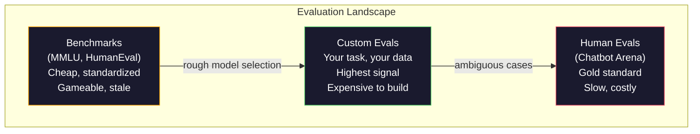
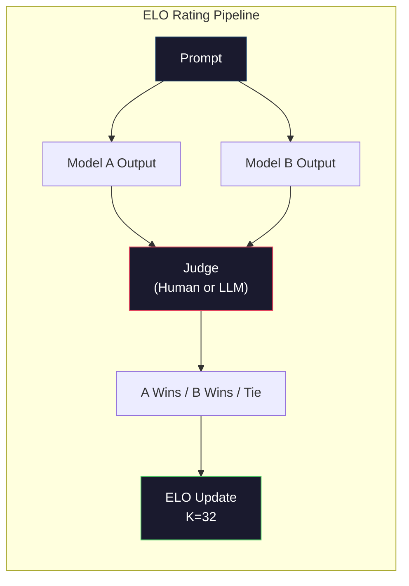

# Evaluation: Benchmarks, Evals, LM Harness | 评估：基准、评测、LM Harness

> Goodhart's Law: when a measure becomes a target, it ceases to be a good measure. Every frontier lab games benchmarks. MMLU scores go up while models still can't reliably count the number of R's in "strawberry." The only eval that matters is YOUR eval -- on YOUR task, with YOUR data.

> **【中文解读】** 古德哈特定律：当一个指标成为目标时，它就不再是一个好指标。前沿实验室刷榜，MMLU 分数上升但模型仍数不清"strawberry"里有几个 r。唯一重要的评测是你自己的任务评测。

> **【拓展：LLM评测→实际应用】** LLM 评测体系包括：MMLU（知识）、HumanEval（代码）、MATH（数学）、Arena（人类偏好）。但真实应用中最重要的是你自己的评测——在你自己的任务和数据上测试。

> 🔗 **【前置】** 学本节前请先掌握：Phase 10·01-05（LLM 基础）；Phase 11·10（Evaluation）——生产 LLM 应用的评估。本节聚焦模型本身的评估。

> 💡 **【类比】** 通用 benchmark = 全国高考（适合筛人，但和具体工作能力无关）。自家 eval = 公司面试题（精准对应你的需求）。选模型时高考分数（MMLU）只能初筛，最终要看面试（自家 eval）表现。Goodhart 定律警告：刷高考分数的学生不一定工作能力强。

**Type:** Build
**Languages:** Python
**Prerequisites:** Phase 10, Lessons 01-05 (LLMs from Scratch)
**Time:** ~90 minutes

## Learning Objectives | 学习目标

- Build a custom evaluation harness that runs multiple-choice and open-ended benchmarks against a language model
  构建自定义评测工具，对语言模型运行多选题和开放式基准测试
- Explain why standard benchmarks (MMLU, HumanEval) saturate and fail to differentiate frontier models
  解释为什么标准基准（MMLU、HumanEval）会饱和且无法区分前沿模型
- Implement task-specific evals with proper metrics: exact match, F1, BLEU, and LLM-as-judge scoring
  实现带正确指标的任务特定评测：精确匹配、F1、BLEU 和 LLM-as-judge 评分
- Design a custom evaluation suite targeting your specific use case rather than relying solely on public leaderboards
  设计针对特定用例的自定义评测套件，而非仅依赖公共排行榜

> **【中文解读】** 本课聚焦 LLM 评估的工程实践。核心观点：公共基准（MMLU、HumanEval）已被饱和，前沿模型的分数压缩在 3 分范围内，差异是统计噪声而非真实能力差距。唯一重要的是在你的任务、你的数据、你的失败模式下的评测。

## The Problem | 问题引入

MMLU was published in 2020 with 15,908 questions across 57 subjects. Within three years, frontier models saturated it. GPT-4 scored 86.4%. Claude 3 Opus scored 86.8%. Llama 3 405B scored 88.6%. The leaderboard compressed into a 3-point range where differences are statistical noise, not real capability gaps.

> MMLU 于 2020 年发布，包含 57 个学科的 15,908 个问题。三年内，前沿模型就饱和了它。GPT-4 得分 86.4%，Claude 3 Opus 得分 86.8%，Llama 3 405B 得分 88.6%。排行榜压缩到 3 分的范围内，差异是统计噪声，而非真正的能力差距。

Meanwhile, those same models fail at tasks that a 10-year-old handles without thinking. Claude 3.5 Sonnet, scoring 88.7% on MMLU, initially could not count the letters in "strawberry" -- a task that requires zero world knowledge and zero reasoning, just character-level iteration. HumanEval tests code generation with 164 problems. Models score 90%+ on it while still producing code that crashes on edge cases any junior developer would catch.

> 与此同时，这些模型在 10 岁孩子不假思索就能完成的任务上却失败了。Claude 3.5 Sonnet MMLU 得分 88.7%，但最初无法数出 "strawberry" 里有几个 r——这个任务不需要任何世界知识或推理，只需字符级迭代。HumanEval 用 164 个问题测试代码生成。模型得分 90%+，但仍然产出任何初级开发者都能捕获的边缘情况崩溃代码。

The gap between benchmark performance and real-world reliability is the central problem of LLM evaluation. Benchmarks tell you how a model performs on the benchmark. They tell you almost nothing about how that model will perform on your specific task, with your specific data, under your specific failure modes. If you are building a customer support bot, MMLU is irrelevant. If you are building a code assistant, HumanEval only covers function-level generation -- it says nothing about debugging, refactoring, or explaining code across files.

> 基准性能与真实世界可靠性之间的鸿沟是 LLM 评估的核心问题。基准告诉你模型在基准上的表现。它们几乎不说任何关于模型在你的具体任务、具体数据、具体失败模式下会如何表现的信息。如果你在构建客户支持机器人，MMLU 无关紧要。如果你在构建代码助手，HumanEval 只覆盖函数级生成——对调试、重构或跨文件代码解释一无所知。

You need custom evals. Not because benchmarks are useless -- they are useful for rough model selection -- but because the final evaluation must match your deployment conditions exactly.

> 你需要自定义评估。不是因为基准没用——它们对粗略模型选择有用——而是因为最终评估必须完全匹配你的部署条件。

> **【中文解读】** 基准分数与真实世界可靠性之间的鸿沟是 LLM 评估的核心问题。GPT-4 MMLU 86.4%、Claude 3 Opus 86.8%、Llama 3 405B 88.6%——3 分的差距是统计噪声。但这些模型在"数 strawberry 里有几个 r"这样的简单任务上仍然失败。基准告诉你模型在基准上的表现，几乎不说任何关于它在你的具体任务上会如何表现的信息。

> **【拓展：Arena 评测与 Elo 评分】** Chatbot Arena（LMSYS）使用盲测 Elo 评分——人类用户与两个匿名模型对话并投票选择更好的回复。这是目前公认最可靠的模型排名方式。GPT-4o、Claude 3.5 Sonnet、Gemini 1.5 Pro 在 Arena 上的 Elo 分数差距更真实地反映了实际使用体验。

## The Concept | 核心概念

### The Eval Landscape

There are three categories of evaluation, each with different cost and signal quality.

> 有三类评估，各有不同的成本和信号质量。

**Benchmarks** are standardized test suites. MMLU, HumanEval, SWE-bench, MATH, ARC, HellaSwag. You run a model against the benchmark and get a score. The advantage: everyone uses the same test, so you can compare models. The disadvantage: models and training data increasingly contaminate these benchmarks. Labs train on data that includes benchmark questions. Scores go up. Capability may not.

> **基准**是标准化测试套件。MMLU、HumanEval、SWE-bench、MATH、ARC、HellaSwag。你对基准运行模型并获得分数。优点：每个人都使用相同的测试，所以你可以比较模型。缺点：模型和训练数据越来越多地污染这些基准。实验室在包含基准问题的数据上训练。分数上升。能力未必。

**Custom evals** are test suites you build for your specific use case. You define the inputs, the expected outputs, and the scoring function. A legal document summarizer gets evaluated on legal documents. A SQL generator gets evaluated on your database schema. These are expensive to create but they are the only evaluation that predicts production performance.

> **自定义评估**是你为特定用例构建的测试套件。你定义输入、期望输出和评分函数。法律文档摘要器用法律文档评估。SQL 生成器用你的数据库模式评估。这些创建成本高，但它们是唯一能预测生产性能的评估。

**Human evals** use paid annotators to judge model outputs on criteria like helpfulness, correctness, fluency, and safety. The gold standard for open-ended tasks where automated scoring fails. Chatbot Arena has collected over 2 million human preference votes across 100+ models. The downside: cost ($0.10-$2.00 per judgment) and speed (hours to days).

> **人工评估**使用付费标注者根据有用性、正确性、流畅性和安全性等标准评判模型输出。这是自动化评分失败的开放式任务的黄金标准。Chatbot Arena 收集了超过 200 万个人类偏好投票，涵盖 100+ 个模型。缺点：成本（每次判断 $0.10-$2.00）和速度（数小时到数天）。



### Why Benchmarks Break

Three mechanisms cause benchmark scores to stop reflecting real capability.

> 三种机制导致基准分数不再反映真实能力。

**Data contamination.** Training corpora scrape the internet. Benchmark questions live on the internet. Models see the answers during training. This is not cheating in the traditional sense -- labs do not intentionally include benchmark data. But web-scale scraping makes it nearly impossible to exclude.

> **数据污染。** 训练语料从互联网抓取。基准问题存在于互联网。模型在训练时看到了答案。这不是传统意义上的作弊——实验室不会故意包含基准数据。但网络规模抓取使排除几乎不可能。

**Teaching to the test.** Labs optimize training mixtures for benchmark performance. If 5% of the training mix is MMLU-style multiple choice, the model learns the format and the answer distribution. MMLU is 4-way multiple choice. Models learn that the answer distribution is approximately uniform across A/B/C/D, which helps even when the model does not know the answer.

> **应试训练。** 实验室为基准性能优化训练混合。如果 5% 的训练混合是 MMLU 风格的多选题，模型就学会了格式和答案分布。MMLU 是四选一。模型学到答案分布大致均匀分布在 A/B/C/D，这甚至有助于模型不知道答案时猜测。

**Saturation.** When every frontier model scores 85-90% on a benchmark, the benchmark stops discriminating. The remaining 10-15% of questions may be ambiguous, mislabeled, or require obscure domain knowledge. Improving from 87% to 89% on MMLU may mean the model memorized two more obscure questions, not that it got smarter.

> **饱和。** 当前沿模型在基准上都得分 85-90% 时，基准不再有区分力。剩余 10-15% 的问题可能有歧义、标注错误或需要冷门领域知识。MMLU 从 87% 提升到 89% 可能意味着模型多记住了两个冷门问题，而不是变聪明了。

### Perplexity: A Quick Health Check

Perplexity measures how surprised a model is by a sequence of tokens. Formally, it is the exponentiated average negative log-likelihood:

> 困惑度衡量模型对 token 序列的惊讶程度。形式上，它是平均负对数似然的指数：

```
PPL = exp(-1/N * sum(log P(token_i | context)))
```

A perplexity of 10 means the model is, on average, as uncertain as choosing uniformly among 10 options at each token position. Lower is better. GPT-2 gets a perplexity of ~30 on WikiText-103. GPT-3 gets ~20. Llama 3 8B gets ~7.

> 困惑度 10 意味着模型平均来说在每个 token 位置的不确定性相当于在 10 个选项中均匀选择。越低越好。GPT-2 在 WikiText-103 上困惑度约 30。GPT-3 约 20。Llama 3 8B 约 7。

Perplexity is useful for comparing models on the same test set, but it has blind spots. A model can have low perplexity by being good at predicting common patterns while being terrible at rare but important patterns. It also says nothing about instruction following, reasoning, or factual accuracy. Use it as a sanity check, not a final verdict.

> 困惑度在相同测试集上比较模型时有用，但有盲点。模型可以通过擅长预测常见模式而获得低困惑度，但在罕见但重要的模式上可能很差。它也不能说明指令遵循、推理或事实准确性。把它当作健康检查，而非最终判决。

### LLM-as-Judge

Use a strong model to evaluate a weaker model's output. The idea is simple: ask GPT-4o or Claude Sonnet to rate a response on a 1-5 scale for correctness, helpfulness, and safety. This costs about $0.01 per judgment with GPT-4o-mini and correlates surprisingly well with human judgments -- around 80% agreement on most tasks.

> 用强模型评估弱模型的输出。想法很简单：让 GPT-4o 或 Claude Sonnet 在正确性、有用性和安全性上以 1-5 分评分。用 GPT-4o-mini 每次判断约 $0.01，与人类判断的相关性出奇地好——大多数任务上约 80% 一致性。

The scoring prompt matters more than the model. A vague prompt ("Rate this response") produces noisy scores. A structured prompt with a rubric ("Score 5 if the answer is factually correct and cites a source, 4 if correct but unsourced, 3 if partially correct...") produces consistent, reproducible scores.

> 评分 prompt 比模型更重要。模糊的 prompt（"给这个回复打分"）产生嘈杂的分数。带有评分标准的结构化 prompt（"如果答案事实正确且引用了来源打 5 分，正确但无来源打 4 分，部分正确打 3 分..."）产生一致、可复现的分数。

Failure modes: judge models exhibit position bias (prefer the first response in pairwise comparisons), verbosity bias (prefer longer responses), and self-preference (GPT-4 rates GPT-4 outputs higher than equivalent Claude outputs). Mitigations: randomize order, normalize for length, use a different judge than the model being evaluated.

> 失败模式：评审模型表现出位置偏见（在成对比较中偏好第一个回复）、冗长偏见（偏好更长的回复）和自我偏好（GPT-4 对 GPT-4 输出的评分高于等价的 Claude 输出）。缓解措施：随机化顺序、按长度归一化、使用与被评估模型不同的评审。

### ELO Ratings from Pairwise Comparisons

Chatbot Arena's approach. Show two responses to the same prompt from different models. A human (or LLM judge) picks the better one. From thousands of these comparisons, compute an ELO rating for each model -- the same system used in chess.

> Chatbot Arena 的方法。展示来自不同模型对同一 prompt 的两个回复。人类（或 LLM 评审）选择更好的。从数千次比较中计算每个模型的 ELO 评分——与象棋使用的系统相同。

ELO advantages: relative ranking is more reliable than absolute scoring, handles ties gracefully, and converges with fewer comparisons than scoring every output independently. As of early 2026, Chatbot Arena ranks show GPT-4o, Claude 3.5 Sonnet, and Gemini 1.5 Pro within 20 ELO points of each other at the top.

> ELO 优势：相对排名比绝对评分更可靠，优雅处理平局，收敛所需比较次数少于独立评分。截至 2026 年初，Chatbot Arena 排名显示 GPT-4o、Claude 3.5 Sonnet 和 Gemini 1.5 Pro 在顶部仅差 20 个 ELO 分。



### Eval Frameworks

**lm-evaluation-harness** (EleutherAI): the standard open-source eval framework. Supports 200+ benchmarks. Run any Hugging Face model against MMLU, HellaSwag, ARC, etc. with one command. Used by the Open LLM Leaderboard.

> **lm-evaluation-harness**（EleutherAI）：标准开源评测框架。支持 200+ 基准。一条命令对任何 Hugging Face 模型运行 MMLU、HellaSwag、ARC 等。Open LLM Leaderboard 使用。

**RAGAS**: evaluation framework specifically for RAG pipelines. Measures faithfulness (does the answer match the retrieved context?), relevance (is the retrieved context relevant to the question?), and answer correctness.

> **RAGAS**：专门用于 RAG 管线的评测框架。测量忠实度（答案是否匹配检索上下文？）、相关性（检索上下文是否与问题相关？）和答案正确性。

**promptfoo**: config-driven eval for prompt engineering. Define test cases in YAML, run against multiple models, get a pass/fail report. Useful for regression testing prompts -- make sure a prompt change does not break existing test cases.

> **promptfoo**：配置驱动的 prompt 工程评测。在 YAML 中定义测试用例，对多个模型运行，获得通过/失败报告。用于 prompt 回归测试——确保 prompt 更改不会破坏现有测试用例。

### Building Custom Evals

The only eval that matters for production. The process:

> 生产中唯一重要的评测。流程：

1. **Define the task.** What exactly should the model do? Be precise. "Answer questions" is too vague. "Given a customer complaint email, extract the product name, issue category, and sentiment" is a task you can evaluate.
   中文翻译：1. **定义任务。** 模型到底应该做什么？要精确。"回答问题"太模糊。"给定客户投诉邮件，提取产品名称、问题类别和情感"是可以评估的任务。

2. **Create test cases.** Minimum 50 for a prototype eval, 200+ for production. Each test case is an (input, expected_output) pair. Include edge cases: empty inputs, adversarial inputs, ambiguous inputs, inputs in other languages.
   中文翻译：2. **创建测试用例。** 原型评测最少 50 个，生产 200+。每个测试用例是 (输入, 期望输出) 对。包括边缘情况：空输入、对抗输入、有歧义的输入、其他语言的输入。

3. **Define scoring.** Exact match for structured outputs. BLEU/ROUGE for text similarity. LLM-as-judge for open-ended quality. F1 for extraction tasks. Combine multiple metrics with weights.
   中文翻译：3. **定义评分。** 结构化输出用精确匹配。文本相似度用 BLEU/ROUGE。开放式质量用 LLM-as-judge。抽取任务用 F1。组合多个指标并加权。

4. **Automate.** Every eval runs with one command. No manual steps. Store results in a format that enables comparison over time.
   中文翻译：4. **自动化。** 每个评测一条命令运行。无手动步骤。以可随时间比较的格式存储结果。

5. **Track over time.** An eval score is meaningless in isolation. You need the trendline. Did the score improve after the last prompt change? Did it regress after switching models? Version your eval alongside your prompts.
   中文翻译：5. **追踪趋势。** 评测分数孤立看无意义。你需要趋势线。上次 prompt 更改后分数提升了吗？切换模型后退步了吗？像版本化 prompt 一样版本化评测。

| Eval Type | Cost per judgment | Agreement with humans | Best for |
|-----------|------------------|----------------------|----------|
| Exact match / 精确匹配 | ~$0 | 100% (when applicable) / 100%（适用时） | Structured output, classification / 结构化输出、分类 |
| BLEU/ROUGE | ~$0 | ~60% | Translation, summarization / 翻译、摘要 |
| LLM-as-judge / LLM 评审 | ~$0.01 | ~80% | Open-ended generation / 开放式生成 |
| Human eval / 人工评估 | $0.10-$2.00 | N/A (is the ground truth) / N/A（即真实标准） | Ambiguous, high-stakes tasks / 有歧义、高风险任务 |

## Build It | 动手实现

### Step 1: A Minimal Eval Framework

Define the core abstractions. An eval case has an input, an expected output, and an optional metadata dict. A scorer takes a prediction and a reference and returns a score between 0 and 1.

> 定义核心抽象。评测用例有输入、期望输出和可选的元数据字典。评分器接受预测和参考并返回 0 到 1 之间的分数。

```python
import json
from collections import Counter

class EvalCase:
    def __init__(self, input_text, expected, metadata=None):
        self.input_text = input_text
        self.expected = expected
        self.metadata = metadata or {}

class EvalSuite:
    def __init__(self, name, cases, scorers):
        self.name = name
        self.cases = cases
        self.scorers = scorers

    def run(self, model_fn):
        results = []
        for case in self.cases:
            prediction = model_fn(case.input_text)
            scores = {}
            for scorer_name, scorer_fn in self.scorers.items():
                scores[scorer_name] = scorer_fn(prediction, case.expected)
            results.append({
                "input": case.input_text,
                "expected": case.expected,
                "prediction": prediction,
                "scores": scores,
            })
        return results
```

### Step 2: Scoring Functions

Build exact match, token F1, and a simulated LLM-as-judge scorer.

> 构建精确匹配、token F1 和模拟的 LLM-as-judge 评分器。

```python
def exact_match(prediction, expected):
    return 1.0 if prediction.strip().lower() == expected.strip().lower() else 0.0

def token_f1(prediction, expected):
    pred_tokens = set(prediction.lower().split())
    exp_tokens = set(expected.lower().split())
    if not pred_tokens or not exp_tokens:
        return 0.0
    common = pred_tokens & exp_tokens
    precision = len(common) / len(pred_tokens)
    recall = len(common) / len(exp_tokens)
    if precision + recall == 0:
        return 0.0
    return 2 * (precision * recall) / (precision + recall)

def llm_judge_simulated(prediction, expected):
    pred_words = set(prediction.lower().split())
    exp_words = set(expected.lower().split())
    if not exp_words:
        return 0.0
    overlap = len(pred_words & exp_words) / len(exp_words)
    length_penalty = min(1.0, len(prediction) / max(len(expected), 1))
    return round(overlap * 0.7 + length_penalty * 0.3, 3)
```

### Step 3: ELO Rating System

Implement pairwise comparisons with ELO updates. This is exactly the system Chatbot Arena uses to rank models.

> 实现带 ELO 更新的成对比较。这正是 Chatbot Arena 用来排名模型的系统。

```python
class ELOTracker:
    def __init__(self, k=32, initial_rating=1500):
        self.ratings = {}
        self.k = k
        self.initial_rating = initial_rating
        self.history = []

    def _ensure_player(self, name):
        if name not in self.ratings:
            self.ratings[name] = self.initial_rating

    def expected_score(self, rating_a, rating_b):
        return 1 / (1 + 10 ** ((rating_b - rating_a) / 400))

    def record_match(self, player_a, player_b, outcome):
        self._ensure_player(player_a)
        self._ensure_player(player_b)

        ea = self.expected_score(self.ratings[player_a], self.ratings[player_b])
        eb = 1 - ea

        if outcome == "a":
            sa, sb = 1.0, 0.0
        elif outcome == "b":
            sa, sb = 0.0, 1.0
        else:
            sa, sb = 0.5, 0.5

        self.ratings[player_a] += self.k * (sa - ea)
        self.ratings[player_b] += self.k * (sb - eb)

        self.history.append({
            "a": player_a, "b": player_b,
            "outcome": outcome,
            "rating_a": round(self.ratings[player_a], 1),
            "rating_b": round(self.ratings[player_b], 1),
        })

    def leaderboard(self):
        return sorted(self.ratings.items(), key=lambda x: -x[1])
```

### Step 4: Perplexity Calculation

Compute perplexity using token probabilities. In practice you would get these from the model's logits. Here we simulate with a probability distribution.

> 使用 token 概率计算困惑度。实践中你从模型的 logits 获取这些值。这里我们用概率分布模拟。

```python
import numpy as np

def perplexity(log_probs):
    if not log_probs:
        return float("inf")
    avg_neg_log_prob = -np.mean(log_probs)
    return float(np.exp(avg_neg_log_prob))

def token_log_probs_simulated(text, model_quality=0.8):
    np.random.seed(hash(text) % 2**31)
    tokens = text.split()
    log_probs = []
    for i, token in enumerate(tokens):
        base_prob = model_quality
        if len(token) > 8:
            base_prob *= 0.6
        if i == 0:
            base_prob *= 0.7
        prob = np.clip(base_prob + np.random.normal(0, 0.1), 0.01, 0.99)
        log_probs.append(float(np.log(prob)))
    return log_probs
```

### Step 5: Aggregate Results

Compute summary statistics across an eval run: mean, median, pass rate at a threshold, and per-metric breakdowns.

> 计算评测运行的汇总统计：均值、中位数、阈值通过率和每指标细分。

```python
def summarize_results(results, threshold=0.8):
    all_scores = {}
    for r in results:
        for metric, score in r["scores"].items():
            all_scores.setdefault(metric, []).append(score)

    summary = {}
    for metric, scores in all_scores.items():
        arr = np.array(scores)
        summary[metric] = {
            "mean": round(float(np.mean(arr)), 3),
            "median": round(float(np.median(arr)), 3),
            "std": round(float(np.std(arr)), 3),
            "min": round(float(np.min(arr)), 3),
            "max": round(float(np.max(arr)), 3),
            "pass_rate": round(float(np.mean(arr >= threshold)), 3),
            "n": len(scores),
        }
    return summary

def print_summary(summary, suite_name="Eval"):
    print(f"\n{'=' * 60}")
    print(f"  {suite_name} Summary")
    print(f"{'=' * 60}")
    for metric, stats in summary.items():
        print(f"\n  {metric}:")
        print(f"    Mean:      {stats['mean']:.3f}")
        print(f"    Median:    {stats['median']:.3f}")
        print(f"    Std:       {stats['std']:.3f}")
        print(f"    Range:     [{stats['min']:.3f}, {stats['max']:.3f}]")
        print(f"    Pass rate: {stats['pass_rate']:.1%} (threshold >= 0.8)")
        print(f"    N:         {stats['n']}")
```

### Step 6: Run the Full Pipeline

Wire everything together. Define a task, create test cases, simulate two models, run evals, compute ELO from pairwise comparisons, and print the leaderboard.

> 将所有部分串联。定义任务、创建测试用例、模拟两个模型、运行评测、从成对比较计算 ELO 并打印排行榜。

```python
def demo_model_good(prompt):
    responses = {
        "What is the capital of France?": "Paris",
        "What is 2 + 2?": "4",
        "Who wrote Hamlet?": "William Shakespeare",
        "What language is PyTorch written in?": "Python and C++",
        "What is the boiling point of water?": "100 degrees Celsius",
    }
    return responses.get(prompt, "I don't know")

def demo_model_bad(prompt):
    responses = {
        "What is the capital of France?": "Paris is the capital city of France",
        "What is 2 + 2?": "The answer is four",
        "Who wrote Hamlet?": "Shakespeare",
        "What language is PyTorch written in?": "Python",
        "What is the boiling point of water?": "212 Fahrenheit",
    }
    return responses.get(prompt, "Unknown")

cases = [
    EvalCase("What is the capital of France?", "Paris"),
    EvalCase("What is 2 + 2?", "4"),
    EvalCase("Who wrote Hamlet?", "William Shakespeare"),
    EvalCase("What language is PyTorch written in?", "Python and C++"),
    EvalCase("What is the boiling point of water?", "100 degrees Celsius"),
]

suite = EvalSuite(
    name="General Knowledge",
    cases=cases,
    scorers={
        "exact_match": exact_match,
        "token_f1": token_f1,
        "llm_judge": llm_judge_simulated,
    },
)

results_good = suite.run(demo_model_good)
results_bad = suite.run(demo_model_bad)

print_summary(summarize_results(results_good), "Model A (concise)")
print_summary(summarize_results(results_bad), "Model B (verbose)")
```

The "good" model gives exact answers. The "bad" model gives verbose paraphrases. Exact match punishes the verbose model severely. Token F1 and LLM-as-judge are more forgiving. This illustrates why metric choice matters: the same model looks great or terrible depending on how you score it.

> "好"模型给出精确答案。"坏"模型给出冗长复述。精确匹配严厉惩罚冗长模型。Token F1 和 LLM-as-judge 更宽容。这说明了指标选择的重要性：同一个模型看起来优秀或糟糕取决于你如何评分。

### Step 7: ELO Tournament

Run pairwise comparisons between models across multiple rounds.

> 在多轮中运行模型之间的成对比较。

```python
elo = ELOTracker(k=32)

for case in cases:
    pred_a = demo_model_good(case.input_text)
    pred_b = demo_model_bad(case.input_text)

    score_a = token_f1(pred_a, case.expected)
    score_b = token_f1(pred_b, case.expected)

    if score_a > score_b:
        outcome = "a"
    elif score_b > score_a:
        outcome = "b"
    else:
        outcome = "tie"

    elo.record_match("model_a_concise", "model_b_verbose", outcome)

print("\nELO Leaderboard:")
for name, rating in elo.leaderboard():
    print(f"  {name}: {rating:.0f}")
```

### Step 8: Perplexity Comparison

Compare perplexity across "models" of different quality levels.

> 比较不同质量水平的"模型"的困惑度。

```python
test_text = "The quick brown fox jumps over the lazy dog in the garden"

for quality, label in [(0.9, "Strong model"), (0.7, "Medium model"), (0.4, "Weak model")]:
    log_probs = token_log_probs_simulated(test_text, model_quality=quality)
    ppl = perplexity(log_probs)
    print(f"  {label} (quality={quality}): perplexity = {ppl:.2f}")
```

## Use It | 用框架实现

### lm-evaluation-harness (EleutherAI)

The standard tool for running benchmarks on any model.

> 在任何模型上运行基准的标准工具。

```python
# pip install lm-eval
# Command line:
# lm_eval --model hf --model_args pretrained=meta-llama/Llama-3.1-8B --tasks mmlu --batch_size 8

# Python API:
# import lm_eval
# results = lm_eval.simple_evaluate(
#     model="hf",
#     model_args="pretrained=meta-llama/Llama-3.1-8B",
#     tasks=["mmlu", "hellaswag", "arc_easy"],
#     batch_size=8,
# )
# print(results["results"])
```

### promptfoo

Config-driven eval for prompt engineering. Define tests in YAML and run against multiple providers.

> 配置驱动的 prompt 工程评测。在 YAML 中定义测试并对多个提供商运行。

```yaml
# promptfoo.yaml
providers:
  - openai:gpt-4o-mini
  - anthropic:claude-3-haiku

prompts:
  - "Answer in one word: {{question}}"

tests:
  - vars:
      question: "What is the capital of France?"
    assert:
      - type: contains
        value: "Paris"
  - vars:
      question: "What is 2 + 2?"
    assert:
      - type: equals
        value: "4"
```

### RAGAS for RAG evaluation

```python
# pip install ragas
# from ragas import evaluate
# from ragas.metrics import faithfulness, answer_relevancy, context_precision
#
# result = evaluate(
#     dataset,
#     metrics=[faithfulness, answer_relevancy, context_precision],
# )
# print(result)
```

RAGAS measures what generic evals miss: whether the model's answer is grounded in the retrieved context, not just whether the answer is "correct" in the abstract.

> RAGAS 测量通用评测遗漏的东西：模型的答案是否基于检索上下文，而不仅仅是答案在抽象意义上是否"正确"。

## Ship It | 产出物

This lesson produces `outputs/prompt-eval-designer.md` -- a reusable prompt that designs custom eval suites for any task. Give it a task description and it generates test cases, scoring functions, and a pass/fail threshold recommendation.

> 本课产出 `outputs/prompt-eval-designer.md`——一个可复用的 prompt，为任何任务设计自定义评测套件。给定任务描述，它生成测试用例、评分函数和通过/失败阈值建议。

It also produces `outputs/skill-llm-evaluation.md` -- a decision framework for choosing the right evaluation strategy based on your task type, budget, and latency requirements.

> 还产出 `outputs/skill-llm-evaluation.md`——基于任务类型、预算和延迟需求选择正确评估策略的决策框架。

## Exercises | 练习题

1. Add a "consistency" scorer that runs the same input through the model 5 times and measures how often the outputs match. Inconsistent answers on deterministic inputs reveal fragile prompts or high temperature settings.
   中文翻译：添加"一致性"评分器，将相同输入通过模型运行 5 次并测量输出匹配的频率。确定性输入上的不一致答案揭示脆弱的 prompt 或高温度设置。

2. Extend the ELO tracker to support multiple judge functions (exact match, F1, LLM-as-judge) and weight them. Compare how the leaderboard changes when you weight exact match heavily versus F1 heavily.
   中文翻译：扩展 ELO 跟踪器支持多种评审函数（精确匹配、F1、LLM-as-judge）并加权。比较重度加权精确匹配与重度加权 F1 时排行榜如何变化。

3. Build an eval suite for a specific task: email classification into 5 categories. Create 100 test cases with diverse examples including edge cases (emails that could belong to multiple categories, empty emails, emails in other languages). Measure how different "models" (rule-based, keyword matching, simulated LLM) perform.
   中文翻译：为特定任务构建评测套件：邮件分为 5 类。创建 100 个测试用例，包括多样示例和边缘情况（可能属于多个类别的邮件、空邮件、其他语言邮件）。测量不同"模型"（基于规则、关键词匹配、模拟 LLM）的表现。

4. Implement contamination detection: given a set of eval questions and a training corpus, check what percentage of eval questions (or close paraphrases) appear in the training data. This is how researchers audit benchmark validity.
   中文翻译：实现污染检测：给定一组评测问题和训练语料，检查多少百分比的评测问题（或近似释义）出现在训练数据中。这是研究人员审计基准有效性的方法。

5. Build a "model diff" tool. Given eval results from two model versions, highlight which specific test cases improved, which regressed, and which stayed the same. This is the eval equivalent of a code diff -- essential for understanding whether a change helped or hurt.
   中文翻译：构建"模型 diff"工具。给定两个模型版本的评测结果，高亮哪些测试用例改进了、哪些退步了、哪些保持不变。这是评测版的代码 diff——理解更改是帮助还是伤害的关键。

## Key Terms | 术语速查表

| Term | What people say | What it actually means | 中文释义 |
|------|----------------|----------------------|---------|
| MMLU | "The benchmark" | Massive Multitask Language Understanding -- 15,908 multiple choice questions across 57 subjects, saturated above 88% by 2025 | 大规模多任务语言理解，57 科目 15908 题选择题 |
| HumanEval | "Code eval" | 164 Python function-completion problems from OpenAI, tests only isolated function generation | 代码评估，164 个 Python 函数补全题 |
| SWE-bench | "Real coding eval" | 2,294 GitHub issues from 12 Python repos, measures end-to-end bug fixing including test generation | 真实编码评估，2294 个 GitHub issue 端到端修复 |
| Perplexity | "How confused the model is" | exp(-avg(log P(token_i given context))) -- lower means the model assigns higher probability to the actual tokens | 困惑度，越低表示模型预测越准确 |
| ELO rating | "Chess ranking for models" | A relative skill rating computed from pairwise win/loss records, used by Chatbot Arena to rank 100+ models | Elo 等级分，来自成对比较的相对技能评分 |
| LLM-as-judge | "Using AI to grade AI" | A strong model scores a weaker model's outputs against a rubric, ~80% agreement with human judges at ~$0.01/judgment | LLM 评审，用强模型给弱模型打分，约 $0.01/次 |
| Data contamination | "The model saw the test" | Training data includes benchmark questions, inflating scores without improving real capability | 数据污染，训练数据包含基准题目 |
| Eval suite | "A bunch of tests" | A versioned collection of (input, expected_output, scorer) triples that measure a specific capability | 评测套件，版本化的测试集合 |
| Pass rate | "What percentage it gets right" | Fraction of eval cases scoring above a threshold -- more actionable than mean score because it measures reliability | 通过率，得分超过阈值的用例比例 |
| Chatbot Arena | "Model ranking website" | LMSYS platform with 2M+ human preference votes, producing the most trusted LLM leaderboard via ELO ratings | Chatbot Arena，200 万+人类偏好投票的模型排名平台 |

## Further Reading | 延伸阅读

- [Hendrycks et al., 2021 -- "Measuring Massive Multitask Language Understanding"](https://arxiv.org/abs/2009.03300) -- the MMLU paper, still the most cited LLM benchmark despite its saturation
- [Chen et al., 2021 -- "Evaluating Large Language Models Trained on Code"](https://arxiv.org/abs/2107.03374) -- the HumanEval paper from OpenAI, established code generation evaluation methodology
- [Zheng et al., 2023 -- "Judging LLM-as-a-Judge"](https://arxiv.org/abs/2306.05685) -- systematic analysis of using LLMs to evaluate LLMs, including position bias and verbosity bias findings
- [LMSYS Chatbot Arena](https://chat.lmsys.org/) -- crowdsourced model comparison platform with 2M+ votes, the most trusted real-world LLM ranking
