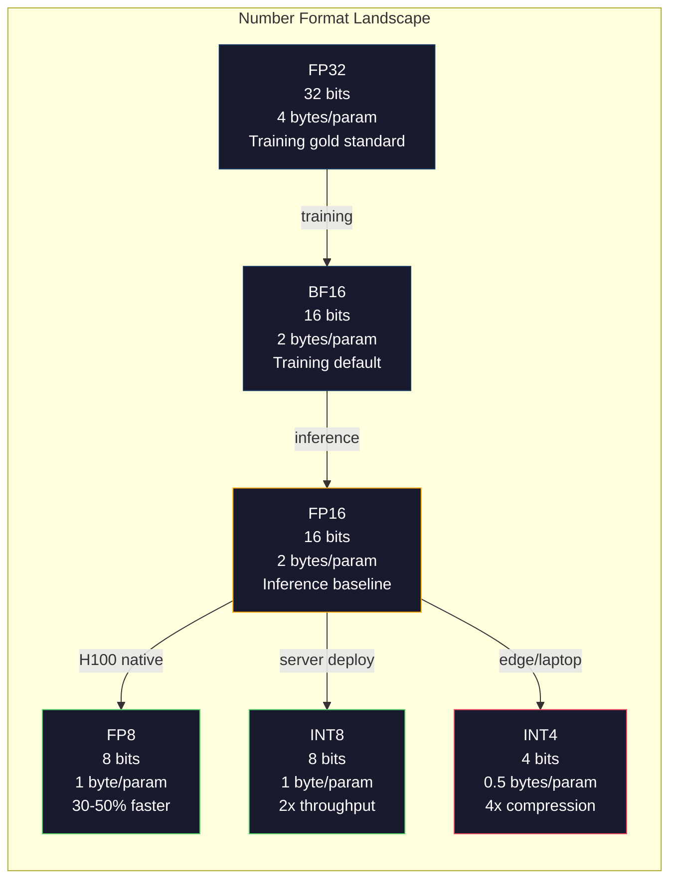
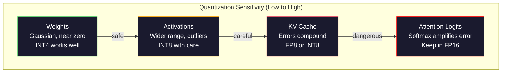
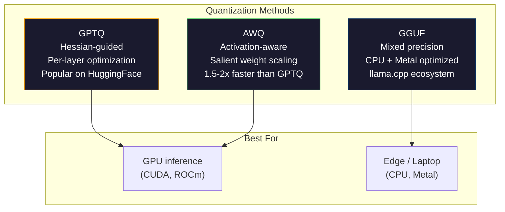

# Quantization: Making Models Fit | 量化：让模型跑起来

> A 70B model in FP16 needs 140GB. Two A100s just for weights. Quantize to FP8: one 80GB GPU. INT4: a MacBook.

> **【中文解读】** 70 亿参数模型在 FP16 下需要 140GB 显存（两张 A100）。量化到 FP8 只需一张 80GB GPU，量化到 INT4 可以在 MacBook 上运行。量化是用精度换显存和速度的核心技术。

> **【拓展：量化→llama.cpp/GGUF】** llama.cpp 和 GGUF 格式让大模型能在消费级硬件上运行。GPTQ、AWQ、GGUF 等量化方法是将 70B+ 模型部署到本地设备的关键。理解量化是理解大模型部署的基础。

**Type:** Build
**Languages:** Python (with numpy)
**Prerequisites:** Phase 10, Lessons 01-10 (LLMs from Scratch)
**Time:** ~120 minutes

## Learning Objectives | 学习目标

- Implement symmetric and asymmetric quantization from FP16 to INT8 and INT4, including per-tensor and per-channel scaling
  实现从 FP16 到 INT8 和 INT4 的对称/非对称量化，包括逐张量和逐通道缩放
- Calculate the memory savings from quantization and determine which precision fits a given GPU's VRAM
  计算量化的显存节省量，确定给定 GPU 显存适合的精度
- Explain the difference between post-training quantization (PTQ) and quantization-aware training (QAT)
  解释训练后量化（PTQ）和量化感知训练（QAT）的区别
- Apply GPTQ or AWQ to quantize a real model and measure the accuracy-memory tradeoff on a benchmark
  应用 GPTQ 或 AWQ 量化真实模型，并在基准上测量精度-显存权衡

> **【中文解读】** 本课实现量化技术——用精度换显存和速度。核心方法：对称/非对称量化、逐张量/逐通道缩放、PTQ（训练后量化）vs QAT（量化感知训练）。量化是每个大于 7B 的模型的标准部署路径。

## The Problem | 问题引入

Llama 3 70B has 70 billion parameters. Each parameter is a 16-bit floating point number. That is 140 billion bytes. 140GB. A single A100 has 80GB of VRAM. You cannot even load the weights, let alone run inference, on a single GPU. You need two A100s at $2/hour each just to serve one model.

> Llama 3 70B 有 700 亿参数。每个参数是一个 16 位浮点数。即 1400 亿字节。140GB。单张 A100 有 80GB 显存。你甚至无法加载权重，更不用说运行推理。你需要两张 A100，每张 $2/小时，仅仅服务一个模型。

But 16 bits per parameter is wasteful. Most weights in a neural network cluster near zero. The full dynamic range of FP16 (from 0.000000059 to 65,504) is almost entirely unused. If you measure the actual distribution of weights in Llama 3 70B, 95% of them fall between -0.1 and +0.1. You are burning 16 bits to represent values that could fit in 4.

> 但每参数 16 位是浪费的。神经网络中的大多数权重聚集在零附近。FP16 的完整动态范围（从 0.000000059 到 65,504）几乎完全未使用。如果你测量 Llama 3 70B 中权重的实际分布，95% 落在 -0.1 到 +0.1 之间。你用 16 位来表示可以用 4 位表示的值。

Quantization replaces high-precision numbers with lower-precision ones. FP16 to FP8 cuts memory in half. FP16 to INT4 cuts it to a quarter. That 140GB model becomes 35GB. It fits on a single consumer GPU. Push to 2-bit quantization (aggressive, lossy, but usable for some tasks) and the same model runs on a 16GB laptop.

> 量化用低精度数字替换高精度数字。FP16 到 FP8 减半显存。FP16 到 INT4 减到四分之一。140GB 模型变成 35GB。可放入单张消费级 GPU。推到 2 位量化（激进的、有损的，但对某些任务可用），同一模型可在 16GB 笔记本上运行。

The cost is accuracy. Every bit you remove destroys information. The question is how much accuracy you lose and where. A well-quantized INT4 model retains 95-99% of the original's quality on most benchmarks. A naive quantization to INT4 can destroy the model entirely. The difference is technique.

> 代价是精度。每移除一位都破坏信息。问题在于你损失多少精度以及在哪里损失。良好量化的 INT4 模型在大多数基准上保留原始质量的 95-99%。朴素 INT4 量化可能完全摧毁模型。差异在于技术。

Community quantizations of Llama 3 to INT4 with GPTQ show roughly 1-2 perplexity points lost on WikiText. Mistral released FP8 checkpoints of Mixtral 8x22B with zero measurable quality loss on MMLU. The GGUF format powers llama.cpp, running 70B models on MacBooks with M-series chips. Quantization is not a hack. It is the standard deployment path for every model larger than 7B.

> 社区用 GPTQ 将 Llama 3 量化到 INT4，在 WikiText 上仅损失约 1-2 个困惑度点。Mistral 发布了 Mixtral 8x22B 的 FP8 检查点，MMLU 上几乎零质量损失。GGUF 格式驱动 llama.cpp，在 MacBook M 系列芯片上运行 70B 模型。量化不是 hack。它是每个超过 7B 的模型的标准部署路径。

> **【中文解读】** FP16 每参数 16 位，70B 模型需要 140GB。但 95% 的权重集中在 -0.1 到 +0.1 之间——用 16 位表示这些值太浪费了。量化到 INT4 将显存需求降至 35GB，可在消费级 GPU 上运行。良好的 INT4 量化保留原始模型 95-99% 的质量。GPTQ 量化 Llama 3 到 INT4 仅损失 1-2 个困惑度点，Mistral 的 FP8 量化在 MMLU 上几乎零损失。

> **【拓展：量化生态】** 量化生态已非常成熟：GPTQ（基于近似二阶信息的逐层量化）、AWQ（激活感知权重量化，保护 salient 权重）、GGUF（llama.cpp 的量化格式，支持 2-8 bit 混合精度）。llama.cpp 让 70B 模型在 MacBook M 系列芯片上运行，催生了本地大模型部署的生态（Ollama、LM Studio 等）。

## The Concept | 核心概念

### Number Formats: What Each Bit Does

Every floating-point number has three parts: sign, exponent, and mantissa (also called significand). The sign is one bit. The exponent determines the range (how large or small the number can be). The mantissa determines the precision (how many decimal places you get).

> 每个浮点数有三部分：符号、指数和尾数（也叫有效数字）。符号占一位。指数决定范围（数可以多大或多小）。尾数决定精度（有多少位小数）。

```
FP32:  [1 sign] [8 exponent] [23 mantissa]  = 32 bits
FP16:  [1 sign] [5 exponent] [10 mantissa]  = 16 bits
BF16:  [1 sign] [8 exponent] [7  mantissa]  = 16 bits
FP8:   [1 sign] [4 exponent] [3  mantissa]  = 8  bits (E4M3)
FP8:   [1 sign] [5 exponent] [2  mantissa]  = 8  bits (E5M2)
INT8:  [1 sign] [7 value]                   = 8  bits (uniform steps)
INT4:  [1 sign] [3 value]                   = 4  bits (16 levels total)
```

**FP32** is full precision. 23 mantissa bits give you about 7 decimal digits of precision. Range: roughly 1.2 x 10^-38 to 3.4 x 10^38. Training used to happen exclusively in FP32. It still does for accumulation (running sums during matrix multiplication).

> **FP32** 是全精度。23 位尾数给你约 7 位十进制精度。训练以前全部在 FP32 中进行。累加（矩阵乘法中的累加和）仍然使用 FP32。

**FP16** halves the bits. 10 mantissa bits give about 3.3 decimal digits. The exponent shrinks to 5 bits, reducing the range dramatically (max value ~65,504). This is fine for weights (which cluster near zero) but dangerous for activations and gradients that can spike during training. FP16 training requires loss scaling to prevent underflow.

> **FP16** 将位数减半。10 位尾数给约 3.3 位十进制精度。指数缩减到 5 位，范围大幅减小（最大值约 65,504）。这对权重没问题（聚集在零附近），但对训练中可能飙升的激活和梯度很危险。FP16 训练需要损失缩放来防止下溢。

**BF16** (Brain Float 16) keeps the 8-bit exponent from FP32 but shrinks the mantissa to 7 bits. Same range as FP32, less precision than FP16. Google designed it specifically for deep learning. The intuition: range matters more than precision for neural networks. A gradient of 10^-20 that underflows to zero in FP16 survives in BF16. A weight of 0.07342 that rounds to 0.0734 in BF16 is close enough. Every modern training run uses BF16 or a BF16/FP32 mix.

> **BF16**（Brain Float 16）保留 FP32 的 8 位指数但将尾数缩减到 7 位。范围与 FP32 相同，精度低于 FP16。Google 专门为深度学习设计。直觉：对神经网络来说范围比精度更重要。在 FP16 中下溢为零的 10^-20 梯度在 BF16 中存活。BF16 中 0.07342 四舍五入到 0.0734 的权重足够接近了。每个现代训练运行都使用 BF16 或 BF16/FP32 混合。

**FP8** comes in two flavors. E4M3 (4 exponent, 3 mantissa) is used for weights and activations during inference. E5M2 (5 exponent, 2 mantissa) is used for gradients during training where range matters more than precision. FP8 inference on H100 GPUs achieves 30-50% speedup over FP16 with negligible quality loss.

> **FP8** 有两种变体。E4M3（4 指数，3 尾数）用于推理时的权重和激活。E5M2（5 指数，2 尾数）用于训练时的梯度，此时范围比精度更重要。H100 GPU 上的 FP8 推理比 FP16 快 30-50%，质量损失可忽略。

**INT8** is an integer format. No exponent, no mantissa. Just 256 evenly spaced values from -128 to 127. You need a scale factor to map floating-point weights into this range. The advantage: integer arithmetic is faster and more power-efficient than floating-point. INT8 matrix multiplication on an A100 runs at 624 TOPS versus 312 TFLOPS for FP16.

> **INT8** 是整数格式。无指数、无尾数。仅 256 个均匀间隔的值，从 -128 到 127。你需要缩放因子将浮点权重映射到此范围。优势：整数算术比浮点更快、更节能。A100 上 INT8 矩阵乘法运行在 624 TOPS，而 FP16 为 312 TFLOPS。

**INT4** pushes further. Only 16 possible values. The scale factor does heavy lifting. Quality depends entirely on how you choose the scale and which weights you quantize. State-of-the-art INT4 methods (GPTQ, AWQ) retain 95%+ of original model quality.

> **INT4** 更进一步。仅 16 个可能值。缩放因子承担重任。质量完全取决于你如何选择缩放比例和量化哪些权重。最先进的 INT4 方法（GPTQ、AWQ）保留原始模型 95%+ 的质量。



### How Quantization Works

The core operation is simple. Take a tensor of floating-point values, find a scale factor, multiply, round to the nearest integer, and store the integers plus the scale factor.

> 核心操作很简单。取一个浮点值张量，找到缩放因子，乘以它，四舍五入到最近整数，然后存储整数加上缩放因子。

**Quantize:**
```
scale = max(abs(tensor)) / max_int_value
quantized = round(tensor / scale)
```

**Dequantize:**
```
reconstructed = quantized * scale
```

For INT8 with a symmetric range (-127 to 127):
```
scale = max(abs(tensor)) / 127
quantized = clamp(round(tensor / scale), -128, 127)
```

The error is the rounding error. Each value can be off by at most `scale / 2`. The total error across a layer depends on how many weights you have and how sensitive the model is to perturbations in those weights.

> 误差是四舍五入误差。每个值最多偏离 `scale / 2`。一层中的总误差取决于你有多少权重以及模型对这些权重的扰动有多敏感。

**Per-tensor vs per-channel quantization.** Per-tensor uses one scale factor for the entire weight matrix. Simple but lossy: if one column has large values and another has small values, the small values lose most of their precision. Per-channel uses one scale factor per output channel (per row or column of the weight matrix). More overhead (you store N scale factors instead of 1) but dramatically better quality. Every production quantization method uses per-channel or finer granularity.

> **逐张量 vs 逐通道量化。** 逐张量对整个权重矩阵使用一个缩放因子。简单但有损：如果一列有大值另一列有小值，小值会丢失大部分精度。逐通道对每个输出通道（权重矩阵的每行或每列）使用一个缩放因子。开销更大（存储 N 个缩放因子而非 1 个）但质量显著更好。每个生产量化方法都使用逐通道或更细的粒度。

**Asymmetric quantization** adds a zero-point offset: `quantized = round(tensor / scale) + zero_point`. This handles distributions that are not centered at zero. ReLU activations, for example, are always non-negative. Symmetric quantization wastes half the integer range on negative values that never appear. Asymmetric quantization maps the actual range [min, max] to the full integer range.

> **非对称量化**添加零点偏移：`quantized = round(tensor / scale) + zero_point`。这处理不以零为中心的分布。例如 ReLU 激活值总是非负的。对称量化将一半整数范围浪费在从不出现的负值上。非对称量化将实际范围 [min, max] 映射到完整整数范围。

### Sensitivity Hierarchy

Not everything in a model tolerates quantization equally. There is a clear hierarchy.

> 模型中并非所有部分对量化的容忍度相同。有一个清晰的层次结构。

**Weights (most robust).** Model weights change slowly during training and follow a roughly Gaussian distribution centered near zero. They quantize well. INT8 weights with per-channel scales produce nearly lossless results. INT4 requires more sophisticated methods but works.

> **权重（最鲁棒）。** 模型权重在训练中变化缓慢，遵循大致以零为中心的高斯分布。它们量化效果好。带逐通道缩放的 INT8 权重产生几乎无损的结果。INT4 需要更复杂的方法但可行。

**Activations (moderate sensitivity).** Activations are the intermediate values flowing through the network during inference. They have wider dynamic range than weights and contain outliers. A single attention head might produce activation values 100x larger than the mean. These outliers are critical for model quality. Quantizing them naively destroys information. Solutions: keep outlier channels in higher precision (LLM.int8()), use per-token or per-channel activation scales.

> **激活（中等敏感度）。** 激活是推理时流经网络的中间值。它们比权重有更宽的动态范围并包含离群值。单个注意力头可能产生比均值大 100 倍的激活值。这些离群值对模型质量至关重要。朴素量化会破坏信息。解决方案：保持离群通道在更高精度（LLM.int8()），使用逐 token 或逐通道激活缩放。

**KV cache (high sensitivity).** The key-value cache stores attention states for all previous tokens. At long context lengths, the KV cache dominates memory. For a 70B model at 32K context, the KV cache alone is 40GB in FP16. Quantizing the KV cache to FP8 or INT8 saves massive memory but any error compounds across all future attention computations. The quality impact scales with sequence length.

> **KV 缓存（高敏感度）。** 键值缓存存储所有先前 token 的注意力状态。在长上下文长度下，KV 缓存主导内存。70B 模型在 32K 上下文下，仅 KV 缓存就有 40GB FP16。将 KV 缓存量化到 FP8 或 INT8 节省大量内存但任何误差会在所有后续注意力计算中累积。质量影响随序列长度增加。

**Attention logits (most sensitive).** The softmax in attention is highly sensitive to small changes in its inputs. A quantization error of 0.01 in a pre-softmax logit can shift the attention distribution meaningfully. Most quantization schemes keep attention computation in higher precision (FP16 or BF16) even when everything else is quantized.

> **注意力 logits（最敏感）。** 注意力中的 softmax 对其输入的微小变化高度敏感。pre-softmax logit 中 0.01 的量化误差可以显著改变注意力分布。大多数量化方案即使其他所有部分都量化了，也保持注意力计算在更高精度（FP16 或 BF16）。



### PTQ vs QAT

**Post-Training Quantization (PTQ)** quantizes an already-trained model. No retraining. You take the FP16 weights, compute scale factors, round, and deploy. Fast (minutes to hours) and cheap. Works well for INT8 and FP8. For INT4, naive PTQ often fails badly because rounding errors accumulate. Advanced PTQ methods (GPTQ, AWQ) use calibration data to minimize the quantization error.

> **训练后量化（PTQ）** 量化已训练的模型。无需重训练。取 FP16 权重，计算缩放因子，四舍五入，部署。快速（几分钟到几小时）且便宜。INT8 和 FP8 效果好。对 INT4，朴素 PTQ 经常失败，因为四舍五入误差累积。高级 PTQ 方法（GPTQ、AWQ）使用校准数据最小化量化误差。

**Quantization-Aware Training (QAT)** inserts fake quantization operations into the forward pass during training. The model learns to place its weights where rounding errors are small. Gradients flow through the fake quantization using the straight-through estimator (STE): pretend the rounding operation has gradient 1. QAT produces better INT4 and INT2 models than PTQ but requires a full training run. Google used QAT for Gemini's efficient serving. Meta used QAT for some Llama deployment targets.

> **量化感知训练（QAT）** 在训练的前向传播中插入伪量化操作。模型学会将权重放在四舍五入误差小的位置。梯度通过直通估计器（STE）流过伪量化：假设四舍五入操作的梯度为 1。QAT 产生比 PTQ 更好的 INT4 和 INT2 模型，但需要完整训练运行。Google 用 QAT 服务 Gemini。Meta 用 QAT 部署某些 Llama 目标。

| Aspect | PTQ | QAT |
|--------|-----|-----|
| Cost / 成本 | Minutes to hours / 几分钟到几小时 | Full training run / 完整训练运行 |
| Quality at INT8 / INT8 质量 | Excellent (< 0.1% loss) / 优秀（< 0.1% 损失） | Excellent / 优秀 |
| Quality at INT4 / INT4 质量 | Good with GPTQ/AWQ (1-3% loss) / 配合 GPTQ/AWQ 良好（1-3% 损失） | Better (< 1% loss) / 更好（< 1% 损失） |
| Quality at INT2 / INT2 质量 | Poor / 差 | Usable for some tasks / 某些任务可用 |
| Calibration data / 校准数据 | 128-1024 examples / 128-1024 样本 | Full training dataset / 完整训练数据集 |
| When to use / 使用时机 | Deployment, iteration / 部署、迭代 | Maximum quality at low bit-width / 低比特宽度的最大质量 |

### GPTQ, AWQ, GGUF

**GPTQ (GPT Quantization)** is a one-shot PTQ method. It quantizes weights one layer at a time, using a small calibration dataset (128 examples is typical) to measure the Hessian (second-order information about how sensitive the output is to each weight). Weights that the Hessian says are important get quantized more carefully. GPTQ was the first method to make INT4 quantization practical for LLMs. The TheBloke on Hugging Face popularized GPTQ by releasing quantized versions of hundreds of models.

> **GPTQ** 是一种一次性 PTQ 方法。它逐层量化权重，使用小校准数据集（通常 128 样本）测量 Hessian（关于输出对每个权重的敏感度的二阶信息）。Hessian 指示重要的权重被更仔细地量化。GPTQ 是首个让 INT4 量化对 LLM 实用的方法。Hugging Face 上的 TheBloke 通过发布数百个模型的量化版本使 GPTQ 流行。

**AWQ (Activation-Aware Weight Quantization)** observes that a small fraction of weights (about 1%) are disproportionately important because they multiply with large activation values. AWQ identifies these salient weights using calibration data and scales them up before quantization (then scales the corresponding activations down). This keeps the important weights in a range where INT4 quantization is accurate. AWQ typically matches or slightly beats GPTQ quality while being 1.5-2x faster to apply.

> **AWQ** 观察到少部分权重（约 1%）因为与大的激活值相乘而格外重要。AWQ 使用校准数据识别这些显著权重并在量化前将它们放大（然后缩小对应的激活）。这使重要权重保持在 INT4 量化精确的范围内。AWQ 通常匹配或略优于 GPTQ 质量，同时应用速度快 1.5-2 倍。

**GGUF (GPT-Generated Unified Format)** is the file format used by llama.cpp and its ecosystem. It supports mixed quantization: different layers get different bit widths. The first and last layers (embedding and output head) are typically kept at higher precision. Middle layers get INT4 or INT3. GGUF files are self-contained: weights, tokenizer, metadata all in one file. The format is designed for CPU inference and Apple Silicon, where loading the entire model into memory and running matrix multiplications on the CPU or Metal GPU is the standard path. Q4_K_M is the most popular GGUF quantization variant, balancing quality and size.

> **GGUF** 是 llama.cpp 及其生态使用的文件格式。它支持混合量化：不同层获得不同位宽。首尾层（嵌入和输出头）通常保持更高精度。中间层使用 INT4 或 INT3。GGUF 文件自包含：权重、分词器、元数据都在一个文件中。该格式专为 CPU 推理和 Apple Silicon 设计。Q4_K_M 是最受欢迎的 GGUF 量化变体，平衡质量和大小。



### Quality Measurement

How do you know if your quantized model is still good?

> 如何判断你的量化模型仍然好用？

**Perplexity.** The most common metric. Lower is better. Compute perplexity on a held-out dataset (WikiText-2 is standard) for both the original and quantized model. The delta tells you how much information the quantization destroyed. Rules of thumb: delta < 0.5 is excellent, 0.5-1.0 is good, 1.0-2.0 is acceptable for most tasks, > 2.0 means something went wrong.

> **困惑度。** 最常用的指标。越低越好。在保留数据集（WikiText-2 是标准）上计算原始和量化模型的困惑度。差值告诉你量化破坏了多少信息。经验法则：差值 < 0.5 优秀，0.5-1.0 良好，1.0-2.0 大多数任务可接受，> 2.0 说明有问题。

**Task-specific benchmarks.** Run the quantized model on MMLU, HumanEval, GSM8K, or your custom eval suite. Compare against the original. Quantization affects different capabilities unevenly. Math and code tasks are more sensitive to precision loss than general knowledge.

> **任务特定基准。** 在 MMLU、HumanEval、GSM8K 或你的自定义评测套件上运行量化模型。与原始模型比较。量化对不同能力的影响不均匀。数学和代码任务对精度损失比通用知识更敏感。

**Output comparison.** Generate responses from both models on the same prompts and compare. LLM-as-judge (Lesson 10) works well here. Compute a win rate: what fraction of prompts does the quantized model match or beat the original on?

> **输出比较。** 从两个模型在相同 prompt 上生成回复并比较。LLM-as-judge（第十课）在这里很有效。计算胜率：量化模型在多少比例的 prompt 上匹配或超过原始模型？

**Latency and throughput.** Quantization exists to make models faster and cheaper. Measure tokens per second, time to first token, and memory usage. A quantized model that is slower than the original is worse than useless.

> **延迟和吞吐量。** 量化存在的目的是让模型更快更便宜。测量每秒 token 数、首 token 时间和内存使用。比原始模型更慢的量化模型比无用更糟。

| Model | Format | Size | Perplexity (WikiText-2) | MMLU | Tokens/sec (A100) |
|-------|--------|------|------------------------|------|-------------------|
| Llama 3 70B | FP16 | 140GB | 3.12 | 79.5% | 38 |
| Llama 3 70B | FP8 | 70GB | 3.14 | 79.3% | 55 |
| Llama 3 70B | GPTQ INT4 | 35GB | 4.32 | 77.8% | 72 |
| Llama 3 70B | AWQ INT4 | 35GB | 4.18 | 78.1% | 75 |
| Llama 3 70B | GGUF Q4_K_M | 40GB | 4.25 | 77.9% | 28 (CPU) |

The pattern: FP8 is nearly free. INT4 costs 1-2 MMLU points but doubles throughput and quarters memory. The tradeoff is worth it for almost every deployment.

> 模式：FP8 几乎免费。INT4 代价 1-2 个 MMLU 点但吞吐量翻倍、内存降至四分之一。这个权衡对几乎所有部署都值得。

### Real Numbers

FP16 to FP8 on H100: 30-50% inference speedup, < 0.1% quality loss. This is the no-brainer quantization. Every H100 deployment should use it.

> H100 上 FP16 到 FP8：30-50% 推理加速，< 0.1% 质量损失。这是不用想的量化。每个 H100 部署都应使用。

FP16 to INT8 (LLM.int8()): 2x memory reduction, < 0.5% quality loss. The mixed-precision approach keeps outlier features in FP16 while quantizing everything else to INT8.

> FP16 到 INT8（LLM.int8()）：2 倍内存减少，< 0.5% 质量损失。混合精度方法保持离群特征在 FP16 而其他全部量化到 INT8。

FP16 to INT4 (GPTQ/AWQ): 4x memory reduction, 1-3% quality loss depending on the model and method. Enables 70B models on a single 48GB GPU.

> FP16 到 INT4（GPTQ/AWQ）：4 倍内存减少，1-3% 质量损失，取决于模型和方法。使 70B 模型可在单张 48GB GPU 上运行。

FP16 to INT4 (GGUF Q4_K_M): 3.5x memory reduction, 1-2% quality loss. Optimized for CPU inference. A 70B model at Q4_K_M is about 40GB and runs at 10-15 tokens/second on an M3 Max with 64GB.

> FP16 到 INT4（GGUF Q4_K_M）：3.5 倍内存减少，1-2% 质量损失。为 CPU 推理优化。Q4_K_M 的 70B 模型约 40GB，在 64GB M3 Max 上以 10-15 tokens/秒运行。

FP16 to INT2: 8x memory reduction, 5-15% quality loss. Only viable for specific narrow tasks where you can tolerate degradation. Research frontier, not production-ready for general use.

> FP16 到 INT2：8 倍内存减少，5-15% 质量损失。仅适用于可容忍退化的特定窄任务。研究前沿，非通用生产就绪。

## Build It | 动手实现

### Step 1: Number Format Representations

Build the bit-level representation of each format to see exactly what sign, exponent, and mantissa do.

> 构建每种格式的位级表示，看清楚符号、指数和尾数各起什么作用。

```python
import numpy as np


def float_to_fp32_bits(value):
    bits = np.float32(value).view(np.uint32)
    sign = (bits >> 31) & 1
    exponent = (bits >> 23) & 0xFF
    mantissa = bits & 0x7FFFFF
    return {"sign": int(sign), "exponent": int(exponent), "mantissa": int(mantissa),
            "exponent_bits": format(int(exponent), '08b'),
            "mantissa_bits": format(int(mantissa), '023b'),
            "value": float(value),
            "actual_exponent": int(exponent) - 127}


def float_to_fp16_bits(value):
    fp16 = np.float16(value)
    bits = fp16.view(np.uint16)
    sign = (bits >> 15) & 1
    exponent = (bits >> 10) & 0x1F
    mantissa = bits & 0x3FF
    return {"sign": int(sign), "exponent": int(exponent), "mantissa": int(mantissa),
            "exponent_bits": format(int(exponent), '05b'),
            "mantissa_bits": format(int(mantissa), '010b'),
            "value": float(fp16),
            "actual_exponent": int(exponent) - 15}


def float_to_bf16_bits(value):
    fp32_bits = np.float32(value).view(np.uint32)
    bf16_bits = (fp32_bits >> 16).astype(np.uint16)
    sign = (bf16_bits >> 15) & 1
    exponent = (bf16_bits >> 7) & 0xFF
    mantissa = bf16_bits & 0x7F
    reconstructed = np.uint32(bf16_bits.astype(np.uint32) << 16).view(np.float32)
    return {"sign": int(sign), "exponent": int(exponent), "mantissa": int(mantissa),
            "exponent_bits": format(int(exponent), '08b'),
            "mantissa_bits": format(int(mantissa), '07b'),
            "value": float(reconstructed),
            "actual_exponent": int(exponent) - 127}


def simulate_fp8_e4m3(value):
    sign = 1 if value < 0 else 0
    abs_val = abs(value)
    max_val = 448.0
    abs_val = min(abs_val, max_val)
    if abs_val == 0:
        return {"sign": sign, "exponent": 0, "mantissa": 0, "value": 0.0,
                "exponent_bits": "0000", "mantissa_bits": "000"}
    exp = int(np.floor(np.log2(abs_val)))
    exp = max(-6, min(8, exp))
    mantissa_val = abs_val / (2.0 ** exp) - 1.0
    mantissa_quant = round(mantissa_val * 8) / 8
    mantissa_quant = max(0, min(0.875, mantissa_quant))
    reconstructed = (1.0 + mantissa_quant) * (2.0 ** exp)
    if sign:
        reconstructed = -reconstructed
    mantissa_int = int(round(mantissa_quant * 8))
    return {"sign": sign, "exponent": exp + 7, "mantissa": mantissa_int,
            "exponent_bits": format(exp + 7, '04b'),
            "mantissa_bits": format(mantissa_int, '03b'),
            "value": float(reconstructed),
            "actual_exponent": exp}


def display_format_comparison(value):
    fp32 = float_to_fp32_bits(value)
    fp16 = float_to_fp16_bits(value)
    bf16 = float_to_bf16_bits(value)
    fp8 = simulate_fp8_e4m3(value)

    print(f"\n  Value: {value}")
    print(f"  {'Format':<8} {'Stored Value':>14} {'Error':>12} {'Sign':>5} {'Exp Bits':>10} {'Man Bits':>25}")
    print(f"  {'-'*76}")
    print(f"  {'FP32':<8} {fp32['value']:>14.6f} {abs(fp32['value'] - value):>12.8f} {fp32['sign']:>5} {fp32['exponent_bits']:>10} {fp32['mantissa_bits']:>25}")
    print(f"  {'FP16':<8} {fp16['value']:>14.6f} {abs(fp16['value'] - value):>12.8f} {fp16['sign']:>5} {fp16['exponent_bits']:>10} {fp16['mantissa_bits']:>25}")
    print(f"  {'BF16':<8} {bf16['value']:>14.6f} {abs(bf16['value'] - value):>12.8f} {bf16['sign']:>5} {bf16['exponent_bits']:>10} {bf16['mantissa_bits']:>25}")
    print(f"  {'FP8e4m3':<8} {fp8['value']:>14.6f} {abs(fp8['value'] - value):>12.8f} {fp8['sign']:>5} {fp8['exponent_bits']:>10} {fp8['mantissa_bits']:>25}")
```

### Step 2: Symmetric Quantization (Per-Tensor and Per-Channel)

The fundamental quantization operations. Per-tensor uses one scale for the whole matrix. Per-channel uses one scale per row or column.

> 基本量化操作。逐张量对整个矩阵使用一个缩放因子。逐通道对每行或每列使用一个缩放因子。

```python
def quantize_symmetric(tensor, num_bits=8):
    qmin = -(2 ** (num_bits - 1))
    qmax = 2 ** (num_bits - 1) - 1
    abs_max = np.max(np.abs(tensor))
    if abs_max == 0:
        return np.zeros_like(tensor, dtype=np.int32), 1.0
    scale = abs_max / qmax
    quantized = np.clip(np.round(tensor / scale), qmin, qmax).astype(np.int32)
    return quantized, float(scale)


def dequantize_symmetric(quantized, scale):
    return quantized.astype(np.float64) * scale


def quantize_per_channel(tensor, num_bits=8, axis=0):
    qmin = -(2 ** (num_bits - 1))
    qmax = 2 ** (num_bits - 1) - 1

    if axis == 0:
        abs_max = np.max(np.abs(tensor), axis=1, keepdims=True)
    else:
        abs_max = np.max(np.abs(tensor), axis=0, keepdims=True)

    abs_max = np.where(abs_max == 0, 1.0, abs_max)
    scales = abs_max / qmax
    quantized = np.clip(np.round(tensor / scales), qmin, qmax).astype(np.int32)
    return quantized, scales.squeeze()


def dequantize_per_channel(quantized, scales, axis=0):
    if axis == 0:
        return quantized.astype(np.float64) * scales.reshape(-1, 1)
    else:
        return quantized.astype(np.float64) * scales.reshape(1, -1)


def quantize_asymmetric(tensor, num_bits=8):
    qmin = 0
    qmax = 2 ** num_bits - 1
    t_min = np.min(tensor)
    t_max = np.max(tensor)
    if t_max == t_min:
        return np.zeros_like(tensor, dtype=np.int32), 1.0, 0
    scale = (t_max - t_min) / (qmax - qmin)
    zero_point = int(np.round(qmin - t_min / scale))
    zero_point = max(qmin, min(qmax, zero_point))
    quantized = np.clip(np.round(tensor / scale + zero_point), qmin, qmax).astype(np.int32)
    return quantized, float(scale), int(zero_point)


def dequantize_asymmetric(quantized, scale, zero_point):
    return (quantized.astype(np.float64) - zero_point) * scale
```

### Step 3: Quality Measurement

Measure how much information quantization destroys. Mean squared error, signal-to-noise ratio, and cosine similarity between original and reconstructed tensors.

> 测量量化破坏了多少信息。原始张量和重建张量之间的均方误差、信噪比和余弦相似度。

```python
def quantization_error(original, reconstructed):
    diff = original - reconstructed
    mse = float(np.mean(diff ** 2))
    rmse = float(np.sqrt(mse))
    max_error = float(np.max(np.abs(diff)))
    signal_power = float(np.mean(original ** 2))
    snr_db = 10 * np.log10(signal_power / max(mse, 1e-20))

    orig_flat = original.flatten()
    recon_flat = reconstructed.flatten()
    norm_orig = np.linalg.norm(orig_flat)
    norm_recon = np.linalg.norm(recon_flat)
    if norm_orig == 0 or norm_recon == 0:
        cosine_sim = 0.0
    else:
        cosine_sim = float(np.dot(orig_flat, recon_flat) / (norm_orig * norm_recon))

    return {"mse": mse, "rmse": rmse, "max_error": max_error,
            "snr_db": float(snr_db), "cosine_similarity": cosine_sim}


def compare_quantization_methods(tensor, num_bits=8):
    q_pt, s_pt = quantize_symmetric(tensor, num_bits)
    recon_pt = dequantize_symmetric(q_pt, s_pt)
    err_pt = quantization_error(tensor, recon_pt)

    q_pc, s_pc = quantize_per_channel(tensor, num_bits, axis=0)
    recon_pc = dequantize_per_channel(q_pc, s_pc, axis=0)
    err_pc = quantization_error(tensor, recon_pc)

    q_asym, s_asym, zp = quantize_asymmetric(tensor, num_bits)
    recon_asym = dequantize_asymmetric(q_asym, s_asym, zp)
    err_asym = quantization_error(tensor, recon_asym)

    print(f"\n  Quantization Comparison ({num_bits}-bit, tensor shape {tensor.shape}):")
    print(f"  {'Method':<20} {'MSE':>12} {'SNR (dB)':>10} {'Cosine Sim':>12} {'Max Error':>12}")
    print(f"  {'-'*68}")
    print(f"  {'Per-tensor sym':<20} {err_pt['mse']:>12.8f} {err_pt['snr_db']:>10.2f} {err_pt['cosine_similarity']:>12.8f} {err_pt['max_error']:>12.8f}")
    print(f"  {'Per-channel sym':<20} {err_pc['mse']:>12.8f} {err_pc['snr_db']:>10.2f} {err_pc['cosine_similarity']:>12.8f} {err_pc['max_error']:>12.8f}")
    print(f"  {'Asymmetric':<20} {err_asym['mse']:>12.8f} {err_asym['snr_db']:>10.2f} {err_asym['cosine_similarity']:>12.8f} {err_asym['max_error']:>12.8f}")

    return {"per_tensor": err_pt, "per_channel": err_pc, "asymmetric": err_asym}
```

### Step 4: Bit-Width Sweep

Quantize the same tensor at different bit widths (2, 3, 4, 8, 16) and measure quality at each level. This shows exactly where the quality cliff is.

> 在不同位宽（2、3、4、8、16）下量化相同张量并测量每个级别的质量。这精确显示质量悬崖在哪里。

```python
def bit_width_sweep(tensor):
    print(f"\n  Bit-Width Sweep (tensor shape {tensor.shape}):")
    print(f"  {'Bits':>6} {'Levels':>8} {'MSE':>14} {'SNR (dB)':>10} {'Cosine Sim':>12} {'Compression':>12}")
    print(f"  {'-'*64}")

    results = []
    for bits in [2, 3, 4, 8, 16]:
        q, s = quantize_per_channel(tensor, bits, axis=0)
        recon = dequantize_per_channel(q, s, axis=0)
        err = quantization_error(tensor, recon)
        levels = 2 ** bits
        compression = 32.0 / bits

        print(f"  {bits:>6} {levels:>8} {err['mse']:>14.8f} {err['snr_db']:>10.2f} {err['cosine_similarity']:>12.8f} {compression:>11.1f}x")
        results.append({"bits": bits, "levels": levels, "error": err, "compression": compression})

    return results
```

### Step 5: Sensitivity Experiment

Simulate quantizing different parts of a transformer and measure which components are most sensitive. This demonstrates the sensitivity hierarchy: weights < activations < KV cache < attention.

> 模拟量化 transformer 的不同部分并测量哪些组件最敏感。这展示了敏感度层次：权重 < 激活 < KV 缓存 < 注意力。

```python
def simulate_transformer_layer(input_data, weights, kv_scale=1.0):
    hidden = input_data @ weights["qkv"]
    seq_len = hidden.shape[1]
    d_model = weights["qkv"].shape[1] // 3
    q, k, v = hidden[:, :, :d_model], hidden[:, :, d_model:2*d_model], hidden[:, :, 2*d_model:]

    attn_scores = (q @ k.transpose(0, 2, 1)) / np.sqrt(d_model) * kv_scale
    attn_max = np.max(attn_scores, axis=-1, keepdims=True)
    attn_exp = np.exp(attn_scores - attn_max)
    attn_weights = attn_exp / np.sum(attn_exp, axis=-1, keepdims=True)

    attn_output = attn_weights @ v
    output = attn_output @ weights["out"]
    return output, {"q": q, "k": k, "v": v, "attn_scores": attn_scores,
                    "attn_weights": attn_weights, "attn_output": attn_output}


def sensitivity_experiment(batch_size=2, seq_len=16, d_model=64, num_bits=8):
    np.random.seed(42)
    input_data = np.random.randn(batch_size, seq_len, d_model) * 0.1

    weights = {
        "qkv": np.random.randn(d_model, 3 * d_model) * (2.0 / d_model) ** 0.5,
        "out": np.random.randn(d_model, d_model) * (2.0 / d_model) ** 0.5,
    }

    baseline_output, baseline_internals = simulate_transformer_layer(input_data, weights)

    experiments = {}

    q_qkv, s_qkv = quantize_per_channel(weights["qkv"], num_bits, axis=0)
    q_out, s_out = quantize_per_channel(weights["out"], num_bits, axis=0)
    quantized_weights = {
        "qkv": dequantize_per_channel(q_qkv, s_qkv, axis=0),
        "out": dequantize_per_channel(q_out, s_out, axis=0),
    }
    weight_quant_output, _ = simulate_transformer_layer(input_data, quantized_weights)
    experiments["Weights only"] = quantization_error(baseline_output, weight_quant_output)

    _, fresh_internals = simulate_transformer_layer(input_data, weights)
    q_act, s_act = quantize_per_channel(
        fresh_internals["attn_output"].reshape(-1, d_model), num_bits, axis=0
    )
    quant_attn_out = dequantize_per_channel(q_act, s_act, axis=0).reshape(batch_size, seq_len, d_model)
    act_quant_output = quant_attn_out @ weights["out"]
    experiments["Activations only"] = quantization_error(baseline_output, act_quant_output)

    q_k, s_k = quantize_per_channel(fresh_internals["k"].reshape(-1, d_model), num_bits, axis=0)
    q_v, s_v = quantize_per_channel(fresh_internals["v"].reshape(-1, d_model), num_bits, axis=0)
    quant_k = dequantize_per_channel(q_k, s_k, axis=0).reshape(batch_size, seq_len, d_model)
    quant_v = dequantize_per_channel(q_v, s_v, axis=0).reshape(batch_size, seq_len, d_model)
    attn_scores_kv = (fresh_internals["q"] @ quant_k.transpose(0, 2, 1)) / np.sqrt(d_model)
    attn_max_kv = np.max(attn_scores_kv, axis=-1, keepdims=True)
    attn_exp_kv = np.exp(attn_scores_kv - attn_max_kv)
    attn_weights_kv = attn_exp_kv / np.sum(attn_exp_kv, axis=-1, keepdims=True)
    kv_quant_output = (attn_weights_kv @ quant_v) @ weights["out"]
    experiments["KV cache only"] = quantization_error(baseline_output, kv_quant_output)

    noise_scale = np.std(fresh_internals["attn_scores"]) * 0.05
    noisy_scores = fresh_internals["attn_scores"] + np.random.randn(*fresh_internals["attn_scores"].shape) * noise_scale
    noisy_max = np.max(noisy_scores, axis=-1, keepdims=True)
    noisy_exp = np.exp(noisy_scores - noisy_max)
    noisy_weights = noisy_exp / np.sum(noisy_exp, axis=-1, keepdims=True)
    attn_quant_output = (noisy_weights @ fresh_internals["v"]) @ weights["out"]
    experiments["Attention logits (5% noise)"] = quantization_error(baseline_output, attn_quant_output)

    print(f"\n  Sensitivity Experiment ({num_bits}-bit quantization):")
    print(f"  {'Component':<30} {'MSE':>14} {'SNR (dB)':>10} {'Cosine Sim':>12}")
    print(f"  {'-'*68}")
    for name, err in sorted(experiments.items(), key=lambda x: x[1]["mse"]):
        print(f"  {name:<30} {err['mse']:>14.8f} {err['snr_db']:>10.2f} {err['cosine_similarity']:>12.8f}")

    return experiments
```

### Step 6: Simulated GPTQ

GPTQ quantizes one column at a time, using the Hessian to decide how to distribute the rounding error. This is a simplified version that captures the core idea: use calibration data to measure weight importance, then quantize the least important weights more aggressively.

```python
def simulated_gptq(weight_matrix, calibration_inputs, num_bits=4):
    n_in, n_out = weight_matrix.shape
    qmin = -(2 ** (num_bits - 1))
    qmax = 2 ** (num_bits - 1) - 1

    H = np.zeros((n_in, n_in))
    for x in calibration_inputs:
        x = x.reshape(-1, 1) if x.ndim == 1 else x
        for row in range(x.shape[0]):
            xi = x[row].reshape(-1, 1)
            H += xi @ xi.T
    H /= len(calibration_inputs)
    H += np.eye(n_in) * 1e-4

    weight_importance = np.diag(H)

    quantized = np.zeros_like(weight_matrix, dtype=np.int32)
    scales = np.zeros(n_out)
    errors = np.zeros(n_out)

    W = weight_matrix.copy()

    for col in range(n_out):
        w_col = W[:, col]
        abs_max = np.max(np.abs(w_col))
        if abs_max == 0:
            scales[col] = 1.0
            continue
        scale = abs_max / qmax
        scales[col] = scale

        q_col = np.clip(np.round(w_col / scale), qmin, qmax).astype(np.int32)
        quantized[:, col] = q_col

        quant_error = w_col - q_col * scale
        errors[col] = np.sqrt(np.mean(quant_error ** 2))

        if col < n_out - 1:
            importance_weights = weight_importance / (np.max(weight_importance) + 1e-10)
            for next_col in range(col + 1, min(col + 4, n_out)):
                compensation = quant_error * importance_weights * 0.1
                W[:, next_col] += compensation

    return quantized, scales, {"column_errors": errors,
                               "mean_error": float(np.mean(errors)),
                               "max_error": float(np.max(errors))}


def dequantize_gptq(quantized, scales):
    result = np.zeros_like(quantized, dtype=np.float64)
    for col in range(quantized.shape[1]):
        result[:, col] = quantized[:, col] * scales[col]
    return result
```

### Step 7: AWQ Simulation

AWQ identifies salient weights (those that multiply with large activations) and protects them by scaling before quantization.

```python
def simulated_awq(weight_matrix, calibration_inputs, num_bits=4, salient_fraction=0.01):
    n_in, n_out = weight_matrix.shape
    qmin = -(2 ** (num_bits - 1))
    qmax = 2 ** (num_bits - 1) - 1

    activation_magnitudes = np.zeros(n_in)
    for x in calibration_inputs:
        if x.ndim == 1:
            activation_magnitudes += np.abs(x)
        else:
            activation_magnitudes += np.mean(np.abs(x), axis=0)
    activation_magnitudes /= len(calibration_inputs)

    n_salient = max(1, int(n_in * salient_fraction))
    salient_indices = np.argsort(activation_magnitudes)[-n_salient:]

    scale_factors = np.ones(n_in)
    for idx in salient_indices:
        col_max = np.max(np.abs(weight_matrix[idx, :]))
        if col_max > 0:
            scale_factors[idx] = min(4.0, 1.0 / (col_max + 1e-8) * np.mean(np.abs(weight_matrix)))

    scaled_weights = weight_matrix * scale_factors.reshape(-1, 1)

    quantized, scales = quantize_per_channel(scaled_weights, num_bits, axis=0)
    dequantized = dequantize_per_channel(quantized, scales, axis=0)

    result = dequantized / scale_factors.reshape(-1, 1)

    err = quantization_error(weight_matrix, result)

    return result, {"salient_indices": salient_indices,
                    "scale_factors": scale_factors[salient_indices],
                    "error": err,
                    "n_salient": n_salient}
```

### Step 8: Full Pipeline

Wire everything together. Compare naive quantization, per-channel, GPTQ, and AWQ on the same weight matrix.

```python
def full_quantization_comparison(d_in=256, d_out=512, num_bits=4, n_calibration=32):
    np.random.seed(42)

    weight = np.random.randn(d_in, d_out) * 0.02
    outlier_rows = np.random.choice(d_in, size=5, replace=False)
    weight[outlier_rows] *= 10

    calibration = [np.random.randn(8, d_in) * 0.1 for _ in range(n_calibration)]

    q_naive, s_naive = quantize_symmetric(weight, num_bits)
    recon_naive = dequantize_symmetric(q_naive, s_naive)
    err_naive = quantization_error(weight, recon_naive)

    q_pc, s_pc = quantize_per_channel(weight, num_bits, axis=0)
    recon_pc = dequantize_per_channel(q_pc, s_pc, axis=0)
    err_pc = quantization_error(weight, recon_pc)

    q_gptq, s_gptq, gptq_info = simulated_gptq(weight, calibration, num_bits)
    recon_gptq = dequantize_gptq(q_gptq, s_gptq)
    err_gptq = quantization_error(weight, recon_gptq)

    recon_awq, awq_info = simulated_awq(weight, calibration, num_bits)
    err_awq = awq_info["error"]

    print(f"\n  Full Quantization Comparison ({num_bits}-bit, {d_in}x{d_out} matrix)")
    print(f"  Matrix has {len(outlier_rows)} outlier rows (10x scale)")
    print()
    print(f"  {'Method':<20} {'MSE':>14} {'SNR (dB)':>10} {'Cosine Sim':>12}")
    print(f"  {'-'*58}")
    print(f"  {'Naive per-tensor':<20} {err_naive['mse']:>14.8f} {err_naive['snr_db']:>10.2f} {err_naive['cosine_similarity']:>12.8f}")
    print(f"  {'Per-channel':<20} {err_pc['mse']:>14.8f} {err_pc['snr_db']:>10.2f} {err_pc['cosine_similarity']:>12.8f}")
    print(f"  {'Simulated GPTQ':<20} {err_gptq['mse']:>14.8f} {err_gptq['snr_db']:>10.2f} {err_gptq['cosine_similarity']:>12.8f}")
    print(f"  {'Simulated AWQ':<20} {err_awq['mse']:>14.8f} {err_awq['snr_db']:>10.2f} {err_awq['cosine_similarity']:>12.8f}")

    test_input = np.random.randn(4, d_in) * 0.1
    baseline = test_input @ weight
    output_naive = test_input @ recon_naive
    output_pc = test_input @ recon_pc
    output_gptq = test_input @ recon_gptq
    output_awq = test_input @ recon_awq

    print(f"\n  End-to-End Output Error (matmul with test input):")
    print(f"  {'Method':<20} {'Output MSE':>14} {'Output Cosine':>14}")
    print(f"  {'-'*50}")
    for name, output in [("Naive", output_naive), ("Per-channel", output_pc),
                          ("GPTQ", output_gptq), ("AWQ", output_awq)]:
        out_err = quantization_error(baseline, output)
        print(f"  {name:<20} {out_err['mse']:>14.8f} {out_err['cosine_similarity']:>14.8f}")

    return {"naive": err_naive, "per_channel": err_pc, "gptq": err_gptq, "awq": err_awq}


def memory_calculator(num_params_billions, bits_per_param):
    bytes_per_param = bits_per_param / 8
    total_bytes = num_params_billions * 1e9 * bytes_per_param
    total_gb = total_bytes / (1024 ** 3)
    return total_gb


def print_memory_table():
    print("\n  Memory Requirements by Model and Precision:")
    print(f"  {'Model':<15} {'FP32':>8} {'FP16':>8} {'FP8':>8} {'INT8':>8} {'INT4':>8} {'INT2':>8}")
    print(f"  {'-'*64}")
    for name, params in [("7B", 7), ("13B", 13), ("34B", 34), ("70B", 70), ("405B", 405)]:
        fp32 = memory_calculator(params, 32)
        fp16 = memory_calculator(params, 16)
        fp8 = memory_calculator(params, 8)
        int8 = memory_calculator(params, 8)
        int4 = memory_calculator(params, 4)
        int2 = memory_calculator(params, 2)
        print(f"  {name:<15} {fp32:>7.1f}G {fp16:>7.1f}G {fp8:>7.1f}G {int8:>7.1f}G {int4:>7.1f}G {int2:>7.1f}G")


if __name__ == "__main__":
    np.random.seed(42)

    print("=" * 70)
    print("QUANTIZATION: MAKING MODELS FIT")
    print("=" * 70)

    print("\nSTEP 1: Number Format Comparison")
    print("-" * 50)
    for val in [0.1, 3.14159, -0.00073, 42.5, 0.0000012]:
        display_format_comparison(val)

    print("\n\nSTEP 2: Memory Requirements")
    print("-" * 50)
    print_memory_table()

    print("\n\nSTEP 3: Quantization Methods Comparison")
    print("-" * 50)
    weight_matrix = np.random.randn(128, 256) * 0.02
    weight_matrix[0] *= 15
    weight_matrix[42] *= 8
    compare_quantization_methods(weight_matrix, num_bits=8)
    compare_quantization_methods(weight_matrix, num_bits=4)

    print("\n\nSTEP 4: Bit-Width Sweep")
    print("-" * 50)
    sweep_tensor = np.random.randn(64, 128) * 0.05
    bit_width_sweep(sweep_tensor)

    print("\n\nSTEP 5: Sensitivity Experiment")
    print("-" * 50)
    print("\n  INT8:")
    sensitivity_experiment(num_bits=8)
    print("\n  INT4:")
    sensitivity_experiment(num_bits=4)

    print("\n\nSTEP 6: GPTQ vs AWQ vs Naive (INT4)")
    print("-" * 50)
    full_quantization_comparison(d_in=256, d_out=512, num_bits=4)

    print("\n\nSTEP 7: Distribution Analysis")
    print("-" * 50)
    np.random.seed(0)
    simulated_weights = np.random.randn(1000) * 0.02
    abs_vals = np.abs(simulated_weights)
    pct_in_range = np.mean(abs_vals < 0.1) * 100
    print(f"\n  Simulated weight distribution (1000 params, std=0.02):")
    print(f"  Weights in [-0.1, 0.1]: {pct_in_range:.1f}%")
    print(f"  Weights in [-0.05, 0.05]: {np.mean(abs_vals < 0.05) * 100:.1f}%")
    print(f"  Weights in [-0.01, 0.01]: {np.mean(abs_vals < 0.01) * 100:.1f}%")
    print(f"  Max absolute value: {np.max(abs_vals):.6f}")
    print(f"  Mean absolute value: {np.mean(abs_vals):.6f}")

    histogram = np.histogram(simulated_weights, bins=20)
    print(f"\n  Weight histogram:")
    max_count = max(histogram[0])
    for i in range(len(histogram[0])):
        bar_len = int(histogram[0][i] / max_count * 40)
        lo = histogram[1][i]
        hi = histogram[1][i + 1]
        print(f"  [{lo:>7.4f}, {hi:>7.4f}] {'#' * bar_len} ({histogram[0][i]})")

    print("\n\n" + "=" * 70)
    print("DONE")
    print("=" * 70)
```

## Use It | 用框架实现

### Quantizing with AutoGPTQ

```python
# pip install auto-gptq transformers
# from auto_gptq import AutoGPTQForCausalLM, BaseQuantizeConfig
# from transformers import AutoTokenizer
#
# model_id = "meta-llama/Llama-3.1-8B"
# quantize_config = BaseQuantizeConfig(
#     bits=4,
#     group_size=128,
#     desc_act=False,
# )
#
# tokenizer = AutoTokenizer.from_pretrained(model_id)
# model = AutoGPTQForCausalLM.from_pretrained(model_id, quantize_config)
#
# calibration = [tokenizer(t, return_tensors="pt") for t in calibration_texts[:128]]
# model.quantize(calibration)
# model.save_quantized("llama-8b-gptq-int4")
```

### Quantizing with AutoAWQ

```python
# pip install autoawq
# from awq import AutoAWQForCausalLM
# from transformers import AutoTokenizer
#
# model_id = "meta-llama/Llama-3.1-8B"
# model = AutoAWQForCausalLM.from_pretrained(model_id)
# tokenizer = AutoTokenizer.from_pretrained(model_id)
#
# model.quantize(tokenizer, quant_config={"zero_point": True, "q_group_size": 128, "w_bit": 4})
# model.save_quantized("llama-8b-awq-int4")
```

### Converting to GGUF

```bash
# pip install llama-cpp-python
# python convert_hf_to_gguf.py meta-llama/Llama-3.1-8B --outtype q4_k_m --outfile llama-8b-q4km.gguf
# llama-server -m llama-8b-q4km.gguf -c 4096 -ngl 99
```

### Serving with vLLM

```python
# pip install vllm
# vllm serve model-awq --quantization awq --dtype half --max-model-len 8192
```

vLLM natively supports AWQ and GPTQ models. It handles the dequantization during matrix multiplication and uses paged attention for the KV cache. For FP8 on H100, add `--dtype float8_e4m3fn`.

> vLLM 原生支持 AWQ 和 GPTQ 模型。它在矩阵乘法期间处理反量化，并使用分页注意力管理 KV 缓存。在 H100 上使用 FP8 时，添加 `--dtype float8_e4m3fn`。

## Ship It | 产出物

This lesson produces `outputs/skill-quantization.md`, a decision framework for choosing the right quantization strategy. Given your model size, target hardware, and quality requirements, it tells you which format, method, and validation steps to use. It includes memory budget calculations, per-component precision recommendations, and deployment recipes for vLLM, llama.cpp, and TensorRT-LLM.

> 本课产出 `outputs/skill-quantization.md`，一个选择正确量化策略的决策框架。给定模型大小、目标硬件和质量要求，它告诉你使用哪种格式、方法和验证步骤。包含内存预算计算、每组件精度推荐以及 vLLM、llama.cpp 和 TensorRT-LLM 的部署配方。

## Exercises | 练习题

1. Implement group quantization. Instead of one scale per channel, use one scale per group of 128 weights within a channel. This is what GPTQ and AWQ actually use. Compare group sizes of 32, 64, 128, and 256 on the same weight matrix. Smaller groups give better quality but more storage overhead for scale factors.
   中文翻译：实现分组量化。不使用每通道一个缩放因子，而是使用通道内每 128 个权重一组一个缩放因子。这是 GPTQ 和 AWQ 实际使用的。在相同权重矩阵上比较 32、64、128 和 256 的组大小。更小的组质量更好但缩放因子的存储开销更大。

2. Build a mixed-precision quantizer. Quantize the first and last layers of a multi-layer network at INT8 while quantizing middle layers at INT4. Compare end-to-end output quality against uniform INT4 and uniform INT8. Measure the memory savings compared to all-INT8.
   中文翻译：构建混合精度量化器。将多层网络的首尾层量化为 INT8，中间层量化为 INT4。将端到端输出质量与统一 INT4 和统一 INT8 比较。测量相比全 INT8 的内存节省。

3. Implement the straight-through estimator (STE) for quantization-aware training. Insert fake quantize/dequantize operations in the forward pass of a simple two-layer network trained on a regression task. Compare final loss between a model trained normally (then PTQ to INT4) versus a model trained with QAT from the start.
   中文翻译：实现量化感知训练的直通估计器（STE）。在训练回归任务的简单两层网络的前向传播中插入伪量化/反量化操作。比较正常训练后 PTQ 到 INT4 的模型与从头 QAT 训练的模型的最终损失。

4. Build an outlier-aware quantizer inspired by LLM.int8(). Detect channels where the activation magnitude exceeds 6x the mean. Keep those channels in FP16 and quantize everything else to INT8. Measure end-to-end quality on the transformer layer from Step 5 with varying outlier thresholds (3x, 6x, 10x).

5. Implement a quantization quality dashboard. Given a weight matrix, compute and display: the weight distribution histogram, the quantization error distribution, per-channel scale factors, the worst-quantized channels (highest reconstruction error), and the cosine similarity between original and quantized outputs across 100 random inputs. Identify which channels should be kept at higher precision.

## Key Terms | 术语速查表

| Term | What people say | What it actually means | 中文释义 |
|------|----------------|----------------------|---------|
| FP16 | "Half precision" | 16-bit float with 5 exponent bits and 10 mantissa bits, max value 65,504, standard inference format | 半精度浮点，5 位指数 10 位尾数 |
| BF16 | "Brain float" | 16-bit float with 8 exponent bits (same range as FP32) and 7 mantissa bits, designed by Google for training | 脑浮点，8 位指数与 FP32 相同范围 |
| FP8 | "Eight-bit float" | Two variants: E4M3 (inference, more precision) and E5M2 (training, more range), native on H100 | 8 位浮点，E4M3 用于推理，E5M2 用于训练 |
| INT8 | "Eight-bit integer" | 256 uniformly spaced values from -128 to 127, needs a scale factor to map from floats | 8 位整数，-128 到 127 均匀分布 |
| INT4 | "Four-bit integer" | 16 levels total, requires sophisticated methods (GPTQ, AWQ) to maintain quality | 4 位整数，仅 16 个级别 |
| Per-channel quantization | "One scale per row" | Uses a separate scale factor for each output channel instead of one for the whole tensor, dramatically reduces error | 逐通道量化，每个输出通道独立缩放 |
| GPTQ | "The Hessian method" | Post-training quantization using second-order information to minimize output error, one layer at a time | 基于二阶信息的训练后量化 |
| AWQ | "Activation-aware" | Scales salient weights (those multiplied by large activations) before quantization to protect them | 激活感知量化，保护关键权重 |
| GGUF | "The llama.cpp format" | Self-contained model file with mixed-precision layers, optimized for CPU and Apple Silicon inference | llama.cpp 格式，CPU 和 Apple Silicon 优化 |
| PTQ | "Quantize after training" | Convert a trained model's weights to lower precision without retraining, fast but limited at extreme compression | 训练后量化，不重新训练直接转换精度 |
| QAT | "Quantize during training" | Insert fake quantization into the forward pass so the model learns to tolerate rounding, better at INT4/INT2 | 量化感知训练，前向传播中插入伪量化 |
| Calibration data | "The 128 examples" | A small dataset run through the model to compute activation statistics for setting scale factors | 校准数据，少量样本计算激活统计 |
| Scale factor | "The multiplier" | Converts between floating-point range and integer range: `float_val = int_val * scale` | 缩放因子，浮点与整数范围的转换乘数 |
| Perplexity delta | "How much worse" | Difference in perplexity between original and quantized model, < 0.5 is excellent, > 2.0 is a problem | 困惑度差值，衡量量化后的质量损失 |

## Further Reading | 延伸阅读

- [Frantar et al., 2022 -- "GPTQ: Accurate Post-Training Quantization for Generative Pre-trained Transformers"](https://arxiv.org/abs/2210.17323) -- the paper that made INT4 quantization practical for LLMs using Hessian-guided weight rounding
- [Lin et al., 2023 -- "AWQ: Activation-aware Weight Quantization for LLM Compression and Acceleration"](https://arxiv.org/abs/2306.00978) -- protecting salient weights by scaling before quantization, matching or beating GPTQ
- [Dettmers et al., 2022 -- "LLM.int8(): 8-bit Matrix Multiplication for Transformers at Scale"](https://arxiv.org/abs/2208.07339) -- mixed-precision INT8 that keeps outlier features in FP16, enabling INT8 inference without quality loss
- [Xiao et al., 2023 -- "SmoothQuant: Accurate and Efficient Post-Training Quantization for Large Language Models"](https://arxiv.org/abs/2211.10438) -- migrating quantization difficulty from activations to weights for W8A8 deployment
- [Micikevicius et al., 2022 -- "FP8 Formats for Deep Learning"](https://arxiv.org/abs/2209.05433) -- the NVIDIA/ARM/Intel paper defining E4M3 and E5M2 formats now native on H100
