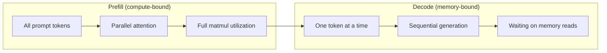
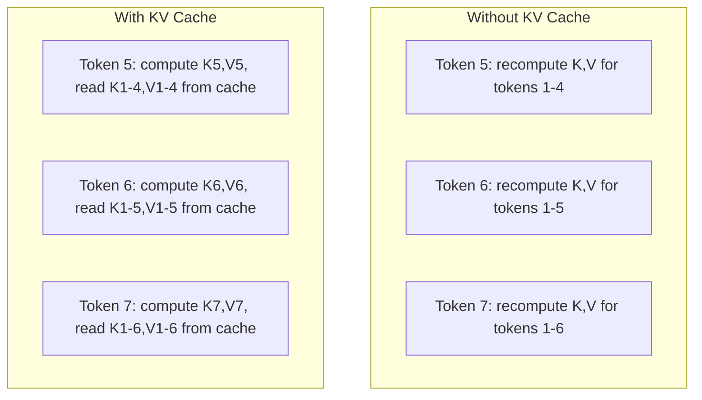
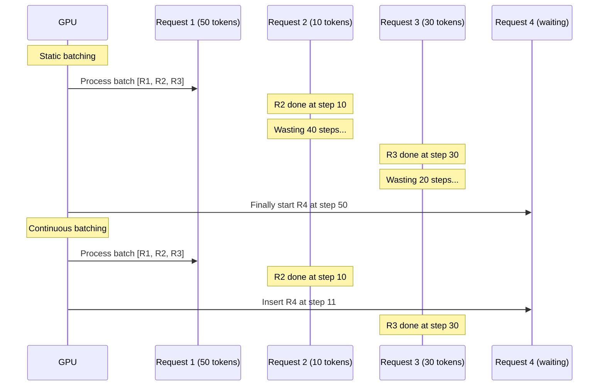
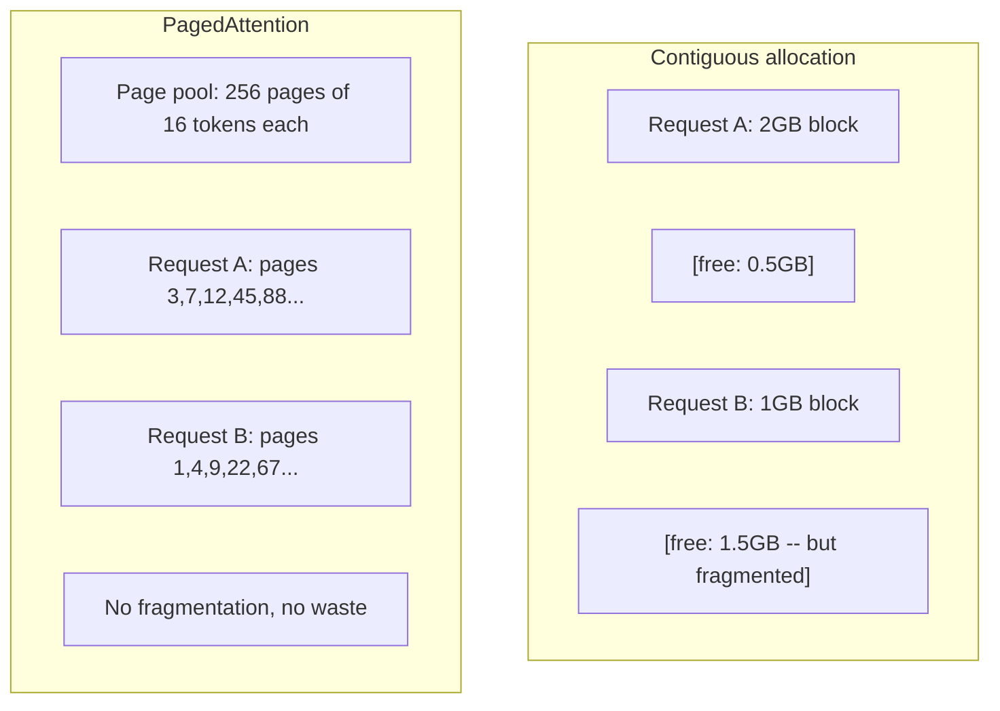
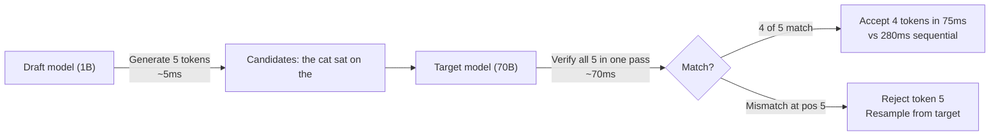

# Inference Optimization | 推理优化

> Two phases define LLM inference. Prefill processes your prompt in parallel -- compute-bound. Decode generates tokens one at a time -- memory-bound. Every optimization targets one or both.

> **【中文解读】** LLM 推理分两个阶段：预填充（并行处理 prompt，计算密集）和解码（逐 token 生成，显存带宽密集）。KV-cache、连续批处理、投机解码都是针对这两个阶段的优化。

> **【拓展：推理优化→生产部署】** vLLM、TensorRT-LLM、TGI 等推理框架都实现了 KV-cache 管理、连续批处理 (continuous batching)、PagedAttention 等优化。理解这些技术是将大模型部署到生产环境的关键。

**Type:** Build
**Languages:** Python
**Prerequisites:** Phase 10, Lessons 01-08 (Transformer architecture, attention)
**Time:** ~120 minutes

## Learning Objectives

- Implement KV-cache to eliminate redundant computation during autoregressive token generation
- Explain the prefill vs decode phases of LLM inference and why each has different bottlenecks (compute-bound vs memory-bound)
- Implement continuous batching and PagedAttention concepts to maximize GPU utilization under concurrent requests
- Compare inference optimization techniques (KV-cache, speculative decoding, flash attention) and their throughput/latency tradeoffs

> **【中文解读】** 学习目标：1) 实现 KV 缓存消除自回归生成中的冗余计算；2) 理解预填充（计算密集）与解码（显存带宽密集）的瓶颈差异；3) 实现连续批处理和 PagedAttention 概念；4) 对比各种推理优化技术的吞吐/延迟权衡。

## The Problem

You deploy Llama 3 70B on 4xA100 GPUs. A single user gets ~50 tokens per second. Feels fast. Then 100 users hit the endpoint simultaneously. Throughput drops to 3 tokens/second/user. Your $25,000/month GPU bill is serving responses slower than a human types.

The model itself does not change between 1 user and 100 users. Same weights, same architecture, same math. What changes is how you schedule the work. Naive inference wastes 90%+ of available GPU compute. A user waiting for token 47 holds an entire batch slot open while the GPU memory bus sits idle between matmuls. Meanwhile, a new user's 2,000-token prompt could fill that dead time with useful compute.

This is not a scaling problem. It is a scheduling problem. The techniques in this lesson -- KV caching, continuous batching, PagedAttention, speculative decoding, prefix caching -- are what separate a $25k/month inference bill from a $5k/month one serving the same traffic.

> **【中文解读】** 这不是扩展问题，而是调度问题。当 100 个用户同时请求时，朴素推理浪费 90%+ 的 GPU 算力——一个等待第 47 个 token 的请求空占整个批次槽位，而 GPU 的内存总线在矩阵乘法之间空闲。KV 缓存、连续批处理、PagedAttention、投机解码、前缀缓存等技术，是将推理成本从 $25K/月降到 $5K/月的关键。

vLLM serving Llama 3 70B on 4xA100-80GB achieves ~50 tokens/second/user at low concurrency, and sustains 15-25 TPS/user at 100 concurrent requests through continuous batching and PagedAttention. Without these optimizations, the same hardware serves 5 TPS/user at that concurrency. Same GPUs, same model, 4x the throughput.

## The Concept

### Prefill vs Decode

Every LLM inference request has two distinct phases.

> **【中文解读】** 预填充（Prefill）并行处理全部输入 token，是大规模矩阵乘法，GPU 核心保持忙碌——计算密集。解码（Decode）逐 token 生成，每次前向传播只产生一个 token，GPU 核心微秒级完成计算后等待下一批权重从显存加载——显存带宽密集。A100 的 ops:byte 交叉点约为 156，低于此值为带宽瓶颈，高于此值为计算瓶颈。

**Prefill** processes the entire input prompt. All tokens are known, so attention can be computed in parallel across the full sequence. This is a large matrix multiplication -- GPU cores stay busy. The bottleneck is compute: how many FLOPS your hardware can deliver per second. An A100 does 312 TFLOPS (BF16). Prefill for a 4,096-token prompt on a 70B model takes ~400ms on a single A100.

**Decode** generates output tokens one at a time. Each new token attends to all previous tokens, but only one token is produced per forward pass. The weight matrices are the same size as during prefill, but you are multiplying them by a single vector instead of a matrix. The GPU cores finish in microseconds, then wait for the next batch of weights to arrive from memory. The bottleneck is memory bandwidth: how fast you can stream model weights from HBM to the compute units. An A100 has 2 TB/s bandwidth. A 70B model in FP16 is 140 GB. Reading the full model once takes 70ms -- that is your floor for a single decode step.



The **ops:byte ratio** (also called arithmetic intensity) captures this tradeoff. It measures how many operations you perform per byte loaded from memory.

```
ops:byte ratio = FLOPs per token / bytes read from memory
```

During prefill with a batch of 4,096 tokens, you perform ~4,096 multiply-accumulate operations per weight loaded. The ratio is high -- you are compute-bound. During decode with batch size 1, you perform ~1 operation per weight loaded. The ratio is low -- you are memory-bound.

The fundamental insight: *decode is memory-bound because you read the entire model to produce a single token*. Every optimization below either reduces what you read, increases the batch of tokens processed per read, or avoids reads entirely.

### KV Cache

During attention, each token's query attends to every previous token's key and value vectors. Without caching, generating token N requires recomputing the key and value projections for all N-1 preceding tokens. Token 1 gets projected when generating token 2, then again for token 3, then again for token 4. By token 1,000, you have projected token 1 a total of 999 times.

> **【中文解读】** KV 缓存存储所有先前 token 的 Key/Value 投影。生成第 N 个 token 时，只计算第 N 个 token 的 K/V，然后与缓存的 K/V 拼接。以 Llama 3 70B 为例，每个 token 的 KV 缓存占 320KB，在 128K 上下文长度下一个对话就需 40GB——这解释了为什么 KV 缓存管理是推理优化的核心挑战。

The KV cache stores the key and value projections from all previous tokens. When generating token N, you only compute the key and value for token N, then concatenate them with the cached K/V from tokens 1 through N-1.



**Memory formula for KV cache:**

```
KV cache size = 2 * num_layers * num_kv_heads * head_dim * seq_len * bytes_per_param
```

For Llama 3 70B (80 layers, 8 KV heads with GQA, head_dim=128, BF16):

```
per token: 2 * 80 * 8 * 128 * 2 bytes = 327,680 bytes = 320 KB
at 4,096 tokens: 320 KB * 4,096 = 1.28 GB
at 128K tokens: 320 KB * 131,072 = 40 GB
```

A single 128K-context conversation for Llama 3 70B consumes 40 GB of KV cache -- half an A100's memory. With 100 concurrent users at 4K tokens each, KV cache alone requires 128 GB. This is why KV cache management is the central challenge of inference optimization.

### Continuous Batching

Static batching waits until a batch of N requests arrives, processes them together, and waits until *all* finish before accepting new requests. If one request needs 500 tokens and another needs 10, the short request sits idle for 490 decode steps after it finishes.

> **【中文解读】** 静态批处理等待整批请求完成后才接受新请求——短请求被迫等待长请求。连续批处理（iteration-level batching）在每个解码步重新评估批次，一个请求完成后立即插入等待中的新请求。在输出长度差异大的场景中，连续批处理可提供 2-5 倍吞吐提升。

Continuous batching (also called iteration-level batching) inserts new requests into the batch as soon as any request completes. The batch is reevaluated at every decode step. A request that finishes after 10 tokens is immediately replaced by a waiting request.



The throughput improvement depends on how much output lengths vary. With uniform lengths, continuous batching matches static batching. With variable lengths (the common case), continuous batching can deliver 2-5x higher throughput because GPU slots never sit empty.

### PagedAttention

The KV cache for each request is a contiguous block of memory. As requests arrive and depart, memory fragments -- exactly like RAM fragmentation in operating systems. A 4K-token request needs 1.28 GB contiguous. Even if you have 2 GB free total, you might not have 1.28 GB *contiguous*. You either waste memory or reject the request.

> **【中文解读】** PagedAttention 将操作系统的虚拟内存概念应用于 KV 缓存：用固定大小的"页面"（通常 16 个 token/页）替代连续内存块，通过页表映射逻辑位置到物理位置。这消除了内存碎片，并支持写时复制（copy-on-write）——50 个请求共享同一系统提示只需一份 KV 缓存。vLLM 通过 PagedAttention 实现了接近零的内存浪费（~4% vs 朴素分配的 60-80%）。

PagedAttention (from vLLM) applies OS-style virtual memory to KV cache. Instead of allocating one contiguous block per request, it allocates fixed-size "pages" (typically 16 tokens each). Pages can be anywhere in physical GPU memory. A page table maps each request's logical sequence positions to physical page locations.



PagedAttention also enables **copy-on-write** for shared prefixes. If 50 requests share the same system prompt, the KV cache pages for that system prompt are stored once and referenced by all 50 requests. Only when a request diverges (different user messages) does it get its own pages. This cuts memory usage dramatically for applications with shared system prompts.

vLLM reports near-zero memory waste (~4% vs ~60-80% in naive allocation) through PagedAttention.

### Speculative Decoding

Decode is slow because it is sequential -- you generate one token, feed it back, generate the next. But what if you could guess the next 5 tokens cheaply, then verify them all at once?

> **【中文解读】** 投机解码的核心思想：用小型快速模型（draft model）猜测 K 个 token，大型目标模型一次性验证所有候选——这看起来像预填充（并行、计算密集、高效）。如果目标模型同意，则在一次前向传播的时间接受多个 token。Llama 3 8B 为 Llama 3 70B 做草稿时，接受率通常 70-85%，带来 2-3 倍加速。关键特性：输出分布与目标模型数学等价，不是近似。

> **【拓展：投机解码 → EAGLE/Medusa】** EAGLE 在目标模型的隐藏状态上训练轻量级自回归头，接受率 75-90%，额外参数仅约 1%。Medusa 则给模型添加多个预测头，每步预测多个候选 token。两者都是 2024-2025 年投机解码的主流方案。

Speculative decoding uses a small, fast **draft model** to generate K candidate tokens. The large **target model** then processes all K candidates in a single forward pass (which looks like a prefill -- parallel, compute-bound, efficient). If the target model agrees with the draft model's predictions, you accept all K tokens in the time of one target forward pass. If it disagrees at position j, you accept tokens 1 through j-1 and discard the rest.



The speedup depends on the **acceptance rate** -- how often the draft model's predictions match the target. For a Llama 3 8B drafting for Llama 3 70B, acceptance rates of 70-85% are typical on natural language. This translates to 2-3x decode speedup.

Three approaches to speculative decoding:

| Method | Draft source | Acceptance rate | Overhead |
|--------|-------------|-----------------|----------|
| Draft-target (Leviathan et al.) | Separate small model | 70-85% | Draft model memory |
| EAGLE (Li et al.) | Lightweight head on target | 75-90% | ~1% extra parameters |
| N-gram lookup | Token n-gram table | 40-60% | Negligible |

**EAGLE** trains a small autoregressive head on top of the target model's hidden states. It predicts the next token's embedding using the target model's second-to-last layer features. Because it operates on the target model's own representations (not a separate model's), it achieves higher acceptance rates with minimal extra memory. EAGLE-2 adds a dynamic draft tree that adjusts candidate count based on context.

**N-gram speculative decoding** maintains a table of n-gram continuations from the current context or a prebuilt corpus. If the draft matches what appeared before in the same conversation (repetitive patterns, code, structured output), it fires with zero neural network overhead. Acceptance rates are lower on average but the cost per speculation is essentially free.

Speculative decoding is *mathematically exact* -- the output distribution is identical to the target model's distribution. It is not an approximation. The verification step ensures that every accepted token has exactly the probability the target model would have assigned.

### Prefix Caching

Many requests share the same prefix. A chatbot system prompt. A RAG context block. A few-shot example set. Without prefix caching, every request recomputes the KV cache for these shared tokens from scratch.

> **【中文解读】** 前缀缓存存储公共前缀（系统提示、RAG 上下文、少样本示例）的 KV 缓存并在请求间复用。2000 token 的系统提示，每 100 请求/秒可省 40 秒 GPU 计算/秒——超过一块 GPU 的工作量。SGLang 的 RadixAttention 用基数树（trie）索引前缀，支持部分匹配。

Prefix caching stores the KV cache for common prefixes and reuses it across requests. When a new request arrives with a known prefix, the system copies (or references) the cached KV entries and only computes the KV for the unique suffix.

For a 2,000-token system prompt shared across all requests, prefix caching eliminates ~400ms of prefill per request. At 100 requests/second, that saves 40 seconds of GPU compute per second -- more than one GPU's worth of work.

SGLang's RadixAttention implements prefix caching with a radix tree (trie) that indexes prefixes by their token content. Any request matching a stored prefix gets its KV cache for free. The tree enables partial prefix matches -- if you share 1,500 of 2,000 prefix tokens with a cached entry, you reuse those 1,500 and recompute only 500.

### Inference Engines

Three engines dominate production LLM serving:

> **【中文解读】** 三大生产推理引擎：vLLM（PagedAttention + 连续批处理，兼容性最广）、SGLang（RadixAttention 前缀缓存 + 结构化生成，多轮对话场景优于 vLLM 2-5 倍）、TensorRT-LLM（NVIDIA 专用内核融合 + FP8，单 GPU 吞吐最高但仅限 NVIDIA）。Llama 3 70B 在 4xA100 上：vLLM ~2500 TPS，SGLang ~3200 TPS，TensorRT-LLM ~3000 TPS（100 并发用户）。

| Engine | Key innovation | Best for |
|--------|---------------|----------|
| vLLM | PagedAttention, continuous batching | General-purpose serving, highest compatibility |
| SGLang | RadixAttention (prefix caching), structured generation | Multi-turn chatbots, constrained decoding |
| TensorRT-LLM | NVIDIA kernel fusion, FP8 quantization | Maximum single-GPU throughput on NVIDIA hardware |

**vLLM** is the default starting point. It supports the widest range of models, runs on any GPU vendor (NVIDIA, AMD, Intel), and achieves strong throughput through PagedAttention + continuous batching. The OpenAI-compatible API means you can drop it in as a replacement for any OpenAI API call.

**SGLang** builds on the same foundations as vLLM but adds RadixAttention for prefix caching and a domain-specific language for structured LLM programs. If your workload involves multi-turn conversations, tool use, or constrained decoding (JSON output, regex-guided generation), SGLang often outperforms vLLM by 2-5x through prefix reuse.

**TensorRT-LLM** compiles models into optimized NVIDIA GPU kernels. It fuses operations (attention + linear + activation in one kernel), uses FP8 on H100 GPUs, and integrates with NVIDIA Triton Inference Server for production deployment. It achieves the highest single-GPU throughput on NVIDIA hardware but requires more setup and only works on NVIDIA GPUs.

Real-world numbers for Llama 3 70B (4xA100-80GB, BF16):

| Metric | vLLM | SGLang | TensorRT-LLM |
|--------|------|--------|---------------|
| Throughput (1 user) | ~50 TPS | ~55 TPS | ~65 TPS |
| Throughput (100 users) | ~2,500 total TPS | ~3,200 total TPS | ~3,000 total TPS |
| Time to first token | ~400ms | ~300ms (prefix hit) | ~350ms |
| Max context | 128K | 128K | 128K |

### The Ops:Byte Framework

You cannot optimize what you do not measure. The ops:byte ratio tells you whether you are compute-bound or memory-bound, which determines which optimizations matter.

> **【中文解读】** Ops:Byte 框架（运算/字节比）判断工作负载瓶颈：低比值（解码、小批次）→ 显存带宽瓶颈，需量化/批处理；高比值（预填充、大批次）→ 计算瓶颈，需内核融合/低精度。A100 交叉点约 156。连续批处理通过打包更多 token 到每次迭代来推高解码的 ops:byte 比。

```
Compute roof: peak FLOPS of the GPU
Memory roof:  peak bandwidth * ops:byte ratio
```

When ops:byte is low (decode, small batches), you hit the memory bandwidth roof. Adding more compute (higher clock, more cores) does not help. You need to reduce memory reads (quantization, KV cache compression) or increase the batch size to amortize reads across more useful work.

When ops:byte is high (prefill, large batches), you hit the compute roof. Memory bandwidth optimization does not help. You need faster GPUs, kernel fusion, or reduced precision to squeeze more FLOPS.

| Scenario | ops:byte | Bound | Optimize with |
|----------|----------|-------|---------------|
| Prefill, batch=1 | ~4,096 | Compute | Kernel fusion, FP8 |
| Decode, batch=1 | ~1 | Memory | Quantization, KV compression |
| Decode, batch=32 | ~32 | Memory | Larger batch, continuous batching |
| Decode, batch=256 | ~256 | Transitioning | Both matter |
| Decode, batch=1024 | ~1,024 | Compute | Kernel fusion, tensor parallelism |

The crossover point on A100 is around ops:byte = 156 (312 TFLOPS / 2 TB/s). Below 156, you are memory-bound. Above 156, you are compute-bound. Continuous batching pushes decode toward this crossover by packing more tokens per iteration.

## Build It

> **【中文解读】** 构建部分实现了六大核心组件：KV 缓存、带 KV 缓存的注意力、连续批处理模拟器、前缀缓存（Trie 实现）、投机解码模拟器、KV 缓存内存分析器。所有代码使用纯 NumPy，便于理解底层原理。

### Step 1: KV Cache from Scratch

We build a multi-head KV cache that stores key and value projections per layer, per head, and demonstrates the memory growth pattern.

```python
import numpy as np

class KVCache:
    def __init__(self, num_layers, num_heads, head_dim, max_seq_len, dtype=np.float16):
        self.num_layers = num_layers
        self.num_heads = num_heads
        self.head_dim = head_dim
        self.max_seq_len = max_seq_len
        self.dtype = dtype

        self.k_cache = np.zeros(
            (num_layers, num_heads, max_seq_len, head_dim), dtype=dtype
        )
        self.v_cache = np.zeros(
            (num_layers, num_heads, max_seq_len, head_dim), dtype=dtype
        )
        self.seq_len = 0

    def update(self, layer_idx, new_keys, new_values):
        num_new = new_keys.shape[1]
        end = self.seq_len + num_new
        self.k_cache[layer_idx, :, self.seq_len:end, :] = new_keys
        self.v_cache[layer_idx, :, self.seq_len:end, :] = new_values
        return (
            self.k_cache[layer_idx, :, :end, :],
            self.v_cache[layer_idx, :, :end, :]
        )

    def advance(self, num_tokens):
        self.seq_len += num_tokens

    def memory_bytes(self):
        return self.k_cache.nbytes + self.v_cache.nbytes

    def used_bytes(self):
        per_token = 2 * self.num_layers * self.num_heads * self.head_dim * np.dtype(self.dtype).itemsize
        return per_token * self.seq_len
```

### Step 2: Attention with KV Cache

A simplified multi-head attention that uses the KV cache for decode steps.

```python
def scaled_dot_product_attention(query, keys, values):
    head_dim = query.shape[-1]
    scores = np.matmul(query, keys.transpose(0, 1, 3, 2)) / np.sqrt(head_dim)
    seq_len_q = scores.shape[-2]
    seq_len_k = scores.shape[-1]
    if seq_len_q > 1:
        mask = np.triu(np.ones((seq_len_q, seq_len_k), dtype=np.float32), k=seq_len_k - seq_len_q + 1)
        scores = scores + mask * (-1e9)
    max_scores = np.max(scores, axis=-1, keepdims=True)
    exp_scores = np.exp(scores - max_scores)
    attn_weights = exp_scores / np.sum(exp_scores, axis=-1, keepdims=True)
    return np.matmul(attn_weights, values)


class MultiHeadAttention:
    def __init__(self, d_model, num_heads):
        self.num_heads = num_heads
        self.head_dim = d_model // num_heads
        scale = np.sqrt(2.0 / d_model)
        self.W_q = np.random.randn(d_model, d_model).astype(np.float32) * scale
        self.W_k = np.random.randn(d_model, d_model).astype(np.float32) * scale
        self.W_v = np.random.randn(d_model, d_model).astype(np.float32) * scale
        self.W_o = np.random.randn(d_model, d_model).astype(np.float32) * scale

    def forward(self, x, kv_cache=None, layer_idx=0):
        batch, seq_len, d_model = x.shape
        Q = np.matmul(x, self.W_q).reshape(batch, seq_len, self.num_heads, self.head_dim).transpose(0, 2, 1, 3)
        K = np.matmul(x, self.W_k).reshape(batch, seq_len, self.num_heads, self.head_dim).transpose(0, 2, 1, 3)
        V = np.matmul(x, self.W_v).reshape(batch, seq_len, self.num_heads, self.head_dim).transpose(0, 2, 1, 3)

        if kv_cache is not None:
            K_full, V_full = kv_cache.update(layer_idx, K[0], V[0])
            K = K_full[np.newaxis, :, :, :]
            V = V_full[np.newaxis, :, :, :]
            if seq_len == 1:
                kv_cache.advance(1)

        attn_out = scaled_dot_product_attention(Q, K, V)
        attn_out = attn_out.transpose(0, 2, 1, 3).reshape(batch, -1, d_model)
        return np.matmul(attn_out, self.W_o)
```

### Step 3: Continuous Batching Simulator

This simulates the scheduling difference between static and continuous batching.

```python
import heapq

class Request:
    def __init__(self, request_id, prompt_tokens, output_tokens, arrival_step):
        self.request_id = request_id
        self.prompt_tokens = prompt_tokens
        self.output_tokens = output_tokens
        self.arrival_step = arrival_step
        self.tokens_generated = 0
        self.start_step = None
        self.end_step = None

    def is_done(self):
        return self.tokens_generated >= self.output_tokens


def simulate_static_batching(requests, batch_size):
    step = 0
    completed = []
    queue = list(requests)
    queue.sort(key=lambda r: r.arrival_step)

    while queue:
        batch = []
        while queue and len(batch) < batch_size:
            r = queue.pop(0)
            r.start_step = max(step, r.arrival_step)
            batch.append(r)

        if batch:
            step = max(step, max(r.start_step for r in batch))
            max_output = max(r.output_tokens for r in batch)
            for r in batch:
                r.tokens_generated = r.output_tokens
                r.end_step = step + max_output
            step += max_output
            completed.extend(batch)

    return completed


def simulate_continuous_batching(requests, batch_size):
    step = 0
    completed = []
    queue = sorted(requests, key=lambda r: r.arrival_step)
    queue_idx = 0
    active = []
    waiting = []

    while queue_idx < len(queue) or active or waiting:
        while queue_idx < len(queue) and queue[queue_idx].arrival_step <= step:
            waiting.append(queue[queue_idx])
            queue_idx += 1

        while waiting and len(active) < batch_size:
            r = waiting.pop(0)
            r.start_step = step
            active.append(r)

        if not active:
            if waiting:
                step += 1
                continue
            elif queue_idx < len(queue):
                step = queue[queue_idx].arrival_step
                continue
            else:
                break

        for r in active:
            r.tokens_generated += 1

        done = [r for r in active if r.is_done()]
        for r in done:
            r.end_step = step + 1
            completed.append(r)
        active = [r for r in active if not r.is_done()]

        step += 1

    return completed


def batching_stats(completed):
    latencies = [r.end_step - r.arrival_step for r in completed]
    total_time = max(r.end_step for r in completed) - min(r.arrival_step for r in completed)
    total_tokens = sum(r.output_tokens for r in completed)
    return {
        "avg_latency": np.mean(latencies),
        "p50_latency": np.median(latencies),
        "p99_latency": np.percentile(latencies, 99),
        "total_time": total_time,
        "throughput": total_tokens / total_time if total_time > 0 else 0,
    }
```

### Step 4: Prefix Cache

A trie-based prefix cache that stores KV entries for shared prefixes.

```python
class TrieNode:
    def __init__(self):
        self.children = {}
        self.kv_data = None
        self.hit_count = 0


class PrefixCache:
    def __init__(self, max_entries=1000):
        self.root = TrieNode()
        self.max_entries = max_entries
        self.total_entries = 0
        self.hits = 0
        self.misses = 0

    def _walk(self, token_ids):
        node = self.root
        depth = 0
        for tid in token_ids:
            if tid not in node.children:
                break
            node = node.children[tid]
            depth += 1
        return node, depth

    def lookup(self, token_ids):
        node, depth = self._walk(token_ids)
        if depth > 0:
            self.hits += 1
            current = self.root
            for tid in token_ids[:depth]:
                current = current.children[tid]
                current.hit_count += 1
            kv_entries = []
            current = self.root
            for tid in token_ids[:depth]:
                current = current.children[tid]
                if current.kv_data is not None:
                    kv_entries.append(current.kv_data)
            return depth, kv_entries
        self.misses += 1
        return 0, []

    def insert(self, token_ids, kv_per_token):
        node = self.root
        for i, tid in enumerate(token_ids):
            if tid not in node.children:
                if self.total_entries >= self.max_entries:
                    return i
                node.children[tid] = TrieNode()
                self.total_entries += 1
            node = node.children[tid]
            if i < len(kv_per_token):
                node.kv_data = kv_per_token[i]
        return len(token_ids)

    def hit_rate(self):
        total = self.hits + self.misses
        return self.hits / total if total > 0 else 0.0
```

### Step 5: Speculative Decoding Simulator

We simulate draft-target speculative decoding with configurable acceptance rates.

```python
class DraftModel:
    def __init__(self, vocab_size, acceptance_rate=0.8):
        self.vocab_size = vocab_size
        self.acceptance_rate = acceptance_rate

    def generate(self, context, num_tokens):
        tokens = np.random.randint(0, self.vocab_size, size=num_tokens)
        return tokens

    def get_probs(self, context, token):
        probs = np.random.dirichlet(np.ones(self.vocab_size))
        return probs


class TargetModel:
    def __init__(self, vocab_size):
        self.vocab_size = vocab_size

    def get_probs(self, context, tokens=None):
        if tokens is not None:
            return [np.random.dirichlet(np.ones(self.vocab_size)) for _ in tokens]
        return np.random.dirichlet(np.ones(self.vocab_size))


def speculative_decode(draft_model, target_model, context, num_speculative=5,
                       draft_cost=1.0, target_cost=10.0, verify_cost=12.0):
    total_tokens = 0
    total_cost = 0.0
    accepted_counts = []
    context = list(context)

    max_tokens = 100

    while total_tokens < max_tokens:
        draft_tokens = draft_model.generate(context, num_speculative)
        total_cost += draft_cost * num_speculative

        target_probs = target_model.get_probs(context, draft_tokens)
        total_cost += verify_cost

        accepted = 0
        for i, token in enumerate(draft_tokens):
            draft_p = draft_model.get_probs(context + list(draft_tokens[:i]), token)
            target_p = target_probs[i]

            r = np.random.random()
            acceptance_prob = min(1.0, target_p[token] / (draft_p[token] + 1e-10))

            if r < draft_model.acceptance_rate:
                accepted += 1
                context.append(token)
                total_tokens += 1
            else:
                new_token = np.random.choice(draft_model.vocab_size, p=target_p)
                context.append(new_token)
                total_tokens += 1
                break

        accepted_counts.append(accepted)

        if accepted == num_speculative:
            bonus_probs = target_model.get_probs(context)
            bonus_token = np.random.choice(draft_model.vocab_size, p=bonus_probs)
            context.append(bonus_token)
            total_tokens += 1

    sequential_cost = total_tokens * target_cost
    return {
        "total_tokens": total_tokens,
        "speculative_cost": total_cost,
        "sequential_cost": sequential_cost,
        "speedup": sequential_cost / total_cost if total_cost > 0 else 1.0,
        "avg_accepted": np.mean(accepted_counts),
        "acceptance_rate": np.mean(accepted_counts) / num_speculative,
    }


def compare_speculation_strategies(vocab_size=1000, num_trials=20):
    results = {}

    for name, acceptance_rate, spec_tokens in [
        ("Draft-target (8B->70B)", 0.78, 5),
        ("EAGLE", 0.85, 6),
        ("N-gram", 0.50, 4),
        ("No speculation", 0.0, 0),
    ]:
        if spec_tokens == 0:
            results[name] = {
                "speedup": 1.0,
                "acceptance_rate": 0.0,
                "avg_accepted": 0.0,
            }
            continue

        trial_results = []
        for _ in range(num_trials):
            draft = DraftModel(vocab_size, acceptance_rate=acceptance_rate)
            target = TargetModel(vocab_size)
            context = list(np.random.randint(0, vocab_size, size=10))
            result = speculative_decode(draft, target, context, num_speculative=spec_tokens)
            trial_results.append(result)

        results[name] = {
            "speedup": np.mean([r["speedup"] for r in trial_results]),
            "acceptance_rate": np.mean([r["acceptance_rate"] for r in trial_results]),
            "avg_accepted": np.mean([r["avg_accepted"] for r in trial_results]),
        }

    return results
```

### Step 6: KV Cache Memory Profiler

Compute KV cache memory requirements for real model configurations.

```python
MODEL_CONFIGS = {
    "Llama-3-8B": {
        "num_layers": 32, "num_kv_heads": 8, "head_dim": 128,
        "model_params_b": 8, "gqa": True,
    },
    "Llama-3-70B": {
        "num_layers": 80, "num_kv_heads": 8, "head_dim": 128,
        "model_params_b": 70, "gqa": True,
    },
    "Llama-3-405B": {
        "num_layers": 126, "num_kv_heads": 8, "head_dim": 128,
        "model_params_b": 405, "gqa": True,
    },
    "Mistral-7B": {
        "num_layers": 32, "num_kv_heads": 8, "head_dim": 128,
        "model_params_b": 7, "gqa": True,
    },
    "GPT-4-est": {
        "num_layers": 120, "num_kv_heads": 96, "head_dim": 128,
        "model_params_b": 1800, "gqa": False,
    },
}


def kv_cache_memory(config, seq_len, dtype_bytes=2):
    per_token = 2 * config["num_layers"] * config["num_kv_heads"] * config["head_dim"] * dtype_bytes
    total = per_token * seq_len
    return {
        "per_token_bytes": per_token,
        "per_token_kb": per_token / 1024,
        "total_bytes": total,
        "total_mb": total / (1024 ** 2),
        "total_gb": total / (1024 ** 3),
    }


def memory_budget(config, gpu_memory_gb, model_dtype_bytes=2, kv_dtype_bytes=2):
    model_memory_gb = config["model_params_b"] * 1e9 * model_dtype_bytes / (1024 ** 3)
    overhead_gb = gpu_memory_gb * 0.1
    available_for_kv = gpu_memory_gb - model_memory_gb - overhead_gb

    if available_for_kv <= 0:
        return {"error": "Model does not fit in GPU memory", "model_memory_gb": model_memory_gb}

    per_token = 2 * config["num_layers"] * config["num_kv_heads"] * config["head_dim"] * kv_dtype_bytes
    max_tokens = int(available_for_kv * (1024 ** 3) / per_token)

    return {
        "gpu_memory_gb": gpu_memory_gb,
        "model_memory_gb": round(model_memory_gb, 1),
        "overhead_gb": round(overhead_gb, 1),
        "available_for_kv_gb": round(available_for_kv, 1),
        "max_total_tokens": max_tokens,
        "max_users_at_2k": max_tokens // 2048,
        "max_users_at_4k": max_tokens // 4096,
        "max_users_at_32k": max_tokens // 32768,
    }
```

## Use It

With vLLM:

```python
from vllm import LLM, SamplingParams

llm = LLM(
    model="meta-llama/Llama-3-70B-Instruct",
    tensor_parallel_size=4,
    enable_prefix_caching=True,
    max_model_len=8192,
    gpu_memory_utilization=0.9,
)

params = SamplingParams(temperature=0.7, max_tokens=256)
outputs = llm.generate(["Explain inference optimization in one paragraph."], params)
```

With SGLang for prefix caching + structured output:

```python
import sglang as sgl

@sgl.function
def classify(s, text):
    s += sgl.system("You are a classifier. Output JSON only.")
    s += sgl.user(f"Classify this text: {text}")
    s += sgl.assistant(sgl.gen("result", regex=r'\{"label": "(positive|negative|neutral)"\}'))

runtime = sgl.Runtime(model_path="meta-llama/Llama-3-70B-Instruct", tp_size=4)
sgl.set_default_backend(runtime)

results = classify.run_batch([
    {"text": "This product is amazing!"},
    {"text": "Terrible experience."},
    {"text": "It was okay I guess."},
])
```

With TensorRT-LLM:

```python
import tensorrt_llm
from tensorrt_llm.runtime import ModelRunner

runner = ModelRunner.from_dir("./llama-70b-trt-engine/", rank=0)

outputs = runner.generate(
    batch_input_ids=[tokenizer.encode("Explain KV caching.")],
    max_new_tokens=256,
    temperature=0.7,
)
```

## Ship It

This lesson produces:
- `outputs/skill-inference-optimization.md` -- a skill for diagnosing and optimizing LLM inference serving

## Exercises

1. Modify the KV cache profiler to compare FP16 vs FP8 vs INT4 KV cache quantization. For Llama 3 70B at 4K context, compute the max concurrent users for each on 4xA100-80GB. KV quantization to INT4 should roughly 4x the user capacity.

2. Extend the continuous batching simulator to track GPU utilization (fraction of batch slots filled per step). Plot utilization over time for both static and continuous batching with 50 requests whose output lengths follow a Pareto distribution (shape=1.5, scale=20). Continuous batching should maintain >80% utilization.

3. Implement a grouped-query attention (GQA) version of the KV cache where `num_kv_heads < num_query_heads`. Llama 3 70B uses 64 query heads but only 8 KV heads. Compute the memory savings vs full multi-head attention (8x reduction in KV cache size).

4. Build a prefix cache that uses LRU eviction. Set max_entries to 500 and generate 1,000 requests where 60% share one of 5 common prefixes. Measure hit rate and compare to unlimited cache. With good eviction, hit rate should stay above 55%.

5. Extend the speculative decoding simulator to implement tree-based speculation (EAGLE-2 style). Instead of a single chain of K draft tokens, generate a tree of candidates (e.g., 2 branches at each of 3 levels = 8 leaf candidates). Compare total tokens accepted per verification round vs linear speculation.

## Key Terms

| Term | What people say | What it actually means | 中文释义 |
|------|----------------|----------------------|---------|
| Prefill | "Processing the prompt" | Computing attention over all input tokens in parallel -- compute-bound because the full matrix multiplication keeps GPU cores busy | 预填充，并行处理输入，计算密集 |
| Decode | "Generating tokens" | Producing one token per forward pass, reading the full model weights each time -- memory-bound because compute finishes before the next weights arrive | 解码，逐 token 生成，显存带宽密集 |
| KV cache | "Caching attention states" | Storing the key and value projections for all previous tokens so they are not recomputed at each decode step -- trades memory for compute | KV 缓存，用显存换计算 |
| Continuous batching | "Dynamic batching" | Inserting new requests into the running batch as soon as any request finishes, evaluated at every decode iteration rather than waiting for the whole batch | 连续批处理，迭代级调度 |
| PagedAttention | "Virtual memory for KV cache" | Allocating KV cache in fixed-size pages instead of contiguous blocks, eliminating memory fragmentation and enabling copy-on-write for shared prefixes | 分页注意力，类虚拟内存管理 |
| Speculative decoding | "Draft and verify" | Using a fast draft model to propose multiple tokens, then verifying them all in one target model forward pass -- mathematically exact, 2-3x speedup | 投机解码，草稿-验证模式 |
| EAGLE | "Self-speculative decoding" | A speculative decoding variant that trains a lightweight head on the target model's own hidden states, achieving higher acceptance rates than a separate draft model | 自投机解码，接受率 75-90% |
| Prefix caching | "Reusing system prompt KV" | Storing computed KV cache entries for common prefixes (system prompts, few-shot examples) and reusing them across requests to skip redundant prefill | 前缀缓存，复用公共前缀 KV |
| Ops:byte ratio | "Arithmetic intensity" | The ratio of compute operations to memory bytes read -- determines whether a workload is compute-bound (high ratio) or memory-bound (low ratio) | 运算字节比，判断瓶颈类型 |
| Time to first token | "TTFT" | Latency from receiving a request to producing the first output token -- dominated by prefill time for long prompts | 首 token 延迟 |

## Further Reading

- Kwon et al., "Efficient Memory Management for Large Language Model Serving with PagedAttention" (2023) -- the vLLM paper that introduced paged KV cache management, now the industry standard for inference serving
- Leviathan et al., "Fast Inference from Transformers via Speculative Decoding" (2023) -- the foundational paper proving that draft-verify speculation produces exact target model distributions while achieving 2-3x speedup
- Li et al., "EAGLE: Speculative Sampling Requires Rethinking Feature Uncertainty" (2024) -- achieves higher acceptance rates by training a head on the target model's own features instead of using a separate draft model
- Zheng et al., "SGLang: Efficient Execution of Structured Language Model Programs" (2024) -- introduces RadixAttention for prefix caching and a programming model for multi-call LLM programs
- Williams et al., "Roofline: An Insightful Visual Performance Model for Multicore Architectures" (2009) -- the original roofline paper that formalized the ops:byte framework for reasoning about compute vs memory bottlenecks
