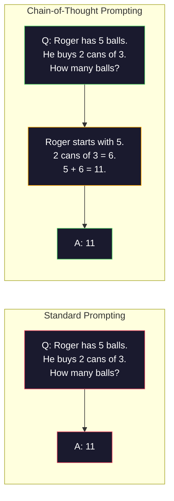
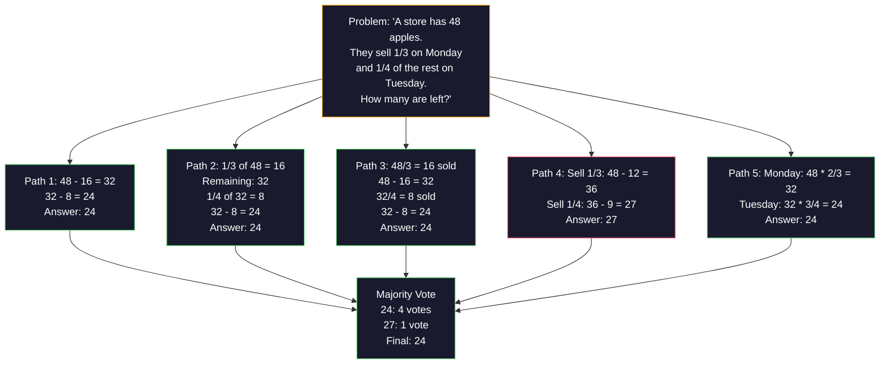
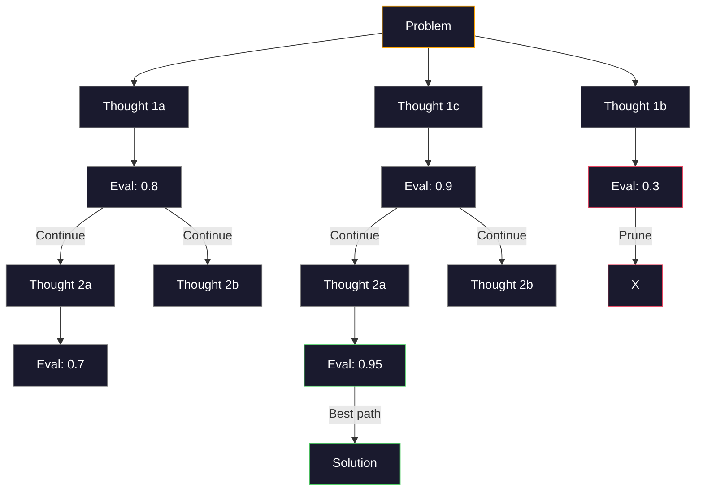

# Few-Shot, Chain-of-Thought, Tree-of-Thought | 少样本提示、链式思考与思维树

> Telling a model what to do is prompting. Showing it how to think is engineering. The gap between 78% and 91% accuracy on the same model, same task, same data is not a better model. It is a better reasoning strategy.

> **【中文解读】** 告诉模型"做什么"是提示，展示"如何思考"才是工程。从78%到91%的准确率提升不是靠更好的模型，而是靠更好的推理策略——少样本示例、链式思考、自我一致性投票等技术。

> **【拓展：推理策略→AI Agent】** CoT/ToT/ReAct 是现代 AI Agent 的推理基础。ReAct 的 Thought-Action-Observation 循环是 LangChain、CrewAI 等 Agent 框架的核心模式。

**Type:** Build
**Languages:** Python
**Prerequisites:** Lesson 11.01 (Prompt Engineering)
**Time:** ~45 minutes

## Learning Objectives | 学习目标

- Implement few-shot prompting by selecting and formatting example demonstrations that maximize task accuracy
  通过选择和格式化示例演示来实现少样本提示，最大化任务准确率
- Apply chain-of-thought (CoT) reasoning to improve accuracy on multi-step problems like math word problems
  应用链式思维（CoT）推理来提高多步骤问题（如数学应用题）的准确率
- Build a tree-of-thought prompt that explores multiple reasoning paths and selects the best one
  构建思维树提示，探索多条推理路径并选择最佳路径
- Measure the accuracy improvement from zero-shot vs few-shot vs CoT on a standard benchmark
  在标准基准上测量零样本 vs 少样本 vs CoT 的准确率提升

> **【中文解读】** 本课目标：掌握 Few-shot（在 prompt 中提供示例引导输出格式）和 Chain-of-Thought（要求模型一步步思考以提升推理能力）两大技术。CoT 是提升 LLM 推理性能最简单有效的方法之一。


## The Problem | 问题引入

You build a math tutoring app. Your prompt says: "Solve this word problem." GPT-5 gets it right 94% of the time on GSM8K, the standard grade-school math benchmark. You think you already peaked. You do not — chain-of-thought still adds 3-4 points.

> 你构建了一个数学辅导应用。你的提示说："解决这道应用题。"GPT-5 在 GSM8K（标准小学数学基准）上的正确率是 94%。你以为已经到顶了。其实并没有——链式思维仍然能再增加 3-4 个百分点。

Add five words -- "Let's think step by step" -- and accuracy jumps to 91%. Add a few worked examples and it reaches 95%. Same model. Same temperature. Same API cost. The only difference is that you gave the model scratch paper.

> 加上五个词——"Let's think step by step"——准确率就跳到 91%。加上几个已解答的示例就达到 95%。同样的模型，同样的温度，同样的 API 成本。唯一的区别是你给了模型草稿纸。

This is not a hack. It is how reasoning works. Humans do not solve multi-step problems in one mental leap. Neither do transformers. When you force a model to generate intermediate tokens, those tokens become part of the context for the next token. Each reasoning step feeds the next. The model literally computes its way to the answer.

> 这不是花招。这是推理的工作方式。人类不会一次性完成多步骤问题的推理。Transformer 也不会。当你强制模型生成中间 token 时，这些 token 就成为下一个 token 的上下文的一部分。每个推理步骤都在为下一步提供信息。模型确实是在通过计算来得出答案。

But "think step by step" is the beginning, not the end. What if you sampled five reasoning paths and took a majority vote? What if you let the model explore a tree of possibilities, evaluating and pruning branches? What if you interleaved reasoning with tool use? These are not hypotheticals. They are published techniques with measured improvements, and you will build all of them in this lesson.

> 但是"逐步思考"只是开始，不是终点。如果你采样五条推理路径然后进行多数投票会怎样？如果你让模型探索一棵可能性的树，评估和剪枝分支会怎样？如果你将推理与工具使用交替进行会怎样？这些不是假设。它们是已发表的、有量化改进的技术，你将在本课中构建所有这些技术。

## The Concept | 核心概念

> **【中文解读】** 少样本学习（Few-shot）和思维链（Chain-of-Thought, CoT）是 Prompt Engineering 的两大核心技术。Few-shot 通过在 prompt 中提供几个示例来引导模型输出格式；CoT 通过要求模型"一步步思考"来提升推理能力。

> **【拓展：CoT 的推理提升效果】** Google 2022 年的论文证明，在数学推理任务上，CoT 将 PaLM 540B 的准确率从 17% 提升到 56%。Auto-CoT（自动生成推理链）和 Tree-of-Thought（搜索多个推理路径）进一步提升了复杂推理的可靠性。o1 系列模型的"深度思考"本质上是自动化的 CoT。


### Zero-Shot vs Few-Shot: When Examples Beat Instructions

Zero-shot prompting gives the model a task and nothing else. Few-shot prompting gives it examples first.

> 零样本提示只给模型一个任务，不加其他内容。少样本提示则先给出示例。

Wei et al. (2022) measured this across 8 benchmarks. For simple tasks like sentiment classification, zero-shot and few-shot performed within 2% of each other. For complex tasks like multi-step arithmetic and symbolic reasoning, few-shot improved accuracy by 10-25%.

> Wei 等人（2022）在 8 个基准上测量了这一点。对于情感分类等简单任务，零样本和少样本的性能差异在 2% 以内。对于多步算术和符号推理等复杂任务，少样本将准确率提高了 10-25%。

The intuition: examples are compressed instructions. Instead of describing the output format, you show it. Instead of explaining the reasoning process, you demonstrate it. The model pattern-matches on the examples more reliably than it interprets abstract instructions.

> 直觉：示例是压缩的指令。与其描述输出格式，不如直接展示它。与其解释推理过程，不如直接演示它。模型对示例的模式匹配比解释抽象指令更可靠。


**When few-shot wins:** format-sensitive tasks, classification, structured extraction, domain-specific jargon, any task where the model needs to match a specific pattern.

> **少样本胜出的场景**：格式敏感任务、分类、结构化提取、领域特定术语、任何模型需要匹配特定模式的任务。

**When zero-shot wins:** simple factual questions, creative tasks where examples constrain creativity, tasks where finding good examples is harder than writing good instructions.

> **零样本胜出的场景**：简单的事实性问题、示例会限制创造力的创意任务、寻找好示例比编写好指令更难的任务。

### Example Selection: Similar Beats Random

Not all examples are equal. Choosing examples similar to the target input outperforms random selection by 5-15% on classification tasks (Liu et al., 2022). Three principles:

> 并非所有示例都一样好。选择与目标输入相似的示例在分类任务上比随机选择高出 5-15%（Liu 等人，2022）。三个原则：

1. **Semantic similarity**: pick examples closest to the input in embedding space
   **语义相似性**：选择在嵌入空间中最接近输入的示例
2. **Label diversity**: cover all output categories in your examples
   **标签多样性**：在示例中覆盖所有输出类别
3. **Difficulty matching**: match the complexity level of the target problem
   **难度匹配**：匹配目标问题的复杂度级别

The optimal number of examples for most tasks is 3-5. Below 3, the model does not have enough signal to extract the pattern. Above 5, you hit diminishing returns and waste context window tokens. For classification with many labels, use one example per label.

> 大多数任务的最佳示例数量是 3-5 个。低于 3 个，模型没有足够的信号来提取模式。超过 5 个，边际收益递减并浪费上下文窗口 token。对于多标签分类，每个标签使用一个示例。

### Chain-of-Thought: Giving Models Scratch Paper

Chain-of-Thought (CoT) prompting was introduced by Wei et al. (2022) at Google Brain. The idea is simple: instead of asking the model for just the answer, ask it to show its reasoning steps first.

> 链式思维（CoT）提示由 Google Brain 的 Wei 等人（2022）引入。想法很简单：不是只要求模型给出答案，而是要求它先展示推理步骤。



Why does this work mechanically? Each token a transformer generates becomes context for the next token. Without CoT, the model must compress all reasoning into the hidden state of a single forward pass. With CoT, the model externalizes intermediate computations as tokens. Each reasoning token extends the effective computation depth.

> 为什么这在机制上有效？Transformer 生成的每个 token 都成为下一个 token 的上下文。没有 CoT，模型必须将所有推理压缩到单次前向传播的隐藏状态中。有了 CoT，模型将中间计算外化为 token。每个推理 token 都扩展了有效计算深度。

**GSM8K benchmarks (grade-school math, 8.5K problems):**

| Model | Zero-Shot | Zero-Shot CoT | Few-Shot CoT |
|-------|-----------|---------------|--------------|
| GPT-4o | 78% | 91% | 95% |
| GPT-5 | 94% | 97% | 98% |
| o4-mini (reasoning) | 97% | — | — |
| Claude Opus 4.7 | 93% | 97% | 98% |
| Gemini 3 Pro | 92% | 96% | 98% |
| Llama 4 70B | 80% | 89% | 94% |
| DeepSeek-V3.1 | 89% | 94% | 96% |

**Note on reasoning models.** Models like OpenAI's o-series (o3, o4-mini) and DeepSeek-R1 run chain-of-thought internally before emitting their answer. Adding "Let's think step by step" to a reasoning model is redundant and sometimes counterproductive — they have already done it.

> **关于推理模型的说明。** 像 OpenAI 的 o 系列（o3、o4-mini）和 DeepSeek-R1 这样的模型在输出答案之前会在内部运行链式思维。对推理模型添加"Let's think step by step"是多余的，有时甚至会适得其反——它们已经做了这件事。

Two flavors of CoT:

> CoT 的两种形式：

**Zero-shot CoT**: append "Let's think step by step" to the prompt. No examples needed. Kojima et al. (2022) showed this single sentence improves accuracy across arithmetic, commonsense, and symbolic reasoning tasks.

> **零样本 CoT**：在提示末尾添加"Let's think step by step"。不需要示例。Kojima 等人（2022）表明这一句话就能在算术、常识和符号推理任务上提高准确率。

**Few-shot CoT**: provide examples that include reasoning steps. More effective than zero-shot CoT because the model sees the exact reasoning format you expect.

> **少样本 CoT**：提供包含推理步骤的示例。比零样本 CoT 更有效，因为模型看到了你期望的精确推理格式。

**When CoT hurts**: simple factual recall ("What is the capital of France?"), single-step classification, tasks where speed matters more than accuracy. CoT adds 50-200 tokens of reasoning overhead per query. For high-throughput, low-complexity tasks, that is wasted cost.

> **CoT 何时有害**：简单的事实回忆（"法国的首都是什么？"）、单步分类、速度比准确率更重要的任务。CoT 每次查询增加 50-200 个 token 的推理开销。对于高吞吐量、低复杂度的任务，这是浪费成本。

### Self-Consistency: Sample Many, Vote Once

Wang et al. (2023) introduced self-consistency. The insight: a single CoT path might contain reasoning errors. But if you sample N independent reasoning paths (using temperature > 0) and take the majority vote on the final answer, errors cancel out.

> Wang 等人（2023）引入了自一致性。洞察：单条 CoT 路径可能包含推理错误。但如果你采样 N 条独立的推理路径（使用 temperature > 0）并对最终答案进行多数投票，错误就会相互抵消。



Self-consistency improved GSM8K accuracy from 56.5% (single CoT) to 74.4% with N=40 on the original PaLM 540B experiments. On GPT-5 the improvement is small (97% to 98%) because base accuracy is already saturated. The technique shines most on models with 60-85% base CoT accuracy -- the sweet spot where single-path errors are frequent but not systematic. For reasoning models (o-series, R1) self-consistency is subsumed by the built-in internal sampling.

> 自一致性在原始 PaLM 540B 实验中将 GSM8K 准确率从 56.5%（单条 CoT）提高到 74.4%（N=40）。在 GPT-5 上改进很小（97% 到 98%），因为基础准确率已经饱和。该技术在基础 CoT 准确率为 60-85% 的模型上表现最佳——这是单路径错误频繁但非系统性的最佳区间。

The tradeoff: N samples means Nx the API cost and latency. In practice, N=5 captures most of the benefit. N=3 is the minimum for a meaningful vote. N > 10 has diminishing returns for most tasks.

> 权衡：N 个样本意味着 N 倍的 API 成本和延迟。实践中，N=5 捕获了大部分收益。N=3 是有意义投票的最低要求。N > 10 对大多数任务的边际收益递减。

### Tree-of-Thought: Branching Exploration

Yao et al. (2023) introduced Tree-of-Thought (ToT). Where CoT follows one linear reasoning path, ToT explores multiple branches and evaluates which are most promising before continuing.

> Yao 等人（2023）引入了思维树（ToT）。CoT 沿着一条线性推理路径前进，而 ToT 探索多个分支并在继续之前评估哪些最有前景。



ToT has three components:

> ToT 有三个组件：

1. **Thought generation**: produce multiple candidate next-steps
   **思维生成**：产生多个候选的下一步
2. **State evaluation**: score each candidate (can use the LLM itself as evaluator)
   **状态评估**：为每个候选打分（可以使用 LLM 本身作为评估器）
3. **Search algorithm**: BFS or DFS through the tree, pruning low-scoring branches
   **搜索算法**：通过 BFS 或 DFS 遍历树，剪除低分分支

On the Game of 24 task (combine 4 numbers using arithmetic to make 24), GPT-4 with standard prompting solves 7.3% of problems. With CoT, 4.0% (CoT actually hurts here because the search space is wide). With ToT, 74%.

> 在 Game of 24 任务（用算术将 4 个数字组合成 24）中，GPT-4 使用标准提示解决 7.3% 的问题。使用 CoT 时为 4.0%（CoT 实际上在这里有害，因为搜索空间很宽）。使用 ToT 时为 74%。

ToT is expensive. Each node in the tree requires an LLM call. A tree with branching factor 3 and depth 3 requires up to 39 LLM calls. Use it only for problems where the search space is large but evaluatable -- planning, puzzle solving, creative problem-solving with constraints.

> ToT 成本高昂。树中的每个节点都需要一次 LLM 调用。一个分支因子为 3、深度为 3 的树最多需要 39 次 LLM 调用。仅在搜索空间大但可评估的问题上使用——规划、解谜、带约束的创意问题求解。

### ReAct: Thinking + Doing

Yao et al. (2022) combined reasoning traces with actions. The model alternates between thinking (generating reasoning) and acting (calling tools, searching, computing).

> Yao 等人（2022）将推理轨迹与行动结合。模型在思考（生成推理）和行动（调用工具、搜索、计算）之间交替。

```mermaid
graph LR
    Q["Question:\nWhat is the\npopulation of the\ncountry where\nthe Eiffel Tower\nis located?"]
    T1["Thought: I need to\nfind which country\nhas the Eiffel Tower"]
    A1["Action: search\n'Eiffel Tower location'"]
    O1["Observation:\nParis, France"]
    T2["Thought: Now I need\nFrance's population"]
    A2["Action: search\n'France population 2024'"]
    O2["Observation:\n68.4 million"]
    T3["Thought: I have\nthe answer"]
    F["Answer:\n68.4 million"]

    Q --> T1 --> A1 --> O1 --> T2 --> A2 --> O2 --> T3 --> F

    style Q fill:#1a1a2e,stroke:#ffa500,color:#fff
    style T1 fill:#1a1a2e,stroke:#51cf66,color:#fff
    style A1 fill:#1a1a2e,stroke:#e94560,color:#fff
    style O1 fill:#1a1a2e,stroke:#808080,color:#fff
    style T2 fill:#1a1a2e,stroke:#51cf66,color:#fff
    style A2 fill:#1a1a2e,stroke:#e94560,color:#fff
    style O2 fill:#1a1a2e,stroke:#808080,color:#fff
    style T3 fill:#1a1a2e,stroke:#51cf66,color:#fff
    style F fill:#1a1a2e,stroke:#51cf66,color:#fff
```



ReAct outperforms pure CoT on knowledge-intensive tasks because it can ground its reasoning in real data. On HotpotQA (multi-hop question answering), ReAct with GPT-4 achieves 35.1% exact match vs 29.4% for CoT alone. The real power is that reasoning errors get corrected by observations -- the model can update its plan mid-execution.

> ReAct 在知识密集型任务上优于纯 CoT，因为它可以将推理基于真实数据。在 HotpotQA（多跳问答）上，ReAct 搭配 GPT-4 达到 35.1% 的精确匹配率，而纯 CoT 为 29.4%。真正的力量在于推理错误可以通过观察来纠正——模型可以在执行过程中更新计划。

ReAct is the foundation of modern AI agents. Every agent framework (LangChain, CrewAI, AutoGen) implements some variant of the Thought-Action-Observation loop. You will build full agents in Phase 14. This lesson covers the prompting pattern.

> ReAct 是现代 AI Agent 的基础。每个 Agent 框架（LangChain、CrewAI、AutoGen）都实现了某种 Thought-Action-Observation 循环的变体。你将在第 14 阶段构建完整的 Agent。本课涵盖提示模式。

### Structured Prompting: XML Tags, Delimiters, Headers

As prompts get complex, structure prevents the model from confusing sections. Three approaches:

> 随着提示变得复杂，结构可以防止模型混淆不同部分。三种方法：

**XML tags** (works best with Claude, solid everywhere):
```
<context>
You are reviewing a pull request.
The codebase uses TypeScript and React.
</context>

<task>
Review the following diff for bugs, security issues, and style violations.
</task>

<diff>
{diff_content}
</diff>

<output_format>
List each issue with: file, line, severity (critical/warning/info), description.
</output_format>
```

**Markdown headers** (universal):
```
## Role
Senior security engineer at a fintech company.

## Task
Analyze this API endpoint for vulnerabilities.

## Input
{api_code}

## Rules
- Focus on OWASP Top 10
- Rate each finding: critical, high, medium, low
- Include remediation steps
```

**Delimiters** (minimal but effective):
```
---INPUT---
{user_text}
---END INPUT---

---INSTRUCTIONS---
Summarize the above in 3 bullet points.
---END INSTRUCTIONS---
```

### Prompt Chaining: Sequential Decomposition

Some tasks are too complex for a single prompt. Prompt chaining breaks them into steps, where the output of one prompt becomes the input of the next.

> 有些任务太复杂，无法用单个提示完成。提示链将它们分解为步骤，一个提示的输出成为下一个提示的输入。


Chaining beats single-prompt for three reasons:

> 链式优于单提示有三个原因：

1. **Each step is simpler**: the model handles one focused task instead of juggling everything
   **每个步骤更简单**：模型处理一个聚焦的任务，而不是同时应对所有事情
2. **Intermediate outputs are inspectable**: you can validate and correct between steps
   **中间输出可检查**：你可以在步骤之间验证和修正
3. **Different steps can use different models**: use a cheap model for extraction, an expensive one for reasoning
   **不同步骤可以使用不同模型**：用便宜的模型做提取，用昂贵的模型做推理

### Performance Comparison

| Technique | Best For | GSM8K Accuracy (GPT-5) | API Calls | Token Overhead | Complexity |
|-----------|----------|------------------------|-----------|----------------|------------|
| Zero-Shot | Simple tasks | 94% | 1 | None | Trivial |
| Few-Shot | Format matching | 96% | 1 | 200-500 tokens | Low |
| Zero-Shot CoT | Quick reasoning boost | 97% | 1 | 50-200 tokens | Trivial |
| Few-Shot CoT | Maximum single-call accuracy | 98% | 1 | 300-600 tokens | Low |
| Self-Consistency (N=5) | High-stakes reasoning | 98.5% | 5 | 5x token cost | Medium |
| Reasoning model (o4-mini) | Drop-in CoT replacement | 97% | 1 | hidden (2-10x internal) | Trivial |
| Tree-of-Thought | Search/planning problems | N/A (74% on Game of 24) | 10-40+ | 10-40x token cost | High |
| ReAct | Knowledge-grounded reasoning | N/A (35.1% on HotpotQA) | 3-10+ | Variable | High |
| Prompt Chaining | Complex multi-step tasks | 96% (pipeline) | 2-5 | 2-5x token cost | Medium |

The right technique depends on three factors: accuracy requirement, latency budget, and cost tolerance. For most production systems, few-shot CoT with a 3-sample self-consistency fallback covers 90% of use cases.

> 正确的技术取决于三个因素：准确率需求、延迟预算和成本容忍度。对于大多数生产系统，少样本 CoT 配合 3 样本自一致性后备可以覆盖 90% 的用例。

## Build It | 动手实现

We will build a math problem solver that combines few-shot prompting, chain-of-thought reasoning, and self-consistency voting into a single pipeline. Then we will add tree-of-thought for hard problems.

> 我们将构建一个数学问题求解器，将少样本提示、链式思维推理和自一致性投票组合成一个流水线。然后我们为难题添加思维树。

The full implementation is in `code/advanced_prompting.py`. Here are the key components.

> 完整实现在 `code/advanced_prompting.py` 中。以下是关键组件。

### Step 1: Few-Shot Example Store

The first component manages few-shot examples and selects the most relevant ones for a given problem.

```python
GSM8K_EXAMPLES = [
    {
        "question": "Janet's ducks lay 16 eggs per day. She eats three for breakfast every morning and bakes muffins for her friends every day with four. She sells every egg at the farmers' market for $2. How much does she make every day at the farmers' market?",
        "reasoning": "Janet's ducks lay 16 eggs per day. She eats 3 and bakes 4, using 3 + 4 = 7 eggs. So she has 16 - 7 = 9 eggs left. She sells each for $2, so she makes 9 * 2 = $18 per day.",
        "answer": "18"
    },
    ...
]
```

Each example has three parts: the question, the reasoning chain, and the final answer. The reasoning chain is what transforms a regular few-shot example into a CoT few-shot example.

> 每个示例有三个部分：问题、推理链和最终答案。推理链是将普通少样本示例转化为 CoT 少样本示例的关键。

### Step 2: Chain-of-Thought Prompt Builder

The prompt builder assembles a system message, few-shot examples with reasoning chains, and the target question into a single prompt.

```python
def build_cot_prompt(question, examples, num_examples=3):
    system = (
        "You are a math problem solver. "
        "For each problem, show your step-by-step reasoning, "
        "then give the final numerical answer on the last line "
        "in the format: 'The answer is [number]'."
    )

    example_text = ""
    for ex in examples[:num_examples]:
        example_text += f"Q: {ex['question']}\n"
        example_text += f"A: {ex['reasoning']} The answer is {ex['answer']}.\n\n"

    user = f"{example_text}Q: {question}\nA:"
    return system, user
```

The format constraint ("The answer is [number]") is critical. Without it, self-consistency cannot extract and compare answers across samples.

> 格式约束（"The answer is [number]"）至关重要。没有它，自一致性无法在不同样本之间提取和比较答案。

### Step 3: Self-Consistency Voting

Sample N reasoning paths and take the majority answer.

```python
def self_consistency_solve(question, examples, client, model, n_samples=5):
    system, user = build_cot_prompt(question, examples)

    answers = []
    reasonings = []
    for _ in range(n_samples):
        response = client.chat.completions.create(
            model=model,
            messages=[
                {"role": "system", "content": system},
                {"role": "user", "content": user}
            ],
            temperature=0.7
        )
        text = response.choices[0].message.content
        reasonings.append(text)
        answer = extract_answer(text)
        if answer is not None:
            answers.append(answer)

    vote_counts = Counter(answers)
    best_answer = vote_counts.most_common(1)[0][0] if vote_counts else None
    confidence = vote_counts[best_answer] / len(answers) if best_answer else 0

    return best_answer, confidence, reasonings, vote_counts
```

Temperature 0.7 is important. At temperature 0.0, all N samples would be identical, defeating the purpose. You need enough randomness for diverse reasoning paths but not so much that the model produces gibberish.

> Temperature 0.7 很重要。在 temperature 0.0 下，所有 N 个样本都会相同，失去了意义。你需要足够的随机性来产生多样的推理路径，但不能太多以至于模型产生乱码。

### Step 4: Tree-of-Thought Solver

For problems where linear reasoning fails, ToT explores multiple approaches and evaluates which direction is most promising.

```python
def tree_of_thought_solve(question, client, model, breadth=3, depth=3):
    thoughts = generate_initial_thoughts(question, client, model, breadth)
    scored = [(t, evaluate_thought(t, question, client, model)) for t in thoughts]
    scored.sort(key=lambda x: x[1], reverse=True)

    for current_depth in range(1, depth):
        next_thoughts = []
        for thought, score in scored[:2]:
            extensions = extend_thought(thought, question, client, model, breadth)
            for ext in extensions:
                ext_score = evaluate_thought(ext, question, client, model)
                next_thoughts.append((ext, ext_score))
        scored = sorted(next_thoughts, key=lambda x: x[1], reverse=True)

    best_thought = scored[0][0] if scored else ""
    return extract_answer(best_thought), best_thought
```

The evaluator is itself an LLM call. You ask the model: "On a scale of 0.0 to 1.0, how promising is this reasoning path for solving the problem?" This is the key insight of ToT -- the model evaluates its own partial solutions.

> 评估器本身就是一个 LLM 调用。你问模型："在 0.0 到 1.0 的范围内，这条推理路径解决问题的前景如何？"这是 ToT 的关键洞察——模型评估自己的部分解。

### Step 5: Full Pipeline

The pipeline combines all techniques with an escalation strategy.

```python
def solve_with_escalation(question, examples, client, model):
    system, user = build_cot_prompt(question, examples)
    single_response = call_llm(client, model, system, user, temperature=0.0)
    single_answer = extract_answer(single_response)

    sc_answer, confidence, _, _ = self_consistency_solve(
        question, examples, client, model, n_samples=5
    )

    if confidence >= 0.8:
        return sc_answer, "self_consistency", confidence

    tot_answer, _ = tree_of_thought_solve(question, client, model)
    return tot_answer, "tree_of_thought", None
```

The escalation logic: try cheap (single CoT) first. If self-consistency confidence is below 0.8 (less than 4 of 5 samples agree), escalate to ToT. This balances cost and accuracy -- most problems are solved cheaply, hard problems get more compute.

> 升级逻辑：先尝试廉价的（单次 CoT）。如果自一致性置信度低于 0.8（5 个样本中少于 4 个一致），则升级到 ToT。这平衡了成本和准确率——大多数问题用低成本解决，难题获得更多计算资源。

## Use It | 用框架实现

### With LangChain

LangChain provides built-in support for prompt templates and output parsing that simplify few-shot and CoT patterns:

```python
from langchain_core.prompts import FewShotPromptTemplate, PromptTemplate
from langchain_openai import ChatOpenAI

example_prompt = PromptTemplate(
    input_variables=["question", "reasoning", "answer"],
    template="Q: {question}\nA: {reasoning} The answer is {answer}."
)

few_shot_prompt = FewShotPromptTemplate(
    examples=examples,
    example_prompt=example_prompt,
    suffix="Q: {input}\nA: Let's think step by step.",
    input_variables=["input"]
)

llm = ChatOpenAI(model="gpt-4o", temperature=0.7)
chain = few_shot_prompt | llm
result = chain.invoke({"input": "If a train travels 120 km in 2 hours..."})
```

LangChain also has `ExampleSelector` classes for semantic similarity selection:

> LangChain 还有 `ExampleSelector` 类用于语义相似性选择：

```python
from langchain_core.example_selectors import SemanticSimilarityExampleSelector
from langchain_openai import OpenAIEmbeddings

selector = SemanticSimilarityExampleSelector.from_examples(
    examples,
    OpenAIEmbeddings(),
    k=3
)
```

### With DSPy

DSPy treats prompting strategies as optimizable modules. Instead of handcrafting CoT prompts, you define a signature and let DSPy optimize the prompt:

> DSPy 将提示策略视为可优化的模块。你定义一个签名，让 DSPy 优化提示，而不是手工编写 CoT 提示：

```python
import dspy

dspy.configure(lm=dspy.LM("openai/gpt-4o", temperature=0.7))

class MathSolver(dspy.Module):
    def __init__(self):
        self.solve = dspy.ChainOfThought("question -> answer")

    def forward(self, question):
        return self.solve(question=question)

solver = MathSolver()
result = solver(question="Janet's ducks lay 16 eggs per day...")
```

DSPy's `ChainOfThought` automatically adds reasoning traces. `dspy.majority` implements self-consistency:

> DSPy 的 `ChainOfThought` 自动添加推理轨迹。`dspy.majority` 实现自一致性：

```python
result = dspy.majority(
    [solver(question=q) for _ in range(5)],
    field="answer"
)
```

### Comparison: From-Scratch vs Frameworks

| Feature | From-Scratch (this lesson) | LangChain | DSPy |
|---------|--------------------------|-----------|------|
| Control over prompt format | Full | Template-based | Automatic |
| Self-consistency | Manual voting | Manual | Built-in (`dspy.majority`) |
| Example selection | Custom logic | `ExampleSelector` | `dspy.BootstrapFewShot` |
| Tree-of-Thought | Custom tree search | Community chains | Not built-in |
| Prompt optimization | Manual iteration | Manual | Automatic compilation |
| Best for | Learning, custom pipelines | Standard workflows | Research, optimization |

## Ship It | 产出物

This lesson produces two artifacts.

> 本课产生两个产出物。

**1. Reasoning Chain Prompt** (`outputs/prompt-reasoning-chain.md`): a production-ready prompt template for few-shot CoT with self-consistency. Plug in your examples and problem domain.

> **1. 推理链提示**（`outputs/prompt-reasoning-chain.md`）：一个生产就绪的少样本 CoT 配合自一致性的提示模板。插入你的示例和问题领域即可使用。

**2. CoT Pattern Selection Skill** (`outputs/skill-cot-patterns.md`): a decision framework for choosing the right reasoning technique based on task type, accuracy requirements, and cost constraints.

> **2. CoT 模式选择技能**（`outputs/skill-cot-patterns.md`）：根据任务类型、准确率需求和成本约束选择正确推理技术的决策框架。

## Exercises | 练习题

1. **Measure the gap**: Take 10 GSM8K problems. Solve each with zero-shot, few-shot, zero-shot CoT, and few-shot CoT. Record accuracy for each. Which technique gives the biggest lift on your model?
   **测量差距**：取 10 道 GSM8K 题目。用零样本、少样本、零样本 CoT 和少样本 CoT 分别求解。记录每种方法的准确率。哪种技术给你的模型带来最大提升？

2. **Example selection experiment**: For the same 10 problems, compare random example selection vs hand-picked similar examples. Measure accuracy difference. At what point does example quality matter more than example quantity?
   **示例选择实验**：对同样的 10 道题目，比较随机示例选择和手动挑选的相似示例。测量准确率差异。示例质量何时比示例数量更重要？

3. **Self-consistency cost curve**: Run self-consistency with N=1, 3, 5, 7, 10 on 20 GSM8K problems. Plot accuracy vs cost (total tokens). Where is the knee of the curve for your model?
   **自一致性成本曲线**：在 20 道 GSM8K 题目上用 N=1、3、5、7、10 运行自一致性。绘制准确率 vs 成本（总 token）图。你的模型的拐点在哪里？

4. **Build a ReAct loop**: Extend the pipeline with a calculator tool. When the model generates a math expression, execute it with Python's `eval()` (in a sandbox) and feed the result back. Measure if tool-grounded reasoning outperforms pure CoT.
   **构建 ReAct 循环**：用计算器工具扩展流水线。当模型生成数学表达式时，用 Python 的 `eval()`（在沙箱中）执行并将结果反馈。测量工具辅助的推理是否优于纯 CoT。

5. **ToT for creative tasks**: Adapt the Tree-of-Thought solver for a creative writing task: "Write a 6-word story that is both funny and sad." Use the LLM as evaluator. Does branching exploration produce better creative outputs than single-shot generation?
   **ToT 用于创意任务**：将思维树求解器适配到创意写作任务："写一个既有趣又悲伤的六词故事。"使用 LLM 作为评估器。分支探索是否比单次生成产生更好的创意输出？

## Key Terms | 术语速查表

| Term | What people say | What it actually means | 中文释义 |
|------|----------------|----------------------|---------|
| Few-shot prompting | "Give it some examples" / "给些示例" | Including input-output demonstrations in the prompt to anchor the model's output format and behavior | 少样本提示：在提示中包含输入/输出演示，锚定模型的输出格式和行为 |
| Chain-of-Thought | "Make it think step by step" / "让它一步步想" | Eliciting intermediate reasoning tokens that extend the model's effective computation before producing a final answer | 链式思维：引出中间推理 token，在产生最终答案之前扩展模型的有效计算 |
| Self-Consistency | "Run it multiple times" / "多跑几次" | Sampling N diverse reasoning paths at temperature > 0 and selecting the most common final answer by majority vote | 自一致性：在 temperature > 0 下采样 N 条多样推理路径，通过多数投票选择最常见的最终答案 |
| Tree-of-Thought | "Let it explore options" / "让它探索选项" | Structured search over reasoning branches where each partial solution is evaluated and only promising paths are expanded | 思维树：对推理分支进行结构化搜索，评估每个部分解，只扩展有前景的路径 |
| ReAct | "Thinking + tool use" / "思考+工具使用" | Interleaving reasoning traces with external actions (search, compute, API calls) in a Thought-Action-Observation loop | ReAct：在 Thought-Action-Observation 循环中交替推理轨迹与外部行动 |
| Prompt chaining | "Break it into steps" / "分成几步" | Decomposing a complex task into sequential prompts where each output feeds the next input | 提示链：将复杂任务分解为顺序提示，每个输出作为下一个输入 |
| Zero-shot CoT | "Just add 'think step by step'" / "加一句'一步步想'" | Appending a reasoning trigger phrase to a prompt without any examples, relying on the model's latent reasoning capability | 零样本 CoT：在提示末尾添加推理触发短语，不使用任何示例，依赖模型的潜在推理能力 |

## Further Reading | 延伸阅读

- [Chain-of-Thought Prompting Elicits Reasoning in Large Language Models](https://arxiv.org/abs/2201.11903) -- Wei et al. 2022. The original CoT paper from Google Brain. Read sections 2-3 for the core results.
  Wei 等人 2022。Google Brain 的原始 CoT 论文。阅读第 2-3 节获取核心结果。
- [Self-Consistency Improves Chain of Thought Reasoning in Language Models](https://arxiv.org/abs/2203.11171) -- Wang et al. 2023. The self-consistency paper. Table 1 has all the numbers you need.
  Wang 等人 2023。自一致性论文。表 1 包含你需要的所有数据。
- [Tree of Thoughts: Deliberate Problem Solving with Large Language Models](https://arxiv.org/abs/2305.10601) -- Yao et al. 2023. ToT paper. The Game of 24 results in section 4 are the highlight.
  Yao 等人 2023。思维树论文。第 4 节的 Game of 24 结果是亮点。
- [ReAct: Synergizing Reasoning and Acting in Language Models](https://arxiv.org/abs/2210.03629) -- Yao et al. 2022. The foundation of modern AI agents. Section 3 explains the Thought-Action-Observation loop.
  Yao 等人 2022。现代 AI Agent 的基础。第 3 节解释了 Thought-Action-Observation 循环。
- [Large Language Models are Zero-Shot Reasoners](https://arxiv.org/abs/2205.11916) -- Kojima et al. 2022. The "Let's think step by step" paper. Surprisingly effective for how simple it is.
  Kojima 等人 2022。"Let's think step by step" 论文。如此简单却出奇地有效。
- [DSPy: Compiling Declarative Language Model Calls into Self-Improving Pipelines](https://arxiv.org/abs/2310.03714) -- Khattab et al. 2023. Treats prompting as a compilation problem. Read if you want to move beyond manual prompt engineering.
  Khattab 等人 2023。将提示视为编译问题。如果你想超越手动提示工程，值得一读。
- [OpenAI — Reasoning models guide](https://platform.openai.com/docs/guides/reasoning) -- vendor guidance on when chain-of-thought becomes an internal, priced-per-token "reasoning" mode versus a prompt-level trick.
  OpenAI 关于推理模型的指南：链式思维何时成为内部的、按 token 计费的"推理"模式而非提示级技巧。
- [Lightman et al., "Let's Verify Step by Step" (2023)](https://arxiv.org/abs/2305.20050) -- process reward models (PRM) that grade each step of a chain; the reasoning supervision signal that succeeds outcome-only rewards.
  过程奖励模型（PRM），对链的每一步评分；超越仅结果奖励的推理监督信号。
- [Snell et al., "Scaling LLM Test-Time Compute Optimally" (2024)](https://arxiv.org/abs/2408.03314) -- systematic study of CoT length, self-consistency sampling, and MCTS; where "think step by step" goes when accuracy matters more than latency.
  对 CoT 长度、自一致性采样和 MCTS 的系统研究；当准确率比延迟更重要时"逐步思考"的发展方向。
