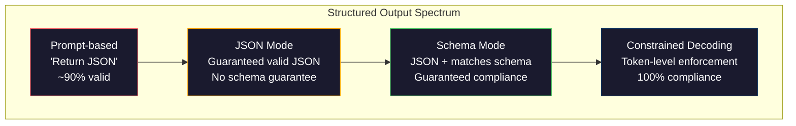
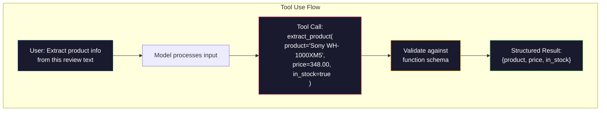

# Structured Outputs: JSON, Schema Validation, Constrained Decoding | 结构化输出：JSON、Schema 验证与约束解码

> Your LLM returns a string. Your application needs JSON. That gap has crashed more production systems than any model hallucination. Structured output is the bridge between natural language and typed data. Get it right and your LLM becomes a reliable API. Get it wrong and you're parsing free-text with regex at 3am.

> **【中文解读】** LLM 返回字符串，但应用需要 JSON。结构化输出是自然语言与类型化数据之间的桥梁，是 LLM 从"聊天机器人"进化为"可靠 API"的关键技术。

> **【拓展：结构化输出→AI应用开发】** 结构化输出是 Function Calling、RAG 管道、数据提取等 AI 应用的基础。OpenAI 的 `response_format`、Anthropic 的 tool use、Instructor 库都是这个领域的核心工具。

> 🔗 **【前置】** 学本节前请先掌握：(1) Phase 10·01-05（LLM 基础）——理解 token 生成；(2) JSON Schema 基础（`type`、`properties`、`required`）；(3) Python `pydantic` 库或 `dataclasses`——本节用 Pydantic 做验证。如果不懂 JSON Schema，先看 jsonschema.org 的 5 分钟教程。

**Type:** Build | **类型:** 构建
**Languages:** Python | **语言:** Python
**Prerequisites:** Phase 10, Lessons 01-05 (LLMs from Scratch) | **前置知识:** Phase 10 · 01-05 (从零构建 LLM)
**Time:** ~90 minutes | **时间:** ~90 分钟
**Related:** Phase 5 · 20 (Structured Outputs & Constrained Decoding) covers the decoder-level theory (FSM/CFG logit processors, Outlines, XGrammar). This lesson focuses on the production SDK surface (OpenAI `response_format`, Anthropic tool use, Instructor) — read Phase 5 · 20 first if you want to understand what is happening below the API. | **相关:** Phase 5 · 20 (结构化输出与约束解码) 讲解码器级理论（FSM/CFG logit 处理器、Outlines、XGrammar）。本课聚焦生产 SDK 表面（OpenAI `response_format`、Anthropic tool use、Instructor）——想了解 API 之下发生什么先读 Phase 5 · 20。

## Learning Objectives | 学习目标

- Implement JSON-mode and schema-constrained outputs using OpenAI and Anthropic API parameters
  使用 OpenAI 和 Anthropic API 参数实现 JSON 模式和 Schema 约束输出
- Build a Pydantic validation layer that rejects malformed LLM outputs and retries with error feedback
  构建 Pydantic 验证层，拒绝格式错误的 LLM 输出并通过错误反馈重试
- Explain how constrained decoding forces valid JSON at the token level without post-processing
  解释约束解码如何在 token 级别强制生成有效 JSON，无需后处理
- Design robust extraction prompts that reliably convert unstructured text into typed data structures
  设计鲁棒的提取提示，可靠地将非结构化文本转换为类型化数据结构

> **【中文解读】** 本课目标：让 LLM 输出结构化数据（JSON、XML、表格）。关键技术包括函数调用、JSON mode、约束解码。这是将 LLM 从聊天工具升级为工程组件的关键步骤。


## The Problem | 问题引入

You ask an LLM: "Extract the product name, price, and availability from this text." It responds:

> 你问 LLM："从这段文本中提取产品名称、价格和库存状态。"它回复：

That is a perfectly correct answer. It is also completely useless to your application. Your inventory system needs `{"product": "Sony WH-1000XM5", "price": 348.00, "in_stock": true}`. You need a JSON object with specific keys, specific types, and specific value constraints. You do not need a sentence.

> 这是一个完全正确的答案。但它对你的应用也完全没用。你的库存系统需要 `{"product": "Sony WH-1000XM5", "price": 348.00, "in_stock": true}`。你需要一个具有特定键、特定类型和特定值约束的 JSON 对象。你不需要一句话。

The naive solution: add "Respond in JSON" to your prompt. This works 90% of the time. The other 10% the model wraps the JSON in markdown code fences, or adds a preamble like "Here's the JSON:", or produces syntactically invalid JSON because it closed a bracket early. Your JSON parser crashes. Your pipeline breaks. You add try/except and a retry loop. The retry sometimes produces different data. Now you have a consistency problem on top of a parsing problem.

> 朴素的解决方案：在你的提示中加上"用 JSON 回复"。这在 90% 的情况下有效。其余 10% 的时候，模型会把 JSON 包在 markdown 代码块中，或者加上"这是 JSON："之类的开头语，或者因为提前关闭括号而产生语法无效的 JSON。你的 JSON 解析器崩溃了。你的流水线断了。你添加了 try/except 和重试循环。重试有时会产生不同的数据。现在你在解析问题之上又有了一致性问题。

This is not a prompt engineering problem. It is a decoding problem. The model generates tokens left to right. At each position, it picks the most likely next token from a vocabulary of 100K+ options. Most of those options would produce invalid JSON at any given position. If the model just emitted `{"price":`, the next token must be a digit, a quote (for string), `null`, `true`, `false`, or a negative sign. Anything else produces invalid JSON. Without constraints, the model might pick a perfectly reasonable English word that is catastrophically wrong syntactically.

> 这不是提示工程问题。这是解码问题。模型从左到右生成 token。在每个位置，它从 10 万+ 个选项的词表中选取最可能的下一个 token。其中大部分选项在任何给定位置都会产生无效 JSON。如果模型刚刚输出了 `{"price":`，下一个 token 必须是数字、引号（用于字符串）、`null`、`true`、`false` 或负号。其他任何东西都会产生无效 JSON。没有约束的话，模型可能会选一个完全合理的英语单词，但在语法上是灾难性的错误。

> 💡 **【类比】** 不带约束的 LLM 输出 JSON 像让人"边说边造句"——说到一半可能临时改主意用别的词，结果语法错乱。约束解码（constrained decoding）像给说话的人"语法监工"——每说一个词监工都检查"这能接下去吗"，不能接就强制换。技术上：模型算出 logits 后，把所有非法 token 的 logit 设为 -∞，softmax 后概率变 0，模型只能选合法 token。

> ⚠️ **【易错点】** 结构化输出的 3 个坑：(1) **Schema 字段过多**——超过 20 个字段模型记不住，会漏字段或填错；修复：拆成嵌套对象，每层不超过 5 个字段。(2) **要求 LLM 输出"创造性"字段但又强 Schema**——比如"起个有创意的标题"配合 `title: str`，模型被 Schema 约束后变得保守；修复：用 `temperature=0.9` + Schema 中加 `min_length: 10` 留余地。(3) **没用 Pydantic 验证**——直接 `json.loads()` 万一字符串里有数字（"348"）就成 str 而非 float；用 Pydantic 自动强制类型转换。

## The Concept | 核心概念

> **【中文解读】** 结构化输出是让 LLM 生成 JSON、XML 等格式的可控输出。关键技术：函数调用（Function Calling）让模型输出预定义的 JSON schema，JSON mode 强制模型生成合法 JSON，约束解码（constrained decoding）在 token 级别保证输出格式。

> 🤔 **【困惑】** Q: OpenAI 的 `response_format={"type": "json_object"}` 和 `response_format={"type": "json_schema", ...}` 有什么区别？ A: 前者是"JSON mode"——保证输出合法 JSON，但不保证字段。后者是"Structured Outputs"——你给 JSON Schema，模型保证按 Schema 输出（用约束解码实现）。前者便宜但不严格，后者每次贵几分钱但 100% 按规格。生产环境一律用 `json_schema` 模式。

> **【拓展：结构化输出的工程实践】** OpenAI 的 Structured Outputs（2024）保证模型输出严格匹配给定的 JSON Schema，可靠性从约 90% 提升到 100%。Instructor 库（Python）将 Pydantic 模型自动转为 JSON Schema 并验证输出。这是将 LLM 集成到生产系统的关键技术。


### The Structured Output Spectrum

There are four levels of structured output control, each more reliable than the last.

> 结构化输出控制有四个级别，每个比前一个更可靠。



**Prompt-based** ("Respond in valid JSON"): no enforcement. The model usually complies but sometimes does not. Reliability: ~90%. Failure mode: markdown fences, preamble text, truncated output, wrong structure.

> **基于提示**（"用有效的 JSON 回复"）：没有强制执行。模型通常会遵守，但有时不会。可靠性：约 90%。失败模式：markdown 代码围栏、前言文本、截断输出、错误结构。

**JSON mode**: the API guarantees the output is valid JSON. OpenAI's `response_format: { type: "json_object" }` enables this. The output will parse without errors. But it may not match your expected schema -- extra keys, wrong types, missing fields.

> **JSON 模式**：API 保证输出是有效的 JSON。OpenAI 的 `response_format: { type: "json_object" }` 启用此功能。输出可以无错解析。但它可能不符合你期望的 schema——多余的键、错误的类型、缺失的字段。

**Schema mode**: the API takes a JSON Schema and guarantees the output matches it. In 2026 every major provider supports this natively: OpenAI's `response_format: { type: "json_schema", json_schema: {...} }` (also as `tool_choice="required"`), Anthropic's tool use with `input_schema`, and Gemini's `response_schema` + `response_mime_type: "application/json"`. The output has the exact keys, types, and constraints you specified.

> **Schema 模式**：API 接受 JSON Schema 并保证输出匹配。2026 年每个主要提供商都原生支持：OpenAI 的 `response_format: { type: "json_schema" }`、Anthropic 的带 `input_schema` 的 tool use、Gemini 的 `response_schema`。输出具有你指定的精确键、类型和约束。

**Constrained decoding**: at each token position during generation, the decoder masks out all tokens that would produce invalid output. If the schema requires a number and the model is about to emit a letter, that token is set to probability zero. The model can only produce tokens that lead to valid output. This is what OpenAI's structured output mode and libraries like Outlines and Guidance implement under the hood.

> **约束解码**：在生成过程中的每个 token 位置，解码器屏蔽所有会产生无效输出的 token。如果 schema 要求数字而模型即将输出字母，该 token 的概率就被设为零。模型只能产生导致有效输出的 token。这就是 OpenAI 结构化输出模式和 Outlines、Guidance 等库底层实现的方式。

### JSON Schema: The Contract Language

JSON Schema is how you tell the model (or validation layer) what shape the output must have. Every major structured output system uses it.

> JSON Schema 是你告诉模型（或验证层）输出必须具有什么形状的方式。每个主要结构化输出系统都使用它。

```json
{
  "type": "object",
  "properties": {
    "product": { "type": "string" },
    "price": { "type": "number", "minimum": 0 },
    "in_stock": { "type": "boolean" },
    "categories": {
      "type": "array",
      "items": { "type": "string" }
    }
  },
  "required": ["product", "price", "in_stock"]
}
```

This schema says: the output must be an object with a string `product`, a non-negative number `price`, a boolean `in_stock`, and an optional array of string `categories`. Any output that does not match gets rejected.

> 这个 schema 说明：输出必须是一个对象，包含字符串 `product`、非负数字 `price`、布尔值 `in_stock` 和可选的字符串数组 `categories`。任何不匹配的输出都会被拒绝。

Schemas handle the hard cases: nested objects, arrays with typed items, enums (constrain a string to specific values), pattern matching (regex on strings), and combinators (oneOf, anyOf, allOf for polymorphic outputs).

> Schema 处理复杂情况：嵌套对象、带类型项的数组、枚举（将字符串约束为特定值）、模式匹配（字符串上的正则表达式）和组合器（oneOf、anyOf、allOf 用于多态输出）。

### The Pydantic Pattern

In Python, you do not write JSON Schema by hand. You define a Pydantic model and it generates the schema for you.

> 在 Python 中，你不需要手写 JSON Schema。你定义一个 Pydantic 模型，它会为你生成 schema。

```python
from pydantic import BaseModel

class Product(BaseModel):
    product: str
    price: float
    in_stock: bool
    categories: list[str] = []
```

This produces the same JSON Schema as above. The Instructor library (and OpenAI's SDK) accept Pydantic models directly: pass the model class, get back a validated instance. If the LLM output does not match, Instructor retries automatically.

> 这会产生与上面相同的 JSON Schema。Instructor 库（和 OpenAI 的 SDK）直接接受 Pydantic 模型：传入模型类，返回验证过的实例。如果 LLM 输出不匹配，Instructor 会自动重试。

### Function Calling / Tool Use

An alternative interface for the same problem. Instead of asking the model to produce JSON directly, you define "tools" (functions) with typed parameters. The model outputs a function call with structured arguments. OpenAI calls this "function calling." Anthropic calls it "tool use." The result is the same: structured data.

> 解决同一问题的替代接口。不是要求模型直接产生 JSON，而是定义带类型参数的"工具"（函数）。模型输出带有结构化参数的函数调用。OpenAI 称之为"function calling"。Anthropic 称之为"tool use"。结果相同：结构化数据。



Tool use is preferred when the model needs to choose which function to call, not just fill in parameters. If you have 10 different extraction schemas and the model must pick the right one based on the input, tool use gives you both the schema selection and the structured output.

> 当模型需要选择调用哪个函数而不仅仅是填充参数时，首选 tool use。如果你有 10 个不同的提取 schema 且模型必须根据输入选择正确的那个，tool use 同时提供 schema 选择和结构化输出。

### Common Failure Modes

Even with schema enforcement, structured outputs can fail in subtle ways.

> 即使有 schema 强制执行，结构化输出也可能以微妙的方式失败。

**Hallucinated values**: the output matches the schema but contains invented data. The model produces `{"price": 299.99}` when the text says $348. Schema validation cannot catch this -- the type is correct, the value is wrong.

> **幻觉值**：输出匹配 schema 但包含虚构数据。文本说 $348 时模型产生 `{"price": 299.99}`。Schema 验证无法捕获这个问题——类型正确，值错误。

**Enum confusion**: you constrain a field to `["in_stock", "out_of_stock", "preorder"]`. The model outputs `"available"` -- semantically correct, but not in the allowed set. Good constrained decoding prevents this. Prompt-based approaches do not.

> **枚举混淆**：你将字段约束为 `["in_stock", "out_of_stock", "preorder"]`。模型输出 `"available"`——语义上正确，但不在允许的集合中。好的约束解码可以防止这种情况。基于提示的方法则不能。

**Nested object depth**: deeply nested schemas (4+ levels) produce more errors. Each level of nesting is another place where the model can lose track of structure.

> **嵌套对象深度**：深层嵌套的 schema（4+ 层）产生更多错误。每一层嵌套都是模型可能丢失结构追踪的另一个地方。

**Array length**: the model may produce too many or too few items in an array. Schemas support `minItems` and `maxItems` but not all providers enforce them at the decoding level.

> **数组长度**：模型可能在数组中产生过多或过少的项。Schema 支持 `minItems` 和 `maxItems`，但并非所有提供商都在解码级别强制执行。

**Optional field omission**: the model omits fields that are technically optional but semantically important for your use case. Set them as required in the schema even if the data is sometimes missing -- force the model to produce `null` explicitly.

> **可选字段遗漏**：模型省略了技术上可选但语义上对你的用例很重要的字段。即使数据有时缺失，也在 schema 中将它们设为必需——强制模型显式产生 `null`。

## Build It | 动手实现

### Step 1: JSON Schema Validator

Build a validator from scratch that checks whether a Python object matches a JSON Schema. This is what runs on the output side to verify compliance.

> 从零构建验证器，检查 Python 对象是否匹配 JSON Schema。这是输出侧验证合规性的代码。

```python
import json

def validate_schema(data, schema):
    errors = []
    _validate(data, schema, "", errors)
    return errors

def _validate(data, schema, path, errors):
    schema_type = schema.get("type")

    if schema_type == "object":
        if not isinstance(data, dict):
            errors.append(f"{path}: expected object, got {type(data).__name__}")
            return
        for key in schema.get("required", []):
            if key not in data:
                errors.append(f"{path}.{key}: required field missing")
        properties = schema.get("properties", {})
        for key, value in data.items():
            if key in properties:
                _validate(value, properties[key], f"{path}.{key}", errors)

    elif schema_type == "array":
        if not isinstance(data, list):
            errors.append(f"{path}: expected array, got {type(data).__name__}")
            return
        min_items = schema.get("minItems", 0)
        max_items = schema.get("maxItems", float("inf"))
        if len(data) < min_items:
            errors.append(f"{path}: array has {len(data)} items, minimum is {min_items}")
        if len(data) > max_items:
            errors.append(f"{path}: array has {len(data)} items, maximum is {max_items}")
        items_schema = schema.get("items", {})
        for i, item in enumerate(data):
            _validate(item, items_schema, f"{path}[{i}]", errors)

    elif schema_type == "string":
        if not isinstance(data, str):
            errors.append(f"{path}: expected string, got {type(data).__name__}")
            return
        enum_values = schema.get("enum")
        if enum_values and data not in enum_values:
            errors.append(f"{path}: '{data}' not in allowed values {enum_values}")

    elif schema_type == "number":
        if not isinstance(data, (int, float)):
            errors.append(f"{path}: expected number, got {type(data).__name__}")
            return
        minimum = schema.get("minimum")
        maximum = schema.get("maximum")
        if minimum is not None and data < minimum:
            errors.append(f"{path}: {data} is less than minimum {minimum}")
        if maximum is not None and data > maximum:
            errors.append(f"{path}: {data} is greater than maximum {maximum}")

    elif schema_type == "boolean":
        if not isinstance(data, bool):
            errors.append(f"{path}: expected boolean, got {type(data).__name__}")

    elif schema_type == "integer":
        if not isinstance(data, int) or isinstance(data, bool):
            errors.append(f"{path}: expected integer, got {type(data).__name__}")
```

### Step 2: Pydantic-Style Model to Schema

Build a minimal class-to-schema converter. Define a Python class and generate its JSON Schema automatically.

> 构建最小类到 schema 转换器。定义 Python 类，自动生成其 JSON Schema。

```python
class SchemaField:
    def __init__(self, field_type, required=True, default=None, enum=None, minimum=None, maximum=None):
        self.field_type = field_type
        self.required = required
        self.default = default
        self.enum = enum
        self.minimum = minimum
        self.maximum = maximum

def python_type_to_schema(field):
    type_map = {
        str: "string",
        int: "integer",
        float: "number",
        bool: "boolean",
    }

    schema = {}

    if field.field_type in type_map:
        schema["type"] = type_map[field.field_type]
    elif field.field_type == list:
        schema["type"] = "array"
        schema["items"] = {"type": "string"}
    elif isinstance(field.field_type, dict):
        schema = field.field_type

    if field.enum:
        schema["enum"] = field.enum
    if field.minimum is not None:
        schema["minimum"] = field.minimum
    if field.maximum is not None:
        schema["maximum"] = field.maximum

    return schema

def model_to_schema(name, fields):
    properties = {}
    required = []

    for field_name, field in fields.items():
        properties[field_name] = python_type_to_schema(field)
        if field.required:
            required.append(field_name)

    return {
        "type": "object",
        "properties": properties,
        "required": required,
    }
```

### Step 3: Constrained Token Filter

Simulate constrained decoding. Given a partial JSON string and a schema, determine which token categories are valid at the current position.

> 模拟约束解码。给定部分 JSON 字符串和 schema，确定当前位置哪些 token 类别有效。

```python
def next_valid_tokens(partial_json, schema):
    stripped = partial_json.strip()

    if not stripped:
        return ["{"]

    try:
        json.loads(stripped)
        return ["<EOS>"]
    except json.JSONDecodeError:
        pass

    last_char = stripped[-1] if stripped else ""

    if last_char == "{":
        return ['"', "}"]
    elif last_char == '"':
        if stripped.endswith('":'):
            return ['"', "0-9", "true", "false", "null", "[", "{"]
        return ["a-z", '"']
    elif last_char == ":":
        return [" ", '"', "0-9", "true", "false", "null", "[", "{"]
    elif last_char == ",":
        return [" ", '"', "{", "["]
    elif last_char in "0123456789":
        return ["0-9", ".", ",", "}", "]"]
    elif last_char == "}":
        return [",", "}", "]", "<EOS>"]
    elif last_char == "]":
        return [",", "}", "<EOS>"]
    elif last_char == "[":
        return ['"', "0-9", "true", "false", "null", "{", "[", "]"]
    else:
        return ["any"]

def demonstrate_constrained_decoding():
    partial_states = [
        '',
        '{',
        '{"product"',
        '{"product":',
        '{"product": "Sony"',
        '{"product": "Sony",',
        '{"product": "Sony", "price":',
        '{"product": "Sony", "price": 348',
        '{"product": "Sony", "price": 348}',
    ]

    print(f"{'Partial JSON':<45} {'Valid Next Tokens'}")
    print("-" * 80)
    for state in partial_states:
        valid = next_valid_tokens(state, {})
        display = state if state else "(empty)"
        print(f"{display:<45} {valid}")
```

### Step 4: Extraction Pipeline

Combine everything into an extraction pipeline: define a schema, simulate an LLM producing structured output, validate the output, and handle retries.

> 把一切组合成提取流水线：定义 schema、模拟 LLM 产生结构化输出、验证输出、处理重试。

```python
def simulate_llm_extraction(text, schema, attempt=0):
    if "headphones" in text.lower() or "sony" in text.lower():
        if attempt == 0:
            return '{"product": "Sony WH-1000XM5", "price": 348.00, "in_stock": true, "categories": ["audio", "headphones"]}'
        return '{"product": "Sony WH-1000XM5", "price": 348.00, "in_stock": true}'

    if "laptop" in text.lower():
        return '{"product": "MacBook Pro 16", "price": 2499.00, "in_stock": false, "categories": ["computers"]}'

    return '{"product": "Unknown", "price": 0, "in_stock": false}'

def extract_with_retry(text, schema, max_retries=3):
    for attempt in range(max_retries):
        raw = simulate_llm_extraction(text, schema, attempt)

        try:
            data = json.loads(raw)
        except json.JSONDecodeError as e:
            print(f"  Attempt {attempt + 1}: JSON parse error -- {e}")
            continue

        errors = validate_schema(data, schema)
        if not errors:
            return data

        print(f"  Attempt {attempt + 1}: Schema validation errors -- {errors}")

    return None

product_schema = {
    "type": "object",
    "properties": {
        "product": {"type": "string"},
        "price": {"type": "number", "minimum": 0},
        "in_stock": {"type": "boolean"},
        "categories": {"type": "array", "items": {"type": "string"}},
    },
    "required": ["product", "price", "in_stock"],
}
```

### Step 5: Run the Full Pipeline

> 步骤 5：运行完整流水线。

```python
def run_demo():
    print("=" * 60)
    print("  Structured Output Pipeline Demo")
    print("=" * 60)

    print("\n--- Schema Definition ---")
    product_fields = {
        "product": SchemaField(str),
        "price": SchemaField(float, minimum=0),
        "in_stock": SchemaField(bool),
        "categories": SchemaField(list, required=False),
    }
    generated_schema = model_to_schema("Product", product_fields)
    print(json.dumps(generated_schema, indent=2))

    print("\n--- Schema Validation ---")
    test_cases = [
        ({"product": "Test", "price": 10.0, "in_stock": True}, "Valid object"),
        ({"product": "Test", "price": -5.0, "in_stock": True}, "Negative price"),
        ({"product": "Test", "in_stock": True}, "Missing price"),
        ({"product": "Test", "price": "ten", "in_stock": True}, "String as price"),
        ("not an object", "String instead of object"),
    ]

    for data, label in test_cases:
        errors = validate_schema(data, product_schema)
        status = "PASS" if not errors else f"FAIL: {errors}"
        print(f"  {label}: {status}")

    print("\n--- Constrained Decoding Simulation ---")
    demonstrate_constrained_decoding()

    print("\n--- Extraction Pipeline ---")
    texts = [
        "The Sony WH-1000XM5 headphones are priced at $348 and currently available.",
        "The new MacBook Pro 16-inch laptop costs $2499 but is sold out.",
        "This is a random sentence with no product info.",
    ]

    for text in texts:
        print(f"\n  Input: {text[:60]}...")
        result = extract_with_retry(text, product_schema)
        if result:
            print(f"  Output: {json.dumps(result)}")
        else:
            print(f"  Output: FAILED after retries")
```

## Use It | 用框架实现

### OpenAI Structured Outputs

> OpenAI 结构化输出。

```python
# from openai import OpenAI
# from pydantic import BaseModel
#
# client = OpenAI()
#
# class Product(BaseModel):
#     product: str
#     price: float
#     in_stock: bool
#
# response = client.beta.chat.completions.parse(
#     model="gpt-5-mini",
#     messages=[
#         {"role": "system", "content": "Extract product information."},
#         {"role": "user", "content": "Sony WH-1000XM5, $348, in stock"},
#     ],
#     response_format=Product,
# )
#
# product = response.choices[0].message.parsed
# print(product.product, product.price, product.in_stock)
```

OpenAI's structured output mode uses constrained decoding internally. Every token the model generates is guaranteed to produce output matching the Pydantic schema. No retries needed. No validation needed. The constraint is baked into the decoding process.

> OpenAI 的结构化输出模式在内部使用约束解码。模型生成的每个 token 都保证产生匹配 Pydantic schema 的输出。不需要重试。不需要验证。约束直接嵌入解码过程中。

### Anthropic Tool Use

> Anthropic 工具使用。

```python
# import anthropic
#
# client = anthropic.Anthropic()
#
# response = client.messages.create(
#     model="claude-opus-4-7",
#     max_tokens=1024,
#     tools=[{
#         "name": "extract_product",
#         "description": "Extract product information from text",
#         "input_schema": {
#             "type": "object",
#             "properties": {
#                 "product": {"type": "string"},
#                 "price": {"type": "number"},
#                 "in_stock": {"type": "boolean"},
#             },
#             "required": ["product", "price", "in_stock"],
#         },
#     }],
#     messages=[{"role": "user", "content": "Extract: Sony WH-1000XM5, $348, in stock"}],
# )
```

Anthropic achieves structured output through tool use. The model emits a tool call with structured arguments that match the input_schema. Same result, different API surface.

> Anthropic 通过 tool use 实现结构化输出。模型发出一个工具调用，其结构化参数匹配 input_schema。结果相同，API 接口不同。

### Instructor Library

> Instructor 库。

```python
# pip install instructor
# import instructor
# from openai import OpenAI
# from pydantic import BaseModel
#
# client = instructor.from_openai(OpenAI())
#
# class Product(BaseModel):
#     product: str
#     price: float
#     in_stock: bool
#
# product = client.chat.completions.create(
#     model="gpt-5-mini",
#     response_model=Product,
#     messages=[{"role": "user", "content": "Sony WH-1000XM5, $348, in stock"}],
# )
```

Instructor wraps any LLM client and adds automatic retries with validation. If the first attempt fails validation, it sends the errors back to the model as context and asks it to fix the output. This works with any provider, not just OpenAI.

> Instructor 包装任何 LLM 客户端并添加带验证的自动重试。如果第一次尝试验证失败，它将错误作为上下文发回模型并要求修复输出。这适用于任何提供商，不仅是 OpenAI。

## Ship It | 产出物

This lesson produces `outputs/prompt-structured-extractor.md` -- a reusable prompt template that extracts structured data from any text given a schema definition. Feed it a JSON Schema and unstructured text, and it returns validated JSON.

> 本课产生 `outputs/prompt-structured-extractor.md`——一个可重用的提示模板，给定 schema 定义，从任何文本中提取结构化数据。传入 JSON Schema 和非结构化文本，它返回验证过的 JSON。

It also produces `outputs/skill-structured-outputs.md` -- a decision framework for choosing the right structured output strategy based on your provider, reliability requirements, and schema complexity.

> 它还产生 `outputs/skill-structured-outputs.md`——一个决策框架，根据你的提供商、可靠性需求和 schema 复杂度选择正确的结构化输出策略。

## Exercises | 练习题

1. Extend the schema validator to support `oneOf` (the data must match exactly one of several schemas). This handles polymorphic outputs -- for example, a field that can be either a `Product` or a `Service` object with different shapes.
   扩展 schema 验证器以支持 `oneOf`（数据必须匹配几个 schema 中的一个）。这处理多态输出——例如，一个字段可以是 `Product` 或 `Service` 对象。

2. Build a "schema diff" tool that compares two schemas and identifies breaking changes (removed required fields, changed types) versus non-breaking changes (added optional fields, relaxed constraints). This is essential for versioning your extraction schemas in production.
   构建一个"schema diff"工具，比较两个 schema 并识别破坏性变更（删除的必需字段、改变的类型）和非破坏性变更（添加的可选字段、放松的约束）。

3. Implement a more realistic constrained decoding simulator. Given a JSON Schema and a vocabulary of 100 tokens (letters, digits, punctuation, keywords), walk through generation step by step, masking invalid tokens at each position. Measure what percentage of the vocabulary is valid at each step.
   实现一个更真实的约束解码模拟器。给定 JSON Schema 和 100 个 token 的词表，逐步生成，在每个位置屏蔽无效 token。测量每一步词表的有效百分比。

4. Build an extraction eval suite. Create 50 product descriptions with hand-labeled JSON outputs. Run your extraction pipeline on all 50 and measure exact match, field-level accuracy, and type compliance. Identify which fields are hardest to extract correctly.
   构建一个提取评估套件。创建 50 个产品描述及手标 JSON 输出。在所有 50 个上运行提取流水线，测量精确匹配、字段级准确率和类型合规性。

5. Add "confidence scores" to your extraction pipeline. For each extracted field, estimate how confident the model is (based on token probabilities, or by running extraction 3 times and measuring consistency). Flag low-confidence fields for human review.
   为提取流水线添加"置信度评分"。对每个提取的字段，估计模型的置信度（基于 token 概率或运行 3 次提取测量一致性）。标记低置信度字段供人工审查。

## Key Terms | 术语速查表

| Term | What people say | What it actually means | 中文释义 |
|------|----------------|----------------------|---------|
| JSON mode | "Returns JSON" / "返回 JSON" | API flag that guarantees syntactically valid JSON output, but does not enforce any particular schema | JSON 模式：API 标志，保证语法有效的 JSON 输出，但不强制执行特定 schema |
| Structured output | "Typed JSON" / "类型化 JSON" | Output that matches a specific JSON Schema with correct keys, types, and constraints | 结构化输出：匹配特定 JSON Schema 的输出，具有正确的键、类型和约束 |
| Constrained decoding | "Guided generation" / "引导生成" | At each token position, mask out tokens that would produce invalid output -- guarantees 100% schema compliance | 约束解码：在每个 token 位置屏蔽会产生无效输出的 token，保证 100% schema 合规 |
| JSON Schema | "A JSON template" / "JSON 模板" | A declarative language for describing the structure, types, and constraints of JSON data (used by OpenAPI, JSON Forms, etc.) | JSON Schema：描述 JSON 数据结构、类型和约束的声明式语言 |
| Pydantic | "Python dataclasses+" / "Python 数据类+" | Python library that defines data models with type validation, used by FastAPI and Instructor to generate JSON Schemas | Pydantic：定义带类型验证数据模型的 Python 库，用于生成 JSON Schema |
| Function calling | "Tool use" / "工具使用" | LLM outputs a structured function invocation (name + typed arguments) instead of free text -- OpenAI and Anthropic both support this | 函数调用：LLM 输出结构化的函数调用（名称+类型化参数），而非自由文本 |
| Instructor | "Pydantic for LLMs" / "LLM 的 Pydantic" | Python library that wraps LLM clients to return validated Pydantic instances, with automatic retry on validation failure | Instructor：包装 LLM 客户端返回验证过的 Pydantic 实例的 Python 库 |
| Token masking | "Filtering the vocabulary" / "过滤词表" | Setting specific token probabilities to zero during generation so the model cannot produce them | Token 屏蔽：在生成过程中将特定 token 概率设为零 |
| Schema compliance | "Matches the shape" / "匹配形状" | The output has every required field, correct types, values within constraints, and no extra disallowed fields | Schema 合规：输出具有每个必需字段、正确类型、约束内的值 |
| Retry loop | "Try again until it works" / "重试直到成功" | Send validation errors back to the model and ask it to fix the output -- Instructor does this automatically, up to a configurable max | 重试循环：将验证错误发回模型并要求修复输出 |

## Further Reading | 延伸阅读

- [OpenAI Structured Outputs Guide](https://platform.openai.com/docs/guides/structured-outputs) -- official documentation for JSON Schema-based constrained decoding in the OpenAI API
  OpenAI API 中基于 JSON Schema 的约束解码的官方文档
- [Willard & Louf, 2023 -- "Efficient Guided Generation for Large Language Models"](https://arxiv.org/abs/2307.09702) -- the Outlines paper, describing how to compile JSON Schemas into finite state machines for token-level constraints
  Outlines 论文，描述如何将 JSON Schema 编译为有限状态机以实现 token 级约束
- [Instructor documentation](https://python.useinstructor.com/) -- the standard library for getting structured outputs from any LLM with Pydantic validation and retries
  从任何 LLM 获取带 Pydantic 验证和重试的结构化输出的标准库
- [Anthropic Tool Use Guide](https://docs.anthropic.com/en/docs/tool-use) -- how Claude implements structured output via tool use with JSON Schema input_schema
  Claude 如何通过带 JSON Schema input_schema 的 tool use 实现结构化输出
- [JSON Schema specification](https://json-schema.org/) -- the full spec for the schema language used by every major structured output system
  每个主要结构化输出系统使用的 schema 语言的完整规范
- [Outlines library](https://github.com/outlines-dev/outlines) -- open-source constrained generation using regex and JSON Schema compiled to finite state machines
  使用正则和 JSON Schema 编译为有限状态机的开源约束生成库
- [Dong et al., "XGrammar: Flexible and Efficient Structured Generation Engine for Large Language Models" (MLSys 2025)](https://arxiv.org/abs/2411.15100) -- the current state-of-the-art grammar engine; pushdown-automaton compilation that masks tokens at ~100 ns / token.
  当前最先进的语法引擎；下推自动机编译，以约 100 ns/token 的速度屏蔽 token
- [Beurer-Kellner et al., "Prompting Is Programming: A Query Language for Large Language Models" (LMQL)](https://arxiv.org/abs/2212.06094) -- the LMQL paper framing constrained decoding as a query language with type and value constraints.
  将约束解码框架化为带类型和值约束的查询语言的 LMQL 论文
- [Microsoft Guidance (framework docs)](https://github.com/guidance-ai/guidance) -- template-driven constrained generation; vendor-agnostic complement to Outlines and XGrammar.
  模板驱动的约束生成；Outlines 和 XGrammar 的供应商无关补充
