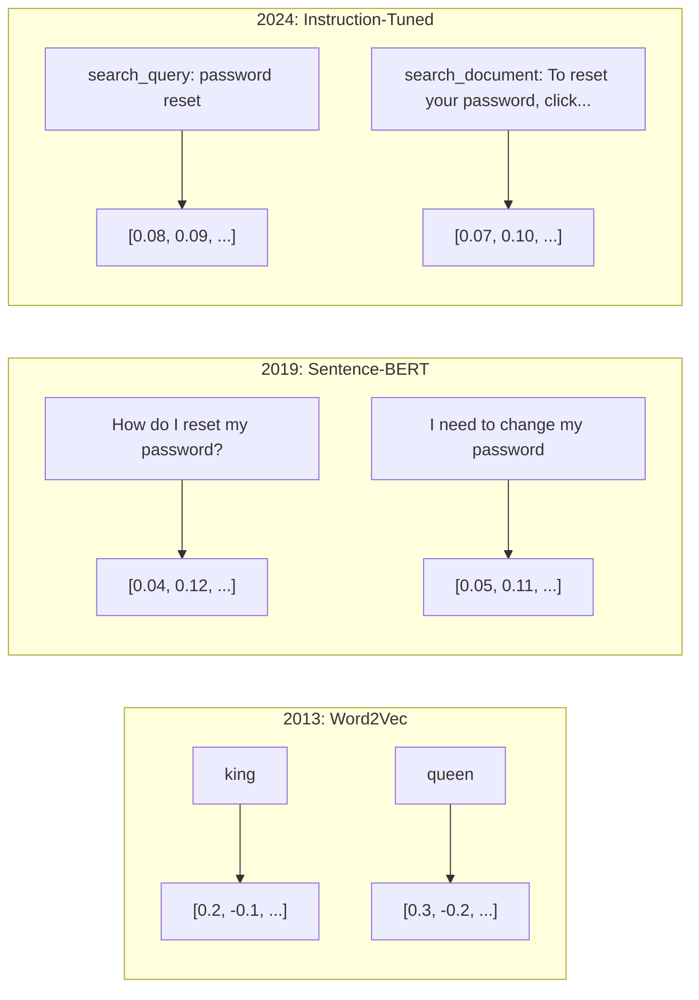
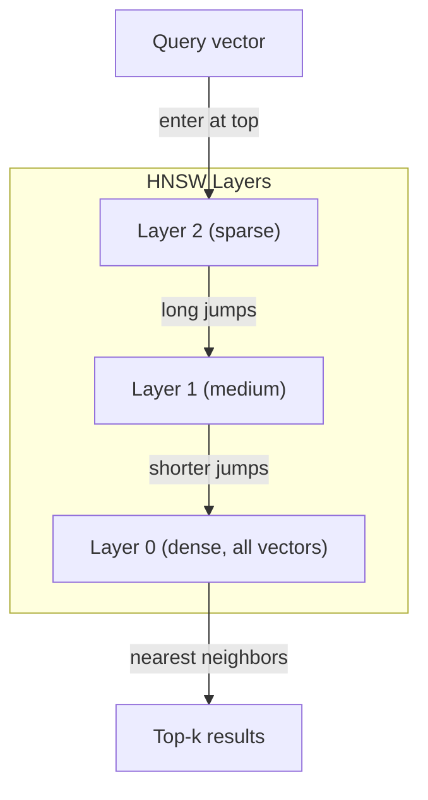
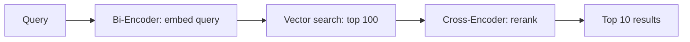

# Embeddings & Vector Representations | 嵌入与向量表示

> Text is discrete. Math is continuous. Every time you ask an LLM to find "similar" documents, compare meanings, or search beyond keywords, you're relying on a bridge between these two worlds. That bridge is an embedding. If you don't understand embeddings, you don't understand modern AI. You just use it.

> **【中文解读】** 文本是离散的，数学是连续的。嵌入（Embedding）是连接这两个世界的桥梁。不理解嵌入，就不理解现代 AI——从搜索到 RAG 到语义相似度，嵌入无处不在。

> **【拓展：嵌入→RAG与搜索】** 嵌入是 RAG（检索增强生成）系统的核心基础设施。文本转向量后存入向量数据库，通过余弦相似度实现语义搜索，这是所有现代 AI 搜索和推荐系统的底层技术。

> 🔗 **【前置】** 学本节前请先掌握：(1) Python 基础（numpy 向量运算、字典、列表推导）；(2) 高中向量数学——点积、夹角、模长（不知道这些先看 Phase 01·02 Vectors Matrices）；(3) Phase 05·03（Word Embeddings Word2Vec）会讲词嵌入基础，本节是其延伸到句子/文档级。本节会用到 `numpy`、`scikit-learn`、可选 `chromadb` 或 `qdrant`。

**Type:** Build | **类型:** 构建
**Languages:** Python | **语言:** Python
**Prerequisites:** Phase 11, Lesson 01 (Prompt Engineering) | **前置知识:** Phase 11 · 01 (提示工程)
**Time:** ~75 minutes | **时间:** ~75 分钟
**Related:** Phase 5 · 22 (Embedding Models Deep Dive) covers dense vs sparse vs multi-vector, Matryoshka truncation, and per-axis model selection. This lesson focuses on the production pipeline (vector DBs, HNSW, similarity math). Read Phase 5 · 22 before picking a model. | **相关:** Phase 5 · 22 (嵌入模型深度解析)涵盖稠密/稀疏/多向量、Matryoshka 截断和分轴模型选择。本课聚焦生产管线（向量库、HNSW、相似度数学）。选模型前先读 Phase 5 · 22。

## Learning Objectives | 学习目标

- Generate text embeddings using API providers and open-source models, and compute cosine similarity between them
  使用 API 提供商和开源模型生成文本嵌入，并计算它们之间的余弦相似度
- Explain why embeddings solve the vocabulary mismatch problem that keyword search cannot handle
  解释为什么嵌入能解决关键词搜索无法处理的词汇不匹配问题
- Build a semantic search index that retrieves documents by meaning rather than exact keyword match
  构建一个语义搜索索引，按意义而非精确关键词匹配检索文档
- Evaluate embedding quality using retrieval benchmarks (precision@k, recall) and choose the right embedding model for your task
  使用检索基准（precision@k、recall）评估嵌入质量，并为任务选择合适的嵌入模型

> **【中文解读】** 本课目标：理解文本嵌入的原理和应用。嵌入将文本转为向量，使语义相似文本在向量空间中距离更近。这是语义搜索、RAG、聚类等任务的基础。


## The Problem | 问题引入

You have 10,000 support tickets. A customer writes "my payment didn't go through." You need to find similar past tickets. Keyword search finds tickets containing "payment" and "didn't go through." It misses "transaction failed," "charge was declined," and "billing error." These tickets describe the exact same problem with completely different words.

> 你有 10,000 张工单。客户写"我的付款没有成功"。你需要找到类似的过往工单。关键词搜索找到了包含"payment"和"didn't go through"的工单，但漏掉了"transaction failed"、"charge was declined"和"billing error"。这些工单描述的是完全相同的问题，只是用了完全不同的词。

This is the vocabulary mismatch problem. Human language has dozens of ways to say the same thing. Keyword search treats each word as an independent symbol with no meaning. It cannot know that "declined" and "didn't go through" refer to the same concept.

> 这就是词汇不匹配问题。人类语言有几十种方式来表达同一件事。关键词搜索将每个词视为没有意义的独立符号。它无法知道"declined"和"didn't go through"指的是同一个概念。

> 💡 **【类比】** 关键词搜索像用"按拼音查字典"——"水果"和"fruit"是两条目，互相找不到。嵌入像"按含义分类"——"水果""fruit""果实""apple"都被放进"可食用植物产品"这个语义盒子里，能跨语言、跨表达方式匹配。这就是为什么 ChatGPT 能理解你的提问即使你打错字或用罕见说法。

You need a representation of text where meaning, not spelling, determines similarity. You need a way to place "my payment didn't go through" and "transaction was declined" close together in some mathematical space, while pushing "my payment arrived on time" far away despite sharing the word "payment."

> 你需要一种文本表示方式，其中意义而非拼写决定相似性。你需要一种方法，将"我的付款没有成功"和"交易被拒绝"放在某个数学空间中彼此接近。

That representation is an embedding.

> 这种表示就是嵌入。

## The Concept | 核心概念

> **【中文解读】** 嵌入（Embeddings）将文本转换为高维向量，使语义相似的文本在向量空间中距离更近。嵌入是 RAG、语义搜索、聚类、分类等任务的基础。主流嵌入模型包括 OpenAI text-embedding-3-large、BGE、E5 等。

> **【拓展：嵌入模型的演进】** 嵌入模型从 Word2Vec/GloVe（静态词嵌入）到 BERT（上下文嵌入）到专用嵌入模型（如 BGE、E5、GTE）。OpenAI 的 text-embedding-3-large 在 MTEB 基准上达到约 64 分。嵌入维度通常为 768-3072，可以通过 Matryoshka 嵌入在推理时截断到更短维度以节省存储。


### What Is an Embedding?

An embedding is a dense vector of floating-point numbers that represents the meaning of text. The word "dense" matters -- every dimension carries information, unlike sparse representations (bag-of-words, TF-IDF) where most dimensions are zero.

> 嵌入是表示文本含义的浮点数稠密向量。"稠密"很重要——每个维度都承载信息，不像稀疏表示（词袋、TF-IDF）中大多数维度为零。

"The cat sat on the mat" becomes something like `[0.023, -0.041, 0.087, ..., 0.012]` -- a list of 768 to 3072 numbers depending on the model. These numbers encode meaning. You never inspect them directly. You compare them.

> "猫坐在垫子上"变成类似 `[0.023, -0.041, 0.087, ..., 0.012]` 的东西——根据模型不同，是 768 到 3072 个数字的列表。这些数字编码了含义。你从不直接检查它们，你比较它们。

### The Word2Vec Breakthrough

In 2013, Tomas Mikolov and colleagues at Google published Word2Vec. The core insight: train a neural network to predict a word from its neighbors (or neighbors from a word), and the hidden layer weights become meaningful vector representations.

> 2013 年，Tomas Mikolov 及其 Google 同事发表了 Word2Vec。核心洞察：训练神经网络从邻居预测一个词（或反过来），隐藏层权重就会变成有意义的向量表示。

The famous result:

> 著名结果：

```
king - man + woman = queen
```

Vector arithmetic on word embeddings captures semantic relationships. The direction from "man" to "woman" is roughly the same as the direction from "king" to "queen." This was the moment the field realized that geometry could encode meaning.

> 词嵌入的向量算术能捕捉语义关系。"man" 到 "woman" 的方向大致等同于 "king" 到 "queen" 的方向。这是领域意识到几何可以编码含义的时刻。

> 💡 **【类比】** 向量空间的方向就是"含义维度"。比如某个方向编码"性别"（man↔woman、king↔queen、uncle↔aunt），另一个方向编码"时态"（walk↔walked、go↔went），第三个编码"复数"（cat↔cats、dog↔dogs）。模型在训练时自动发现了这些方向——没有任何人告诉它"性别"是什么，它纯粹从共现统计里学出来。300 维向量可能编码了几十个这样的语义轴。

Word2Vec produced 300-dimensional vectors. Each word got one vector regardless of context. "Bank" in "river bank" and "bank account" had the same embedding. This limitation drove the next decade of research.

> Word2Vec 产生 300 维向量。每个词无论上下文如何都得到一个向量。"河岸"（river bank）和"银行账户"（bank account）中的 "bank" 拥有相同的嵌入。这个限制驱动了接下来十年的研究。

### From Words to Sentences

Word embeddings represent single tokens. Production systems need to embed entire sentences, paragraphs, or documents. Four approaches emerged:

> 词嵌入表示单个 token。生产系统需要嵌入整个句子、段落或文档。出现了四种方法：

**Averaging**: take the mean of all word vectors in the sentence. Cheap, lossy, surprisingly decent for short text. Loses word order entirely -- "dog bites man" and "man bites dog" get identical embeddings.

> **平均法**：取句子中所有词向量的均值。廉价、有损，对短文本效果出奇地好。完全丢失词序——"狗咬人"和"人咬狗"得到相同的嵌入。

**CLS token**: transformer models (BERT, 2018) output a special [CLS] token embedding that represents the entire input. Better than averaging but the [CLS] token was trained for next-sentence prediction, not similarity.

> **CLS token**：Transformer 模型（BERT, 2018）输出一个特殊的 [CLS] token 嵌入来表示整个输入。比平均法好，但 [CLS] token 是为下一句预测任务训练的，不是为相似度任务。

**Contrastive learning**: train the model explicitly to push similar pairs together and dissimilar pairs apart. Sentence-BERT (Reimers & Gurevych, 2019) used this approach and became the foundation for modern embedding models. Given "How do I reset my password?" and "I need to change my password," the model learns these should have nearly identical vectors.

> **对比学习**：显式训练模型将相似对拉近、不相似对推远。Sentence-BERT（Reimers & Gurevych, 2019）采用了这种方法，成为现代嵌入模型的基础。给定"如何重置密码？"和"我需要修改密码"，模型学习到它们应该有几乎相同的向量。

**Instruction-tuned embeddings**: the latest approach. Models like E5 and GTE accept a task prefix ("search_query:", "search_document:") that tells the model what kind of embedding to produce. This lets one model serve multiple tasks.

> **指令微调嵌入**：最新方法。E5 和 GTE 等模型接受任务前缀（"search_query:"、"search_document:"），告诉模型要产生什么样的嵌入。这让一个模型服务多种任务。



### Modern Embedding Models

The market has settled into a handful of production-grade options (MTEB scores as of early 2026, MTEB v2):

> 市场已沉淀为少数生产级选项（MTEB 分数为 2026 年初数据，MTEB v2）：

| Model | Provider | Dimensions | MTEB | Context | Cost / 1M tokens |
|-------|----------|-----------|------|---------|------------------|
| Gemini Embedding 2 | Google | 3072 (Matryoshka) | 67.7 (retrieval) | 8192 | $0.15 |
| embed-v4 | Cohere | 1024 (Matryoshka) | 65.2 | 128K | $0.12 |
| voyage-4 | Voyage AI | 1024/2048 (Matryoshka) | 66.8 | 32K | $0.12 |
| text-embedding-3-large | OpenAI | 3072 (Matryoshka) | 64.6 | 8192 | $0.13 |
| text-embedding-3-small | OpenAI | 1536 (Matryoshka) | 62.3 | 8192 | $0.02 |
| BGE-M3 | BAAI | 1024 (dense+sparse+ColBERT) | 63.0 multilingual | 8192 | Open-weight |
| Qwen3-Embedding | Alibaba | 4096 (Matryoshka) | 66.9 | 32K | Open-weight |
| Nomic-embed-v2 | Nomic | 768 (Matryoshka) | 63.1 | 8192 | Open-weight |

MTEB (Massive Text Embedding Benchmark) v2 covers 100+ tasks across retrieval, classification, clustering, reranking, and summarization. Higher is better. By 2026, open-weight models (Qwen3-Embedding, BGE-M3) match or beat closed hosted models on most axes. Gemini Embedding 2 leads pure retrieval; Voyage/Cohere lead specific domains (finance, law, code). Always benchmark on your own queries before committing.

> MTEB（Massive Text Embedding Benchmark）v2 涵盖检索、分类、聚类、重排和摘要等 100+ 个任务。分数越高越好。到 2026 年，开源权重模型（Qwen3-Embedding、BGE-M3）在大多数维度上匹配或超越闭源托管模型。Gemini Embedding 2 在纯检索上领先；Voyage/Cohere 在特定领域（金融、法律、代码）领先。承诺之前务必在自己的查询上做基准测试。

### Similarity Metrics

Given two embedding vectors, three ways to measure how similar they are:

> 给定两个嵌入向量，有三种方式衡量它们的相似度：

**Cosine similarity**: the cosine of the angle between two vectors. Ranges from -1 (opposite) to 1 (identical direction). Ignores magnitude -- a 10-word sentence and a 500-word document can score 1.0 if they point the same direction. This is the default for 90% of use cases.

> **余弦相似度**：两个向量间夹角的余弦值。范围 -1（相反）到 1（同向）。忽略幅度——10 词句子和 500 词文档若指向同一方向可得分 1.0。这是 90% 场景的默认选择。

> 🤔 **【困惑】** Q: 为什么大多数场景用余弦相似度而不是欧氏距离？ A: 因为嵌入向量的"长度"（magnitude）通常没意义——同一句话用 10 词或 100 词说，含义一样但向量长度可能差很多。余弦只看"方向"，对长度不敏感，所以更适合比较"含义方向"。欧氏距离会让长文档"看起来很远"——但其实它讲的是同一件事。

```
cosine_sim(a, b) = dot(a, b) / (||a|| * ||b||)
```

**Dot product**: the raw inner product of two vectors. Identical to cosine similarity when vectors are normalized (unit length). Faster to compute. OpenAI's embeddings are normalized, so dot product and cosine give the same ranking.

> **点积**：两个向量的原始内积。当向量归一化（单位长度）时等同于余弦相似度。计算更快。OpenAI 的嵌入已归一化，所以点积和余弦给出相同排名。

```
dot(a, b) = sum(a_i * b_i)
```

**Euclidean (L2) distance**: straight-line distance in the vector space. Smaller = more similar. Sensitive to magnitude differences. Use when the absolute position in space matters, not just the direction.

> **欧氏（L2）距离**：向量空间中的直线距离。越小越相似。对幅度差异敏感。当空间中的绝对位置（而不仅是方向）重要时使用。

```
L2(a, b) = sqrt(sum((a_i - b_i)^2))
```

When to use which:

> 何时用哪种：

| Metric | Use when | Avoid when |
|--------|----------|------------|
| Cosine similarity / 余弦相似度 | Comparing texts of different lengths; most retrieval tasks / 比较不同长度文本；大多数检索任务 | Magnitude carries information / 幅度携带信息 |
| Dot product / 点积 | Embeddings are already normalized; maximum speed / 嵌入已归一化；最大化速度 | Vectors have varying magnitudes / 向量幅度不同 |
| Euclidean distance / 欧氏距离 | Clustering; spatial nearest-neighbor problems / 聚类；空间近邻问题 | Comparing documents of wildly different lengths / 比较长度悬殊的文档 |

### Vector Databases and HNSW

A brute-force similarity search compares the query against every stored vector. At 1 million vectors with 1536 dimensions, that is 1.5 billion multiply-add operations per query. Too slow.

> 暴力相似度搜索将查询与每个存储的向量比较。100 万向量、1536 维情况下，每次查询需要 15 亿次乘加运算。太慢。

Vector databases solve this with Approximate Nearest Neighbor (ANN) algorithms. The dominant algorithm is HNSW (Hierarchical Navigable Small World):

> 向量数据库用近似最近邻（ANN）算法解决这个问题。主流算法是 HNSW（层次可导航小世界）：

1. Build a multi-layer graph of vectors
   构建向量的多层图
2. Top layers are sparse -- long-range connections between distant clusters
   顶层稀疏——远距离簇之间的长程连接
3. Bottom layers are dense -- fine-grained connections between nearby vectors
   底层稠密——邻近向量之间的细粒度连接
4. Search starts at the top layer, greedily descending to refine
   搜索从顶层开始，贪婪下降以精化
5. Returns approximate top-k results in O(log n) time instead of O(n)
   在 O(log n) 而非 O(n) 时间内返回近似 top-k 结果

HNSW trades a small accuracy loss (typically 95-99% recall) for massive speed gains. At 10 million vectors, brute force takes seconds. HNSW takes milliseconds.

> HNSW 以少量精度损失（通常 95-99% 召回率）换取巨大速度提升。1000 万向量下，暴力搜索需要几秒；HNSW 只需几毫秒。

> 💡 **【类比】** HNSW 像地图搜索："全国地图"只画大城市（顶层稀疏），"省地图"画到县城（中层），"街道地图"画到每个建筑物（底层稠密）。找"北京大学"时，先在全国层跳到北京（一次大跳），再在省层跳到海淀区（中跳），最后在街道层找到具体位置（小跳）。比一栋一栋楼挨个查快几个数量级。



> ⚠️ **【易错点】** HNSW 的 3 个坑：(1) **召回率随参数变化**——`ef_construction` 太低（< 100）会导致图结构质量差，召回率掉到 70% 以下；生产建议 200-500。(2) **删除代价高**——HNSW 是图结构，删除节点会破坏连接，多数实现是"软删除"（标记为已删），需要定期重建。(3) **过滤性能差**——先做向量搜索再过滤会拿到大量不符合条件的结果；解决方案：用 Qdrant 的 filtered search 或 Pinecone 的 sparse-dense hybrid，先过滤再搜索。

Production options:

> 生产级选项：

| Database | Type | Best for | Max scale |
|----------|------|----------|-----------|
| Pinecone | Managed SaaS / 托管 SaaS | Zero-ops production / 零运维生产 | Billions / 十亿级 |
| Weaviate | Open source / 开源 | Self-hosted, hybrid search / 自托管、混合搜索 | 100M+ / 一亿+ |
| Qdrant | Open source / 开源 | High performance, filtering / 高性能、过滤 | 100M+ / 一亿+ |
| ChromaDB | Embedded / 嵌入式 | Prototyping, local dev / 原型、本地开发 | 1M / 百万 |
| pgvector | Postgres extension / Postgres 扩展 | Already using Postgres / 已在用 Postgres | 10M / 千万 |
| FAISS | Library / 库 | In-process, research / 进程内、研究 | 1B+ / 十亿+ |

### Chunking Strategies

Documents are too long to embed as single vectors. A 50-page PDF covers dozens of topics -- its embedding becomes an average of everything, similar to nothing specific. You split documents into chunks and embed each one.

> 文档太长，无法作为单个向量嵌入。50 页 PDF 涵盖几十个主题——其嵌入变成所有内容的平均，与任何具体内容都不相似。你需要将文档拆分为块，分别嵌入每块。

**Fixed-size chunking**: split every N tokens with M-token overlap. Simple and predictable. Works well when documents have no clear structure. A 512-token chunk with 50-token overlap: chunk 1 is tokens 0-511, chunk 2 is tokens 462-973.

> **固定大小分块**：每 N 个 token 拆分一次，带 M 个 token 重叠。简单可预测。文档无清晰结构时效果好。512 token 分块加 50 token 重叠：块 1 是 token 0-511，块 2 是 token 462-973。

**Sentence-based chunking**: split at sentence boundaries, grouping sentences until reaching the token limit. Each chunk is at least one complete sentence. Better than fixed-size because you never cut a thought in half.

> **基于句子的分块**：在句子边界拆分，分组句子直到达到 token 上限。每块至少一个完整句子。比固定大小好，因为你不会把意思切成两半。

**Recursive chunking**: try splitting at the largest boundary first (section headers). If still too large, try paragraph boundaries. Then sentence boundaries. Then character limits. This is LangChain's `RecursiveCharacterTextSplitter` and it works well for mixed-format corpora.

> **递归分块**：先在最大边界（章节标题）拆分。若仍太大，尝试段落边界。然后句子边界。然后字符限制。这是 LangChain 的 `RecursiveCharacterTextSplitter`，对混合格式语料效果好。

**Semantic chunking**: embed each sentence, then group consecutive sentences whose embeddings are similar. When the embedding similarity drops below a threshold, start a new chunk. Expensive (requires embedding every sentence individually) but produces the most coherent chunks.

> **语义分块**：嵌入每个句子，然后将嵌入相似的连续句子分组。当嵌入相似度低于阈值时，开始新块。昂贵（需要单独嵌入每句）但产生最连贯的块。

| Strategy | Complexity | Quality | Best for |
|----------|-----------|---------|----------|
| Fixed-size / 固定大小 | Low / 低 | Decent / 尚可 | Unstructured text, logs / 非结构化文本、日志 |
| Sentence-based / 基于句子 | Low / 低 | Good / 好 | Articles, emails / 文章、邮件 |
| Recursive / 递归 | Medium / 中 | Good / 好 | Markdown, HTML, mixed docs / Markdown、HTML、混合文档 |
| Semantic / 语义 | High / 高 | Best / 最佳 | Critical retrieval quality / 关键检索质量 |

The sweet spot for most systems: 256-512 token chunks with 50-token overlap.

> 大多数系统的最佳点：256-512 token 块加 50 token 重叠。

> ⚠️ **【易错点】** 分块的 3 个实战坑：(1) **块太大**（> 1024 token）——嵌入被稀释，每个块都"既像 A 又像 B"，检索精度暴跌；-rule of thumb：不超过模型 max input 的 1/4。(2) **块太小**（< 64 token）——上下文丢失，"它"指代的前文消失了，嵌入变成无意义噪声。(3) **重叠设为 0**——边界处的关键句被切断，比如"... 不要。**删除**这个文件。"可能被切到两个块里，搜索"删除文件"找不到匹配。修复：始终设 10-20% 的重叠。

### Bi-Encoders vs Cross-Encoders

A bi-encoder embeds the query and documents independently, then compares vectors. Fast -- you embed the query once and compare against pre-computed document embeddings. This is what you use for retrieval.

> 双编码器独立嵌入查询和文档，然后比较向量。快速——你只嵌入查询一次，与预计算的文档嵌入比较。这是检索时使用的方案。

A cross-encoder takes the query and a document as a single input and outputs a relevance score. Slow -- it processes each query-document pair through the full model. But far more accurate because it can attend across query and document tokens simultaneously.

> 交叉编码器将查询和文档作为单一输入，输出相关性分数。慢——它通过完整模型处理每个查询-文档对。但准确得多，因为它能同时关注查询和文档 token。

The production pattern: bi-encoder retrieves top-100 candidates, cross-encoder reranks them to top-10. This is the retrieve-then-rerank pipeline.

> 生产模式：双编码器检索 top-100 候选，交叉编码器重排为 top-10。这就是先检索后重排管线。

> ⚠️ **【易错点】** 性能灾难：直接用 Cross-Encoder 做检索。100 万文档意味着每次查询要做 100 万次完整的 Transformer forward pass——单查询要几十秒甚至几分钟。正确姿势：**永远用 Bi-Encoder 召回 + Cross-Encoder 重排**。Cross-Encoder 只对 top-100 候选运行 100 次，毫秒级完成。这个组合是 BGE、Cohere Rerank 等所有生产 RAG 系统的标准做法。



Reranking models: Cohere Rerank 3.5 ($2 per 1000 queries), BGE-reranker-v2 (free, open source), Jina Reranker v2 (free, open source).

> 重排模型：Cohere Rerank 3.5（每 1000 查询 $2）、BGE-reranker-v2（免费、开源）、Jina Reranker v2（免费、开源）。

### Matryoshka Embeddings

Traditional embeddings are all-or-nothing. A 1536-dimensional vector uses 1536 floats. You cannot truncate to 256 dimensions without retraining.

> 传统嵌入是非此即彼的。1536 维向量使用 1536 个浮点数。不重新训练就无法截断到 256 维。

> 🤔 **【困惑】** Q: Matryoshka 嵌入的"截断"是什么意思？为什么要做？ A: 类比俄罗斯套娃（Matryoshka doll）——大套娃里套小套娃，前 256 维是"最重要含义"（小套娃），加到 768 维是"中等细节"，加到 1536 维是"完整精细含义"（最大套娃）。模型训练时被强制让前 N 维也能工作。**收益**：存储省 6 倍（1536→256），检索快 6 倍，精度只掉 1-3 个点。RAG 系统常用 256 维存向量 + 1536 维重排，兼顾速度和精度。

Matryoshka Representation Learning (Kusupati et al., 2022) fixes this. The model is trained so that the first N dimensions capture the most important information, like a Russian nesting doll. Truncating a 1536-d Matryoshka embedding to 256 dimensions loses some accuracy but remains functional.

> Matryoshka 表示学习（Kusupati 等人 2022）修复了这点。模型训练成前 N 维捕获最重要信息，像俄罗斯套娃。把 1536 维 Matryoshka 嵌入截断到 256 维会损失一些精度但仍可用。

OpenAI's text-embedding-3-small and text-embedding-3-large support Matryoshka truncation via the `dimensions` parameter. Requesting 256 dimensions instead of 1536 cuts storage by 6x with roughly 3-5% accuracy loss on MTEB benchmarks.

> OpenAI 的 text-embedding-3-small 和 text-embedding-3-large 通过 `dimensions` 参数支持 Matryoshka 截断。请求 256 维而非 1536 维将存储减少 6 倍，在 MTEB 基准上损失约 3-5% 精度。

### Binary Quantization

A 1536-dimensional embedding stored as float32 uses 6,144 bytes. Multiply by 10 million documents: 61 GB just for vectors.

> 1536 维嵌入以 float32 存储用 6,144 字节。乘以 1000 万文档：仅向量就需要 61 GB。

Binary quantization converts each float to a single bit: positive values become 1, negative values become 0. Storage drops from 6,144 bytes to 192 bytes -- a 32x reduction. Similarity is computed using Hamming distance (count differing bits), which CPUs can do in a single instruction.

> 二值量化将每个浮点数转换为单个比特：正值变 1，负值变 0。存储从 6,144 字节降到 192 字节——32 倍压缩。相似度用汉明距离（计算不同比特数）计算，CPU 单条指令即可完成。

The accuracy hit is around 5-10% on retrieval recall. The common pattern: binary quantization for the first-pass search over millions of vectors, then rescore the top-1000 with full-precision vectors. This gets you 95%+ of full-precision accuracy at 32x less memory.

> 检索召回率精度损失约 5-10%。常见模式：用二值量化做百万向量的一遍搜索，然后用全精度向量对 top-1000 重排。这让你在 32 倍更少内存下获得 95%+ 的全精度精度。

## Build It | 动手实现

We build a semantic search engine from scratch. No vector database. No external embedding API. Pure Python with numpy for the math.

> 我们从零开始构建语义搜索引擎。不用向量数据库，不用外部嵌入 API。纯 Python 加 numpy 做数学运算。

### Step 1: Text Chunking

```python
def chunk_text(text, chunk_size=200, overlap=50):
    words = text.split()
    chunks = []
    start = 0
    while start < len(words):
        end = start + chunk_size
        chunk = " ".join(words[start:end])
        chunks.append(chunk)
        start += chunk_size - overlap
    return chunks


def chunk_by_sentences(text, max_chunk_tokens=200):
    sentences = text.replace("\n", " ").split(".")
    sentences = [s.strip() + "." for s in sentences if s.strip()]
    chunks = []
    current_chunk = []
    current_length = 0
    for sentence in sentences:
        sentence_length = len(sentence.split())
        if current_length + sentence_length > max_chunk_tokens and current_chunk:
            chunks.append(" ".join(current_chunk))
            current_chunk = []
            current_length = 0
        current_chunk.append(sentence)
        current_length += sentence_length
    if current_chunk:
        chunks.append(" ".join(current_chunk))
    return chunks
```

### Step 2: Building Embeddings from Scratch

We implement a simple dense embedding using TF-IDF with L2 normalization. This is not a neural embedding, but it follows the same contract: text in, fixed-size vector out, similar texts produce similar vectors.

> 我们用带 L2 归一化的 TF-IDF 实现简单的稠密嵌入。这不是神经网络嵌入，但遵循相同契约：文本进，固定大小向量出，相似文本产生相似向量。

```python
import math
import numpy as np
from collections import Counter

class SimpleEmbedder:
    def __init__(self):
        self.vocab = []
        self.idf = []
        self.word_to_idx = {}

    def fit(self, documents):
        vocab_set = set()
        for doc in documents:
            vocab_set.update(doc.lower().split())
        self.vocab = sorted(vocab_set)
        self.word_to_idx = {w: i for i, w in enumerate(self.vocab)}
        n = len(documents)
        self.idf = np.zeros(len(self.vocab))
        for i, word in enumerate(self.vocab):
            doc_count = sum(1 for doc in documents if word in doc.lower().split())
            self.idf[i] = math.log((n + 1) / (doc_count + 1)) + 1

    def embed(self, text):
        words = text.lower().split()
        count = Counter(words)
        total = len(words) if words else 1
        vec = np.zeros(len(self.vocab))
        for word, freq in count.items():
            if word in self.word_to_idx:
                tf = freq / total
                vec[self.word_to_idx[word]] = tf * self.idf[self.word_to_idx[word]]
        norm = np.linalg.norm(vec)
        if norm > 0:
            vec = vec / norm
        return vec
```

### Step 3: Similarity Functions

```python
def cosine_similarity(a, b):
    dot = np.dot(a, b)
    norm_a = np.linalg.norm(a)
    norm_b = np.linalg.norm(b)
    if norm_a == 0 or norm_b == 0:
        return 0.0
    return float(dot / (norm_a * norm_b))


def dot_product(a, b):
    return float(np.dot(a, b))


def euclidean_distance(a, b):
    return float(np.linalg.norm(a - b))
```

### Step 4: Vector Index with Brute-Force Search

```python
class VectorIndex:
    def __init__(self):
        self.vectors = []
        self.texts = []
        self.metadata = []

    def add(self, vector, text, meta=None):
        self.vectors.append(vector)
        self.texts.append(text)
        self.metadata.append(meta or {})

    def search(self, query_vector, top_k=5, metric="cosine"):
        scores = []
        for i, vec in enumerate(self.vectors):
            if metric == "cosine":
                score = cosine_similarity(query_vector, vec)
            elif metric == "dot":
                score = dot_product(query_vector, vec)
            elif metric == "euclidean":
                score = -euclidean_distance(query_vector, vec)
            else:
                raise ValueError(f"Unknown metric: {metric}")
            scores.append((i, score))
        scores.sort(key=lambda x: x[1], reverse=True)
        results = []
        for idx, score in scores[:top_k]:
            results.append({
                "text": self.texts[idx],
                "score": score,
                "metadata": self.metadata[idx],
                "index": idx
            })
        return results

    def size(self):
        return len(self.vectors)
```

### Step 5: The Semantic Search Engine

```python
class SemanticSearchEngine:
    def __init__(self, chunk_size=200, overlap=50):
        self.embedder = SimpleEmbedder()
        self.index = VectorIndex()
        self.chunk_size = chunk_size
        self.overlap = overlap

    def index_documents(self, documents, source_names=None):
        all_chunks = []
        all_sources = []
        for i, doc in enumerate(documents):
            chunks = chunk_text(doc, self.chunk_size, self.overlap)
            all_chunks.extend(chunks)
            name = source_names[i] if source_names else f"doc_{i}"
            all_sources.extend([name] * len(chunks))
        self.embedder.fit(all_chunks)
        for chunk, source in zip(all_chunks, all_sources):
            vec = self.embedder.embed(chunk)
            self.index.add(vec, chunk, {"source": source})
        return len(all_chunks)

    def search(self, query, top_k=5, metric="cosine"):
        query_vec = self.embedder.embed(query)
        return self.index.search(query_vec, top_k, metric)

    def search_with_scores(self, query, top_k=5):
        results = self.search(query, top_k)
        return [
            {
                "text": r["text"][:200],
                "source": r["metadata"].get("source", "unknown"),
                "score": round(r["score"], 4)
            }
            for r in results
        ]
```

### Step 6: Comparing Similarity Metrics

```python
def compare_metrics(engine, query, top_k=3):
    results = {}
    for metric in ["cosine", "dot", "euclidean"]:
        hits = engine.search(query, top_k=top_k, metric=metric)
        results[metric] = [
            {"score": round(h["score"], 4), "preview": h["text"][:80]}
            for h in hits
        ]
    return results
```

## Use It | 用框架实现

With a production embedding API, the architecture stays identical. Only the embedder changes:

> 使用生产级嵌入 API 时，架构完全相同。只有嵌入器变化：

```python
from openai import OpenAI

client = OpenAI()

def openai_embed(texts, model="text-embedding-3-small", dimensions=None):
    kwargs = {"model": model, "input": texts}
    if dimensions:
        kwargs["dimensions"] = dimensions
    response = client.embeddings.create(**kwargs)
    return [item.embedding for item in response.data]
```

Matryoshka truncation with OpenAI -- same model, fewer dimensions, lower storage:

> 使用 OpenAI 的 Matryoshka 截断——同一模型，更少维度，更低存储：

```python
full = openai_embed(["semantic search query"], dimensions=1536)
compact = openai_embed(["semantic search query"], dimensions=256)
```

The 256-d vector uses 6x less storage. For 10 million documents, that is 10 GB vs 61 GB. The accuracy loss is roughly 3-5% on standard benchmarks.

> 256 维向量使用 6 倍更少存储。对 1000 万文档，就是 10 GB vs 61 GB。在标准基准上精度损失约 3-5%。

For reranking with Cohere:

> 使用 Cohere 重排：

```python
import cohere

co = cohere.ClientV2()

results = co.rerank(
    model="rerank-v3.5",
    query="What is the refund policy?",
    documents=["Full refund within 30 days...", "No refunds after 90 days..."],
    top_n=3
)
```

For local embeddings with no API dependency:

> 本地嵌入，无 API 依赖：

```python
from sentence_transformers import SentenceTransformer

model = SentenceTransformer("BAAI/bge-small-en-v1.5")
embeddings = model.encode(["semantic search query", "another document"])
```

The VectorIndex class from our build works with any of these. Swap the embedding function, keep the search logic.

> 我们构建的 VectorIndex 类可与上述任意方案配合。换嵌入函数，保留搜索逻辑。

## Ship It | 产出物

This lesson produces:
- `outputs/prompt-embedding-advisor.md` -- a prompt for choosing embedding models and strategies for specific use cases
  选择嵌入模型和策略（针对具体场景）的提示
- `outputs/skill-embedding-patterns.md` -- a skill that teaches agents how to use embeddings effectively in production
  教 agent 如何在生产中有效使用嵌入的技能

## Exercises | 练习题

1. **Metric comparison**: run the same 5 queries against the sample documents using cosine similarity, dot product, and euclidean distance. Record the top-3 results for each. For which queries do the metrics disagree? Why?
   **指标比较**：对样本文档用余弦相似度、点积和欧氏距离运行同样 5 个查询。记录每种的 top-3 结果。哪些查询下指标分歧？为什么？

2. **Chunk size experiment**: index the sample documents with chunk sizes of 50, 100, 200, and 500 words. For each, run 5 queries and record the top-1 similarity score. Plot the relationship between chunk size and retrieval quality. Find the point where larger chunks start hurting.
   **分块大小实验**：用 50、100、200、500 词的块大小索引样本文档。每种运行 5 个查询，记录 top-1 相似度分数。绘制块大小与检索质量的关系。找出块开始有害的临界点。

3. **Matryoshka simulation**: build a SimpleEmbedder that produces 500-d vectors. Truncate to 50, 100, 200, and 500 dimensions. Measure how retrieval recall degrades at each truncation. This simulates Matryoshka behavior without needing the real training trick.
   **Matryoshka 模拟**：构建产生 500 维向量的 SimpleEmbedder。截断到 50、100、200、500 维。测量每次截断下检索召回率如何下降。这模拟 Matryoshka 行为而无需真实训练技巧。

4. **Binary quantization**: take the embeddings from the search engine, convert them to binary (1 if positive, 0 if negative), and implement Hamming distance search. Compare the top-10 results against full-precision cosine similarity. Measure the overlap percentage.
   **二值量化**：取搜索引擎中的嵌入，转为二进制（正为 1，负为 0），实现汉明距离搜索。对比 top-10 结果与全精度余弦相似度。测量重叠百分比。

5. **Sentence-based chunking**: replace fixed-size chunking with `chunk_by_sentences`. Run the same queries and compare retrieval scores. Does respecting sentence boundaries improve the results?
   **基于句子的分块**：将固定大小分块替换为 `chunk_by_sentences`。运行相同查询，比较检索分数。尊重句子边界是否改善结果？

## Key Terms | 术语速查表

| Term | What people say | What it actually means | 中文释义 |
|------|----------------|----------------------|---------|
| Embedding | "Text to numbers" | A dense vector where geometric proximity encodes semantic similarity | 嵌入：稠密向量，几何邻近编码语义相似度 |
| Word2Vec | "The OG embedding" | 2013 model that learned word vectors by predicting context words; proved vector arithmetic encodes meaning | Word2Vec：2013 年模型，通过预测上下文词学习词向量；证明向量算术编码含义 |
| Cosine similarity | "How similar are two vectors" | Cosine of the angle between vectors; 1 = identical direction, 0 = orthogonal, -1 = opposite | 余弦相似度：向量夹角余弦；1=同向，0=正交，-1=反向 |
| HNSW | "Fast vector search" | Hierarchical Navigable Small World graph -- multi-layer structure enabling O(log n) approximate nearest neighbor search | HNSW：层次可导航小世界图——多层结构实现 O(log n) 近似最近邻搜索 |
| Bi-encoder | "Embed separately, compare fast" | Encodes query and document independently into vectors; enables pre-computation and fast retrieval | 双编码器：独立编码查询和文档为向量；允许预计算和快速检索 |
| Cross-encoder | "Slow but accurate reranker" | Processes query-document pair jointly through the full model; higher accuracy, no pre-computation | 交叉编码器：联合处理查询-文档对；更高精度，无法预计算 |
| Matryoshka embeddings | "Truncatable vectors" | Embeddings trained so the first N dimensions capture the most important information, enabling variable-size storage | Matryoshka 嵌入：训练使前 N 维捕获最重要信息，支持变维存储 |
| Binary quantization | "1-bit embeddings" | Converting float vectors to binary (sign bit only) for 32x storage reduction with Hamming distance search | 二值量化：将浮点向量转为二进制（仅符号位）实现 32 倍存储压缩配汉明距离搜索 |
| Chunking | "Split docs for embedding" | Breaking documents into 256-512 token segments so each can be independently embedded and retrieved | 分块：将文档拆分为 256-512 token 段以便独立嵌入和检索 |
| Vector database | "Search engine for embeddings" | Data store optimized for storing vectors and performing approximate nearest neighbor search at scale | 向量数据库：为存储向量和大规模近似最近邻搜索优化的数据存储 |
| Contrastive learning | "Train by comparison" | Training approach that pushes similar pair embeddings together and dissimilar pair embeddings apart | 对比学习：将相似对嵌入拉近、不相似对推远的训练方法 |
| MTEB | "The embedding benchmark" | Massive Text Embedding Benchmark -- 56 datasets across 8 tasks; standard for comparing embedding models | MTEB：大规模文本嵌入基准——8 任务 56 数据集；比较嵌入模型的标准 |

## Further Reading | 延伸阅读

- Mikolov et al., "Efficient Estimation of Word Representations in Vector Space" (2013) -- the Word2Vec paper that started the embedding revolution with the king-queen analogy
  Mikolov 等，"Efficient Estimation of Word Representations in Vector Space"（2013）——开启嵌入革命的 Word2Vec 论文，提出了 king-queen 类比
- Reimers & Gurevych, "Sentence-BERT: Sentence Embeddings using Siamese BERT-Networks" (2019) -- how to train bi-encoders for sentence-level similarity, foundation of modern embedding models
  Reimers & Gurevych，"Sentence-BERT"（2019）——如何为句子级相似度训练双编码器，现代嵌入模型的基础
- Kusupati et al., "Matryoshka Representation Learning" (2022) -- the technique behind variable-dimension embeddings that OpenAI adopted for text-embedding-3
  Kusupati 等，"Matryoshka Representation Learning"（2022）——变维嵌入背后的技术，OpenAI 在 text-embedding-3 中采用
- Malkov & Yashunin, "Efficient and Robust Approximate Nearest Neighbor using Hierarchical Navigable Small World Graphs" (2018) -- the HNSW paper, the algorithm behind most production vector search
  Malkov & Yashunin，"HNSW"（2018）——HNSW 论文，大多数生产向量搜索背后的算法
- OpenAI Embeddings Guide (platform.openai.com/docs/guides/embeddings) -- practical reference for text-embedding-3 models including Matryoshka dimension reduction
  OpenAI 嵌入指南——text-embedding-3 模型的实用参考，包括 Matryoshka 降维
- MTEB Leaderboard (huggingface.co/spaces/mteb/leaderboard) -- live benchmark comparing all embedding models across tasks and languages
  MTEB 排行榜——跨任务和语言比较所有嵌入模型的实时基准
- [Muennighoff et al., "MTEB: Massive Text Embedding Benchmark" (EACL 2023)](https://arxiv.org/abs/2210.07316) -- the benchmark defining 8 task categories (classification, clustering, pair classification, reranking, retrieval, STS, summarization, bitext mining) that the leaderboard reports; read before trusting any single MTEB score.
  Muennighoff 等，"MTEB"（EACL 2023）——定义 8 个任务类别（分类、聚类、对分类、重排、检索、STS、摘要、双语文本挖掘）的基准；信任任何单一 MTEB 分数前必读。
- [Sentence Transformers documentation](https://www.sbert.net/) -- canonical reference for bi-encoder vs cross-encoder, pooling strategies, and the ingest-split-embed-store RAG pipeline this lesson implements.
  Sentence Transformers 文档——双编码器 vs 交叉编码器、池化策略和本课实现的摄取-拆分-嵌入-存储 RAG 管线的权威参考。
