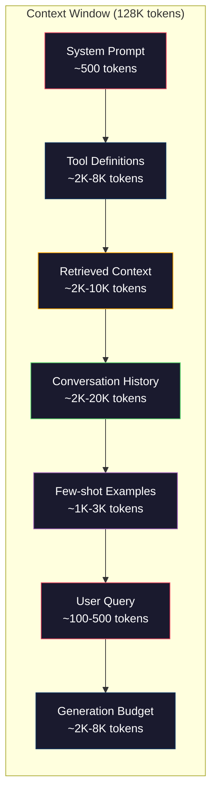
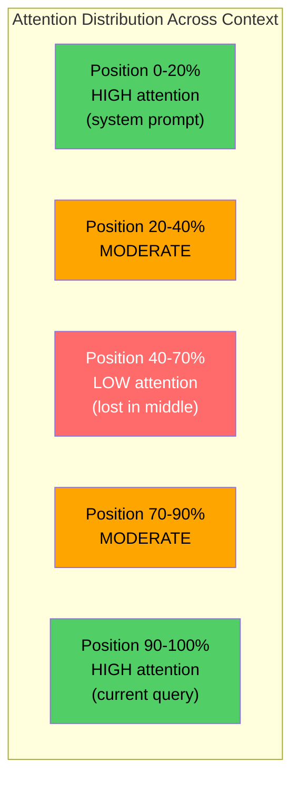
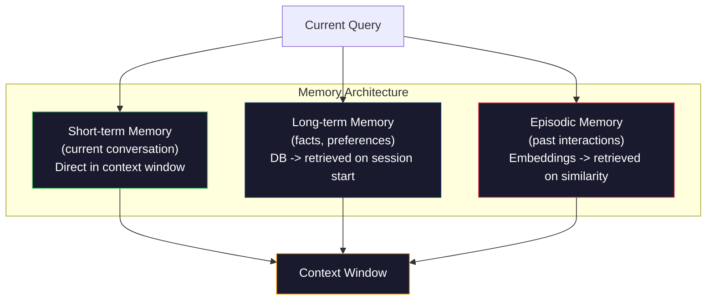

# Context Engineering: Windows, Budgets, Memory, and Retrieval | 上下文工程：窗口、预算、记忆与检索

> Prompt engineering is a subset. Context engineering is the whole game. A prompt is a string you type. Context is everything that goes into the model's window: system instructions, retrieved documents, tool definitions, conversation history, few-shot examples, and the prompt itself. The best AI engineers in 2026 are context engineers. They decide what goes in, what stays out, and in what order.

> **【中文解读】** 提示工程只是上下文工程的子集。上下文工程管理模型窗口中的一切内容——系统指令、检索文档、工具定义、对话历史等。2026年最优秀的 AI 工程师就是上下文工程师。

> **【拓展：上下文工程→Claude生态】** Claude 的 MCP 协议本质上就是上下文工程的标准实现——通过统一的协议管理模型可见的工具、资源和提示模板。

> 🔗 **【前置】** 学本节前请先掌握：(1) Phase 11·01-02（Prompt Engineering、Few-shot CoT）；(2) Phase 11·04（Embeddings）和 Phase 11·06（RAG）——理解检索如何取文档；(3) token 概念——本节重度讨论 token 预算。如果不知道 "200K context window" 指什么，先看 Phase 10。

**Type:** Build | **类型:** 构建
**Languages:** Python | **语言:** Python
**Prerequisites:** Phase 10 (LLMs from Scratch), Phase 11 Lesson 01-02 | **前置知识:** Phase 10（从零理解 LLM）、Phase 11 Lesson 01-02
**Time:** ~90 minutes | **时间:** ~90 分钟
**Related:** Phase 11 · 15 (Prompt Caching) — the cache-friendly layout is an extension of context engineering. Phase 5 · 28 (Long-Context Evaluation) for how to measure lost-in-the-middle with NIAH/RULER. | **相关:** Phase 11 · 15（提示缓存）——缓存友好布局是上下文工程的延伸。Phase 5 · 28（长上下文评估）介绍如何用 NIAH/RULER 测量"中间丢失"。

## Learning Objectives | 学习目标

- Calculate token budgets across all context window components (system prompt, tools, history, retrieved docs, generation headroom)
  跨所有上下文窗口组件（系统提示、工具、历史、检索文档、生成余量）计算 token 预算
- Implement context window management strategies: truncation, summarization, and sliding window for conversation history
  实现上下文窗口管理策略：截断、摘要、滑动窗口管理对话历史
- Prioritize and order context components to maximize the model's attention on the most relevant information
  按优先级排序上下文组件，最大化模型对最相关信息的注意力
- Build a context assembler that dynamically allocates tokens based on query type and available window space
  构建根据查询类型和可用窗口空间动态分配 token 的上下文组装器

> **【中文解读】** 本课目标：超越 Prompt Engineering，系统化管理进入模型上下文的所有信息。在有限上下文窗口内放入最相关信息是核心挑战。


## The Problem | 问题引入

Claude Opus 4.7 has a 200K token window (1M in beta). GPT-5 has 400K. Gemini 3 Pro has 2M. Llama 4 claims 10M. These numbers sound enormous until you fill them.

> Claude Opus 4.7 有 200K token 窗口（beta 版 1M）。GPT-5 有 400K。Gemini 3 Pro 有 2M。这些数字听起来很大，直到你填满它们。

Here is a real breakdown for a coding assistant. System prompt: 500 tokens. Tool definitions for 50 tools: 8,000 tokens. Retrieved documentation: 4,000 tokens. Conversation history (10 turns): 6,000 tokens. Current user query: 200 tokens. Generation budget (max output): 4,000 tokens. Total: 22,700 tokens. That is only 18% of a 128K window.

> 这是一个编程助手的真实分解。系统提示：500 token。50 个工具定义：8,000 token。检索文档：4,000 token。对话历史（10 轮）：6,000 token。当前查询：200 token。生成预算：4,000 token。总计：22,700 token。这只占 128K 窗口的 18%。

> 💡 **【类比】** 上下文窗口像书桌桌面——200K token 听起来很大，但放上"教科书（system prompt）"+"参考书（retrieved docs）"+"草稿纸（history）"+"计算器（tools）"就快满了。**Lost in the Middle** 现象像找东西：书桌上摆满东西时，最容易被忽略的是中间堆着的——你只会注意桌面开头（最近放的）和结尾（手边的）。修复：把关键信息放最前或最后，中间放可丢的内容。

> ⚠️ **【易错点】** 上下文管理的 3 个坑：(1) **历史无限增长**——对话越长 history 越大，最终撞窗口；修复：用 summarization（每 N 轮压缩成摘要）或 sliding window（只保留最近 K 轮 + 第一轮）。(2) **工具定义重复发送**——每次调用都把 50 个工具 schema 全发一遍；修复：用 prompt caching（Phase 11·15），Claude / OpenAI 都支持，省 90% cost。(3) **检索文档全塞**——召回 50 个 chunk 全塞 prompt 模型迷失；修复：top-5 高质量块 + cross-encoder 重排。

But attention does not scale linearly with context length. A model with 128K tokens of context pays quadratic attention cost (O(n^2) in vanilla transformers, though most production models use efficient attention variants). More importantly, retrieval accuracy degrades. The "Needle in a Haystack" test shows that models struggle to find information placed in the middle of long contexts. Research by Liu et al. (2023) showed that LLMs retrieve information at the start and end of long contexts with near-perfect accuracy, but accuracy drops 10-20% for information placed in the middle (positions 40-70% of the context). This "lost-in-the-middle" effect varies by model but affects all current architectures.

> 但注意力不会随上下文长度线性扩展。更重要的是，检索准确率会下降。"大海捞针"测试表明，模型难以找到放在长上下文中间位置的信息。Liu 等人（2023）的研究表明，LLM 在长上下文开头和结尾检索信息的准确率接近完美，但中间位置（上下文的 40-70%）的准确率下降 10-20%。

The practical lesson: having 200K tokens available does not mean using 200K tokens is effective. A carefully curated 10K token context often outperforms a dumped 100K token context. Context engineering is the discipline of maximizing signal-to-noise ratio within the context window.

> 实际教训：有 200K token 可用并不意味着使用 200K token 是有效的。精心策划的 10K token 上下文通常优于倾倒的 100K token 上下文。上下文工程是在上下文窗口内最大化信噪比的学科。

Every token you put in the window displaces a token that could carry more relevant information. Every irrelevant tool definition, every stale conversation turn, every chunk of retrieved text that does not answer the question -- each one makes the model slightly worse at the task.

> 你放入窗口的每个 token 都挤占了一个可能携带更相关信息的 token。每个不相关的工具定义、每个过时的对话轮次、每个不回答问题的检索文本块——每一个都让模型在任务上稍微变差。

## The Concept | 核心概念

> **【中文解读】** 上下文工程（Context Engineering）是超越 Prompt Engineering 的概念——不只是写好 prompt，而是系统化管理进入模型上下文窗口的所有信息：检索结果、对话历史、工具输出、系统指令等。在有限的上下文窗口内放入最相关的信息是核心挑战。

> **【拓展：上下文窗口的有效利用】** GPT-4o 有 128K token 上下文窗口，但研究表明模型对中间位置的信息"注意力下降"（Lost in the Middle 问题）。上下文工程策略包括：关键信息放在开头或结尾、按相关性排序检索结果、使用 RAG 压缩冗余上下文、Prompt Caching 缓存不变部分。


### The Context Window is a Scarce Resource

Think of the context window as RAM, not disk. It is fast and directly accessible, but limited. You cannot fit everything. You must choose.

> 把上下文窗口想成 RAM，不是磁盘。快速且直接可访问，但有限。你装不下所有东西，必须做选择。



Each component competes for space. Adding more tool definitions means less room for conversation history. Adding more retrieved context means less room for few-shot examples. Context engineering is the art of allocating this budget to maximize task performance.

> 每个组件争抢空间。加更多工具定义意味着对话历史空间更少。加更多检索上下文意味着少样本示例空间更少。上下文工程是分配这个预算以最大化任务性能的艺术。

### Lost-in-the-Middle

The most important empirical finding in context engineering. Models attend better to information at the beginning and end of the context. Information in the middle gets lower attention scores and is more likely to be ignored.

> 上下文工程中最重要的实证发现。模型对上下文开头和结尾的信息注意力更好。中间位置信息得到较低注意力分数，更容易被忽略。

Liu et al. (2023) tested this systematically. They placed a relevant document among 20 irrelevant documents at various positions and measured answer accuracy. When the relevant document was first or last, accuracy was 85-90%. When it was in the middle (position 10 of 20), accuracy dropped to 60-70%.

> Liu 等人（2023）系统性测试了这个现象。他们将相关文档放在 20 个不相关文档中的不同位置，测量答案准确率。相关文档在第一或最后时，准确率 85-90%。在中间位置（20 个中的第 10 个）时，准确率下降到 60-70%。

This has direct engineering implications:

> 这有直接的工程含义：

- Put the most important information first (system prompt, critical instructions)
  将最重要信息放最前面（系统提示、关键指令）
- Put the current query and most relevant context last (recency bias helps)
  将当前查询和最相关上下文放最后（近因偏差有利）
- Treat the middle of the context as the lowest-priority zone
  将上下文中间视为最低优先级区域
- If you must include information in the middle, duplicate the key point at the end
  如果必须在中间放信息，在结尾重复关键点



### Context Components

**System prompt**: sets the persona, constraints, and behavioral rules. This goes first and stays constant across turns. Claude Code uses roughly 6,000 tokens for its system prompt including tool definitions and behavioral instructions. Keep it tight. Every word in the system prompt is repeated on every API call.

> **系统提示**：设定 persona、约束和行为规则。放最前面且跨轮次保持不变。Claude Code 的系统提示大约 6,000 token，包含工具定义和行为指令。保持紧凑。系统提示中每个词在每次 API 调用中重复。

**Tool definitions**: each tool adds 50-200 tokens (name, description, parameter schema). 50 tools at 150 tokens each is 7,500 tokens before any conversation happens. Dynamic tool selection -- only including tools relevant to the current query -- can reduce this by 60-80%.

> **工具定义**：每个工具 50-200 token（名称、描述、参数 schema）。50 个工具每个 150 token，就是 7,500 token——在对话开始前就已占用。动态工具选择——只包含与当前查询相关的工具——可减少 60-80%。

**Retrieved context**: documents from a vector database, search results, file contents. The quality of retrieval directly determines the quality of the response. Bad retrieval is worse than no retrieval -- it fills the window with noise and actively misleads the model.

> **检索上下文**：来自向量数据库的文档、搜索结果、文件内容。检索质量直接决定响应质量。坏的检索比不检索更糟——它用噪声填满窗口并主动误导模型。

**Conversation history**: every previous user message and assistant response. Grows linearly with conversation length. A 50-turn conversation at 200 tokens per turn is 10,000 tokens of history. Most of it is irrelevant to the current query.

> **对话历史**：所有之前的用户消息和助手响应。随对话长度线性增长。50 轮对话每轮 200 token 就是 10,000 token 历史。大部分与当前查询无关。

**Few-shot examples**: input/output pairs that demonstrate the desired behavior. Two to three well-chosen examples often improve output quality more than thousands of tokens of instructions. But they cost space.

> **少样本示例**：演示期望行为的输入/输出对。2-3 个精心挑选的示例往往比数千 token 的指令更能提升输出质量。但它们消耗空间。

**Generation budget**: the tokens reserved for the model's response. If you fill the window to capacity, the model has no room to answer. Reserve at least 2,000-4,000 tokens for generation.

> **生成预算**：为模型响应保留的 token。若将窗口填满，模型没有空间回答。至少保留 2,000-4,000 token 用于生成。

### Context Compression Strategies

**History summarization**: instead of keeping all previous turns verbatim, periodically summarize the conversation. "We discussed X, decided Y, and the user wants Z" in 100 tokens replaces 10 turns that took 2,000 tokens. Run summarization when history exceeds a threshold (e.g., 5,000 tokens).

> **历史摘要**：而非逐字保留所有前序轮次，定期总结对话。"我们讨论了 X，决定 Y，用户想要 Z"用 100 token 替代 10 轮 2,000 token。当历史超过阈值（如 5,000 token）时运行摘要。

**Relevance filtering**: score each retrieved document against the current query and drop documents below a threshold. If you retrieved 10 chunks but only 3 are relevant, discard the other 7. Better to have 3 highly relevant chunks than 10 mediocre ones.

> **相关性过滤**：将每个检索文档与当前查询打分，丢弃低于阈值的。若检索了 10 个块但只有 3 个相关，丢弃其他 7 个。3 个高相关块比 10 个一般块好。

**Tool pruning**: classify the user's query intent and only include tools relevant to that intent. A code question does not need calendar tools. A scheduling question does not need file system tools. This can reduce tool definitions from 8,000 tokens to 1,000.

> **工具裁剪**：分类用户查询意图，只包含与该意图相关的工具。代码问题不需要日历工具。日程安排问题不需要文件系统工具。这能将工具定义从 8,000 token 减到 1,000。

**Recursive summarization**: for very long documents, summarize in stages. First summarize each section, then summarize the summaries. A 50-page document becomes a 500-token digest that captures the key points.

> **递归摘要**：对超长文档，分阶段总结。先总结每节，再总结摘要。50 页文档变成 500 token 的摘要，捕获关键点。

### Memory Systems

Context engineering spans three time horizons.

> 上下文工程跨越三个时间尺度。

**Short-term memory**: the current conversation. Stored in the context window directly. Grows with each turn. Managed by summarization and truncation.

> **短期记忆**：当前对话。直接存储在上下文窗口中。随每轮增长。通过摘要和截断管理。

**Long-term memory**: facts and preferences that persist across conversations. "The user prefers TypeScript." "The project uses PostgreSQL." Stored in a database, retrieved on session start. Claude Code stores this in CLAUDE.md files. ChatGPT stores it in its memory feature.

> **长期记忆**：跨对话持久的事实和偏好。"用户偏好 TypeScript。""项目用 PostgreSQL。"存储在数据库中，会话开始时检索。Claude Code 存在 CLAUDE.md 文件中。ChatGPT 存在其 memory 功能中。

**Episodic memory**: specific past interactions that might be relevant. "Last Tuesday, we debugged a similar issue in the auth module." Stored as embeddings, retrieved when the current conversation matches a past episode.

> **情景记忆**：可能相关的特定过去交互。"上周二我们在 auth 模块调试过类似问题。"存储为嵌入，当前对话匹配过去情景时检索。



### Dynamic Context Assembly

The key insight: different queries need different context. A static system prompt + static tools + static history is wasteful. The best systems dynamically assemble context per query.

> 关键洞察：不同查询需要不同上下文。静态系统提示 + 静态工具 + 静态历史是浪费。最好的系统按查询动态组装上下文。

1. Classify the query intent
   分类查询意图
2. Select relevant tools (not all tools)
   选择相关工具（不是全部工具）
3. Retrieve relevant documents (not a fixed set)
   检索相关文档（不是固定集合）
4. Include relevant history turns (not all history)
   包含相关历史轮次（不是全部历史）
5. Add few-shot examples that match the task type
   添加与任务类型匹配的少样本示例
6. Order everything by importance: critical first, important last, optional in the middle
   按重要性排序：关键在前、重要在后、可选在中间

This is what separates a good AI application from a great one. The model is the same. The context is the differentiator.

> 这是区分优秀 AI 应用和卓越 AI 应用的关键。模型相同。上下文是差异化因素。

## Build It | 动手实现

### Step 1: Token Counter

You cannot budget what you cannot measure. Build a simple token counter (approximation using whitespace splitting, since the exact count depends on the tokenizer).

> 你无法为无法测量的东西做预算。构建简单的 token 计数器（用空白分割近似，精确计数取决于 tokenizer）。

```python
import json
import numpy as np
from collections import OrderedDict

def count_tokens(text):
    if not text:
        return 0
    return int(len(text.split()) * 1.3)

def count_tokens_json(obj):
    return count_tokens(json.dumps(obj))
```

### Step 2: Context Budget Manager

The core abstraction. A budget manager tracks how many tokens each component uses and enforces limits.

> 核心抽象。预算管理器追踪每个组件使用多少 token 并强制限制。

```python
class ContextBudget:
    def __init__(self, max_tokens=128000, generation_reserve=4000):
        self.max_tokens = max_tokens
        self.generation_reserve = generation_reserve
        self.available = max_tokens - generation_reserve
        self.allocations = OrderedDict()

    def allocate(self, component, content, max_tokens=None):
        tokens = count_tokens(content)
        if max_tokens and tokens > max_tokens:
            words = content.split()
            target_words = int(max_tokens / 1.3)
            content = " ".join(words[:target_words])
            tokens = count_tokens(content)

        used = sum(self.allocations.values())
        if used + tokens > self.available:
            allowed = self.available - used
            if allowed <= 0:
                return None, 0
            words = content.split()
            target_words = int(allowed / 1.3)
            content = " ".join(words[:target_words])
            tokens = count_tokens(content)

        self.allocations[component] = tokens
        return content, tokens

    def remaining(self):
        used = sum(self.allocations.values())
        return self.available - used

    def utilization(self):
        used = sum(self.allocations.values())
        return used / self.max_tokens

    def report(self):
        total_used = sum(self.allocations.values())
        lines = []
        lines.append(f"Context Budget Report ({self.max_tokens:,} token window)")
        lines.append("-" * 50)
        for component, tokens in self.allocations.items():
            pct = tokens / self.max_tokens * 100
            bar = "#" * int(pct / 2)
            lines.append(f"  {component:<25} {tokens:>6} tokens ({pct:>5.1f}%) {bar}")
        lines.append("-" * 50)
        lines.append(f"  {'Used':<25} {total_used:>6} tokens ({total_used/self.max_tokens*100:.1f}%)")
        lines.append(f"  {'Generation reserve':<25} {self.generation_reserve:>6} tokens")
        lines.append(f"  {'Remaining':<25} {self.remaining():>6} tokens")
        return "\n".join(lines)
```

### Step 3: Lost-in-the-Middle Reordering

Implement the reordering strategy: most important items go first and last, least important go in the middle.

> 实现重排序策略：最重要项放最前和最后，最不重要项放中间。

```python
def reorder_lost_in_middle(items, scores):
    paired = sorted(zip(scores, items), reverse=True)
    sorted_items = [item for _, item in paired]

    if len(sorted_items) <= 2:
        return sorted_items

    first_half = sorted_items[::2]
    second_half = sorted_items[1::2]
    second_half.reverse()

    return first_half + second_half

def score_relevance(query, documents):
    query_words = set(query.lower().split())
    scores = []
    for doc in documents:
        doc_words = set(doc.lower().split())
        if not query_words:
            scores.append(0.0)
            continue
        overlap = len(query_words & doc_words) / len(query_words)
        scores.append(round(overlap, 3))
    return scores
```

### Step 4: Conversation History Compressor

Summarize old conversation turns to reclaim token budget.

> 总结旧对话轮次以回收 token 预算。

```python
class ConversationManager:
    def __init__(self, max_history_tokens=5000):
        self.turns = []
        self.summaries = []
        self.max_history_tokens = max_history_tokens

    def add_turn(self, role, content):
        self.turns.append({"role": role, "content": content})
        self._compress_if_needed()

    def _compress_if_needed(self):
        total = sum(count_tokens(t["content"]) for t in self.turns)
        if total <= self.max_history_tokens:
            return

        while total > self.max_history_tokens and len(self.turns) > 4:
            old_turns = self.turns[:2]
            summary = self._summarize_turns(old_turns)
            self.summaries.append(summary)
            self.turns = self.turns[2:]
            total = sum(count_tokens(t["content"]) for t in self.turns)

    def _summarize_turns(self, turns):
        parts = []
        for t in turns:
            content = t["content"]
            if len(content) > 100:
                content = content[:100] + "..."
            parts.append(f"{t['role']}: {content}")
        return "Previous: " + " | ".join(parts)

    def get_context(self):
        parts = []
        if self.summaries:
            parts.append("[Conversation Summary]")
            for s in self.summaries:
                parts.append(s)
        parts.append("[Recent Conversation]")
        for t in self.turns:
            parts.append(f"{t['role']}: {t['content']}")
        return "\n".join(parts)

    def token_count(self):
        return count_tokens(self.get_context())
```

### Step 5: Dynamic Tool Selector

Only include tools relevant to the current query. Classify intent, then filter.

> 只包含与当前查询相关的工具。分类意图，然后过滤。

```python
TOOL_REGISTRY = {
    "read_file": {
        "description": "Read contents of a file",
        "tokens": 120,
        "categories": ["code", "files"],
    },
    "write_file": {
        "description": "Write content to a file",
        "tokens": 150,
        "categories": ["code", "files"],
    },
    "search_code": {
        "description": "Search for patterns in codebase",
        "tokens": 130,
        "categories": ["code"],
    },
    "run_command": {
        "description": "Execute a shell command",
        "tokens": 140,
        "categories": ["code", "system"],
    },
    "create_calendar_event": {
        "description": "Create a new calendar event",
        "tokens": 180,
        "categories": ["calendar"],
    },
    "list_emails": {
        "description": "List recent emails",
        "tokens": 160,
        "categories": ["email"],
    },
    "send_email": {
        "description": "Send an email message",
        "tokens": 200,
        "categories": ["email"],
    },
    "web_search": {
        "description": "Search the web for information",
        "tokens": 140,
        "categories": ["research"],
    },
    "query_database": {
        "description": "Run a SQL query on the database",
        "tokens": 170,
        "categories": ["code", "data"],
    },
    "generate_chart": {
        "description": "Generate a chart from data",
        "tokens": 190,
        "categories": ["data", "visualization"],
    },
}

def classify_intent(query):
    query_lower = query.lower()

    intent_keywords = {
        "code": ["code", "function", "bug", "error", "file", "implement", "refactor", "debug", "test"],
        "calendar": ["meeting", "schedule", "calendar", "appointment", "event"],
        "email": ["email", "mail", "send", "inbox", "message"],
        "research": ["search", "find", "what is", "how does", "explain", "look up"],
        "data": ["data", "query", "database", "chart", "graph", "analytics", "sql"],
    }

    scores = {}
    for intent, keywords in intent_keywords.items():
        score = sum(1 for kw in keywords if kw in query_lower)
        if score > 0:
            scores[intent] = score

    if not scores:
        return ["code"]

    max_score = max(scores.values())
    return [intent for intent, score in scores.items() if score >= max_score * 0.5]

def select_tools(query, token_budget=2000):
    intents = classify_intent(query)
    relevant = {}
    total_tokens = 0

    for name, tool in TOOL_REGISTRY.items():
        if any(cat in intents for cat in tool["categories"]):
            if total_tokens + tool["tokens"] <= token_budget:
                relevant[name] = tool
                total_tokens += tool["tokens"]

    return relevant, total_tokens
```

### Step 6: Full Context Assembly Pipeline

Wire everything together. Given a query, dynamically assemble the optimal context.

> 把一切串起来。给定查询，动态组装最优上下文。

```python
class ContextEngine:
    def __init__(self, max_tokens=128000, generation_reserve=4000):
        self.budget = ContextBudget(max_tokens, generation_reserve)
        self.conversation = ConversationManager(max_history_tokens=5000)
        self.system_prompt = (
            "You are a helpful AI assistant. You have access to tools for "
            "code editing, file management, web search, and data analysis. "
            "Use the appropriate tools for each task. Be concise and accurate."
        )
        self.knowledge_base = [
            "Python 3.12 introduced type parameter syntax for generic classes using bracket notation.",
            "The project uses PostgreSQL 16 with pgvector for embedding storage.",
            "Authentication is handled by Supabase Auth with JWT tokens.",
            "The frontend is built with Next.js 15 using the App Router.",
            "API rate limits are set to 100 requests per minute per user.",
            "The deployment pipeline uses GitHub Actions with Docker multi-stage builds.",
            "Test coverage must be above 80% for all new modules.",
            "The codebase follows the repository pattern for data access.",
        ]

    def assemble(self, query):
        self.budget = ContextBudget(self.budget.max_tokens, self.budget.generation_reserve)

        system_content, _ = self.budget.allocate("system_prompt", self.system_prompt, max_tokens=1000)

        tools, tool_tokens = select_tools(query, token_budget=2000)
        tool_text = json.dumps(list(tools.keys()))
        tool_content, _ = self.budget.allocate("tools", tool_text, max_tokens=2000)

        relevance = score_relevance(query, self.knowledge_base)
        threshold = 0.1
        relevant_docs = [
            doc for doc, score in zip(self.knowledge_base, relevance)
            if score >= threshold
        ]

        if relevant_docs:
            doc_scores = [s for s in relevance if s >= threshold]
            reordered = reorder_lost_in_middle(relevant_docs, doc_scores)
            doc_text = "\n".join(reordered)
            doc_content, _ = self.budget.allocate("retrieved_context", doc_text, max_tokens=3000)

        history_text = self.conversation.get_context()
        if history_text.strip():
            history_content, _ = self.budget.allocate("conversation_history", history_text, max_tokens=5000)

        query_content, _ = self.budget.allocate("user_query", query, max_tokens=500)

        return self.budget

    def chat(self, query):
        self.conversation.add_turn("user", query)
        budget = self.assemble(query)
        response = f"[Response to: {query[:50]}...]"
        self.conversation.add_turn("assistant", response)
        return budget


def run_demo():
    print("=" * 60)
    print("  Context Engineering Pipeline Demo")
    print("=" * 60)

    engine = ContextEngine(max_tokens=128000, generation_reserve=4000)

    print("\n--- Query 1: Code task ---")
    budget = engine.chat("Fix the bug in the authentication module where JWT tokens expire too early")
    print(budget.report())

    print("\n--- Query 2: Research task ---")
    budget = engine.chat("What is the best approach for implementing vector search in PostgreSQL?")
    print(budget.report())

    print("\n--- Query 3: After conversation history builds up ---")
    for i in range(8):
        engine.conversation.add_turn("user", f"Follow-up question number {i+1} about the implementation details of the system")
        engine.conversation.add_turn("assistant", f"Here is the response to follow-up {i+1} with technical details about the architecture")

    budget = engine.chat("Now implement the changes we discussed")
    print(budget.report())

    print("\n--- Tool Selection Examples ---")
    test_queries = [
        "Fix the bug in auth.py",
        "Schedule a meeting with the team for Tuesday",
        "Show me the database query performance stats",
        "Search for best practices on error handling",
    ]

    for q in test_queries:
        tools, tokens = select_tools(q)
        intents = classify_intent(q)
        print(f"\n  Query: {q}")
        print(f"  Intents: {intents}")
        print(f"  Tools: {list(tools.keys())} ({tokens} tokens)")

    print("\n--- Lost-in-the-Middle Reordering ---")
    docs = ["Doc A (most relevant)", "Doc B (somewhat relevant)", "Doc C (least relevant)",
            "Doc D (relevant)", "Doc E (moderately relevant)"]
    scores = [0.95, 0.60, 0.20, 0.80, 0.50]
    reordered = reorder_lost_in_middle(docs, scores)
    print(f"  Original order: {docs}")
    print(f"  Scores:         {scores}")
    print(f"  Reordered:      {reordered}")
    print(f"  (Most relevant at start and end, least relevant in middle)")
```

## Use It | 用框架实现

### Claude Code's Context Strategy

Claude Code manages context with a layered approach. The system prompt includes behavioral rules and tool definitions (~6K tokens). When you open a file, its contents are injected as context. When you search, results are added. Old conversation turns are summarized. CLAUDE.md provides long-term memory that persists across sessions.

> Claude Code 用分层方法管理上下文。系统提示包含行为规则和工具定义（约 6K token）。打开文件时其内容注入上下文。搜索时结果被添加。旧对话轮次被摘要。CLAUDE.md 提供跨会话持久化的长期记忆。

The key engineering decision: Claude Code does not dump your entire codebase into the context. It retrieves relevant files on demand. This is context engineering in practice.

> 关键工程决策：Claude Code 不把整个代码库倾倒入上下文。它按需检索相关文件。这是上下文工程的实践。

### Cursor's Dynamic Context Loading

Cursor indexes your entire codebase into embeddings. When you type a query, it retrieves the most relevant files and code blocks using vector similarity. Only those pieces go into the context window. A 500K-line codebase is compressed into the 5-10 most relevant code blocks.

> Cursor 将整个代码库索引为嵌入。输入查询时，用向量相似度检索最相关的文件和代码块。只有这些片段进入上下文窗口。500K 行代码库压缩为 5-10 个最相关代码块。

This is the pattern: embed everything, retrieve on demand, include only what matters.

> 这就是模式：嵌入一切，按需检索，只包含重要的。

### ChatGPT Memory

ChatGPT stores user preferences and facts as long-term memory. On each conversation start, relevant memories are retrieved and included in the system prompt. "The user prefers Python" costs 5 tokens but saves hundreds of tokens of repeated instructions across conversations.

> ChatGPT 将用户偏好和事实存储为长期记忆。每次对话开始时，相关记忆被检索并包含在系统提示中。"用户偏好 Python"消耗 5 token，但跨对话节省数百 token 的重复指令。

### RAG as Context Engineering

Retrieval-Augmented Generation is context engineering formalized. Instead of stuffing knowledge into the model's weights (training) or the system prompt (static context), you retrieve relevant documents at query time and inject them into the context window. The entire RAG pipeline -- chunking, embedding, retrieval, reranking -- exists to solve one problem: putting the right information in the context window.

> 检索增强生成是上下文工程的形式化。不把知识塞进模型权重（训练）或系统提示（静态上下文），而在查询时检索相关文档并注入上下文窗口。整个 RAG 管线——分块、嵌入、检索、重排——存在就是为解决一个问题：把正确信息放入上下文窗口。

## Ship It | 产出物

This lesson produces `outputs/prompt-context-optimizer.md` -- a reusable prompt that audits a context assembly strategy and recommends optimizations. Feed it your system prompt, tool count, average history length, and retrieval strategy, and it identifies token waste and suggests improvements.

> 本课产出 `outputs/prompt-context-optimizer.md`——审计上下文组装策略并推荐优化的可复用提示。把系统提示、工具数、平均历史长度和检索策略喂给它，它识别 token 浪费并建议改进。

It also produces `outputs/skill-context-engineering.md` -- a decision framework for designing context assembly pipelines based on task type, context window size, and latency budget.

> 同时产出 `outputs/skill-context-engineering.md`——基于任务类型、上下文窗口大小和延迟预算设计上下文组装管线的决策框架。

## Exercises | 练习题

1. Add a "token waste detector" to the ContextBudget class. It should flag components using more than 30% of the budget and suggest compression strategies specific to each component type (summarize history, prune tools, re-rank documents).
   给 ContextBudget 添加"token 浪费检测器"。应标记使用超过 30% 预算的组件，并建议针对每种组件类型的压缩策略（摘要历史、裁剪工具、重排文档）。

2. Implement semantic deduplication for retrieved context. If two retrieved documents are more than 80% similar (by word overlap or cosine similarity of their embeddings), keep only the higher-scored one. Measure how much token budget this recovers.
   实现检索上下文的语义去重。若两个检索文档超过 80% 相似（按词重叠或嵌入余弦相似度），只保留分数更高的。测量这回收了多少 token 预算。

3. Build a "context replay" tool. Given a conversation transcript, replay it through the ContextEngine and visualize how the budget allocation changes turn by turn. Plot token usage per component over time. Identify the turn where context starts getting compressed.
   构建"上下文回放"工具。给定对话转录，通过 ContextEngine 回放并可视化预算分配如何轮次变化。绘制每组件随时间的 token 使用。识别上下文开始被压缩的轮次。

4. Implement a priority-based tool selector. Instead of binary include/exclude, assign each tool a relevance score to the current query. Include tools in descending relevance order until the tool budget is exhausted. Compare task performance with 5, 10, 20, and 50 tools included.
   实现基于优先级的工具选择器。非二元包含/排除，而是给每个工具对当前查询的相关性打分。按相关性降序包含工具直到工具预算耗尽。比较包含 5、10、20、50 个工具时的任务性能。

5. Build a multi-strategy context compressor. Implement three compression strategies (truncation, summarization, extraction of key sentences) and benchmark them on a set of 20 documents. Measure the tradeoff between compression ratio and information retention (does the compressed version still contain the answer to the query?).
   构建多策略上下文压缩器。实现三种压缩策略（截断、摘要、关键句提取），在 20 个文档集上基准测试。测量压缩率和信息保留的权衡（压缩版本是否仍包含查询的答案？）。

## Key Terms | 术语速查表

| Term | What people say | What it actually means | 中文释义 |
|------|----------------|----------------------|---------|
| Context window | "How much the model can read" | The maximum number of tokens (input + output) the model processes in a single forward pass -- 400K for GPT-5, 200K (1M beta) for Claude Opus 4.7, 2M for Gemini 3 Pro | 上下文窗口：模型单次前向传播处理的最大 token 数（输入+输出）|
| Context engineering | "Advanced prompt engineering" | The discipline of deciding what goes into the context window, in what order, and at what priority -- encompasses retrieval, compression, tool selection, and memory management | 上下文工程：决定什么进入上下文窗口、什么顺序、什么优先级的学科——包含检索、压缩、工具选择、记忆管理 |
| Lost-in-the-middle | "Models forget stuff in the middle" | Empirical finding that LLMs attend better to the beginning and end of context, with 10-20% accuracy drop for information placed in the middle | 中间丢失：LLM 对上下文开头和结尾注意力更好的实证发现；中间位置准确率下降 10-20% |
| Token budget | "How many tokens you have left" | An explicit allocation of context window capacity across components (system prompt, tools, history, retrieval, generation) with per-component limits | token 预算：跨组件的上下文窗口容量显式分配（系统提示、工具、历史、检索、生成）带每组件限制 |
| Dynamic context | "Loading stuff on the fly" | Assembling the context window differently for each query based on intent classification, relevant tool selection, and retrieval results | 动态上下文：基于意图分类、相关工具选择和检索结果，为每个查询不同地组装上下文窗口 |
| History summarization | "Compressing the conversation" | Replacing verbatim old conversation turns with a concise summary, reducing token cost while preserving key information | 历史摘要：用简洁摘要替代逐字旧对话轮次，减少 token 成本同时保留关键信息 |
| Tool pruning | "Only including relevant tools" | Classifying query intent and only including tool definitions that match, reducing tool token cost by 60-80% | 工具裁剪：分类查询意图只包含匹配的工具定义，减少工具 token 成本 60-80% |
| Long-term memory | "Remembering across sessions" | Facts and preferences stored in a database and retrieved at session start -- CLAUDE.md, ChatGPT Memory, and similar systems | 长期记忆：跨会话存储在数据库并在会话开始时检索的事实和偏好——CLAUDE.md、ChatGPT Memory 等 |
| Episodic memory | "Remembering specific past events" | Past interactions stored as embeddings and retrieved when the current query is similar to a past conversation | 情景记忆：作为嵌入存储的过去交互，当前查询相似时检索 |
| Generation budget | "Room for the answer" | Tokens reserved for the model's output -- if the context fills the window completely, the model has no room to respond | 生成预算：为模型输出保留的 token——若上下文填满窗口，模型没有空间响应 |

## Further Reading | 延伸阅读

- [Liu et al., 2023 -- "Lost in the Middle: How Language Models Use Long Contexts"](https://arxiv.org/abs/2307.03172) -- the definitive study on position-dependent attention, showing that models struggle with information in the middle of long contexts
  Liu 等，"Lost in the Middle"（2023）——位置相关注意力的权威研究，表明模型难以处理长上下文中间的信息
- [Anthropic's Contextual Retrieval blog post](https://www.anthropic.com/news/contextual-retrieval) -- how Anthropic approaches context-aware chunk retrieval, reducing retrieval failure by 49%
  Anthropic 上下文检索博客——Anthropic 如何处理上下文感知分块检索，将检索失败减少 49%
- [Simon Willison's "Context Engineering"](https://simonwillison.net/2025/Jun/27/context-engineering/) -- the blog post that named the discipline and distinguished it from prompt engineering
  Simon Willison 的"Context Engineering"——命名该学科并区分它与提示工程的博文
- [LangChain documentation on RAG](https://python.langchain.com/docs/tutorials/rag/) -- practical implementation of retrieval-augmented generation as a context engineering pattern
  LangChain RAG 文档——将检索增强生成作为上下文工程模式的实用实现
- [Greg Kamradt's Needle in a Haystack test](https://github.com/gkamradt/LLMTest_NeedleInAHaystack) -- the benchmark that revealed position-dependent retrieval failures across all major models
  Greg Kamradt 的大海捞针测试——揭示所有主要模型位置相关检索失败的基准
- [Pope et al., "Efficiently Scaling Transformer Inference" (2022)](https://arxiv.org/abs/2211.05102) -- why context length drives memory and latency, and how KV cache, MQA, and GQA change the budget calculation.
  Pope 等，"Efficiently Scaling Transformer Inference"（2022）——为何上下文长度驱动内存和延迟，以及 KV cache、MQA、GQA 如何改变预算计算。
- [Agrawal et al., "SARATHI: Efficient LLM Inference by Piggybacking Decodes with Chunked Prefills" (2023)](https://arxiv.org/abs/2308.16369) -- the two phases of inference that make long prompts expensive in TTFT but cheap in TPOT; the ground truth behind context-packing tradeoffs.
  Agrawal 等，"SARATHI"（2023）——推理两阶段使长提示在 TTFT 上昂贵但 TPOT 上便宜；上下文打包权衡背后的真相。
- [Ainslie et al., "GQA: Training Generalized Multi-Query Transformer Models from Multi-Head Checkpoints" (EMNLP 2023)](https://arxiv.org/abs/2305.13245) -- the grouped-query attention paper that cut KV memory 8× in production decoders without quality loss.
  Ainslie 等，"GQA"（EMNLP 2023）——分组查询注意力论文，在生产解码器中将 KV 内存减少 8 倍而无质量损失。
