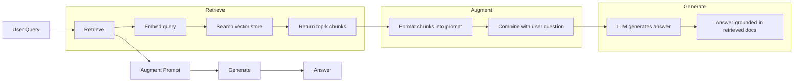
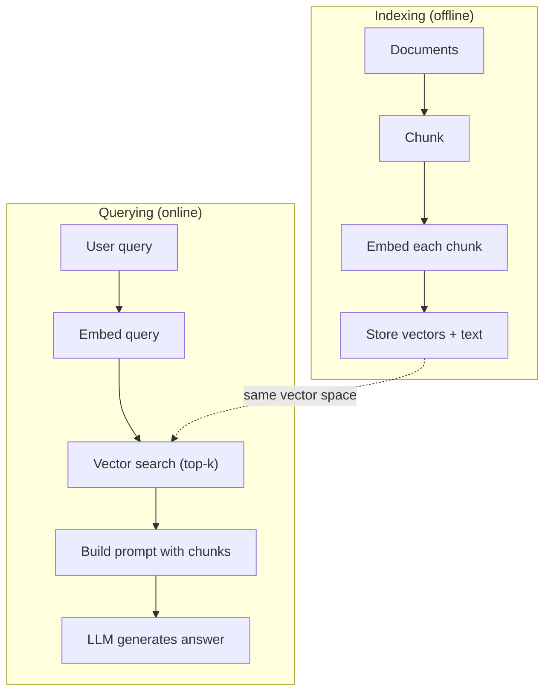

# RAG (Retrieval-Augmented Generation) | 检索增强生成

> Your LLM knows everything up to its training cutoff. It knows nothing about your company's docs, your codebase, or last week's meeting notes. RAG solves this by retrieving relevant documents and stuffing them into the prompt. It's the most deployed pattern in production AI. If you build one thing from this course, build a RAG pipeline.

> **【中文解读】** LLM 只知道训练截止日期前的信息。RAG 通过检索相关文档并注入提示来弥补知识缺口。这是生产环境中部署最广泛的 AI 模式——如果你只学一个东西，就学 RAG。

> **【拓展：RAG→企业AI应用】** RAG 是企业落地 AI 的首选方案：知识库问答、合同审查、技术文档助手、金融研报分析等场景都依赖 RAG 管道。

**Type:** Build | **类型:** 构建
**Languages:** Python | **语言:** Python
**Prerequisites:** Phase 10 (LLMs from Scratch), Phase 11 Lessons 01-05 | **前置知识:** Phase 10（从零理解 LLM）、Phase 11 Lesson 01-05
**Time:** ~90 minutes | **时间:** ~90 分钟
**Related:** Phase 5 · 23 (Chunking Strategies for RAG) for the six chunking algorithms and when each wins. Phase 5 · 22 (Embedding Models Deep Dive) for picking the embedder. Phase 11 · 07 (Advanced RAG) for hybrid search, reranking, and query transformation. | **相关:** Phase 5 · 23（RAG 分块策略）介绍六种分块算法及各自适用场景。Phase 5 · 22（嵌入模型深度解析）介绍如何选嵌入器。Phase 11 · 07（高级 RAG）介绍混合搜索、重排和查询转换。

## Learning Objectives | 学习目标

- Build a complete RAG pipeline: document loading, chunking, embedding, vector storage, retrieval, and generation
  构建完整 RAG 管线：文档加载、分块、嵌入、向量存储、检索、生成
- Implement semantic search using a vector database (ChromaDB, FAISS, or Pinecone) with proper indexing
  用向量数据库（ChromaDB、FAISS 或 Pinecone）实现语义搜索并正确索引
- Explain why RAG is preferred over fine-tuning for knowledge-grounded applications (cost, freshness, attribution)
  解释为何知识接地应用更偏好 RAG 而非微调（成本、新鲜度、归因）
- Evaluate RAG quality using retrieval metrics (precision, recall) and generation metrics (faithfulness, relevance)
  用检索指标（precision、recall）和生成指标（faithfulness、relevance）评估 RAG 质量

> **【中文解读】** 本课目标：实现完整的 RAG（检索增强生成）管线——文档切分、嵌入生成、向量检索、上下文注入、答案生成。RAG 是解决 LLM 知识时效性和幻觉问题的主流方案。


## The Problem | 问题引入

You build a chatbot for your company. A customer asks "What's the refund policy for enterprise plans?" The LLM responds with a generic answer about typical SaaS refund policies. The actual policy, buried in a 200-page internal wiki, says enterprise customers get a 60-day window with pro-rated refunds. The LLM has never seen this document. It cannot know what it was not trained on.

> 你为公司构建了一个聊天机器人。客户问"企业版的退款政策是什么？"LLM 给出了关于典型 SaaS 退款政策的通用回答。实际政策藏在 200 页的内部维基中，说企业客户有 60 天窗口期并按比例退款。LLM 从未见过这个文档。它无法知道它没被训练过的东西。

Fine-tuning is one solution. Take the LLM, train it on your internal docs, and deploy the updated model. This works but has serious problems. Fine-tuning costs thousands of dollars in compute. The model becomes stale the moment a document changes. You have no way to know which source the model drew from. And if the company acquires another product line next month, you fine-tune again.

> 微调是一种解决方案。但微调需要数千美元的计算成本。文档一变模型就过时了。你无法知道模型引用了哪个来源。如果公司下个月收购了新的产品线，你又要重新微调。

RAG is the other solution. Leave the model untouched. When a question comes in, search your document store for relevant passages, paste them into the prompt before the question, and let the model answer using those passages as context. The document store can be updated in minutes. You can see exactly which documents were retrieved. The model itself never changes. This is why RAG is the dominant pattern in production: it's cheaper, fresher, more auditable, and works with any LLM.

> RAG 是另一种解决方案。保持模型不变。当问题进来时，搜索你的文档存储找到相关段落，将它们粘贴到提示中问题的前面，让模型使用这些段落作为上下文来回答。这就是为什么 RAG 是生产中的主流模式：更便宜、更新鲜、更可审计，适用于任何 LLM。

## The Concept | 核心概念

> **【中文解读】** RAG（Retrieval-Augmented Generation，检索增强生成）将外部知识库与 LLM 结合：用户提问到从向量数据库检索相关文档到将检索结果注入 prompt 到 LLM 基于检索结果生成回答。RAG 解决了 LLM 的知识时效性和幻觉问题。

> **【拓展：RAG 的生产实践】** 典型 RAG 管线：文档切分（chunking）到嵌入生成到向量存储（Pinecone/Weaviate/Chroma）到相似度检索到重排序（reranking）到注入 prompt。LlamaIndex 和 LangChain 是最流行的 RAG 框架。Meta 的研究显示 RAG 在知识密集型任务上将准确率提升了 30-50%。


### The RAG Pattern

The entire pattern fits in four steps:

> 整个模式就四步：



Query -> Retrieve -> Augment prompt -> Generate. Every RAG system follows this pattern. The differences between production RAG systems are in the details of each step: how you chunk, how you embed, how you search, and how you construct the prompt.

> 查询 -> 检索 -> 增强提示 -> 生成。每个 RAG 系统都遵循这个模式。生产 RAG 系统的差异在每个步骤的细节：如何分块、如何嵌入、如何搜索、如何构造提示。

### Why RAG Beats Fine-Tuning

| Concern | Fine-tuning | RAG |
|---------|------------|-----|
| Cost / 成本 | $1,000-$100,000+ per training run / 每训练 1K-100K+ 美元 | $0.01-$0.10 per query (embedding + LLM) / 每查询 0.01-0.10 美元 |
| Freshness / 新鲜度 | Stale until retrained / 重训前都过时 | Updated in minutes by re-indexing docs / 重新索引文档即可在几分钟内更新 |
| Auditability / 可审计性 | Cannot trace answer to source / 无法追溯答案来源 | Can show exact retrieved passages / 可显示精确检索段落 |
| Hallucination / 幻觉 | Still hallucinates freely / 仍自由幻觉 | Grounded in retrieved documents / 基于检索文档接地 |
| Data privacy / 数据隐私 | Training data baked into weights / 训练数据固化在权重中 | Documents stay in your vector store / 文档留在你的向量存储中 |

Fine-tuning changes the model's weights permanently. RAG changes the model's context temporarily. For most applications, temporary context is what you want.

> 微调永久改变模型权重。RAG 临时改变模型上下文。对大多数应用，临时上下文就是你要的。

The one case where fine-tuning wins: when you need the model to adopt a specific style, tone, or reasoning pattern that cannot be achieved through prompting alone. For factual knowledge retrieval, RAG wins every time.

> 微调胜出的唯一情况：当你需要模型采用特定风格、语气或推理模式，而这是仅靠提示无法达到的。对于事实知识检索，RAG 每次都赢。

### Embedding Models

An embedding model converts text into a dense vector. Similar texts produce vectors that are close together in this high-dimensional space. "How do I reset my password?" and "I need to change my password" produce nearly identical vectors despite sharing few words. "The cat sat on the mat" produces a very different vector.

> 嵌入模型将文本转为稠密向量。相似文本在这个高维空间中产生距离接近的向量。"如何重置密码？"和"我需要修改密码"尽管共享单词不多，却产生几乎相同的向量。"猫坐在垫子上"产生截然不同的向量。

Common embedding models (2026 lineup — see Phase 5 · 22 for full analysis):

> 常见嵌入模型（2026 年阵容——完整分析见 Phase 5 · 22）：

| Model | Dimensions | Provider | Notes |
|-------|-----------|----------|-------|
| text-embedding-3-small | 1536 (Matryoshka) | OpenAI | Best price/performance for most use cases / 大多数场景最佳性价比 |
| text-embedding-3-large | 3072 (Matryoshka) | OpenAI | Higher accuracy, truncatable to 256/512/1024 / 更高精度，可截断到 256/512/1024 |
| Gemini Embedding 2 | 3072 (Matryoshka) | Google | Top MTEB retrieval; 8K context / 顶级 MTEB 检索；8K 上下文 |
| voyage-4 | 1024/2048 (Matryoshka) | Voyage AI | Domain variants (code, finance, law) / 领域变体（代码、金融、法律）|
| Cohere embed-v4 | 1024 (Matryoshka) | Cohere | Strong multilingual, 128K context / 强多语言，128K 上下文 |
| BGE-M3 | 1024 (dense + sparse + ColBERT) | BAAI (open-weight) | Three views from one model / 一个模型三种视图 |
| Qwen3-Embedding | 4096 (Matryoshka) | Alibaba (open-weight) | Top open-weight retrieval score / 顶级开源权重检索分数 |
| all-MiniLM-L6-v2 | 384 | Open-weight (Sentence Transformers) | Prototyping baseline / 原型基线 |

For this lesson, we build our own simple embedding using TF-IDF. Not because TF-IDF is what production systems use, but because it makes the concept concrete: text goes in, a vector comes out, similar texts produce similar vectors.

> 本课我们用 TF-IDF 构建自己的简单嵌入。不是因为 TF-IDF 是生产系统用的，而是因为它让概念具体化：文本进，向量出，相似文本产生相似向量。

### Vector Similarity

Given two vectors, how do you measure similarity? Three options:

> 给定两个向量，如何衡量相似度？三种选择：

**Cosine similarity**: the cosine of the angle between two vectors. Ranges from -1 (opposite) to 1 (identical). Ignores magnitude, only cares about direction. This is the default for RAG.

> **余弦相似度**：两个向量夹角的余弦。范围 -1（相反）到 1（相同）。忽略幅度，只关心方向。这是 RAG 的默认选择。

```
cosine_sim(a, b) = dot(a, b) / (||a|| * ||b||)
```

**Dot product**: the raw inner product. Larger vectors get higher scores. Useful when magnitude carries information (longer documents might be more relevant).

> **点积**：原始内积。较大向量得更高分。幅度携带信息时有用（较长文档可能更相关）。

```
dot(a, b) = sum(a_i * b_i)
```

**L2 (Euclidean) distance**: straight-line distance in the vector space. Smaller distance = more similar. Sensitive to magnitude differences.

> **L2（欧氏）距离**：向量空间中的直线距离。距离越小越相似。对幅度差异敏感。

```
L2(a, b) = sqrt(sum((a_i - b_i)^2))
```

Cosine similarity is the standard. It handles documents of different lengths gracefully because it normalizes by magnitude. When someone says "vector search," they almost always mean cosine similarity.

> 余弦相似度是标准。它优雅处理不同长度文档，因为它按幅度归一化。当有人说"向量搜索"，几乎总是指余弦相似度。

### Chunking Strategies

Documents are too long to embed as single vectors. A 50-page PDF might produce a terrible embedding because it contains dozens of topics. Instead, you split documents into chunks and embed each chunk separately.

> 文档太长，无法作为单个向量嵌入。50 页 PDF 可能产生糟糕的嵌入，因为它包含几十个主题。相反，你将文档拆分为块，分别嵌入每块。

**Fixed-size chunking**: split every N tokens. Simple and predictable. A 512-token chunk with 50-token overlap means chunk 1 is tokens 0-511, chunk 2 is tokens 462-973, and so on. The overlap ensures you do not split a sentence at an unlucky boundary.

> **固定大小分块**：每 N token 拆分一次。简单可预测。512 token 块加 50 token 重叠意味着块 1 是 token 0-511，块 2 是 token 462-973，依此类推。重叠确保你不会在不幸运的边界拆分句子。

**Semantic chunking**: split at natural boundaries. Paragraphs, sections, or markdown headers. Each chunk is a coherent unit of meaning. More complex to implement but produces better retrieval.

> **语义分块**：在自然边界拆分。段落、章节或 Markdown 标题。每块是一个连贯的意义单元。实现更复杂但产生更好检索。

**Recursive chunking**: try to split at the largest boundary first (section headers). If a section is still too large, split at paragraph boundaries. If a paragraph is still too large, split at sentence boundaries. This is the LangChain RecursiveCharacterTextSplitter approach and it works well in practice.

> **递归分块**：先在最大边界（章节标题）拆分。若节仍太大，在段落边界拆分。若段落仍太大，在句子边界拆分。这是 LangChain RecursiveCharacterTextSplitter 方法，实践中效果好。

Chunk size matters more than people think:

> 块大小比人们想的更重要：

- Too small (64-128 tokens): each chunk lacks context. "It increased 15% last quarter" means nothing without knowing what "it" refers to.
  太小（64-128 token）：每块缺乏上下文。"上季度增长 15%"在不知道"它"指代什么时毫无意义。
- Too large (2048+ tokens): each chunk covers multiple topics, diluting relevance. When you search for revenue data, you get a chunk that's 10% about revenue and 90% about headcount.
  太大（2048+ token）：每块涵盖多主题，稀释相关性。搜索营收数据时得到 10% 关于营收 90% 关于人头的块。
- Sweet spot (256-512 tokens): enough context to be self-contained, focused enough to be relevant.
  最佳点（256-512 token）：足够自包含的上下文，足够聚焦以相关。

Most production RAG systems use 256-512 token chunks with 50-token overlap. Anthropic's RAG guidelines recommend this range.

> 大多数生产 RAG 系统用 256-512 token 块加 50 token 重叠。Anthropic 的 RAG 指南推荐这个范围。

### Vector Databases

Once you have embeddings, you need somewhere to store and search them. Options:

> 一旦有了嵌入，你需要某处存储和搜索它们。选项：

| Database | Type | Best for |
|----------|------|----------|
| FAISS | Library (in-process) / 库（进程内）| Prototyping, small to medium datasets / 原型、中小数据集 |
| Chroma | Lightweight DB / 轻量 DB | Local development, small deployments / 本地开发、小型部署 |
| Pinecone | Managed service / 托管服务 | Production without ops overhead / 无运维开销的生产 |
| Weaviate | Open source DB / 开源 DB | Self-hosted production / 自托管生产 |
| pgvector | Postgres extension / Postgres 扩展 | Already using Postgres / 已在用 Postgres |
| Qdrant | Open source DB / 开源 DB | High-performance self-hosted / 高性能自托管 |

For this lesson, we build a simple in-memory vector store. It stores vectors in a list and does brute-force cosine similarity search. This is equivalent to FAISS with a flat index. It scales to maybe 100,000 vectors before getting slow. Production systems use approximate nearest neighbor (ANN) algorithms like HNSW to search millions of vectors in milliseconds.

> 本课我们构建简单内存向量存储。它将向量存于列表中并做暴力余弦相似度搜索。这等价于带 flat 索引的 FAISS。它扩展到约 10 万向量后开始变慢。生产系统用近似最近邻（ANN）算法如 HNSW 在毫秒内搜索百万向量。

### The Full Pipeline



The indexing phase runs once per document (or when documents update). The querying phase runs on every user request. In production, indexing might process millions of documents over hours. Querying must respond in under a second.

> 索引阶段每个文档运行一次（或文档更新时）。查询阶段每个用户请求运行一次。生产中，索引可能数小时处理百万文档。查询必须在 1 秒内响应。

### Real Numbers

Most production RAG systems use these parameters:

> 大多数生产 RAG 系统用这些参数：

- **k = 5 to 10** retrieved chunks per query
  每查询检索 5-10 个块
- **Chunk size = 256 to 512 tokens** with 50-token overlap
  块大小 256-512 token 加 50 token 重叠
- **Context budget**: 2,500-5,000 tokens of retrieved content per query
  上下文预算：每查询 2,500-5,000 token 检索内容
- **Total prompt**: ~8,000-16,000 tokens (system prompt + retrieved chunks + conversation history + user query)
  总提示：约 8,000-16,000 token（系统提示 + 检索块 + 对话历史 + 用户查询）
- **Embedding dimension**: 384-3072 depending on model
  嵌入维度：384-3072 取决于模型
- **Indexing throughput**: 100-1,000 documents per second with API embeddings
  索引吞吐量：使用 API 嵌入每秒 100-1,000 文档
- **Query latency**: 50-200ms for retrieval, 500-3000ms for generation
  查询延迟：检索 50-200ms，生成 500-3000ms

## Build It | 动手实现

### Step 1: Document Chunking

```python
def chunk_text(text, chunk_size=200, overlap=50):
    words = text.split()
    chunks = []
    start = 0
    while start < len(words):
        end = start + chunk_size
        chunk = " ".join(words[start:end])
        chunks.append(chunk)
        start += chunk_size - overlap
    return chunks
```

### Step 2: TF-IDF Embeddings

We build a simple embedding function. TF-IDF (Term Frequency-Inverse Document Frequency) is not a neural embedding, but it converts text to vectors in a way that captures word importance. Frequent words in a document get higher TF. Rare words across the corpus get higher IDF. The product gives a vector where important, distinctive words have high values.

> 我们构建简单的嵌入函数。TF-IDF（词频-逆文档频率）不是神经嵌入，但它以捕获词重要性的方式将文本转为向量。文档中的频繁词得较高 TF。语料库中的稀有词得较高 IDF。乘积给出重要、独特词具有高值的向量。

```python
import math
from collections import Counter

def build_vocabulary(documents):
    vocab = set()
    for doc in documents:
        vocab.update(doc.lower().split())
    return sorted(vocab)

def compute_tf(text, vocab):
    words = text.lower().split()
    count = Counter(words)
    total = len(words)
    return [count.get(word, 0) / total for word in vocab]

def compute_idf(documents, vocab):
    n = len(documents)
    idf = []
    for word in vocab:
        doc_count = sum(1 for doc in documents if word in doc.lower().split())
        idf.append(math.log((n + 1) / (doc_count + 1)) + 1)
    return idf

def tfidf_embed(text, vocab, idf):
    tf = compute_tf(text, vocab)
    return [t * i for t, i in zip(tf, idf)]
```

### Step 3: Cosine Similarity Search

```python
def cosine_similarity(a, b):
    dot = sum(x * y for x, y in zip(a, b))
    norm_a = math.sqrt(sum(x * x for x in a))
    norm_b = math.sqrt(sum(x * x for x in b))
    if norm_a == 0 or norm_b == 0:
        return 0.0
    return dot / (norm_a * norm_b)

def search(query_embedding, stored_embeddings, top_k=5):
    scores = []
    for i, emb in enumerate(stored_embeddings):
        sim = cosine_similarity(query_embedding, emb)
        scores.append((i, sim))
    scores.sort(key=lambda x: x[1], reverse=True)
    return scores[:top_k]
```

### Step 4: Prompt Construction

This is where the "augmented" in RAG happens. Take the retrieved chunks, format them into a prompt, and ask the LLM to answer based on the provided context.

> 这是 RAG 中"增强"发生的地方。取检索块，格式化为提示，让 LLM 基于提供的上下文回答。

```python
def build_rag_prompt(query, retrieved_chunks):
    context = "\n\n---\n\n".join(
        f"[Source {i+1}]\n{chunk}"
        for i, chunk in enumerate(retrieved_chunks)
    )
    return f"""Answer the question based ONLY on the following context.
If the context doesn't contain enough information, say "I don't have enough information to answer that."

Context:
{context}

Question: {query}

Answer:"""
```

### Step 5: The Complete RAG Pipeline

```python
class RAGPipeline:
    def __init__(self):
        self.chunks = []
        self.embeddings = []
        self.vocab = []
        self.idf = []

    def index(self, documents):
        all_chunks = []
        for doc in documents:
            all_chunks.extend(chunk_text(doc))
        self.chunks = all_chunks
        self.vocab = build_vocabulary(all_chunks)
        self.idf = compute_idf(all_chunks, self.vocab)
        self.embeddings = [
            tfidf_embed(chunk, self.vocab, self.idf)
            for chunk in all_chunks
        ]

    def query(self, question, top_k=5):
        query_emb = tfidf_embed(question, self.vocab, self.idf)
        results = search(query_emb, self.embeddings, top_k)
        retrieved = [(self.chunks[i], score) for i, score in results]
        prompt = build_rag_prompt(
            question, [chunk for chunk, _ in retrieved]
        )
        return prompt, retrieved
```

### Step 6: Generation (simulated)

In production, this is where you call the LLM API. For this lesson, we simulate generation by extracting the most relevant sentence from the retrieved context.

> 生产中这是你调用 LLM API 的地方。本课我们通过从检索上下文中提取最相关句子来模拟生成。

```python
def simple_generate(prompt, retrieved_chunks):
    query_words = set(prompt.lower().split("question:")[-1].split())
    best_sentence = ""
    best_score = 0
    for chunk in retrieved_chunks:
        for sentence in chunk.split("."):
            sentence = sentence.strip()
            if not sentence:
                continue
            words = set(sentence.lower().split())
            overlap = len(query_words & words)
            if overlap > best_score:
                best_score = overlap
                best_sentence = sentence
    return best_sentence if best_sentence else "I don't have enough information."
```

## Use It | 用框架实现

With a real embedding model and LLM, the code barely changes:

> 用真实嵌入模型和 LLM，代码几乎不变：

```python
from openai import OpenAI

client = OpenAI()

def embed(text):
    response = client.embeddings.create(
        model="text-embedding-3-small",
        input=text
    )
    return response.data[0].embedding

def generate(prompt):
    response = client.chat.completions.create(
        model="gpt-4o-mini",
        messages=[{"role": "user", "content": prompt}],
        temperature=0
    )
    return response.choices[0].message.content
```

Or with Anthropic:

> 或用 Anthropic：

```python
import anthropic

client = anthropic.Anthropic()

def generate(prompt):
    response = client.messages.create(
        model="claude-sonnet-4-20250514",
        max_tokens=1024,
        messages=[{"role": "user", "content": prompt}]
    )
    return response.content[0].text
```

The pipeline is the same. Swap the embedding function. Swap the generation function. The retrieval logic, chunking, prompt construction -- all identical regardless of which models you use.

> 管线相同。替换嵌入函数。替换生成函数。检索逻辑、分块、提示构造——无论用哪些模型都完全相同。

For vector storage at scale, replace the brute-force search with a proper vector database:

> 对于大规模向量存储，用合适的向量数据库替换暴力搜索：

```python
import chromadb

client = chromadb.Client()
collection = client.create_collection("my_docs")

collection.add(
    documents=chunks,
    ids=[f"chunk_{i}" for i in range(len(chunks))]
)

results = collection.query(
    query_texts=["What is the refund policy?"],
    n_results=5
)
```

Chroma handles the embedding internally (it uses all-MiniLM-L6-v2 by default) and stores the vectors in a local database. Same pattern, different plumbing.

> Chroma 内部处理嵌入（默认用 all-MiniLM-L6-v2）并将向量存在本地数据库。相同模式，不同管道。

## Ship It | 产出物

This lesson produces:
- `outputs/prompt-rag-architect.md` -- a prompt for designing RAG systems for specific use cases
  为特定用例设计 RAG 系统的提示
- `outputs/skill-rag-pipeline.md` -- a skill that teaches agents how to build and debug RAG pipelines
  教 agent 如何构建和调试 RAG 管线的技能

## Exercises | 练习题

1. Replace the TF-IDF embeddings with a simple bag-of-words approach (binary: 1 if word present, 0 if not). Compare retrieval quality on the sample documents. TF-IDF should outperform because it weights rare words higher.
   用简单词袋方法（二值：词出现为 1，否则为 0）替换 TF-IDF 嵌入。在样本文档上比较检索质量。TF-IDF 应胜出，因为它给稀有词更高权重。

2. Experiment with chunk sizes: try 50, 100, 200, and 500 words on the same document set. For each size, run the same 5 queries and count how many return a relevant chunk in the top-3. Find the sweet spot where retrieval quality peaks.
   实验块大小：在相同文档集上试 50、100、200、500 词。每种大小运行同样 5 个查询，统计 top-3 中返回相关块的数量。找检索质量峰值的最佳点。

3. Add metadata to each chunk (source document name, chunk position). Modify the prompt template to include source attribution so the LLM cites its sources.
   给每块添加元数据（源文档名、块位置）。修改提示模板包含源归因，让 LLM 引用其来源。

4. Implement a simple evaluation: given 10 question-answer pairs, run each question through the RAG pipeline, and measure what percentage of retrieved chunks contain the answer. This is retrieval recall at k.
   实现简单评估：给定 10 个问答对，将每个问题通过 RAG 管线运行，测量检索块中包含答案的百分比。这是检索 recall@k。

5. Build a conversation-aware RAG pipeline: maintain a history of the last 3 exchanges and include them in the prompt alongside the retrieved chunks. Test with follow-up questions like "What about enterprise?" after asking about pricing.
   构建对话感知 RAG 管线：维护最近 3 次交换历史，与检索块一起包含在提示中。用跟进问题如"企业版呢？"（询问定价后）测试。

## Key Terms | 术语速查表

| Term | What people say | What it actually means | 中文释义 |
|------|----------------|----------------------|---------|
| RAG | "AI that reads your docs" | Retrieve relevant documents, paste them into the prompt, and generate an answer grounded in those documents | RAG：检索相关文档、粘贴进提示、基于这些文档生成接地答案 |
| Embedding | "Convert text to numbers" | A dense vector representation of text where similar meanings produce similar vectors | 嵌入：文本的稠密向量表示，相似含义产生相似向量 |
| Vector database | "Search engine for AI" | A data store optimized for storing vectors and finding the nearest neighbors by similarity | 向量数据库：为存储向量和按相似度找近邻优化的数据存储 |
| Chunking | "Split docs into pieces" | Breaking documents into smaller segments (typically 256-512 tokens) so each can be embedded and retrieved independently | 分块：将文档拆为更小段（通常 256-512 token）以便独立嵌入和检索 |
| Cosine similarity | "How similar are two vectors" | The cosine of the angle between two vectors; 1 = identical direction, 0 = orthogonal, -1 = opposite | 余弦相似度：两向量夹角余弦；1=同向，0=正交，-1=反向 |
| Top-k retrieval | "Get the k best matches" | Return the k most similar chunks to the query from the vector store | Top-k 检索：从向量存储返回与查询最相似的 k 个块 |
| Context window | "How much text the LLM can see" | The maximum number of tokens the LLM can process in a single request; retrieved chunks must fit within this | 上下文窗口：LLM 单次请求能处理的最大 token 数；检索块必须放得下 |
| Augmented generation | "Answer using given context" | Generating a response using retrieved documents as context rather than relying solely on trained knowledge | 增强生成：用检索文档作为上下文生成响应，而非仅依赖训练知识 |
| TF-IDF | "Word importance scoring" | Term Frequency times Inverse Document Frequency; weights words by how distinctive they are within a corpus | TF-IDF：词频乘逆文档频率；按词在语料库中的独特性加权 |
| Indexing | "Preparing docs for search" | The offline process of chunking, embedding, and storing documents so they can be searched at query time | 索引：分块、嵌入、存储文档的离线过程，以便查询时搜索 |

## Further Reading | 延伸阅读

- Lewis et al., "Retrieval-Augmented Generation for Knowledge-Intensive NLP Tasks" (2020) -- the original RAG paper from Facebook AI Research that formalized the retrieve-then-generate pattern
  Lewis 等，"Retrieval-Augmented Generation for Knowledge-Intensive NLP Tasks"（2020）——Facebook AI Research 的原始 RAG 论文，形式化了先检索后生成模式
- Anthropic's RAG documentation (docs.anthropic.com) -- practical guidelines for chunk sizes, prompt construction, and evaluation
  Anthropic RAG 文档——块大小、提示构造和评估的实用指南
- Pinecone Learning Center, "What is RAG?" -- clear visual explanations of the RAG pipeline with production considerations
  Pinecone 学习中心——RAG 管线的清晰可视化解释，含生产考量
- Sentence-BERT: Reimers & Gurevych (2019) -- the paper behind the all-MiniLM embedding models, showing how to train bi-encoders for semantic similarity
  Sentence-BERT: Reimers & Gurevych（2019）——all-MiniLM 嵌入模型背后的论文，展示如何为语义相似度训练双编码器
- [Karpukhin et al., "Dense Passage Retrieval for Open-Domain Question Answering" (EMNLP 2020)](https://arxiv.org/abs/2004.04906) -- the DPR paper that proved dense bi-encoder retrieval beats BM25 on open-domain QA and set the pattern for modern RAG retrievers.
  Karpukhin 等，"DPR"（EMNLP 2020）——证明稠密双编码器检索在开放域 QA 上胜过 BM25 的 DPR 论文，设定了现代 RAG 检索器的模式。
- [LlamaIndex High-Level Concepts](https://docs.llamaindex.ai/en/stable/getting_started/concepts.html) -- the main concepts to know when building RAG pipelines: data loaders, node parsers, indices, retrievers, response synthesizers.
  LlamaIndex 高级概念——构建 RAG 管线需知的主要概念：数据加载器、节点解析器、索引、检索器、响应合成器。
- [LangChain RAG tutorial](https://python.langchain.com/docs/tutorials/rag/) -- the opposite-flavor orchestrator; chain-of-runnables view of the same retrieve-then-generate pattern.
  LangChain RAG 教程——不同风味的编排器；同一先检索后生成模式的可运行链视图。
