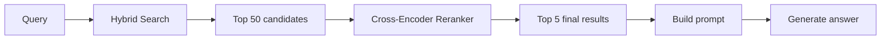
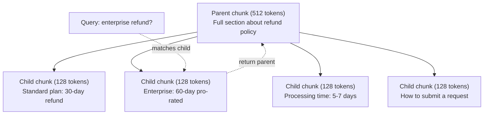
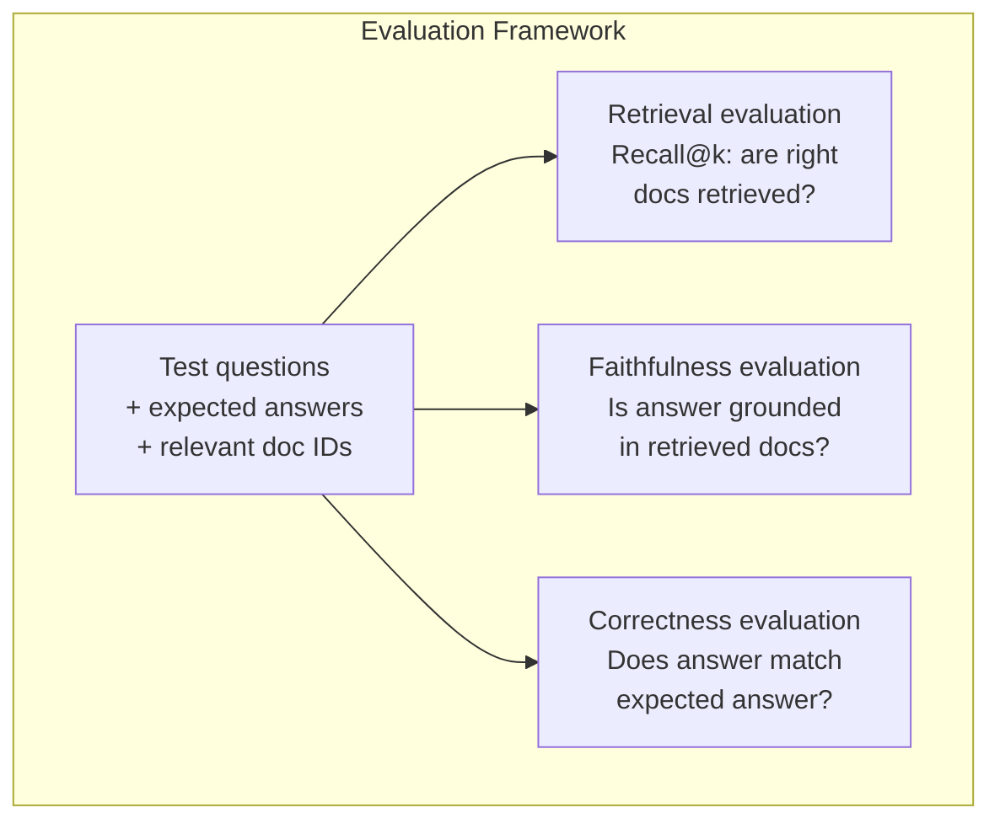

# Advanced RAG (Chunking, Reranking, Hybrid Search) | 高级 RAG：分块、重排序与混合搜索

> Basic RAG retrieves the top-k most similar chunks. That works for simple questions. It falls apart for multi-hop reasoning, ambiguous queries, and large corpora. Advanced RAG is the difference between a demo that works on 10 documents and a system that works on 10 million.

> **【中文解读】** 基础 RAG 检索 top-k 相似块，适用于简单问题。但在多跳推理、歧义查询和大规模语料上会失效。高级 RAG 是"10篇文档的 demo"和"千万文档的生产系统"之间的分水岭。

> **【拓展：高级RAG→金融场景】** 金融研报分析需要多跳推理（跨文档关联数据），混合搜索（关键词+语义）能显著提升财报数据检索准确率。

> 🔗 **【前置】** 学本节前请先掌握：Phase 11·06（RAG）——理解基础 RAG 流程。本节是其进阶，假设你已经能写出 chunk→embed→retrieve→prompt→generate 的最小可用 RAG。会用 `chromadb`、`rank_bm25`、`sentence-transformers` 或 `cohere` Rerank API。

**Type:** Build | **类型:** 构建
**Languages:** Python | **语言:** Python
**Prerequisites:** Phase 11, Lesson 06 (RAG) | **前置知识:** Phase 11 · 06 (RAG)
**Time:** ~90 minutes | **时间:** ~90 分钟
**Related:** Phase 5 · 23 (Chunking Strategies for RAG) covers all six chunking algorithms — recursive, semantic, sentence, parent-document, late chunking, contextual retrieval — with Vectara/Anthropic benchmarks. This lesson builds on top: hybrid search, reranking, query transformation. | **相关:** Phase 5 · 23（RAG 分块策略）覆盖全部六种分块算法——递归、语义、句子、父文档、晚分块、上下文检索——含 Vectara/Anthropic 基准。本课在其上构建：混合搜索、重排、查询转换。

## Learning Objectives | 学习目标

- Implement advanced chunking strategies (semantic, recursive, parent-child) that preserve document structure and context
  实现保留文档结构和上下文的高级分块策略（语义、递归、父子）
- Build a hybrid search pipeline combining BM25 keyword matching with semantic vector search and a cross-encoder reranker
  构建结合 BM25 关键词匹配、语义向量搜索和交叉编码器重排器的混合搜索管线
- Apply query transformation techniques (HyDE, multi-query, step-back) to improve retrieval on ambiguous or complex questions
  应用查询转换技术（HyDE、多查询、step-back）改善模糊或复杂问题的检索
- Diagnose and fix common RAG failures: wrong chunk retrieved, answer not in context, multi-hop reasoning breakdown
  诊断和修复常见 RAG 失败：检索错误块、答案不在上下文中、多跳推理崩溃

> **【中文解读】** 本课目标：掌握高级 RAG 技术——查询重写、混合检索、重排序、自适应检索、多跳推理。这些技术解决基础 RAG 在复杂查询上的局限性。

> 💡 **【类比】** 基础 RAG 像新手图书管理员——你说"营收"，他按字面找带"营收"的书。高级 RAG 像资深管理员：(1) **Query 改写**——你说"营收"，他翻译成"上一季度财报中的收入数字"再找；(2) **混合搜索**——既翻主题目录（语义）又翻关键词索引（BM25），两边结果合并；(3) **重排**——召回 100 本后，仔细看每本摘要排序挑出最相关 5 本（cross-encoder）。

> ⚠️ **【易错点】** 高级 RAG 的 3 个坑：(1) **HyDE 用错场景**——HyDE（让 LLM 先生成假设答案再用答案检索）在事实查询上反而误导检索；只对开放性问题有效。(2) **重排模型选错**——用 bi-encoder 当 cross-encoder reranker（如 BGE-M3 自己重排自己），没拿到真正 cross-encoder 的精度提升；用专门的 BGE-reranker-v2、Cohere Rerank。(3) **混合搜索没归一化**——BM25 分数 0-30，向量相似度 0-1，直接相加向量永远被淹没；用 reciprocal rank fusion (RRF) 或 min-max 归一化。

> 🤔 **【困惑】** Q: 多跳推理该让模型做还是检索做？ A: 检索做。让模型在 prompt 里推理，每跳检索一次，把上一跳结果作为下一跳查询的输入。例："哪个团队满意度提升最大？"→先检索"所有团队满意度分数"→让模型比较→得出"A 团队"→再检索"A 团队详情"。一跳一次检索，避免一次性塞所有可能相关的文档。


## The Problem | 问题引入

You built a basic RAG pipeline in Lesson 06. It works for straightforward questions on a small corpus. Now try these:

> 你在第 06 课构建了一个基础 RAG 流水线。它对小型语料库上的直接问题有效。现在试试这些：

**Ambiguous query**: "What was revenue last quarter?" Semantic search returns chunks about revenue strategy, revenue projections, and the CFO's thoughts on revenue growth. All semantically similar to the word "revenue." None containing the actual number. The correct chunk says "$47.2M in Q3 2025" but uses the word "earnings" instead of "revenue." The embedding model thinks "revenue strategy" is closer to the query than "Q3 earnings were $47.2M."

> **模糊查询**："上季度营收是多少？"语义搜索返回了关于营收策略、营收预测和 CFO 对营收增长看法的片段。都和"revenue"语义相似，但没有一个包含实际数字。

**Multi-hop question**: "Which team had the highest customer satisfaction score improvement?" This requires finding the satisfaction scores for each team, comparing them, and identifying the maximum. No single chunk contains the answer. The information is scattered across team reports.

> **多跳问题**："哪个团队的客户满意度评分提升最高？"这需要找到每个团队的满意度评分，比较它们，并识别最大值。没有任何单个片段包含答案。

**Large corpus problem**: You have 2 million chunks. The correct answer is in chunk #1,847,293. Your top-5 retrieval pulls chunks #14, #89,201, #1,200,000, #44, and #901,333. Close in embedding space, but none containing the answer. At this scale, approximate nearest neighbor search introduces enough error that relevant results get pushed out of the top-k.

> **大型语料库问题**：你有 200 万个片段。正确答案在第 1,847,293 号片段中。你的 top-5 检索拉出了其他片段。在这个规模下，近似最近邻搜索引入了足够的误差。

Basic RAG fails because vector similarity is not the same as relevance. A chunk can be semantically similar to a query without being useful for answering it. Advanced RAG addresses this with four techniques: hybrid search (add keyword matching), reranking (score candidates more carefully), query transformation (fix the query before searching), and better chunking (retrieve at the right granularity).

> 基础 RAG 失败是因为向量相似度不等于相关性。高级 RAG 用四种技术解决：混合搜索（添加关键词匹配）、重排序（更仔细地评分候选）、查询转换（搜索前修复查询）和更好的分块（以正确的粒度检索）。

## The Concept | 核心概念

> **【中文解读】** 高级 RAG 技术解决基础 RAG 的局限性：查询重写（将模糊问题转为精确查询）、混合检索（向量 + 关键词）、重排序（用 Cross-encoder 精排）、自适应检索（判断是否需要检索）、多跳推理（分解复杂问题为多次检索）。

> **【拓展：高级 RAG 的工业应用】** 生产级 RAG 系统通常包含：查询意图分类到查询扩展/重写到混合检索（BM25 + 向量）到 Cross-encoder 重排序到上下文压缩到答案生成 + 引用标注。Notion AI、Perplexity 等产品都使用了高级 RAG 技术。Self-RAG 让模型自己决定何时检索。


### Hybrid Search: Semantic + Keyword

Semantic search (vector similarity) is good at understanding meaning. "How do I cancel my subscription?" matches "Steps to terminate your plan" even though they share no words. But it misses exact matches. "Error code E-4021" might not match a chunk containing "E-4021" if the embedding model treats it as noise.

> 语义搜索（向量相似度）擅长理解含义。"如何取消订阅？"匹配"终止计划的步骤"尽管不共享单词。但它错过精确匹配。"错误码 E-4021"可能不匹配包含"E-4021"的块，如果嵌入模型将其视为噪声。

Keyword search (BM25) is the opposite. It excels at exact matches. "E-4021" matches perfectly. But "cancel my subscription" returns zero results if the document says "terminate your plan."

> 关键词搜索（BM25）相反。它擅长精确匹配。"E-4021"完美匹配。但"取消我的订阅"如果文档说"终止你的计划"则返回零结果。

Hybrid search runs both, then merges the results.

> 混合搜索同时运行两者，然后合并结果。

**BM25** (Best Matching 25) is the standard keyword search algorithm. It has been the backbone of search engines since the 1990s. The formula:

> **BM25**（Best Matching 25）是标准关键词搜索算法。自 1990 年代起就是搜索引擎的支柱。公式：

```
BM25(q, d) = sum over terms t in q:
    IDF(t) * (tf(t,d) * (k1 + 1)) / (tf(t,d) + k1 * (1 - b + b * |d| / avgdl))
```

Where tf(t,d) is the term frequency of t in document d, IDF(t) is the inverse document frequency, |d| is the document length, avgdl is the average document length, k1 controls term frequency saturation (default 1.2), and b controls length normalization (default 0.75).

> 其中 tf(t,d) 是 t 在文档 d 中的词频，IDF(t) 是逆文档频率，|d| 是文档长度，avgdl 是平均文档长度，k1 控制词频饱和（默认 1.2），b 控制长度归一化（默认 0.75）。

In plain terms: BM25 scores documents higher when they contain query terms (especially rare ones), but with diminishing returns for repeated terms. A document with the word "revenue" 50 times is not 50x more relevant than one with it once.

> 简而言之：BM25 给包含查询词（尤其稀有词）的文档更高分，但重复词有递减收益。包含"revenue"50 次的文档不是只含一次的 50 倍相关。

### Reciprocal Rank Fusion (RRF)

You have two ranked lists: one from vector search, one from BM25. How do you combine them? Reciprocal Rank Fusion is the standard approach.

> 你有两个排序列表：一个来自向量搜索，一个来自 BM25。如何合并它们？倒数排名融合（RRF）是标准方法。

```
RRF_score(d) = sum over rankings R:
    1 / (k + rank_R(d))
```

Where k is a constant (typically 60) that prevents the top-ranked result from dominating.

> 其中 k 是常数（通常 60），防止排名第一的结果主导。

A document ranked #1 in vector search and #5 in BM25 gets: 1/(60+1) + 1/(60+5) = 0.0164 + 0.0154 = 0.0318

A document ranked #3 in vector search and #2 in BM25 gets: 1/(60+3) + 1/(60+2) = 0.0159 + 0.0161 = 0.0320

> 在向量搜索排名第一、BM25 排名第五的文档得：1/(60+1) + 1/(60+5) = 0.0164 + 0.0154 = 0.0318。在向量搜索排名第三、BM25 排名第二的文档得：1/(60+3) + 1/(60+2) = 0.0159 + 0.0161 = 0.0320。

RRF naturally balances the two signals. A document that ranks highly in both lists gets the best score. A document that ranks #1 in one list but is absent from the other gets a moderate score. This is robust because it uses ranks, not raw scores, so differences in score distributions between the two systems do not matter.

> RRF 自然平衡两个信号。在两个列表中都排名高的文档得最高分。在一个列表排名第一但另一个列表缺失的文档得中等分数。这很稳健，因为它用排名而非原始分数，所以两个系统的分数分布差异不重要。

### Reranking

Retrieval (whether vector, keyword, or hybrid) is fast but imprecise. It uses bi-encoders: the query and each document are embedded independently, then compared. The embeddings are computed once and cached. This scales to millions of documents.

> 检索（无论向量、关键词还是混合）快但不精确。它用双编码器：查询和每个文档独立嵌入，然后比较。嵌入计算一次并缓存。这可扩展到百万文档。

Reranking uses cross-encoders: the query and a candidate document are fed together into a model that outputs a relevance score. The model sees both texts simultaneously and can capture fine-grained interactions between them. A cross-encoder can understand that "What were Q3 earnings?" is highly relevant to a chunk containing "$47.2M in Q3" even if a bi-encoder missed the connection.

> 重排用交叉编码器：查询和候选文档一起输入一个输出相关性分数的模型。模型同时看到两段文本，能捕捉它们之间的细粒度交互。交叉编码器能理解"Q3 收益多少？"与包含"Q3 为 4720 万美元"的块高度相关，即使双编码器错过这个关联。

The trade-off: cross-encoders are 100-1000x slower than bi-encoders because they process the query-document pair jointly. You cannot pre-compute cross-encoder scores for a million documents. The solution: retrieve a larger candidate set (top-50 from hybrid search), then rerank with a cross-encoder to get the final top-5.

> 权衡：交叉编码器比双编码器慢 100-1000 倍，因为它联合处理查询-文档对。你无法为百万文档预计算交叉编码器分数。解决方案：检索更大候选集（混合搜索 top-50），然后用交叉编码器重排得到最终 top-5。



Common reranking models (2026 lineup):

> 常见重排模型（2026 年阵容）：

- Cohere Rerank 3.5: managed API, multilingual, best recall gain on mixed corpora
  托管 API、多语言、混合语料上最大召回增益
- Voyage rerank-2.5: managed API, lowest latency of the hosted options
  托管 API、托管选项中最低延迟
- Jina-Reranker-v2 Multilingual: open-weight, 100+ languages
  开源权重、100+ 语言
- bge-reranker-v2-m3: open-weight, strong baseline
  开源权重、强基线
- cross-encoder/ms-marco-MiniLM-L-6-v2: open-weight, runs on CPU for prototyping
  开源权重、可在 CPU 上运行原型
- ColBERTv2 / Jina-ColBERT-v2: late-interaction multi-vector rerankers — O(tokens) not O(docs) at scoring time
  后期交互多向量重排器——评分时 O(tokens) 而非 O(docs)

### Query Transformation

Sometimes the problem is not retrieval but the query itself. "What was that thing about the new policy change?" is a terrible search query. It contains no specific terms. The embedding is vague. No retrieval system can find the right documents from this.

> 有时问题不在检索而在查询本身。"新政策变化那个东西是什么？"是糟糕的搜索查询。它不含具体词。嵌入模糊。没有检索系统能从中找到正确文档。

**Query rewriting**: rephrase the user's query into a better search query. An LLM can do this:

> **查询重写**：将用户查询重述为更好的搜索查询。LLM 可做这事：

```
User: "What was that thing about the new policy change?"
Rewritten: "Recent policy changes and updates"
```

**HyDE (Hypothetical Document Embeddings)**: instead of searching with the query, generate a hypothetical answer, embed that, and search for similar real documents.

> **HyDE（假设文档嵌入）**：不用查询搜索，而是生成假设答案，嵌入它，搜索相似的真实文档。

```
Query: "What is the refund policy for enterprise?"
Hypothetical answer: "Enterprise customers are eligible for a full refund
within 60 days of purchase. Refunds are pro-rated based on the remaining
subscription period and processed within 5-7 business days."
```

Embed the hypothetical answer and search for real documents similar to it. The intuition: the hypothetical answer lives closer in embedding space to the real answer than the original question does. Questions and answers have different linguistic structures. By generating a hypothetical answer, you bridge the gap between "question space" and "answer space" in the embedding.

> 嵌入假设答案并搜索与它相似的真实文档。直觉：假设答案在嵌入空间中比原始问题更接近真实答案。问题和答案有不同的语言结构。通过生成假设答案，你弥合嵌入中"问题空间"和"答案空间"的差距。

HyDE adds one LLM call before retrieval. This increases latency by 500-2000ms. Worth it when retrieval quality is poor on raw queries.

> HyDE 在检索前加一次 LLM 调用。这增加 500-2000ms 延迟。原始查询检索质量差时值得。

### Parent-Child Chunking

Standard chunking forces a trade-off: small chunks for precise retrieval, large chunks for sufficient context. Parent-child chunking eliminates this trade-off.

> 标准分块强制权衡：小块精确检索，大块足够上下文。父子分块消除这个权衡。

Index small chunks (128 tokens) for retrieval. When a small chunk is retrieved, return its parent chunk (512 tokens) for the prompt. The small chunk matches the query precisely. The parent chunk provides enough context for the LLM to generate a good answer.

> 索引小块（128 token）用于检索。检索到小块时，返回其父块（512 token）用于提示。小块精确匹配查询。父块提供足够上下文让 LLM 生成好答案。



The query "enterprise refund?" matches child chunk C2 precisely. But the prompt receives the full parent chunk P, which includes the surrounding context about processing time and submission process.

> 查询"enterprise refund？"精确匹配子块 C2。但提示接收完整父块 P，包含关于处理时间和提交流程的周围上下文。

### Metadata Filtering

Before running vector search, filter the corpus by metadata: date, source, category, author, language. This reduces the search space and prevents irrelevant results.

> 在运行向量搜索前，按元数据过滤语料库：日期、来源、类别、作者、语言。这缩小搜索空间并防止不相关结果。

"What changed in the security policy last month?" should only search documents from the last 30 days in the security category. Without metadata filtering, you search the entire corpus and might retrieve a 2-year-old security document that happens to be semantically similar.

> "上个月安全策略有什么变化？"应该只搜索过去 30 天安全类别的文档。没有元数据过滤，你搜索整个语料库，可能检索到一个碰巧语义相似的 2 年前安全文档。

Production RAG systems store metadata alongside each chunk: source document, creation date, category, author, version. Vector databases support pre-filtering by metadata before similarity search, which is critical for performance at scale.

> 生产 RAG 系统在每个块旁边存储元数据：源文档、创建日期、类别、作者、版本。向量数据库支持相似度搜索前按元数据预过滤，这对大规模性能至关重要。

### Evaluation

You built a RAG system. How do you know if it works? Three metrics:

> 你构建了 RAG 系统。如何知道它有效？三个指标：

**Retrieval relevance (Recall@k)**: for a set of test questions with known relevant documents, what percentage of relevant documents appear in the top-k results? If the answer to a question is in chunk #47, does chunk #47 appear in the top-5?

> **检索相关性（Recall@k）**：对一组带已知相关文档的测试问题，相关文档在 top-k 结果中出现的百分比是多少？如果某问题答案在第 47 块，第 47 块是否出现在 top-5？

**Faithfulness**: is the generated answer grounded in the retrieved documents? If the retrieved chunks say "60-day refund window" and the model says "90-day refund window," that is a faithfulness failure. The model hallucinated despite having the correct context.

> **忠实度**：生成的答案是否接地于检索文档？如果检索块说"60 天退款窗口"而模型说"90 天退款窗口"，那就是忠实度失败。模型尽管有正确上下文仍幻觉。

**Answer correctness**: does the generated answer match the expected answer? This is the end-to-end metric. It combines retrieval quality and generation quality.

> **答案正确性**：生成的答案是否匹配期望答案？这是端到端指标。它结合检索质量和生成质量。

A simple faithfulness check: take each claim in the generated answer and verify it appears (in substance) in the retrieved chunks. If the answer contains a fact not in any retrieved chunk, it is likely hallucinated.

> 简单忠实度检查：取生成答案中的每个声明，验证它（实质上）出现在检索块中。如果答案包含不在任何检索块中的事实，它很可能幻觉。



## Build It | 动手实现

### Step 1: BM25 Implementation

```python
import math
from collections import Counter

class BM25:
    def __init__(self, k1=1.2, b=0.75):
        self.k1 = k1
        self.b = b
        self.docs = []
        self.doc_lengths = []
        self.avg_dl = 0
        self.doc_freqs = {}
        self.n_docs = 0

    def index(self, documents):
        self.docs = documents
        self.n_docs = len(documents)
        self.doc_lengths = []
        self.doc_freqs = {}

        for doc in documents:
            words = doc.lower().split()
            self.doc_lengths.append(len(words))
            unique_words = set(words)
            for word in unique_words:
                self.doc_freqs[word] = self.doc_freqs.get(word, 0) + 1

        self.avg_dl = sum(self.doc_lengths) / self.n_docs if self.n_docs else 1

    def score(self, query, doc_idx):
        query_words = query.lower().split()
        doc_words = self.docs[doc_idx].lower().split()
        doc_len = self.doc_lengths[doc_idx]
        word_counts = Counter(doc_words)
        score = 0.0

        for term in query_words:
            if term not in word_counts:
                continue
            tf = word_counts[term]
            df = self.doc_freqs.get(term, 0)
            idf = math.log((self.n_docs - df + 0.5) / (df + 0.5) + 1)
            numerator = tf * (self.k1 + 1)
            denominator = tf + self.k1 * (1 - self.b + self.b * doc_len / self.avg_dl)
            score += idf * numerator / denominator

        return score

    def search(self, query, top_k=10):
        scores = [(i, self.score(query, i)) for i in range(self.n_docs)]
        scores.sort(key=lambda x: x[1], reverse=True)
        return scores[:top_k]
```

### Step 2: Reciprocal Rank Fusion

```python
def reciprocal_rank_fusion(ranked_lists, k=60):
    scores = {}
    for ranked_list in ranked_lists:
        for rank, (doc_id, _) in enumerate(ranked_list):
            if doc_id not in scores:
                scores[doc_id] = 0.0
            scores[doc_id] += 1.0 / (k + rank + 1)
    fused = sorted(scores.items(), key=lambda x: x[1], reverse=True)
    return fused
```

### Step 3: Hybrid Search Pipeline

```python
def hybrid_search(query, chunks, vector_embeddings, vocab, idf, bm25_index, top_k=5, fusion_k=60):
    query_emb = tfidf_embed(query, vocab, idf)
    vector_results = search(query_emb, vector_embeddings, top_k=top_k * 3)
    bm25_results = bm25_index.search(query, top_k=top_k * 3)
    fused = reciprocal_rank_fusion([vector_results, bm25_results], k=fusion_k)
    return fused[:top_k]
```

### Step 4: Simple Reranker

In production, you would use a cross-encoder model. Here we build a reranker that scores query-document relevance using word overlap, term importance, and phrase matching.

> 生产中你会用交叉编码器模型。这里我们构建用词重叠、词重要性和短语匹配来评分查询-文档相关性的重排器。

```python
def rerank(query, candidates, chunks):
    query_words = set(query.lower().split())
    stop_words = {"the", "a", "an", "is", "are", "was", "were", "what", "how",
                  "why", "when", "where", "do", "does", "for", "of", "in", "to",
                  "and", "or", "on", "at", "by", "it", "its", "this", "that",
                  "with", "from", "be", "has", "have", "had", "not", "but"}
    query_terms = query_words - stop_words

    scored = []
    for doc_id, initial_score in candidates:
        chunk = chunks[doc_id].lower()
        chunk_words = set(chunk.split())

        term_overlap = len(query_terms & chunk_words)

        query_bigrams = set()
        q_list = [w for w in query.lower().split() if w not in stop_words]
        for i in range(len(q_list) - 1):
            query_bigrams.add(q_list[i] + " " + q_list[i + 1])
        bigram_matches = sum(1 for bg in query_bigrams if bg in chunk)

        position_boost = 0
        for term in query_terms:
            pos = chunk.find(term)
            if pos != -1 and pos < len(chunk) // 3:
                position_boost += 0.5

        rerank_score = (
            term_overlap * 1.0
            + bigram_matches * 2.0
            + position_boost
            + initial_score * 5.0
        )
        scored.append((doc_id, rerank_score))

    scored.sort(key=lambda x: x[1], reverse=True)
    return scored
```

### Step 5: HyDE (Hypothetical Document Embeddings)

```python
def hyde_generate_hypothesis(query):
    templates = {
        "what": "The answer to '{query}' is as follows: Based on our documentation, {topic} involves specific policies and procedures that define how the process works.",
        "how": "To address '{query}': The process involves several steps. First, you need to initiate the request. Then, the system processes it according to the defined rules.",
        "default": "Regarding '{query}': Our records indicate specific details and policies related to this topic that provide a comprehensive answer."
    }
    query_lower = query.lower()
    if query_lower.startswith("what"):
        template = templates["what"]
    elif query_lower.startswith("how"):
        template = templates["how"]
    else:
        template = templates["default"]

    topic_words = [w for w in query.lower().split()
                   if w not in {"what", "is", "the", "how", "do", "does", "a", "an",
                                "for", "of", "to", "in", "on", "at", "by", "and", "or"}]
    topic = " ".join(topic_words) if topic_words else "this topic"

    return template.format(query=query, topic=topic)


def hyde_search(query, chunks, vector_embeddings, vocab, idf, top_k=5):
    hypothesis = hyde_generate_hypothesis(query)
    hypothesis_emb = tfidf_embed(hypothesis, vocab, idf)
    results = search(hypothesis_emb, vector_embeddings, top_k)
    return results, hypothesis
```

### Step 6: Parent-Child Chunking

```python
def create_parent_child_chunks(text, parent_size=200, child_size=50):
    words = text.split()
    parents = []
    children = []
    child_to_parent = {}

    parent_idx = 0
    start = 0
    while start < len(words):
        parent_end = min(start + parent_size, len(words))
        parent_text = " ".join(words[start:parent_end])
        parents.append(parent_text)

        child_start = start
        while child_start < parent_end:
            child_end = min(child_start + child_size, parent_end)
            child_text = " ".join(words[child_start:child_end])
            child_idx = len(children)
            children.append(child_text)
            child_to_parent[child_idx] = parent_idx
            child_start += child_size

        parent_idx += 1
        start += parent_size

    return parents, children, child_to_parent
```

### Step 7: Faithfulness Evaluation

```python
def evaluate_faithfulness(answer, retrieved_chunks):
    answer_sentences = [s.strip() for s in answer.split(".") if len(s.strip()) > 10]
    if not answer_sentences:
        return 1.0, []

    grounded = 0
    ungrounded = []
    context = " ".join(retrieved_chunks).lower()

    for sentence in answer_sentences:
        words = set(sentence.lower().split())
        stop_words = {"the", "a", "an", "is", "are", "was", "were", "and", "or",
                      "to", "of", "in", "for", "on", "at", "by", "it", "this", "that"}
        content_words = words - stop_words
        if not content_words:
            grounded += 1
            continue

        matched = sum(1 for w in content_words if w in context)
        ratio = matched / len(content_words) if content_words else 0

        if ratio >= 0.5:
            grounded += 1
        else:
            ungrounded.append(sentence)

    score = grounded / len(answer_sentences) if answer_sentences else 1.0
    return score, ungrounded


def evaluate_retrieval_recall(queries_with_relevant, retrieval_fn, k=5):
    total_recall = 0.0
    results = []

    for query, relevant_indices in queries_with_relevant:
        retrieved = retrieval_fn(query, k)
        retrieved_indices = set(idx for idx, _ in retrieved)
        relevant_set = set(relevant_indices)
        hits = len(retrieved_indices & relevant_set)
        recall = hits / len(relevant_set) if relevant_set else 1.0
        total_recall += recall
        results.append({
            "query": query,
            "recall": recall,
            "hits": hits,
            "total_relevant": len(relevant_set)
        })

    avg_recall = total_recall / len(queries_with_relevant) if queries_with_relevant else 0
    return avg_recall, results
```

## Use It | 用框架实现

With a real cross-encoder for reranking:

> 用真实交叉编码器重排：

```python
from sentence_transformers import CrossEncoder

reranker = CrossEncoder("cross-encoder/ms-marco-MiniLM-L-6-v2")

def rerank_with_cross_encoder(query, candidates, chunks, top_k=5):
    pairs = [(query, chunks[doc_id]) for doc_id, _ in candidates]
    scores = reranker.predict(pairs)
    scored = list(zip([doc_id for doc_id, _ in candidates], scores))
    scored.sort(key=lambda x: x[1], reverse=True)
    return scored[:top_k]
```

With Cohere's managed reranker:

> 用 Cohere 的托管重排器：

```python
import cohere

co = cohere.Client()

def rerank_with_cohere(query, candidates, chunks, top_k=5):
    docs = [chunks[doc_id] for doc_id, _ in candidates]
    response = co.rerank(
        model="rerank-english-v3.0",
        query=query,
        documents=docs,
        top_n=top_k
    )
    return [(candidates[r.index][0], r.relevance_score) for r in response.results]
```

For HyDE with a real LLM:

> 用真实 LLM 做 HyDE：

```python
import anthropic

client = anthropic.Anthropic()

def hyde_with_llm(query):
    response = client.messages.create(
        model="claude-sonnet-4-20250514",
        max_tokens=256,
        messages=[{
            "role": "user",
            "content": f"Write a short paragraph that would be a good answer to this question. Do not say you don't know. Just write what the answer would look like.\n\nQuestion: {query}"
        }]
    )
    return response.content[0].text
```

For production hybrid search with Weaviate:

> 用 Weaviate 做生产混合搜索：

```python
import weaviate

client = weaviate.connect_to_local()

collection = client.collections.get("Documents")
response = collection.query.hybrid(
    query="enterprise refund policy",
    alpha=0.5,
    limit=10
)
```

The alpha parameter controls the balance: 0.0 = pure keyword (BM25), 1.0 = pure vector, 0.5 = equal weight. Most production systems use alpha between 0.3 and 0.7.

> alpha 参数控制平衡：0.0=纯关键词（BM25），1.0=纯向量，0.5=等权重。大多数生产系统用 alpha 在 0.3 到 0.7 之间。

## Ship It | 产出物

This lesson produces:
- `outputs/prompt-advanced-rag-debugger.md` -- a prompt for diagnosing and fixing RAG quality issues
  诊断和修复 RAG 质量问题的提示
- `outputs/skill-advanced-rag.md` -- a skill for building production-grade RAG with hybrid search and reranking
  构建带混合搜索和重排的生产级 RAG 的技能

## Exercises | 练习题

1. Compare BM25 vs vector search vs hybrid search on the sample documents. For each of the 5 test queries, record which approach returns the most relevant chunk in position #1. Hybrid search should win on at least 3 out of 5.
   在样本文档上比较 BM25 vs 向量搜索 vs 混合搜索。对 5 个测试查询，记录哪种方法在位置 #1 返回最相关块。混合搜索应在至少 3/5 中胜出。

2. Implement a metadata filter. Add a "category" field to each document (security, billing, api, product). Before running vector search, filter chunks to only the relevant category. Test with "What encryption is used?" and verify it only searches security-category chunks.
   实现元数据过滤器。给每个文档加"category"字段（security、billing、api、product）。运行向量搜索前，过滤块到相关类别。用"使用什么加密？"测试，验证它只搜索 security 类别块。

3. Build a full HyDE pipeline using the simple generate function from Lesson 06. Compare retrieval quality (top-3 relevance) between direct query search and HyDE search on all 5 test queries. HyDE should improve results for vague queries.
   用 Lesson 06 的简单生成函数构建完整 HyDE 管线。比较直接查询搜索和 HyDE 搜索在 5 个测试查询上的检索质量（top-3 相关性）。HyDE 应改进模糊查询的结果。

4. Implement the parent-child chunking strategy on the sample documents. Use child_size=30 and parent_size=100. Search with child chunks but return parent chunks in the prompt. Compare the generated answers to standard chunking with chunk_size=50.
   在样本文档上实现父子分块策略。用 child_size=30 和 parent_size=100。用子块搜索但返回父块到提示。比较生成答案与 chunk_size=50 的标准分块。

5. Create an evaluation dataset: 10 questions with known answer chunks. Measure Recall@3, Recall@5, and Recall@10 for (a) vector search only, (b) BM25 only, (c) hybrid search, (d) hybrid + reranking. Plot the results and identify where reranking helps most.
   创建评估数据集：10 个带已知答案块的问题。为 (a) 仅向量搜索、(b) 仅 BM25、(c) 混合搜索、(d) 混合 + 重排测量 Recall@3、Recall@5、Recall@10。绘制结果并识别重排在哪里帮助最大。

## Key Terms | 术语速查表

| Term | What people say | What it actually means | 中文释义 |
|------|----------------|----------------------|---------|
| BM25 | "Keyword search" | A probabilistic ranking algorithm that scores documents by term frequency, inverse document frequency, and document length normalization | BM25：按词频、逆文档频率和文档长度归一化给文档评分的概率排序算法 |
| Hybrid search | "Best of both worlds" | Running semantic (vector) and keyword (BM25) search in parallel, then merging results with rank fusion | 混合搜索：并行运行语义（向量）和关键词（BM25）搜索，然后用排名融合合并结果 |
| Reciprocal Rank Fusion | "Merge ranked lists" | Combining multiple ranked lists by summing 1/(k + rank) for each document across all lists | 倒数排名融合：通过对每个文档在所有列表中求和 1/(k + rank) 合并多个排序列表 |
| Reranking | "Second pass scoring" | Using a more expensive cross-encoder model to re-score a candidate set from initial retrieval | 重排：用更昂贵的交叉编码器模型对初始检索的候选集重新评分 |
| Cross-encoder | "Joint query-document model" | A model that takes a query and document as a single input, producing a relevance score; more accurate than bi-encoders but too slow for full corpus search | 交叉编码器：将查询和文档作为单一输入的模型，输出相关性分数；比双编码器精确但太慢无法全语料搜索 |
| Bi-encoder | "Independent embedding model" | A model that embeds queries and documents independently; fast because embeddings are precomputed, but less accurate than cross-encoders | 双编码器：独立嵌入查询和文档的模型；快因为嵌入预计算，但比交叉编码器精度低 |
| HyDE | "Search with a fake answer" | Generate a hypothetical answer to the query, embed it, and search for real documents similar to it | HyDE：生成查询的假设答案，嵌入它，搜索相似真实文档 |
| Parent-child chunking | "Small search, big context" | Index small chunks for precise retrieval but return the larger parent chunk to provide sufficient context | 父子分块：索引小块精确检索但返回较大父块提供足够上下文 |
| Metadata filtering | "Narrow before searching" | Filtering documents by attributes (date, source, category) before running vector search to reduce the search space | 元数据过滤：运行向量搜索前按属性（日期、来源、类别）过滤文档以缩小搜索空间 |
| Faithfulness | "Did it stay grounded" | Whether the generated answer is supported by the retrieved documents, as opposed to hallucinated from the model's training data | 忠实度：生成的答案是否被检索文档支持，而非从模型训练数据幻觉 |

## Further Reading | 延伸阅读

- Robertson & Zaragoza, "The Probabilistic Relevance Framework: BM25 and Beyond" (2009) -- the definitive reference for BM25, explaining the probabilistic foundations behind the formula
  Robertson & Zaragoza，"The Probabilistic Relevance Framework: BM25 and Beyond"（2009）——BM25 的权威参考，解释公式背后的概率基础
- Cormack et al., "Reciprocal Rank Fusion Outperforms Condorcet and Individual Rank Learning Methods" (2009) -- the original RRF paper showing it beats more complex fusion methods
  Cormack 等，"Reciprocal Rank Fusion..."（2009）——RRF 原始论文，展示它击败更复杂的融合方法
- Gao et al., "Precise Zero-Shot Dense Retrieval without Relevance Labels" (2022) -- the HyDE paper demonstrating that hypothetical document embeddings improve retrieval without any training data
  Gao 等，"Precise Zero-Shot Dense Retrieval..."（2022）——HyDE 论文，展示假设文档嵌入无需训练数据即可改进检索
- Nogueira & Cho, "Passage Re-ranking with BERT" (2019) -- showed cross-encoder reranking on top of BM25 significantly improves retrieval quality
  Nogueira & Cho，"Passage Re-ranking with BERT"（2019）——展示在 BM25 之上的交叉编码器重排显著改善检索质量
- [Khattab et al., "DSPy: Compiling Declarative Language Model Calls into Self-Improving Pipelines" (2023)](https://arxiv.org/abs/2310.03714) -- treats prompt construction and weight selection as an optimization problem over retrieval pipelines; read this for "program LLMs" instead of "prompt LLMs."
  Khattab 等，"DSPy"（2023）——将提示构造和权重选择视为检索管线上的优化问题；读它来"编程 LLM"而非"提示 LLM"。
- [Edge et al., "From Local to Global: A Graph RAG Approach to Query-Focused Summarization" (Microsoft Research 2024)](https://arxiv.org/abs/2404.16130) -- GraphRAG paper: entity-relation extraction + Leiden community detection for query-focused summarization; the global vs local retrieval distinction.
  Edge 等，"From Local to Global: A Graph RAG Approach..."（Microsoft Research 2024）——GraphRAG 论文：实体关系抽取 + Leiden 社区检测用于查询聚焦摘要；全局 vs 局部检索的区别。
- [Asai et al., "Self-RAG: Learning to Retrieve, Generate, and Critique through Self-Reflection" (ICLR 2024)](https://arxiv.org/abs/2310.11511) -- self-evaluating RAG with reflection tokens; the agentic frontier past static retrieve-then-generate.
  Asai 等，"Self-RAG"（ICLR 2024）——带反思 token 的自评估 RAG；静态先检索后生成之外的智能体前沿。
- [LangChain Query Construction blog](https://blog.langchain.dev/query-construction/) -- how to translate natural-language queries into structured database queries (Text-to-SQL, Cypher) as a pre-retrieval step.
  LangChain 查询构造博客——如何将自然语言查询翻译为结构化数据库查询（Text-to-SQL、Cypher）作为预检索步骤。
