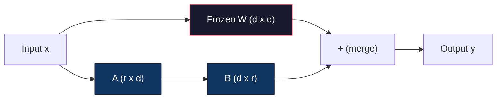
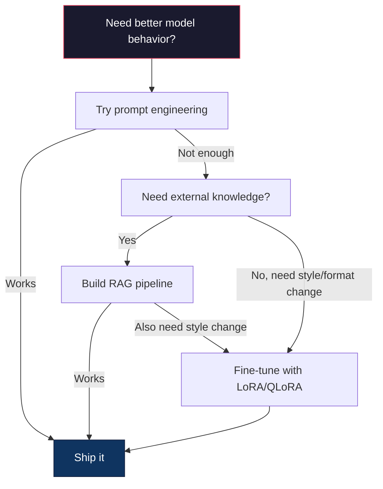

# Fine-Tuning with LoRA & QLoRA | LoRA 微调：低秩适配与量化微调

> Full fine-tuning a 7B model requires 56GB of VRAM. You don't have that. Neither do most companies. LoRA lets you fine-tune the same model in 6GB by training less than 1% of the parameters. This isn't a compromise -- it matches full fine-tuning quality on most tasks. The entire open-source fine-tuning ecosystem runs on this one trick.

> **【中文解读】** 全量微调 7B 模型需要 56GB 显存。LoRA 只训练不到 1% 的参数，6GB 显存即可完成微调，且质量不输全量微调。整个开源微调生态都建立在这个技术之上。

> **【拓展：LoRA微调→定制大模型】** LoRA 是企业定制大模型的核心技术：用少量领域数据微调基础模型，获得专业能力（如金融分析、法律推理、代码生成等）。

> 🔗 **【前置】** 学本节前请先掌握：(1) Phase 10·06（Instruction Tuning SFT）——理解监督微调的基本流程；(2) 线性代数基础——矩阵乘法、秩、SVD 分解（看 Phase 01·11 SVD）；(3) PyTorch 基础——`nn.Linear`、`backward()`、`optimizer.step()`；(4) HuggingFace `transformers` 库的基本用法。本节会用 `peft` 和 `trl` 库。

**Type:** Build | **类型:** 构建
**Languages:** Python | **语言:** Python
**Prerequisites:** Phase 10, Lesson 06 (Instruction Tuning / SFT) | **前置知识:** Phase 10 · 06（指令微调/SFT）
**Time:** ~75 minutes | **时间:** ~75 分钟
**Related:** Phase 10 covers the SFT/DPO loops from scratch. This lesson plugs those into the 2026 PEFT toolkits (PEFT, TRL, Unsloth, Axolotl, LLaMA-Factory). | **相关:** Phase 10 从零讲解 SFT/DPO 循环。本课将其接入 2026 年的 PEFT 工具链（PEFT、TRL、Unsloth、Axolotl、LLaMA-Factory）。

## Learning Objectives | 学习目标

- Implement LoRA by injecting low-rank adapter matrices (A and B) into a pretrained model's attention layers
  通过向预训练模型的注意力层注入低秩适配矩阵（A 和 B）实现 LoRA
- Calculate the parameter savings of LoRA vs full fine-tuning: rank r with d_model dimensions trains 2*r*d parameters instead of d^2
  计算 LoRA vs 全量微调的参数节省：秩 r 配 d_model 维度训练 2*r*d 参数而非 d^2
- Fine-tune a model using QLoRA (4-bit quantized base + LoRA adapters) to fit within consumer GPU memory
  用 QLoRA（4-bit 量化基础模型 + LoRA 适配器）微调模型以适配消费级 GPU 内存
- Merge LoRA weights back into the base model for deployment and compare inference speed with and without adapters
  将 LoRA 权重合并回基础模型用于部署，并比较有/无适配器的推理速度

> **【中文解读】** 本课目标：用 LoRA/QLoRA 进行参数高效微调。LoRA 仅训练低秩分解矩阵（百万级参数），而非全参数（数十亿），使微调成本降低 90%+。


## The Problem | 问题引入

You have a base model. Llama 3 8B. You want it to answer customer support tickets in your company's voice. SFT is the answer. But SFT has a cost problem.

> 你有一个基础模型。Llama 3 8B。你希望它用你公司的语气回答客服工单。SFT 是答案。但 SFT 有成本问题。

Full fine-tuning updates every parameter in the model. Llama 3 8B has 8 billion parameters. In fp16, each parameter takes 2 bytes. That's 16GB just to load the weights. During training, you also need gradients (16GB), optimizer states for Adam (32GB for momentum + variance), and activations. Total: roughly 56GB of VRAM for a single 8B model.

> 全参数微调更新模型中的每个参数。Llama 3 8B 有 80 亿参数。fp16 下每个参数占 2 字节。仅加载权重就需要 16GB。训练期间还需要梯度和优化器状态。单个 8B 模型总共需要约 56GB 显存。

An A100 80GB can barely fit this. Two A100s cost $3-4/hour on cloud providers. Training for 3 epochs on 50,000 examples takes 6-10 hours. That's $30-40 per experiment. Run 10 experiments to get the hyperparameters right and you've spent $400 before deploying anything.

> 一张 A100 80GB 勉强能装下。两张 A100 在云上每小时 $3-4。在 50,000 个样本上训练 3 个 epoch 需要 6-10 小时。每次实验 $30-40。

There's a deeper problem too. Full fine-tuning modifies every weight in the model. If you fine-tune on customer support data, you might degrade the model's general capabilities. It's called catastrophic forgetting. The model gets better at your task and worse at everything else.

> 还有一个更深层的问题。全参数微调修改模型中的每个权重。如果你在客服数据上微调，可能会降低模型的通用能力。这叫灾难性遗忘。

You need a method that trains fewer parameters, uses less memory, and doesn't destroy the model's existing knowledge.

> 你需要一种训练更少参数、使用更少内存、且不破坏模型现有知识的方法。

> 💡 **【类比】** 全量微调像"把整本教科书重写一遍"——每个字（参数）都改，工作量大还容易把原来对的内容改错（灾难性遗忘）。LoRA 像"在教科书的页边贴便利贴"——原文（W）冻结不动，你只在边上贴小纸条（A×B 矩阵）写新注释。最终输出 = 原文 + 便利贴。换任务时，撕掉旧便利贴贴新的即可，原文保留。

## The Concept | 核心概念

> **【中文解读】** LoRA（Low-Rank Adaptation）是参数高效微调（PEFT）的核心方法：冻结原始权重，仅训练低秩分解矩阵（A*B），将可训练参数从数十亿降到数百万。QLoRA 进一步量化基础模型到 4-bit，在单张消费级 GPU 上微调大模型。

> **【拓展：LoRA 的工程实践】** LoRA 的秩（rank）通常设为 8-64，应用于 Q/V 投影矩阵效果最好。QLoRA（4-bit 基础模型 + LoRA）让你在单张 RTX 4090 上微调 Llama-3-8B。HuggingFace PEFT 库让 LoRA 微调几行代码即可实现。LoRA 的成本约为全参数微调的 1/10，且效果接近。

> 🤔 **【困惑】** Q: QLoRA 是什么？和 LoRA 区别？ A: QLoRA = Quantized LoRA。基础模型用 4-bit 量化（NF4）存储，LoRA 适配器用 bf16 训练。这样 Llama-3-8B 的 16GB 权重压缩到 4GB，加上 LoRA 的训练开销（约 100MB），总共 6GB 显存就能微调——单张 RTX 4090 / 3090 即可。代价：训练速度比纯 LoRA 慢约 30%（因为要边反量化边 forward），但成本可控。


### LoRA: Low-Rank Adaptation

Edward Hu and colleagues at Microsoft published LoRA in June 2021. The paper's insight: the weight updates during fine-tuning have low intrinsic rank. You don't need to update all 16.7 million parameters in a 4096x4096 weight matrix. The useful information in the update can be captured by a matrix of rank 16 or 32.

> Edward Hu 和 Microsoft 同事于 2021 年 6 月发表 LoRA。论文洞察：微调期间的权重更新具有低内在秩。你不需要更新 4096x4096 权重矩阵中全部 1670 万参数。更新中的有用信息可被秩 16 或 32 的矩阵捕获。

> 🤔 **【困惑】** Q: 为什么低秩矩阵能捕获微调更新的信息？ A: Empirical observation——Aghajanyan 等（2020）发现预训练模型的权重更新ΔW 在内在维度（intrinsic dimension）上很低，通常只有几百到几千维就能学好一个新任务。直觉：基础模型已经"知道"很多，微调只是"轻微调整方向"，不需要全方位重写。秩 r=16 的两个矩阵 A(d×16) 和 B(16×d) 只有 2*16*4096 = 131K 参数，比原 16.7M 少 99.2%。

Here's the math. A standard linear layer computes:

> 数学如下。标准线性层计算：

```
y = Wx
```

Where W is a d_out x d_in matrix. For a 4096x4096 attention projection, that's 16,777,216 parameters.

> 其中 W 是 d_out x d_in 矩阵。对于 4096x4096 注意力投影，那是 16,777,216 个参数。

LoRA freezes W and adds a low-rank decomposition:

> LoRA 冻结 W 并添加低秩分解：

> ⚠️ **【易错点】** LoRA 微调的 3 个坑：(1) **秩 r 设太大**——r=64 起步就太大，参数量逼近全量微调，省显存优势消失；起点 r=8 或 r=16，效果不够再加倍。(2) **target_modules 选错**——只对 `q_proj` 加 LoRA 效果有限，标准做法是 `["q_proj", "v_proj", "k_proj", "o_proj"]` 都加，更激进可加上 MLP 的 `gate_proj`/`up_proj`/`down_proj`。(3) **学习率没调高**——LoRA 参数是新初始化的，需要比预训练权重更大的 lr；典型 lr=1e-4 到 3e-4（比全量微调的 2e-5 高 5-10 倍）。

```
y = Wx + BAx
```

Where B is (d_out x r) and A is (r x d_in). The rank r is much smaller than d -- typically 8, 16, or 32.

> 其中 B 是 (d_out x r)，A 是 (r x d_in)。秩 r 比 d 小得多——通常 8、16 或 32。

For r=16 on a 4096x4096 layer:
- Original parameters: 4096 x 4096 = 16,777,216
- LoRA parameters: (4096 x 16) + (16 x 4096) = 65,536 + 65,536 = 131,072
- Reduction: 131,072 / 16,777,216 = 0.78%

> 对于 4096x4096 层上的 r=16：
> - 原始参数：4096 x 4096 = 16,777,216
> - LoRA 参数：(4096 x 16) + (16 x 4096) = 65,536 + 65,536 = 131,072
> - 减少：131,072 / 16,777,216 = 0.78%

You're training 0.78% of the parameters and getting 95-100% of the quality.

> 你训练 0.78% 的参数，获得 95-100% 的质量。



A is initialized with a random Gaussian. B is initialized to zero. This means the LoRA contribution starts at zero -- the model begins training from its original behavior and gradually learns the adaptation.

> A 用随机高斯初始化。B 初始化为零。这意味着 LoRA 贡献从零开始——模型从原始行为开始训练，逐渐学习适应。

### The Scaling Factor: Alpha

LoRA introduces a scaling factor alpha that controls how much the low-rank update affects the output:

> LoRA 引入缩放因子 alpha，控制低秩更新对输出的影响程度：

```
y = Wx + (alpha / r) * BAx
```

When alpha = r, the scaling is 1x. When alpha = 2r (the common default), the scaling is 2x. This hyperparameter controls the learning rate of the LoRA path independently of the base learning rate.

> 当 alpha = r，缩放为 1x。当 alpha = 2r（常见默认），缩放为 2x。这个超参数独立于基础学习率控制 LoRA 路径的学习率。

Practical guidance:
- alpha = 2 * rank is a common community convention (the original paper used alpha = rank in most experiments)
  alpha = 2 * rank 是常见社区约定（原论文大多数实验用 alpha = rank）
- alpha = rank gives 1x scaling, conservative but stable
  alpha = rank 给 1x 缩放，保守但稳定
- Higher alpha means larger updates per step, which can speed convergence or cause instability
  较高 alpha 意味每步更大更新，可能加速收敛或导致不稳定

### Where to Apply LoRA

A transformer has many linear layers. You don't need to add LoRA to all of them. The original paper tested different combinations:

> Transformer 有许多线性层。你不需要给所有都加 LoRA。原论文测试了不同组合：

| Target Layers | Trainable Params (7B) | Quality |
|--------------|----------------------|---------|
| q_proj only / 仅 q_proj | 4.7M | Good / 好 |
| q_proj + v_proj | 9.4M | Better / 更好 |
| q_proj + k_proj + v_proj + o_proj | 18.9M | Best for attention / 注意力最佳 |
| All linear (attention + MLP) / 所有线性层 | 37.7M | Marginal gain, 2x params / 边际收益、2 倍参数 |

The sweet spot for most tasks: q_proj + v_proj. This targets the query and value projections in self-attention, which control what the model attends to and what information it extracts. Adding MLP layers helps for complex tasks like code generation but doubles the parameter count for diminishing returns on simpler tasks.

> 大多数任务的最佳点：q_proj + v_proj。这针对自注意力的查询和值投影，控制模型关注什么、提取什么信息。对代码生成等复杂任务，添加 MLP 层有帮助但对简单任务回报递减且参数翻倍。

### Rank Selection

The rank r controls the expressiveness of the adaptation:

> 秩 r 控制适应的表达能力：

| Rank | Trainable Params (per layer) | Best For |
|------|---------------------------|----------|
| 4 | 32,768 | Simple classification, sentiment / 简单分类、情感 |
| 8 | 65,536 | Single-domain Q&A, summarization / 单领域问答、摘要 |
| 16 | 131,072 | Multi-domain tasks, instruction following / 多领域任务、指令遵循 |
| 32 | 262,144 | Complex reasoning, code generation / 复杂推理、代码生成 |
| 64 | 524,288 | Diminishing returns for most tasks / 大多数任务回报递减 |
| 128 | 1,048,576 | Rarely justified / 很少合理 |

Hu et al. showed that r=4 already captures most of the adaptation for simple tasks. r=8 and r=16 are the most common choices in practice. Going beyond r=64 rarely improves quality and starts to lose LoRA's memory advantage.

> Hu 等人显示 r=4 已捕获简单任务的大部分适应。实践中 r=8 和 r=16 是最常见选择。超过 r=64 很少改善质量且开始失去 LoRA 的内存优势。

### QLoRA: 4-Bit Quantization + LoRA

Tim Dettmers and colleagues at the University of Washington published QLoRA in May 2023. The idea: quantize the frozen base model to 4-bit precision, then attach LoRA adapters in fp16 on top.

> Tim Dettmers 和华盛顿大学同事于 2023 年 5 月发表 QLoRA。想法：将冻结的基础模型量化到 4-bit 精度，然后在上面以 fp16 附加 LoRA 适配器。

This changes the memory equation dramatically:

> 这极大地改变了内存公式：

| Method | Weight Memory (7B) | Training Memory (7B) | GPU Required |
|--------|-------------------|---------------------|-------------|
| Full fine-tune (fp16) | 14GB | ~56GB | 1x A100 80GB |
| LoRA (fp16 base) | 14GB | ~18GB | 1x A100 40GB |
| QLoRA (4-bit base) | 3.5GB | ~6GB | 1x RTX 3090 24GB |

QLoRA makes three technical contributions:

> QLoRA 做出三个技术贡献：

**NF4 (Normal Float 4-bit)**: A new data type designed specifically for neural network weights. Neural network weights follow a roughly normal distribution. NF4 places its 16 quantization levels at the quantiles of a standard normal distribution. This is information-theoretically optimal for normally distributed data. It loses less information than uniform 4-bit quantization (INT4) or standard Float4.

> **NF4（Normal Float 4-bit）**：专门为神经网络权重设计的新数据类型。神经网络权重大致服从正态分布。NF4 将其 16 个量化级别放在标准正态分布的分位数上。这对正态分布数据是信息论最优的。比均匀 4-bit 量化（INT4）或标准 Float4 损失更少信息。

**Double quantization**: The quantization constants themselves take memory. Each block of 64 weights needs a fp32 scale factor (4 bytes). For a 7B model, that's an extra 0.4GB. Double quantization quantizes these constants to fp8, reducing the overhead to 0.1GB. Small but it adds up.

> **双重量化**：量化常数本身占用内存。每 64 权重块需要 fp32 缩放因子（4 字节）。对 7B 模型，那是额外 0.4GB。双重量化将这些常数量化到 fp8，将开销降到 0.1GB。小但累积。

**Paged optimizers**: During training, optimizer states (Adam's momentum and variance) can exceed GPU memory on long sequences. Paged optimizers use NVIDIA's unified memory to automatically page optimizer states to CPU RAM when GPU memory is exhausted, and page them back when needed. This prevents OOM crashes at the cost of some throughput.

> **分页优化器**：训练期间，长序列上优化器状态（Adam 动量和方差）可能超出 GPU 内存。分页优化器用 NVIDIA 统一内存在 GPU 内存耗尽时自动将优化器状态分页到 CPU RAM，需要时再分页回来。这防止 OOM 崩溃，代价是一些吞吐量。

### The Quality Question

Does reducing parameters or quantizing the base hurt quality? The results from multiple papers:

> 减少参数或量化基础是否损害质量？多篇论文结果：

| Method | MMLU (5-shot) | MT-Bench | HumanEval |
|--------|--------------|----------|-----------|
| Full fine-tune (Llama 2 7B) / 全量微调 | 48.3 | 6.72 | 14.6 |
| LoRA r=16 | 47.9 | 6.68 | 14.0 |
| QLoRA r=16 (NF4) | 47.5 | 6.61 | 13.4 |
| QLoRA r=64 (NF4) | 48.1 | 6.70 | 14.2 |

LoRA at r=16 is within 1% of full fine-tuning on most benchmarks. QLoRA at r=16 loses another fraction of a percent. QLoRA at r=64 essentially matches full fine-tuning while using 90% less memory.

> r=16 的 LoRA 在大多数基准上与全量微调相差 1% 以内。r=16 的 QLoRA 再损失零点几个百分点。r=64 的 QLoRA 实质上匹配全量微调同时内存少 90%。

### Real-World Costs

Fine-tuning Llama 3 8B on 50,000 examples (3 epochs):

> 在 50,000 示例上微调 Llama 3 8B（3 个 epoch）：

| Method | GPU | Time | Cost |
|--------|-----|------|------|
| Full fine-tune / 全量微调 | 2x A100 80GB | 8 hours | ~$32 |
| LoRA r=16 | 1x A100 40GB | 4 hours | ~$8 |
| QLoRA r=16 | 1x RTX 4090 24GB | 6 hours | ~$5 |
| QLoRA r=16 (Unsloth) | 1x RTX 4090 24GB | 2.5 hours | ~$2 |
| QLoRA r=16 | 1x T4 16GB | 12 hours | ~$4 |

QLoRA on a single consumer GPU costs less than a lunch. This is why the open-weight fine-tuning community exploded in 2023 and why every training framework below ships QLoRA by default in 2026.

> 单张消费级 GPU 上的 QLoRA 成本不到一顿午餐。这就是 2023 年开源权重微调社区爆发的原因，也是 2026 年所有训练框架默认搭载 QLoRA 的原因。

### The 2026 PEFT stack

| Framework | What it is | Pick when |
|-----------|-----------|-----------|
| **Hugging Face PEFT** | The canonical LoRA/QLoRA/DoRA/IA3 library / 标准 LoRA/QLoRA/DoRA/IA3 库 | You want raw control and your training loop is already on `transformers.Trainer` / 想要原始控制且训练循环已在 `transformers.Trainer` 上 |
| **TRL** | HF's reinforcement-from-feedback trainers (SFT, DPO, GRPO, PPO, ORPO) / HF 反馈强化学习训练器 | You need DPO/GRPO after SFT; built on top of PEFT / SFT 后需要 DPO/GRPO；构建于 PEFT 之上 |
| **Unsloth** | Triton-kernel rewrite of the forward/backward pass / 前向/反向传播的 Triton 内核重写 | You want 2-5x speedup + half the VRAM with no accuracy loss; Llama/Mistral/Qwen family / 想要 2-5 倍加速 + 一半 VRAM 无精度损失；Llama/Mistral/Qwen 家族 |
| **Axolotl** | YAML-config wrapper over PEFT + TRL + DeepSpeed + Unsloth / PEFT + TRL + DeepSpeed + Unsloth 的 YAML 配置封装 | You want reproducible, version-controlled training runs / 想要可重现、版本控制的训练运行 |
| **LLaMA-Factory** | GUI/CLI/API over PEFT + TRL / PEFT + TRL 的 GUI/CLI/API | You want zero-code fine-tuning; 100+ model families supported / 想要零代码微调；支持 100+ 模型家族 |
| **torchtune** | Native PyTorch recipes, no `transformers` dep / 原生 PyTorch 配方，无 `transformers` 依赖 | You want minimal deps and your org already standardizes on PyTorch / 想要最小依赖且组织已标准化于 PyTorch |

Rule of thumb: research use or one-off experiment → PEFT. Repeatable production pipeline → Axolotl with Unsloth kernels enabled. Throwaway prototyping → LLaMA-Factory.

> 经验法则：研究或一次性实验 → PEFT。可重复生产管线 → 启用 Unsloth 内核的 Axolotl。抛弃式原型 → LLaMA-Factory。

### Merging Adapters

After training, you have two things: the frozen base model and a small LoRA adapter (typically 10-100MB). You can either:

> 训练后你有两样东西：冻结的基础模型和小的 LoRA 适配器（通常 10-100MB）。你可以：

1. **Keep them separate**: Load the base model, load the adapter on top. Swap adapters for different tasks. This is how you serve multiple fine-tuned variants from one base model.

   **保持分离**：加载基础模型，在上面加载适配器。为不同任务切换适配器。这是你从一个基础模型服务多个微调变体的方式。

2. **Merge them permanently**: Compute W' = W + (alpha/r) * BA and save the result as a new full model. The merged model is the same size as the original. No inference overhead. No adapter to manage.

   **永久合并**：计算 W' = W + (alpha/r) * BA 并将结果保存为新完整模型。合并后模型与原始相同大小。无推理开销。无适配器需管理。

For serving multiple tasks (customer support adapter, code adapter, translation adapter), keep them separate. For deploying a single specialized model, merge.

> 服务多个任务（客服适配器、代码适配器、翻译适配器）保持分离。部署单一专用模型则合并。

Advanced merging techniques for combining multiple adapters:

> 组合多个适配器的高级合并技术：

- **TIES-Merging** (Yadav et al. 2023): Trims small-magnitude parameters, resolves sign conflicts, then merges. Reduces interference between adapters.
  修剪小幅度参数，解决符号冲突，然后合并。减少适配器间干扰。
- **DARE** (Yu et al. 2023): Randomly drops adapter parameters before merging and rescales the rest. Surprisingly effective at combining capabilities.
  合并前随机丢弃适配器参数并重新缩放其余参数。组合能力效果惊人。
- **Task arithmetic**: Simply add or subtract adapter weights. Adding a "code" adapter and a "math" adapter often produces a model good at both.
  简单加或减适配器权重。加"代码"适配器和"数学"适配器常产生两者都擅长的模型。

### When NOT to Fine-Tune

Fine-tuning is the third option, not the first.

> 微调是第三个选项，不是第一个。

**First: prompt engineering.** Write a better system prompt. Add few-shot examples. Use chain-of-thought. This costs nothing and takes minutes. If prompting gets you 80% of the way there, you probably don't need to fine-tune.

> **第一：提示工程。**写更好的系统提示。加少样本示例。用思维链。这零成本、几分钟。如果提示能完成 80%，你可能不需要微调。

**Second: RAG.** If the model needs to know about your specific data (documents, knowledge base, product catalog), retrieval is cheaper and more maintainable than baking it into weights. See Lesson 06.

> **第二：RAG。**如果模型需要知道你的特定数据（文档、知识库、产品目录），检索比烤进权重更便宜、更可维护。见 Lesson 06。

**Third: fine-tuning.** Use this when you need the model to adopt a specific style, format, or reasoning pattern that cannot be achieved through prompting. When you need consistent structured output. When you need to distill a larger model into a smaller one. When latency matters and you can't afford the extra tokens from few-shot prompting.

> **第三：微调。**当你需要模型采用特定风格、格式或推理模式（无法通过提示达成）时用。当你需要一致的结构化输出时。当你需要把大模型蒸馏成小模型时。当延迟重要且你承担不起少样本提示的额外 token 时。



## Build It | 动手实现

We implement LoRA from scratch in pure PyTorch. No libraries. No magic. You'll build the LoRA layer, inject it into a model, train it, and merge the weights back.

> 我们用纯 PyTorch 从零实现 LoRA。无库。无魔法。你将构建 LoRA 层、注入模型、训练它、合并权重回去。

### Step 1: The LoRA Layer

```python
import torch
import torch.nn as nn
import math

class LoRALayer(nn.Module):
    def __init__(self, in_features, out_features, rank=8, alpha=16):
        super().__init__()
        self.rank = rank
        self.alpha = alpha
        self.scaling = alpha / rank

        self.A = nn.Parameter(torch.randn(in_features, rank) * (1 / math.sqrt(rank)))
        self.B = nn.Parameter(torch.zeros(rank, out_features))

    def forward(self, x):
        return (x @ self.A @ self.B) * self.scaling
```

A is initialized with scaled random values. B is initialized to zero. The product BA starts at zero, so the model begins with its original behavior.

> A 用缩放随机值初始化。B 初始化为零。乘积 BA 从零开始，所以模型以其原始行为开始。

### Step 2: LoRA-Wrapped Linear Layer

```python
class LinearWithLoRA(nn.Module):
    def __init__(self, linear, rank=8, alpha=16):
        super().__init__()
        self.linear = linear
        self.lora = LoRALayer(
            linear.in_features, linear.out_features, rank, alpha
        )

        for param in self.linear.parameters():
            param.requires_grad = False

    def forward(self, x):
        return self.linear(x) + self.lora(x)
```

The original linear layer is frozen. Only the LoRA parameters (A and B) are trainable.

> 原始线性层被冻结。只有 LoRA 参数（A 和 B）可训练。

### Step 3: Inject LoRA into a Model

```python
def inject_lora(model, target_modules, rank=8, alpha=16):
    for param in model.parameters():
        param.requires_grad = False

    lora_layers = {}
    for name, module in model.named_modules():
        if isinstance(module, nn.Linear):
            if any(t in name for t in target_modules):
                parent_name = ".".join(name.split(".")[:-1])
                child_name = name.split(".")[-1]
                parent = dict(model.named_modules())[parent_name]
                lora_linear = LinearWithLoRA(module, rank, alpha)
                setattr(parent, child_name, lora_linear)
                lora_layers[name] = lora_linear
    return lora_layers
```

First, freeze every parameter in the model. Then walk the model tree, find linear layers matching your target names, and replace them with LoRA-wrapped versions. The LoRA A and B matrices are the only trainable parameters in the entire model.

> 首先，冻结模型中所有参数。然后遍历模型树，找到匹配目标名称的线性层，用 LoRA 包装版本替换它们。LoRA A 和 B 矩阵是整个模型中唯一可训练的参数。

### Step 4: Count Parameters

```python
def count_parameters(model):
    total = sum(p.numel() for p in model.parameters())
    trainable = sum(p.numel() for p in model.parameters() if p.requires_grad)
    frozen = total - trainable
    return {
        "total": total,
        "trainable": trainable,
        "frozen": frozen,
        "trainable_pct": 100 * trainable / total if total > 0 else 0
    }
```

### Step 5: Merge Weights Back

```python
def merge_lora_weights(model):
    for name, module in model.named_modules():
        if isinstance(module, LinearWithLoRA):
            with torch.no_grad():
                merged = (
                    module.lora.A @ module.lora.B
                ) * module.lora.scaling
                module.linear.weight.data += merged.T
            parent_name = ".".join(name.split(".")[:-1])
            child_name = name.split(".")[-1]
            if parent_name:
                parent = dict(model.named_modules())[parent_name]
            else:
                parent = model
            setattr(parent, child_name, module.linear)
```

After merging, the LoRA layers are gone. The model is the same size as the original with the adaptation baked into the weights. No inference overhead.

> 合并后 LoRA 层消失。模型与原始大小相同，适应烤进权重。无推理开销。

### Step 6: Simulated QLoRA Quantization

```python
def quantize_to_nf4(tensor, block_size=64):
    blocks = tensor.reshape(-1, block_size)
    scales = blocks.abs().max(dim=1, keepdim=True).values / 7.0
    scales = torch.clamp(scales, min=1e-8)
    quantized = torch.round(blocks / scales).clamp(-8, 7).to(torch.int8)
    return quantized, scales

def dequantize_from_nf4(quantized, scales, original_shape):
    dequantized = quantized.float() * scales
    return dequantized.reshape(original_shape)
```

This simulates 4-bit quantization by mapping weights into 16 discrete levels within blocks of 64. Production QLoRA uses the bitsandbytes library for true NF4 on GPU.

> 这通过将权重映射到 64 个块的 16 个离散级别模拟 4-bit 量化。生产 QLoRA 用 bitsandbytes 库在 GPU 上做真正的 NF4。

### Step 7: Training Loop

```python
def train_lora(model, data, epochs=5, lr=1e-3, batch_size=4):
    optimizer = torch.optim.AdamW(
        [p for p in model.parameters() if p.requires_grad], lr=lr
    )
    criterion = nn.MSELoss()

    losses = []
    for epoch in range(epochs):
        epoch_loss = 0.0
        n_batches = 0
        indices = torch.randperm(len(data["inputs"]))

        for i in range(0, len(indices), batch_size):
            batch_idx = indices[i:i + batch_size]
            x = data["inputs"][batch_idx]
            y = data["targets"][batch_idx]

            output = model(x)
            loss = criterion(output, y)

            optimizer.zero_grad()
            loss.backward()
            optimizer.step()

            epoch_loss += loss.item()
            n_batches += 1

        avg_loss = epoch_loss / n_batches
        losses.append(avg_loss)

    return losses
```

### Step 8: Full Demo

```python
def demo():
    torch.manual_seed(42)
    d_model = 256
    n_classes = 10

    model = nn.Sequential(
        nn.Linear(d_model, 512),
        nn.ReLU(),
        nn.Linear(512, 512),
        nn.ReLU(),
        nn.Linear(512, n_classes),
    )

    n_samples = 500
    x = torch.randn(n_samples, d_model)
    y = torch.randint(0, n_classes, (n_samples,))
    y_onehot = torch.zeros(n_samples, n_classes).scatter_(1, y.unsqueeze(1), 1.0)

    data = {"inputs": x, "targets": y_onehot}

    params_before = count_parameters(model)

    lora_layers = inject_lora(
        model, target_modules=["0", "2"], rank=8, alpha=16
    )

    params_after = count_parameters(model)

    losses = train_lora(model, data, epochs=20, lr=1e-3)

    merge_lora_weights(model)
    params_merged = count_parameters(model)

    return {
        "params_before": params_before,
        "params_after": params_after,
        "params_merged": params_merged,
        "losses": losses,
    }
```

The demo creates a small model, injects LoRA into two layers, trains it, and merges the weights back. The parameter count drops from full trainable to ~1% trainable during LoRA training, then returns to the original architecture after merging.

> 演示创建小模型、注入 LoRA 到两层、训练它、合并权重回去。参数计数从全可训练降到 LoRA 训练期间约 1% 可训练，然后合并后返回原始架构。

## Use It | 用框架实现

With the Hugging Face ecosystem, LoRA on a real model takes about 20 lines:

> 用 Hugging Face 生态，真实模型上 LoRA 只需约 20 行：

```python
from transformers import AutoModelForCausalLM, AutoTokenizer
from peft import LoraConfig, get_peft_model, TaskType

model = AutoModelForCausalLM.from_pretrained("meta-llama/Llama-3.1-8B")
tokenizer = AutoTokenizer.from_pretrained("meta-llama/Llama-3.1-8B")

lora_config = LoraConfig(
    task_type=TaskType.CAUSAL_LM,
    r=16,
    lora_alpha=32,
    lora_dropout=0.05,
    target_modules=["q_proj", "v_proj"],
)

model = get_peft_model(model, lora_config)
model.print_trainable_parameters()
```

For QLoRA, add bitsandbytes quantization:

> 对于 QLoRA，添加 bitsandbytes 量化：

```python
from transformers import BitsAndBytesConfig

bnb_config = BitsAndBytesConfig(
    load_in_4bit=True,
    bnb_4bit_quant_type="nf4",
    bnb_4bit_compute_dtype=torch.bfloat16,
    bnb_4bit_use_double_quant=True,
)

model = AutoModelForCausalLM.from_pretrained(
    "meta-llama/Llama-3.1-8B",
    quantization_config=bnb_config,
    device_map="auto",
)

model = get_peft_model(model, lora_config)
```

That's it. Same training loop. Same data pipeline. The base model now lives in 4-bit, LoRA adapters train in fp16, and the whole thing fits in 6GB.

For training with the Hugging Face Trainer:

```python
from transformers import TrainingArguments, Trainer
from datasets import load_dataset

dataset = load_dataset("tatsu-lab/alpaca", split="train[:5000]")

training_args = TrainingArguments(
    output_dir="./lora-llama",
    num_train_epochs=3,
    per_device_train_batch_size=4,
    gradient_accumulation_steps=4,
    learning_rate=2e-4,
    fp16=True,
    logging_steps=10,
    save_strategy="epoch",
    optim="paged_adamw_8bit",
)

trainer = Trainer(
    model=model,
    args=training_args,
    train_dataset=dataset,
)

trainer.train()

model.save_pretrained("./lora-adapter")
```

The saved adapter is 10-100MB. The base model stays untouched. You can share adapters on the Hugging Face Hub without redistributing the full model.

## Ship It | 产出物

This lesson produces:
- `outputs/prompt-lora-advisor.md` -- a prompt that helps you decide LoRA rank, target modules, and hyperparameters for your specific task
- `outputs/skill-fine-tuning-guide.md` -- a skill that teaches agents the decision tree for when and how to fine-tune

## Exercises | 练习题

1. **Rank ablation study.** Run the demo with ranks 2, 4, 8, 16, 32, and 64. Plot final loss vs. rank. Find the point of diminishing returns where doubling the rank no longer halves the loss. For a simple classification task on 256-dim features, this should be around r=8-16.

2. **Target module comparison.** Modify inject_lora to target only layer "0", only layer "2", only layer "4", and all three. Train each variant for 20 epochs. Compare convergence speed and final loss. This mirrors the real decision of targeting q_proj vs v_proj vs all linear layers.

3. **Quantization error analysis.** Take the trained model's weight matrices before and after quantize_to_nf4 / dequantize_from_nf4. Compute the mean squared error, max absolute error, and the correlation between original and reconstructed weights. Experiment with block_size values of 32, 64, 128, and 256.

4. **Multi-adapter serving.** Train two LoRA adapters on different subsets of the data (even indices vs odd indices). Save both adapters. Load the base model once, then swap adapters and verify that each produces different outputs on the same input. This is how production systems serve multiple fine-tuned models from one base.

5. **Merge vs. unmerged inference.** Compare the output of the LoRA model before and after merge_lora_weights on the same 100 inputs. Verify the outputs are identical (within floating-point tolerance of 1e-5). Then benchmark inference speed for both -- merged should be slightly faster since it's a single matrix multiply instead of two.

## Key Terms | 术语速查表

| Term | What people say | What it actually means | 中文释义 |
|------|----------------|----------------------|---------|
| LoRA | "Efficient fine-tuning" | Low-Rank Adaptation: freeze base weights, train two small matrices A and B whose product approximates the full weight update | |
| QLoRA | "Fine-tune on a laptop" | Quantized LoRA: load the base model in 4-bit NF4, train LoRA adapters in fp16 on top, enabling 7B fine-tuning in 6GB VRAM | |
| Rank (r) | "How much the model can learn" | The inner dimension of the A and B matrices; controls expressiveness vs. parameter count | |
| Alpha | "LoRA learning rate" | Scaling factor applied to the LoRA output; alpha/r scales the adaptation's contribution to the final output | |
| NF4 | "4-bit quantization" | Normal Float 4: a 4-bit data type with quantization levels at normal distribution quantiles, optimal for neural network weights | |
| Adapter | "The small trained part" | The LoRA A and B matrices saved as a separate file (10-100MB), loadable on top of any copy of the base model | |
| Target modules | "Which layers to LoRA" | The specific linear layers (q_proj, v_proj, etc.) where LoRA adapters are injected | |
| Merging | "Bake it in" | Computing W + (alpha/r) * BA and replacing the original weight, eliminating the adapter overhead at inference | |
| Paged optimizers | "Don't OOM during training" | Offloading optimizer states (Adam momentum, variance) to CPU when GPU memory is exhausted | |
| Catastrophic forgetting | "Fine-tuning broke everything else" | When updating all weights causes the model to lose previously learned capabilities | |

## Further Reading | 延伸阅读

- Hu et al., "LoRA: Low-Rank Adaptation of Large Language Models" (2021) -- the original paper introducing the low-rank decomposition method, tested on GPT-3 175B with rank as low as 4
- Dettmers et al., "QLoRA: Efficient Finetuning of Quantized Language Models" (2023) -- introduces NF4, double quantization, and paged optimizers, enabling 65B fine-tuning on a single 48GB GPU
- PEFT library documentation (huggingface.co/docs/peft) -- the standard library for LoRA, QLoRA, and other parameter-efficient methods in the Hugging Face ecosystem
- Yadav et al., "TIES-Merging: Resolving Interference When Merging Models" (2023) -- techniques for combining multiple LoRA adapters without quality degradation
- [Rafailov et al., "Direct Preference Optimization: Your Language Model is Secretly a Reward Model" (NeurIPS 2023)](https://arxiv.org/abs/2305.18290) -- DPO derivation; the preference-tuning stage that comes after SFT, no reward model needed.
- [TRL documentation](https://huggingface.co/docs/trl/) -- official reference for `SFTTrainer`, `DPOTrainer`, `KTOTrainer`, and the integration surface with PEFT/bitsandbytes/Unsloth.
- [Unsloth documentation](https://docs.unsloth.ai/) -- fused kernels that double fine-tuning throughput and halve memory; the performance layer under TRL.
- [Axolotl documentation](https://axolotl-ai-cloud.github.io/axolotl/) -- YAML-configured multi-GPU SFT/DPO/QLoRA trainer; the config-as-code alternative to hand-written scripts.
