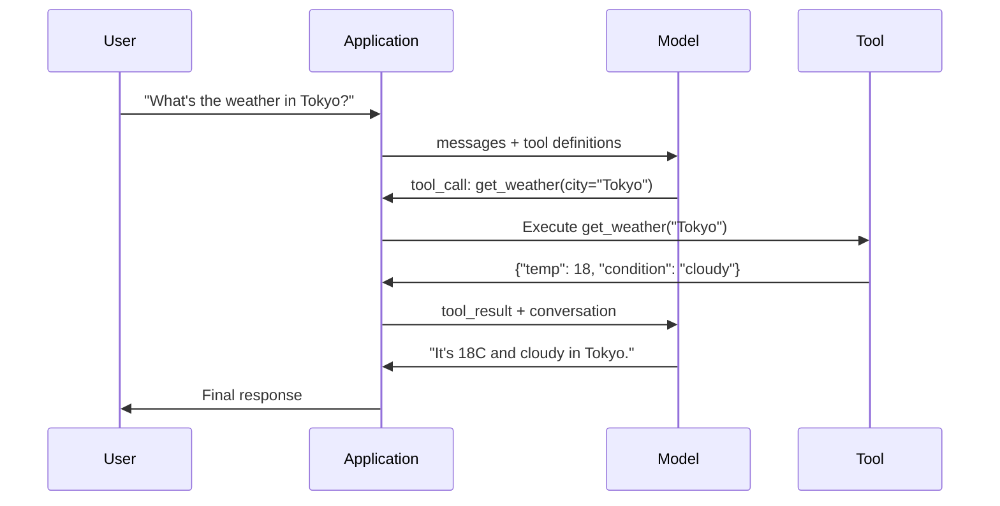

# Function Calling & Tool Use | 函数调用与工具使用

> LLMs cannot do anything. They generate text. That is the entire capability. They cannot check the weather, query a database, send an email, run code, or read a file. Every "AI agent" you have ever seen is an LLM generating JSON that says which function to call -- and then your code actually calling it. The model is the brain. Tools are the hands. Function calling is the nervous system connecting them.

> **【中文解读】** LLM 只能生成文本。函数调用让模型输出结构化 JSON 指定要调用的函数，由代码实际执行。模型是大脑，工具是双手，函数调用是连接它们的神经系统。

> **【拓展：Function Calling→MCP与Agent】** Function Calling 是 AI Agent 的核心机制，MCP 协议在此基础上标准化了工具描述和调用流程，是 Claude 生态的基础协议。

**Type:** Build | **类型:** 构建
**Languages:** Python | **语言:** Python
**Prerequisites:** Phase 11 Lesson 03 (Structured Outputs) | **前置知识:** Phase 11 · 03 (结构化输出)
**Time:** ~75 minutes | **时间:** ~75 分钟
**Related:** Phase 11 · 14 (Model Context Protocol) — when a tool is shared across hosts, graduate from inline function-calling to an MCP server. This lesson covers the inline case; MCP covers the protocol case. | **相关:** Phase 11 · 14 (模型上下文协议)——当工具需跨主机共享时，从内联函数调用升级为 MCP 服务器。本课讲内联场景；MCP 讲协议场景。

## Learning Objectives | 学习目标

- Implement a function calling loop: define tool schemas, parse the model's tool-call JSON, execute functions, and return results
  实现函数调用循环：定义工具 schema、解析模型的工具调用 JSON、执行函数并返回结果
- Design tool schemas with clear descriptions and typed parameters that the model can reliably invoke
  设计具有清晰描述和类型化参数的工具 schema，使模型能够可靠调用
- Build a multi-turn agent loop that chains multiple function calls to answer complex queries
  构建多轮 agent 循环，链式调用多个函数以回答复杂查询
- Handle function calling edge cases: parallel tool calls, error propagation, and preventing infinite tool loops
  处理函数调用的边缘情况：并行工具调用、错误传播和防止无限工具循环

> **【中文解读】** 本课目标：掌握函数调用（Function Calling）让 LLM 调用外部工具。这是构建 AI Agent 的基础——模型通过调用搜索、数据库、API 等工具获取信息和执行操作。


## The Problem | 问题引入

You build a chatbot. A user asks: "What's the weather in Tokyo right now?"

> 你构建了一个聊天机器人。用户问："东京现在天气怎么样？"

The model responds: "I don't have access to real-time weather data, but based on the season, Tokyo is likely around 15 degrees Celsius..."

> 模型回复了一个带着免责声明的幻觉答案。

That is a hallucination dressed in a disclaimer. The model does not know the weather. It never will. Weather changes every hour. The model's training data is months old.

> 这是披着免责声明的幻觉。模型不知道天气，也永远不会知道。天气每小时都在变化。

The correct answer requires calling the OpenWeatherMap API, getting the current temperature, and returning the real number. The model cannot call APIs. Your code can. The missing piece: a structured protocol that lets the model say "I need to call the weather API with these arguments" and lets your code execute it and feed the result back.

> 正确答案需要调用 OpenWeatherMap API。模型不能调用 API，你的代码可以。缺失的是结构化协议。

This is function calling. The model outputs structured JSON describing which function to invoke with what arguments. Your application executes the function. The result goes back into the conversation. The model uses the result to produce its final answer.

> 这就是函数调用。模型输出结构化 JSON 描述要调用哪个函数。你的应用执行函数，结果回到对话中。

Without function calling, LLMs are encyclopedias. With it, they become agents.

> 没有函数调用，LLM 是百科全书。有了它，它们变成 Agent。

## The Concept | 核心概念

> **【中文解读】** 函数调用（Function Calling）让 LLM 生成结构化的工具调用请求，而不是纯文本回复。这是构建 AI Agent 的基础——模型通过调用外部工具（搜索、数据库查询、API）来获取信息和执行操作。

> **【拓展：函数调用与 Agent 系统】** OpenAI 的函数调用于 2023 年推出，现已支持并行调用和强制调用。LangChain、CrewAI、AutoGen 等 Agent 框架都基于函数调用构建。实际应用包括：模型决定调用搜索 API 获取实时信息、调用 SQL 查询数据库、调用 Python 执行计算。


### The Function Calling Loop

Every tool-use interaction follows the same 5-step loop.

> 每次工具使用交互都遵循相同的 5 步循环。



Step 1: the user sends a message. Step 2: the model receives the message along with tool definitions (JSON Schema describing available functions). Step 3: instead of responding with text, the model outputs a tool call -- a structured JSON object with the function name and arguments. Step 4: your code executes the function and captures the result. Step 5: the result goes back to the model, which now has real data to produce its final answer.

> 步骤 1：用户发送消息。步骤 2：模型接收消息以及工具定义（描述可用函数的 JSON Schema）。步骤 3：模型不返回文本，而是输出工具调用——一个包含函数名和参数的结构化 JSON 对象。步骤 4：你的代码执行函数并捕获结果。步骤 5：结果回到模型，模型现在有真实数据来产生最终答案。

The model never executes anything. It only decides what to call and with what arguments. Your code is the executor.

> 模型从不执行任何东西。它只决定调用什么、用什么参数。你的代码才是执行者。

### Tool Definitions: The JSON Schema Contract

Each tool is defined by a JSON Schema that tells the model what the function does, what arguments it takes, and what types those arguments must be.

> 每个工具由 JSON Schema 定义，告诉模型这个函数做什么、接受什么参数、参数必须是什么类型。

```json
{
  "type": "function",
  "function": {
    "name": "get_weather",
    "description": "Get current weather for a city. Returns temperature in Celsius and conditions.",
    "parameters": {
      "type": "object",
      "properties": {
        "city": {
          "type": "string",
          "description": "City name, e.g. 'Tokyo' or 'San Francisco'"
        },
        "units": {
          "type": "string",
          "enum": ["celsius", "fahrenheit"],
          "description": "Temperature units"
        }
      },
      "required": ["city"]
    }
  }
}
```

The `description` fields are critical. The model reads them to decide when and how to use the tool. A vague description like "gets weather" produces worse tool selection than "Get current weather for a city. Returns temperature in Celsius and conditions." The description is a prompt for tool selection.

> `description` 字段至关重要。模型读这些描述来决定何时以及如何使用工具。模糊描述如"获取天气"产生的工具选择效果差于"获取城市当前天气，返回摄氏温度和天气状况"。描述本身就是工具选择的提示。

### Provider Comparison

Every major provider supports function calling, but the API surface differs.

> 每家主流提供商都支持函数调用，但 API 接口各不相同。

| Provider | API Parameter | Tool Call Format | Parallel Calls | Forced Calling |
|----------|--------------|-----------------|---------------|----------------|
| OpenAI (GPT-5, o4) | `tools` | `tool_calls[].function` | Yes (multiple per turn) | `tool_choice="required"` |
| Anthropic (Claude 4.6/4.7) | `tools` | `content[].type="tool_use"` | Yes (multiple blocks) | `tool_choice={"type":"any"}` |
| Google (Gemini 3) | `function_declarations` | `functionCall` | Yes | `function_calling_config` |
| Open-weight (Llama 4, Qwen3, DeepSeek-V3) | Native `tools` on Llama 4; Hermes or ChatML on others | Mixed | Model-dependent | Prompt-based or `tool_choice` if supported |

By 2026 the three closed providers have converged on near-identical JSON-Schema-based formats. Llama 4 ships with a native `tools` field that matches OpenAI's shape. Open-weight fine-tunes still vary — the Hermes format (NousResearch) is the most common for third-party fine-tunes. For shared tools across hosts, prefer MCP (Phase 11 · 14) over inline function-calling — the server is the same for all of them.

> 到 2026 年，三家闭源提供商已趋同到几乎相同的基于 JSON Schema 的格式。Llama 4 内置的 `tools` 字段匹配 OpenAI 的结构。开源权重微调模型仍然各异——Hermes 格式（NousResearch）是第三方微调中最常见的。跨主机共享工具时优先用 MCP（Phase 11 · 14）而非内联函数调用——服务器对所有这些都一样。

### Tool Choice: Auto, Required, Specific

You control when the model uses tools.

> 你可以控制模型何时使用工具。

**Auto** (default): the model decides whether to call a tool or respond directly. "What's 2+2?" -- responds directly. "What's the weather?" -- calls the tool.
**自动（默认）**：模型自行决定是调用工具还是直接回复。"2+2 等于几？"——直接回复。"天气怎么样？"——调用工具。

**Required**: the model must call at least one tool. Use this when you know the user's intent requires a tool. Prevents the model from guessing instead of looking up real data.
**必需**：模型必须至少调用一个工具。当你明确知道用户意图需要工具时使用。防止模型瞎猜而不查真实数据。

**Specific function**: force the model to call a particular function. `tool_choice={"type":"function", "function": {"name": "get_weather"}}` guarantees the weather tool is called, regardless of the query. Use this for routing -- when upstream logic already determined which tool is needed.
**特定函数**：强制模型调用某个特定函数。`tool_choice={"type":"function", "function": {"name": "get_weather"}}` 保证天气工具被调用，无论查询是什么。用于路由——当上游逻辑已确定需要哪个工具时使用。

### Parallel Function Calling

GPT-4o and Claude can call multiple functions in a single turn. A user asks: "What's the weather in Tokyo and New York?" The model outputs two tool calls simultaneously:

> GPT-4o 和 Claude 可以在单轮内调用多个函数。用户问："东京和纽约天气怎么样？"模型同时输出两个工具调用：

```json
[
  {"name": "get_weather", "arguments": {"city": "Tokyo"}},
  {"name": "get_weather", "arguments": {"city": "New York"}}
]
```

Your code executes both (ideally concurrently), returns both results, and the model synthesizes a single response. This cuts round trips from 2 to 1. For agents with 5-10 tool calls per query, parallel calling reduces latency by 60-80%.

> 你的代码执行两者（理想情况并发执行），返回两个结果，模型综合出单一回复。这把往返次数从 2 减到 1。对每次查询要 5-10 次工具调用的 agent，并行调用减少 60-80% 延迟。

### Structured Outputs vs Function Calling

Lesson 03 covered structured outputs. Function calling uses the same JSON Schema machinery, but for a different purpose.

> Lesson 03 讲了结构化输出。函数调用用相同的 JSON Schema 机制，但目的不同。

**Structured outputs**: force the model to produce data in a specific shape. The output is the final product. Example: extract product info from text as `{name, price, in_stock}`.
**结构化输出**：强制模型按特定形状产生数据。输出就是最终产品。例：从文本中抽取商品信息为 `{name, price, in_stock}`。

**Function calling**: the model declares an intent to execute an action. The output is an intermediate step. Example: `get_weather(city="Tokyo")` -- the model is requesting an action, not producing the final answer.
**函数调用**：模型声明执行某个动作的意图。输出是中间步骤。例：`get_weather(city="Tokyo")`——模型在请求动作，不是产生最终答案。

Use structured outputs when you want data extraction. Use function calling when you want the model to interact with external systems.
做数据抽取时用结构化输出。想让模型与外部系统交互时用函数调用。

### Security: The Non-Negotiable Rules

Function calling is the most dangerous capability you can give an LLM. The model chooses what to execute. If your tool set includes database queries, the model constructs the queries. If it includes shell commands, the model writes them.

> 函数调用是你赋予 LLM 最危险的能力。模型决定执行什么。如果你的工具集包含数据库查询，模型会构造查询语句。如果包含 shell 命令，模型会写命令。

**Rule 1: Never pass model-generated SQL directly to a database.** The model can and will generate DROP TABLE, UNION injections, or queries that return every row. Always parameterize. Always validate. Always use an allowlist of operations.
**规则 1：永远不要把模型生成的 SQL 直接传给数据库。** 模型会（也会）生成 DROP TABLE、UNION 注入或返回所有行的查询。始终参数化。始终校验。始终用操作白名单。

**Rule 2: Allowlist functions.** The model can only call functions you explicitly define. Never build a generic "execute any function by name" tool. If you have 50 internal functions, expose only the 5 the user needs.
**规则 2：函数白名单。** 模型只能调用你明确定义的函数。永远不要做通用的"按名执行任意函数"工具。如果有 50 个内部函数，只暴露用户需要的 5 个。

**Rule 3: Validate arguments.** The model might pass a city name of `"; DROP TABLE users; --"`. Validate every argument against expected types, ranges, and formats before execution.
**规则 3：校验参数。** 模型可能传入 `"; DROP TABLE users; --"` 作为城市名。执行前对照期望的类型、范围和格式校验每个参数。

**Rule 4: Sanitize tool results.** If a tool returns sensitive data (API keys, PII, internal errors), filter it before sending it back to the model. The model will include tool results in its response verbatim.
**规则 4：净化工具结果。** 如果工具返回敏感数据（API 密钥、PII、内部错误），发回模型前先过滤。模型会在回复中原样包含工具结果。

**Rule 5: Rate limit tool calls.** A model in a loop can call tools hundreds of times. Set a maximum (10-20 calls per conversation is reasonable). Break infinite loops.
**规则 5：限流工具调用。** 循环中的模型可能调用工具几百次。设上限（每次对话 10-20 次合理）。打破无限循环。

### Error Handling

Tools fail. APIs time out. Databases go down. Files do not exist. The model needs to know when a tool fails and why.

> 工具会失败。API 会超时。数据库会宕机。文件不存在。模型需要知道工具何时失败以及为什么失败。

Return errors as structured tool results, not exceptions:

> 把错误作为结构化工具结果返回，不要抛异常：

```json
{
  "error": true,
  "message": "City 'Toky' not found. Did you mean 'Tokyo'?",
  "code": "CITY_NOT_FOUND"
}
```

The model reads this, adjusts its arguments, and retries. Models are good at self-correcting from structured error messages. They are bad at recovering from empty responses or generic "something went wrong" errors.

> 模型读这个，调整参数重试。模型擅长从结构化错误信息中自我纠正。但不擅长从空响应或泛化的"出错了"错误中恢复。

### MCP: Model Context Protocol

MCP is Anthropic's open standard for tool interoperability. Instead of every application defining its own tools, MCP provides a universal protocol: tools are served by MCP servers, consumed by MCP clients (like Claude Code, Cursor, or your application).

> MCP 是 Anthropic 的开放标准，用于工具互操作。MCP 提供通用协议：工具由 MCP 服务器提供，由 MCP 客户端（如 Claude Code、Cursor 或你的应用）消费，而非每个应用各自定义工具。

One MCP server can expose tools to any compatible client. A Postgres MCP server gives any MCP-compatible agent database access. A GitHub MCP server gives any agent repository access. The tools are defined once, used everywhere.

> 一个 MCP 服务器可向任何兼容客户端暴露工具。Postgres MCP 服务器给任何 MCP 兼容 agent 数据库访问权限。GitHub MCP 服务器给任何 agent 仓库访问权限。工具定义一次，到处使用。

MCP is to function calling what HTTP is to networking. It standardizes the transport layer so tools become portable.

> MCP 之于函数调用，就像 HTTP 之于网络。它标准化传输层，使工具变得可移植。

## Build It | 动手实现

### Step 1: Define the Tool Registry

Build a registry that stores tool definitions and their implementations. Each tool has a JSON Schema definition (what the model sees) and a Python function (what your code executes).

> 构建注册表存储工具定义和实现。每个工具有一个 JSON Schema 定义（模型看到的）和一个 Python 函数（你的代码执行的）。

```python
import json
import math
import time
import hashlib


TOOL_REGISTRY = {}


def register_tool(name, description, parameters, function):
    TOOL_REGISTRY[name] = {
        "definition": {
            "type": "function",
            "function": {
                "name": name,
                "description": description,
                "parameters": parameters,
            },
        },
        "function": function,
    }
```

### Step 2: Implement 5 Tools

Build a calculator, weather lookup, web search simulator, file reader, and code runner.

> 构建计算器、天气查询、网络搜索模拟器、文件读取器和代码运行器。

```python
def calculator(expression, precision=2):
    allowed = set("0123456789+-*/.() ")
    if not all(c in allowed for c in expression):
        return {"error": True, "message": f"Invalid characters in expression: {expression}"}
    try:
        result = eval(expression, {"__builtins__": {}}, {"math": math})
        return {"result": round(float(result), precision), "expression": expression}
    except Exception as e:
        return {"error": True, "message": str(e)}


WEATHER_DB = {
    "tokyo": {"temp_c": 18, "condition": "cloudy", "humidity": 72, "wind_kph": 14},
    "new york": {"temp_c": 22, "condition": "sunny", "humidity": 45, "wind_kph": 8},
    "london": {"temp_c": 12, "condition": "rainy", "humidity": 88, "wind_kph": 22},
    "san francisco": {"temp_c": 16, "condition": "foggy", "humidity": 80, "wind_kph": 18},
    "sydney": {"temp_c": 25, "condition": "sunny", "humidity": 55, "wind_kph": 10},
}


def get_weather(city, units="celsius"):
    key = city.lower().strip()
    if key not in WEATHER_DB:
        suggestions = [c for c in WEATHER_DB if c.startswith(key[:3])]
        return {
            "error": True,
            "message": f"City '{city}' not found.",
            "suggestions": suggestions,
            "code": "CITY_NOT_FOUND",
        }
    data = WEATHER_DB[key].copy()
    if units == "fahrenheit":
        data["temp_f"] = round(data["temp_c"] * 9 / 5 + 32, 1)
        del data["temp_c"]
    data["city"] = city
    return data


SEARCH_DB = {
    "python function calling": [
        {"title": "OpenAI Function Calling Guide", "url": "https://platform.openai.com/docs/guides/function-calling", "snippet": "Learn how to connect LLMs to external tools."},
        {"title": "Anthropic Tool Use", "url": "https://docs.anthropic.com/en/docs/tool-use", "snippet": "Claude can interact with external tools and APIs."},
    ],
    "MCP protocol": [
        {"title": "Model Context Protocol", "url": "https://modelcontextprotocol.io", "snippet": "An open standard for connecting AI models to data sources."},
    ],
    "weather API": [
        {"title": "OpenWeatherMap API", "url": "https://openweathermap.org/api", "snippet": "Free weather API with current, forecast, and historical data."},
    ],
}


def web_search(query, max_results=3):
    key = query.lower().strip()
    for db_key, results in SEARCH_DB.items():
        if db_key in key or key in db_key:
            return {"query": query, "results": results[:max_results], "total": len(results)}
    return {"query": query, "results": [], "total": 0}


FILE_SYSTEM = {
    "data/config.json": '{"model": "gpt-4o", "temperature": 0.7, "max_tokens": 4096}',
    "data/users.csv": "name,email,role\nAlice,alice@example.com,admin\nBob,bob@example.com,user",
    "README.md": "# My Project\nA tool-use agent built from scratch.",
}


def read_file(path):
    if ".." in path or path.startswith("/"):
        return {"error": True, "message": "Path traversal not allowed.", "code": "FORBIDDEN"}
    if path not in FILE_SYSTEM:
        available = list(FILE_SYSTEM.keys())
        return {"error": True, "message": f"File '{path}' not found.", "available_files": available, "code": "NOT_FOUND"}
    content = FILE_SYSTEM[path]
    return {"path": path, "content": content, "size_bytes": len(content), "lines": content.count("\n") + 1}


def run_code(code, language="python"):
    if language != "python":
        return {"error": True, "message": f"Language '{language}' not supported. Only 'python' is available."}
    forbidden = ["import os", "import sys", "import subprocess", "exec(", "eval(", "__import__", "open("]
    for pattern in forbidden:
        if pattern in code:
            return {"error": True, "message": f"Forbidden operation: {pattern}", "code": "SECURITY_VIOLATION"}
    try:
        local_vars = {}
        exec(code, {"__builtins__": {"print": print, "range": range, "len": len, "str": str, "int": int, "float": float, "list": list, "dict": dict, "sum": sum, "min": min, "max": max, "abs": abs, "round": round, "sorted": sorted, "enumerate": enumerate, "zip": zip, "map": map, "filter": filter, "math": math}}, local_vars)
        result = local_vars.get("result", None)
        return {"success": True, "result": result, "variables": {k: str(v) for k, v in local_vars.items() if not k.startswith("_")}}
    except Exception as e:
        return {"error": True, "message": f"{type(e).__name__}: {e}"}
```

### Step 3: Register All Tools

> 注册所有工具。

```python
def register_all_tools():
    register_tool(
        "calculator", "Evaluate a mathematical expression. Supports +, -, *, /, parentheses, and decimals. Returns the numeric result.",
        {"type": "object", "properties": {"expression": {"type": "string", "description": "Math expression, e.g. '(10 + 5) * 3'"}, "precision": {"type": "integer", "description": "Decimal places in result", "default": 2}}, "required": ["expression"]},
        calculator,
    )
    register_tool(
        "get_weather", "Get current weather for a city. Returns temperature, condition, humidity, and wind speed.",
        {"type": "object", "properties": {"city": {"type": "string", "description": "City name, e.g. 'Tokyo' or 'San Francisco'"}, "units": {"type": "string", "enum": ["celsius", "fahrenheit"], "description": "Temperature units, defaults to celsius"}}, "required": ["city"]},
        get_weather,
    )
    register_tool(
        "web_search", "Search the web for information. Returns a list of results with title, URL, and snippet.",
        {"type": "object", "properties": {"query": {"type": "string", "description": "Search query"}, "max_results": {"type": "integer", "description": "Maximum results to return", "default": 3}}, "required": ["query"]},
        web_search,
    )
    register_tool(
        "read_file", "Read the contents of a file. Returns the file content, size, and line count.",
        {"type": "object", "properties": {"path": {"type": "string", "description": "Relative file path, e.g. 'data/config.json'"}}, "required": ["path"]},
        read_file,
    )
    register_tool(
        "run_code", "Execute Python code in a sandboxed environment. Set a 'result' variable to return output.",
        {"type": "object", "properties": {"code": {"type": "string", "description": "Python code to execute"}, "language": {"type": "string", "enum": ["python"], "description": "Programming language"}}, "required": ["code"]},
        run_code,
    )
```

### Step 4: Build the Function Calling Loop

This is the core engine. It simulates the model deciding which tool to call, executes the tool, and feeds results back.

> 这是核心引擎。它模拟模型决定调用哪个工具、执行工具、把结果反馈回去。

```python
def simulate_model_decision(user_message, tools, conversation_history):
    msg = user_message.lower()

    if any(word in msg for word in ["weather", "temperature", "forecast"]):
        cities = []
        for city in WEATHER_DB:
            if city in msg:
                cities.append(city)
        if not cities:
            for word in msg.split():
                if word.capitalize() in [c.title() for c in WEATHER_DB]:
                    cities.append(word)
        if not cities:
            cities = ["tokyo"]
        calls = []
        for city in cities:
            calls.append({"name": "get_weather", "arguments": {"city": city.title()}})
        return calls

    if any(word in msg for word in ["calculate", "compute", "math", "what is", "how much"]):
        for token in msg.split():
            if any(c in token for c in "+-*/"):
                return [{"name": "calculator", "arguments": {"expression": token}}]
        if "+" in msg or "-" in msg or "*" in msg or "/" in msg:
            expr = "".join(c for c in msg if c in "0123456789+-*/.() ")
            if expr.strip():
                return [{"name": "calculator", "arguments": {"expression": expr.strip()}}]
        return [{"name": "calculator", "arguments": {"expression": "0"}}]

    if any(word in msg for word in ["search", "find", "look up", "google"]):
        query = msg.replace("search for", "").replace("look up", "").replace("find", "").strip()
        return [{"name": "web_search", "arguments": {"query": query}}]

    if any(word in msg for word in ["read", "file", "open", "cat", "show"]):
        for path in FILE_SYSTEM:
            if path.split("/")[-1].split(".")[0] in msg:
                return [{"name": "read_file", "arguments": {"path": path}}]
        return [{"name": "read_file", "arguments": {"path": "README.md"}}]

    if any(word in msg for word in ["run", "execute", "code", "python"]):
        return [{"name": "run_code", "arguments": {"code": "result = 'Hello from the sandbox!'", "language": "python"}}]

    return []


def execute_tool_call(tool_call):
    name = tool_call["name"]
    args = tool_call["arguments"]

    if name not in TOOL_REGISTRY:
        return {"error": True, "message": f"Unknown tool: {name}", "code": "UNKNOWN_TOOL"}

    tool = TOOL_REGISTRY[name]
    func = tool["function"]
    start = time.time()

    try:
        result = func(**args)
    except TypeError as e:
        result = {"error": True, "message": f"Invalid arguments: {e}"}

    elapsed_ms = round((time.time() - start) * 1000, 2)
    return {"tool": name, "result": result, "execution_time_ms": elapsed_ms}


def run_function_calling_loop(user_message, max_iterations=5):
    conversation = [{"role": "user", "content": user_message}]
    tool_definitions = [t["definition"] for t in TOOL_REGISTRY.values()]
    all_tool_results = []

    for iteration in range(max_iterations):
        tool_calls = simulate_model_decision(user_message, tool_definitions, conversation)

        if not tool_calls:
            break

        results = []
        for call in tool_calls:
            result = execute_tool_call(call)
            results.append(result)

        conversation.append({"role": "assistant", "content": None, "tool_calls": tool_calls})

        for result in results:
            conversation.append({"role": "tool", "content": json.dumps(result["result"]), "tool_name": result["tool"]})

        all_tool_results.extend(results)
        break

    return {"conversation": conversation, "tool_results": all_tool_results, "iterations": iteration + 1 if tool_calls else 0}
```

### Step 5: Argument Validation

Build a validator that checks tool call arguments against the JSON Schema before execution.

> 构建校验器，在执行前对照 JSON Schema 检查工具调用参数。

```python
def validate_tool_arguments(tool_name, arguments):
    if tool_name not in TOOL_REGISTRY:
        return [f"Unknown tool: {tool_name}"]

    schema = TOOL_REGISTRY[tool_name]["definition"]["function"]["parameters"]
    errors = []

    if not isinstance(arguments, dict):
        return [f"Arguments must be an object, got {type(arguments).__name__}"]

    for required_field in schema.get("required", []):
        if required_field not in arguments:
            errors.append(f"Missing required argument: {required_field}")

    properties = schema.get("properties", {})
    for arg_name, arg_value in arguments.items():
        if arg_name not in properties:
            errors.append(f"Unknown argument: {arg_name}")
            continue

        prop_schema = properties[arg_name]
        expected_type = prop_schema.get("type")

        type_checks = {"string": str, "integer": int, "number": (int, float), "boolean": bool, "array": list, "object": dict}
        if expected_type in type_checks:
            if not isinstance(arg_value, type_checks[expected_type]):
                errors.append(f"Argument '{arg_name}': expected {expected_type}, got {type(arg_value).__name__}")

        if "enum" in prop_schema and arg_value not in prop_schema["enum"]:
            errors.append(f"Argument '{arg_name}': '{arg_value}' not in {prop_schema['enum']}")

    return errors
```

### Step 6: Run the Demo

> 运行演示。

```python
def run_demo():
    register_all_tools()

    print("=" * 60)
    print("  Function Calling & Tool Use Demo")
    print("=" * 60)

    print("\n--- Registered Tools ---")
    for name, tool in TOOL_REGISTRY.items():
        desc = tool["definition"]["function"]["description"][:60]
        params = list(tool["definition"]["function"]["parameters"].get("properties", {}).keys())
        print(f"  {name}: {desc}...")
        print(f"    params: {params}")

    print(f"\n--- Argument Validation ---")
    validation_tests = [
        ("get_weather", {"city": "Tokyo"}, "Valid call"),
        ("get_weather", {}, "Missing required arg"),
        ("get_weather", {"city": "Tokyo", "units": "kelvin"}, "Invalid enum value"),
        ("calculator", {"expression": 123}, "Wrong type (int for string)"),
        ("unknown_tool", {"x": 1}, "Unknown tool"),
    ]
    for tool_name, args, label in validation_tests:
        errors = validate_tool_arguments(tool_name, args)
        status = "VALID" if not errors else f"ERRORS: {errors}"
        print(f"  {label}: {status}")

    print(f"\n--- Tool Execution ---")
    direct_tests = [
        {"name": "calculator", "arguments": {"expression": "(10 + 5) * 3 / 2"}},
        {"name": "get_weather", "arguments": {"city": "Tokyo"}},
        {"name": "get_weather", "arguments": {"city": "Mars"}},
        {"name": "web_search", "arguments": {"query": "python function calling"}},
        {"name": "read_file", "arguments": {"path": "data/config.json"}},
        {"name": "read_file", "arguments": {"path": "../etc/passwd"}},
        {"name": "run_code", "arguments": {"code": "result = sum(range(1, 101))"}},
        {"name": "run_code", "arguments": {"code": "import os; os.system('rm -rf /')"}},
    ]
    for call in direct_tests:
        result = execute_tool_call(call)
        print(f"\n  {call['name']}({json.dumps(call['arguments'])})")
        print(f"    -> {json.dumps(result['result'], indent=None)[:100]}")
        print(f"    time: {result['execution_time_ms']}ms")

    print(f"\n--- Full Function Calling Loop ---")
    test_queries = [
        "What's the weather in Tokyo?",
        "Calculate (100 + 250) * 0.15",
        "Search for MCP protocol",
        "Read the config file",
        "Run some Python code",
        "Tell me a joke",
    ]
    for query in test_queries:
        print(f"\n  User: {query}")
        result = run_function_calling_loop(query)
        if result["tool_results"]:
            for tr in result["tool_results"]:
                print(f"    Tool: {tr['tool']} ({tr['execution_time_ms']}ms)")
                print(f"    Result: {json.dumps(tr['result'], indent=None)[:90]}")
        else:
            print(f"    [No tool called -- direct response]")
        print(f"    Iterations: {result['iterations']}")

    print(f"\n--- Parallel Tool Calls ---")
    multi_city_query = "What's the weather in tokyo and london?"
    print(f"  User: {multi_city_query}")
    result = run_function_calling_loop(multi_city_query)
    print(f"  Tool calls made: {len(result['tool_results'])}")
    for tr in result["tool_results"]:
        city = tr["result"].get("city", "unknown")
        temp = tr["result"].get("temp_c", "N/A")
        print(f"    {city}: {temp}C, {tr['result'].get('condition', 'N/A')}")

    print(f"\n--- Security Checks ---")
    security_tests = [
        ("read_file", {"path": "../../etc/passwd"}),
        ("run_code", {"code": "import subprocess; subprocess.run(['ls'])"}),
        ("calculator", {"expression": "__import__('os').system('ls')"}),
    ]
    for tool_name, args in security_tests:
        result = execute_tool_call({"name": tool_name, "arguments": args})
        blocked = result["result"].get("error", False)
        print(f"  {tool_name}({list(args.values())[0][:40]}): {'BLOCKED' if blocked else 'ALLOWED'}")
```

## Use It | 用框架实现

### OpenAI Function Calling

> OpenAI 函数调用。

```python
# from openai import OpenAI
#
# client = OpenAI()
#
# tools = [{
#     "type": "function",
#     "function": {
#         "name": "get_weather",
#         "description": "Get current weather for a city",
#         "parameters": {
#             "type": "object",
#             "properties": {
#                 "city": {"type": "string"},
#                 "units": {"type": "string", "enum": ["celsius", "fahrenheit"]}
#             },
#             "required": ["city"]
#         }
#     }
# }]
#
# response = client.chat.completions.create(
#     model="gpt-4o",
#     messages=[{"role": "user", "content": "Weather in Tokyo?"}],
#     tools=tools,
#     tool_choice="auto",
# )
#
# tool_call = response.choices[0].message.tool_calls[0]
# args = json.loads(tool_call.function.arguments)
# result = get_weather(**args)
#
# final = client.chat.completions.create(
#     model="gpt-4o",
#     messages=[
#         {"role": "user", "content": "Weather in Tokyo?"},
#         response.choices[0].message,
#         {"role": "tool", "tool_call_id": tool_call.id, "content": json.dumps(result)},
#     ],
# )
# print(final.choices[0].message.content)
```

OpenAI returns tool calls as `response.choices[0].message.tool_calls`. Each call has an `id` you must include when returning the result. The model uses this ID to match results to calls. GPT-4o can return multiple tool calls in a single response -- iterate and execute all of them.

> OpenAI 把工具调用作为 `response.choices[0].message.tool_calls` 返回。每个调用有 `id`，返回结果时必须包含。模型用这个 ID 把结果匹配到调用。GPT-4o 可在单个响应中返回多个工具调用——遍历并执行全部。

### Anthropic Tool Use

> Anthropic 工具使用。

```python
# import anthropic
#
# client = anthropic.Anthropic()
#
# response = client.messages.create(
#     model="claude-sonnet-4-20250514",
#     max_tokens=1024,
#     tools=[{
#         "name": "get_weather",
#         "description": "Get current weather for a city",
#         "input_schema": {
#             "type": "object",
#             "properties": {
#                 "city": {"type": "string"},
#                 "units": {"type": "string", "enum": ["celsius", "fahrenheit"]}
#             },
#             "required": ["city"]
#         }
#     }],
#     messages=[{"role": "user", "content": "Weather in Tokyo?"}],
# )
#
# tool_block = next(b for b in response.content if b.type == "tool_use")
# result = get_weather(**tool_block.input)
#
# final = client.messages.create(
#     model="claude-sonnet-4-20250514",
#     max_tokens=1024,
#     tools=[...],
#     messages=[
#         {"role": "user", "content": "Weather in Tokyo?"},
#         {"role": "assistant", "content": response.content},
#         {"role": "user", "content": [{"type": "tool_result", "tool_use_id": tool_block.id, "content": json.dumps(result)}]},
#     ],
# )
```

Anthropic returns tool calls as content blocks with `type: "tool_use"`. The tool result goes in a user message with `type: "tool_result"`. Note the key difference: Anthropic uses `input_schema` for tool parameter definitions, while OpenAI uses `parameters`.

> Anthropic 把工具调用作为 `type: "tool_use"` 的内容块返回。工具结果放在 `type: "tool_result"` 的用户消息中。关键差异：Anthropic 用 `input_schema` 定义工具参数，OpenAI 用 `parameters`。

### MCP Integration

> MCP 集成。

```python
# MCP servers expose tools over a standardized protocol.
# Any MCP-compatible client can discover and call these tools.
#
# Example: connecting to a Postgres MCP server
#
# from mcp import ClientSession, StdioServerParameters
# from mcp.client.stdio import stdio_client
#
# server_params = StdioServerParameters(
#     command="npx",
#     args=["-y", "@modelcontextprotocol/server-postgres", "postgresql://localhost/mydb"],
# )
#
# async with stdio_client(server_params) as (read, write):
#     async with ClientSession(read, write) as session:
#         await session.initialize()
#         tools = await session.list_tools()
#         result = await session.call_tool("query", {"sql": "SELECT count(*) FROM users"})
```

MCP decouples tool implementation from tool consumption. The Postgres server knows SQL. The GitHub server knows the API. Your agent just discovers and calls tools -- it does not need provider-specific code for each integration.

> MCP 解耦了工具实现和工具消费。Postgres 服务器懂 SQL。GitHub 服务器懂 API。你的 agent 只需发现和调用工具——不需要为每个集成写提供商特定代码。

## Ship It | 产出物

This lesson produces `outputs/prompt-tool-designer.md` -- a reusable prompt template for designing tool definitions. Give it a description of what you want a tool to do, and it produces the complete JSON Schema definition with descriptions, types, and constraints.

> 本课产出 `outputs/prompt-tool-designer.md`——设计工具定义的可复用提示模板。给它工具做什么的描述，它产生完整的 JSON Schema 定义（含描述、类型和约束）。

It also produces `outputs/skill-function-calling-patterns.md` -- a decision framework for implementing function calling in production, covering tool design, error handling, security, and provider-specific patterns.

> 还产出 `outputs/skill-function-calling-patterns.md`——生产环境实现函数调用的决策框架，覆盖工具设计、错误处理、安全和提供商特定模式。

## Exercises | 练习题

1. **Add a 6th tool: database query.** Implement a simulated SQL tool with an in-memory table. The tool accepts a table name and filter conditions (not raw SQL). Validate that the table name is in an allowlist and that filter operators are restricted to `=`, `>`, `<`, `>=`, `<=`. Return matching rows as JSON.
   **添加第 6 个工具：数据库查询。** 用内存表实现模拟 SQL 工具。工具接受表名和过滤条件（不是原始 SQL）。校验表名在白名单中、过滤操作符限定为 `=`、`>`、`<`、`>=`、`<=`。返回匹配行 JSON。

2. **Implement retry with error feedback.** When a tool call fails (e.g., city not found), feed the error message back to the model decision function and let it correct its arguments. Track how many retries each call takes. Set a maximum of 3 retries per tool call.
   **实现带错误反馈的重试。** 当工具调用失败（如找不到城市）时，把错误信息反馈给模型决策函数让它纠正参数。跟踪每次调用重试几次。设上限 3 次重试。

3. **Build a multi-step agent.** Some queries require chaining tool calls: "Read the config file and tell me what model is configured, then search the web for that model's pricing." Implement a loop that runs until the model decides no more tools are needed, passing accumulated results into each decision step. Limit to 10 iterations to prevent infinite loops.
   **构建多步 agent。** 一些查询需要链式调用工具："读配置文件告诉我配置了什么模型，然后上网搜索这个模型的定价。"实现循环，运行到模型决定不再需要工具，把累计结果传入每步决策。限制 10 次迭代防无限循环。

4. **Measure tool selection accuracy.** Create 30 test queries with expected tool names. Run your decision function on all 30 and measure what percentage of the time it selects the correct tool. Identify which queries cause the most confusion between tools.
   **测量工具选择准确率。** 创建 30 个带预期工具名的测试查询。对所有 30 个运行决策函数，测量选对工具的百分比。识别哪些查询最易混淆工具。

5. **Implement tool call caching.** If the same tool is called with identical arguments within 60 seconds, return the cached result instead of re-executing. Use a dictionary keyed by `(tool_name, frozenset(args.items()))`. Measure cache hit rates across a conversation with 20 queries.
   **实现工具调用缓存。** 60 秒内若相同工具用相同参数调用，返回缓存结果而非重新执行。用 `(tool_name, frozenset(args.items()))` 为键的字典。测量 20 查询对话的缓存命中率。

## Key Terms | 术语速查表

| Term | What people say | What it actually means | 中文释义 |
|------|----------------|----------------------|---------|
| Function calling | "Tool use" | The model outputs structured JSON describing a function to invoke with specific arguments -- your code executes it, not the model | 函数调用：模型输出结构化 JSON 描述要调用的函数及参数——你的代码执行，而非模型 |
| Tool definition | "Function schema" | A JSON Schema object describing a tool's name, purpose, parameters, and types -- the model reads this to decide when and how to use the tool | 工具定义：JSON Schema 描述工具名、用途、参数和类型——模型读它决定何时如何使用 |
| Tool choice | "Calling mode" | Controls whether the model must call a tool (required), may call a tool (auto), or must call a specific tool (named) | 工具选择：控制模型必须调用（required）、可以调用（auto）或必须调用特定工具（named） |
| Parallel calling | "Multi-tool" | The model outputs multiple tool calls in a single turn, reducing round trips -- GPT-4o and Claude both support this | 并行调用：模型单轮内输出多个工具调用，减少往返——GPT-4o 和 Claude 都支持 |
| Tool result | "Function output" | The return value from executing a tool, sent back to the model as a message so it can use real data in its response | 工具结果：执行工具的返回值，作为消息送回模型，让其在回复中使用真实数据 |
| Argument validation | "Input checking" | Verifying that model-generated arguments match the expected types, ranges, and constraints before executing the tool | 参数校验：执行前验证模型生成的参数是否匹配期望的类型、范围和约束 |
| MCP | "Tool protocol" | Model Context Protocol -- Anthropic's open standard for exposing tools via servers that any compatible client can discover and call | MCP：模型上下文协议——Anthropic 开放标准，通过服务器暴露工具，任何兼容客户端可发现和调用 |
| Agent loop | "ReAct loop" | The iterative cycle of model-decides-tool, code-executes-tool, result-feeds-back until the model has enough information to respond | Agent 循环：模型决定-代码执行-结果反馈的迭代循环，直到模型有足够信息回复 |
| Tool poisoning | "Prompt injection via tools" | An attack where tool results contain instructions that manipulate the model's behavior -- sanitize all tool outputs | 工具投毒：工具结果含操纵模型行为的指令的攻击——净化所有工具输出 |
| Rate limiting | "Call budget" | Setting a maximum number of tool calls per conversation to prevent infinite loops and runaway API costs | 限流：设每次对话工具调用上限，防无限循环和失控 API 成本 |

## Further Reading | 延伸阅读

- [OpenAI Function Calling Guide](https://platform.openai.com/docs/guides/function-calling) -- the definitive reference for tool use with GPT-4o, including parallel calls, forced calling, and structured arguments
  OpenAI 函数调用指南——GPT-4o 工具使用的权威参考，含并行调用、强制调用和结构化参数
- [Anthropic Tool Use Guide](https://docs.anthropic.com/en/docs/tool-use) -- Claude's tool use implementation with input_schema, multi-tool responses, and tool_choice configuration
  Anthropic 工具使用指南——Claude 工具使用实现，含 input_schema、多工具响应和 tool_choice 配置
- [Model Context Protocol Specification](https://modelcontextprotocol.io) -- the open standard for tool interoperability across AI applications, with server/client architecture
  模型上下文协议规范——AI 应用间工具互操作的开放标准，采用服务器/客户端架构
- [Schick et al., 2023 -- "Toolformer: Language Models Can Teach Themselves to Use Tools"](https://arxiv.org/abs/2302.04761) -- the foundational paper on training LLMs to decide when and how to call external tools
  Schick 等 2023 "Toolformer"——训练 LLM 决定何时如何调用外部工具的基础论文
- [Patil et al., 2023 -- "Gorilla: Large Language Model Connected with Massive APIs"](https://arxiv.org/abs/2305.15334) -- fine-tuning LLMs for accurate API calls across 1,645 APIs with hallucination reduction
  Patil 等 2023 "Gorilla"——微调 LLM 在 1645 个 API 上准确调用并减少幻觉
- [Berkeley Function Calling Leaderboard](https://gorilla.cs.berkeley.edu/leaderboard.html) -- real-time benchmark comparing function calling accuracy across GPT-4o, Claude, Gemini, and open models
  伯克利函数调用排行榜——比较 GPT-4o、Claude、Gemini 和开源模型函数调用准确率的实时基准
- [Yao et al., "ReAct: Synergizing Reasoning and Acting in Language Models" (ICLR 2023)](https://arxiv.org/abs/2210.03629) -- the Thought-Action-Observation loop that is the outer agent loop around every tool call; where this lesson ends, Phase 14 picks up.
  Yao 等 "ReAct"（ICLR 2023）——思考-行动-观察循环，是每个工具调用外层 agent 循环；本课结束处，Phase 14 接力。
- [Anthropic — Building effective agents (Dec 2024)](https://www.anthropic.com/research/building-effective-agents) -- five composable patterns (prompt chaining, routing, parallelization, orchestrator-workers, evaluator-optimizer) built from the single tool-use primitive.
  Anthropic《构建有效 agent》（2024 年 12 月）——基于单一工具使用原语的五种可组合模式（提示链、路由、并行化、编排者-工人、评估者-优化者）。
