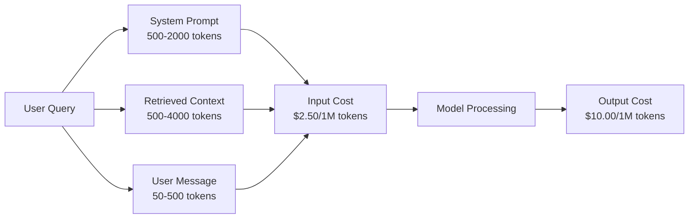
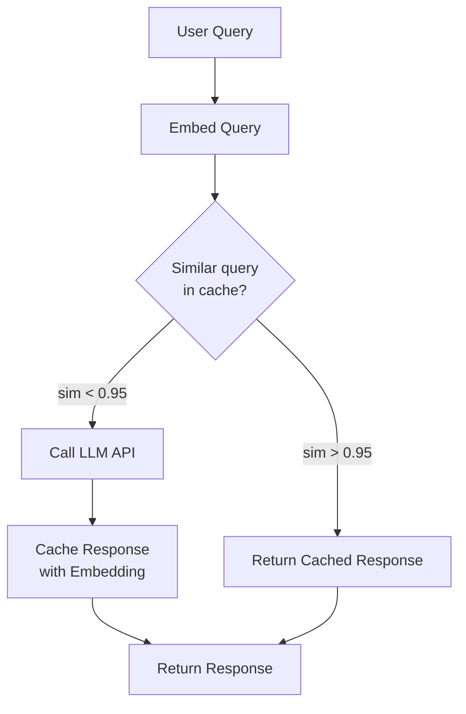
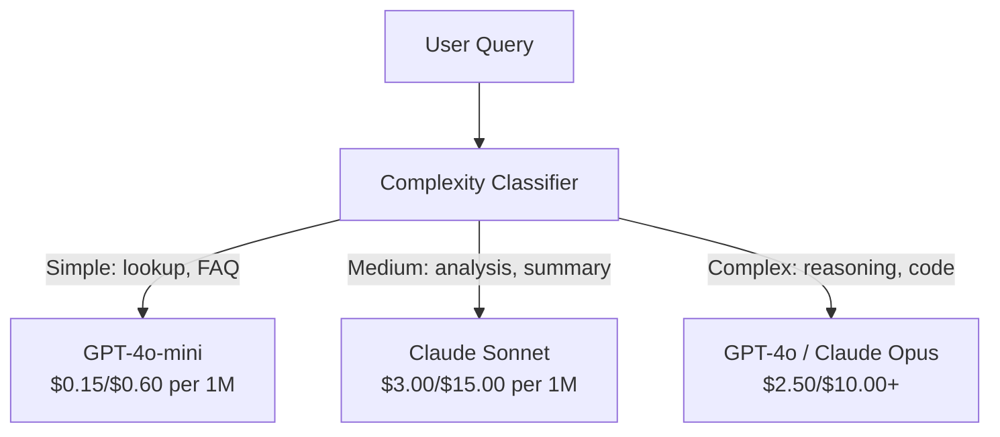

# Caching, Rate Limiting & Cost Optimization | 缓存、限流与成本优化

> Most AI startups do not die from bad models. They die from bad unit economics. A single GPT-4o call costs fractions of a cent. Ten thousand users making ten calls per day costs $250 in input tokens alone -- before you charge a single dollar. The companies that survive are the ones that treat every API call as a financial transaction, not a function call.

> **【中文解读】** AI 创业公司大多死于糟糕的单位经济模型，而非糟糕的模型。1万用户每天10次调用，光输入 token 就花费$250/天。存活的公司把每次 API 调用都当作金融交易来管理。

> **【拓展：成本优化→AI商业化】** 提示缓存（Prompt Caching）可降低50-90%的推理成本，语义缓存（Semantic Cache）可将相似查询的重复调用合并，是 AI 产品实现盈利的关键。

> 🔗 **【前置】** 学本节前请先掌握：(1) Phase 11·09（Function Calling）；(2) Phase 11·04（Embeddings）——语义缓存依赖嵌入；(3) Redis 或 Memcached 基础。本节会用 `redis`、`fastapi-cache` 或 `gptcache`。

**Type:** Build | **类型:** 构建
**Languages:** Python | **语言:** Python
**Prerequisites:** Phase 11 Lesson 09 (Function Calling) | **前置知识:** Phase 11 · 09 (函数调用)
**Time:** ~45 minutes | **时间:** ~45 分钟
**Related:** Phase 11 · 15 (Prompt Caching) — this lesson covers application-layer caching (semantic cache, exact hash cache, model routing). Lesson 15 covers provider-layer prompt caching (Anthropic cache_control, OpenAI automatic, Gemini CachedContent). Combine both for 50-95% cost reduction. | **相关:** Phase 11 · 15 (提示缓存)——本课讲应用层缓存（语义缓存、精确哈希缓存、模型路由）。Lesson 15 讲提供商层提示缓存（Anthropic cache_control、OpenAI 自动、Gemini CachedContent）。结合两者可降 50-95% 成本。

## Learning Objectives | 学习目标

- Implement semantic caching that serves repeated or similar queries from cache instead of making a new API call
  实现语义缓存，从缓存服务重复或相似查询，而非每次新建 API 调用
- Calculate per-request costs across providers and implement token-aware rate limiting and budget alerts
  跨提供商计算每请求成本，实现感知 token 的限流和预算告警
- Build a cost optimization layer with prompt compression, model routing (expensive vs cheap), and response caching
  构建成本优化层，含提示压缩、模型路由（贵 vs 便宜）和响应缓存
- Design a tiered caching strategy using exact match, semantic similarity, and prefix caching for different query types
  设计分层缓存策略，针对不同查询类型用精确匹配、语义相似度和前缀缓存

> **【中文解读】** 本课目标：掌握 LLM 应用的成本优化策略——Prompt Caching、语义缓存、模型路由、批处理。LLM API 成本是生产部署的主要支出。

> 💡 **【类比】** 不带缓存的 LLM 应用像餐厅每来一位客人就重新种菜——慢且贵。三层缓存像三级食材柜：(1) **精确哈希缓存**——冰箱里现成菜（同问题直接返回，毫秒）；(2) **语义缓存**——冷藏室的相似菜（嵌入相似度 > 0.95 视为同问题，5-20ms）；(3) **prompt caching**——供应商预切好的菜（system prompt 复用，省 90% input cost）。组合起来能把成本砍 70-95%。

> ⚠️ **【易错点】** 缓存的 3 个坑：(1) **缓存中毒**——用户问"我账户余额多少？"语义缓存命中"上次别人问的余额"，返回错的数字；修复：带用户身份 hash 进 cache key，PII/个性化查询不缓存。(2) **相似度阈值过高**——0.95 太严，命中率 < 5%；降到 0.85 + 加 LLM 二次验证（"这两个问题是否等价？"）。(3) **TTL 太长**——新闻类查询缓存 24h，模型答案过时；区分查询类型，事实查询 TTL=1h，闲聊 TTL=24h。


## The Problem | 问题引入

You build a RAG chatbot. It works beautifully. Users love it.

Then the invoice arrives.

> 你构建了一个 RAG 聊天机器人。它运行得很好。用户很喜欢。然后账单到了。

GPT-5 costs $5 per million input tokens and $15 per million output. Claude Opus 4.7 costs $15 input / $75 output. Gemini 3 Pro costs $1.25 input / $5 output. GPT-5-mini is $0.25/$2. Prices below are illustrative; always check the provider's current pricing page.

> GPT-5 每百万输入 token $5，每百万输出 $15。Claude Opus 4.7 是 $15/$75。Gemini 3 Pro 是 $1.25/$5。

Here is the math that kills startups:

> 这是让初创公司倒闭的数学：

- 10,000 daily active users
  10,000 日活用户
- 10 queries per user per day
  每用户每天 10 次查询
- 1,000 input tokens per query (system prompt + context + user message)
  每次查询 1,000 输入 token
- 500 output tokens per response
  每次响应 500 输出 token

**Monthly total:** **$22,500/month**

That is just the LLM. Add embeddings, vector database hosting, infrastructure. You are looking at $30,000/month for a chatbot.

> 这只是 LLM 的费用。加上嵌入、向量数据库托管、基础设施。一个聊天机器人每月 $30,000。

The brutal part: 40-60% of those queries are near-duplicates. Users ask the same questions in slightly different words. Your system prompt -- identical across every request -- gets billed every single time. Context documents retrieved by RAG repeat across users who ask about the same topic.

> 残酷的部分：40-60% 的查询是近似重复的。用户用稍微不同的词问同样的问题。你的系统提示——每次请求都相同——每次都被计费。

You are paying full price for redundant computation.

> 你在为冗余计算支付全价。

## The Concept | 核心概念

> **【中文解读】** LLM API 的成本优化是生产部署的关键考量。主要策略：Prompt Caching（缓存不变前缀）、语义缓存（缓存相似查询的回复）、模型路由（简单问题用便宜模型）、批处理（合并请求减少调用次数）。

> **【拓展：LLM 成本的实际数据】** GPT-4o 定价 $5/$15 per M tokens（input/output），Claude 3.5 Sonnet $3/$15。一个日活 10 万用户的应用，每次交互约 2K input + 500 output tokens，月成本约 $15,000-45,000。通过 Prompt Caching 可降低约 50%，用 GPT-4o-mini 替代简单查询可再降 30%。


### The Cost Anatomy of an LLM Call

Every API call has five cost components.

> 每次 API 调用有五个成本组件。



System prompts are the silent killer. A 1,500-token system prompt sent with every request costs $3.75 per million requests just for that prefix. At 100K requests per day, that is $375/day -- $11,250/month -- for text that never changes.

> 系统提示是沉默杀手。1,500 token 的系统提示每次请求都发送，每百万请求仅这个前缀就花 $3.75。每天 10 万请求就是 $375/天——$11,250/月——为从不改变的文本。

### Provider Caching: Built-in Discounts

All three major providers offer provider-side prompt caching in 2026, but the mechanics differ. See Phase 11 · 15 for the deep dive.

> 三大提供商在 2026 年都提供提供商侧提示缓存，但机制不同。深度解析见 Phase 11 · 15。

| Provider | Mechanism | Discount | Minimum | Cache Duration |
|----------|-----------|----------|---------|----------------|
| Anthropic | Explicit cache_control markers | 90% on cache hits (pay 25% extra on write) | 1,024 tokens (Sonnet/Opus), 2,048 (Haiku) | 5 min default; 1h extended (2x write premium) |
| OpenAI | Automatic prefix matching | 50% on cache hits | 1,024 tokens | Best-effort up to 1 hour |
| Google Gemini | Explicit CachedContent API | ~75% reduction (plus storage) | 4,096 (Flash) / 32,768 (Pro) | User-configurable TTL |

**Anthropic's approach** is explicit. You mark sections of your prompt with `cache_control: {"type": "ephemeral"}`. The first request pays a 25% write premium. Subsequent requests with the same prefix get a 90% discount. A 2,000-token system prompt that costs $0.005 normally costs $0.000625 on cache hits. Over 100K requests, that saves $437.50/day.

> **Anthropic 方式**是显式的。用 `cache_control: {"type": "ephemeral"}` 标记提示段。首次请求付 25% 写入溢价。后续同前缀请求得 90% 折扣。2,000 token 系统提示正常 $0.005，缓存命中 $0.000625。10 万请求省 $437.50/天。

**OpenAI's approach** is automatic. Any prompt prefix that matches a previous request gets a 50% discount. No markers needed. The tradeoff: less discount, less control, but zero implementation effort.

> **OpenAI 方式**是自动的。任何匹配过往请求的提示前缀得 50% 折扣。无需标记。权衡：折扣少、控制少，但零实现成本。

### Semantic Caching: Your Custom Layer

Provider caching only works for identical prefixes. Semantic caching handles the harder case: different queries with the same meaning.

> 提供商缓存只对相同前缀生效。语义缓存处理更难的情况：不同查询但相同含义。

"What is the return policy?" and "How do I return an item?" are different strings but identical intent. A semantic cache embeds both queries, computes cosine similarity, and returns the cached response if similarity exceeds a threshold (typically 0.92-0.95).

> "退货政策是什么？"和"我怎么退货？"是不同字符串但意图相同。语义缓存把两个查询都嵌入，计算余弦相似度，若相似度超阈值（通常 0.92-0.95）返回缓存响应。



The embedding costs are negligible. OpenAI's text-embedding-3-small costs $0.02 per million tokens. Checking the cache costs almost nothing compared to a full LLM call.

> 嵌入成本可忽略。OpenAI text-embedding-3-small 每百万 token $0.02。检查缓存相比完整 LLM 调用几乎零成本。

### Exact Caching: Hash and Match

For deterministic calls (temperature=0, same model, same prompt), exact caching is simpler and faster. Hash the full prompt, check the cache, return if found.

> 对确定性调用（temperature=0、同模型、同提示），精确缓存更简单更快。哈希完整提示，检查缓存，命中则返回。

This works perfectly for:

> 这对以下场景完美适用：

- System prompt + fixed context + identical user queries
  系统提示 + 固定上下文 + 相同用户查询
- Function calling with identical tool definitions
  相同工具定义的函数调用
- Batch processing where the same document gets processed multiple times
  相同文档多次处理的批处理

### Rate Limiting: Protecting Your Budget

Rate limiting is not just about fairness. It is about survival.

> 限流不只是公平问题，是生存问题。

**Token bucket algorithm:** each user gets a bucket of N tokens that refills at rate R per second. A request consumes tokens from the bucket. If the bucket is empty, the request is rejected. This allows bursts (use the full bucket at once) while enforcing an average rate.
**令牌桶算法**：每个用户一个 N token 桶，按 R/秒速率补充。请求消耗桶中 token。桶空则拒绝。允许突发（一次用完整个桶）同时强制平均速率。

**Per-user quotas:** set daily/monthly token limits per user tier.
**每用户配额**：按用户层级设日/月 token 上限。

| Tier | Daily Token Limit | Max Requests/min | Model Access |
|------|------------------|------------------|-------------|
| Free | 50,000 | 10 | GPT-4o-mini only |
| Pro | 500,000 | 60 | GPT-4o, Claude Sonnet |
| Enterprise | 5,000,000 | 300 | All models |

### Model Routing: Right Model for the Right Job

Not every query needs GPT-4o.

> 不是每个查询都需要 GPT-4o。

"What time does the store close?" does not require a $10/M-output model. GPT-4o-mini at $0.60/M output handles it perfectly. Claude Haiku at $1.25/M output handles it. A simple classifier routes cheap queries to cheap models and complex queries to expensive models.

> "店几点关门？"不需要 $10/M 输出模型。$0.60/M 输出的 GPT-4o-mini 完全胜任。$1.25/M 输出的 Claude Haiku 也可以。简单分类器把便宜查询路由到便宜模型，复杂查询路由到贵模型。



A well-tuned router saves 40-70% on model costs alone.

> 调好的路由器单在模型成本上就省 40-70%。

### Cost Tracking: Know Where the Money Goes

You cannot optimize what you do not measure. Log every API call with:

> 不能优化没测量的东西。每次 API 调用记录：

- Timestamp
  时间戳
- Model name
  模型名
- Input tokens
  输入 token
- Output tokens
  输出 token
- Latency (ms)
  延迟（毫秒）
- Computed cost ($)
  计算成本（$）
- User ID
  用户 ID
- Cache hit/miss
  缓存命中/未中
- Request category
  请求类别

This data reveals which features are expensive, which users are heavy consumers, and where caching has the most impact.

> 这数据揭示哪些功能贵、哪些用户消耗大、缓存在哪里影响最大。

### Batching: Bulk Discounts

OpenAI's Batch API processes requests asynchronously at a 50% discount. You submit a batch of up to 50,000 requests, and results come back within 24 hours.

> OpenAI Batch API 异步处理请求，50% 折扣。提交最多 5 万请求的批次，24 小时内返回结果。

Use batching for:

> 批处理用于：

- Nightly document processing
  夜间文档处理
- Bulk classification
  批量分类
- Evaluation runs
  评估运行
- Data enrichment pipelines
  数据富化流水线

Not for: real-time user-facing queries (latency matters).
不用于：实时面向用户查询（延迟重要）。

### Budget Alerts and Circuit Breakers

A circuit breaker stops spending when you hit a limit. Without one, a bug or abuse can burn through your monthly budget in hours.

> 断路器在达到上限时停止支出。没有它，bug 或滥用几小时就烧光月预算。

Set three thresholds:

> 设三个阈值：

1. **Warning** (70% of budget): send an alert
   **警告**（预算 70%）：发告警
2. **Throttle** (85% of budget): switch to cheaper models only
   **降速**（预算 85%）：只切换到更便宜模型
3. **Stop** (95% of budget): reject new requests, return cached responses only
   **停止**（预算 95%）：拒绝新请求，只返回缓存响应

### The Optimization Stack

Apply these techniques in order. Each layer compounds on the previous ones.

> 按顺序应用这些技术。每层叠加在前一层之上。

| Layer | Technique | Typical Savings | Implementation Effort |
|-------|-----------|----------------|----------------------|
| 1 | Provider prompt caching | 30-50% | Low (add cache markers) |
| 2 | Exact caching | 10-20% | Low (hash + dict) |
| 3 | Semantic caching | 15-30% | Medium (embeddings + similarity) |
| 4 | Model routing | 40-70% | Medium (classifier) |
| 5 | Rate limiting | Budget protection | Low (token bucket) |
| 6 | Prompt compression | 10-30% | Medium (rewrite prompts) |
| 7 | Batching | 50% on eligible | Low (batch API) |

A RAG app applying layers 1-5 typically reduces costs from $22,500/month to $4,000-6,000/month. That is the difference between burning runway and building a business.

> 应用 1-5 层的 RAG 应用通常把月成本从 $22,500 降到 $4,000-6,000。这是烧钱和做生意的区别。

### Real Savings: Before and After

Here is a real breakdown for a RAG chatbot serving 10,000 DAU.

> 这是服务 10,000 DAU 的 RAG 聊天机器人的真实分解。

| Metric | Before Optimization | After Optimization | Savings |
|--------|--------------------|--------------------|---------|
| Monthly LLM cost | $22,500 | $5,200 | 77% |
| Avg cost per query | $0.0075 | $0.0017 | 77% |
| Cache hit rate | 0% | 52% | -- |
| Queries routed to mini | 0% | 65% | -- |
| P95 latency | 2,800ms | 900ms (cache hits: 50ms) | 68% |
| Monthly embedding cost | $0 | $180 | (new cost) |
| Total monthly cost | $22,500 | $5,380 | 76% |

The embedding cost for semantic caching ($180/month) pays for itself within the first hour of cache hits.

> 语义缓存的嵌入成本（$180/月）在缓存命中的第一个小时内就回本。

## Build It | 动手实现

### Step 1: Cost Calculator

Build a token cost calculator that knows current pricing for major models.

> 构建 token 成本计算器，知道主要模型当前定价。

```python
import hashlib
import time
import json
import math
from dataclasses import dataclass, field


MODEL_PRICING = {
    "gpt-4o": {"input": 2.50, "output": 10.00, "cached_input": 1.25},
    "gpt-4o-mini": {"input": 0.15, "output": 0.60, "cached_input": 0.075},
    "gpt-4.1": {"input": 2.00, "output": 8.00, "cached_input": 0.50},
    "gpt-4.1-mini": {"input": 0.40, "output": 1.60, "cached_input": 0.10},
    "gpt-4.1-nano": {"input": 0.10, "output": 0.40, "cached_input": 0.025},
    "o3": {"input": 2.00, "output": 8.00, "cached_input": 0.50},
    "o3-mini": {"input": 1.10, "output": 4.40, "cached_input": 0.55},
    "o4-mini": {"input": 1.10, "output": 4.40, "cached_input": 0.275},
    "claude-opus-4": {"input": 15.00, "output": 75.00, "cached_input": 1.50},
    "claude-sonnet-4": {"input": 3.00, "output": 15.00, "cached_input": 0.30},
    "claude-haiku-3.5": {"input": 0.80, "output": 4.00, "cached_input": 0.08},
    "gemini-2.5-pro": {"input": 1.25, "output": 10.00, "cached_input": 0.3125},
    "gemini-2.5-flash": {"input": 0.15, "output": 0.60, "cached_input": 0.0375},
}


def calculate_cost(model, input_tokens, output_tokens, cached_input_tokens=0):
    if model not in MODEL_PRICING:
        return {"error": f"Unknown model: {model}"}
    pricing = MODEL_PRICING[model]
    non_cached = input_tokens - cached_input_tokens
    input_cost = (non_cached / 1_000_000) * pricing["input"]
    cached_cost = (cached_input_tokens / 1_000_000) * pricing["cached_input"]
    output_cost = (output_tokens / 1_000_000) * pricing["output"]
    total = input_cost + cached_cost + output_cost
    return {
        "model": model,
        "input_tokens": input_tokens,
        "output_tokens": output_tokens,
        "cached_input_tokens": cached_input_tokens,
        "input_cost": round(input_cost, 6),
        "cached_input_cost": round(cached_cost, 6),
        "output_cost": round(output_cost, 6),
        "total_cost": round(total, 6),
    }
```

### Step 2: Exact Cache

Hash the full prompt and return cached responses for identical requests.

> 哈希完整提示，对相同请求返回缓存响应。

```python
class ExactCache:
    def __init__(self, max_size=1000, ttl_seconds=3600):
        self.cache = {}
        self.max_size = max_size
        self.ttl = ttl_seconds
        self.hits = 0
        self.misses = 0

    def _hash(self, model, messages, temperature):
        key_data = json.dumps({"model": model, "messages": messages, "temperature": temperature}, sort_keys=True)
        return hashlib.sha256(key_data.encode()).hexdigest()

    def get(self, model, messages, temperature=0.0):
        if temperature > 0:
            self.misses += 1
            return None
        key = self._hash(model, messages, temperature)
        if key in self.cache:
            entry = self.cache[key]
            if time.time() - entry["timestamp"] < self.ttl:
                self.hits += 1
                entry["access_count"] += 1
                return entry["response"]
            del self.cache[key]
        self.misses += 1
        return None

    def put(self, model, messages, temperature, response):
        if temperature > 0:
            return
        if len(self.cache) >= self.max_size:
            oldest_key = min(self.cache, key=lambda k: self.cache[k]["timestamp"])
            del self.cache[oldest_key]
        key = self._hash(model, messages, temperature)
        self.cache[key] = {
            "response": response,
            "timestamp": time.time(),
            "access_count": 1,
        }

    def stats(self):
        total = self.hits + self.misses
        return {
            "hits": self.hits,
            "misses": self.misses,
            "hit_rate": round(self.hits / total, 4) if total > 0 else 0,
            "cache_size": len(self.cache),
        }
```

### Step 3: Semantic Cache

Embed queries and return cached responses when similarity exceeds a threshold.

> 嵌入查询，相似度超阈值时返回缓存响应。

```python
def simple_embed(text):
    words = text.lower().split()
    vocab = {}
    for w in words:
        vocab[w] = vocab.get(w, 0) + 1
    norm = math.sqrt(sum(v * v for v in vocab.values()))
    if norm == 0:
        return {}
    return {k: v / norm for k, v in vocab.items()}


def cosine_similarity(a, b):
    if not a or not b:
        return 0.0
    all_keys = set(a) | set(b)
    dot = sum(a.get(k, 0) * b.get(k, 0) for k in all_keys)
    return dot


class SemanticCache:
    def __init__(self, similarity_threshold=0.85, max_size=500, ttl_seconds=3600):
        self.entries = []
        self.threshold = similarity_threshold
        self.max_size = max_size
        self.ttl = ttl_seconds
        self.hits = 0
        self.misses = 0

    def get(self, query):
        query_embedding = simple_embed(query)
        now = time.time()
        best_match = None
        best_sim = 0.0
        for entry in self.entries:
            if now - entry["timestamp"] > self.ttl:
                continue
            sim = cosine_similarity(query_embedding, entry["embedding"])
            if sim > best_sim:
                best_sim = sim
                best_match = entry
        if best_match and best_sim >= self.threshold:
            self.hits += 1
            best_match["access_count"] += 1
            return {"response": best_match["response"], "similarity": round(best_sim, 4), "original_query": best_match["query"]}
        self.misses += 1
        return None

    def put(self, query, response):
        if len(self.entries) >= self.max_size:
            self.entries.sort(key=lambda e: e["timestamp"])
            self.entries.pop(0)
        self.entries.append({
            "query": query,
            "embedding": simple_embed(query),
            "response": response,
            "timestamp": time.time(),
            "access_count": 1,
        })

    def stats(self):
        total = self.hits + self.misses
        return {
            "hits": self.hits,
            "misses": self.misses,
            "hit_rate": round(self.hits / total, 4) if total > 0 else 0,
            "cache_size": len(self.entries),
        }
```

### Step 4: Rate Limiter

Token bucket rate limiter with per-user quotas.

> 令牌桶限流器，含每用户配额。

```python
class TokenBucketRateLimiter:
    def __init__(self):
        self.buckets = {}
        self.tiers = {
            "free": {"capacity": 50_000, "refill_rate": 500, "max_requests_per_min": 10},
            "pro": {"capacity": 500_000, "refill_rate": 5_000, "max_requests_per_min": 60},
            "enterprise": {"capacity": 5_000_000, "refill_rate": 50_000, "max_requests_per_min": 300},
        }

    def _get_bucket(self, user_id, tier="free"):
        if user_id not in self.buckets:
            tier_config = self.tiers.get(tier, self.tiers["free"])
            self.buckets[user_id] = {
                "tokens": tier_config["capacity"],
                "capacity": tier_config["capacity"],
                "refill_rate": tier_config["refill_rate"],
                "last_refill": time.time(),
                "request_timestamps": [],
                "max_rpm": tier_config["max_requests_per_min"],
                "tier": tier,
                "total_tokens_used": 0,
            }
        return self.buckets[user_id]

    def _refill(self, bucket):
        now = time.time()
        elapsed = now - bucket["last_refill"]
        refill = int(elapsed * bucket["refill_rate"])
        if refill > 0:
            bucket["tokens"] = min(bucket["capacity"], bucket["tokens"] + refill)
            bucket["last_refill"] = now

    def check(self, user_id, tokens_needed, tier="free"):
        bucket = self._get_bucket(user_id, tier)
        self._refill(bucket)
        now = time.time()
        bucket["request_timestamps"] = [t for t in bucket["request_timestamps"] if now - t < 60]
        if len(bucket["request_timestamps"]) >= bucket["max_rpm"]:
            return {"allowed": False, "reason": "rate_limit", "retry_after_seconds": 60 - (now - bucket["request_timestamps"][0])}
        if bucket["tokens"] < tokens_needed:
            deficit = tokens_needed - bucket["tokens"]
            wait = deficit / bucket["refill_rate"]
            return {"allowed": False, "reason": "token_limit", "tokens_available": bucket["tokens"], "retry_after_seconds": round(wait, 1)}
        return {"allowed": True, "tokens_available": bucket["tokens"]}

    def consume(self, user_id, tokens_used, tier="free"):
        bucket = self._get_bucket(user_id, tier)
        bucket["tokens"] -= tokens_used
        bucket["request_timestamps"].append(time.time())
        bucket["total_tokens_used"] += tokens_used

    def get_usage(self, user_id):
        if user_id not in self.buckets:
            return {"error": "User not found"}
        b = self.buckets[user_id]
        return {
            "user_id": user_id,
            "tier": b["tier"],
            "tokens_remaining": b["tokens"],
            "capacity": b["capacity"],
            "total_tokens_used": b["total_tokens_used"],
            "utilization": round(b["total_tokens_used"] / b["capacity"], 4) if b["capacity"] else 0,
        }
```

### Step 5: Cost Tracker

Log every call and compute running totals.

> 记录每次调用并计算累计总额。

```python
class CostTracker:
    def __init__(self, monthly_budget=1000.0):
        self.logs = []
        self.monthly_budget = monthly_budget
        self.alerts = []

    def log_call(self, model, input_tokens, output_tokens, cached_input_tokens=0, latency_ms=0, user_id="anonymous", cache_status="miss"):
        cost = calculate_cost(model, input_tokens, output_tokens, cached_input_tokens)
        entry = {
            "timestamp": time.time(),
            "model": model,
            "input_tokens": input_tokens,
            "output_tokens": output_tokens,
            "cached_input_tokens": cached_input_tokens,
            "latency_ms": latency_ms,
            "cost": cost["total_cost"],
            "user_id": user_id,
            "cache_status": cache_status,
        }
        self.logs.append(entry)
        self._check_budget()
        return entry

    def _check_budget(self):
        total = self.total_cost()
        pct = total / self.monthly_budget if self.monthly_budget > 0 else 0
        if pct >= 0.95 and not any(a["level"] == "stop" for a in self.alerts):
            self.alerts.append({"level": "stop", "message": f"Budget 95% consumed: ${total:.2f}/${self.monthly_budget:.2f}", "timestamp": time.time()})
        elif pct >= 0.85 and not any(a["level"] == "throttle" for a in self.alerts):
            self.alerts.append({"level": "throttle", "message": f"Budget 85% consumed: ${total:.2f}/${self.monthly_budget:.2f}", "timestamp": time.time()})
        elif pct >= 0.70 and not any(a["level"] == "warning" for a in self.alerts):
            self.alerts.append({"level": "warning", "message": f"Budget 70% consumed: ${total:.2f}/${self.monthly_budget:.2f}", "timestamp": time.time()})

    def total_cost(self):
        return round(sum(e["cost"] for e in self.logs), 6)

    def cost_by_model(self):
        by_model = {}
        for e in self.logs:
            m = e["model"]
            if m not in by_model:
                by_model[m] = {"calls": 0, "cost": 0, "input_tokens": 0, "output_tokens": 0}
            by_model[m]["calls"] += 1
            by_model[m]["cost"] = round(by_model[m]["cost"] + e["cost"], 6)
            by_model[m]["input_tokens"] += e["input_tokens"]
            by_model[m]["output_tokens"] += e["output_tokens"]
        return by_model

    def cache_savings(self):
        cache_hits = [e for e in self.logs if e["cache_status"] == "hit"]
        if not cache_hits:
            return {"saved": 0, "cache_hits": 0}
        saved = 0
        for e in cache_hits:
            full_cost = calculate_cost(e["model"], e["input_tokens"], e["output_tokens"])
            saved += full_cost["total_cost"]
        return {"saved": round(saved, 4), "cache_hits": len(cache_hits)}

    def summary(self):
        if not self.logs:
            return {"total_calls": 0, "total_cost": 0}
        total_latency = sum(e["latency_ms"] for e in self.logs)
        cache_hits = sum(1 for e in self.logs if e["cache_status"] == "hit")
        return {
            "total_calls": len(self.logs),
            "total_cost": self.total_cost(),
            "avg_cost_per_call": round(self.total_cost() / len(self.logs), 6),
            "avg_latency_ms": round(total_latency / len(self.logs), 1),
            "cache_hit_rate": round(cache_hits / len(self.logs), 4),
            "cost_by_model": self.cost_by_model(),
            "cache_savings": self.cache_savings(),
            "budget_remaining": round(self.monthly_budget - self.total_cost(), 2),
            "budget_utilization": round(self.total_cost() / self.monthly_budget, 4) if self.monthly_budget > 0 else 0,
            "alerts": self.alerts,
        }
```

### Step 6: Model Router

Route queries to the cheapest model that can handle them.

> 把查询路由到能处理它们的最便宜模型。

```python
SIMPLE_KEYWORDS = ["what time", "hours", "address", "phone", "price", "return policy", "hello", "hi", "thanks", "yes", "no"]
COMPLEX_KEYWORDS = ["analyze", "compare", "explain why", "write code", "debug", "architect", "design", "trade-off", "evaluate"]


def classify_complexity(query):
    q = query.lower()
    if len(q.split()) <= 5 or any(kw in q for kw in SIMPLE_KEYWORDS):
        return "simple"
    if any(kw in q for kw in COMPLEX_KEYWORDS):
        return "complex"
    return "medium"


def route_model(query, tier="pro"):
    complexity = classify_complexity(query)
    routing_table = {
        "simple": {"free": "gpt-4.1-nano", "pro": "gpt-4o-mini", "enterprise": "gpt-4o-mini"},
        "medium": {"free": "gpt-4o-mini", "pro": "claude-sonnet-4", "enterprise": "claude-sonnet-4"},
        "complex": {"free": "gpt-4o-mini", "pro": "gpt-4o", "enterprise": "claude-opus-4"},
    }
    model = routing_table[complexity].get(tier, "gpt-4o-mini")
    return {"query": query, "complexity": complexity, "model": model, "tier": tier}
```

### Step 7: Run the Demo

> 运行演示。

```python
def simulate_llm_call(model, query):
    input_tokens = len(query.split()) * 4 + 500
    output_tokens = 150 + (len(query.split()) * 2)
    latency = 200 + (output_tokens * 2)
    return {
        "model": model,
        "response": f"[Simulated {model} response to: {query[:50]}...]",
        "input_tokens": input_tokens,
        "output_tokens": output_tokens,
        "latency_ms": latency,
    }


def run_demo():
    print("=" * 60)
    print("  Caching, Rate Limiting & Cost Optimization Demo")
    print("=" * 60)

    print("\n--- Model Pricing ---")
    for model, pricing in list(MODEL_PRICING.items())[:6]:
        cost_1k = calculate_cost(model, 1000, 500)
        print(f"  {model}: ${cost_1k['total_cost']:.6f} per 1K in + 500 out")

    print("\n--- Cost Comparison: 100K Requests ---")
    for model in ["gpt-4o", "gpt-4o-mini", "claude-sonnet-4", "claude-haiku-3.5"]:
        cost = calculate_cost(model, 1000 * 100_000, 500 * 100_000)
        print(f"  {model}: ${cost['total_cost']:.2f}")

    print("\n--- Anthropic Cache Savings ---")
    no_cache = calculate_cost("claude-sonnet-4", 2000, 500, 0)
    with_cache = calculate_cost("claude-sonnet-4", 2000, 500, 1500)
    saving = no_cache["total_cost"] - with_cache["total_cost"]
    print(f"  Without cache: ${no_cache['total_cost']:.6f}")
    print(f"  With 1500 cached tokens: ${with_cache['total_cost']:.6f}")
    print(f"  Savings per call: ${saving:.6f} ({saving/no_cache['total_cost']*100:.1f}%)")

    exact_cache = ExactCache(max_size=100, ttl_seconds=300)
    semantic_cache = SemanticCache(similarity_threshold=0.75, max_size=100)
    rate_limiter = TokenBucketRateLimiter()
    tracker = CostTracker(monthly_budget=100.0)

    print("\n--- Exact Cache ---")
    messages_1 = [{"role": "user", "content": "What is the return policy?"}]
    result = exact_cache.get("gpt-4o-mini", messages_1, 0.0)
    print(f"  First lookup: {'HIT' if result else 'MISS'}")
    exact_cache.put("gpt-4o-mini", messages_1, 0.0, "You can return items within 30 days.")
    result = exact_cache.get("gpt-4o-mini", messages_1, 0.0)
    print(f"  Second lookup: {'HIT' if result else 'MISS'} -> {result}")
    result = exact_cache.get("gpt-4o-mini", messages_1, 0.7)
    print(f"  With temp=0.7: {'HIT' if result else 'MISS (non-deterministic, skip cache)'}")
    print(f"  Stats: {exact_cache.stats()}")

    print("\n--- Semantic Cache ---")
    test_queries = [
        ("What is the return policy?", "Items can be returned within 30 days with receipt."),
        ("How do I return an item?", None),
        ("What are your store hours?", "We are open 9am-9pm Monday through Saturday."),
        ("When does the store open?", None),
        ("Tell me about quantum computing", "Quantum computers use qubits..."),
        ("Explain quantum mechanics", None),
    ]
    for query, response in test_queries:
        cached = semantic_cache.get(query)
        if cached:
            print(f"  '{query[:40]}' -> CACHE HIT (sim={cached['similarity']}, original='{cached['original_query'][:40]}')")
        elif response:
            semantic_cache.put(query, response)
            print(f"  '{query[:40]}' -> MISS (stored)")
        else:
            print(f"  '{query[:40]}' -> MISS (no match)")
    print(f"  Stats: {semantic_cache.stats()}")

    print("\n--- Rate Limiting ---")
    for i in range(12):
        check = rate_limiter.check("user_1", 1000, "free")
        if check["allowed"]:
            rate_limiter.consume("user_1", 1000, "free")
        status = "OK" if check["allowed"] else f"BLOCKED ({check['reason']})"
        if i < 5 or not check["allowed"]:
            print(f"  Request {i+1}: {status}")
    print(f"  Usage: {rate_limiter.get_usage('user_1')}")

    print("\n--- Model Routing ---")
    routing_queries = [
        "What time do you close?",
        "Summarize this quarterly earnings report",
        "Analyze the trade-offs between microservices and monoliths",
        "Hello",
        "Write code for a binary search tree with deletion",
    ]
    for q in routing_queries:
        route = route_model(q, "pro")
        print(f"  '{q[:50]}' -> {route['model']} ({route['complexity']})")

    print("\n--- Full Pipeline: Before vs After Optimization ---")
    queries = [
        "What is the return policy?",
        "How do I return something?",
        "What are your hours?",
        "When do you open?",
        "Explain the difference between TCP and UDP",
        "Compare TCP vs UDP protocols",
        "Hello",
        "What is your phone number?",
        "Write a Python function to sort a list",
        "Analyze the pros and cons of serverless architecture",
    ]

    print("\n  [Before: no caching, single model (gpt-4o)]")
    tracker_before = CostTracker(monthly_budget=1000.0)
    for q in queries:
        result = simulate_llm_call("gpt-4o", q)
        tracker_before.log_call("gpt-4o", result["input_tokens"], result["output_tokens"], latency_ms=result["latency_ms"], cache_status="miss")
    before = tracker_before.summary()
    print(f"  Total cost: ${before['total_cost']:.6f}")
    print(f"  Avg cost/call: ${before['avg_cost_per_call']:.6f}")
    print(f"  Avg latency: {before['avg_latency_ms']}ms")

    print("\n  [After: caching + routing + rate limiting]")
    exact_c = ExactCache()
    semantic_c = SemanticCache(similarity_threshold=0.75)
    tracker_after = CostTracker(monthly_budget=1000.0)

    for q in queries:
        messages = [{"role": "user", "content": q}]
        cached = exact_c.get("gpt-4o", messages, 0.0)
        if cached:
            tracker_after.log_call("gpt-4o-mini", 0, 0, latency_ms=5, cache_status="hit")
            continue
        sem_cached = semantic_c.get(q)
        if sem_cached:
            tracker_after.log_call("gpt-4o-mini", 0, 0, latency_ms=15, cache_status="hit")
            continue
        route = route_model(q)
        result = simulate_llm_call(route["model"], q)
        tracker_after.log_call(route["model"], result["input_tokens"], result["output_tokens"], latency_ms=result["latency_ms"], cache_status="miss")
        exact_c.put(route["model"], messages, 0.0, result["response"])
        semantic_c.put(q, result["response"])

    after = tracker_after.summary()
    print(f"  Total cost: ${after['total_cost']:.6f}")
    print(f"  Avg cost/call: ${after['avg_cost_per_call']:.6f}")
    print(f"  Avg latency: {after['avg_latency_ms']}ms")
    print(f"  Cache hit rate: {after['cache_hit_rate']:.0%}")

    if before["total_cost"] > 0:
        savings_pct = (1 - after["total_cost"] / before["total_cost"]) * 100
        print(f"\n  SAVINGS: {savings_pct:.1f}% cost reduction")
        print(f"  Latency improvement: {(1 - after['avg_latency_ms'] / before['avg_latency_ms']) * 100:.1f}% faster")

    print("\n--- Budget Alerts Demo ---")
    alert_tracker = CostTracker(monthly_budget=0.01)
    for i in range(5):
        alert_tracker.log_call("gpt-4o", 5000, 2000, latency_ms=500)
    print(f"  Total spent: ${alert_tracker.total_cost():.6f} / ${alert_tracker.monthly_budget}")
    for alert in alert_tracker.alerts:
        print(f"  ALERT [{alert['level'].upper()}]: {alert['message']}")

    print("\n--- Cost Breakdown by Model ---")
    multi_tracker = CostTracker(monthly_budget=500.0)
    for _ in range(50):
        multi_tracker.log_call("gpt-4o-mini", 800, 200, latency_ms=150)
    for _ in range(30):
        multi_tracker.log_call("claude-sonnet-4", 1500, 500, latency_ms=400)
    for _ in range(10):
        multi_tracker.log_call("gpt-4o", 2000, 800, latency_ms=600)
    for _ in range(10):
        multi_tracker.log_call("claude-opus-4", 3000, 1000, latency_ms=1200)
    breakdown = multi_tracker.cost_by_model()
    for model, data in sorted(breakdown.items(), key=lambda x: x[1]["cost"], reverse=True):
        print(f"  {model}: {data['calls']} calls, ${data['cost']:.6f}, {data['input_tokens']:,} in / {data['output_tokens']:,} out")
    print(f"  Total: ${multi_tracker.total_cost():.6f}")

    print("\n" + "=" * 60)
    print("  Demo complete.")
    print("=" * 60)


if __name__ == "__main__":
    run_demo()
```

## Use It | 用框架实现

### Anthropic Prompt Caching

> Anthropic 提示缓存。

```python
# import anthropic
#
# client = anthropic.Anthropic()
#
# response = client.messages.create(
#     model="claude-sonnet-4-20250514",
#     max_tokens=1024,
#     system=[
#         {
#             "type": "text",
#             "text": "You are a helpful customer support agent for Acme Corp...",
#             "cache_control": {"type": "ephemeral"},
#         }
#     ],
#     messages=[{"role": "user", "content": "What is the return policy?"}],
# )
#
# print(f"Input tokens: {response.usage.input_tokens}")
# print(f"Cache creation tokens: {response.usage.cache_creation_input_tokens}")
# print(f"Cache read tokens: {response.usage.cache_read_input_tokens}")
```

The first call writes to the cache (25% premium). Every subsequent call with the same system prompt prefix reads from the cache (90% discount). The cache lasts 5 minutes and resets the timer on every hit.

> 首次调用写缓存（25% 溢价）。后续相同系统提示前缀的调用读缓存（90% 折扣）。缓存 5 分钟，每次命中重置计时器。

### OpenAI Automatic Caching

> OpenAI 自动缓存。

```python
# from openai import OpenAI
#
# client = OpenAI()
#
# response = client.chat.completions.create(
#     model="gpt-4o",
#     messages=[
#         {"role": "system", "content": "You are a helpful customer support agent..."},
#         {"role": "user", "content": "What is the return policy?"},
#     ],
# )
#
# print(f"Prompt tokens: {response.usage.prompt_tokens}")
# print(f"Cached tokens: {response.usage.prompt_tokens_details.cached_tokens}")
# print(f"Completion tokens: {response.usage.completion_tokens}")
```

OpenAI caches automatically. Any prompt prefix of 1,024+ tokens that matches a recent request gets a 50% discount. No code changes needed -- just check `prompt_tokens_details.cached_tokens` in the response to verify it is working.

> OpenAI 自动缓存。任何 1,024+ token 匹配近期请求的提示前缀得 50% 折扣。无需改代码——检查响应中的 `prompt_tokens_details.cached_tokens` 验证即可。

### OpenAI Batch API

> OpenAI Batch API。

```python
# import json
# from openai import OpenAI
#
# client = OpenAI()
#
# requests = []
# for i, query in enumerate(queries):
#     requests.append({
#         "custom_id": f"request-{i}",
#         "method": "POST",
#         "url": "/v1/chat/completions",
#         "body": {
#             "model": "gpt-4o-mini",
#             "messages": [{"role": "user", "content": query}],
#         },
#     })
#
# with open("batch_input.jsonl", "w") as f:
#     for r in requests:
#         f.write(json.dumps(r) + "\n")
#
# batch_file = client.files.create(file=open("batch_input.jsonl", "rb"), purpose="batch")
# batch = client.batches.create(input_file_id=batch_file.id, endpoint="/v1/chat/completions", completion_window="24h")
# print(f"Batch ID: {batch.id}, Status: {batch.status}")
```

Batch API gives a flat 50% discount on all tokens. Results arrive within 24 hours. Perfect for non-real-time workloads: evaluations, data labeling, bulk summarization.

> Batch API 对所有 token 统一 50% 折扣。结果 24 小时内返回。适合非实时工作负载：评估、数据标注、批量摘要。

### Production Semantic Cache with Redis

> 生产语义缓存配 Redis。

```python
# import redis
# import numpy as np
# from openai import OpenAI
#
# r = redis.Redis()
# client = OpenAI()
#
# def get_embedding(text):
#     response = client.embeddings.create(model="text-embedding-3-small", input=text)
#     return response.data[0].embedding
#
# def semantic_cache_lookup(query, threshold=0.95):
#     query_emb = np.array(get_embedding(query))
#     keys = r.keys("cache:emb:*")
#     best_sim, best_key = 0, None
#     for key in keys:
#         stored_emb = np.frombuffer(r.get(key), dtype=np.float32)
#         sim = np.dot(query_emb, stored_emb) / (np.linalg.norm(query_emb) * np.linalg.norm(stored_emb))
#         if sim > best_sim:
#             best_sim, best_key = sim, key
#     if best_sim >= threshold and best_key:
#         response_key = best_key.decode().replace("cache:emb:", "cache:resp:")
#         return r.get(response_key).decode()
#     return None
```

In production, replace the linear scan with a vector index (Redis Vector Search, Pinecone, or pgvector). Linear scan works for <1,000 entries. Beyond that, use ANN (approximate nearest neighbor) for O(log n) lookup.

> 生产中用向量索引（Redis Vector Search、Pinecone 或 pgvector）替换线性扫描。线性扫描适用 <1,000 条目。超过用 ANN（近似最近邻）实现 O(log n) 查找。

## Ship It | 产出物

This lesson produces `outputs/prompt-cost-optimizer.md` -- a reusable prompt that analyzes your LLM application and recommends specific cost optimizations with projected savings.

> 本课产出 `outputs/prompt-cost-optimizer.md`——分析 LLM 应用并推荐具体成本优化（含预计节省）的可复用提示。

It also produces `outputs/skill-cost-patterns.md` -- a decision framework for choosing the right caching strategy, rate limiting configuration, and model routing rules for your use case.

> 还产出 `outputs/skill-cost-patterns.md`——基于用例选合适缓存策略、限流配置和模型路由规则的决策框架。

## Exercises | 练习题

1. **Implement LRU eviction for the semantic cache.** Replace the oldest-first eviction with least-recently-used. Track the last access time for each entry and evict the entry with the oldest access time when the cache is full. Compare hit rates between the two strategies over 100 queries.
   **为语义缓存实现 LRU 淘汰。** 用最久未使用替换最早优先淘汰。追踪每条目最后访问时间，缓存满时淘汰访问时间最旧条目。在 100 查询上比较两种策略命中率。

2. **Build a cost projection tool.** Given a log of API calls (the CostTracker logs), project the monthly cost based on the trailing 7-day average. Account for weekday/weekend patterns. Trigger an alert if the projected monthly cost exceeds the budget by more than 20%.
   **构建成本预测工具。** 给定 API 调用日志（CostTracker 日志），按 7 天移动平均预测月成本。考虑工作日/周末模式。若预测月成本超预算 20% 触发告警。

3. **Implement tiered semantic caching.** Use two similarity thresholds: 0.98 for high-confidence hits (return immediately) and 0.90 for medium-confidence hits (return with a disclaimer: "Based on a similar previous question..."). Track which tier each hit came from and measure user satisfaction differences.
   **实现分层语义缓存。** 用两个相似度阈值：0.98 高置信命中（立即返回）和 0.90 中置信命中（带免责声明返回："基于类似的过往问题..."）。追踪每次命中来源层级，测量用户满意度差异。

4. **Build a model routing classifier.** Replace the keyword-based classifier with an embedding-based one. Embed 50 labeled queries (simple/medium/complex), then classify new queries by finding the nearest labeled example. Measure classification accuracy against a test set of 20 queries.
   **构建模型路由分类器。** 用基于嵌入的分类器替换基于关键词的。嵌入 50 个标注查询（简单/中等/复杂），通过找最近标注样本分类新查询。在 20 个测试集上测分类准确率。

5. **Implement a circuit breaker with degradation levels.** At 70% budget, log a warning. At 85%, automatically switch all routing to the cheapest model (gpt-4o-mini). At 95%, serve only cached responses and reject new queries. Test by simulating 1,000 requests against a $1.00 budget and verify each threshold triggers correctly.
   **实现带降级层级的断路器。** 70% 预算时记日志告警。85% 自动把所有路由切换到最便宜模型（gpt-4o-mini）。95% 只服务缓存响应并拒绝新查询。用 1,000 请求模拟 $1.00 预算测试，验证各阈值正确触发。

## Key Terms | 术语速查表

| Term | What people say | What it actually means | 中文释义 |
|------|----------------|----------------------|---------|
| Prompt caching | "Cache the system prompt" | Provider-level caching where repeated prompt prefixes get a discount (90% Anthropic, 50% OpenAI) -- no code changes for OpenAI, explicit markers for Anthropic | 提示缓存：提供商级缓存，重复提示前缀得折扣（Anthropic 90%，OpenAI 50%）——OpenAI 无需改代码，Anthropic 需显式标记 |
| Semantic caching | "Smart caching" | Embedding the query, computing similarity to past queries, and returning the cached response if similarity exceeds a threshold -- catches paraphrases that exact matching misses | 语义缓存：嵌入查询，与过往查询算相似度，超阈值返回缓存响应——抓住精确匹配漏掉的改写 |
| Exact caching | "Hash caching" | Hashing the full prompt (model + messages + temperature) and returning the cached response for identical inputs -- only works for temperature=0 deterministic calls | 精确缓存：哈希完整提示（模型 + 消息 + 温度），相同输入返回缓存响应——仅 temperature=0 确定性调用可用 |
| Token bucket | "Rate limiter" | An algorithm where each user has a bucket of N tokens that refills at rate R per second -- allows bursts up to N while enforcing an average rate of R | 令牌桶：每用户 N token 桶按 R/秒补充——允许最大 N 突发同时强制平均速率 R |
| Model routing | "Cheapskate routing" | Using a classifier to send simple queries to cheap models (GPT-4o-mini, Haiku) and complex queries to expensive models (GPT-4o, Opus) -- saves 40-70% on model costs | 模型路由：用分类器把简单查询送便宜模型、复杂查询送贵模型——节省 40-70% 模型成本 |
| Cost tracking | "Metering" | Logging every API call with model, tokens, latency, cost, and user ID so you know exactly where money goes and which features are expensive | 成本追踪：每次 API 调用记录模型、token、延迟、成本和用户 ID，精确知道钱花在哪里 |
| Circuit breaker | "Kill switch" | Automatically degrading service (cheaper models, cached-only) or stopping requests entirely when spending approaches the budget limit | 断路器：支出接近预算上限时自动降级（便宜模型、仅缓存）或完全停止请求 |
| Batch API | "Bulk discount" | OpenAI's asynchronous processing at 50% discount -- submit up to 50,000 requests, get results within 24 hours | Batch API：OpenAI 异步处理 50% 折扣——提交最多 5 万请求，24 小时内得结果 |
| Prompt compression | "Token diet" | Rewriting system prompts and context to use fewer tokens while preserving meaning -- shorter prompts cost less and often perform better | 提示压缩：重写系统提示和上下文用更少 token 保含义——更短提示更便宜且常更优 |
| Cache hit rate | "Cache efficiency" | The percentage of requests served from cache instead of calling the LLM -- 40-60% is typical for production chatbots, saves proportionally on cost | 缓存命中率：从缓存而非调用 LLM 服务的请求百分比——生产聊天机器人典型 40-60%，按比例省钱 |

## Further Reading | 延伸阅读

- [Anthropic Prompt Caching Guide](https://docs.anthropic.com/en/docs/build-with-claude/prompt-caching) -- the official docs for Anthropic's explicit cache_control markers, pricing, and cache lifetime behavior
  Anthropic 提示缓存指南——Anthropic 显式 cache_control 标记、定价和缓存生命周期行为的官方文档
- [OpenAI Prompt Caching](https://platform.openai.com/docs/guides/prompt-caching) -- OpenAI's automatic caching, how to verify cache hits via usage fields, and minimum prefix lengths
  OpenAI 提示缓存——OpenAI 自动缓存、如何通过 usage 字段验证缓存命中、最小前缀长度
- [OpenAI Batch API](https://platform.openai.com/docs/guides/batch) -- 50% discount for asynchronous processing, JSONL format, 24-hour completion window, and 50K request limits
  OpenAI Batch API——异步处理 50% 折扣、JSONL 格式、24 小时完成窗口和 5 万请求限制
- [GPTCache](https://github.com/zilliztech/GPTCache) -- open-source semantic caching library supporting multiple embedding backends, vector stores, and eviction policies
  GPTCache——开源语义缓存库，支持多种嵌入后端、向量存储和淘汰策略
- [Martian Model Router](https://docs.withmartian.com) -- production model routing that automatically selects the cheapest model capable of handling each query
  Martian 模型路由器——生产级模型路由，自动选能处理每次查询的最便宜模型
- [Not Diamond](https://www.notdiamond.ai) -- ML-based model router that learns from your traffic patterns to optimize cost/quality tradeoffs across providers
  Not Diamond——基于 ML 的模型路由，从流量模式学习以优化跨提供商的成本/质量权衡
- [Helicone](https://www.helicone.ai) -- LLM observability platform with cost tracking, caching, rate limiting, and budget alerts as a proxy layer
  Helicone——LLM 可观测平台，含成本追踪、缓存、限流和预算告警，作为代理层
- [Dean & Barroso, "The Tail at Scale" (CACM 2013)](https://research.google/pubs/the-tail-at-scale/) -- latency, throughput, TTFT/TPOT percentiles, and hedged requests; the cost model behind "pick the cheapest model that still meets P95."
  Dean & Barroso "The Tail at Scale"（CACM 2013）——延迟、吞吐、TTFT/TPOT 百分位和对冲请求；"选满足 P95 的最便宜模型"背后的成本模型。
- [Kwon et al., "Efficient Memory Management for Large Language Model Serving with PagedAttention" (SOSP 2023)](https://arxiv.org/abs/2309.06180) -- the vLLM paper; why paged KV-cache + continuous batching beat naive servers 24× on throughput, the infra layer under "caching and cost."
  Kwon 等 "vLLM PagedAttention"（SOSP 2023）——vLLM 论文；为何分页 KV 缓存 + 连续批处理吞吐量超朴素服务器 24 倍，"缓存与成本"下的基础设施层。
- [Dao et al., "FlashAttention-2: Faster Attention with Better Parallelism and Work Partitioning" (ICLR 2024)](https://arxiv.org/abs/2307.08691) -- kernel-level cost reduction orthogonal to prompt caching; read alongside speculative decoding and GQA for the full cost-curve picture.
  Dao 等 "FlashAttention-2"（ICLR 2024）——内核级成本降低，与提示缓存正交；与投机解码和 GQA 一起读以理解完整成本曲线。
